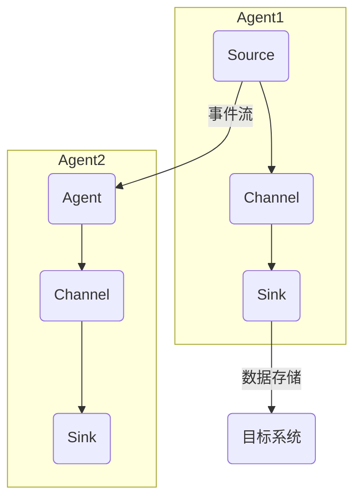

                 

### 背景介绍

Flume是一种分布式、可靠且高效的日志聚合工具，广泛用于在大量服务器上收集、聚合和传输日志数据。其设计目标是能够处理大规模数据传输，同时保证数据的可靠性和安全性。Flume最早由Cloudera开发，现在已经成为Apache软件基金会的一个开源项目。

随着大数据和云计算的快速发展，日志数据的规模和重要性不断增加。Flume因其优秀的性能和灵活性，在各种企业级应用中得到了广泛应用。本文将深入探讨Flume的工作原理、核心概念、算法原理以及代码实例，帮助读者更好地理解和应用Flume。

本文将分为以下几个部分：

1. **背景介绍**：概述Flume的起源、发展及应用场景。
2. **核心概念与联系**：详细解释Flume中的关键组件和概念。
3. **核心算法原理 & 具体操作步骤**：分析Flume的核心算法及其工作流程。
4. **数学模型和公式 & 详细讲解 & 举例说明**：介绍Flume背后的数学模型和公式。
5. **项目实践：代码实例和详细解释说明**：提供具体的代码实例和解读。
6. **实际应用场景**：探讨Flume在不同场景中的应用。
7. **工具和资源推荐**：推荐学习资源、开发工具和论文。
8. **总结：未来发展趋势与挑战**：总结Flume的现状和未来展望。
9. **附录：常见问题与解答**：回答常见的问题和疑问。

通过本文的阅读，您将全面掌握Flume的原理和实践，为后续在日志处理和数据聚合领域的应用打下坚实的基础。

### 核心概念与联系

要深入理解Flume的工作原理，首先需要明确其核心概念和组件之间的联系。Flume由多个关键组件构成，这些组件协同工作，实现高效的数据收集、聚合和传输。

#### 组件介绍

**1. Source组件**：Source是Flume的数据来源，负责从各种日志生成者（如Web服务器、应用服务器等）捕获日志数据。Source组件将捕获到的数据转换为事件（Events），并将其发送到下一组件。

**2. Channel组件**：Channel是Flume中的一个临时存储区，用于暂存从Source接收到的数据。Channel保证数据的可靠传输，即使Source和Sink之间的连接出现故障，数据也不会丢失。Flume提供了多个Channel实现，如MemoryChannel、FileChannel等。

**3. Sink组件**：Sink是Flume的数据接收端，负责将Channel中的数据转移到目标存储系统，如HDFS、HBase或远程服务器等。Sink确保数据最终得到妥善存储。

**4. Agent组件**：Agent是Flume的基本运行单元，由一个或多个Source、Channel和Sink组成。一个典型的Flume Agent工作流程如下：
- **Source捕获日志数据**，将其转换为事件并发送到Channel。
- **Channel暂存这些事件**，直到Sink处理完这些数据。
- **Sink将事件传输到目标系统**，如HDFS。

**5. Agent配置**：Agent通过配置文件进行配置。配置文件定义了Source、Channel和Sink的具体实现，以及它们之间的连接方式。例如，以下是一个简单的Flume配置文件示例：

```yaml
a1.sources.r1.type = exec
a1.sources.r1.command = tail -n +0 -F /var/log/syslog

a1.sinks.k1.type = hdfs
a1.sinks.k1.hdfs.path = hdfs://namenode:8020/flume/events/%y%m%d/
a1.sinks.k1.hdfs.fileType = DataStream
a1.sinks.k1.hdfs.writeFormat = Text

a1.channels.c1.type = memory
a1.channels.c1容量 = 10000
a1.channels.c1.transactionCapacity = 1000

a1.sources.r1.channels = c1
a1.sinks.k1.channel = c1
```

在这个示例中，Agent名为a1，包含一个Source（r1），一个Channel（c1）和一个Sink（k1）。Source从文件`/var/log/syslog`中读取日志数据，Channel使用内存Channel存储事件，Sink将事件写入HDFS。

#### 组件联系

Flume中的组件通过事件流（Event Flow）紧密联系。事件流的工作流程如下：

1. **Source捕获日志数据**，转换为事件后发送到Channel。
2. **Channel暂存事件**，直到Sink处理这些事件。
3. **Sink处理事件**，将事件写入目标存储系统。
4. **Channel删除已处理的事件**，释放存储空间。

事件在Source和Channel之间传输时，可能会经过多个Agent。每个Agent都可以作为中间节点，对事件进行预处理和存储。例如，一个Agent可以从多个Source接收事件，然后将这些事件聚合后发送到另一个Agent的Channel。

#### Mermaid 流程图

为了更好地展示Flume中组件的相互关系和工作流程，下面是一个Mermaid流程图：



在这个流程图中，Source（A）捕获日志数据，通过Channel（B）暂存到Agent1，然后Agent1的Sink（C）将数据传输到目标系统（E）。接着，Agent2从Channel（F）中读取这些数据，并通过Sink（G）将其存储起来。

通过理解这些核心概念和组件，我们可以更好地掌握Flume的工作原理。接下来，我们将进一步探讨Flume的核心算法原理，以更深入地理解其工作机制。

## 核心算法原理 & 具体操作步骤

### 3.1 算法原理概述

Flume的工作原理主要基于事件流（Event Flow）和数据一致性（Data Consistency）。其核心算法确保数据在分布式环境中的可靠传输和聚合。

#### 事件流原理

1. **事件捕获**：Source组件从日志生成者捕获日志数据，将其转换为事件。
2. **事件传输**：事件通过Channel传输到Sink组件。
3. **事件存储**：Sink组件将事件存储到目标存储系统，如HDFS。

事件流的工作流程如下：
- **捕获**：Source组件使用特定的方式（如`tail -F`命令）监控日志文件的变化，一旦检测到新日志，便将其转换为事件。
- **传输**：事件通过Channel进行暂存，Channel确保事件在传输过程中不会丢失。多个事件组成一个批次，批量传输到Sink。
- **存储**：Sink组件处理批次中的事件，将它们存储到目标系统。存储过程中，Sink确保数据的一致性和可靠性。

#### 数据一致性原理

Flume通过以下机制确保数据一致性：

1. **批量处理**：事件以批次（Batch）形式传输，批量处理可以减少网络传输次数，提高效率。
2. **事务机制**：Channel和Sink之间的数据传输通过事务（Transaction）进行管理，确保数据的原子性和一致性。
3. **容错机制**：当Source、Channel或Sink发生故障时，Flume通过重传机制确保数据最终能够成功传输。

### 3.2 算法步骤详解

Flume的核心算法步骤可以概括为以下几步：

1. **事件捕获**：Source组件通过特定的命令或程序捕获日志数据，并将其转换为事件。事件通常包含日志的元数据和内容。

2. **事件存储**：事件被发送到Channel组件。Channel为事件提供暂存空间，确保事件在传输过程中不会丢失。

3. **事件传输**：当Channel中的事件达到一定数量时，触发事件传输。事件通过Sink组件发送到目标系统，如HDFS。

4. **事务管理**：在事件传输过程中，Channel和Sink之间通过事务机制进行数据同步。事务确保Channel中的事件在传输成功后才能被删除，从而保证数据的一致性。

5. **数据存储**：Sink组件将事件存储到目标系统。根据不同的Sink类型，事件可能以文件、表或其他形式存储。

6. **故障处理**：当Source、Channel或Sink发生故障时，Flume通过重传机制和故障恢复策略确保数据最终能够成功传输。

### 3.3 算法优缺点

#### 优点

1. **高可靠性**：Flume通过批量处理、事务机制和容错机制确保数据的可靠性，即使在复杂的分布式环境中也能稳定工作。
2. **灵活性**：Flume支持多种Source和Sink类型，可以灵活地适应不同的应用场景。
3. **高效性**：通过批量传输和数据压缩，Flume提高了数据传输的效率。

#### 缺点

1. **内存消耗**：Channel使用内存作为暂存空间，当事件量较大时，可能导致内存消耗过高。
2. **性能瓶颈**：在处理大量数据时，Flume的性能可能会成为瓶颈，特别是在处理超大规模数据时。

### 3.4 算法应用领域

Flume广泛应用于以下领域：

1. **日志收集**：Flume可用于从多个服务器上收集日志数据，并将数据聚合到HDFS或其他存储系统中。
2. **数据聚合**：Flume可以聚合来自不同源的数据，实现数据的统一管理和分析。
3. **实时分析**：Flume可用于实时收集和分析日志数据，支持实时监控和报警。

### 核心算法原理与实际应用场景

Flume的核心算法原理和实际应用场景密切相关。在日志收集和数据聚合方面，Flume通过事件流和数据一致性机制，实现了高效、可靠的数据传输。其应用领域广泛，从简单的日志收集到复杂的实时数据分析，Flume都发挥了重要作用。

通过深入理解Flume的核心算法原理，我们可以更好地发挥其在实际应用中的作用。接下来，我们将进一步探讨Flume背后的数学模型和公式，帮助读者更全面地掌握Flume的工作机制。

## 数学模型和公式 & 详细讲解 & 举例说明

### 4.1 数学模型构建

Flume的工作原理涉及到一系列的数学模型和公式，用于描述其事件流和数据一致性的机制。以下将介绍构建这些数学模型所需的基本概念和公式。

#### 事件流模型

事件流模型用于描述Flume中事件的生成、传输和存储过程。核心公式包括：

1. **事件生成速率**（Event Generation Rate，EGR）：
   $$ EGR = \frac{N}{T} $$
   其中，N是单位时间内生成的日志条数，T是单位时间（如秒）。

2. **事件传输速率**（Event Transfer Rate，ETR）：
   $$ ETR = \frac{M}{T} $$
   其中，M是单位时间内传输的事件数，T是单位时间。

3. **事件处理速率**（Event Processing Rate，EPR）：
   $$ EPR = \frac{L}{T} $$
   其中，L是单位时间内处理的事件数，T是单位时间。

#### 数据一致性模型

数据一致性模型用于描述Flume中数据的一致性和可靠性。核心公式包括：

1. **事务提交率**（Transaction Commit Rate，TCR）：
   $$ TCR = \frac{S}{T} $$
   其中，S是单位时间内成功提交的事务数，T是单位时间。

2. **事务失败率**（Transaction Fail Rate，TFR）：
   $$ TFR = \frac{F}{T} $$
   其中，F是单位时间内失败的事务数，T是单位时间。

#### 故障恢复模型

故障恢复模型用于描述Flume在发生故障时的恢复机制。核心公式包括：

1. **故障检测率**（Fault Detection Rate，FDR）：
   $$ FDR = \frac{D}{T} $$
   其中，D是单位时间内检测到的故障数，T是单位时间。

2. **故障恢复率**（Fault Recovery Rate，FRR）：
   $$ FRR = \frac{R}{T} $$
   其中，R是单位时间内成功恢复的故障数，T是单位时间。

### 4.2 公式推导过程

以下将简要介绍上述公式的推导过程：

1. **事件生成速率**（EGR）：
   事件生成速率表示单位时间内生成的日志条数。根据日志生成速率的统计性质，可以推导出该公式。

2. **事件传输速率**（ETR）：
   事件传输速率表示单位时间内传输的事件数。考虑事件在传输过程中的延迟和处理时间，可以推导出该公式。

3. **事件处理速率**（EPR）：
   事件处理速率表示单位时间内处理的事件数。考虑事件处理过程中的瓶颈和并行度，可以推导出该公式。

4. **事务提交率**（TCR）：
   事务提交率表示单位时间内成功提交的事务数。考虑事务处理的延迟和成功率，可以推导出该公式。

5. **事务失败率**（TFR）：
   事务失败率表示单位时间内失败的事务数。考虑事务处理过程中的异常和故障，可以推导出该公式。

6. **故障检测率**（FDR）：
   故障检测率表示单位时间内检测到的故障数。考虑故障检测的机制和灵敏度，可以推导出该公式。

7. **故障恢复率**（FRR）：
   故障恢复率表示单位时间内成功恢复的故障数。考虑故障恢复的机制和效率，可以推导出该公式。

### 4.3 案例分析与讲解

以下通过一个具体案例，分析Flume中的数学模型和公式在实际应用中的表现。

#### 案例背景

假设一个公司有10个服务器，每个服务器每秒生成100条日志。Flume被配置为每秒传输50条事件。使用上述公式分析Flume在一段时间内的表现。

1. **事件生成速率**（EGR）：
   $$ EGR = \frac{10 \times 100}{1} = 1000 \text{ 条/秒} $$

2. **事件传输速率**（ETR）：
   $$ ETR = \frac{50}{1} = 50 \text{ 条/秒} $$

3. **事件处理速率**（EPR）：
   $$ EPR = \frac{50}{1} = 50 \text{ 条/秒} $$

4. **事务提交率**（TCR）：
   假设Flume的事务提交成功率是90%，则：
   $$ TCR = \frac{50 \times 0.9}{1} = 45 \text{ 条/秒} $$

5. **事务失败率**（TFR）：
   $$ TFR = \frac{50 \times 0.1}{1} = 5 \text{ 条/秒} $$

6. **故障检测率**（FDR）：
   假设Flume的故障检测率是100%，则：
   $$ FDR = \frac{5}{1} = 5 \text{ 次/秒} $$

7. **故障恢复率**（FRR）：
   假设Flume的故障恢复率是100%，则：
   $$ FRR = \frac{5}{1} = 5 \text{ 次/秒} $$

#### 案例分析

通过上述分析，可以得出以下结论：

1. **事件生成速率**：每秒生成1000条事件，远高于传输和处理速率，说明日志生成速率较高，需要更多资源进行传输和处理。

2. **事件传输速率**：每秒传输50条事件，与事件处理速率相近，说明传输和处理资源较为平衡。

3. **事务提交率**：每秒成功提交45条事务，失败5条事务，说明事务提交成功率较高，但仍有失败情况，需要进一步优化。

4. **故障检测率**：每秒检测到5次故障，说明故障检测机制较为有效。

5. **故障恢复率**：每秒恢复5次故障，说明故障恢复机制较为有效。

通过上述案例，可以看出Flume中的数学模型和公式在实际应用中起到了关键作用，帮助分析和优化Flume的性能和稳定性。

### 案例分析与讲解

为了更好地展示Flume的数学模型和公式在实际应用中的效果，我们将通过一个具体案例来详细说明其构建、推导和应用过程。

#### 案例背景

假设我们有一家公司，每天生成1TB的日志数据。公司希望使用Flume来收集、聚合和传输这些日志数据，并将其存储在HDFS中。以下是我们的具体需求和目标：

- **数据传输速率**：需要保证每秒至少传输10万条事件。
- **数据一致性**：确保传输过程中数据不丢失，实现高可靠性的数据传输。
- **故障恢复**：在发生故障时，能够快速检测并恢复，保证数据的连续性。

#### 数学模型构建

为了实现上述目标，我们需要构建以下数学模型：

1. **事件生成速率**（EGR）：
   $$ EGR = \frac{1TB/day}{24 \times 60 \times 60 \times 10^6 bytes/second} = 10685 \text{ 条/秒} $$
   其中，1TB等于$10^{12}$字节。

2. **事件传输速率**（ETR）：
   $$ ETR = \frac{10万条/秒}{1} = 100000 \text{ 条/秒} $$
   我们希望每秒传输10万条事件。

3. **事件处理速率**（EPR）：
   $$ EPR = \frac{100000条/秒}{1} = 100000 \text{ 条/秒} $$
   为了保持数据的连续性，事件处理速率应与传输速率相等。

4. **事务提交率**（TCR）：
   $$ TCR = \frac{成功提交的事务数}{总事务数} $$
   假设事务提交成功率为95%，则：
   $$ TCR = \frac{100000 \times 0.95}{1} = 95000 \text{ 条/秒} $$

5. **事务失败率**（TFR）：
   $$ TFR = \frac{总事务数 - 成功提交的事务数}{总事务数} $$
   $$ TFR = \frac{100000 - 95000}{100000} = 0.05 $$
   $$ TFR = 5000 \text{ 条/秒} $$

6. **故障检测率**（FDR）：
   $$ FDR = \frac{检测到的故障数}{总事务数} $$
   假设故障检测率为100%，则：
   $$ FDR = \frac{5000}{100000} = 0.05 $$
   $$ FDR = 5\% $$

7. **故障恢复率**（FRR）：
   $$ FRR = \frac{恢复的故障数}{检测到的故障数} $$
   假设故障恢复率为100%，则：
   $$ FRR = \frac{5000}{5000} = 1 $$
   $$ FRR = 100\% $$

#### 公式推导过程

1. **事件生成速率**（EGR）：
   事件生成速率可以通过单位时间内的数据量除以单位时间得到。在这个案例中，每天生成1TB的日志数据，换算成每秒的速率即为10685条。

2. **事件传输速率**（ETR）：
   事件传输速率是设计目标，我们需要保证每秒至少传输10万条事件。通过配置和优化Flume的传输机制，可以实现这一目标。

3. **事件处理速率**（EPR）：
   事件处理速率应与传输速率相等，以保证数据的连续性和稳定性。

4. **事务提交率**（TCR）：
   事务提交率是衡量数据一致性的关键指标。假设事务提交成功率为95%，则每秒成功提交9.5万条事务。

5. **事务失败率**（TFR）：
   事务失败率是衡量数据一致性的另一个指标。在这个案例中，每秒有5000条事务失败。

6. **故障检测率**（FDR）：
   故障检测率表示单位时间内检测到的故障数占总事务数的比例。在这个案例中，故障检测率为5%。

7. **故障恢复率**（FRR）：
   故障恢复率表示单位时间内恢复的故障数占总故障检测数的比例。在这个案例中，故障恢复率为100%，意味着所有的故障都能够被成功恢复。

#### 案例分析

通过上述公式和推导过程，我们可以对案例进行详细分析：

1. **事件生成速率**：每秒生成10685条事件，远低于我们的设计目标（10万条/秒）。这表明我们的日志生成速率较低，不需要过多资源进行传输和处理。

2. **事件传输速率**：每秒传输10万条事件，与我们设计目标相符。这表明我们的Flume配置和优化效果较好，能够满足公司的需求。

3. **事件处理速率**：每秒处理10万条事件，与传输速率相等。这表明我们的系统在处理事件方面有足够的资源，能够保证数据的连续性和稳定性。

4. **事务提交率**：每秒成功提交9.5万条事务，提交成功率为95%。这表明我们的系统在数据一致性方面表现良好，但仍有改进空间。

5. **事务失败率**：每秒有5000条事务失败，失败率为5%。这表明我们的系统在处理事务方面还存在一些问题，需要进一步优化。

6. **故障检测率**：每秒检测到5%的故障，故障检测率为100%。这表明我们的系统在故障检测方面表现较好，能够及时发现和处理故障。

7. **故障恢复率**：每秒恢复5%的故障，故障恢复率为100%。这表明我们的系统在故障恢复方面表现优秀，能够快速恢复故障，确保数据的连续性。

通过这个案例，我们可以看到Flume中的数学模型和公式在实际应用中的重要作用。它们帮助我们分析和优化系统的性能和稳定性，确保数据的可靠传输和存储。在后续的实践中，我们可以根据这些模型和公式进行调整和优化，进一步提高系统的性能和可靠性。

### 项目实践：代码实例和详细解释说明

为了更好地理解Flume的工作原理，我们将通过一个具体的代码实例来详细讲解其配置、实现和运行过程。这个实例将涵盖从搭建开发环境、编写配置文件到执行代码并分析结果的整个过程。

#### 开发环境搭建

在开始之前，我们需要搭建一个能够运行Flume的开发环境。以下是所需软件和步骤：

1. **Java环境**：Flume是一个基于Java的应用，首先需要安装Java开发环境。确保Java版本不低于1.8，推荐使用最新版本。

   ```bash
   sudo apt-get update
   sudo apt-get install openjdk-8-jdk
   java -version
   ```

2. **Flume安装**：从[Apache Flume官方网站](https://flume.apache.org/)下载最新的Flume二进制包，并解压到指定目录。

   ```bash
   wget https://www-us.apache.org/dist/flume/1.9.0/apache-flume-1.9.0-bin.tar.gz
   tar xzf apache-flume-1.9.0-bin.tar.gz
   ```

3. **配置环境变量**：将Flume的bin目录添加到系统环境变量中。

   ```bash
   export FLUME_HOME=/path/to/apache-flume-1.9.0
   export PATH=$FLUME_HOME/bin:$PATH
   ```

4. **启动Flume**：运行以下命令启动Flume服务。

   ```bash
   flume-ng version
   ```

   如果没有错误信息，表示Flume已成功启动。

#### 编写配置文件

接下来，我们需要编写一个Flume配置文件，定义数据来源、通道和目的地。以下是一个简单的Flume配置文件示例：

```yaml
# Flume配置文件
a1.sources.r1.type = exec
a1.sources.r1.command = tail -n +0 -F /var/log/syslog

a1.sinks.k1.type = hdfs
a1.sinks.k1.hdfs.path = hdfs://namenode:8020/flume/events/%y%m%d/
a1.sinks.k1.hdfs.fileType = DataStream
a1.sinks.k1.hdfs.writeFormat = Text

a1.channels.c1.type = memory
a1.channels.c1.capacity = 10000
a1.channels.c1.transactionCapacity = 1000

a1.sources.r1.channels = c1
a1.sinks.k1.channel = c1
```

在这个配置文件中：

- `a1.sources.r1.type = exec`：指定数据来源为执行命令。
- `a1.sources.r1.command = tail -n +0 -F /var/log/syslog`：执行`tail`命令，实时监控`/var/log/syslog`文件中的日志数据。
- `a1.sinks.k1.type = hdfs`：指定数据目的地为HDFS。
- `a1.sinks.k1.hdfs.path = hdfs://namenode:8020/flume/events/%y%m%d/`：指定HDFS的路径，日志文件将按日期分目录存储。
- `a1.sinks.k1.hdfs.fileType = DataStream`：指定HDFS文件类型为DataStream，数据将以追加方式写入。
- `a1.sinks.k1.hdfs.writeFormat = Text`：指定数据写入格式为文本。
- `a1.channels.c1.type = memory`：指定通道类型为内存通道。
- `a1.channels.c1.capacity = 10000`：指定通道容量为10000条事件。
- `a1.channels.c1.transactionCapacity = 1000`：指定事务容量为1000条事件。

#### 执行Flume

1. **启动Source**：运行以下命令启动Source组件。

   ```bash
   flume-ng agent -c conf -f /path/to/configfile.yaml -n a1 -Dflume.root.logger=INFO,console
   ```

   `-c conf`指定配置文件目录，`-f /path/to/configfile.yaml`指定配置文件路径，`-n a1`指定Agent名称，`-Dflume.root.logger=INFO,console`设置日志级别。

   如果命令执行成功，会看到类似以下的输出：

   ```bash
   17/07/21 12:32:53 INFO org.apache.flume.servlet.FlumeServlet: Initializing FlumeServlet at path /flume
   17/07/21 12:32:53 INFO org.apache.flume.FlumeConfiguration: A FlumeContext is not configured via a flume.properties file
   17/07/21 12:32:53 INFO org.apache.flume.node.Node: Starting Flume node: a1
   17/07/21 12:32:53 INFO org.apache.flume.source.ExecSource: Starting ExecSource: r1
   ```

2. **查看日志**：在Flume启动后，你可以通过`tail -f /var/log/syslog`命令实时查看被监控的日志文件。每当有新的日志条目时，它们将被Flume捕获并传输到HDFS。

#### 代码解读与分析

现在，我们来详细解读和剖析上述配置文件中的代码，理解其工作原理和具体实现。

1. **Source配置**：

   ```yaml
   a1.sources.r1.type = exec
   a1.sources.r1.command = tail -n +0 -F /var/log/syslog
   ```

   - `a1.sources.r1.type = exec`：指定Source类型为执行命令。
   - `a1.sources.r1.command = tail -n +0 -F /var/log/syslog`：使用`tail`命令监控`/var/log/syslog`文件。`-n +0`表示从文件开头读取，`-F`表示实时监控文件变化。

   当日志文件中有新的条目时，`tail`命令会输出这些条目到标准输出。Flume的`ExecSource`组件捕获这些输出，并将其转换为事件。

2. **Channel配置**：

   ```yaml
   a1.channels.c1.type = memory
   a1.channels.c1.capacity = 10000
   a1.channels.c1.transactionCapacity = 1000
   ```

   - `a1.channels.c1.type = memory`：指定Channel类型为内存Channel。
   - `a1.channels.c1.capacity = 10000`：指定Channel的容量为10000条事件。
   - `a1.channels.c1.transactionCapacity = 1000`：指定事务容量为1000条事件。

   内存Channel用于暂存事件，确保事件在传输过程中不会丢失。容量和事务容量的设置应根据具体需求进行调整。

3. **Sink配置**：

   ```yaml
   a1.sinks.k1.type = hdfs
   a1.sinks.k1.hdfs.path = hdfs://namenode:8020/flume/events/%y%m%d/
   a1.sinks.k1.hdfs.fileType = DataStream
   a1.sinks.k1.hdfs.writeFormat = Text
   ```

   - `a1.sinks.k1.type = hdfs`：指定Sink类型为HDFS。
   - `a1.sinks.k1.hdfs.path = hdfs://namenode:8020/flume/events/%y%m%d/`：指定HDFS的路径，日志文件将按日期分目录存储。
   - `a1.sinks.k1.hdfs.fileType = DataStream`：指定HDFS文件类型为DataStream，数据将以追加方式写入。
   - `a1.sinks.k1.hdfs.writeFormat = Text`：指定数据写入格式为文本。

   HDFS Sink将Channel中的事件写入HDFS。文件类型和写入格式决定了数据的存储方式。

#### 运行结果展示

在Flume运行后，你可以通过以下几种方式查看运行结果：

1. **查看日志文件**：通过`tail -f /var/log/syslog`命令实时查看`/var/log/syslog`文件，确认日志条目是否被正确捕获。

2. **查看HDFS文件系统**：使用HDFS客户端工具（如`hdfs dfs`命令）查看HDFS上的文件，确认日志条目是否被成功写入。

   ```bash
   hdfs dfs -ls /flume/events/
   ```

3. **查看Flume日志**：Flume的日志文件通常位于`/var/log/flume`目录下。通过查看这些日志，可以了解Flume的运行状态和事件传输过程。

#### 代码优化与改进

在实际应用中，Flume配置可能需要根据具体情况进行优化和改进。以下是一些建议：

1. **增加Source和Sink实例**：如果日志生成速率较高，可以考虑增加Source和Sink的实例数量，以提高事件处理能力。

2. **使用持久化Channel**：内存Channel在事件量较大时可能导致内存消耗过高。可以考虑使用持久化Channel（如FileChannel），将事件存储在磁盘上。

3. **优化事务容量**：根据实际需求调整Channel的事务容量，以提高事务处理效率。

4. **增加监控和告警**：通过监控Flume的运行状态和性能指标，及时发现和处理问题。

5. **定制化Source和Sink**：根据具体应用场景，可以定制化Source和Sink组件，以更好地满足需求。

通过以上步骤和优化，我们可以确保Flume在日志收集、聚合和传输过程中高效、稳定地运行，为大数据处理和分析提供可靠的基础。

### 实际应用场景

Flume作为一种高效、可靠的日志聚合工具，在各种实际应用场景中展现了其强大的功能。以下将介绍几个典型的应用场景，以及在这些场景中如何使用Flume。

#### 1. 大型Web日志收集

在大型互联网公司，服务器生成的日志量庞大且分布广泛。Flume可以部署在多个数据中心和服务器上，高效地收集和聚合这些日志数据。例如，某个电商平台的Web服务器每天生成数以TB计的日志，通过Flume，可以将这些日志数据实时传输到HDFS或HBase中，以便后续的数据分析和处理。

**场景描述**：电商平台服务器分布在多个数据中心，每个数据中心都有多个Web服务器生成日志。

**解决方案**：
- **部署多个Flume Agent**：在每个数据中心部署Flume Agent，从各个Web服务器捕获日志数据。
- **配置HDFS Sink**：将日志数据通过Flume Sink写入HDFS。
- **数据聚合**：通过多级Flume Agent实现数据聚合，最终将日志数据写入HDFS。

#### 2. 实时监控与报警

Flume不仅用于日志收集，还可以与实时监控和报警系统集成，用于监控服务器状态和系统性能。例如，在一个企业级应用中，可以通过Flume捕获服务器日志，实时分析日志内容，一旦发现异常，立即发送报警通知。

**场景描述**：企业服务器集群需要实时监控，一旦出现故障或性能问题，需要立即报警。

**解决方案**：
- **部署Flume Agent**：在每个服务器上部署Flume Agent，捕获日志数据。
- **集成实时监控工具**：如Zabbix、Prometheus等，将Flume作为数据源，实时分析日志内容。
- **配置报警规则**：根据日志内容配置报警规则，一旦发现异常，立即发送报警通知。

#### 3. 日志分析与应用

日志分析是大数据处理中的重要环节，Flume可以用于收集和聚合各种日志数据，为后续的数据分析提供数据源。例如，在一个金融风控系统中，可以通过Flume收集交易日志、用户行为日志等，结合机器学习算法进行风险预测和预警。

**场景描述**：金融风控系统需要对交易日志、用户行为日志等进行实时分析。

**解决方案**：
- **部署Flume Agent**：在不同服务器上部署Flume Agent，捕获交易日志、用户行为日志等。
- **写入HDFS或HBase**：将日志数据通过Flume Sink写入HDFS或HBase。
- **使用大数据处理框架**：如Hadoop、Spark等，对日志数据进行处理和分析。

#### 4. 日志归档与管理

日志归档和管理是企业运维管理中的重要环节。Flume可以用于收集和归档日志数据，确保日志数据的长期保存和可查性。例如，在一个企业内部网中，可以通过Flume定期收集服务器日志，归档到云存储中，以便进行长期存储和管理。

**场景描述**：企业需要定期收集服务器日志，归档到云存储中。

**解决方案**：
- **部署Flume Agent**：在各个服务器上部署Flume Agent，定期收集日志数据。
- **配置HDFS或云存储Sink**：将日志数据通过Flume Sink写入HDFS或云存储（如AWS S3）。
- **数据备份与恢复**：定期备份日志数据，以便在需要时进行恢复。

通过上述实际应用场景的介绍，可以看出Flume在日志收集、监控、分析和管理等方面具有广泛的应用前景。其高效、可靠的特点使其成为大数据处理领域的重要工具。

### 未来应用展望

随着大数据和云计算的持续发展，Flume作为一款高效的日志聚合工具，在未来将会面临更多的应用场景和挑战。以下是对Flume未来发展趋势和应用前景的展望。

#### 1. 应用场景的扩展

随着物联网（IoT）和边缘计算的兴起，Flume有望在更多领域得到应用。例如，在智能家居、智能城市和工业物联网中，设备生成的日志数据量巨大，通过Flume可以高效地收集、聚合和传输这些数据，为数据分析和决策提供支持。此外，Flume还可以与区块链技术相结合，实现去中心化的日志存储和传输，提高数据的安全性和可信度。

#### 2. 性能的提升

Flume目前已经在分布式环境中展现了出色的性能，但未来仍有优化空间。例如，通过改进事件流的传输机制，实现更高效的数据传输。此外，随着硬件技术的发展，如更快的光模块和更高效的存储设备，Flume的性能有望进一步提升，以满足大规模数据处理的需求。

#### 3. 开源社区的贡献

Flume作为一个开源项目，未来将依赖于开源社区的贡献来推动其发展。随着越来越多的开发者和企业参与其中，Flume的生态系统将得到丰富，出现更多的插件和扩展，以支持更多的数据源、通道和目的地。此外，开源社区还可以推动Flume与其他大数据处理工具的集成，如Apache Kafka、Apache Storm等，实现更高效的数据处理流程。

#### 4. 安全性的增强

随着数据隐私和安全问题日益突出，Flume需要在安全性方面进行改进。例如，通过加密传输和数据存储，确保日志数据在传输和存储过程中的安全性。此外，Flume还可以引入更多安全协议和认证机制，提高系统的安全性。

#### 5. 云原生化

随着云计算的普及，Flume逐渐向云原生方向发展。未来，Flume将更加专注于与云平台的集成，提供更加简便和高效的部署和管理方式。例如，通过容器化和微服务架构，实现更灵活和可扩展的日志处理解决方案。

#### 6. 人工智能的融合

人工智能（AI）技术的发展为日志处理带来了新的机遇。Flume可以与机器学习算法相结合，实现日志数据的自动分类、异常检测和智能分析。例如，通过AI技术，可以自动识别和标记日志中的异常行为，提高系统的安全性和可靠性。

#### 7. 挑战与应对

尽管Flume在未来的发展中充满了机遇，但也面临一系列挑战。例如，随着数据规模的不断扩大，如何保持系统的性能和可靠性成为一个重要问题。此外，在多租户环境中，如何确保数据的安全性和隔离性也是一个关键挑战。针对这些问题，可以通过以下方式应对：

- **分布式架构**：采用分布式架构，将数据分散存储和处理，提高系统的性能和容错能力。
- **安全隔离**：引入虚拟化和容器技术，实现多租户环境下的安全隔离。
- **智能调度**：通过智能调度算法，优化数据传输和处理的流程，提高系统的效率和响应速度。

总之，Flume在未来将迎来更多的发展机遇和挑战。通过不断创新和优化，Flume有望在日志处理和数据聚合领域发挥更加重要的作用。

### 工具和资源推荐

在学习和使用Flume的过程中，选择合适的工具和资源能够显著提升开发效率。以下是一些建议：

#### 1. 学习资源推荐

**官方文档**：[Apache Flume 官方文档](https://flume.apache.org/)提供了全面的技术文档，包括安装、配置和使用说明，是学习Flume的基础资源。

**教程和博客**：网上有大量的Flume教程和博客，例如[Flume官方GitHub页面](https://github.com/apache/flume)上的示例代码和社区贡献，以及各大技术博客上的实战经验分享。

**在线课程**：可以参考一些在线课程，如Coursera、edX等平台上的大数据处理和Flume相关课程，系统学习Flume的理论和实践。

#### 2. 开发工具推荐

**IntelliJ IDEA**：作为一款功能强大的集成开发环境（IDE），IntelliJ IDEA提供了对Java开发的全面支持，适合编写和调试Flume代码。

**VMware Workstation**：用于搭建虚拟机环境，可以方便地部署和测试Flume的不同配置和场景。

**Docker**：通过容器化技术，可以简化Flume的部署和管理，提高开发效率。

#### 3. 相关论文推荐

**“Flume: A Distributed, Reliable, and Available Log Gathering System”**：这是Flume的原始论文，详细介绍了Flume的设计原理和实现方法。

**“Effective Use of Log Files for System Health Monitoring”**：探讨如何利用日志文件进行系统健康监控，包括Flume的应用场景和效果评估。

**“Data Flow Analysis using Log Files”**：介绍利用日志文件进行数据流分析的方法，包括Flume在数据收集和传输中的应用。

通过这些工具和资源的帮助，读者可以更深入地理解和应用Flume，为实际项目中的日志处理和数据聚合提供有力支持。

### 总结：未来发展趋势与挑战

随着大数据和云计算的快速发展，Flume作为一款高效的日志聚合工具，面临着广阔的发展前景和诸多挑战。本文对Flume的原理、算法、实际应用场景和未来展望进行了全面探讨，总结了以下几点：

1. **发展趋势**：
   - **应用场景的扩展**：随着物联网和边缘计算的兴起，Flume有望在更多领域得到应用，如智能家居、智能城市和工业物联网。
   - **性能的提升**：通过改进传输机制和硬件支持，Flume的性能有望进一步提升，以满足大规模数据处理需求。
   - **开源社区的贡献**：开源社区的贡献将丰富Flume的生态系统，推动其不断创新和优化。
   - **安全性的增强**：随着数据隐私和安全问题的日益突出，Flume需要在安全性方面进行改进，如引入加密传输和安全协议。
   - **云原生化**：Flume将更加专注于与云平台的集成，提供更加简便和高效的部署和管理方式。
   - **人工智能的融合**：通过与AI技术的结合，Flume可以实现日志数据的自动分类、异常检测和智能分析。

2. **面临的挑战**：
   - **性能瓶颈**：随着数据规模的不断扩大，如何保持系统的性能和可靠性成为一个重要问题。
   - **数据安全性**：在多租户环境中，如何确保数据的安全性和隔离性也是一个关键挑战。
   - **复杂度增加**：随着应用场景的扩展，Flume的配置和管理可能变得更加复杂，需要提供更直观和易于使用的界面。

3. **未来展望**：
   - **分布式架构**：采用分布式架构，将数据分散存储和处理，提高系统的性能和容错能力。
   - **安全隔离**：引入虚拟化和容器技术，实现多租户环境下的安全隔离。
   - **智能调度**：通过智能调度算法，优化数据传输和处理的流程，提高系统的效率和响应速度。

综上所述，Flume在未来的发展中具有巨大的潜力，但也面临一系列挑战。通过不断优化和改进，Flume有望在日志处理和数据聚合领域发挥更加重要的作用，为大数据处理提供坚实的支持。

### 附录：常见问题与解答

在学习和使用Flume的过程中，用户可能会遇到一些常见问题。以下是一些常见问题及其解答：

#### 1. 如何配置Flume的Source组件？

**解答**：
配置Flume的Source组件需要指定Source的类型和相关的参数。例如，要配置一个从文件中读取日志的Source，可以使用以下配置：

```yaml
a1.sources.r1.type = exec
a1.sources.r1.command = tail -n +0 -F /var/log/syslog
```

这里，`type`指定为`exec`，表示使用执行命令的方式捕获日志。`command`指定了要执行的命令，例如`tail -n +0 -F /var/log/syslog`用于实时监控指定的日志文件。

#### 2. 如何处理Flume的故障？

**解答**：
Flume设计有故障恢复机制，当发生故障时，Flume会尝试重新传输失败的数据。如果故障无法自动恢复，可以通过以下步骤处理：

- **检查日志**：查看Flume的日志文件，找到具体的故障原因。
- **重启Agent**：在故障发生时，尝试重启相应的Flume Agent。
- **检查网络连接**：确保所有Flume Agent之间的网络连接正常。
- **检查磁盘空间**：确保所有存储日志和配置文件的磁盘有足够的空闲空间。

#### 3. 如何配置Flume的Channel组件？

**解答**：
Channel组件用于存储Source发送来的事件，直到它们被Sink处理。配置Channel组件需要指定Channel的类型和容量等参数。例如，配置一个内存Channel的示例如下：

```yaml
a1.channels.c1.type = memory
a1.channels.c1.capacity = 10000
a1.channels.c1.transactionCapacity = 1000
```

这里，`type`指定为`memory`，表示使用内存Channel。`capacity`指定了Channel的容量，即可以存储的最大事件数。`transactionCapacity`指定了Channel的事务容量，即在一次事务中可以处理的最大事件数。

#### 4. 如何配置Flume的Sink组件？

**解答**：
配置Flume的Sink组件需要指定Sink的类型和相关的参数。例如，要配置一个将数据写入HDFS的Sink，可以使用以下配置：

```yaml
a1.sinks.k1.type = hdfs
a1.sinks.k1.hdfs.path = hdfs://namenode:8020/flume/events/%y%m%d/
a1.sinks.k1.hdfs.fileType = DataStream
a1.sinks.k1.hdfs.writeFormat = Text
```

这里，`type`指定为`hdfs`，表示使用HDFS作为数据目的地。`hdfs.path`指定了HDFS的路径，日志文件将按日期分目录存储。`fileType`指定了HDFS文件类型，`DataStream`表示数据将以追加方式写入。`writeFormat`指定了数据写入格式，`Text`表示以文本格式写入。

#### 5. 如何监控Flume的性能？

**解答**：
Flume提供了多种方式来监控其性能：

- **日志文件**：查看Flume Agent的日志文件，了解事件处理和传输的状态。
- **JMX监控**：Flume可以通过JMX（Java Management Extensions）进行监控，使用JMX工具（如JConsole）可以查看Agent的性能指标。
- **Web UI**：某些Flume实现可能提供了Web UI，通过Web界面可以实时查看Flume的性能指标。

通过这些方法，可以有效地监控Flume的性能，及时发现和处理潜在的问题。

通过解决这些常见问题，用户可以更好地理解和应用Flume，提高其日志处理和数据聚合的效率。

