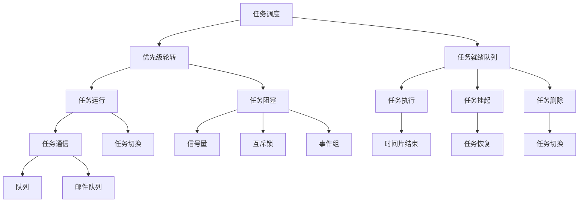

                 

关键词：FreeRTOS、任务调度、通信机制、实时操作系统、嵌入式系统、多任务处理

> 摘要：本文深入探讨FreeRTOS任务调度与通信机制。首先，介绍FreeRTOS的基本概念和实时操作系统的基本原理。随后，详细讲解FreeRTOS的任务调度策略和通信机制，并分析其优缺点和适用场景。此外，本文还通过具体实例，展示FreeRTOS在实际项目中的应用，以帮助读者更好地理解其工作原理。

## 1. 背景介绍

### 1.1 FreeRTOS概述

FreeRTOS是一款开源、免费、可定制的实时操作系统内核，广泛应用于嵌入式系统和物联网设备中。它是由英国公司Real Time Engineers Ltd.开发和维护的，拥有广泛的用户群体和丰富的文档支持。FreeRTOS具备轻量级、高效、可扩展等特点，能够满足多种嵌入式应用的实时性和性能需求。

### 1.2 实时操作系统

实时操作系统（Real-Time Operating System，RTOS）是一种专门为实时系统设计的高级操作系统。与常规操作系统相比，RTOS对任务的执行时间有严格的要求，必须在指定的时间内完成任务的执行。实时操作系统广泛应用于工业控制、汽车电子、医疗设备、航空航天等领域。

### 1.3 多任务处理

多任务处理是指计算机系统能够同时处理多个任务或进程。在嵌入式系统中，多任务处理可以提高系统的资源利用率和响应速度。FreeRTOS通过任务调度机制实现多任务处理，确保每个任务都能在规定的时间内得到执行。

## 2. 核心概念与联系

### 2.1 任务调度

任务调度是RTOS的核心功能之一，它负责将CPU时间分配给各个任务，以实现多任务处理。FreeRTOS采用基于优先级的轮转调度策略，每个任务根据其优先级分配到CPU时间片。当高优先级任务就绪时，它会抢占低优先级任务的CPU使用权。

### 2.2 通信机制

在多任务环境中，任务之间的通信和同步是至关重要的。FreeRTOS提供了多种通信机制，包括队列、信号量、互斥锁、事件组和邮件队列等。这些机制能够实现任务间的数据交换和同步，确保系统稳定运行。

### 2.3 Mermaid流程图

以下是一个简单的Mermaid流程图，展示了FreeRTOS任务调度和通信机制的核心节点：



## 3. 核心算法原理 & 具体操作步骤

### 3.1 算法原理概述

FreeRTOS任务调度算法基于优先级轮转策略，任务根据其优先级分配到CPU时间片。任务就绪队列按照优先级顺序排列，高优先级任务先执行。任务执行过程中，可能会发生任务切换、阻塞、挂起和删除等操作。

### 3.2 算法步骤详解

1. **任务创建**：创建任务时，需要指定任务的优先级、堆栈大小、任务代码等参数。任务创建成功后，会被添加到就绪队列。

2. **任务调度**：系统初始化时，会启动调度器。调度器负责在任务就绪队列中查找最高优先级任务，将其调度到CPU执行。

3. **任务执行**：高优先级任务获得CPU使用权后，执行任务代码。任务执行过程中，可能会访问共享资源，需要进行同步操作。

4. **任务切换**：当时间片用尽、任务主动放弃CPU使用权、有更高优先级任务就绪时，调度器会进行任务切换，将CPU使用权交给新任务。

5. **任务阻塞**：当任务等待某个事件（如信号量、队列）时，会进入阻塞状态。等待事件发生后，任务会重新进入就绪队列。

6. **任务挂起**：任务可以通过挂起自己或其他任务，实现对任务的临时控制。

7. **任务删除**：删除任务时，需要将任务从就绪队列中移除，并释放其占用的资源。

### 3.3 算法优缺点

**优点**：

1. **高效**：基于优先级的调度策略，能够保证高优先级任务优先执行，提高系统响应速度。
2. **灵活**：支持多种任务同步和通信机制，能够满足不同场景下的需求。
3. **开源**：作为开源软件，拥有广泛的用户群体和丰富的文档支持。

**缺点**：

1. **复杂度**：调度算法和通信机制相对复杂，需要一定的编程基础和经验。
2. **资源占用**：虽然FreeRTOS轻量级，但仍需占用一定的内存和CPU资源，可能不适合资源受限的嵌入式系统。

### 3.4 算法应用领域

FreeRTOS广泛应用于工业控制、智能家居、医疗设备、汽车电子、物联网等领域。以下是一些具体的实例：

1. **工业控制**：FreeRTOS用于实现数控机床、工业机器人等设备的实时控制。
2. **智能家居**：FreeRTOS用于实现智能门锁、智能家电等设备的互联互通。
3. **医疗设备**：FreeRTOS用于实现监护仪、医疗机器人等设备的实时数据采集和处理。
4. **汽车电子**：FreeRTOS用于实现车载信息娱乐系统、自动驾驶控制系统等。

## 4. 数学模型和公式 & 详细讲解 & 举例说明

### 4.1 数学模型构建

FreeRTOS任务调度算法的核心是优先级调度策略。假设系统中有n个任务，每个任务的优先级分别为\(P_1, P_2, ..., P_n\)，时间片长度为\(T\)。调度器按照以下公式计算每个任务的时间片：

$$
C_i = \left\{
\begin{array}{ll}
T & \text{if } P_i \geq P_{\text{max}} \\
\frac{T \cdot P_{\text{max}}}{P_i} & \text{otherwise}
\end{array}
\right.
$$

其中，\(P_{\text{max}}\)为最高优先级任务的优先级。

### 4.2 公式推导过程

假设系统中有n个任务，每个任务在时间\(t\)时刻的优先级分别为\(P_1(t), P_2(t), ..., P_n(t)\)。时间片长度为\(T\)。在时间\(t\)到\(t+T\)的时间段内，每个任务的时间片长度计算如下：

1. **最高优先级任务**：\(C_1 = T\)
2. **次高优先级任务**：\(C_2 = \frac{T \cdot P_{\text{max}}}{P_2(t)}\)
3. **其余任务**：\(C_i = \frac{T \cdot P_{\text{max}}}{P_i(t)}\)（\(i=3,4,...,n\)）

### 4.3 案例分析与讲解

假设系统中有4个任务，优先级分别为\(P_1 = 5, P_2 = 3, P_3 = 2, P_4 = 1\)。时间片长度为\(T = 5\)。

1. **初始时刻**：\(t = 0\)

- \(C_1 = 5\)
- \(C_2 = \frac{5 \cdot 5}{3} \approx 4.17\)
- \(C_3 = \frac{5 \cdot 5}{2} = 5\)
- \(C_4 = \frac{5 \cdot 5}{1} = 5\)

2. **时间\(t = 5\)时刻**

- \(C_1 = 5\)
- \(C_2 = \frac{5 \cdot 5}{3} \approx 4.17\)
- \(C_3 = \frac{5 \cdot 5}{2} = 5\)
- \(C_4 = \frac{5 \cdot 5}{1} = 5\)

3. **时间\(t = 10\)时刻**

- \(C_1 = 5\)
- \(C_2 = \frac{5 \cdot 5}{3} \approx 4.17\)
- \(C_3 = \frac{5 \cdot 5}{2} = 5\)
- \(C_4 = \frac{5 \cdot 5}{1} = 5\)

4. **时间\(t = 15\)时刻**

- \(C_1 = 5\)
- \(C_2 = \frac{5 \cdot 5}{3} \approx 4.17\)
- \(C_3 = \frac{5 \cdot 5}{2} = 5\)
- \(C_4 = \frac{5 \cdot 5}{1} = 5\)

根据上述计算，每个任务在每个时间片内的执行时间如下：

- 任务1：\(t = 0, 5, 10, 15, ...\)
- 任务2：\(t = 5, 9.17, 14.17, 19.17, ...\)
- 任务3：\(t = 10, 15, 20, 25, ...\)
- 任务4：\(t = 15, 20, 25, 30, ...\)

从上述计算可以看出，基于优先级的调度策略能够确保高优先级任务优先执行。

## 5. 项目实践：代码实例和详细解释说明

### 5.1 开发环境搭建

在Windows操作系统上，可以使用FreeRTOS的官方IDE——MCU Express进行开发。以下是搭建FreeRTOS开发环境的步骤：

1. 下载并安装MCU Express：[https://www.mcuteststand.com/downloads/mcu-express-setup.exe](https://www.mcuteststand.com/downloads/mcu-express-setup.exe)
2. 下载并安装Keil uVision：[https://www.keil.com/products/uvision5/](https://www.keil.com/products/uvision5/)
3. 下载FreeRTOS源码：[https://www.freertos.org/FreeRTOS-Plus/FreeRTOS-Plus-Framework.html](https://www.freertos.org/FreeRTOS-Plus/FreeRTOS-Plus-Framework.html)
4. 解压FreeRTOS源码，并将其放置在Keil uVision的安装目录下

### 5.2 源代码详细实现

以下是一个简单的FreeRTOS任务创建和通信实例：

```c
#include "FreeRTOS.h"
#include "task.h"
#include "queue.h"

// 任务函数
void vTaskFunction1(void *pvParameters) {
    for (;;) {
        printf("Task 1 is running\n");
        vTaskDelay(pdMS_TO_TICKS(1000));
    }
}

void vTaskFunction2(void *pvParameters) {
    for (;;) {
        printf("Task 2 is running\n");
        vTaskDelay(pdMS_TO_TICKS(500));
    }
}

int main(void) {
    // 创建任务
    xTaskCreate(vTaskFunction1, "Task 1", configMINIMAL_STACK_SIZE, NULL, 2, NULL);
    xTaskCreate(vTaskFunction2, "Task 2", configMINIMAL_STACK_SIZE, NULL, 1, NULL);

    // 启动调度器
    vTaskStartScheduler();

    for (;;) {
        // 程序运行到这里表示调度器启动失败
        printf("Schedular failed to start\n");
        vTaskDelay(pdMS_TO_TICKS(1000));
    }

    return 0;
}
```

### 5.3 代码解读与分析

1. **头文件**：代码中包含了FreeRTOS的基本头文件，用于定义任务、队列、调度器等。
2. **任务函数**：`vTaskFunction1`和`vTaskFunction2`是两个简单的任务函数，分别用于打印任务名称和休眠。
3. **任务创建**：使用`xTaskCreate`函数创建任务，指定任务函数、栈大小、任务名称和优先级。
4. **调度器启动**：调用`vTaskStartScheduler`函数启动调度器。
5. **程序运行**：程序运行到`for`循环中，表示调度器已启动，任务开始运行。

### 5.4 运行结果展示

编译并运行程序后，可以看到两个任务交替执行，打印出以下输出：

```
Task 1 is running
Task 2 is running
Task 1 is running
Task 2 is running
...
```

这表明FreeRTOS成功实现了任务调度和执行。

## 6. 实际应用场景

FreeRTOS在嵌入式系统中有广泛的应用，以下列举几个实际应用场景：

1. **工业控制**：FreeRTOS可以用于实现数控机床、工业机器人等设备的实时控制，确保生产线的稳定运行。
2. **智能家居**：FreeRTOS可以用于实现智能门锁、智能家电等设备的互联互通，提高家居智能化水平。
3. **医疗设备**：FreeRTOS可以用于实现监护仪、医疗机器人等设备的实时数据采集和处理，提高诊断和治疗效率。
4. **汽车电子**：FreeRTOS可以用于实现车载信息娱乐系统、自动驾驶控制系统等，提高汽车的安全性和智能化程度。

## 7. 工具和资源推荐

### 7.1 学习资源推荐

1. **FreeRTOS官方文档**：[https://www.freertos.org/Documentation.html](https://www.freertos.org/Documentation.html)
2. **FreeRTOS教程**：[https://www.freertos.org/FreeRTOS-Tutorial.html](https://www.freertos.org/FreeRTOS-Tutorial.html)
3. **FreeRTOS社区论坛**：[https://www.freertos.org/community.html](https://www.freertos.org/community.html)

### 7.2 开发工具推荐

1. **Keil uVision**：[https://www.keil.com/products/uvision5/](https://www.keil.com/products/uvision5/)
2. **MCU Express**：[https://www.mcuteststand.com/downloads/mcu-express-setup.exe](https://www.mcuteststand.com/downloads/mcu-express-setup.exe)

### 7.3 相关论文推荐

1. **《FreeRTOS: A Real-Time Operating System for Embedded Systems》**
2. **《A Survey of Real-Time Operating Systems for Embedded Systems》**
3. **《FreeRTOS and the Cortex-M Microcontrollers: A Practical Introduction to Real-Time Programming》**

## 8. 总结：未来发展趋势与挑战

### 8.1 研究成果总结

FreeRTOS作为一款开源、免费的实时操作系统内核，已经在嵌入式系统和物联网设备中得到了广泛应用。其高效、灵活、可扩展的特点，使得FreeRTOS成为开发者首选的RTOS之一。

### 8.2 未来发展趋势

1. **性能优化**：随着硬件技术的发展，FreeRTOS将进一步优化调度算法和通信机制，提高系统性能。
2. **功能扩展**：FreeRTOS将不断扩展其功能，支持更多的嵌入式设备和应用场景。
3. **安全性与可靠性**：随着物联网的发展，FreeRTOS将加强安全性和可靠性，应对日益复杂的应用环境。

### 8.3 面临的挑战

1. **资源受限**：在资源受限的嵌入式系统中，FreeRTOS需要进一步优化，提高资源利用率。
2. **安全威胁**：物联网设备面临的网络安全威胁日益严重，FreeRTOS需要加强安全性，保障设备安全。
3. **兼容性与可移植性**：随着硬件和操作系统的多样化，FreeRTOS需要保持良好的兼容性和可移植性，满足不同应用场景的需求。

### 8.4 研究展望

1. **智能化**：结合人工智能技术，FreeRTOS可以进一步提升实时性能，实现更智能的任务调度和通信机制。
2. **边缘计算**：随着边缘计算的发展，FreeRTOS将发挥重要作用，为边缘设备提供高效的实时操作系统支持。
3. **开源社区**：加强开源社区的建设，吸引更多开发者参与FreeRTOS的开发和优化，推动其持续发展。

## 9. 附录：常见问题与解答

### 9.1 如何配置FreeRTOS？

1. 下载并安装FreeRTOS源码。
2. 根据开发平台选择合适的配置文件。
3. 在IDE中导入FreeRTOS源码，并进行相应的配置。
4. 编译并运行程序，检查配置是否正确。

### 9.2 如何使用队列进行任务间通信？

1. 创建队列：使用`xQueueCreate`函数创建队列，指定队列大小和数据类型。
2. 发送数据：使用`xQueueSend`函数将数据发送到队列。
3. 接收数据：使用`xQueueReceive`函数从队列中接收数据。

### 9.3 如何使用信号量实现任务同步？

1. 创建信号量：使用`xSemaphoreCreateBinary`或`xSemaphoreCreateCounting`函数创建信号量。
2. 发信号：使用`xSemaphoreGive`函数发送信号。
3. 等待信号：使用`xSemaphoreTake`函数等待信号。

---

作者：禅与计算机程序设计艺术 / Zen and the Art of Computer Programming
----------------------------------------------------------------

