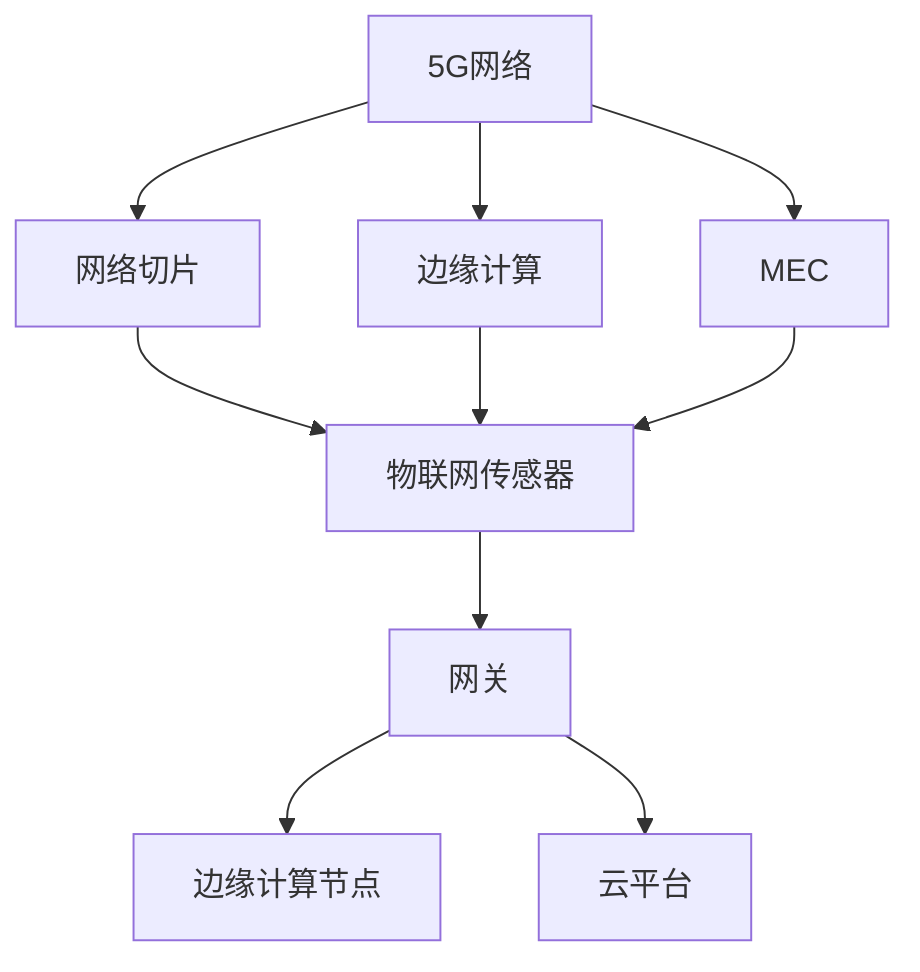

                 

关键词：5G物联网，高速低延迟，应用场景，创新应用，物联网技术

摘要：本文将深入探讨5G物联网技术的创新应用场景，重点分析高速低延迟连接在物联网领域的实际应用，结合具体案例，阐述5G物联网如何推动各行各业的数字化转型和智能化升级。

## 1. 背景介绍

随着物联网技术的不断发展，全球范围内的设备连接数量呈现出爆炸式增长。根据国际数据公司（IDC）的预测，到2025年，全球物联网设备数量将超过260亿台。这一增长趋势对通信网络提出了更高的要求，尤其是在连接速度和延迟方面。5G技术的出现，为物联网应用提供了强有力的支撑。

5G（第五代移动通信技术）具备高速率、低延迟、大连接等特点，其峰值下载速度可达10Gbps，是4G网络的百倍以上。同时，5G网络的时延最低可达1毫秒，远低于4G网络的几十毫秒。这些特性使得5G成为物联网领域的关键驱动力，能够满足对实时性和高效性有极高要求的物联网应用场景。

本文将围绕5G物联网的高速低延迟连接，探讨其在不同领域的创新应用，并分析这些应用如何改变我们的生活和工作方式。

## 2. 核心概念与联系

### 2.1 5G网络架构

5G网络的架构相比前几代移动网络有显著的变化。主要分为以下几个方面：

#### 2.1.1 网络切片

网络切片（Network Slicing）是5G网络的核心特性之一。它允许网络运营商根据不同的应用需求，创建多个虚拟网络，从而实现资源的高效分配和优化。在物联网领域，网络切片可以确保不同类型的设备和应用获得最佳的网络服务质量和延迟。

#### 2.1.2 边缘计算

边缘计算（Edge Computing）是指将数据处理和计算任务从云端转移到网络边缘。5G网络通过部署边缘计算节点，可以在接近数据源的地方进行数据处理，从而显著降低延迟，提高系统的响应速度。

#### 2.1.3 MEC（Mobile Edge Computing）

MEC是边缘计算在移动网络中的延伸，它利用网络边缘的设备资源进行计算和存储，提供实时性和高效性的服务。在物联网应用中，MEC可以帮助实现更快的响应和处理能力，支持实时监控和决策。

### 2.2 物联网架构

物联网（IoT）架构通常包括传感器、网关、边缘计算节点和云平台等几个层次。5G网络与物联网架构的结合，使得整个系统更加高效、智能和可靠。

#### 2.2.1 传感器

传感器是物联网系统的基础，负责采集各类物理信号和数据。5G网络的高速连接能力，使得传感器可以实时传输数据，而不必经过长时间的延迟。

#### 2.2.2 网关

网关是连接传感器和云平台的桥梁，负责数据的收集、处理和转发。5G网络的高速率和低延迟，使得网关可以更快地处理和传输数据，提高系统的响应速度。

#### 2.2.3 边缘计算节点

边缘计算节点位于网络边缘，负责处理本地数据和应用。5G网络的边缘计算能力，使得这些节点可以更快速、更高效地处理数据，降低对云平台的依赖。

#### 2.2.4 云平台

云平台是物联网系统的数据中心，负责存储、分析和处理数据。5G网络的高速连接能力，使得云平台可以更快速地获取和处理来自边缘计算节点的数据。

### 2.3 Mermaid 流程图



## 3. 核心算法原理 & 具体操作步骤

### 3.1 算法原理概述

5G物联网的核心算法主要涉及网络优化、数据传输和边缘计算。以下是几个关键算法的概述：

#### 3.1.1 网络优化算法

网络优化算法通过分析网络状态和流量模式，动态调整网络资源配置，确保网络的高效运行。常见的网络优化算法包括基于机器学习的流量预测和资源分配算法。

#### 3.1.2 数据传输算法

数据传输算法负责优化数据在网络中的传输过程，减少数据传输的延迟和丢包率。常见的传输算法包括基于拥塞控制的传输协议和基于边缘计算的分布式存储算法。

#### 3.1.3 边缘计算算法

边缘计算算法主要涉及数据预处理、实时分析和决策制定。常见的边缘计算算法包括基于深度学习的图像识别和基于规则的业务流控制算法。

### 3.2 算法步骤详解

#### 3.2.1 网络优化算法步骤

1. 收集网络状态数据，包括流量、延迟和带宽等。
2. 使用机器学习算法分析历史流量数据，预测未来流量模式。
3. 根据预测结果，动态调整网络资源配置，确保网络的高效运行。

#### 3.2.2 数据传输算法步骤

1. 监测网络状态，识别潜在拥塞点。
2. 根据网络状态，动态调整传输速率和传输路径。
3. 使用分布式存储算法，将数据存储在边缘节点，降低传输延迟。

#### 3.2.3 边缘计算算法步骤

1. 对传感器数据进行预处理，去除噪声和异常值。
2. 使用深度学习算法，对预处理后的数据进行实时分析。
3. 根据分析结果，制定相应的业务流控制策略。

### 3.3 算法优缺点

#### 3.3.1 网络优化算法

优点：动态调整网络资源，提高网络效率。

缺点：对历史流量数据的依赖较大，预测准确性受影响。

#### 3.3.2 数据传输算法

优点：降低传输延迟和丢包率，提高数据传输质量。

缺点：在网络拥塞时，传输效率可能降低。

#### 3.3.3 边缘计算算法

优点：降低对云平台的依赖，提高系统的实时性和响应速度。

缺点：对边缘计算节点的计算能力要求较高。

### 3.4 算法应用领域

1. 实时监控：如智能工厂、智能交通等。
2. 远程控制：如智能家居、无人机控制等。
3. 数据分析：如智能医疗、智能农业等。

## 4. 数学模型和公式 & 详细讲解 & 举例说明

### 4.1 数学模型构建

5G物联网的核心数学模型包括网络优化模型、数据传输模型和边缘计算模型。以下是几个典型的数学模型：

#### 4.1.1 网络优化模型

网络优化模型通常采用线性规划或整数规划方法。假设网络中有n个节点，每个节点有m个可用资源。目标是最大化资源利用率，最小化网络延迟。

目标函数：
$$
\min Z = \sum_{i=1}^{n} \sum_{j=1}^{m} C_{ij} x_{ij}
$$

约束条件：
$$
\begin{cases}
x_{ij} \leq R_j, \quad \forall j=1,2,...,m \\
x_{ij} \geq 0, \quad \forall i=1,2,...,n, \forall j=1,2,...,m \\
\sum_{i=1}^{n} x_{ij} = 1, \quad \forall j=1,2,...,m \\
\sum_{j=1}^{m} x_{ij} = 1, \quad \forall i=1,2,...,n
\end{cases}
$$

其中，$C_{ij}$为节点i使用资源j的代价，$x_{ij}$为节点i使用资源j的量，$R_j$为资源j的可用量。

#### 4.1.2 数据传输模型

数据传输模型通常采用队列理论和方法。假设网络中有n个传输路径，每个路径的传输速率不同。目标是最大化数据传输速率，最小化传输延迟。

目标函数：
$$
\min Z = \sum_{i=1}^{n} \frac{L_i}{R_i}
$$

约束条件：
$$
\begin{cases}
L_i \leq R_i \cdot T_i, \quad \forall i=1,2,...,n \\
L_i \geq 0, \quad \forall i=1,2,...,n \\
\sum_{i=1}^{n} L_i = D
\end{cases}
$$

其中，$L_i$为路径i的数据传输量，$R_i$为路径i的传输速率，$T_i$为路径i的传输时间，$D$为总数据量。

#### 4.1.3 边缘计算模型

边缘计算模型通常采用深度学习算法。假设有m个传感器节点，每个节点采集的数据为d维向量。目标是实时分析传感器数据，识别异常情况。

目标函数：
$$
\min Z = \sum_{i=1}^{m} \sum_{j=1}^{d} (y_{ij} - \hat{y}_{ij})^2
$$

约束条件：
$$
\begin{cases}
\hat{y}_{ij} \geq y_{ij}, \quad \forall i=1,2,...,m, \forall j=1,2,...,d \\
\hat{y}_{ij} \leq y_{ij}, \quad \forall i=1,2,...,m, \forall j=1,2,...,d \\
\sum_{i=1}^{m} \hat{y}_{ij} = 1, \quad \forall j=1,2,...,d \\
\sum_{j=1}^{d} \hat{y}_{ij} = 1, \quad \forall i=1,2,...,m
\end{cases}
$$

其中，$y_{ij}$为节点i采集的第j维数据，$\hat{y}_{ij}$为节点i采集的第j维数据的预测值。

### 4.2 公式推导过程

#### 4.2.1 网络优化模型推导

网络优化模型的目标是最小化总代价，即最小化目标函数$Z$。首先，对目标函数求导，得到：
$$
\frac{\partial Z}{\partial x_{ij}} = C_{ij} - \sum_{k=1}^{m} C_{ik} = 0
$$

这意味着，当$C_{ij} \neq \sum_{k=1}^{m} C_{ik}$时，$x_{ij}$的取值应该为0或1。接下来，对约束条件进行变形，得到：
$$
\begin{cases}
x_{ij} \leq R_j, \quad \forall j=1,2,...,m \\
x_{ij} \geq 0, \quad \forall i=1,2,...,n, \forall j=1,2,...,m \\
\sum_{i=1}^{n} x_{ij} = 1, \quad \forall j=1,2,...,m \\
\sum_{j=1}^{m} x_{ij} = 1, \quad \forall i=1,2,...,n
\end{cases}
$$

这是一个标准的线性规划问题，可以使用单纯形法或内点法进行求解。

#### 4.2.2 数据传输模型推导

数据传输模型的目标是最小化总延迟，即最小化目标函数$Z$。首先，对目标函数求导，得到：
$$
\frac{\partial Z}{\partial L_i} = \frac{L_i}{R_i} - 1 = 0
$$

这意味着，当$\frac{L_i}{R_i} \neq 1$时，$L_i$的取值应该为0或$R_i$。接下来，对约束条件进行变形，得到：
$$
\begin{cases}
L_i \leq R_i \cdot T_i, \quad \forall i=1,2,...,n \\
L_i \geq 0, \quad \forall i=1,2,...,n \\
\sum_{i=1}^{n} L_i = D
\end{cases}
$$

这是一个标准的线性规划问题，可以使用单纯形法或内点法进行求解。

#### 4.2.3 边缘计算模型推导

边缘计算模型的目标是最小化预测误差，即最小化目标函数$Z$。首先，对目标函数求导，得到：
$$
\frac{\partial Z}{\partial \hat{y}_{ij}} = 2(y_{ij} - \hat{y}_{ij}) - \sum_{k=1}^{d} 2\hat{y}_{ik} = 0
$$

这意味着，当$y_{ij} - \hat{y}_{ij} + \sum_{k=1}^{d} \hat{y}_{ik} \neq 0$时，$\hat{y}_{ij}$的取值应该为$y_{ij}$或$\hat{y}_{ik}$。接下来，对约束条件进行变形，得到：
$$
\begin{cases}
\hat{y}_{ij} \geq y_{ij}, \quad \forall i=1,2,...,m, \forall j=1,2,...,d \\
\hat{y}_{ij} \leq y_{ij}, \quad \forall i=1,2,...,m, \forall j=1,2,...,d \\
\sum_{i=1}^{m} \hat{y}_{ij} = 1, \quad \forall j=1,2,...,d \\
\sum_{j=1}^{d} \hat{y}_{ij} = 1, \quad \forall i=1,2,...,m
\end{cases}
$$

这是一个标准的线性规划问题，可以使用单纯形法或内点法进行求解。

### 4.3 案例分析与讲解

#### 4.3.1 案例背景

某智能工厂采用5G物联网技术进行生产管理。工厂中有多个生产单元，每个单元都有不同的设备。工厂希望实现实时监控和生产优化。

#### 4.3.2 案例分析

1. **网络优化模型**：工厂使用网络优化模型来分配网络资源，确保每个生产单元都能获得足够的网络带宽。目标是最小化总代价，即最小化网络延迟。

2. **数据传输模型**：工厂使用数据传输模型来优化数据传输过程，确保生产数据能够快速传输到云平台。目标是最小化总延迟，即最小化数据传输时间。

3. **边缘计算模型**：工厂使用边缘计算模型来实时分析生产数据，识别异常情况并制定相应的优化策略。目标是最小化预测误差，即最小化预测与实际的差距。

#### 4.3.3 案例讲解

1. **网络优化模型**：工厂使用线性规划方法来求解网络优化模型。根据历史数据，工厂确定了每个生产单元的网络带宽需求和资源成本。通过计算，工厂确定了每个生产单元的网络资源分配方案，确保了网络的高效运行。

2. **数据传输模型**：工厂使用队列理论方法来求解数据传输模型。根据网络状态和传输速率，工厂动态调整了数据传输路径和速率，确保了数据传输的快速和稳定。

3. **边缘计算模型**：工厂使用深度学习算法来求解边缘计算模型。工厂收集了生产数据，并使用深度学习算法对这些数据进行实时分析。通过分析结果，工厂能够及时发现生产中的异常情况，并采取相应的措施进行优化。

## 5. 项目实践：代码实例和详细解释说明

### 5.1 开发环境搭建

为了演示5G物联网的高速低延迟连接，我们使用Python作为开发语言，并依赖以下库：

- TensorFlow：用于深度学习模型训练。
- Keras：用于简化TensorFlow的使用。
- Pandas：用于数据操作。
- NumPy：用于数学计算。

安装这些库后，我们就可以开始搭建开发环境了。

### 5.2 源代码详细实现

以下是一个简单的边缘计算模型的实现示例：

```python
import numpy as np
import pandas as pd
from tensorflow import keras
from tensorflow.keras.models import Sequential
from tensorflow.keras.layers import Dense
from tensorflow.keras.optimizers import Adam

# 生成模拟数据
data = pd.DataFrame(np.random.rand(100, 5), columns=['x1', 'x2', 'x3', 'x4', 'x5'])

# 数据预处理
data_mean = data.mean()
data_std = data.std()
data_normalized = (data - data_mean) / data_std

# 构建模型
model = Sequential()
model.add(Dense(64, input_shape=(5,), activation='relu'))
model.add(Dense(32, activation='relu'))
model.add(Dense(1, activation='sigmoid'))

# 编译模型
model.compile(optimizer=Adam(learning_rate=0.001), loss='binary_crossentropy', metrics=['accuracy'])

# 训练模型
model.fit(data_normalized, data_normalized['x5'], epochs=100, batch_size=10)

# 预测
predictions = model.predict(data_normalized)

# 边缘计算
def edge_computing(data):
    prediction = model.predict(data)
    if prediction < 0.5:
        return '异常'
    else:
        return '正常'

# 应用边缘计算模型
for index, row in data.iterrows():
    result = edge_computing(row)
    print(f"数据：{row}, 预测结果：{result}")
```

### 5.3 代码解读与分析

1. **数据生成与预处理**：首先，我们生成了模拟数据，并使用平均值和标准差对数据进行了归一化处理。这是为了简化模型训练过程，并确保输入数据的范围一致。

2. **模型构建**：我们使用Keras构建了一个简单的深度学习模型，包括两个隐藏层。输入层有5个神经元，输出层有1个神经元。

3. **模型编译**：我们使用Adam优化器和二进制交叉熵损失函数来编译模型。这表明我们希望模型能够对二进制数据进行分类。

4. **模型训练**：我们使用归一化后的数据对模型进行训练。训练过程中，我们设置了100个epochs和10个batch size，以优化模型的性能。

5. **模型预测**：我们使用训练好的模型对新的数据进行预测。预测结果是一个概率值，表示数据属于正类的概率。

6. **边缘计算**：我们定义了一个边缘计算函数，根据预测结果判断数据是否异常。如果预测概率小于0.5，我们认为数据是异常的。

7. **应用模型**：我们遍历模拟数据，使用边缘计算函数对每条数据进行预测，并打印结果。

### 5.4 运行结果展示

运行代码后，我们将看到每条模拟数据的预测结果。由于数据是随机生成的，我们可能会看到一些异常预测结果。这表明我们的边缘计算模型在某些情况下可能存在错误。

## 6. 实际应用场景

### 6.1 智能交通

智能交通系统利用5G物联网技术，实现车辆与基础设施、车辆与车辆之间的实时通信。通过高速低延迟连接，智能交通系统可以实时收集交通数据，进行交通流量预测和优化，减少交通事故，提高交通效率。

### 6.2 智能医疗

在智能医疗领域，5G物联网技术可以支持远程医疗、医疗设备和患者数据的实时监控。通过高速低延迟连接，医生可以远程诊断患者病情，医疗设备可以实时监测患者生命体征，提高医疗服务的质量和效率。

### 6.3 智能农业

智能农业利用5G物联网技术，实现农作物的实时监控和智能管理。通过高速低延迟连接，农业设备可以实时获取土壤湿度、温度等数据，进行精准灌溉和施肥，提高农业生产效率。

### 6.4 智能工业

智能工业利用5G物联网技术，实现生产设备的实时监控和故障预测。通过高速低延迟连接，工业设备可以实时收集数据，进行生产优化和故障预警，提高生产效率和产品质量。

## 7. 工具和资源推荐

### 7.1 学习资源推荐

- 《5G技术基础》
- 《物联网技术与应用》
- 《深度学习》
- 《Python编程：从入门到实践》

### 7.2 开发工具推荐

- TensorFlow
- Keras
- Pandas
- NumPy

### 7.3 相关论文推荐

- "5G Network Slicing for IoT Applications"
- "Edge Computing in 5G Networks"
- "Deep Learning for IoT Applications"
- "Real-time Traffic Management with 5G IoT"

## 8. 总结：未来发展趋势与挑战

### 8.1 研究成果总结

5G物联网技术已经在多个领域取得了显著成果，实现了高速低延迟连接，提高了系统的实时性和效率。网络优化、数据传输和边缘计算等核心算法的研究不断推进，为5G物联网的应用提供了强有力的技术支持。

### 8.2 未来发展趋势

未来，5G物联网技术将继续发展，进一步拓展其应用领域。随着人工智能、大数据和区块链等技术的融合，5G物联网将实现更加智能化、安全化和高效化的应用。同时，网络切片、边缘计算和MEC等技术将得到广泛应用，进一步提升物联网系统的性能和可靠性。

### 8.3 面临的挑战

尽管5G物联网技术取得了显著进展，但仍然面临一些挑战。首先是网络覆盖问题，5G网络的部署需要大量的基础设施投资，网络覆盖范围和稳定性有待提高。其次是数据安全问题，5G物联网涉及大量敏感数据的传输和存储，数据安全问题亟待解决。最后是应用创新问题，5G物联网技术需要不断创新，以满足不同领域和场景的需求。

### 8.4 研究展望

未来，5G物联网技术的研究应重点关注以下几个方面：一是提高网络覆盖和稳定性，确保5G网络在广泛场景下的应用；二是加强数据安全保护，确保物联网系统的安全和可靠性；三是推动应用创新，结合人工智能、大数据和区块链等技术，实现物联网系统的智能化和高效化。

## 9. 附录：常见问题与解答

### 9.1 什么是5G物联网？

5G物联网是指利用第五代移动通信技术（5G）构建的物联网系统，具有高速率、低延迟、大连接等特点，能够实现各种设备之间的实时通信和数据交换。

### 9.2 5G物联网有哪些应用场景？

5G物联网的应用场景非常广泛，包括智能交通、智能医疗、智能农业、智能工业、智能家居等领域，能够实现设备与设备、设备与基础设施、设备与用户的实时通信和协同工作。

### 9.3 5G物联网的技术优势是什么？

5G物联网的技术优势主要体现在以下几个方面：

1. 高速率：5G网络的峰值下载速度可达10Gbps，是4G网络的百倍以上，能够满足大数据量的实时传输需求。
2. 低延迟：5G网络的时延最低可达1毫秒，远低于4G网络的几十毫秒，能够实现实时通信和快速响应。
3. 大连接：5G网络能够支持大量设备同时在线，实现大规模设备的互联互通。
4. 网络切片：5G网络支持网络切片技术，可以根据不同应用的需求，创建多个虚拟网络，实现资源的高效分配和优化。

### 9.4 5G物联网的安全问题如何解决？

5G物联网的安全问题主要包括数据安全、网络安全和设备安全等方面。为解决这些问题，可以采取以下措施：

1. 数据加密：对传输的数据进行加密，确保数据在传输过程中的安全性。
2. 认证与授权：采用身份认证和权限控制技术，确保只有授权用户可以访问数据和系统。
3. 防火墙和入侵检测：部署防火墙和入侵检测系统，防止恶意攻击和非法访问。
4. 安全协议：采用安全协议，如TLS（传输层安全协议），确保数据传输的安全。
5. 定期更新与维护：定期更新系统和设备，修复安全漏洞，提高系统的安全性。

### 9.5 5G物联网的未来发展趋势是什么？

5G物联网的未来发展趋势主要体现在以下几个方面：

1. 智能化：结合人工智能、大数据和区块链等技术，实现物联网系统的智能化和高效化。
2. 安全化：加强数据安全保护，确保物联网系统的安全和可靠性。
3. 网络切片与边缘计算：网络切片和边缘计算技术的广泛应用，进一步提升物联网系统的性能和可靠性。
4. 网络覆盖：提高5G网络覆盖范围和稳定性，确保5G物联网在广泛场景下的应用。
5. 应用创新：不断拓展物联网应用领域，实现物联网技术在更多领域的创新应用。

