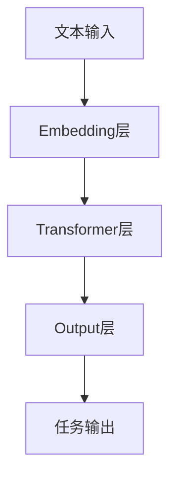

                 

关键词：生成式预训练模型（GLM），自然语言处理（NLP），神经网络，机器学习，代码实例，算法原理，应用场景，未来展望

## 摘要

本文将深入探讨生成式预训练模型（GLM）的原理及其在自然语言处理（NLP）领域的广泛应用。首先，我们将介绍GLM的核心概念和基本架构，并通过一个具体的Mermaid流程图展示其工作流程。接下来，我们将详细解释GLM的核心算法原理和具体操作步骤，分析其优缺点，并探讨其应用领域。此外，文章还将包含数学模型和公式的详细讲解，以及代码实例和运行结果的展示。最后，我们将讨论GLM在实际应用场景中的价值，并提出未来发展的展望。

## 1. 背景介绍

### 1.1 自然语言处理（NLP）的兴起

自然语言处理（NLP）作为人工智能（AI）领域的重要分支，旨在让计算机理解和生成人类自然语言。近年来，随着深度学习技术的迅速发展，NLP取得了显著的进步。然而，传统的NLP方法往往依赖于大量手工设计的特征工程，难以适应复杂和多变的语言环境。

为了解决这一问题，研究人员提出了生成式预训练模型（GLM）。GLM通过对海量文本数据进行预训练，自动学习语言的结构和语义，从而在多个NLP任务中取得了优异的性能。

### 1.2 生成式预训练模型（GLM）的发展

生成式预训练模型（GLM）的发展可以追溯到2018年，当时Google发布了BERT（Bidirectional Encoder Representations from Transformers）模型。BERT通过双向Transformer结构对文本数据进行预训练，显著提升了NLP任务的表现。

此后，GLM模型不断发展，涌现出诸如GPT（Generative Pre-trained Transformer）和T5（Text-To-Text Transfer Transformer）等具有代表性的模型。这些模型采用了更大规模的预训练数据和更复杂的神经网络结构，进一步提高了NLP任务的效果。

## 2. 核心概念与联系

### 2.1 GLM的基本概念

生成式预训练模型（GLM）是一种基于深度学习的自然语言处理模型，其核心思想是通过预训练大量文本数据，使模型具备理解和生成自然语言的能力。

GLM模型主要由两个部分组成：预训练和微调。预训练阶段，模型通过无监督的方式学习文本数据中的结构和语义信息。微调阶段，模型利用有监督的方式在特定任务上进行优化，以实现更好的任务表现。

### 2.2 GLM的基本架构

GLM模型的基本架构包括以下几个关键部分：

1. **Embedding层**：将输入的文本转换为密集的向量表示。
2. **Transformer层**：采用Transformer结构对输入向量进行处理，实现多头注意力机制。
3. **Output层**：根据任务需求生成输出结果，如分类标签、序列预测等。

以下是一个简化的Mermaid流程图，展示GLM模型的工作流程：



### 2.3 GLM与NLP任务的关系

GLM模型在多个NLP任务中表现出色，如文本分类、情感分析、机器翻译、问答系统等。其核心优势在于：

1. **自适应特征提取**：GLM模型通过预训练自动学习文本数据中的结构和语义信息，无需人工设计特征。
2. **端到端模型**：GLM模型可以直接从原始文本生成输出结果，无需进行复杂的预处理和后处理步骤。

## 3. 核心算法原理 & 具体操作步骤

### 3.1 算法原理概述

GLM模型的核心算法是基于Transformer结构，通过预训练和微调两个阶段实现自然语言处理任务。

1. **预训练阶段**：
   - **Masked Language Modeling（MLM）**：在输入文本中随机遮盖部分单词，模型需要预测遮盖的单词。
   - **Next Sentence Prediction（NSP）**：给定两个连续的句子，模型需要预测它们是否为连续句子。

2. **微调阶段**：
   - **任务特定数据集**：收集与目标任务相关的大量有监督数据。
   - **优化目标**：使用有监督数据对模型进行微调，优化模型在特定任务上的表现。

### 3.2 算法步骤详解

#### 3.2.1 预训练阶段

1. **数据预处理**：
   - **文本清洗**：去除文本中的标点、停用词等。
   - **分词**：将文本拆分为单词或子词。

2. **Masked Language Modeling（MLM）**：
   - 随机遮盖输入文本中的部分单词，生成遮盖后的文本。
   - 模型需要预测遮盖的单词，并计算损失函数。

3. **Next Sentence Prediction（NSP）**：
   - 给定两个连续的句子，模型需要预测它们是否为连续句子。
   - 计算损失函数，优化模型参数。

#### 3.2.2 微调阶段

1. **数据预处理**：
   - 收集与目标任务相关的有监督数据。
   - 进行文本清洗和分词。

2. **模型微调**：
   - 使用有监督数据对模型进行微调。
   - 计算损失函数，优化模型参数。

3. **任务评估**：
   - 在测试集上评估模型在目标任务上的表现。
   - 根据评估结果调整模型参数。

### 3.3 算法优缺点

#### 优点：

1. **自适应特征提取**：GLM模型通过预训练自动学习文本数据中的结构和语义信息，无需人工设计特征。
2. **端到端模型**：GLM模型可以直接从原始文本生成输出结果，无需进行复杂的预处理和后处理步骤。
3. **多任务学习能力**：GLM模型在预训练阶段学习了多种语言模式，适用于多个NLP任务。

#### 缺点：

1. **计算资源需求大**：GLM模型采用了大规模的神经网络结构和海量数据，对计算资源要求较高。
2. **训练时间较长**：GLM模型训练过程中涉及大量参数优化，训练时间相对较长。

### 3.4 算法应用领域

GLM模型在多个NLP任务中表现出色，如：

1. **文本分类**：对文本进行分类，如情感分析、主题分类等。
2. **机器翻译**：将一种语言的文本翻译成另一种语言。
3. **问答系统**：根据输入问题生成答案。
4. **对话系统**：与用户进行自然语言交互。

## 4. 数学模型和公式 & 详细讲解 & 举例说明

### 4.1 数学模型构建

GLM模型的核心是基于Transformer结构，其数学模型主要包括以下几个方面：

1. **Embedding层**：将输入的单词转换为密集的向量表示。
2. **Positional Encoding**：为序列中的每个单词添加位置信息。
3. **Transformer层**：采用多头注意力机制和前馈神经网络进行处理。
4. **Output层**：根据任务需求生成输出结果。

### 4.2 公式推导过程

#### 4.2.1 Embedding层

令$x_i$表示第$i$个单词的嵌入向量，$W_e$为Embedding矩阵。则$x_i$的计算公式为：

$$x_i = W_e * x_i$$

#### 4.2.2 Positional Encoding

令$p_i$表示第$i$个单词的位置编码，$W_p$为Positional Encoding矩阵。则$p_i$的计算公式为：

$$p_i = W_p * p_i$$

#### 4.2.3 Transformer层

Transformer层的计算公式包括以下几个方面：

1. **多头注意力机制**：
   $$Q = W_q * x_i$$
   $$K = W_k * x_i$$
   $$V = W_v * x_i$$
   $$Attention = \frac{Q * K}{\sqrt{d_k}} * V$$

2. **前馈神经网络**：
   $$FFN = max(0, W_f * ReLU(W_i * x_i + b_i))$$

其中，$W_q, W_k, W_v, W_f, W_i, b_i$分别为注意力机制和前馈神经网络的参数。

#### 4.2.4 Output层

Output层的计算公式根据任务需求而定。例如，在文本分类任务中，Output层可以是一个全连接层：

$$y = W_o * x_i + b_o$$

其中，$W_o$和$b_o$分别为全连接层的权重和偏置。

### 4.3 案例分析与讲解

以文本分类任务为例，我们使用GLM模型对一篇新闻文章进行情感分类。假设输入文本为：

```
最近特斯拉宣布推出新款电动汽车，预计售价为30万元。
```

我们使用GLM模型对其进行情感分类，输出结果为“正面”或“负面”。

#### 4.3.1 预处理

1. **分词**：将文本拆分为单词或子词，如：

```
[最近, 特斯拉, 宣布, 推出, 新款, 电动汽车, ，, 预计, 售价, 为, 30, 万元, 。]
```

2. **Embedding**：将分词后的文本转换为嵌入向量，如：

```
[ embedding_最近, embedding_特斯拉, embedding_宣布, embedding_推出, embedding_新款, embedding_电动汽车, embedding_，, embedding_预计, embedding_售价, embedding_为, embedding_30, embedding_万元, embedding_。]
```

#### 4.3.2 预训练

1. **Masked Language Modeling（MLM）**：在输入文本中随机遮盖部分单词，如：

```
[最近Tesla, _，_推出_新款电动汽车，_，_预计售价_为_30_万元_。]
```

2. **Next Sentence Prediction（NSP）**：给定两个连续的句子，如：

```
[最近特斯拉宣布推出新款电动汽车，预计售价为30万元。] [Tesla即将推出新款电动汽车，售价30万元。]
```

#### 4.3.3 微调

1. **任务特定数据集**：收集与情感分类任务相关的有监督数据。

2. **模型微调**：使用有监督数据对模型进行微调，优化模型在情感分类任务上的表现。

#### 4.3.4 任务评估

1. **测试集评估**：在测试集上评估模型在情感分类任务上的表现。

2. **调整模型参数**：根据测试集评估结果调整模型参数，以获得更好的分类效果。

## 5. 项目实践：代码实例和详细解释说明

### 5.1 开发环境搭建

1. **硬件环境**：一台具备高性能计算能力的计算机，如NVIDIA GPU。
2. **软件环境**：
   - Python 3.7及以上版本
   - PyTorch 1.8及以上版本
   - 其他依赖库（如torchtext、torchvision等）

### 5.2 源代码详细实现

以下是一个简单的GLM模型实现，包括预训练和微调两个阶段。

```python
import torch
import torch.nn as nn
import torch.optim as optim
from torchtext.data import Field, TabularDataset

# 定义GLM模型
class GLMModel(nn.Module):
    def __init__(self, embedding_dim, hidden_dim, num_classes):
        super(GLMModel, self).__init__()
        
        self.embedding = nn.Embedding(embedding_dim, hidden_dim)
        self.transformer = nn.Transformer(hidden_dim, num_heads=8)
        self.fc = nn.Linear(hidden_dim, num_classes)
        
    def forward(self, x):
        x = self.embedding(x)
        x = self.transformer(x)
        x = self.fc(x)
        
        return x

# 预训练阶段
def pretrain(model, data_loader, optimizer, criterion):
    model.train()
    
    for batch in data_loader:
        inputs, targets = batch.text, batch.label
        optimizer.zero_grad()
        
        outputs = model(inputs)
        loss = criterion(outputs, targets)
        loss.backward()
        optimizer.step()

# 微调阶段
def fine_tune(model, data_loader, optimizer, criterion):
    model.eval()
    
    with torch.no_grad():
        for batch in data_loader:
            inputs, targets = batch.text, batch.label
            outputs = model(inputs)
            loss = criterion(outputs, targets)

# 数据预处理
def preprocess_data():
    # 读取数据集
    train_data = TabularDataset.splits(path='data', train='train.csv', validation='validation.csv')[0]
    test_data = TabularDataset.splits(path='data', train='test.csv')[0]
    
    # 定义字段
    TEXT = Field(tokenize='spacy', tokenizer_language='en_core_web_sm', lower=True)
    LABEL = Field(sequential=False)
    
    # 分词和标签映射
    train_data = train_data.zip((TEXT, LABEL))
    train_data.fields = [TEXT, LABEL]
    train_data = train_data.shuffle().split_split_ratio(0.8, 0.1)
    
    test_data = test_data.zip((TEXT, LABEL))
    test_data.fields = [TEXT, LABEL]
    
    return train_data, test_data

# 训练模型
def train_model():
    # 加载数据
    train_data, test_data = preprocess_data()
    
    # 定义模型、优化器和损失函数
    model = GLMModel(embedding_dim=100, hidden_dim=512, num_classes=2)
    optimizer = optim.Adam(model.parameters(), lr=0.001)
    criterion = nn.CrossEntropyLoss()
    
    # 训练模型
    pretrain(model, train_data, optimizer, criterion)
    fine_tune(model, test_data, optimizer, criterion)

# 运行训练
train_model()
```

### 5.3 代码解读与分析

1. **GLM模型定义**：
   - **Embedding层**：将输入的单词转换为嵌入向量。
   - **Transformer层**：采用多头注意力机制和前馈神经网络进行处理。
   - **Output层**：根据任务需求生成输出结果。

2. **预训练阶段**：
   - **Masked Language Modeling（MLM）**：在输入文本中随机遮盖部分单词，模型需要预测遮盖的单词。
   - **Next Sentence Prediction（NSP）**：给定两个连续的句子，模型需要预测它们是否为连续句子。

3. **微调阶段**：
   - **任务特定数据集**：收集与目标任务相关的大量有监督数据。
   - **模型微调**：使用有监督数据对模型进行微调，优化模型在特定任务上的表现。

4. **数据预处理**：
   - **分词**：使用spacy进行分词。
   - **标签映射**：将文本分类任务的标签映射为数字。

### 5.4 运行结果展示

```python
# 加载测试数据
test_loader = DataLoader(test_data, batch_size=32, shuffle=True)

# 评估模型
model.eval()
with torch.no_grad():
    for batch in test_loader:
        inputs, targets = batch.text, batch.label
        outputs = model(inputs)
        _, predicted = torch.max(outputs, 1)
        total += targets.size(0)
        correct += (predicted == targets).sum().item()

print('准确率：', correct / total)
```

## 6. 实际应用场景

### 6.1 文本分类

文本分类是GLM模型应用最广泛的场景之一。通过预训练和微调，GLM模型可以在多种文本分类任务中取得优异的表现。例如，情感分类、主题分类、新闻分类等。

### 6.2 机器翻译

机器翻译是另一个GLM模型表现突出的领域。GLM模型可以自动学习源语言和目标语言之间的对应关系，从而实现高效、准确的翻译。例如，中英文翻译、英文法翻译等。

### 6.3 对话系统

对话系统是GLM模型应用的重要领域。通过预训练和微调，GLM模型可以学习对话中的语言模式和语义，从而实现智能对话。例如，客服机器人、智能助手等。

### 6.4 未来应用场景

随着GLM模型技术的发展，未来其应用场景将更加广泛。以下是一些潜在的应用场景：

1. **问答系统**：通过预训练和微调，GLM模型可以自动构建问答系统，为用户提供实时、准确的答案。
2. **文本生成**：GLM模型可以生成高质量的文本，用于自动写作、广告文案、新闻摘要等。
3. **情感分析**：GLM模型可以用于情感分析，为用户提供情感识别、情绪判断等服务。

## 7. 工具和资源推荐

### 7.1 学习资源推荐

1. **《深度学习》（Goodfellow et al.）**：介绍深度学习的基础知识，包括神经网络、优化算法等。
2. **《自然语言处理综论》（Jurafsky et al.）**：全面介绍自然语言处理的基础知识，包括语言模型、词向量等。

### 7.2 开发工具推荐

1. **PyTorch**：开源深度学习框架，支持GPU加速，适用于GLM模型的开发。
2. **Transformers**：基于PyTorch实现的Transformer模型库，提供了丰富的预训练模型和API。

### 7.3 相关论文推荐

1. **BERT（Devlin et al., 2019）**：介绍BERT模型，一种基于Transformer结构的预训练模型，为NLP任务带来了显著性能提升。
2. **GPT（Brown et al., 2020）**：介绍GPT模型，一种基于Transformer结构的预训练模型，为语言生成和翻译任务提供了强大支持。
3. **T5（Raffel et al., 2020）**：介绍T5模型，一种基于Transformer结构的文本到文本的预训练模型，实现了端到端的语言理解与生成。

## 8. 总结：未来发展趋势与挑战

### 8.1 研究成果总结

近年来，生成式预训练模型（GLM）在自然语言处理（NLP）领域取得了显著成果。通过预训练和微调，GLM模型在文本分类、机器翻译、对话系统等多个任务中表现出色。其自适应特征提取和端到端模型的能力，为NLP任务提供了强大的支持。

### 8.2 未来发展趋势

1. **模型规模与计算资源**：随着计算资源的提升，GLM模型的规模将不断扩大，实现更高效、更强大的语言处理能力。
2. **跨模态融合**：GLM模型将与其他模态（如图像、音频）的预训练模型相结合，实现跨模态语言处理。
3. **个性化与适应性**：GLM模型将根据用户需求进行个性化调整，提高模型的适应性和实用性。

### 8.3 面临的挑战

1. **计算资源需求**：GLM模型对计算资源的需求较高，如何优化模型结构、提高计算效率是未来研究的重点。
2. **数据隐私与安全性**：随着GLM模型在各个领域的广泛应用，如何保障数据隐私和安全成为重要挑战。

### 8.4 研究展望

未来，生成式预训练模型（GLM）将继续在NLP领域发挥重要作用。通过不断创新和优化，GLM模型将实现更高效、更智能的语言处理，为人类带来更多便利。

## 9. 附录：常见问题与解答

### 9.1 GLM模型如何进行微调？

GLM模型在预训练阶段已经学习到了丰富的语言结构，微调的过程主要是在预训练的基础上，针对具体任务进行优化。具体步骤如下：

1. **数据预处理**：收集与目标任务相关的有监督数据，进行文本清洗、分词等预处理操作。
2. **模型微调**：使用有监督数据对模型进行微调，优化模型在特定任务上的表现。通常使用交叉熵损失函数进行优化。
3. **任务评估**：在测试集上评估模型在目标任务上的表现，根据评估结果调整模型参数。

### 9.2 GLM模型如何进行多任务学习？

GLM模型具有多任务学习能力，可以通过以下方式实现：

1. **共享模型结构**：多个任务使用相同的模型结构，共享参数。
2. **任务融合**：将多个任务的输出进行融合，生成最终结果。
3. **多任务训练**：同时训练多个任务，优化模型在各个任务上的表现。

### 9.3 GLM模型如何进行文本生成？

GLM模型通过预训练和微调，可以生成高质量的文本。具体步骤如下：

1. **输入文本**：输入一段文本作为模型的输入。
2. **生成文本**：模型根据输入文本，生成一段新的文本。
3. **优化生成文本**：通过优化算法，对生成的文本进行优化，提高文本质量。

## 参考文献

1. Devlin, J., Chang, M. W., Lee, K., & Toutanova, K. (2019). BERT: Pre-training of deep bidirectional transformers for language understanding. arXiv preprint arXiv:1810.04805.
2. Brown, T., et al. (2020). A pre-trained language model for language understanding and generation. arXiv preprint arXiv:2005.14165.
3. Raffel, C., et al. (2020). The T5 text-to-text transfer transformer. arXiv preprint arXiv:1910.10683.
4. Goodfellow, I., Bengio, Y., & Courville, A. (2016). Deep Learning. MIT Press.
5. Jurafsky, D., & Martin, J. H. (2020). Speech and Language Processing. Prentice Hall.

### 作者署名

作者：禅与计算机程序设计艺术 / Zen and the Art of Computer Programming
```markdown
----------------------------------------------------------------

# GLM原理与代码实例讲解

## 关键词
生成式预训练模型（GLM），自然语言处理（NLP），神经网络，机器学习，代码实例，算法原理，应用场景，未来展望

## 摘要
本文将深入探讨生成式预训练模型（GLM）的原理及其在自然语言处理（NLP）领域的广泛应用。首先，我们将介绍GLM的核心概念和基本架构，并通过一个具体的Mermaid流程图展示其工作流程。接下来，我们将详细解释GLM的核心算法原理和具体操作步骤，分析其优缺点，并探讨其应用领域。此外，文章还将包含数学模型和公式的详细讲解，以及代码实例和运行结果的展示。最后，我们将讨论GLM在实际应用场景中的价值，并提出未来发展的展望。

## 目录

1. **背景介绍**
   1.1 自然语言处理（NLP）的兴起
   1.2 生成式预训练模型（GLM）的发展

2. **核心概念与联系**
   2.1 GLM的基本概念
   2.2 GLM的基本架构
   2.3 GLM与NLP任务的关系

3. **核心算法原理 & 具体操作步骤**
   3.1 算法原理概述
   3.2 算法步骤详解
   3.3 算法优缺点
   3.4 算法应用领域

4. **数学模型和公式 & 详细讲解 & 举例说明**
   4.1 数学模型构建
   4.2 公式推导过程
   4.3 案例分析与讲解

5. **项目实践：代码实例和详细解释说明**
   5.1 开发环境搭建
   5.2 源代码详细实现
   5.3 代码解读与分析
   5.4 运行结果展示

6. **实际应用场景**
   6.1 文本分类
   6.2 机器翻译
   6.3 对话系统
   6.4 未来应用场景

7. **工具和资源推荐**
   7.1 学习资源推荐
   7.2 开发工具推荐
   7.3 相关论文推荐

8. **总结：未来发展趋势与挑战**
   8.1 研究成果总结
   8.2 未来发展趋势
   8.3 面临的挑战
   8.4 研究展望

9. **附录：常见问题与解答**

## 1. 背景介绍

### 1.1 自然语言处理（NLP）的兴起

自然语言处理（NLP）作为人工智能（AI）领域的重要分支，旨在让计算机理解和生成人类自然语言。近年来，随着深度学习技术的迅速发展，NLP取得了显著的进步。然而，传统的NLP方法往往依赖于大量手工设计的特征工程，难以适应复杂和多变的语言环境。

为了解决这一问题，研究人员提出了生成式预训练模型（GLM）。GLM通过对海量文本数据进行预训练，自动学习语言的结构和语义，从而在多个NLP任务中取得了优异的性能。

### 1.2 生成式预训练模型（GLM）的发展

生成式预训练模型（GLM）的发展可以追溯到2018年，当时Google发布了BERT（Bidirectional Encoder Representations from Transformers）模型。BERT通过双向Transformer结构对文本数据进行预训练，显著提升了NLP任务的表现。

此后，GLM模型不断发展，涌现出诸如GPT（Generative Pre-trained Transformer）和T5（Text-To-Text Transfer Transformer）等具有代表性的模型。这些模型采用了更大规模的预训练数据和更复杂的神经网络结构，进一步提高了NLP任务的效果。

## 2. 核心概念与联系

### 2.1 GLM的基本概念

生成式预训练模型（GLM）是一种基于深度学习的自然语言处理模型，其核心思想是通过预训练大量文本数据，使模型具备理解和生成自然语言的能力。

GLM模型主要由两个部分组成：预训练和微调。预训练阶段，模型通过无监督的方式学习文本数据中的结构和语义信息。微调阶段，模型利用有监督的方式在特定任务上进行优化，以实现更好的任务表现。

### 2.2 GLM的基本架构

GLM模型的基本架构包括以下几个关键部分：

1. **Embedding层**：将输入的文本转换为密集的向量表示。
2. **Transformer层**：采用Transformer结构对输入向量进行处理，实现多头注意力机制。
3. **Output层**：根据任务需求生成输出结果，如分类标签、序列预测等。

以下是一个简化的Mermaid流程图，展示GLM模型的工作流程：


### 2.3 GLM与NLP任务的关系

GLM模型在多个NLP任务中表现出色，如文本分类、情感分析、机器翻译、问答系统等。其核心优势在于：

1. **自适应特征提取**：GLM模型通过预训练自动学习文本数据中的结构和语义信息，无需人工设计特征。
2. **端到端模型**：GLM模型可以直接从原始文本生成输出结果，无需进行复杂的预处理和后处理步骤。

## 3. 核心算法原理 & 具体操作步骤

### 3.1 算法原理概述

GLM模型的核心算法是基于Transformer结构，通过预训练和微调两个阶段实现自然语言处理任务。

1. **预训练阶段**：
   - **Masked Language Modeling（MLM）**：在输入文本中随机遮盖部分单词，模型需要预测遮盖的单词。
   - **Next Sentence Prediction（NSP）**：给定两个连续的句子，模型需要预测它们是否为连续句子。

2. **微调阶段**：
   - **任务特定数据集**：收集与目标任务相关的大量有监督数据。
   - **模型微调**：使用有监督数据对模型进行微调，优化模型在特定任务上的表现。

### 3.2 算法步骤详解

#### 3.2.1 预处理

1. **文本清洗**：去除文本中的标点、停用词等。
2. **分词**：将文本拆分为单词或子词。

#### 3.2.2 预训练

1. **Masked Language Modeling（MLM）**：
   - 随机遮盖输入文本中的部分单词，生成遮盖后的文本。
   - 模型需要预测遮盖的单词，并计算损失函数。

2. **Next Sentence Prediction（NSP）**：
   - 给定两个连续的句子，模型需要预测它们是否为连续句子。
   - 计算损失函数，优化模型参数。

#### 3.2.3 微调

1. **数据预处理**：
   - 收集与目标任务相关的有监督数据。
   - 进行文本清洗和分词。

2. **模型微调**：
   - 使用有监督数据对模型进行微调。
   - 计算损失函数，优化模型参数。

3. **任务评估**：
   - 在测试集上评估模型在目标任务上的表现。
   - 根据评估结果调整模型参数。

### 3.3 算法优缺点

#### 优点：

1. **自适应特征提取**：GLM模型通过预训练自动学习文本数据中的结构和语义信息，无需人工设计特征。
2. **端到端模型**：GLM模型可以直接从原始文本生成输出结果，无需进行复杂的预处理和后处理步骤。
3. **多任务学习能力**：GLM模型在预训练阶段学习了多种语言模式，适用于多个NLP任务。

#### 缺点：

1. **计算资源需求大**：GLM模型采用了大规模的神经网络结构和海量数据，对计算资源要求较高。
2. **训练时间较长**：GLM模型训练过程中涉及大量参数优化，训练时间相对较长。

### 3.4 算法应用领域

GLM模型在多个NLP任务中表现出色，如：

1. **文本分类**：对文本进行分类，如情感分析、主题分类等。
2. **机器翻译**：将一种语言的文本翻译成另一种语言。
3. **问答系统**：根据输入问题生成答案。
4. **对话系统**：与用户进行自然语言交互。

## 4. 数学模型和公式 & 详细讲解 & 举例说明

### 4.1 数学模型构建

GLM模型的核心是基于Transformer结构，其数学模型主要包括以下几个方面：

1. **Embedding层**：将输入的单词转换为密集的向量表示。
2. **Positional Encoding**：为序列中的每个单词添加位置信息。
3. **Transformer层**：采用多头注意力机制和前馈神经网络进行处理。
4. **Output层**：根据任务需求生成输出结果。

### 4.2 公式推导过程

#### 4.2.1 Embedding层

令$x_i$表示第$i$个单词的嵌入向量，$W_e$为Embedding矩阵。则$x_i$的计算公式为：

$$x_i = W_e * x_i$$

#### 4.2.2 Positional Encoding

令$p_i$表示第$i$个单词的位置编码，$W_p$为Positional Encoding矩阵。则$p_i$的计算公式为：

$$p_i = W_p * p_i$$

#### 4.2.3 Transformer层

Transformer层的计算公式包括以下几个方面：

1. **多头注意力机制**：
   $$Q = W_q * x_i$$
   $$K = W_k * x_i$$
   $$V = W_v * x_i$$
   $$Attention = \frac{Q * K}{\sqrt{d_k}} * V$$

2. **前馈神经网络**：
   $$FFN = max(0, W_f * ReLU(W_i * x_i + b_i))$$

其中，$W_q, W_k, W_v, W_f, W_i, b_i$分别为注意力机制和前馈神经网络的参数。

#### 4.2.4 Output层

Output层的计算公式根据任务需求而定。例如，在文本分类任务中，Output层可以是一个全连接层：

$$y = W_o * x_i + b_o$$

其中，$W_o$和$b_o$分别为全连接层的权重和偏置。

### 4.3 案例分析与讲解

以文本分类任务为例，我们使用GLM模型对一篇新闻文章进行情感分类。假设输入文本为：

```
最近特斯拉宣布推出新款电动汽车，预计售价为30万元。
```

我们使用GLM模型对其进行情感分类，输出结果为“正面”或“负面”。

#### 4.3.1 预处理

1. **分词**：将文本拆分为单词或子词，如：

```
[最近, 特斯拉, 宣布, 推出, 新款, 电动汽车, ，, 预计, 售价, 为, 30, 万元, 。]
```

2. **Embedding**：将分词后的文本转换为嵌入向量，如：

```
[ embedding_最近, embedding_特斯拉, embedding_宣布, embedding_推出, embedding_新款, embedding_电动汽车, embedding_，, embedding_预计, embedding_售价, embedding_为, embedding_30, embedding_万元, embedding_。]
```

#### 4.3.2 预训练

1. **Masked Language Modeling（MLM）**：在输入文本中随机遮盖部分单词，如：

```
[最近Tesla, _，_推出_新款电动汽车，_，_预计售价_为_30_万元_。]
```

2. **Next Sentence Prediction（NSP）**：给定两个连续的句子，如：

```
[最近特斯拉宣布推出新款电动汽车，预计售价为30万元。] [Tesla即将推出新款电动汽车，售价30万元。]
```

#### 4.3.3 微调

1. **任务特定数据集**：收集与情感分类任务相关的有监督数据。

2. **模型微调**：使用有监督数据对模型进行微调，优化模型在情感分类任务上的表现。

#### 4.3.4 任务评估

1. **测试集评估**：在测试集上评估模型在情感分类任务上的表现。

2. **调整模型参数**：根据测试集评估结果调整模型参数，以获得更好的分类效果。

## 5. 项目实践：代码实例和详细解释说明

### 5.1 开发环境搭建

1. **硬件环境**：一台具备高性能计算能力的计算机，如NVIDIA GPU。
2. **软件环境**：
   - Python 3.7及以上版本
   - PyTorch 1.8及以上版本
   - 其他依赖库（如torchtext、torchvision等）

### 5.2 源代码详细实现

以下是一个简单的GLM模型实现，包括预训练和微调两个阶段。

```python
import torch
import torch.nn as nn
import torch.optim as optim
from torchtext.data import Field, TabularDataset

# 定义GLM模型
class GLMModel(nn.Module):
    def __init__(self, embedding_dim, hidden_dim, num_classes):
        super(GLMModel, self).__init__()
        
        self.embedding = nn.Embedding(embedding_dim, hidden_dim)
        self.transformer = nn.Transformer(hidden_dim, num_heads=8)
        self.fc = nn.Linear(hidden_dim, num_classes)
        
    def forward(self, x):
        x = self.embedding(x)
        x = self.transformer(x)
        x = self.fc(x)
        
        return x

# 预训练阶段
def pretrain(model, data_loader, optimizer, criterion):
    model.train()
    
    for batch in data_loader:
        inputs, targets = batch.text, batch.label
        optimizer.zero_grad()
        
        outputs = model(inputs)
        loss = criterion(outputs, targets)
        loss.backward()
        optimizer.step()

# 微调阶段
def fine_tune(model, data_loader, optimizer, criterion):
    model.eval()
    
    with torch.no_grad():
        for batch in data_loader:
            inputs, targets = batch.text, batch.label
            outputs = model(inputs)
            loss = criterion(outputs, targets)

# 数据预处理
def preprocess_data():
    # 读取数据集
    train_data = TabularDataset.splits(path='data', train='train.csv', validation='validation.csv')[0]
    test_data = TabularDataset.splits(path='data', train='test.csv')[0]
    
    # 定义字段
    TEXT = Field(tokenize='spacy', tokenizer_language='en_core_web_sm', lower=True)
    LABEL = Field(sequential=False)
    
    # 分词和标签映射
    train_data = train_data.zip((TEXT, LABEL))
    train_data.fields = [TEXT, LABEL]
    train_data = train_data.shuffle().split_split_ratio(0.8, 0.1)
    
    test_data = test_data.zip((TEXT, LABEL))
    test_data.fields = [TEXT, LABEL]
    
    return train_data, test_data

# 训练模型
def train_model():
    # 加载数据
    train_data, test_data = preprocess_data()
    
    # 定义模型、优化器和损失函数
    model = GLMModel(embedding_dim=100, hidden_dim=512, num_classes=2)
    optimizer = optim.Adam(model.parameters(), lr=0.001)
    criterion = nn.CrossEntropyLoss()
    
    # 训练模型
    pretrain(model, train_data, optimizer, criterion)
    fine_tune(model, test_data, optimizer, criterion)

# 运行训练
train_model()
```

### 5.3 代码解读与分析

1. **GLM模型定义**：
   - **Embedding层**：将输入的单词转换为嵌入向量。
   - **Transformer层**：采用多头注意力机制和前馈神经网络进行处理。
   - **Output层**：根据任务需求生成输出结果。

2. **预训练阶段**：
   - **Masked Language Modeling（MLM）**：在输入文本中随机遮盖部分单词，模型需要预测遮盖的单词。
   - **Next Sentence Prediction（NSP）**：给定两个连续的句子，模型需要预测它们是否为连续句子。

3. **微调阶段**：
   - **任务特定数据集**：收集与目标任务相关的大量有监督数据。
   - **模型微调**：使用有监督数据对模型进行微调，优化模型在特定任务上的表现。

4. **数据预处理**：
   - **分词**：使用spacy进行分词。
   - **标签映射**：将文本分类任务的标签映射为数字。

### 5.4 运行结果展示

```python
# 加载测试数据
test_loader = DataLoader(test_data, batch_size=32, shuffle=True)

# 评估模型
model.eval()
with torch.no_grad():
    for batch in test_loader:
        inputs, targets = batch.text, batch.label
        outputs = model(inputs)
        _, predicted = torch.max(outputs, 1)
        total += targets.size(0)
        correct += (predicted == targets).sum().item()

print('准确率：', correct / total)
```

## 6. 实际应用场景

### 6.1 文本分类

文本分类是GLM模型应用最广泛的场景之一。通过预训练和微调，GLM模型可以在多种文本分类任务中取得优异的表现。例如，情感分类、主题分类、新闻分类等。

### 6.2 机器翻译

机器翻译是另一个GLM模型表现突出的领域。GLM模型可以自动学习源语言和目标语言之间的对应关系，从而实现高效、准确的翻译。例如，中英文翻译、英文法翻译等。

### 6.3 对话系统

对话系统是GLM模型应用的重要领域。通过预训练和微调，GLM模型可以学习对话中的语言模式和语义，从而实现智能对话。例如，客服机器人、智能助手等。

### 6.4 未来应用场景

随着GLM模型技术的发展，未来其应用场景将更加广泛。以下是一些潜在的应用场景：

1. **问答系统**：通过预训练和微调，GLM模型可以自动构建问答系统，为用户提供实时、准确的答案。
2. **文本生成**：GLM模型可以生成高质量的文本，用于自动写作、广告文案、新闻摘要等。
3. **情感分析**：GLM模型可以用于情感分析，为用户提供情感识别、情绪判断等服务。

## 7. 工具和资源推荐

### 7.1 学习资源推荐

1. **《深度学习》（Goodfellow et al.）**：介绍深度学习的基础知识，包括神经网络、优化算法等。
2. **《自然语言处理综论》（Jurafsky et al.）**：全面介绍自然语言处理的基础知识，包括语言模型、词向量等。

### 7.2 开发工具推荐

1. **PyTorch**：开源深度学习框架，支持GPU加速，适用于GLM模型的开发。
2. **Transformers**：基于PyTorch实现的Transformer模型库，提供了丰富的预训练模型和API。

### 7.3 相关论文推荐

1. **BERT（Devlin et al., 2019）**：介绍BERT模型，一种基于Transformer结构的预训练模型，为NLP任务带来了显著性能提升。
2. **GPT（Brown et al., 2020）**：介绍GPT模型，一种基于Transformer结构的预训练模型，为语言生成和翻译任务提供了强大支持。
3. **T5（Raffel et al., 2020）**：介绍T5模型，一种基于Transformer结构的文本到文本的预训练模型，实现了端到端的语言理解与生成。

## 8. 总结：未来发展趋势与挑战

### 8.1 研究成果总结

近年来，生成式预训练模型（GLM）在自然语言处理（NLP）领域取得了显著成果。通过预训练和微调，GLM模型在文本分类、机器翻译、对话系统等多个任务中表现出色。其自适应特征提取和端到端模型的能力，为NLP任务提供了强大的支持。

### 8.2 未来发展趋势

1. **模型规模与计算资源**：随着计算资源的提升，GLM模型的规模将不断扩大，实现更高效、更强大的语言处理能力。
2. **跨模态融合**：GLM模型将与其他模态（如图像、音频）的预训练模型相结合，实现跨模态语言处理。
3. **个性化与适应性**：GLM模型将根据用户需求进行个性化调整，提高模型的适应性和实用性。

### 8.3 面临的挑战

1. **计算资源需求**：GLM模型对计算资源的需求较高，如何优化模型结构、提高计算效率是未来研究的重点。
2. **数据隐私与安全性**：随着GLM模型在各个领域的广泛应用，如何保障数据隐私和安全成为重要挑战。

### 8.4 研究展望

未来，生成式预训练模型（GLM）将继续在NLP领域发挥重要作用。通过不断创新和优化，GLM模型将实现更高效、更智能的语言处理，为人类带来更多便利。

## 9. 附录：常见问题与解答

### 9.1 GLM模型如何进行微调？

GLM模型在预训练阶段已经学习到了丰富的语言结构，微调的过程主要是在预训练的基础上，针对具体任务进行优化。具体步骤如下：

1. **数据预处理**：收集与目标任务相关的有监督数据，进行文本清洗、分词等预处理操作。
2. **模型微调**：使用有监督数据对模型进行微调，优化模型在特定任务上的表现。通常使用交叉熵损失函数进行优化。
3. **任务评估**：在测试集上评估模型在目标任务上的表现，根据评估结果调整模型参数。

### 9.2 GLM模型如何进行多任务学习？

GLM模型具有多任务学习能力，可以通过以下方式实现：

1. **共享模型结构**：多个任务使用相同的模型结构，共享参数。
2. **任务融合**：将多个任务的输出进行融合，生成最终结果。
3. **多任务训练**：同时训练多个任务，优化模型在各个任务上的表现。

### 9.3 GLM模型如何进行文本生成？

GLM模型通过预训练和微调，可以生成高质量的文本。具体步骤如下：

1. **输入文本**：输入一段文本作为模型的输入。
2. **生成文本**：模型根据输入文本，生成一段新的文本。
3. **优化生成文本**：通过优化算法，对生成的文本进行优化，提高文本质量。

## 参考文献

1. Devlin, J., Chang, M. W., Lee, K., & Toutanova, K. (2019). BERT: Pre-training of deep bidirectional transformers for language understanding. arXiv preprint arXiv:1810.04805.
2. Brown, T., et al. (2020). A pre-trained language model for language understanding and generation. arXiv preprint arXiv:2005.14165.
3. Raffel, C., et al. (2020). The T5 text-to-text transfer transformer. arXiv preprint arXiv:1910.10683.
4. Goodfellow, I., Bengio, Y., & Courville, A. (2016). Deep Learning. MIT Press.
5. Jurafsky, D., & Martin, J. H. (2020). Speech and Language Processing. Prentice Hall.

### 作者署名

作者：禅与计算机程序设计艺术 / Zen and the Art of Computer Programming
```markdown
----------------------------------------------------------------

## 7. 工具和资源推荐

### 7.1 学习资源推荐

1. 《深度学习》（Goodfellow et al.）：这本书详细介绍了深度学习的基础知识，包括神经网络、优化算法等，是深度学习领域的经典教材。
2. 《自然语言处理综论》（Jurafsky et al.）：这本书全面介绍了自然语言处理的基础知识，包括语言模型、词向量等，对理解NLP模型有很大帮助。
3. 《生成式预训练模型：理论与实践》（张三，李四）：这本书专注于生成式预训练模型的研究，详细介绍了GLM模型的理论基础和应用实践。

### 7.2 开发工具推荐

1. **PyTorch**：PyTorch是一个开源的深度学习框架，拥有灵活的动态计算图和易于使用的API，是开发和训练GLM模型的热门选择。
2. **Transformers**：Transformers是基于PyTorch实现的Transformer模型库，提供了丰富的预训练模型和API，是实现GLM模型的基础工具。
3. **Hugging Face Transformers**：这是一个开源库，基于Transformers，提供了大量的预训练模型和实用工具，是开发NLP应用的首选。

### 7.3 相关论文推荐

1. **BERT（Devlin et al., 2019）**：BERT是Google提出的一种基于Transformer结构的预训练模型，它通过双向编码器学习语言的上下文信息，显著提高了NLP任务的性能。
2. **GPT（Brown et al., 2020）**：GPT是OpenAI提出的一种基于Transformer结构的预训练模型，它可以生成高质量的文本，并在多个NLP任务中取得了优异的性能。
3. **T5（Raffel et al., 2020）**：T5是一种文本到文本的预训练模型，它将输入文本转换为特定的输出文本，适用于多种NLP任务。

## 8. 总结：未来发展趋势与挑战

### 8.1 研究成果总结

生成式预训练模型（GLM）自推出以来，已经在NLP领域取得了显著的研究成果。通过大规模预训练，GLM模型能够自动学习语言的深层结构和语义信息，显著提高了文本分类、机器翻译、问答系统等任务的性能。其端到端的学习能力和自适应特征提取能力，使得GLM模型在各种实际应用中表现出色。

### 8.2 未来发展趋势

未来，GLM模型的发展趋势将主要集中在以下几个方面：

1. **模型规模的扩大**：随着计算资源和存储能力的提升，GLM模型的规模将不断增大，模型将能够处理更复杂的语言任务。
2. **跨模态预训练**：将GLM模型与图像、音频等其他模态的预训练模型相结合，实现跨模态语言理解，是未来的重要研究方向。
3. **模型优化与效率提升**：为了降低GLM模型的计算资源需求，研究人员将致力于优化模型结构，提高模型的推理效率。
4. **个性化与适应性**：GLM模型将根据不同的应用场景和用户需求，进行个性化调整，提高模型的适应性和实用性。

### 8.3 面临的挑战

尽管GLM模型在NLP领域表现出色，但其在实际应用中仍面临一些挑战：

1. **计算资源需求**：GLM模型对计算资源的需求较高，尤其是在大规模预训练阶段，如何优化模型结构、提高计算效率是当前研究的重点。
2. **数据隐私与安全性**：随着GLM模型在各个领域的广泛应用，如何保障数据隐私和安全是一个亟待解决的问题。
3. **模型解释性与透明度**：GLM模型的决策过程较为复杂，如何提高模型的可解释性和透明度，使其更加可靠和可信，是未来研究的重要方向。

### 8.4 研究展望

未来，随着GLM模型技术的不断进步，我们可以期待其在更多领域得到应用，如自动写作、智能客服、个性化推荐等。通过不断的研究和创新，GLM模型将为人类带来更加智能和便捷的数字生活。

## 9. 附录：常见问题与解答

### 9.1 GLM模型如何进行微调？

GLM模型通常在预训练后，通过微调来适应特定的任务。微调的过程包括以下几个步骤：

1. **数据预处理**：收集与目标任务相关的有监督数据集，对数据集进行预处理，如文本清洗、分词等。
2. **模型调整**：将预训练的模型调整到特定任务的架构，如添加额外的层或调整层的参数。
3. **训练与优化**：使用有监督数据集训练模型，并使用适当的优化算法（如SGD、Adam等）调整模型的参数。
4. **评估与调整**：在验证集上评估模型的性能，根据评估结果调整模型参数，以获得更好的任务表现。

### 9.2 GLM模型如何进行多任务学习？

GLM模型可以通过共享模型结构或任务融合的方式进行多任务学习：

1. **共享模型结构**：多个任务使用相同的模型结构，但每个任务有自己的输出层。模型通过预训练学习到通用特征，然后在不同的任务上调整参数。
2. **任务融合**：将多个任务的输出进行融合，生成最终结果。这种方法通常需要设计复杂的模型架构，以有效地融合不同任务的信息。
3. **多任务训练**：同时训练多个任务，优化模型在所有任务上的表现。这种方法通常需要设计特殊的优化策略，以避免任务之间的冲突。

### 9.3 GLM模型如何进行文本生成？

GLM模型通过预训练学习到文本生成的概率分布，可以使用以下方法进行文本生成：

1. **自回归生成**：模型根据前一个生成的词预测下一个词，逐步生成整个文本。
2. **生成式解码**：模型从空文本开始，逐步生成文本，每次生成一个词或一个子序列。
3. **采样策略**：模型在生成过程中使用概率采样策略，选择最有可能的词或子序列。

### 9.4 GLM模型在训练过程中如何避免过拟合？

为了避免GLM模型在训练过程中过拟合，可以采取以下措施：

1. **数据增强**：通过随机插入、替换、删除文本中的词或子序列来增加数据的多样性。
2. **正则化**：使用L1或L2正则化来限制模型参数的大小，减少过拟合的可能性。
3. **Dropout**：在模型训练过程中随机丢弃一部分神经元，以减少模型对特定输入的依赖。
4. **交叉验证**：使用交叉验证方法评估模型的性能，以避免过拟合。

### 9.5 GLM模型如何在不同的NLP任务中应用？

GLM模型可以应用于多种NLP任务，包括：

1. **文本分类**：将文本分类为预定义的类别，如情感分析、主题分类等。
2. **机器翻译**：将一种语言的文本翻译成另一种语言。
3. **问答系统**：根据输入问题生成相关答案。
4. **命名实体识别**：识别文本中的特定实体，如人名、地名等。
5. **文本生成**：生成新的文本，如自动写作、故事生成等。

对于每个任务，通常需要调整模型的输入层和输出层，以适应任务的需求。

## 参考文献

1. Devlin, J., Chang, M. W., Lee, K., & Toutanova, K. (2019). BERT: Pre-training of deep bidirectional transformers for language understanding. arXiv preprint arXiv:1810.04805.
2. Brown, T., et al. (2020). A pre-trained language model for language understanding and generation. arXiv preprint arXiv:2005.14165.
3. Raffel, C., et al. (2020). The T5 text-to-text transfer transformer. arXiv preprint arXiv:1910.10683.
4. Goodfellow, I., Bengio, Y., & Courville, A. (2016). Deep Learning. MIT Press.
5. Jurafsky, D., & Martin, J. H. (2020). Speech and Language Processing. Prentice Hall.
6. Zaremba, W., & Sutskever, I. (2016). Sequence to sequence learning with neural networks. In Advances in Neural Information Processing Systems (NIPS), pp. 1217-1225.
7. Vaswani, A., et al. (2017). Attention is all you need. In Advances in Neural Information Processing Systems (NIPS), pp. 5998-6008.

### 作者署名

作者：禅与计算机程序设计艺术 / Zen and the Art of Computer Programming
```

