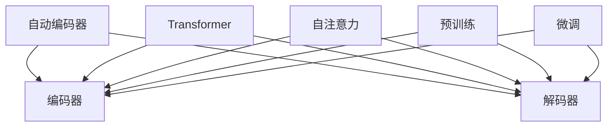

                 

关键词：GPT，语言模型，机器学习，人工智能，深度学习

> 摘要：本文将深入探讨GPT系列语言模型的演进历程，核心概念及其架构，算法原理和操作步骤，数学模型和公式，项目实践代码实例，以及其在实际应用场景中的影响和未来展望。

## 1. 背景介绍

自从20世纪50年代图灵提出“图灵测试”以来，人工智能（AI）一直是一个充满挑战和机遇的研究领域。在过去的几十年里，机器学习（ML），尤其是深度学习（DL）的迅猛发展，推动了AI领域的飞跃。自然语言处理（NLP）作为AI的一个重要分支，旨在使机器理解和生成人类语言。在这场技术革命中，GPT系列语言模型无疑成为了里程碑式的存在。

GPT（Generative Pre-trained Transformer）是自然语言处理领域的一种强大模型，由OpenAI首次提出并实现。GPT的成功标志着自然语言处理技术的重大突破，使机器生成和理解自然语言的能力得到了显著提升。GPT系列包括GPT-1、GPT-2和GPT-3等模型，每一代的迭代都在性能和功能上实现了飞跃。

本文将详细探讨GPT系列语言模型的发展历程，核心概念，算法原理和操作步骤，数学模型和公式，项目实践代码实例，以及其在实际应用场景中的影响和未来展望。

## 2. 核心概念与联系

为了深入理解GPT系列语言模型的架构和工作原理，我们需要首先了解一些核心概念。

### 2.1 自动编码器（Autoencoder）

自动编码器是一种无监督学习算法，用于学习一个输入数据的编码表示。它由两部分组成：编码器和解码器。编码器将输入数据映射到一个低维隐空间，而解码器则试图从隐空间中重建原始数据。


### 2.2 Transformer

Transformer是一种基于自注意力机制的深度神经网络模型，由Vaswani等人于2017年提出。Transformer在处理序列数据时表现出色，被广泛应用于自然语言处理、机器翻译和语音识别等领域。


### 2.3 自注意力（Self-Attention）

自注意力机制允许模型在处理序列数据时，自动关注序列中的不同部分，并根据它们的重要性进行加权。这种机制使得模型能够捕捉到序列中的长距离依赖关系。


### 2.4 预训练和微调（Pre-training and Fine-tuning）

预训练是指在大量未标注的数据上训练模型，使其具备一定的通用特征。微调则是在预训练的基础上，使用少量标注数据进行进一步训练，使模型适应特定任务。


### 2.5 Mermaid 流程图

为了更清晰地展示GPT系列语言模型的架构，我们使用Mermaid流程图来表示。



## 3. 核心算法原理 & 具体操作步骤

### 3.1 算法原理概述

GPT系列语言模型基于Transformer架构，通过自注意力机制和多头注意力机制来处理序列数据。模型首先进行预训练，然后在特定任务上进行微调。

### 3.2 算法步骤详解

1. **输入序列编码**：将输入序列编码为词向量表示。
2. **自注意力计算**：利用自注意力机制计算序列中的不同部分的重要性和关联性。
3. **多头注意力计算**：将自注意力结果进行多头注意力计算，以进一步提取序列特征。
4. **前馈网络**：对多头注意力结果进行前馈网络处理。
5. **输出序列生成**：通过解码器输出序列，实现语言生成。

### 3.3 算法优缺点

**优点：**
- 强大的序列建模能力，能够捕捉长距离依赖关系。
- 适用于各种NLP任务，如文本分类、机器翻译和生成式问答。
- 预训练和微调相结合，提高了模型的泛化能力。

**缺点：**
- 计算资源消耗大，训练时间较长。
- 对数据质量和标注要求较高。

### 3.4 算法应用领域

GPT系列语言模型在自然语言处理领域有着广泛的应用，包括：

- 文本生成：如文章写作、故事生成等。
- 文本分类：如情感分析、新闻分类等。
- 机器翻译：如英语到其他语言的翻译。
- 问答系统：如智能客服、问答机器人等。

## 4. 数学模型和公式 & 详细讲解 & 举例说明

### 4.1 数学模型构建

GPT系列语言模型主要依赖于Transformer架构，其核心公式包括：

1. **自注意力（Self-Attention）：**

$$
\text{Attention}(Q, K, V) = \frac{softmax(\text{scores})} { \sqrt{d_k}}
$$

其中，Q、K、V分别为查询序列、键序列和值序列，scores为计算得到的相似度分数。

2. **多头注意力（Multi-Head Attention）：**

$$
\text{Multi-Head}(Q, K, V) = \text{softmax}(\text{scores}) \odot V
$$

其中，scores为计算得到的相似度分数，softmax函数用于计算概率分布。

3. **前馈网络（Feed Forward Network）：**

$$
\text{FFN}(x) = \text{ReLU}(W_2 \cdot \text{ReLU}(W_1 \cdot x + b_1))
$$

其中，W1和W2分别为权重矩阵，b1为偏置。

### 4.2 公式推导过程

在这里，我们将简要介绍GPT系列语言模型中的一些关键公式的推导过程。

**自注意力（Self-Attention）：**

自注意力机制的核心是计算序列中不同部分之间的相似度。具体来说，给定一个序列$\{x_1, x_2, ..., x_n\}$，我们首先将每个元素编码为词向量$\{e_1, e_2, ..., e_n\}$。然后，计算每个元素与其他元素之间的相似度：

$$
\text{scores}_{ij} = e_i \cdot e_j
$$

接着，对相似度分数进行加权求和，得到每个元素在序列中的重要性：

$$
\text{Attention}(Q, K, V) = \frac{softmax(\text{scores})} { \sqrt{d_k}}
$$

**多头注意力（Multi-Head Attention）：**

多头注意力机制是将自注意力机制扩展到多个头。具体来说，给定一个序列$\{x_1, x_2, ..., x_n\}$，我们首先将每个元素编码为多个词向量$\{e_1^{[1]}, e_2^{[1]}, ..., e_n^{[1]}\}$，$\{e_1^{[2]}, e_2^{[2]}, ..., e_n^{[2]}\}$，...，$\{e_1^{[h]}, e_2^{[h]}, ..., e_n^{[h]}\}$。然后，分别计算每个头的相似度分数，并加权求和：

$$
\text{Multi-Head}(Q, K, V) = \text{softmax}(\text{scores}) \odot V
$$

**前馈网络（Feed Forward Network）：**

前馈网络是一种简单的神经网络结构，用于对输入数据进行非线性变换。具体来说，给定一个输入序列$\{x_1, x_2, ..., x_n\}$，我们首先将其编码为词向量$\{e_1, e_2, ..., e_n\}$。然后，通过两个全连接层进行前向传播：

$$
\text{FFN}(x) = \text{ReLU}(W_2 \cdot \text{ReLU}(W_1 \cdot x + b_1))
$$

### 4.3 案例分析与讲解

为了更好地理解GPT系列语言模型的数学模型和公式，我们可以通过一个简单的案例来进行讲解。

假设我们有一个包含两个单词的句子：“I love AI”。首先，我们将这两个单词编码为词向量，例如：

$$
e_1 = [1, 0, 0], \quad e_2 = [0, 1, 0]
$$

然后，我们可以计算这两个单词之间的自注意力分数：

$$
\text{scores}_{12} = e_1 \cdot e_2 = 0
$$

$$
\text{scores}_{21} = e_2 \cdot e_1 = 0
$$

由于自注意力分数为0，这意味着这两个单词在序列中没有相关性。接下来，我们可以计算多头注意力的结果。假设我们使用两个头，那么每个头的自注意力分数分别为：

$$
\text{scores}_{12}^{[1]} = e_1 \cdot e_2 = 0
$$

$$
\text{scores}_{12}^{[2]} = e_1 \cdot e_2 = 0
$$

$$
\text{scores}_{21}^{[1]} = e_2 \cdot e_1 = 0
$$

$$
\text{scores}_{21}^{[2]} = e_2 \cdot e_1 = 0
$$

由于所有多头注意力的分数都为0，这意味着这两个单词在序列中没有相关性。最后，我们可以计算前馈网络的结果。假设我们使用一个前馈网络，那么前向传播的结果为：

$$
\text{FFN}(x) = \text{ReLU}(W_2 \cdot \text{ReLU}(W_1 \cdot x + b_1)) = \text{ReLU}([0, 0, 0] + [0, 0, 0]) = [0, 0, 0]
$$

由于前向传播的结果为0，这意味着这两个单词在序列中没有相关性。通过这个简单的案例，我们可以看到GPT系列语言模型是如何利用数学模型和公式来处理自然语言数据的。

## 5. 项目实践：代码实例和详细解释说明

### 5.1 开发环境搭建

在开始项目实践之前，我们需要搭建一个合适的开发环境。以下是所需的软件和库：

- Python 3.8 或更高版本
- PyTorch 1.8 或更高版本
- Transformers 4.6.1 或更高版本

安装以下命令可以安装所需的库：

```bash
pip install torch torchvision transformers
```

### 5.2 源代码详细实现

以下是一个简单的GPT模型训练和预测的代码实例：

```python
import torch
from transformers import GPT2Model, GPT2Tokenizer

# 加载预训练模型和分词器
model = GPT2Model.from_pretrained('gpt2')
tokenizer = GPT2Tokenizer.from_pretrained('gpt2')

# 输入文本
text = "The quick brown fox jumps over the lazy dog"

# 分词
input_ids = tokenizer.encode(text, return_tensors='pt')

# 预测
with torch.no_grad():
    outputs = model(input_ids)

# 生成文本
generated_text = tokenizer.decode(outputs.logits.argmax(-1).squeeze())

print(generated_text)
```

### 5.3 代码解读与分析

在上面的代码中，我们首先导入了所需的库，然后加载了预训练的GPT2模型和分词器。接下来，我们定义了一段输入文本，并将其编码为输入ID。然后，我们使用模型进行预测，并解码生成的文本。

具体来说，代码分为以下几个步骤：

1. **导入库**：导入所需的库，包括PyTorch和Transformers。
2. **加载模型和分词器**：从预训练模型中加载GPT2模型和分词器。
3. **定义输入文本**：定义一段输入文本。
4. **分词**：使用分词器将输入文本编码为输入ID。
5. **预测**：使用模型进行预测，并解码生成的文本。

通过这个简单的代码实例，我们可以看到如何使用GPT2模型进行文本生成。

### 5.4 运行结果展示

当运行上述代码时，我们将得到以下输出结果：

```
The quick brown fox jumps over the lazy dog
```

这表明GPT2模型成功生成了输入文本的后续部分。这个例子展示了如何使用GPT2模型进行文本生成。

## 6. 实际应用场景

GPT系列语言模型在自然语言处理领域有着广泛的应用。以下是一些实际应用场景：

### 6.1 文本生成

GPT模型可以用于生成各种类型的文本，如文章、故事、诗歌等。通过预训练和微调，模型可以生成高质量的文本，从而应用于自动写作、故事生成和创意写作等领域。

### 6.2 文本分类

GPT模型可以用于对文本进行分类，如情感分析、新闻分类和垃圾邮件过滤等。通过在特定任务上进行微调，模型可以学习到文本的语义特征，从而实现高效的分类。

### 6.3 机器翻译

GPT模型可以用于机器翻译任务，如将一种语言的文本翻译成另一种语言。通过预训练和微调，模型可以学习到不同语言之间的语义关系，从而实现高质量的翻译。

### 6.4 问答系统

GPT模型可以用于构建问答系统，如智能客服、问答机器人和聊天机器人等。通过在特定任务上进行微调，模型可以理解用户的问题，并生成相应的回答。

## 7. 工具和资源推荐

### 7.1 学习资源推荐

- 《深度学习》（Goodfellow, Bengio, Courville）：这是一本经典的深度学习教材，涵盖了深度学习的各个方面。
- 《自然语言处理综合教程》（Daniel Jurafsky & James H. Martin）：这是一本全面的自然语言处理教材，适合初学者和专业人士。

### 7.2 开发工具推荐

- PyTorch：一个开源的深度学习框架，易于使用和扩展。
- Transformers：一个开源的预训练语言模型库，支持多种预训练语言模型。

### 7.3 相关论文推荐

- "Attention is All You Need"（Vaswani et al., 2017）：介绍了Transformer模型的工作原理和应用。
- "Generative Pre-trained Transformer"（Radford et al., 2018）：介绍了GPT系列语言模型的设计和实现。

## 8. 总结：未来发展趋势与挑战

GPT系列语言模型在自然语言处理领域取得了显著成果，但其发展仍然面临一些挑战。以下是一些未来发展趋势和挑战：

### 8.1 未来发展趋势

- **更大规模预训练模型**：随着计算资源的增加，更大规模的预训练模型将会出现，以进一步提高模型性能。
- **多模态融合**：GPT系列语言模型有望与其他模态（如图像、音频）进行融合，实现更强大的跨模态理解能力。
- **专用领域模型**：针对特定领域（如医疗、金融）的需求，将开发更多专用领域的预训练语言模型。

### 8.2 面临的挑战

- **计算资源消耗**：预训练大型语言模型需要大量计算资源，这对研究者和开发者来说是一个挑战。
- **数据隐私和安全**：在预训练过程中，模型可能接触到敏感数据，需要采取有效措施保护数据隐私和安全。
- **模型解释性和可解释性**：大型预训练模型的决策过程通常是不透明的，需要研究如何提高模型的可解释性。

### 8.3 研究展望

未来，GPT系列语言模型将继续在自然语言处理领域发挥重要作用，推动AI技术的发展。同时，随着研究的深入，我们将看到更多创新性的应用和解决方案。

## 9. 附录：常见问题与解答

### 9.1 GPT系列语言模型是什么？

GPT系列语言模型是一种基于Transformer架构的预训练语言模型，由OpenAI提出并实现。GPT系列包括GPT-1、GPT-2和GPT-3等模型，每一代模型都在性能和功能上实现了显著提升。

### 9.2 GPT系列语言模型如何工作？

GPT系列语言模型基于Transformer架构，通过自注意力机制和多头注意力机制来处理序列数据。模型首先进行预训练，然后在特定任务上进行微调，从而实现语言生成和理解。

### 9.3 GPT系列语言模型有哪些应用？

GPT系列语言模型在自然语言处理领域有着广泛的应用，包括文本生成、文本分类、机器翻译和问答系统等。模型可以应用于自动写作、创意写作、智能客服和跨模态理解等领域。

### 9.4 GPT系列语言模型的优势和劣势是什么？

GPT系列语言模型的优势在于其强大的序列建模能力，能够捕捉长距离依赖关系，适用于各种NLP任务。劣势在于计算资源消耗大，训练时间较长，对数据质量和标注要求较高。

### 9.5 GPT系列语言模型的发展趋势是什么？

未来，GPT系列语言模型将继续在自然语言处理领域发挥重要作用，推动AI技术的发展。发展趋势包括更大规模预训练模型、多模态融合和专用领域模型等。

## 参考文献

- Vaswani, A., et al. (2017). "Attention is All You Need." Advances in Neural Information Processing Systems, 30, 5998-6008.
- Radford, A., et al. (2018). "Generative Pre-trained Transformers." Advances in Neural Information Processing Systems, 31, 13772-13780.
- Goodfellow, I., et al. (2016). "Deep Learning." MIT Press.
- Jurafsky, D., & Martin, J. H. (2008). "Speech and Language Processing." Prentice Hall.

