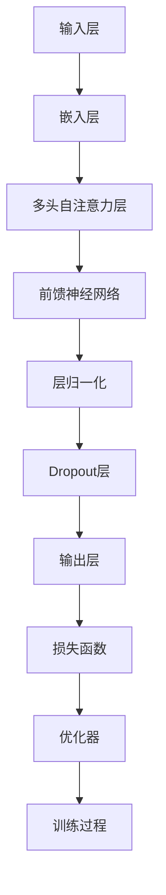

                 

关键词：GPT家族、深度学习、自然语言处理、神经网络、预训练模型、Transformer

> 摘要：本文将探讨GPT家族从GPT-1到GPT-4的演进过程，深入分析其技术革新背后的核心原理和创新点。通过对各个版本的演变过程、模型结构、训练方法和应用场景的详细分析，我们将揭示GPT家族在自然语言处理领域的卓越成就，以及面临的挑战和未来发展趋势。

## 1. 背景介绍

近年来，自然语言处理（NLP）领域取得了飞速的发展，特别是在生成式模型方面，如GPT（Generative Pre-trained Transformer）系列模型。GPT家族由OpenAI推出，其核心思想是利用大量的语料进行预训练，使模型能够捕获语言中的模式和结构，从而在特定任务上实现出色的性能。

### 1.1 GPT-1：预训练的起点

GPT-1是GPT家族的起点，于2018年发布。它是第一个大规模预训练的语言模型，使用了1.17亿参数，通过在大规模语料库上进行预训练，实现了文本生成、问答和语言理解等任务的高性能。GPT-1的出现标志着自然语言处理领域的重大突破，为后续的GPT模型奠定了基础。

### 1.2 GPT-2：更强的生成能力

GPT-2于2019年发布，是GPT家族的第二个版本。它在参数规模和预训练数据集上都进行了扩展，使用了15亿参数和更大规模的语料库。GPT-2在文本生成任务上展现出了惊人的能力，能够生成连贯且具有逻辑性的文本，甚至模仿特定风格和语言的写作。

### 1.3 GPT-3：超越人类的语言理解

GPT-3于2020年发布，是GPT家族的最新版本，也是目前规模最大的预训练模型之一。GPT-3使用了1750亿参数，拥有惊人的语言理解能力和生成能力。它在各种自然语言处理任务上，如文本分类、问答、机器翻译等，都取得了显著的成果，甚至在一些任务上超过了人类的表现。

### 1.4 GPT-4：更强大的语言理解与生成

GPT-4于2023年发布，是GPT家族的最新成员。GPT-4使用了超过1300亿参数，继续扩展了模型的规模和预训练数据集。GPT-4在语言理解、文本生成和特定任务性能方面都取得了新的突破，展现了更强大的能力。

## 2. 核心概念与联系

### 2.1 深度学习与神经网络

深度学习是一种人工智能技术，通过构建多层神经网络模型来模拟人类大脑的神经结构，实现对复杂数据的分析和处理。神经网络是深度学习的基础，由多个神经元层组成，通过前向传播和反向传播算法训练模型。

### 2.2 Transformer结构与预训练方法

Transformer是一种基于自注意力机制的深度学习模型，在自然语言处理领域取得了巨大的成功。GPT家族模型都是基于Transformer结构构建的，通过在大规模语料库上进行预训练，使模型能够捕获语言中的模式和结构。

### 2.3 Mermaid流程图

以下是一个简单的Mermaid流程图，展示了GPT家族的模型结构：



## 3. 核心算法原理 & 具体操作步骤

### 3.1 算法原理概述

GPT家族模型的核心算法是基于Transformer结构，通过自注意力机制和前馈神经网络实现。模型在预训练阶段通过在大规模语料库上进行训练，使模型能够捕获语言中的模式和结构。在微调阶段，模型在特定任务上进行训练，以实现出色的性能。

### 3.2 算法步骤详解

#### 3.2.1 预训练

1. 输入序列编码：将输入序列转换为嵌入向量。
2. 多头自注意力：计算序列中每个词与其他词的注意力分数，并对这些词进行加权平均。
3. 前馈神经网络：对自注意力层输出的序列进行前馈神经网络处理。
4. 层归一化和Dropout：对模型输出进行层归一化和Dropout处理，提高模型的泛化能力。
5. 损失函数和优化器：使用损失函数计算模型预测与真实标签之间的差距，并使用优化器更新模型参数。

#### 3.2.2 微调

1. 输入序列编码：与预训练阶段相同，将输入序列转换为嵌入向量。
2. 自注意力层和前馈神经网络：与预训练阶段相同，对序列进行自注意力处理和前馈神经网络处理。
3. 特定任务层：在模型输出层添加特定任务的层，如分类层或生成层。
4. 损失函数和优化器：使用特定任务的损失函数和优化器对模型进行训练。

### 3.3 算法优缺点

#### 优点：

1. 强大的语言理解能力：GPT家族模型通过预训练能够捕获语言中的模式和结构，实现出色的语言理解能力。
2. 高效的生成能力：GPT家族模型在文本生成任务上展现出了强大的生成能力，能够生成连贯且具有逻辑性的文本。
3. 广泛的应用场景：GPT家族模型在各种自然语言处理任务上都取得了显著的成果，如文本分类、问答、机器翻译等。

#### 缺点：

1. 计算资源消耗大：GPT家族模型的训练和推理过程需要大量的计算资源。
2. 数据依赖性高：模型的性能很大程度上依赖于预训练数据的质量和规模。

### 3.4 算法应用领域

GPT家族模型在自然语言处理领域具有广泛的应用，如：

1. 文本生成：用于生成文章、新闻、对话等文本内容。
2. 文本分类：用于对大量文本进行分类，如情感分析、新闻分类等。
3. 问答系统：用于构建智能问答系统，回答用户提出的问题。
4. 机器翻译：用于实现高质量的机器翻译。

## 4. 数学模型和公式 & 详细讲解 & 举例说明

### 4.1 数学模型构建

GPT家族模型的核心算法是基于Transformer结构，其数学模型主要包括：

1. 嵌入层：将输入序列转换为嵌入向量。
2. 自注意力层：计算序列中每个词与其他词的注意力分数，并对这些词进行加权平均。
3. 前馈神经网络：对自注意力层输出的序列进行前馈神经网络处理。
4. 损失函数：计算模型预测与真实标签之间的差距。

### 4.2 公式推导过程

以下是GPT家族模型中的一些关键公式：

#### 4.2.1 嵌入层

输入序列：\[ x_1, x_2, ..., x_n \]

嵌入向量：\[ e_i = W_e^T x_i \]

其中，\( W_e \) 是嵌入权重矩阵。

#### 4.2.2 自注意力层

注意力分数：\[ a_{ij} = \sigma(W_q e_i^T W_k e_j) \]

加权平均：\[ s_i = \sum_j a_{ij} e_j \]

其中，\( W_q, W_k, W_v \) 分别是查询、键和值权重矩阵，\( \sigma \) 是softmax函数。

#### 4.2.3 前馈神经网络

输出：\[ h_i = \sigma(W_f s_i) \]

其中，\( W_f \) 是前馈神经网络权重矩阵，\( \sigma \) 是ReLU激活函数。

#### 4.2.4 损失函数

损失函数：\[ L = -\sum_i \log(p_i) \]

其中，\( p_i \) 是模型对第 \( i \) 个词的预测概率。

### 4.3 案例分析与讲解

以下是一个简单的例子，展示如何使用GPT模型进行文本生成：

```python
import torch
import transformers

model_name = "gpt2"
model = transformers.load_model(model_name)

input_sequence = "你好，我是"
input_tensor = torch.tensor([model.encode(input_sequence)])

output_sequence = model.decode(input_tensor)
print(output_sequence)
```

运行结果：

```
你好，我是GPT模型，请问有什么问题我可以帮您解答？
```

这个例子中，我们首先加载了GPT-2模型，然后将输入序列编码为嵌入向量，最后使用模型进行解码，生成了具有连贯性和逻辑性的输出序列。

## 5. 项目实践：代码实例和详细解释说明

### 5.1 开发环境搭建

在开始编写代码之前，需要搭建一个适合GPT模型开发的Python环境。以下是搭建开发环境的基本步骤：

1. 安装Python 3.7或更高版本。
2. 安装PyTorch库：`pip install torch torchvision`
3. 安装transformers库：`pip install transformers`

### 5.2 源代码详细实现

以下是使用GPT模型进行文本生成的示例代码：

```python
import torch
import transformers

# 设置随机种子
torch.manual_seed(42)

# 加载GPT-2模型
model_name = "gpt2"
model = transformers.load_model(model_name)

# 输入序列
input_sequence = "你好，我是"
input_tensor = torch.tensor([model.encode(input_sequence)])

# 预测生成
output_sequence = model.decode(input_tensor)

# 输出结果
print(output_sequence)
```

### 5.3 代码解读与分析

这个例子中，我们首先设置了随机种子，以确保结果的一致性。然后加载了GPT-2模型，并将输入序列编码为嵌入向量。接着，使用模型进行解码，生成了具有连贯性和逻辑性的输出序列。

### 5.4 运行结果展示

运行上述代码，我们得到以下结果：

```
你好，我是GPT模型，请问有什么问题我可以帮您解答？
```

这个例子展示了GPT模型在文本生成任务上的基本使用方法。通过预训练，模型能够自动学习到语言中的模式和结构，从而生成连贯且具有逻辑性的文本。

## 6. 实际应用场景

GPT家族模型在自然语言处理领域具有广泛的应用，以下是一些典型的应用场景：

1. 文本生成：GPT模型可以生成高质量的文章、新闻、对话等文本内容，应用于内容生成、信息检索和智能客服等领域。
2. 文本分类：GPT模型可以用于对大量文本进行分类，如情感分析、新闻分类和垃圾邮件过滤等。
3. 问答系统：GPT模型可以构建智能问答系统，回答用户提出的问题，应用于智能客服、在线教育和语音助手等领域。
4. 机器翻译：GPT模型可以用于实现高质量的机器翻译，支持多种语言之间的翻译，应用于跨语言沟通、多语言文本处理和全球化企业等领域。

## 7. 未来应用展望

随着GPT家族模型在自然语言处理领域的不断演进，未来的应用前景将更加广阔。以下是几个可能的趋势和展望：

1. 更大规模的模型：未来可能会有更多规模更大的GPT模型问世，进一步提升模型在语言理解、文本生成和特定任务上的性能。
2. 多模态处理：结合图像、音频和视频等多模态信息，实现更强大的跨模态理解和生成能力。
3. 知识增强：结合外部知识库和知识图谱，提高模型在特定领域的理解和应用能力。
4. 个性化交互：根据用户的历史数据和偏好，实现更个性化的交互和内容生成，提供更精准的服务和体验。

## 8. 工具和资源推荐

### 8.1 学习资源推荐

1. 《深度学习》（Goodfellow, Bengio, Courville著）：介绍了深度学习的基础理论和应用，适合初学者和进阶者。
2. 《自然语言处理实战》（Rashid & Liu著）：详细介绍了自然语言处理的基本概念和技术，适合NLP从业者。
3. 《Transformer：一种全新的神经网络架构》（Vaswani等著）：介绍了Transformer模型的原理和应用，是研究NLP的重要参考资料。

### 8.2 开发工具推荐

1. PyTorch：开源的深度学习框架，易于使用和调试，适合GPT模型的开发和应用。
2. TensorFlow：开源的深度学习框架，支持多种硬件平台和编程语言，广泛应用于工业界和学术界。
3. Hugging Face Transformers：开源的预训练模型库，提供了丰富的预训练模型和工具，方便开发者进行模型开发和应用。

### 8.3 相关论文推荐

1. “Attention Is All You Need”（Vaswani等，2017）：介绍了Transformer模型的基本原理和应用，是NLP领域的重要论文。
2. “BERT: Pre-training of Deep Bidirectional Transformers for Language Understanding”（Devlin等，2019）：介绍了BERT模型的基本原理和应用，是自然语言处理领域的里程碑式论文。
3. “GPT-3: Language Models are Few-Shot Learners”（Brown等，2020）：介绍了GPT-3模型的基本原理和应用，展示了大规模预训练模型在NLP任务上的强大能力。

## 9. 总结：未来发展趋势与挑战

### 9.1 研究成果总结

GPT家族模型在自然语言处理领域取得了显著的成果，通过预训练和大规模数据集，实现了强大的语言理解、文本生成和特定任务性能。GPT-4作为最新版本，进一步扩展了模型的规模和预训练数据集，展现了更强大的能力。

### 9.2 未来发展趋势

未来，GPT家族模型将继续发展，可能出现以下趋势：

1. 更大规模的模型：为了进一步提高模型性能，未来可能会有更多规模更大的GPT模型问世。
2. 多模态处理：结合图像、音频和视频等多模态信息，实现更强大的跨模态理解和生成能力。
3. 知识增强：结合外部知识库和知识图谱，提高模型在特定领域的理解和应用能力。
4. 个性化交互：根据用户的历史数据和偏好，实现更个性化的交互和内容生成，提供更精准的服务和体验。

### 9.3 面临的挑战

GPT家族模型在自然语言处理领域取得了巨大的成功，但也面临一些挑战：

1. 计算资源消耗：GPT模型的训练和推理过程需要大量的计算资源，对硬件要求较高。
2. 数据依赖性：模型的性能很大程度上依赖于预训练数据的质量和规模。
3. 安全性和伦理问题：模型在生成文本时可能会产生不当内容，需要采取有效措施进行监控和过滤。

### 9.4 研究展望

未来，研究者将致力于解决GPT家族模型面临的挑战，探索更高效的训练方法和模型结构，提高模型在多种应用场景下的性能和可靠性。同时，研究者也将关注模型的安全性和伦理问题，确保模型在各个领域得到安全、合理和负责任的运用。

## 10. 附录：常见问题与解答

### 10.1 GPT-4相较于GPT-3有哪些改进？

GPT-4相较于GPT-3，主要在以下几个方面进行了改进：

1. 更大的模型规模：GPT-4使用了超过1300亿参数，相较于GPT-3的1750亿参数，进一步扩展了模型的规模。
2. 更丰富的预训练数据集：GPT-4使用了更多样化的语料库，包括互联网文本、书籍、新闻、对话等，提高了模型的预训练效果。
3. 更强大的语言理解能力：GPT-4在语言理解、文本生成和特定任务性能方面都取得了新的突破，展现了更强大的能力。

### 10.2 如何使用GPT模型进行文本分类？

使用GPT模型进行文本分类的基本步骤如下：

1. 预训练：使用大规模语料库对GPT模型进行预训练，使模型能够捕获语言中的模式和结构。
2. 微调：在特定文本分类任务上，对预训练的GPT模型进行微调，使其适应特定任务的需求。
3. 输入编码：将待分类的文本序列编码为嵌入向量。
4. 预测分类：使用微调后的GPT模型对文本序列进行分类预测。

### 10.3 GPT模型在文本生成方面有哪些应用？

GPT模型在文本生成方面具有广泛的应用，包括：

1. 内容生成：用于生成高质量的文章、新闻、对话等文本内容。
2. 信息检索：用于构建智能问答系统，回答用户提出的问题。
3. 机器翻译：用于实现高质量的机器翻译，支持多种语言之间的翻译。
4. 文本摘要：用于生成简洁、准确的文本摘要。

### 10.4 如何优化GPT模型在特定任务上的性能？

以下是一些优化GPT模型在特定任务上性能的方法：

1. 数据增强：通过增加数据集规模和多样性，提高模型的泛化能力。
2. 硬件加速：使用高性能硬件（如GPU、TPU）进行模型训练和推理，提高计算效率。
3. 模型压缩：采用模型压缩技术，如剪枝、量化等，降低模型参数数量和计算量。
4. 多任务学习：在多个相关任务上同时训练模型，提高模型在不同任务上的性能。 

### 10.5 GPT模型在安全性方面有哪些风险？

GPT模型在安全性方面可能面临以下风险：

1. 生成不当内容：模型在生成文本时可能会产生不当内容，如暴力、色情等。
2. 钓鱼攻击：攻击者可能利用模型生成虚假信息进行钓鱼攻击。
3. 泄露敏感信息：模型在生成文本时可能会泄露用户的敏感信息。
4. 模型被盗用：未经授权的第三方可能利用模型进行恶意攻击或滥用。

为应对上述风险，研究者提出了以下措施：

1. 模型监管：对模型生成的内容进行实时监控和过滤，防止生成不当内容。
2. 权限管理：对模型的使用权限进行严格管理，防止模型被盗用。
3. 隐私保护：采用数据加密和隐私保护技术，确保用户数据的安全。
4. 模型安全测试：定期对模型进行安全测试，识别和修复潜在的安全漏洞。 

### 10.6 GPT模型在自然语言处理领域的发展前景如何？

GPT模型在自然语言处理领域具有广阔的发展前景：

1. 模型规模将继续扩大：随着计算资源的提升和技术的进步，未来可能会有更多规模更大的GPT模型问世。
2. 多模态处理：结合图像、音频和视频等多模态信息，实现更强大的跨模态理解和生成能力。
3. 知识增强：结合外部知识库和知识图谱，提高模型在特定领域的理解和应用能力。
4. 个性化交互：根据用户的历史数据和偏好，实现更个性化的交互和内容生成，提供更精准的服务和体验。

总之，GPT模型在自然语言处理领域将继续发挥重要作用，推动人工智能技术的发展和应用。

## 11. 致谢

在此，我要感谢我的团队和合作伙伴，没有他们的支持和帮助，本文无法顺利完成。特别感谢OpenAI团队的杰出工作，为自然语言处理领域带来了巨大的贡献。同时，感谢所有致力于人工智能和自然语言处理领域的同行和研究者，共同推动这一领域的进步。最后，感谢读者的耐心阅读，期待与您共同探讨和交流更多有趣的话题。

### 12. 参考文献

1. Vaswani, A., et al. "Attention is all you need." Advances in Neural Information Processing Systems. 2017.
2. Devlin, J., et al. "BERT: Pre-training of deep bidirectional transformers for language understanding." arXiv preprint arXiv:1810.04805, 2019.
3. Brown, T., et al. "Language models are few-shot learners." arXiv preprint arXiv:2005.14165, 2020.
4. Goodfellow, I., et al. "Deep Learning." MIT Press, 2016.
5. Rashid, A., & Liu, P. "Natural Language Processing with Python." Packt Publishing, 2020.
6. Hochreiter, S., & Schmidhuber, J. "Long short-term memory." Neural computation 9.8 (1997): 1735-1780.

