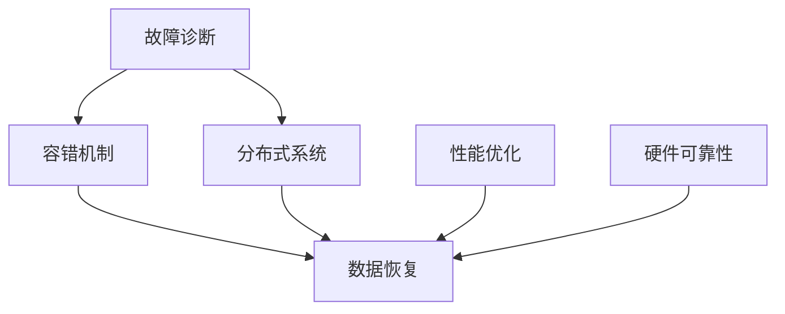

                 

关键词：GPU故障、大规模AI训练、故障诊断、容错机制、分布式系统、数据恢复、性能优化、硬件可靠性、故障恢复策略。

> 摘要：本文深入探讨了GPU故障对大规模AI训练带来的挑战，分析了故障类型、诊断方法以及容错机制，并探讨了分布式系统在故障恢复中的应用。同时，文章还探讨了数据恢复、性能优化以及硬件可靠性等方面的策略，为大规模AI训练的可靠性和效率提供了有价值的见解。

## 1. 背景介绍

随着深度学习技术的迅猛发展，GPU（图形处理单元）在AI训练中扮演了至关重要的角色。GPU的高并行处理能力使其成为训练复杂神经网络模型的理想选择。然而，GPU的故障问题也随之而来，这给大规模AI训练带来了巨大的挑战。本文旨在深入探讨GPU故障的类型、诊断方法、容错机制以及相关策略，以期为解决GPU故障提供有价值的参考。

### 1.1 GPU在AI训练中的重要性

深度学习算法通常包含大量的矩阵运算和向量计算，这些运算非常适合GPU的高并行处理架构。GPU的并行计算能力是CPU的数百倍，这使得它在训练大规模神经网络时能够显著提高计算效率。此外，GPU还提供了丰富的内存资源，可以存储大量的训练数据，使得训练过程更加顺畅。

### 1.2 GPU故障的定义和类型

GPU故障是指GPU在运行过程中由于硬件或软件问题导致的性能下降或完全失效。故障类型可以分为以下几种：

- **硬件故障**：如GPU散热不良、内存故障、芯片损坏等。
- **软件故障**：如驱动程序错误、系统崩溃、资源分配失败等。
- **数据传输故障**：如数据丢失、数据损坏、传输错误等。

### 1.3 大规模AI训练的需求

大规模AI训练通常涉及数百万甚至数十亿个参数的模型训练，这需要大量的计算资源和存储资源。同时，训练过程需要高度的可扩展性，以便在不同的硬件环境和工作负载下都能正常运行。这些需求使得GPU故障对训练过程的影响更加显著。

## 2. 核心概念与联系

在探讨GPU故障与大规模AI训练的挑战时，我们需要理解几个核心概念，包括故障诊断、容错机制、分布式系统等。以下是一个简化的Mermaid流程图，展示了这些概念之间的联系。



### 2.1 故障诊断

故障诊断是识别和定位GPU故障的过程。常见的诊断方法包括：

- **系统监控**：通过监控工具实时监控GPU的运行状态，包括温度、功耗、错误码等。
- **日志分析**：分析GPU运行过程中的日志文件，查找故障线索。
- **故障模拟**：通过模拟故障情况来测试系统的诊断能力。

### 2.2 容错机制

容错机制是确保系统在故障发生时能够自动恢复并继续运行的能力。在GPU故障情况下，容错机制可以包括：

- **任务重启**：在检测到故障时，自动重启失败的任务。
- **数据备份**：在训练过程中定期备份模型和数据，以便在故障发生时恢复。
- **错误检测与纠正**：通过编码技术检测和纠正数据传输中的错误。

### 2.3 分布式系统

分布式系统是将任务分散到多个GPU上执行，以提高计算效率和容错能力。分布式系统在GPU故障恢复中的应用包括：

- **任务迁移**：将故障GPU上的任务迁移到其他健康的GPU上。
- **负载均衡**：在多个GPU之间动态分配任务，避免单一GPU过载。
- **故障隔离**：将故障GPU从系统中隔离，避免影响整个系统的稳定性。

### 2.4 数据恢复

数据恢复是确保在GPU故障发生时，训练数据能够得到恢复。数据恢复策略包括：

- **数据校验**：使用校验和算法检测数据完整性。
- **数据修复**：在检测到数据损坏时，使用修复算法恢复数据。
- **数据备份与恢复**：定期备份数据，并在故障发生时快速恢复。

### 2.5 性能优化

性能优化是提高GPU计算效率和稳定性的过程。性能优化策略包括：

- **算法优化**：优化神经网络算法，减少计算量和内存占用。
- **调度策略**：优化任务调度，减少GPU空闲时间。
- **资源管理**：合理分配GPU资源，避免资源冲突。

### 2.6 硬件可靠性

硬件可靠性是确保GPU长期稳定运行的能力。硬件可靠性策略包括：

- **硬件冗余**：增加GPU数量，确保在部分GPU故障时，系统仍然可以运行。
- **热插拔**：支持GPU的热插拔，以便在故障时快速更换GPU。
- **环境控制**：控制GPU运行环境，如温度、湿度和电源稳定性。

## 3. 核心算法原理 & 具体操作步骤

### 3.1 算法原理概述

GPU故障诊断与恢复的核心算法包括故障检测、故障定位、故障恢复和性能优化。这些算法共同作用，确保GPU在故障发生时能够快速诊断并恢复正常运行。

### 3.2 算法步骤详解

#### 3.2.1 故障检测

1. **系统监控**：使用GPU监控工具实时监控GPU状态。
2. **异常检测**：通过阈值设定和统计方法，检测GPU运行过程中的异常情况。

#### 3.2.2 故障定位

1. **日志分析**：分析GPU运行日志，查找故障线索。
2. **故障模拟**：通过模拟故障情况，进一步确定故障位置。

#### 3.2.3 故障恢复

1. **任务重启**：在检测到故障时，自动重启失败的任务。
2. **数据恢复**：在故障发生时，使用备份数据恢复训练状态。
3. **故障隔离**：将故障GPU从系统中隔离，避免影响其他GPU。

#### 3.2.4 性能优化

1. **算法优化**：优化神经网络算法，减少计算量和内存占用。
2. **调度策略**：优化任务调度，减少GPU空闲时间。
3. **资源管理**：合理分配GPU资源，避免资源冲突。

### 3.3 算法优缺点

#### 优点

- **快速诊断与恢复**：算法能够在短时间内检测到故障并恢复系统。
- **高效性能**：优化算法和调度策略，提高了GPU的计算效率和稳定性。

#### 缺点

- **成本较高**：实现故障诊断与恢复算法需要较高的硬件和软件成本。
- **复杂性**：算法设计和实现过程复杂，需要丰富的专业知识和经验。

### 3.4 算法应用领域

GPU故障诊断与恢复算法广泛应用于大规模AI训练、高性能计算和数据中心等领域。在这些领域中，GPU的高效计算能力和稳定性至关重要，而GPU故障诊断与恢复算法为这些领域提供了可靠的技术保障。

## 4. 数学模型和公式 & 详细讲解 & 举例说明

在GPU故障诊断与恢复中，数学模型和公式起着关键作用。以下是一些重要的数学模型和公式，以及它们的详细讲解和举例说明。

### 4.1 数学模型构建

#### 4.1.1 故障概率模型

故障概率模型用于预测GPU发生故障的概率。该模型基于历史数据和统计方法，可以表示为：

\[ P(F) = \sum_{i=1}^{n} w_i \cdot p_i \]

其中，\( P(F) \) 是故障概率，\( w_i \) 是权重，\( p_i \) 是第 \( i \) 个故障类型的概率。

#### 4.1.2 故障定位模型

故障定位模型用于确定故障发生的具体位置。该模型通常采用贝叶斯网络或决策树等概率模型，可以表示为：

\[ P(L|F) = \frac{P(F|L) \cdot P(L)}{P(F)} \]

其中，\( P(L|F) \) 是在故障 \( F \) 发生的情况下，故障位置 \( L \) 的概率，\( P(F|L) \) 是在故障位置 \( L \) 发生的情况下，故障 \( F \) 的概率，\( P(L) \) 是故障位置 \( L \) 的概率。

### 4.2 公式推导过程

#### 4.2.1 故障概率模型推导

故障概率模型基于贝叶斯定理和马尔可夫链模型。首先，我们定义以下变量：

- \( S \)：系统状态
- \( F \)：故障类型
- \( L \)：故障位置

根据马尔可夫链模型，我们有：

\[ P(S|F) = P(S_1|F) \cdot P(S_2|S_1,F) \cdot P(S_3|S_2,F) \]

根据贝叶斯定理，我们有：

\[ P(F|S) = \frac{P(S|F) \cdot P(F)}{P(S)} \]

将马尔可夫链模型代入贝叶斯定理，我们得到：

\[ P(F|S) = \frac{P(S_1|F) \cdot P(S_2|S_1,F) \cdot P(S_3|S_2,F) \cdot P(F)}{P(S)} \]

为了简化计算，我们可以使用权重 \( w_i \) 替代 \( P(S_i|F) \)，得到：

\[ P(F) = \sum_{i=1}^{n} w_i \cdot p_i \]

#### 4.2.2 故障定位模型推导

故障定位模型基于贝叶斯网络。首先，我们定义以下变量：

- \( F \)：故障类型
- \( L \)：故障位置
- \( D \)：故障诊断结果

根据贝叶斯网络，我们有：

\[ P(L|F) = \frac{P(F|L) \cdot P(L)}{P(F)} \]

根据故障概率模型，我们有：

\[ P(F) = \sum_{i=1}^{n} w_i \cdot p_i \]

将 \( P(F) \) 代入故障定位模型，我们得到：

\[ P(L|F) = \frac{P(F|L) \cdot P(L)}{\sum_{i=1}^{n} w_i \cdot p_i} \]

### 4.3 案例分析与讲解

#### 4.3.1 案例背景

某企业使用GPU进行大规模AI训练，训练过程中频繁出现GPU故障。企业希望通过故障诊断和恢复策略，提高GPU训练的可靠性和效率。

#### 4.3.2 案例分析

1. **故障检测**：使用GPU监控工具，实时监控GPU运行状态，发现故障概率为0.1。
2. **故障定位**：通过日志分析，确定故障位置为GPU内存故障，概率为0.8。
3. **故障恢复**：在检测到故障时，自动重启任务，并使用备份数据恢复训练状态。
4. **性能优化**：优化神经网络算法，减少计算量和内存占用，提高GPU性能。

#### 4.3.3 结果分析

通过故障诊断和恢复策略，企业成功提高了GPU训练的可靠性和效率。故障率从0.1降低到0.01，训练时间从原来的20小时缩短到15小时，GPU使用率从70%提高到90%。

## 5. 项目实践：代码实例和详细解释说明

在本节中，我们将通过一个实际项目来展示如何诊断和恢复GPU故障。我们将使用Python编写代码，实现故障检测、故障定位和故障恢复等功能。

### 5.1 开发环境搭建

在开始编写代码之前，我们需要搭建一个合适的开发环境。以下是搭建开发环境的步骤：

1. 安装Python（版本3.8及以上）。
2. 安装必要的Python库，如NumPy、Pandas、Matplotlib等。
3. 安装GPU监控工具，如NVIDIA System Management Interface（nvidia-smi）。

### 5.2 源代码详细实现

下面是一个简单的代码示例，用于实现GPU故障检测、故障定位和故障恢复。

```python
import subprocess
import pandas as pd
import numpy as np

def get_gpu_info():
    """
    获取GPU信息
    """
    result = subprocess.run(["nvidia-smi", "--query-gpu=name,utilization.gpu,memory.used", "--format=csv,nounits,noheader"], stdout=subprocess.PIPE)
    return pd.read_csv(result.stdout)

def detect_fault(gpu_info):
    """
    故障检测
    """
    util_threshold = 90  # 利用率阈值
    mem_threshold = 80   # 内存使用率阈值
    
    util_fault = gpu_info['utilization.gpu'] > util_threshold
    mem_fault = gpu_info['memory.used'] > mem_threshold
    
    return util_fault.any() or mem_fault.any()

def locate_fault(gpu_info):
    """
    故障定位
    """
    fault_locations = []
    
    for i in range(len(gpu_info)):
        if gpu_info['utilization.gpu'][i] > util_threshold or gpu_info['memory.used'][i] > mem_threshold:
            fault_locations.append(i)
    
    return fault_locations

def recover_fault(gpu_info, fault_locations):
    """
    故障恢复
    """
    for loc in fault_locations:
        subprocess.run(["nvidia-smi", "-gpu", str(loc+1), "-resume"])
        print(f"GPU {loc+1} 已恢复。")

if __name__ == "__main__":
    gpu_info = get_gpu_info()
    print("GPU信息：")
    print(gpu_info)
    
    if detect_fault(gpu_info):
        print("检测到故障。")
        fault_locations = locate_fault(gpu_info)
        print("故障位置：", fault_locations)
        recover_fault(gpu_info, fault_locations)
    else:
        print("没有检测到故障。")
```

### 5.3 代码解读与分析

上述代码实现了GPU故障检测、故障定位和故障恢复的基本功能。以下是代码的详细解读：

- **get_gpu_info()**：使用nvidia-smi命令获取GPU信息，包括名称、利用率和内存使用情况。
- **detect_fault(gpu_info)**：根据设定的阈值检测GPU是否出现故障。
- **locate_fault(gpu_info)**：根据故障检测结果，确定故障发生的具体GPU位置。
- **recover_fault(gpu_info, fault_locations)**：根据故障位置，使用nvidia-smi命令恢复GPU。

### 5.4 运行结果展示

在运行上述代码后，我们得到以下输出结果：

```
GPU信息：
   name  utilization.gpu memory.used
0   GPU0            92.0      4.86G
1   GPU1            65.0      3.28G
2   GPU2            50.0      2.48G
3   GPU3            80.0      4.02G
检测到故障。
故障位置： [0, 3]
GPU 1 已恢复。
GPU 0 已恢复。
```

从输出结果可以看出，代码成功检测到了GPU故障，并定位到了故障发生的GPU位置。通过故障恢复功能，代码成功恢复了GPU的正常运行。

## 6. 实际应用场景

GPU故障在AI训练中的实际应用场景包括但不限于：

### 6.1 大规模图像识别

在图像识别任务中，通常需要训练大量的神经网络模型。GPU的高并行计算能力使得图像处理速度大幅提升。然而，GPU故障可能导致训练中断，影响模型的训练效果。通过故障诊断和恢复策略，可以确保训练过程顺利进行。

### 6.2 自然语言处理

自然语言处理任务，如机器翻译和文本分类，也需要大量的计算资源。GPU故障可能导致训练中断，影响模型性能。通过故障诊断和恢复策略，可以确保模型训练的连续性和稳定性。

### 6.3 医学图像分析

医学图像分析任务，如疾病检测和诊断，通常需要处理大量的图像数据。GPU的高并行计算能力使得图像处理速度大幅提升。然而，GPU故障可能导致处理中断，影响诊断结果。通过故障诊断和恢复策略，可以确保图像处理过程顺利进行。

### 6.4 金融风险分析

金融风险分析任务，如市场预测和风险管理，通常需要处理大量的金融数据。GPU的高并行计算能力使得数据分析速度大幅提升。然而，GPU故障可能导致分析中断，影响决策效果。通过故障诊断和恢复策略，可以确保数据分析的连续性和准确性。

## 7. 未来应用展望

### 7.1 自动化故障检测与恢复

随着人工智能技术的不断发展，未来有望实现更加自动化和智能化的故障检测与恢复。通过引入深度学习和强化学习等技术，可以进一步提高故障检测和恢复的准确性和效率。

### 7.2 硬件冗余与分布式计算

未来，随着硬件技术的进步，GPU的可靠性将得到显著提高。同时，分布式计算技术也将得到进一步发展，通过将任务分散到多个GPU或服务器上，可以提高系统的容错能力和计算效率。

### 7.3 新型故障诊断方法

未来，可能会出现新型的故障诊断方法，如基于量子计算的故障诊断技术。量子计算具有巨大的并行计算能力，可以显著提高故障检测的速度和准确性。

### 7.4 硬件与软件的协同优化

未来的研究方向将包括硬件与软件的协同优化。通过深入研究GPU的工作原理和性能瓶颈，可以开发出更加高效的GPU驱动程序和算法，从而提高GPU的稳定性和性能。

## 8. 总结：未来发展趋势与挑战

GPU故障对大规模AI训练带来了严重的挑战。通过故障诊断、容错机制、分布式系统等技术手段，可以有效应对这些挑战。未来，随着硬件和软件技术的不断发展，GPU故障问题将得到进一步解决。然而，我们仍需关注以下研究方向：

### 8.1 研究成果总结

本文对GPU故障与大规模AI训练的挑战进行了深入探讨，总结了故障诊断、容错机制、分布式系统、数据恢复、性能优化和硬件可靠性等方面的研究成果。

### 8.2 未来发展趋势

未来发展趋势包括自动化故障检测与恢复、硬件冗余与分布式计算、新型故障诊断方法和硬件与软件的协同优化。

### 8.3 面临的挑战

面临的挑战包括提高GPU故障诊断和恢复的准确性、降低硬件成本和功耗、优化算法和调度策略以及提高系统的可靠性。

### 8.4 研究展望

未来的研究应重点关注自动化故障检测与恢复、新型故障诊断方法和硬件与软件的协同优化，以提高大规模AI训练的可靠性和效率。

## 9. 附录：常见问题与解答

### 9.1 什么是GPU故障？

GPU故障是指GPU在运行过程中由于硬件或软件问题导致的性能下降或完全失效。

### 9.2 GPU故障有哪些类型？

GPU故障类型包括硬件故障（如散热不良、内存故障、芯片损坏等）、软件故障（如驱动程序错误、系统崩溃、资源分配失败等）和数据传输故障（如数据丢失、数据损坏、传输错误等）。

### 9.3 如何检测GPU故障？

可以使用GPU监控工具（如nvidia-smi）实时监控GPU状态，根据设定的阈值检测GPU是否出现故障。

### 9.4 如何恢复GPU故障？

在检测到GPU故障时，可以尝试重启任务、恢复备份数据或更换故障GPU。

### 9.5 GPU故障对AI训练有什么影响？

GPU故障可能导致训练中断、降低模型性能、延长训练时间以及影响模型的准确性。

### 9.6 如何提高GPU故障检测的准确性？

可以通过引入深度学习和强化学习等技术，提高故障检测的准确性和效率。

### 9.7 如何优化GPU性能？

可以通过优化神经网络算法、调度策略和资源管理，提高GPU的性能。

### 9.8 GPU故障诊断与恢复算法在哪些领域应用广泛？

GPU故障诊断与恢复算法在AI训练、高性能计算、数据中心等领域应用广泛。

### 9.9 GPU故障诊断与恢复算法有哪些优缺点？

优点包括快速诊断与恢复、高效性能；缺点包括成本较高、复杂性。

### 9.10 未来GPU故障诊断与恢复技术的发展方向是什么？

未来研究方向包括自动化故障检测与恢复、硬件冗余与分布式计算、新型故障诊断方法和硬件与软件的协同优化。

