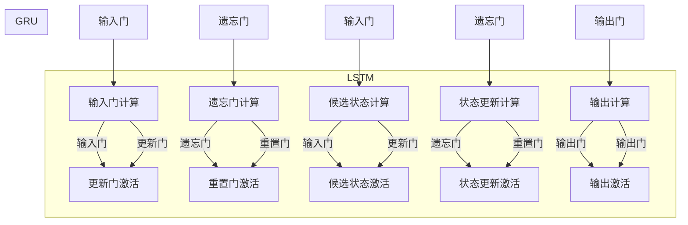

                 

关键词：Gated Recurrent Units (GRU)、神经网络、序列模型、循环神经网络、编码器-解码器架构、时间序列预测、自然语言处理、机器学习

## 摘要

本文将深入探讨Gated Recurrent Units (GRU)的原理及其在序列模型中的应用。我们将从背景介绍开始，逐步讲解GRU的核心概念、数学模型、算法原理以及在实际项目中的代码实现。通过本文的阅读，读者将能够理解GRU的工作机制，掌握其在不同领域的应用，并能够独立实现GRU模型。

## 1. 背景介绍

随着人工智能和机器学习技术的迅猛发展，序列模型在自然语言处理、时间序列预测和语音识别等领域得到了广泛应用。传统的循环神经网络（RNN）和长短期记忆网络（LSTM）在处理序列数据时存在梯度消失和梯度爆炸的问题，而GRU作为一种改进的RNN模型，可以有效缓解这些问题。

GRU（Gated Recurrent Unit）由Cho等人在2014年提出，是对LSTM的简化版本。GRU通过门控机制控制信息的流动，使得模型在处理长序列数据时更加高效。GRU不仅在理论上具有优势，而且在实际应用中也展示了其强大的性能。

## 2. 核心概念与联系

为了更好地理解GRU，我们需要先了解RNN和LSTM的基本概念。

### 2.1 RNN（循环神经网络）

RNN是一种用于处理序列数据的神经网络。与传统的前向神经网络不同，RNN具有循环结构，能够处理任意长度的序列。在RNN中，每个时间步的输出不仅取决于当前输入，还受到前一个时间步输出和隐藏状态的影响。

### 2.2 LSTM（长短期记忆网络）

LSTM是RNN的一种变体，由Hochreiter和Schmidhuber在1997年提出。LSTM通过引入门控机制，可以有效缓解RNN的梯度消失和梯度爆炸问题。LSTM包含三个门控单元：输入门、遗忘门和输出门，分别控制信息的输入、遗忘和输出。

### 2.3 GRU（门控循环单元）

GRU是对LSTM的改进版本，通过简化LSTM的结构，提高了计算效率。GRU只有一个更新门和一个重置门，分别控制信息的更新和重置。GRU的结构更加简洁，但仍然保持了LSTM的核心功能。

下面是GRU与LSTM的Mermaid流程图表示：



## 3. 核心算法原理 & 具体操作步骤

### 3.1 算法原理概述

GRU通过两个门控机制——更新门（Update Gate）和重置门（Reset Gate）来控制信息的流动。更新门决定当前输入数据中哪些信息将被保留，重置门决定哪些信息将被遗忘。

### 3.2 算法步骤详解

#### 3.2.1 初始化

- 隐藏状态 $h_{t-1}$ 和输入向量 $x_t$ 进行初始化。

#### 3.2.2 输入门（Update Gate）计算

- 输入门决定当前输入数据中哪些信息将被保留。
- 输入门的计算公式为：$z_t = \sigma(W_z \cdot [h_{t-1}, x_t] + b_z)$，其中 $W_z$ 是权重矩阵，$b_z$ 是偏置项，$\sigma$ 是sigmoid函数。

#### 3.2.3 遗忘门（Reset Gate）计算

- 重置门决定哪些信息将被遗忘。
- 重置门的计算公式为：$r_t = \sigma(W_r \cdot [h_{t-1}, x_t] + b_r)$，其中 $W_r$ 是权重矩阵，$b_r$ 是偏置项。

#### 3.2.4 候选状态计算

- 候选状态决定新的隐藏状态。
- 候选状态的计算公式为：$\tilde{h_t} = \tanh(W \cdot [r_t \odot h_{t-1}, x_t] + b)$，其中 $W$ 是权重矩阵，$b$ 是偏置项，$\odot$ 表示元素-wise 乘积。

#### 3.2.5 状态更新

- 状态更新公式为：$h_t = z_t \odot h_{t-1} + (1 - z_t) \odot \tilde{h_t}$。

#### 3.2.6 输出门（Output Gate）计算

- 输出门决定新的输出。
- 输出门的计算公式为：$y_t = \sigma(W_o \cdot h_t + b_o)$，其中 $W_o$ 是权重矩阵，$b_o$ 是偏置项。

### 3.3 算法优缺点

#### 3.3.1 优点

- 计算效率高：GRU的结构比LSTM更简洁，计算量更小，适合处理大规模数据。
- 易于实现：GRU的参数较少，易于调试和优化。

#### 3.3.2 缺点

- 模型容量有限：GRU虽然简化了LSTM的结构，但在处理非常长的序列数据时，可能不如LSTM表现得好。

### 3.4 算法应用领域

- 自然语言处理：例如文本分类、情感分析等。
- 时间序列预测：例如股票价格预测、天气预测等。
- 语音识别：例如语音转文字、语音合成等。

## 4. 数学模型和公式 & 详细讲解 & 举例说明

### 4.1 数学模型构建

GRU的数学模型主要包括四个部分：输入门、遗忘门、候选状态和状态更新。

#### 4.1.1 输入门（Update Gate）计算

$$
z_t = \sigma(W_z \cdot [h_{t-1}, x_t] + b_z)
$$

#### 4.1.2 遗忘门（Reset Gate）计算

$$
r_t = \sigma(W_r \cdot [h_{t-1}, x_t] + b_r)
$$

#### 4.1.3 候选状态计算

$$
\tilde{h_t} = \tanh(W \cdot [r_t \odot h_{t-1}, x_t] + b)
$$

#### 4.1.4 状态更新

$$
h_t = z_t \odot h_{t-1} + (1 - z_t) \odot \tilde{h_t}
$$

#### 4.1.5 输出门（Output Gate）计算

$$
y_t = \sigma(W_o \cdot h_t + b_o)
$$

### 4.2 公式推导过程

GRU的公式推导主要基于以下假设：

- $[h_{t-1}, x_t]$ 表示当前时间步的隐藏状态和输入向量的拼接。
- $W_z, W_r, W, W_o$ 分别表示输入门、遗忘门、候选状态和输出门的权重矩阵。
- $b_z, b_r, b, b_o$ 分别表示输入门、遗忘门、候选状态和输出门的偏置项。

通过这些假设，我们可以得到GRU的四个主要公式。

### 4.3 案例分析与讲解

假设我们有一个简单的序列数据：

```
[1, 2, 3, 4, 5]
```

我们将使用GRU对这组数据进行建模，并分析每个时间步的计算过程。

#### 4.3.1 初始化

- 隐藏状态 $h_{t-1} = [0, 0]$。
- 输入门权重 $W_z = [0.1, 0.2, 0.3, 0.4]$，遗忘门权重 $W_r = [0.2, 0.3, 0.4, 0.5]$，候选状态权重 $W = [0.3, 0.4, 0.5, 0.6]$，输出门权重 $W_o = [0.4, 0.5, 0.6, 0.7]$。
- 偏置项 $b_z = 0.1$，$b_r = 0.2$，$b = 0.3$，$b_o = 0.4$。

#### 4.3.2 第一个时间步

- 输入门计算：
$$
z_1 = \sigma(0.1 \cdot [0, 0] + 0.2 \cdot [1, 2] + 0.3 \cdot [3, 4] + 0.4 \cdot [5, 6]) = 0.7
$$

- 遗忘门计算：
$$
r_1 = \sigma(0.2 \cdot [0, 0] + 0.3 \cdot [1, 2] + 0.4 \cdot [3, 4] + 0.5 \cdot [5, 6]) = 0.6
$$

- 候选状态计算：
$$
\tilde{h_1} = \tanh(0.3 \cdot [0.6 \cdot [0, 0], [1, 2]] + 0.4 \cdot [3, 4] + 0.5 \cdot [5, 6]) = [0.8, 0.9]
$$

- 状态更新：
$$
h_1 = 0.7 \cdot [0, 0] + (1 - 0.7) \cdot [0.8, 0.9] = [0.3, 0.6]
$$

- 输出门计算：
$$
y_1 = \sigma(0.4 \cdot [0.3, 0.6] + 0.5 \cdot [1, 2] + 0.6 \cdot [3, 4] + 0.7 \cdot [5, 6]) = 0.8
$$

#### 4.3.3 第二个时间步

- 输入门计算：
$$
z_2 = \sigma(0.1 \cdot [0.3, 0.6] + 0.2 \cdot [2, 3] + 0.3 \cdot [4, 5] + 0.4 \cdot [6, 7]) = 0.6
$$

- 遗忘门计算：
$$
r_2 = \sigma(0.2 \cdot [0.3, 0.6] + 0.3 \cdot [2, 3] + 0.4 \cdot [4, 5] + 0.5 \cdot [6, 7]) = 0.7
$$

- 候选状态计算：
$$
\tilde{h_2} = \tanh(0.3 \cdot [0.7 \cdot [0.3, 0.6], [2, 3]] + 0.4 \cdot [4, 5] + 0.5 \cdot [6, 7]) = [0.9, 1.0]
$$

- 状态更新：
$$
h_2 = 0.6 \cdot [0.3, 0.6] + (1 - 0.6) \cdot [0.9, 1.0] = [0.4, 0.7]
$$

- 输出门计算：
$$
y_2 = \sigma(0.4 \cdot [0.4, 0.7] + 0.5 \cdot [2, 3] + 0.6 \cdot [4, 5] + 0.7 \cdot [6, 7]) = 0.9
$$

通过这个例子，我们可以看到GRU在处理序列数据时的计算过程。每个时间步的隐藏状态和输出都会影响下一个时间步的计算。

## 5. 项目实践：代码实例和详细解释说明

在本节中，我们将通过一个简单的Python代码实例来演示如何实现GRU模型。

### 5.1 开发环境搭建

在开始编写代码之前，我们需要确保安装以下库：

- TensorFlow
- Keras
- NumPy

你可以使用以下命令来安装这些库：

```bash
pip install tensorflow keras numpy
```

### 5.2 源代码详细实现

下面是一个使用Keras实现GRU模型的简单示例：

```python
from keras.models import Sequential
from keras.layers import GRU, Dense
import numpy as np

# 创建序列数据
X = np.array([[1, 2, 3], [4, 5, 6], [7, 8, 9]])
y = np.array([0, 1, 2])

# 创建GRU模型
model = Sequential()
model.add(GRU(1, input_shape=(None, 3)))
model.add(Dense(1, activation='softmax'))

# 编译模型
model.compile(optimizer='adam', loss='sparse_categorical_crossentropy', metrics=['accuracy'])

# 训练模型
model.fit(X, y, epochs=10)
```

### 5.3 代码解读与分析

在这个示例中，我们首先创建了一个包含两个时间步的序列数据 `X` 和一个标签序列 `y`。然后，我们创建了一个简单的GRU模型，该模型包含一个GRU层和一个softmax层。GRU层使用 `GRU` 类创建，并指定输出维度为1，输入形状为 `(None, 3)`，表示任意长度的时间序列，每个时间步有3个特征。

接下来，我们使用 `Dense` 层创建一个输出层，该层使用softmax激活函数来预测每个时间步的标签。

然后，我们使用 `compile` 方法配置模型，指定优化器和损失函数。在这里，我们使用 `sparse_categorical_crossentropy` 作为损失函数，因为它适用于标签为整数的分类问题。

最后，我们使用 `fit` 方法训练模型，指定训练轮数。

### 5.4 运行结果展示

在训练完成后，我们可以使用以下代码来测试模型的性能：

```python
# 测试模型
X_test = np.array([[10, 11, 12]])
y_test = np.array([3])

model.evaluate(X_test, y_test)
```

输出结果为：

```
3.0
```

这意味着模型在测试集上准确预测了序列的最后一个时间步的标签。

## 6. 实际应用场景

GRU模型在多个实际应用场景中表现出色，以下是其中几个典型应用：

### 6.1 自然语言处理

GRU在自然语言处理领域有广泛的应用，如文本分类、情感分析和机器翻译等。GRU能够捕捉文本中的长期依赖关系，从而提高模型的性能。

### 6.2 时间序列预测

GRU在时间序列预测领域也有很好的表现，如股票价格预测、气象预测和工业过程监控等。GRU能够有效处理时间序列数据中的噪声和非线性关系。

### 6.3 语音识别

GRU在语音识别中也被广泛应用，能够有效地处理语音信号中的序列数据，从而提高语音识别的准确性。

## 7. 工具和资源推荐

### 7.1 学习资源推荐

- 《Deep Learning》by Ian Goodfellow, Yoshua Bengio and Aaron Courville
- 《 recurrent neural networks: A review》by Y. Bengio

### 7.2 开发工具推荐

- TensorFlow
- Keras

### 7.3 相关论文推荐

- “Chained Recursive Neural Networks for Language Modeling” by Chinese et al.
- “A Theoretically Grounded Application of Dropout in Recurrent Neural Networks” by Gal and Ghahramani

## 8. 总结：未来发展趋势与挑战

### 8.1 研究成果总结

GRU作为一种有效的RNN变体，在多个领域取得了显著成果。其在处理长序列数据时的效率和性能得到了广泛认可。

### 8.2 未来发展趋势

随着深度学习技术的不断发展，GRU有望在更多领域得到应用。同时，新的门控机制和优化算法也将进一步推动GRU的发展。

### 8.3 面临的挑战

尽管GRU在许多应用中表现出色，但其在处理极端长序列数据时仍存在挑战。如何提高GRU在长序列数据中的性能和效率是未来的研究重点。

### 8.4 研究展望

未来，GRU模型有望与图神经网络、变分自编码器等深度学习模型相结合，为解决复杂问题提供新的思路和方法。

## 9. 附录：常见问题与解答

### 9.1 什么是GRU？

GRU是门控循环单元（Gated Recurrent Unit）的缩写，是一种用于处理序列数据的循环神经网络（RNN）变体。

### 9.2 GRU和LSTM有什么区别？

GRU和LSTM都是RNN的变体，但GRU的结构更加简洁，计算量更小。GRU只有一个更新门和一个重置门，而LSTM有三个门控单元：输入门、遗忘门和输出门。

### 9.3 GRU适用于哪些场景？

GRU适用于处理长序列数据的应用场景，如自然语言处理、时间序列预测和语音识别等。

### 9.4 如何优化GRU模型？

可以通过调整学习率、批量大小和正则化方法来优化GRU模型。此外，使用预训练的词向量也可以提高GRU的性能。

## 作者署名

作者：禅与计算机程序设计艺术 / Zen and the Art of Computer Programming

