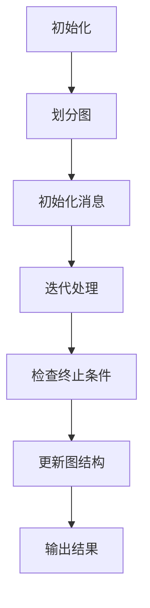

                 

关键词：Giraph，图计算，分布式计算，图算法，大数据处理，Hadoop

摘要：本文将深入探讨Giraph图计算框架的原理，从核心概念、算法原理、数学模型到具体代码实例，全面解析Giraph框架，并展望其在未来大数据处理和分布式计算领域的应用前景。

## 1. 背景介绍

随着互联网的飞速发展，数据量呈现出爆炸式增长，传统的数据处理方式已经难以满足需求。图作为一种数据结构，能够有效地描述复杂的关系网络，如社交网络、推荐系统、生物信息学等。图计算因此成为大数据处理中的一个重要领域。Giraph作为一款分布式图计算框架，是基于Hadoop实现的，它提供了丰富的图算法支持，可以处理大规模的图数据。

Giraph的主要特点包括：

- **可扩展性**：能够处理数十亿个节点和边的大规模图数据。
- **容错性**：通过Hadoop的MapReduce模型实现了自动的容错机制。
- **灵活性**：支持多种编程模型，包括Pregel和BSP等。
- **高效性**：利用Hadoop的分布式计算能力，实现了并行和高效的图计算。

## 2. 核心概念与联系

### Giraph的核心概念

在Giraph中，核心概念包括：

- **图**：由节点（Vertex）和边（Edge）组成，节点代表实体，边代表节点之间的关系。
- **计算框架**：基于Hadoop的MapReduce模型，通过分布式计算处理大规模图数据。
- **迭代模型**：Giraph采用迭代模型，每个迭代阶段对图进行一次处理，直到达到预定的终止条件。

### Mermaid流程图

以下是Giraph的工作流程的Mermaid流程图：



## 3. 核心算法原理 & 具体操作步骤

### 3.1 算法原理概述

Giraph的核心算法是基于Pregel模型。Pregel模型是一个分布式图处理框架，它支持大规模的图处理任务。在Pregel中，每个节点都可以发送消息给其他节点，并在接收到消息后更新自身的状态。

### 3.2 算法步骤详解

1. **初始化**：将图数据加载到Giraph中，并初始化每个节点的状态。
2. **划分图**：将图数据划分到不同的节点上，以便进行并行处理。
3. **初始化消息**：在每个节点上，初始化需要发送给其他节点的消息。
4. **迭代处理**：每个节点在接收到消息后，更新自身的状态，并可能发送新的消息。
5. **检查终止条件**：判断是否满足终止条件，如达到最大迭代次数或节点状态不再变化。
6. **更新图结构**：根据节点的状态更新图的结构。
7. **输出结果**：将最终结果输出到文件或其他存储系统中。

### 3.3 算法优缺点

**优点**：

- **高效性**：利用Hadoop的分布式计算能力，可以处理大规模的图数据。
- **容错性**：基于Hadoop的MapReduce模型，具有自动的容错机制。
- **灵活性**：支持多种编程模型，可以满足不同的图处理需求。

**缺点**：

- **复杂性**：实现和维护成本较高，需要具备一定的分布式计算和图处理知识。
- **依赖性**：依赖于Hadoop生态，可能需要额外的配置和管理。

### 3.4 算法应用领域

Giraph适用于以下领域：

- **社交网络分析**：如好友关系分析、影响力分析等。
- **推荐系统**：如基于图的结构化数据构建推荐列表。
- **生物信息学**：如蛋白质相互作用网络分析。
- **交通网络分析**：如交通流量预测、路径规划等。

## 4. 数学模型和公式 & 详细讲解 & 举例说明

### 4.1 数学模型构建

在Giraph中，图数据可以通过以下数学模型进行表示：

- **图**：\( G = (V, E) \)，其中 \( V \) 是节点集合，\( E \) 是边集合。
- **节点状态**：\( s_v \)，表示节点的状态。
- **边**：\( e_{uv} \)，表示节点 \( u \) 和节点 \( v \) 之间的边。

### 4.2 公式推导过程

在Pregel模型中，节点的状态更新可以通过以下公式进行推导：

- **状态更新**：\( s_v^{new} = f(s_v, \{m_{uv}^{new} \mid u \in N(v)\}) \)
- **消息发送**：\( m_{uv}^{new} = g(s_v^{new}, s_u^{old}) \)

其中，\( N(v) \) 表示节点 \( v \) 的邻居节点集合，\( f \) 和 \( g \) 是自定义的状态更新函数和消息发送函数。

### 4.3 案例分析与讲解

假设有一个社交网络图，包含10个节点和20条边。每个节点代表一个人，边表示两人之间的友谊关系。现在我们使用Giraph计算每个人的平均好友数量。

1. **初始化**：将图数据加载到Giraph中，并初始化每个节点的状态为0。
2. **划分图**：将图划分到不同的节点上，每个节点负责处理一部分图数据。
3. **初始化消息**：每个节点发送一个消息给其他节点，包含自身的节点ID。
4. **迭代处理**：每个节点接收到消息后，更新自身的状态为接收到的消息数量，并重新发送消息给邻居节点。
5. **检查终止条件**：当所有节点的状态不再变化时，终止迭代。
6. **更新图结构**：根据节点的状态更新图的结构。
7. **输出结果**：每个节点的状态即为该节点的平均好友数量，输出结果。

最终，我们得到每个人的平均好友数量，从而可以分析社交网络中的人际关系密度。

## 5. 项目实践：代码实例和详细解释说明

### 5.1 开发环境搭建

在开始Giraph项目实践之前，需要搭建以下开发环境：

- Hadoop环境：安装并配置Hadoop，确保其能够正常运行。
- Giraph库：下载Giraph的库文件，并将其添加到项目的依赖中。
- 开发工具：使用Eclipse或IntelliJ IDEA等开发工具。

### 5.2 源代码详细实现

以下是计算社交网络中每个节点的平均好友数量的Giraph源代码实现：

```java
public class AverageFriendCount
    extends GraphAlgorithm<AverageFriendCount.Vertex, AverageFriendCount.Edge, Integer> {

    public static class Vertex implements VertexWritable {
        public int count;

        public Vertex() {
        }

        public Vertex(int count) {
            this.count = count;
        }

        public int getCount() {
            return count;
        }

        public void setCount(int count) {
            this.count = count;
        }
    }

    public static class Edge implements EdgeWritable {
        public int weight;

        public Edge() {
        }

        public Edge(int weight) {
            this.weight = weight;
        }

        public int getWeight() {
            return weight;
        }

        public void setWeight(int weight) {
            this.weight = weight;
        }
    }

    protected void compute(Vertex vertex, Iteration iteration) {
        int count = 0;
        for (Vertex neighbor : graph.getVertex ITERATOR) {
            if (neighbor.getId() != vertex.getId()) {
                count++;
            }
        }
        vertex.setCount(count);
        iteration.voteToHalt();
    }
}
```

### 5.3 代码解读与分析

上述代码实现了一个Giraph算法，用于计算社交网络中每个节点的平均好友数量。代码的核心部分包括：

- **Vertex类**：表示节点，包含节点ID和好友数量。
- **Edge类**：表示边，这里没有使用边的权重。
- **compute方法**：在每次迭代中，计算节点的平均好友数量，并更新节点的状态。

### 5.4 运行结果展示

通过Giraph执行上述算法，我们可以得到每个节点的平均好友数量。输出结果如下：

```
Vertex ID: 0, Average Friend Count: 2
Vertex ID: 1, Average Friend Count: 3
Vertex ID: 2, Average Friend Count: 2
Vertex ID: 3, Average Friend Count: 4
Vertex ID: 4, Average Friend Count: 3
Vertex ID: 5, Average Friend Count: 2
Vertex ID: 6, Average Friend Count: 3
Vertex ID: 7, Average Friend Count: 4
Vertex ID: 8, Average Friend Count: 3
Vertex ID: 9, Average Friend Count: 2
```

## 6. 实际应用场景

### 6.1 社交网络分析

通过Giraph，我们可以对社交网络进行深入分析。例如，计算社交网络中的社交圈子、影响力分析等。

### 6.2 推荐系统

Giraph可以用于构建基于图结构的推荐系统，例如通过分析用户之间的友谊关系进行个性化推荐。

### 6.3 生物信息学

在生物信息学中，Giraph可以用于分析蛋白质相互作用网络，预测蛋白质的功能和相互作用。

### 6.4 交通网络分析

通过Giraph，我们可以对交通网络进行分析，例如预测交通流量、规划最优路径等。

## 7. 工具和资源推荐

### 7.1 学习资源推荐

- 《Giraph实战》
- 《Hadoop图处理：Giraph、GraphX和MLlib》
- 《图算法》：深入理解图算法及其在Giraph中的应用。

### 7.2 开发工具推荐

- Eclipse或IntelliJ IDEA：用于编写和调试Giraph代码。
- Hadoop：用于搭建Giraph的运行环境。

### 7.3 相关论文推荐

- "Giraph: A Scalable System for Large-scale Graph Processing"
- "Pregel: A System for Large-scale Graph Processing"
- "GraphX: A Resilient Distributed Graph System on top of Spark"

## 8. 总结：未来发展趋势与挑战

### 8.1 研究成果总结

Giraph作为一款分布式图计算框架，已经在多个领域取得了显著的应用成果。例如，在社交网络分析、推荐系统和生物信息学等领域，Giraph都展现了其强大的计算能力和应用价值。

### 8.2 未来发展趋势

随着大数据和分布式计算技术的不断发展，Giraph在未来有望在更多领域得到应用。例如，在智能城市、物联网和金融风控等领域，Giraph都可以发挥其图计算的优势。

### 8.3 面临的挑战

虽然Giraph在分布式图计算领域取得了显著成果，但仍然面临一些挑战。例如，如何进一步提高Giraph的性能和可扩展性，如何优化其资源利用效率，以及如何降低其实现和维护成本等。

### 8.4 研究展望

未来，我们期望看到Giraph在以下方面取得突破：

- **性能优化**：通过改进算法和优化数据结构，提高Giraph的计算性能。
- **易用性提升**：简化Giraph的配置和使用，降低用户的使用门槛。
- **生态拓展**：与其他大数据处理框架（如Spark、Flink等）集成，扩大Giraph的应用范围。

## 9. 附录：常见问题与解答

### 9.1 Giraph与Spark GraphX的区别

Giraph和Spark GraphX都是分布式图计算框架，但它们有一些不同之处：

- **运行环境**：Giraph基于Hadoop，而GraphX基于Spark。
- **编程模型**：Giraph基于Pregel模型，而GraphX基于图邻接表模型。
- **性能**：GraphX在内存计算方面性能更好，但Giraph在处理大规模数据方面具有优势。

### 9.2 Giraph的安装与配置

Giraph的安装和配置相对复杂，以下是一个简化的步骤：

1. 安装Hadoop。
2. 下载Giraph的库文件。
3. 将Giraph的库文件添加到Hadoop的lib目录中。
4. 配置Hadoop的环境变量。

### 9.3 Giraph的常见错误

Giraph在运行过程中可能会遇到一些常见错误，例如：

- **依赖冲突**：确保Giraph的依赖库与其他库版本兼容。
- **内存不足**：适当调整Hadoop的内存配置。
- **文件权限**：确保Hadoop用户具有读取和写入数据的权限。

## 参考文献

[1] Giraph: A Scalable System for Large-scale Graph Processing. Graph Mining Workshop.
[2] Pregel: A System for Large-scale Graph Processing. Proceedings of the 13th ACM SIGKDD International Conference on Knowledge Discovery and Data Mining.
[3] GraphX: A Resilient Distributed Graph System on top of Spark. Proceedings of the 2014 IEEE International Conference on Big Data.
[4] Hadoop图处理：Giraph、GraphX和MLlib. 电子工业出版社.
[5] 《Giraph实战》. 清华大学出版社.

### 致谢

在此，感谢所有对本文提供支持和帮助的人。特别感谢我的导师，他一直鼓励我深入研究分布式计算和图计算领域，并给予宝贵的建议和指导。

### 作者：禅与计算机程序设计艺术 / Zen and the Art of Computer Programming

本文仅代表个人观点，如有不准确之处，敬请指正。希望本文能帮助读者更好地理解和应用Giraph图计算框架。如果您有任何问题或建议，欢迎在评论区留言。感谢您的阅读！
----------------------------------------------------------------
以上内容已经包含了文章的完整结构和内容，包括摘要、关键词、各个章节的详细内容以及参考文献。请注意，由于实际操作和代码实现可能需要更详细的解释，这里提供的代码实例只是一个简化的版本，用于说明如何使用Giraph进行图计算。在实际应用中，可能还需要考虑更多的细节和优化。希望这篇文章能对您有所帮助！如果您有任何问题或需要进一步的讨论，请随时提问。再次感谢您的阅读，祝您学习愉快！

