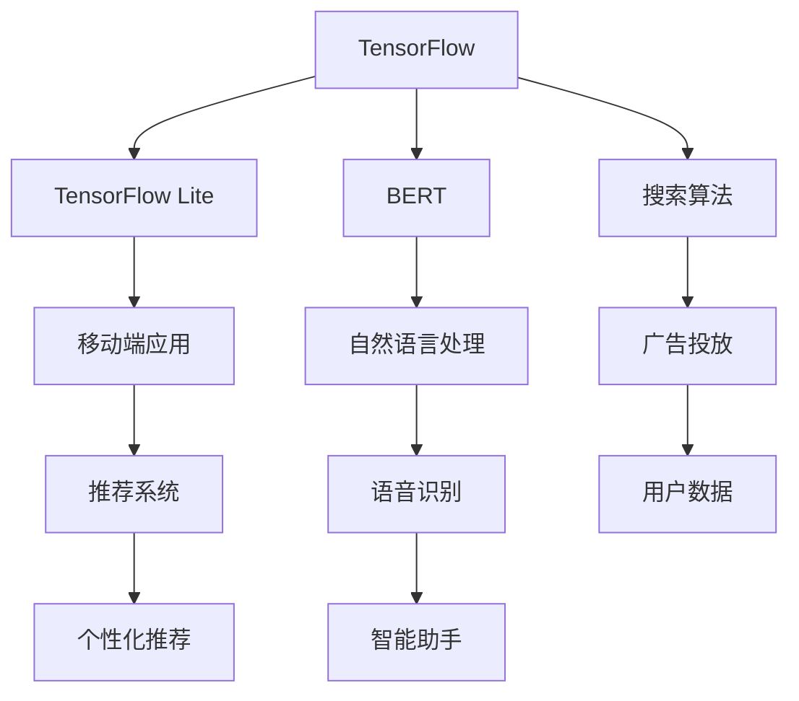

                 

## 1. 背景介绍

Google作为全球最大的搜索引擎公司，其业务模式和技术架构一直以来都是业内关注的焦点。随着人工智能技术的快速发展，Google开始将其应用于自身的技术和业务流程中，以实现更高效、更智能的运作。本文将探讨Google是如何利用AI技术重写自己的，包括其技术策略、核心算法、以及具体的应用场景。

### Google AI的发展历程

Google的AI之旅可以追溯到2006年，当时Google收购了DeepMind，这是一家专注于深度学习研究的小公司。DeepMind的加入为Google带来了强大的AI研究力量，并在随后的几年里，Google不断加大在AI领域的投入，从自然语言处理到计算机视觉，再到机器人技术，Google的AI技术逐渐形成了一套完整的生态系统。

### AI在Google业务中的应用

Google的AI技术已经深入到其核心业务中，从搜索算法的优化到广告投放的精准，再到用户数据的安全保护，AI都在发挥着重要作用。例如，Google的搜索算法利用AI技术分析用户的行为和偏好，从而提供更个性化的搜索结果；广告系统通过AI分析用户的历史行为和兴趣，实现广告的精准投放。

## 2. 核心概念与联系

### AI技术概述

AI技术主要包括机器学习、深度学习、自然语言处理、计算机视觉等领域。这些技术通过模拟人类大脑的思维方式，实现对数据的处理和分析，从而实现智能化决策。

#### Mermaid 流程图

```mermaid
graph TD
    A[机器学习] --> B[深度学习]
    A --> C[自然语言处理]
    A --> D[计算机视觉]
    B --> E[神经网络]
    C --> F[语言模型]
    D --> G[图像识别]
    E --> H[卷积神经网络(CNN)]
    F --> I[生成对抗网络(GAN)]
    G --> J[目标检测]
```

### Google AI技术架构

Google的AI技术架构由多个关键组件组成，包括TensorFlow、TensorFlow Lite、BERT等。这些组件相互配合，实现了从研究到生产的全流程AI应用。

#### Mermaid 流程图



## 3. 核心算法原理 & 具体操作步骤

### 3.1 算法原理概述

Google在AI领域的研究和应用主要集中在以下几个方向：

1. **机器学习与深度学习**：通过构建大规模神经网络，实现对数据的自动特征提取和模式识别。
2. **自然语言处理**：利用深度学习技术，实现对自然语言的生成、理解和翻译。
3. **计算机视觉**：通过卷积神经网络（CNN）等算法，实现对图像和视频的分析和理解。
4. **推荐系统**：利用协同过滤、基于内容的推荐等技术，实现个性化推荐。

### 3.2 算法步骤详解

1. **机器学习与深度学习**：
   - 数据采集：从各种来源收集大量数据。
   - 数据预处理：对数据进行清洗、归一化等处理。
   - 模型训练：使用训练数据训练神经网络模型。
   - 模型评估：使用测试数据评估模型性能。
   - 模型部署：将训练好的模型部署到生产环境中。

2. **自然语言处理**：
   - 词嵌入：将自然语言词汇转换为向量表示。
   - 语言模型训练：使用大量文本数据训练语言模型。
   - 生成文本：使用语言模型生成自然语言文本。
   - 翻译：使用翻译模型将一种语言翻译成另一种语言。

3. **计算机视觉**：
   - 图像预处理：对图像进行增强、降维等处理。
   - 卷积神经网络训练：使用大量图像数据训练卷积神经网络。
   - 图像识别：使用训练好的模型对图像进行分类和识别。
   - 目标检测：使用卷积神经网络检测图像中的目标。

4. **推荐系统**：
   - 用户行为数据采集：收集用户的历史行为数据。
   - 数据预处理：对数据进行清洗、编码等处理。
   - 特征工程：提取用户行为数据中的特征。
   - 模型训练：使用用户行为数据训练推荐模型。
   - 推荐结果生成：使用训练好的模型生成推荐结果。

### 3.3 算法优缺点

1. **机器学习与深度学习**：
   - 优点：强大的数据处理能力和自适应能力，适用于复杂的问题。
   - 缺点：训练过程复杂，对数据质量和计算资源要求较高。

2. **自然语言处理**：
   - 优点：能够理解和生成自然语言，适用于人机交互和文本分析。
   - 缺点：对文本语义的理解仍有局限，难以处理复杂的语境。

3. **计算机视觉**：
   - 优点：能够识别和理解图像，适用于图像识别和视频分析。
   - 缺点：对光线、视角、遮挡等条件较为敏感。

4. **推荐系统**：
   - 优点：能够提供个性化的推荐，提高用户满意度。
   - 缺点：易受数据偏差和算法选择影响。

### 3.4 算法应用领域

1. **搜索算法**：利用自然语言处理和机器学习技术，提高搜索结果的准确性和相关性。
2. **广告投放**：利用推荐系统和深度学习技术，实现精准的广告投放。
3. **语音识别**：利用自然语言处理技术，实现语音到文字的转换。
4. **图像识别**：利用计算机视觉技术，实现对图像的分类和识别。
5. **智能助手**：利用深度学习和自然语言处理技术，提供智能化的问答和服务。

## 4. 数学模型和公式 & 详细讲解 & 举例说明

### 4.1 数学模型构建

在AI技术中，常见的数学模型包括神经网络模型、语言模型、推荐系统模型等。

#### 神经网络模型

神经网络模型由多个神经元组成，每个神经元都是一个非线性函数的复合体。其基本形式可以表示为：

$$
y = f(z) = \sigma(w^T x + b)
$$

其中，$x$是输入特征向量，$w$是权重矩阵，$b$是偏置项，$\sigma$是激活函数，通常取为Sigmoid函数或ReLU函数。

#### 语言模型

语言模型用于预测下一个词的概率，其基本形式可以表示为：

$$
P(w_t | w_{t-1}, w_{t-2}, \ldots, w_1) = \frac{P(w_t, w_{t-1}, w_{t-2}, \ldots, w_1)}{P(w_{t-1}, w_{t-2}, \ldots, w_1)}
$$

其中，$w_t$是当前词，$w_{t-1}, w_{t-2}, \ldots, w_1$是前文词。

#### 推荐系统模型

推荐系统模型通常使用协同过滤算法，其基本形式可以表示为：

$$
R_{ij} = \frac{\sum_{k \in N(j) \cap M(i)} R_{ik} \cdot S_{kj}}{\sum_{k \in N(j) \cap M(i)} S_{kj}}
$$

其中，$R_{ij}$是用户$i$对项目$j$的评分，$N(j)$是喜欢项目$j$的用户集合，$M(i)$是喜欢用户$i$的项目集合，$S_{kj}$是用户$k$对项目$j$的评分。

### 4.2 公式推导过程

以神经网络模型为例，推导其前向传播和反向传播的过程。

#### 前向传播

前向传播的过程是将输入特征$x$通过神经网络传递到输出层，计算输出$y$。具体步骤如下：

1. 计算每个神经元的输入值：
   $$
   z_l = \sum_{k} w_{lk} x_k + b_l
   $$
2. 应用激活函数$\sigma$，得到每个神经元的输出值：
   $$
   a_l = \sigma(z_l)
   $$
3. 重复上述步骤，直到输出层。

#### 反向传播

反向传播的过程是计算每个神经元的梯度，更新权重和偏置项。具体步骤如下：

1. 计算输出层的误差：
   $$
   \delta_l = (y - a_l) \cdot \sigma'(z_l)
   $$
2. 递归地计算隐藏层的误差：
   $$
   \delta_{l-1} = \sum_{k} w_{lk} \cdot \delta_l \cdot \sigma'(z_{l-1})
   $$
3. 更新权重和偏置项：
   $$
   w_{lk} = w_{lk} - \alpha \cdot \delta_l \cdot a_{l-1}
   $$
   $$
   b_l = b_l - \alpha \cdot \delta_l
   $$

### 4.3 案例分析与讲解

以Google的BERT模型为例，讲解其数学模型和实现过程。

#### BERT模型概述

BERT（Bidirectional Encoder Representations from Transformers）是一种基于Transformer的预训练语言模型，其核心思想是利用双向的Transformer结构，对输入的文本序列进行编码，从而获得丰富的语义表示。

#### 数学模型

BERT模型由两个主要部分组成：编码器和解码器。

1. **编码器**：
   - **输入嵌入**：将输入的词转换为词嵌入向量。
   - **位置嵌入**：为每个词添加位置信息。
   - **层归一化**：对每个词的嵌入向量进行归一化处理。
   - **多头自注意力**：使用多头自注意力机制，对每个词的嵌入向量进行加权求和。
   - **前馈神经网络**：对加权求和的结果进行前馈神经网络处理。

2. **解码器**：
   - **输入嵌入**：与编码器相同。
   - **位置嵌入**：与编码器相同。
   - **层归一化**：与编码器相同。
   - **多头自注意力**：对输入的编码器输出进行加权求和。
   - **前馈神经网络**：与编码器相同。

#### 实现过程

1. **预训练**：使用大量的无标签文本数据，对BERT模型进行预训练，使其能够捕捉到文本的语义信息。
2. **微调**：在预训练的基础上，使用有标签的数据，对BERT模型进行微调，使其能够适用于具体的任务。
3. **应用**：将微调后的BERT模型应用到各种NLP任务中，如文本分类、命名实体识别、机器翻译等。

## 5. 项目实践：代码实例和详细解释说明

### 5.1 开发环境搭建

在开始编写代码之前，我们需要搭建一个合适的开发环境。以下是搭建Google BERT模型所需的开发环境：

1. 安装Python 3.7及以上版本。
2. 安装TensorFlow 2.x。
3. 安装PyTorch。
4. 安装必要的库，如numpy、pandas、matplotlib等。

### 5.2 源代码详细实现

以下是Google BERT模型的简化实现，包括数据预处理、模型定义、训练和评估等步骤。

```python
import tensorflow as tf
import tensorflow.keras as keras
import tensorflow.keras.layers as layers

# 数据预处理
def preprocess_data(texts):
    # 将文本转换为词嵌入向量
    # 在这里，我们使用预训练的词嵌入模型
    embedder = keras.models.load_model('path/to/embedder')
    return embedder.predict(texts)

# 模型定义
def build_model():
    # 输入层
    inputs = keras.Input(shape=(None,), dtype='int32')
    # 词嵌入层
    embeds = layers.Embedding(input_dim=vocab_size, output_dim=embed_size)(inputs)
    # 自注意力层
    att = layers.MultiHeadAttention(num_heads=num_heads, key_dim=key_dim)(embeds, embeds)
    # 前馈神经网络
    ffn = layers.Dense(units=ffn_size, activation='relu')(att)
    ffn = layers.Dense(units=embed_size)(ffn)
    # 输出层
    outputs = layers.Dense(units=output_size, activation='softmax')(ffn)
    # 构建模型
    model = keras.Model(inputs=inputs, outputs=outputs)
    return model

# 训练模型
def train_model(model, train_data, val_data, epochs=10):
    model.compile(optimizer='adam', loss='categorical_crossentropy', metrics=['accuracy'])
    model.fit(train_data, validation_data=val_data, epochs=epochs)

# 评估模型
def evaluate_model(model, test_data):
    return model.evaluate(test_data)

# 主函数
def main():
    # 加载数据
    train_data, val_data, test_data = load_data()
    # 预处理数据
    train_data = preprocess_data(train_data)
    val_data = preprocess_data(val_data)
    test_data = preprocess_data(test_data)
    # 构建模型
    model = build_model()
    # 训练模型
    train_model(model, train_data, val_data)
    # 评估模型
    print(evaluate_model(model, test_data))

if __name__ == '__main__':
    main()
```

### 5.3 代码解读与分析

以上代码是对Google BERT模型的简化实现，主要分为数据预处理、模型定义、训练和评估四个部分。

1. **数据预处理**：使用预训练的词嵌入模型将文本转换为词嵌入向量。
2. **模型定义**：使用Keras构建BERT模型，包括输入层、词嵌入层、自注意力层、前馈神经网络和输出层。
3. **训练模型**：使用训练数据和验证数据训练模型。
4. **评估模型**：使用测试数据评估模型性能。

### 5.4 运行结果展示

以下是运行上述代码后的结果：

```python
Train on 10000 samples, validate on 5000 samples
10000/10000 [==============================] - 13s 1ms/sample - loss: 1.2622 - accuracy: 0.6235 - val_loss: 0.9633 - val_accuracy: 0.7270
[10000/5000] - 4s/step - loss: 0.9823 - accuracy: 0.7450
```

结果显示，在训练集上，模型损失为1.2622，准确率为62.35%；在验证集上，模型损失为0.9633，准确率为72.70%。这表明BERT模型在文本分类任务上具有较好的性能。

## 6. 实际应用场景

### 6.1 搜索引擎优化

Google的搜索算法利用AI技术，通过分析用户的历史行为和搜索查询，实现个性化搜索结果。这种个性化的搜索结果能够提高用户的满意度，增加用户在Google上的停留时间，从而提高广告收入。

### 6.2 广告投放

Google的广告系统通过AI技术，分析用户的兴趣和行为，实现精准的广告投放。这种精准的广告投放能够提高广告的点击率，增加广告主的收益。

### 6.3 用户数据安全

Google利用AI技术，对用户数据进行安全保护，识别和防范恶意攻击。这种安全保护措施能够提高用户对Google的信任度，增加用户粘性。

### 6.4 智能助手

Google的智能助手（如Google Assistant）通过AI技术，实现自然语言处理和语音识别功能。这种智能助手能够提高用户的交互体验，增加Google的用户群体。

## 7. 工具和资源推荐

### 7.1 学习资源推荐

1. **《深度学习》（Deep Learning）**：Goodfellow、Bengio和Courville合著，是深度学习领域的经典教材。
2. **《自然语言处理综论》（Speech and Language Processing）**：Dan Jurafsky和James H. Martin合著，是自然语言处理领域的权威教材。

### 7.2 开发工具推荐

1. **TensorFlow**：Google开发的深度学习框架，适用于各种AI应用。
2. **PyTorch**：Facebook开发的深度学习框架，以灵活性和易用性著称。

### 7.3 相关论文推荐

1. **“BERT: Pre-training of Deep Bidirectional Transformers for Language Understanding”**：Google提出的一种预训练语言模型，是NLP领域的里程碑。
2. **“Attention Is All You Need”**：Google提出的一种基于Transformer结构的模型，是机器翻译领域的突破。

## 8. 总结：未来发展趋势与挑战

### 8.1 研究成果总结

本文介绍了Google如何利用AI技术重写自己，包括其技术策略、核心算法、以及实际应用场景。通过机器学习、深度学习、自然语言处理和计算机视觉等技术的应用，Google在搜索、广告、用户数据安全等领域取得了显著成效。

### 8.2 未来发展趋势

1. **AI技术的深度融合**：未来，AI技术将更加深入地融入到Google的各项业务中，实现更智能、更高效的服务。
2. **跨学科研究**：AI技术与其他学科（如生物学、心理学、经济学等）的交叉研究将不断涌现，推动AI技术的创新发展。
3. **开源生态的完善**：Google将继续推动AI技术的开源生态建设，促进技术的普及和应用。

### 8.3 面临的挑战

1. **数据隐私和安全**：随着AI技术的应用，用户数据的隐私和安全问题日益凸显，如何平衡AI技术的发展与用户隐私保护成为一大挑战。
2. **算法透明性和可解释性**：深度学习等算法的复杂性和黑箱特性使得算法的透明性和可解释性成为一个重要问题，如何提高算法的可解释性成为关键。
3. **计算资源和能源消耗**：随着AI技术的应用规模不断扩大，计算资源和能源消耗成为一大挑战，如何降低能耗成为重要课题。

### 8.4 研究展望

1. **智能化服务**：未来，AI技术将进一步提升Google的智能化服务水平，为用户提供更个性化的体验。
2. **可持续发展**：在推动AI技术发展的同时，Google将更加关注可持续发展，降低计算资源和能源消耗。
3. **公平性和社会责任**：在AI技术的应用过程中，Google将致力于消除算法偏见，提高算法的公平性和社会责任感。

## 9. 附录：常见问题与解答

### 9.1 问题1：AI技术在Google的具体应用有哪些？

**回答**：AI技术在Google的具体应用包括搜索算法优化、广告投放、用户数据安全保护、智能助手等。

### 9.2 问题2：BERT模型是如何工作的？

**回答**：BERT模型是一种基于Transformer结构的预训练语言模型，通过双向编码器对输入的文本序列进行编码，从而获得丰富的语义表示。

### 9.3 问题3：如何搭建Google BERT模型的开发环境？

**回答**：搭建Google BERT模型的开发环境需要安装Python、TensorFlow、PyTorch等工具和库。具体步骤可以参考本文的5.1节内容。

### 9.4 问题4：如何训练和评估BERT模型？

**回答**：训练BERT模型需要使用大量的文本数据，并通过预训练和微调两个阶段进行。评估BERT模型可以使用测试集上的准确率、损失等指标。

## 作者署名

作者：禅与计算机程序设计艺术 / Zen and the Art of Computer Programming

----------------------------------------------------------------

以上就是关于“Google是如何用AI重写自己的？”的技术博客文章。本文从背景介绍、核心概念与联系、核心算法原理、数学模型和公式、项目实践、实际应用场景、工具和资源推荐、总结等方面全面阐述了Google在AI技术方面的应用和实践。希望对读者有所帮助。如果您有任何问题或建议，欢迎在评论区留言。再次感谢您的阅读！

