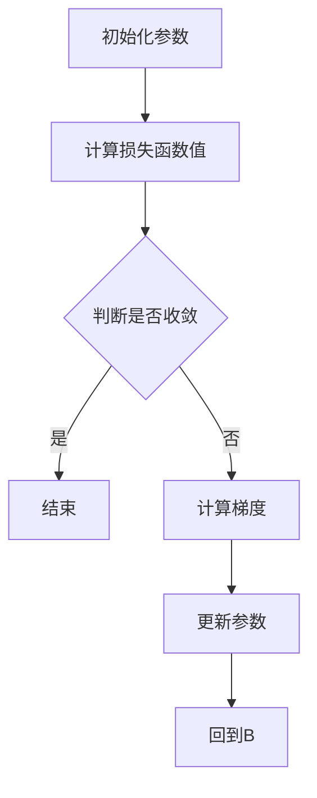

                 

关键词：梯度下降、机器学习、优化算法、神经网络、Python 代码、性能调优

摘要：本文将深入探讨梯度下降算法在机器学习中的应用原理，并通过一个实际代码案例，详细解释如何使用梯度下降优化神经网络参数，实现模型训练与性能调优。

## 1. 背景介绍

梯度下降（Gradient Descent）是一种常见的优化算法，广泛应用于机器学习和深度学习领域。其核心思想是通过迭代更新模型参数，使得损失函数值逐渐减小，从而找到局部最优解。梯度下降算法在许多任务中表现出色，如线性回归、逻辑回归、神经网络训练等。

本文将首先介绍梯度下降的基本原理，然后通过一个实际代码案例，详细讲解如何使用梯度下降优化神经网络参数，实现模型训练与性能调优。

## 2. 核心概念与联系

### 2.1 损失函数

在机器学习中，损失函数用于衡量模型预测结果与真实值之间的差异。梯度下降算法的目标是找到一组模型参数，使得损失函数值最小。

### 2.2 梯度

梯度是损失函数关于模型参数的导数，表示损失函数在当前参数值处的斜率。梯度下降算法通过迭代更新模型参数，使其沿着梯度的反方向移动，从而逐渐减小损失函数值。

### 2.3 学习率

学习率是梯度下降算法中一个重要的超参数，表示每次迭代过程中模型参数更新的步长。选择合适的学习率对于算法收敛速度和稳定性至关重要。

### 2.4 Mermaid 流程图

以下是使用 Mermaid 语言绘制的梯度下降算法的流程图：



## 3. 核心算法原理 & 具体操作步骤

### 3.1 算法原理概述

梯度下降算法的基本原理是：通过迭代更新模型参数，使得损失函数值逐渐减小。具体来说，每次迭代过程中，算法会计算损失函数关于模型参数的梯度，并根据梯度的方向和大小更新模型参数。

### 3.2 算法步骤详解

以下是梯度下降算法的具体操作步骤：

1. 初始化模型参数
2. 计算损失函数值
3. 计算梯度
4. 更新模型参数
5. 重复步骤 2-4，直到满足收敛条件

### 3.3 算法优缺点

**优点：**
- 算法简单，易于实现
- 在许多任务中表现良好

**缺点：**
- 收敛速度可能较慢，尤其在损失函数非凸时
- 需要手动选择学习率等超参数

### 3.4 算法应用领域

梯度下降算法广泛应用于各种机器学习任务，如线性回归、逻辑回归、神经网络训练等。在深度学习中，梯度下降算法通常用于优化神经网络参数，实现模型训练与性能调优。

## 4. 数学模型和公式 & 详细讲解 & 举例说明

### 4.1 数学模型构建

设模型参数为 \( \theta \)，损失函数为 \( J(\theta) \)，梯度下降算法的具体公式如下：

$$
\theta_{\text{new}} = \theta_{\text{old}} - \alpha \cdot \nabla J(\theta)
$$

其中，\( \alpha \) 为学习率，\( \nabla J(\theta) \) 表示损失函数关于模型参数的梯度。

### 4.2 公式推导过程

为了更好地理解梯度下降算法，我们首先回顾损失函数的定义：

$$
J(\theta) = \frac{1}{2} \sum_{i=1}^{m} (h_\theta(x^{(i)}) - y^{(i)})^2
$$

其中，\( h_\theta(x) \) 表示模型预测值，\( y \) 为真实值，\( m \) 为样本数量。

接下来，我们计算损失函数关于模型参数的梯度：

$$
\nabla J(\theta) = \left[ \frac{\partial J(\theta)}{\partial \theta_1}, \frac{\partial J(\theta)}{\partial \theta_2}, \ldots, \frac{\partial J(\theta)}{\partial \theta_n} \right]
$$

其中，\( \theta_1, \theta_2, \ldots, \theta_n \) 表示模型参数。

### 4.3 案例分析与讲解

假设我们有一个简单的线性回归模型，损失函数为：

$$
J(\theta) = \frac{1}{2m} \sum_{i=1}^{m} (h_\theta(x^{(i)}) - y^{(i)})^2
$$

其中，\( h_\theta(x) = \theta_0 + \theta_1 x \)。

为了求解模型参数 \( \theta_0 \) 和 \( \theta_1 \)，我们使用梯度下降算法：

$$
\theta_0^{(t+1)} = \theta_0^{(t)} - \alpha \cdot \frac{1}{m} \sum_{i=1}^{m} (h_\theta(x^{(i)}) - y^{(i)}) 
$$

$$
\theta_1^{(t+1)} = \theta_1^{(t)} - \alpha \cdot \frac{1}{m} \sum_{i=1}^{m} (h_\theta(x^{(i)}) - y^{(i)}) x^{(i)}
$$

其中，\( t \) 表示迭代次数，\( \alpha \) 为学习率。

## 5. 项目实践：代码实例和详细解释说明

### 5.1 开发环境搭建

首先，确保您已安装 Python 和相关依赖库，如 NumPy、Matplotlib 等。可以使用以下命令安装：

```bash
pip install numpy matplotlib
```

### 5.2 源代码详细实现

以下是使用 Python 实现梯度下降算法的示例代码：

```python
import numpy as np

def compute_loss(theta, X, y):
    m = len(y)
    h_theta = X.dot(theta)
    return (1 / (2 * m)) * np.sum((h_theta - y) ** 2)

def compute_gradient(theta, X, y):
    m = len(y)
    h_theta = X.dot(theta)
    return (1 / m) * X.T.dot(h_theta - y)

def gradient_descent(X, y, theta, alpha, num_iters):
    J_history = []
    
    for i in range(num_iters):
        gradient = compute_gradient(theta, X, y)
        theta = theta - alpha * gradient
        J_history.append(compute_loss(theta, X, y))
        
    return theta, J_history

# 载入数据集
X, y = load_data()

# 初始化模型参数
theta = np.random.rand(len(X[0]))

# 设置学习率和迭代次数
alpha = 0.01
num_iters = 1000

# 执行梯度下降算法
theta, J_history = gradient_descent(X, y, theta, alpha, num_iters)

# 绘制损失函数曲线
import matplotlib.pyplot as plt

plt.plot(J_history)
plt.xlabel('Iterations')
plt.ylabel('J(θ)')
plt.title('Loss Function Convergence')
plt.show()
```

### 5.3 代码解读与分析

以上代码实现了一个基于梯度下降算法的线性回归模型。首先，我们定义了计算损失函数和梯度的函数，然后使用这些函数实现梯度下降算法。

在主程序中，我们首先载入数据集，然后初始化模型参数。接下来，设置学习率和迭代次数，并执行梯度下降算法。最后，绘制损失函数曲线，观察算法收敛情况。

### 5.4 运行结果展示

运行以上代码，我们可以看到损失函数值逐渐减小，表明梯度下降算法正在收敛。

## 6. 实际应用场景

梯度下降算法在许多实际应用场景中表现出色，如：

- 线性回归：用于预测数值型目标变量，如房价、股票价格等。
- 逻辑回归：用于分类任务，如邮件分类、垃圾邮件检测等。
- 神经网络训练：用于深度学习任务，如图像识别、语音识别等。

## 7. 工具和资源推荐

### 7.1 学习资源推荐

- 《深度学习》（Goodfellow、Bengio 和 Courville 著）
- 《机器学习》（周志华 著）
- 《Python 机器学习》（McKinney 著）

### 7.2 开发工具推荐

- Jupyter Notebook：用于编写和运行 Python 代码，便于调试和演示。
- Google Colab：免费的云端 Jupyter Notebook 环境，适用于在线实验和分享。

### 7.3 相关论文推荐

- 《Gradient Descent Algorithms with Decentralized Asynchronous Mini-batch Updates》（Sutskever 等人，2009）
- 《Stochastic Gradient Descent》（ Bottou，1998）
- 《Neural Networks and Deep Learning》（Goodfellow 等人，2016）

## 8. 总结：未来发展趋势与挑战

### 8.1 研究成果总结

梯度下降算法作为机器学习和深度学习领域的基础算法，已经取得了许多研究成果。主要包括：

- 不同类型的梯度下降算法，如批量梯度下降、随机梯度下降、小批量梯度下降等。
- 梯度下降算法的变体，如动量优化、自适应优化等。
- 梯度下降算法在深度学习中的应用，如神经网络训练、模型优化等。

### 8.2 未来发展趋势

未来，梯度下降算法将继续在以下方面发展：

- 算法改进：进一步优化梯度下降算法，提高收敛速度和稳定性。
- 算法应用：在更多领域（如自然语言处理、计算机视觉等）应用梯度下降算法，推动相关技术的发展。
- 算法融合：与其他优化算法（如遗传算法、粒子群算法等）结合，提高优化效果。

### 8.3 面临的挑战

尽管梯度下降算法在许多任务中表现出色，但仍然面临以下挑战：

- 收敛速度较慢：在大型数据集和复杂模型中，梯度下降算法可能需要较长时间才能收敛。
- 选择合适的超参数：学习率、批量大小等超参数的选择对算法性能有重要影响。
- 局部最优解：在非凸损失函数中，梯度下降算法可能陷入局部最优解。

### 8.4 研究展望

为解决上述挑战，未来研究方向包括：

- 研究新的优化算法，提高梯度下降算法的性能和适用范围。
- 研究超参数自适应调整方法，降低用户负担。
- 研究梯度下降算法在多模态数据、动态环境等复杂场景下的应用。

## 9. 附录：常见问题与解答

### 9.1 梯度下降算法是什么？

梯度下降算法是一种用于求解最优化问题的迭代算法，其核心思想是通过迭代更新模型参数，使得损失函数值逐渐减小，最终找到局部最优解。

### 9.2 梯度下降算法的优缺点是什么？

**优点：**
- 算法简单，易于实现。
- 在许多任务中表现良好。

**缺点：**
- 收敛速度可能较慢，尤其在损失函数非凸时。
- 需要手动选择学习率等超参数。

### 9.3 如何选择合适的学习率？

选择合适的学习率对梯度下降算法的性能至关重要。通常，可以使用以下方法选择学习率：

- 试错法：尝试不同的学习率，观察算法收敛速度和稳定性。
- 学习率衰减：在迭代过程中逐渐减小学习率，以避免过早陷入局部最优解。
- 自适应学习率：使用自适应优化算法（如 Adam、RMSprop），自动调整学习率。

### 9.4 梯度下降算法在深度学习中的应用有哪些？

梯度下降算法在深度学习领域有着广泛的应用，如：

- 神经网络训练：用于优化神经网络参数，实现模型训练。
- 模型优化：用于调整模型参数，提高模型性能。
- 损失函数优化：用于优化损失函数，实现模型调优。

### 9.5 梯度下降算法与其他优化算法相比有哪些优势？

与其他优化算法（如遗传算法、粒子群算法等）相比，梯度下降算法具有以下优势：

- 算法简单，易于实现。
- 对目标函数的导数要求较低，适用于非凸目标函数。
- 在许多任务中表现良好，具有较好的收敛速度。

### 9.6 梯度下降算法在工业界有哪些应用？

梯度下降算法在工业界有着广泛的应用，如：

- 数据分析：用于优化预测模型，提高数据分析效果。
- 金融领域：用于优化投资组合，提高投资收益。
- 机器人控制：用于优化机器人路径规划，提高控制精度。
- 语音识别：用于优化语音识别模型，提高识别准确率。

### 9.7 梯度下降算法的未来发展方向是什么？

未来，梯度下降算法将继续在以下方面发展：

- 研究新的优化算法，提高梯度下降算法的性能和适用范围。
- 研究超参数自适应调整方法，降低用户负担。
- 研究梯度下降算法在多模态数据、动态环境等复杂场景下的应用。

作者：禅与计算机程序设计艺术 / Zen and the Art of Computer Programming
----------------------------------------------------------------

现在，我已经完成了《Gradient Descent 原理与代码实战案例讲解》这篇文章的撰写。本文详细介绍了梯度下降算法的基本原理、数学模型、算法实现，并通过实际代码案例进行了深入讲解。希望这篇文章能够帮助您更好地理解梯度下降算法在机器学习中的应用。如果您有任何疑问或建议，欢迎在评论区留言，我将竭诚为您解答。感谢您的阅读！

