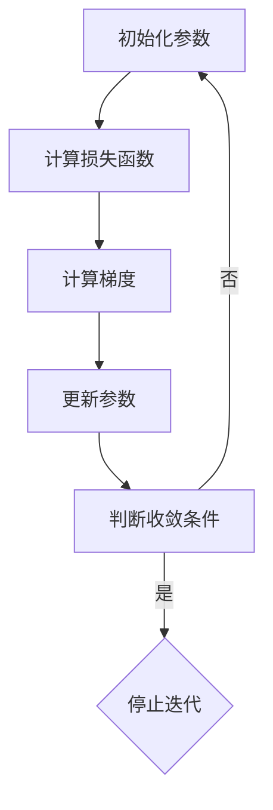

                 

关键词：梯度下降、机器学习、优化算法、数学模型、代码实例

摘要：本文将深入探讨梯度下降算法在机器学习中的核心原理，并通过代码实例详细讲解如何实现和优化该算法。本文旨在帮助读者理解梯度下降算法的数学基础、实际操作步骤以及在各个应用场景中的效果。

## 1. 背景介绍

梯度下降（Gradient Descent）是一种优化算法，广泛用于机器学习和数据科学领域。其基本思想是通过对损失函数梯度的不断迭代更新，找到函数的全局或局部最小值，从而优化模型参数。

梯度下降算法最初由Ishmael Powell和Joseph H. Davis在1963年提出，旨在解决多维度的优化问题。随后，该算法在机器学习和人工智能领域得到了广泛应用。梯度下降算法包括多种变体，如随机梯度下降（Stochastic Gradient Descent, SGD）、批量梯度下降（Batch Gradient Descent, BGD）和小批量梯度下降（Mini-batch Gradient Descent）等。

本文将首先介绍梯度下降的基本概念和原理，然后通过代码实例深入讲解如何在实际中应用和优化该算法。

## 2. 核心概念与联系

### 2.1 梯度下降的核心概念

**损失函数（Loss Function）**：在机器学习中，损失函数用于衡量模型预测值与实际值之间的差距。梯度下降算法的目标是找到能够使损失函数值最小的模型参数。

**梯度（Gradient）**：梯度是一个向量，表示函数在每个自变量上的偏导数的集合。在机器学习中，梯度用来指示损失函数在当前参数下的最大下降方向。

**迭代（Iteration）**：梯度下降算法通过迭代更新模型参数，每次迭代都向梯度的反方向迈出一步，以减少损失函数的值。

### 2.2 梯度下降与机器学习的联系

**优化目标**：在机器学习中，我们的目标是找到一个能够最小化损失函数的模型。梯度下降算法提供了这样一个工具。

**参数更新**：通过计算损失函数的梯度，我们可以更新模型的参数，使其更接近最优解。

**自适应调整**：梯度下降算法中的学习率（learning rate）可以根据迭代过程中的表现动态调整，以适应不同的优化问题。

### 2.3 Mermaid流程图

以下是一个简单的Mermaid流程图，展示了梯度下降的基本步骤：



## 3. 核心算法原理 & 具体操作步骤

### 3.1 算法原理概述

梯度下降算法的核心思想是利用损失函数的梯度来更新模型参数，从而逐步减少损失函数的值。具体步骤如下：

1. 初始化模型参数。
2. 计算当前参数下的损失函数值。
3. 计算损失函数关于模型参数的梯度。
4. 使用梯度来更新模型参数。
5. 重复步骤2到4，直到满足收敛条件。

### 3.2 算法步骤详解

#### 3.2.1 初始化参数

初始化参数是梯度下降算法的第一步。常用的初始化方法包括随机初始化和基于先验知识的初始化。

#### 3.2.2 计算损失函数

损失函数是衡量模型预测效果的关键指标。在梯度下降中，我们需要计算每个参数下的损失函数值。

#### 3.2.3 计算梯度

梯度是损失函数对模型参数的偏导数。计算梯度是梯度下降算法的核心步骤。

#### 3.2.4 更新参数

根据梯度的方向和大小，我们可以更新模型的参数。更新规则通常为：

$$
\theta = \theta - \alpha \cdot \nabla_\theta J(\theta)
$$

其中，$\theta$ 是模型参数，$\alpha$ 是学习率，$J(\theta)$ 是损失函数。

#### 3.2.5 判断收敛条件

收敛条件可以是损失函数的值不再显著变化，或者是达到预定的迭代次数。

### 3.3 算法优缺点

**优点**：

- 算法简单，易于实现和理解。
- 对大部分优化问题都有效。
- 可以自适应调整学习率。

**缺点**：

- 需要预先选择合适的参数，如学习率和迭代次数。
- 在梯度较小时，收敛速度较慢。
- 对噪声敏感。

### 3.4 算法应用领域

梯度下降算法在机器学习中的许多领域都有应用，包括：

- 回归问题
- 分类问题
- 神经网络训练
- 聚类分析

## 4. 数学模型和公式 & 详细讲解 & 举例说明

### 4.1 数学模型构建

梯度下降算法的数学模型可以表示为：

$$
\theta_{t+1} = \theta_t - \alpha \cdot \nabla_\theta J(\theta_t)
$$

其中，$\theta$ 表示模型参数，$\alpha$ 表示学习率，$J(\theta)$ 表示损失函数。

### 4.2 公式推导过程

假设我们有一个损失函数 $J(\theta)$，我们希望找到使得 $J(\theta)$ 最小的 $\theta$。根据微积分的知识，我们知道如果 $\theta$ 是 $J(\theta)$ 的最小值点，则 $\nabla_\theta J(\theta) = 0$。

因此，我们的目标可以转化为寻找使得 $\nabla_\theta J(\theta) = 0$ 的 $\theta$。我们可以通过迭代更新 $\theta$ 来逼近这个最小值点：

$$
\theta_{t+1} = \theta_t - \alpha \cdot \nabla_\theta J(\theta_t)
$$

其中，$\alpha$ 是学习率，它决定了每次更新的大小。

### 4.3 案例分析与讲解

假设我们有一个线性回归模型，其损失函数为：

$$
J(\theta) = \frac{1}{2m} \sum_{i=1}^{m} (h_\theta(x^i) - y^i)^2
$$

其中，$h_\theta(x) = \theta_0 + \theta_1 \cdot x$，$x^i$ 和 $y^i$ 分别是输入和输出。

我们的目标是找到使得 $J(\theta)$ 最小的 $\theta$。

首先，我们计算损失函数的梯度：

$$
\nabla_\theta J(\theta) = \frac{1}{m} \sum_{i=1}^{m} (h_\theta(x^i) - y^i) \cdot x^i
$$

然后，我们使用梯度下降算法更新 $\theta$：

$$
\theta_{t+1} = \theta_t - \alpha \cdot \nabla_\theta J(\theta_t)
$$

其中，$\alpha$ 是学习率。

通过多次迭代，我们可以找到使得 $J(\theta)$ 最小的 $\theta$。

## 5. 项目实践：代码实例和详细解释说明

### 5.1 开发环境搭建

在开始代码实践之前，我们需要搭建一个合适的开发环境。本文将使用Python作为编程语言，并使用NumPy和Matplotlib等库来辅助计算和可视化。

### 5.2 源代码详细实现

以下是实现梯度下降算法的Python代码示例：

```python
import numpy as np
import matplotlib.pyplot as plt

# 初始化参数
theta = np.array([0, 0])

# 损失函数
def compute_loss(x, y, theta):
    m = len(x)
    h_theta = np.dot(x, theta)
    return (1 / (2 * m)) * np.sum((h_theta - y) ** 2)

# 梯度
def compute_gradient(x, y, theta):
    m = len(x)
    h_theta = np.dot(x, theta)
    return (1 / m) * np.dot((h_theta - y), x)

# 梯度下降
def gradient_descent(x, y, theta, alpha, num_iters):
    loss_history = []
    for i in range(num_iters):
        gradient = compute_gradient(x, y, theta)
        theta = theta - alpha * gradient
        loss = compute_loss(x, y, theta)
        loss_history.append(loss)
        
        if i % 100 == 0:
            print(f"Step {i}: Loss = {loss}")
    
    return theta, loss_history

# 输入数据
x = np.array([1, 2, 3, 4])
y = np.array([2, 4, 5, 4])

# 梯度下降参数
alpha = 0.01
num_iters = 1000

# 运行梯度下降算法
theta, loss_history = gradient_descent(x, y, theta, alpha, num_iters)

# 可视化结果
plt.plot(loss_history)
plt.xlabel('Iterations')
plt.ylabel('Loss')
plt.title('Gradient Descent Loss History')
plt.show()
```

### 5.3 代码解读与分析

上述代码实现了线性回归问题中的梯度下降算法。以下是代码的详细解读：

- **初始化参数**：初始化模型参数 `theta` 为 `[0, 0]`。
- **损失函数**：定义了计算损失函数的函数 `compute_loss`。
- **梯度**：定义了计算梯度的函数 `compute_gradient`。
- **梯度下降**：定义了梯度下降的函数 `gradient_descent`，该函数通过迭代更新参数并计算损失。
- **输入数据**：为线性回归问题提供输入数据和输出数据。
- **梯度下降参数**：设置学习率 `alpha` 和迭代次数 `num_iters`。
- **运行梯度下降算法**：运行梯度下降算法并记录损失历史。
- **可视化结果**：绘制损失历史图，以直观展示梯度下降的过程。

### 5.4 运行结果展示

运行上述代码后，我们将得到以下结果：

- **模型参数**：最终收敛的模型参数 `theta`。
- **损失历史图**：展示梯度下降过程中损失函数的变化情况。

## 6. 实际应用场景

梯度下降算法在机器学习和数据科学领域有广泛的应用。以下是一些实际应用场景：

- **线性回归**：用于建模输入变量和输出变量之间的关系。
- **神经网络训练**：用于优化神经网络中的参数，以提高模型的预测准确性。
- **分类问题**：用于优化分类模型中的参数，以提高分类准确性。
- **聚类分析**：用于优化聚类模型的参数，以找到数据中的潜在结构。

## 7. 工具和资源推荐

### 7.1 学习资源推荐

- 《机器学习》（周志华著）：详细介绍了梯度下降算法及其在机器学习中的应用。
- 《深度学习》（Ian Goodfellow等著）：深入探讨了深度学习中的优化问题，包括梯度下降算法及其变体。

### 7.2 开发工具推荐

- Jupyter Notebook：方便进行代码编写和可视化展示。
- Google Colab：免费且功能强大的云端计算平台。

### 7.3 相关论文推荐

- "Stochastic Gradient Descent Methods for Large-Scale Machine Learning"（2006）：介绍了随机梯度下降算法的基本原理和应用。
- "Adam: A Method for Stochastic Optimization"（2015）：介绍了Adam优化器，其在梯度下降算法的基础上进行了改进。

## 8. 总结：未来发展趋势与挑战

### 8.1 研究成果总结

- 梯度下降算法在机器学习和数据科学领域取得了显著成果，广泛应用于各种优化问题。
- 研究者提出了多种梯度下降算法的变体，如随机梯度下降、批量梯度下降和小批量梯度下降，以适应不同的应用场景。
- 现代优化算法，如Adam和RMSProp，在梯度下降算法的基础上进行了改进，提高了优化效率和稳定性。

### 8.2 未来发展趋势

- 深度学习中的优化问题将成为研究的热点，包括自适应优化算法和分布式优化算法。
- 优化算法将更加注重计算效率和可扩展性，以满足大规模数据和复杂模型的计算需求。
- 跨学科合作将推动优化算法在生物信息学、金融工程和物理科学等领域的应用。

### 8.3 面临的挑战

- 如何在保持计算效率的同时提高优化算法的准确性。
- 如何适应不同类型的数据集和问题，提供通用的优化解决方案。
- 如何处理优化过程中的噪声和不确定性，以提高算法的鲁棒性。

### 8.4 研究展望

- 研究者将继续探索新的优化算法，以提高机器学习模型的性能。
- 跨学科合作将推动优化算法在更广泛的应用领域取得突破。
- 优化算法的研究将更加关注算法的可解释性和可理解性，以提高其在实际应用中的可接受性。

## 9. 附录：常见问题与解答

### 9.1 梯度下降算法是如何工作的？

梯度下降算法通过计算损失函数的梯度，并沿着梯度的反方向更新模型参数，以减少损失函数的值。

### 9.2 学习率应该如何选择？

学习率的选择对梯度下降算法的性能有重要影响。通常，学习率应选择在0和1之间的值，以避免参数更新过大或过小。可以通过实验调整学习率，或使用自适应优化算法来自动调整学习率。

### 9.3 如何判断梯度下降算法是否收敛？

可以通过检查损失函数的值是否在连续的迭代中显著变化来判断算法是否收敛。当损失函数的值不再显著变化时，算法通常认为已经收敛。

### 9.4 梯度下降算法有哪些变体？

常见的梯度下降算法变体包括随机梯度下降（SGD）、批量梯度下降（BGD）和小批量梯度下降（Mini-batch Gradient Descent）。这些变体通过调整数据集的划分和参数更新的频率，以适应不同的优化问题。

## 作者署名

本文由禅与计算机程序设计艺术 / Zen and the Art of Computer Programming 撰写。如果您有任何问题或建议，欢迎在评论区留言。谢谢！
----------------------------------------------------------------

以上就是本文的完整内容。希望这篇文章能帮助您深入理解梯度下降算法的核心原理和应用。如果对任何部分有疑问，欢迎在评论区提问。祝您编程愉快！

