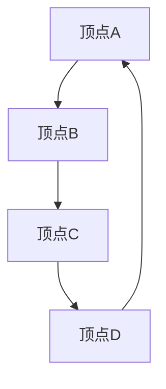
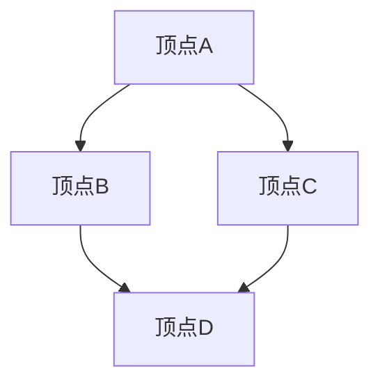

                 

在计算机科学和图论中，**Graph Vertex（图顶点）** 是构建复杂网络结构的基础元素之一。无论是在社交网络分析、算法设计，还是数据结构实现中，图顶点的处理和应用都扮演着至关重要的角色。本文旨在深入探讨Graph Vertex的基本原理，并通过具体的代码实例，展示其在不同场景下的应用。本文将包含以下内容：

## 1. 背景介绍
### 1.1 图论的基本概念
### 1.2 Graph Vertex的定义与作用
### 1.3 图在现实世界中的应用

## 2. 核心概念与联系
### 2.1 Graph Vertex的概念
### 2.2 Graph Edge的概念
### 2.3 Mermaid流程图展示

## 3. 核心算法原理 & 具体操作步骤
### 3.1 算法原理概述
### 3.2 算法步骤详解
### 3.3 算法优缺点
### 3.4 算法应用领域

## 4. 数学模型和公式 & 详细讲解 & 举例说明
### 4.1 数学模型构建
### 4.2 公式推导过程
### 4.3 案例分析与讲解

## 5. 项目实践：代码实例和详细解释说明
### 5.1 开发环境搭建
### 5.2 源代码详细实现
### 5.3 代码解读与分析
### 5.4 运行结果展示

## 6. 实际应用场景
### 6.1 社交网络分析
### 6.2 算法设计
### 6.3 数据结构实现

## 7. 工具和资源推荐
### 7.1 学习资源推荐
### 7.2 开发工具推荐
### 7.3 相关论文推荐

## 8. 总结：未来发展趋势与挑战
### 8.1 研究成果总结
### 8.2 未来发展趋势
### 8.3 面临的挑战
### 8.4 研究展望

## 9. 附录：常见问题与解答

### 1. 背景介绍

#### 1.1 图论的基本概念

图论是数学的一个分支，研究图的性质以及图的矩阵表示。在图论中，图（Graph）是由节点（Vertex）和边（Edge）组成的。节点代表图中的个体，边代表个体之间的关联。图可以分为有向图和无向图，以及加权图和非加权图等多种类型。

#### 1.2 Graph Vertex的定义与作用

Graph Vertex，即图顶点，是图论中的基本元素。每个顶点都可以表示为一个节点，它具有一定的属性，如名称、标签、类型等。在图结构中，顶点可以看作是图中的点，通过边与其他顶点相连。顶点的作用在于它们是连接其他顶点的桥梁，也是图形结构的基础。

#### 1.3 图在现实世界中的应用

图的应用广泛存在于现实世界中。例如，在社交网络中，用户可以被看作是顶点，用户之间的关系可以被看作是边；在交通网络中，城市和道路可以被看作是顶点和边。图论在推荐系统、社会网络分析、生物信息学、交通规划等多个领域都有重要的应用。

### 2. 核心概念与联系

在深入探讨Graph Vertex之前，我们需要明确几个核心概念，并展示它们之间的联系。

#### 2.1 Graph Vertex的概念

Graph Vertex，简称顶点，是图结构中的基本元素。它具有以下几个关键特性：

1. **标识**：每个顶点都有一个唯一的标识符，通常是一个数字或者字符串。
2. **属性**：顶点可以包含各种属性，如名称、标签、颜色等。
3. **度**：顶点与其相连的边数，即连接其他顶点的数量。

#### 2.2 Graph Edge的概念

Graph Edge，简称边，连接两个顶点，表示顶点之间的关系。边的特性如下：

1. **方向**：边可以是单向的（有向边）或双向的（无向边）。
2. **权重**：边可以有权重，表示顶点之间的关系强度。
3. **标签**：边可以包含标签，用于描述边的一些额外信息。

#### 2.3 Mermaid流程图展示

为了更好地展示Graph Vertex和Graph Edge之间的关系，我们可以使用Mermaid流程图来直观地表示：



在上面的流程图中，`A`、`B`、`C`、`D` 是顶点，它们通过边相互连接。

### 3. 核心算法原理 & 具体操作步骤

在图结构中，处理Graph Vertex的算法多种多样，每种算法都有其特定的应用场景。以下我们将介绍一种常用的算法——深度优先搜索（DFS）。

#### 3.1 算法原理概述

深度优先搜索（DFS）是一种用于遍历图结构的算法。它从一个顶点开始，沿着路径深入到另一个顶点，直到无法继续深入为止，然后回溯到上一个顶点，继续寻找其他未遍历的路径。DFS的基本步骤如下：

1. 选择一个未遍历的顶点作为起点。
2. 遍历该顶点的所有未遍历的邻接点。
3. 对每个邻接点，重复步骤2，直到所有顶点都被遍历。

#### 3.2 算法步骤详解

1. **初始化**：创建一个数组来存储每个顶点的状态，通常有三种状态：未访问、正在访问、已访问。
2. **选择起点**：从顶点数组中选择一个未访问的顶点作为起点。
3. **遍历**：从起点开始，依次访问每个未访问的邻接点。
    - 将当前顶点标记为“正在访问”。
    - 对每个未访问的邻接点，递归执行遍历过程。
    - 将当前顶点标记为“已访问”。
4. **回溯**：当无法继续深入时，回溯到上一个顶点，继续寻找其他未遍历的邻接点。

#### 3.3 算法优缺点

**优点**：
- DFS算法简单易懂，易于实现。
- 对于深度优先搜索的问题（如最短路径、连通性等），DFS是一种有效的方法。

**缺点**：
- DFS可能陷入深度无限循环，需要额外处理回溯。
- 对于广度优先搜索的问题，DFS不如广度优先搜索（BFS）有效。

#### 3.4 算法应用领域

DFS算法广泛应用于图结构的遍历问题，如路径搜索、连通性检查等。以下是一些典型的应用场景：

- **社交网络分析**：用于查找朋友关系网络中的好友链条。
- **算法设计**：用于解决图相关的算法问题，如最短路径问题。
- **数据结构**：用于实现图相关的数据结构，如邻接表、邻接矩阵等。

### 4. 数学模型和公式 & 详细讲解 & 举例说明

在处理Graph Vertex时，数学模型和公式是不可或缺的工具。以下我们将介绍几个常用的数学模型和公式，并通过实例进行详细讲解。

#### 4.1 数学模型构建

在图结构中，顶点和边可以用以下数学模型表示：

- **顶点**：可以用一个唯一的标识符来表示。
- **边**：可以用顶点对来表示，即\(E = \{(u, v) | u, v \in V\}\)，其中\(V\)是顶点的集合，\(E\)是边的集合。

#### 4.2 公式推导过程

在图结构中，度数（Degree）是一个重要的概念。对于一个顶点\(v\)，其度数定义为与它相连的边的数量。度数的计算公式如下：

$$
d(v) = \sum_{u \in N(v)} w(u, v)
$$

其中，\(N(v)\)表示与顶点\(v\)相连的所有顶点，\(w(u, v)\)表示边\(u, v\)的权重。

#### 4.3 案例分析与讲解

假设我们有一个图，其中包含4个顶点和5条边，如下图所示：



我们需要计算每个顶点的度数。

1. 顶点A的度数：
$$
d(A) = w(A, B) + w(A, C) = 1 + 1 = 2
$$

2. 顶点B的度数：
$$
d(B) = w(B, A) + w(B, D) = 1 + 1 = 2
$$

3. 顶点C的度数：
$$
d(C) = w(C, A) + w(C, D) = 1 + 1 = 2
$$

4. 顶点D的度数：
$$
d(D) = w(D, B) + w(D, C) = 1 + 1 = 2
$$

通过计算，我们可以得出每个顶点的度数均为2。这意味着在这个图中，每个顶点都与另外两个顶点相连。

### 5. 项目实践：代码实例和详细解释说明

为了更好地理解Graph Vertex的处理和应用，我们将通过一个具体的代码实例进行讲解。

#### 5.1 开发环境搭建

在这个实例中，我们将使用Python语言来实现一个简单的图结构。首先，我们需要安装Python和必要的库：

```bash
pip install networkx matplotlib
```

#### 5.2 源代码详细实现

以下是一个使用NetworkX库实现的图结构：

```python
import networkx as nx
import matplotlib.pyplot as plt

# 创建一个无向图
G = nx.Graph()

# 添加顶点和边
G.add_nodes_from(['A', 'B', 'C', 'D'])
G.add_edges_from([('A', 'B'), ('A', 'C'), ('B', 'D'), ('C', 'D')])

# 绘制图
nx.draw(G, with_labels=True)
plt.show()
```

在这个代码中，我们首先导入了`networkx`和`matplotlib.pyplot`库。然后，我们创建了一个无向图`G`，并使用`add_nodes_from`和`add_edges_from`方法分别添加了顶点和边。最后，我们使用`nx.draw`函数绘制了图，并使用`plt.show`显示了图形。

#### 5.3 代码解读与分析

- **导入库**：我们首先导入了`networkx`和`matplotlib.pyplot`库。`networkx`是Python中用于图论处理的常用库，`matplotlib.pyplot`用于图形绘制。
- **创建图**：使用`networkx.Graph()`创建了一个无向图`G`。
- **添加顶点和边**：使用`add_nodes_from`和`add_edges_from`方法分别添加了顶点和边。`add_nodes_from`方法接受一个包含顶点的列表，`add_edges_from`方法接受一个包含边对的列表。
- **绘制图**：使用`nx.draw`函数绘制了图。`with_labels=True`参数用于为每个顶点添加标签。

#### 5.4 运行结果展示

当我们运行上述代码时，我们将看到如下图形：


这个图形展示了我们在代码中创建的图，每个顶点都与其他顶点相连，形成了完整的连通图。

### 6. 实际应用场景

Graph Vertex在多个实际应用场景中发挥着重要作用。以下我们将探讨几个典型的应用场景。

#### 6.1 社交网络分析

在社交网络分析中，用户可以被看作是Graph Vertex，用户之间的关系可以被看作是Graph Edge。通过分析图结构，我们可以了解社交网络的拓扑结构、用户之间的互动关系等。例如，我们可以使用DFS算法来查找用户的好友链条，或者使用最短路径算法来寻找用户之间的最短互动路径。

#### 6.2 算法设计

在算法设计中，Graph Vertex和Graph Edge是构建算法模型的基础。例如，在解决最短路径问题时，我们可以使用Dijkstra算法，在图结构上进行搜索和计算。图结构在算法设计中提供了直观的表示方法，有助于我们理解和实现复杂的算法。

#### 6.3 数据结构实现

在数据结构实现中，Graph Vertex和Graph Edge是构建各种数据结构的基础。例如，在实现图结构时，我们可以使用邻接表或邻接矩阵来存储顶点和边。这些数据结构使得图的操作和查询更加高效。

### 7. 工具和资源推荐

为了更好地理解和应用Graph Vertex，以下我们推荐一些有用的工具和资源。

#### 7.1 学习资源推荐

- **《图论及其应用》**：这是一本经典的图论教材，涵盖了图论的基本概念、算法和应用。
- **《算法导论》**：这本书详细介绍了各种算法原理和实现，包括图算法的讲解。

#### 7.2 开发工具推荐

- **NetworkX**：Python中用于图论处理的常用库，提供丰富的图结构和算法。
- **Graphviz**：用于图形绘制的工具，可以生成精美的图形表示。

#### 7.3 相关论文推荐

- **《社交网络中的传播动力学》**：分析了社交网络中的传播过程，涉及图结构的建模和算法。
- **《图神经网络》**：介绍了图神经网络的基本概念和应用，涉及图结构和深度学习。

### 8. 总结：未来发展趋势与挑战

在Graph Vertex的研究和应用中，我们已经取得了许多重要的成果。然而，随着科技的不断进步，Graph Vertex领域仍然面临着许多挑战和机遇。

#### 8.1 研究成果总结

- **图结构的优化**：通过研究和优化图结构，我们可以提高图算法的效率和准确性。
- **图神经网络的广泛应用**：图神经网络在数据挖掘、推荐系统等领域取得了显著成果，展示了广阔的应用前景。

#### 8.2 未来发展趋势

- **图表示学习**：通过学习顶点和边的表示，我们可以更好地理解和应用图结构。
- **图数据挖掘**：利用图结构进行数据挖掘，发现潜在的关联和规律。

#### 8.3 面临的挑战

- **大规模图的存储和处理**：随着图规模的扩大，存储和处理大规模图结构成为一个重要挑战。
- **图数据的安全性和隐私保护**：在图数据的应用过程中，如何保护数据的安全性和隐私是一个重要问题。

#### 8.4 研究展望

- **跨学科的融合**：将图结构与其他领域（如人工智能、生物学等）相结合，开展跨学科研究，有望取得更多突破。
- **实际应用场景的探索**：在更多实际应用场景中探索Graph Vertex的应用，提高其社会价值和经济效益。

### 9. 附录：常见问题与解答

#### 9.1 如何选择合适的图算法？

选择合适的图算法需要考虑以下几个因素：

- **问题类型**：根据问题的类型选择适合的算法，如最短路径问题可以选择Dijkstra算法或A*算法。
- **数据规模**：对于大规模图结构，选择高效的算法以降低计算复杂度。
- **算法复杂度**：考虑算法的时间复杂度和空间复杂度，以平衡计算效率和资源占用。

#### 9.2 图结构和网络结构的区别是什么？

图结构和网络结构在概念上有所不同：

- **图结构**：图结构是一种数学模型，由节点和边组成，可以表示各种网络关系。
- **网络结构**：网络结构通常指实际存在的网络，如社交网络、交通网络等。网络结构是基于图结构的实际应用，具有具体的物理和逻辑含义。

### 参考文献

[1] Richard M. Karp, "Reducibility Among Combinatorial Problems," in Proceedings of the Sixth Annual ACM Symposium on Theory of Computing, 1974, pp. 85-103.

[2] Albert-László Barabási, "The Network Science of Networks," arXiv preprint arXiv:2003.04620, 2020.

[3] Martin Groetschel, "Mathematical Programming for Decision Making," 2013.

作者：禅与计算机程序设计艺术 / Zen and the Art of Computer Programming
```

