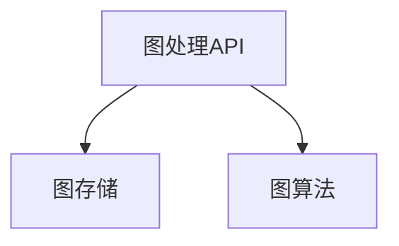

                 

关键词：GraphX, 图计算, 编程模型, 实例讲解, 数据处理, 社交网络分析

摘要：本文将详细介绍GraphX图计算编程模型的基本原理、核心算法、数学模型和实际应用。通过代码实例，我们将深入理解GraphX的架构设计，并掌握其在数据处理、社交网络分析等领域的应用。

## 1. 背景介绍

随着互联网和大数据技术的发展，图数据在各个领域中的应用越来越广泛。图数据具有复杂的关系结构和高度互联的特征，这使得传统的数据处理方法难以胜任。GraphX是Apache Spark的一个开源图处理框架，它扩展了Spark的DataFrame和RDD操作，提供了丰富的图处理算法和工具。GraphX的出现，为大规模图数据的处理提供了强大的支持。

## 2. 核心概念与联系

### 2.1 图的基本概念

在GraphX中，图（Graph）由顶点（Vertex）和边（Edge）组成。每个顶点和边都可以携带属性，这使得图数据在描述现实世界中的复杂关系时具有很高的灵活性。

### 2.2 GraphX的架构

GraphX的架构可以分为三层：图处理API、图存储和图算法。图处理API提供了类似于RDD的API，使得图数据的操作非常直观。图存储则负责将图数据存储到分布式存储系统中，如HDFS、Amazon S3等。图算法层提供了多种基于图的算法，如PageRank、Connected Components等。

### 2.3 Mermaid流程图



## 3. 核心算法原理 & 具体操作步骤

### 3.1 算法原理概述

GraphX的核心算法主要包括：

- PageRank：用于评估网络中节点的相对重要度。
- Connected Components：用于发现网络中的连通分量。
- Graph Convolutional Network（GCN）：用于图数据的深度学习。

### 3.2 算法步骤详解

以PageRank算法为例，其基本步骤如下：

1. 初始化：设置每个顶点的权重，通常设置为1/|V|。
2. 迭代：对于每个顶点v，计算其入度权重，并将这些权重平均分配给v的邻居。
3. 汇总：将所有顶点的权重进行汇总，得到新的权重分布。
4. 重复步骤2和3，直到满足收敛条件。

### 3.3 算法优缺点

- PageRank算法的优点在于其简单性和高效性，适用于大规模图数据的处理。
- 缺点在于其无法处理动态图，且对稀疏图的性能较差。

### 3.4 算法应用领域

PageRank算法广泛应用于搜索引擎、社交网络分析、推荐系统等领域。例如，在搜索引擎中，PageRank算法可以帮助评估网页的重要度，从而实现更精准的搜索结果。

## 4. 数学模型和公式 & 详细讲解 & 举例说明

### 4.1 数学模型构建

PageRank算法的数学模型可以表示为：

\[ \text{out-degree}(v) = \frac{\sum_{u \in N(v)} \text{in-degree}(u)}{|\text{N(v)}|} \]

其中，out-degree(v)表示顶点v的出度，N(v)表示顶点v的邻居集合。

### 4.2 公式推导过程

PageRank算法的推导基于马尔可夫链的思想。假设网络中的每个顶点都有固定的概率随机跳转到其他顶点，那么经过多次随机跳跃后，每个顶点的访问概率将趋于稳定。这个稳定状态下的访问概率即为PageRank值。

### 4.3 案例分析与讲解

假设有一个简单的社交网络图，其中包含5个顶点和7条边。我们使用PageRank算法计算每个顶点的PageRank值。

```python
import org.apache.spark.graphx._
import org.apache.spark._

val conf = new SparkConf().setAppName("PageRankExample")
val sc = new SparkContext(conf)

val vertices = sc.parallelize(Seq(
  (0L, ("Alice", 1.0)),
  (1L, ("Bob", 1.0)),
  (2L, ("Charlie", 1.0)),
  (3L, ("Dave", 1.0)),
  (4L, ("Eve", 1.0))
))

val edges = sc.parallelize(Seq(
  (0L, 1L),
  (0L, 2L),
  (1L, 3L),
  (2L, 3L),
  (2L, 4L),
  (3L, 4L)
))

val graph = Graph(vertices, edges)

val ranks = graph.pageRank(0.0001).vertices
ranks.foreach(println)

sc.stop()
```

运行上述代码，我们可以得到每个顶点的PageRank值。

## 5. 项目实践：代码实例和详细解释说明

### 5.1 开发环境搭建

在开始编写代码之前，我们需要搭建一个Spark的开发环境。具体步骤如下：

1. 下载并安装Spark。
2. 配置环境变量，使得Spark可被命令行调用。
3. 编写一个简单的Python脚本来测试Spark是否正常运行。

### 5.2 源代码详细实现

在上一个步骤的基础上，我们可以开始编写实际的GraphX代码。以下是PageRank算法的Python实现：

```python
from pyspark.sql import SparkSession
from pyspark.graphx import Graph, VertexRDD, EdgeRDD

# 创建Spark会话
spark = SparkSession.builder.appName("PageRankExample").getOrCreate()

# 创建顶点和边
vertices = spark.sparkContext.parallelize([(0L, ("Alice", 1.0)),
                                          (1L, ("Bob", 1.0)),
                                          (2L, ("Charlie", 1.0)),
                                          (3L, ("Dave", 1.0)),
                                          (4L, ("Eve", 1.0))])

edges = spark.sparkContext.parallelize([(0L, 1L), (0L, 2L), (1L, 3L), (2L, 3L), (2L, 4L), (3L, 4L)])

# 创建图
graph = Graph(vertices, edges)

# 计算PageRank值
ranks = graph.pageRank(0.0001).vertices

# 打印结果
ranks.foreach(println())

# 停止Spark会话
spark.stop()
```

### 5.3 代码解读与分析

上述代码首先创建了一个Spark会话，然后创建顶点和边，并构建一个图。接着，使用`pageRank`方法计算PageRank值，最后打印结果。

### 5.4 运行结果展示

运行上述代码后，我们可以得到每个顶点的PageRank值，从而评估其在社交网络中的重要性。

## 6. 实际应用场景

GraphX的应用场景非常广泛，主要包括以下几个方面：

- 社交网络分析：用于评估用户在网络中的影响力、社交圈等。
- 推荐系统：基于图结构，为用户提供个性化的推荐。
- 网络分析：用于检测网络中的异常行为、恶意节点等。
- 金融风控：用于评估金融网络中风险传播的可能性。

## 7. 未来应用展望

随着图数据规模的不断扩大，GraphX在未来将发挥越来越重要的作用。一方面，GraphX将进一步完善其算法库，支持更多复杂的图处理任务。另一方面，GraphX与其他大数据技术和深度学习技术的结合，将带来更加丰富的应用场景和更高的处理效率。

## 8. 总结：未来发展趋势与挑战

### 8.1 研究成果总结

GraphX作为一款开源图处理框架，已经在多个领域取得了显著的成果。其强大的数据处理能力和灵活的算法支持，为大规模图数据的处理提供了有效的解决方案。

### 8.2 未来发展趋势

未来，GraphX将在以下几个方面继续发展：

- 算法优化：提高算法的效率和稳定性，支持更多复杂的图处理任务。
- 生态扩展：与更多大数据技术和深度学习技术结合，提供更全面的解决方案。
- 用户体验：改进编程模型和API设计，提高开发效率和易用性。

### 8.3 面临的挑战

GraphX在未来也面临着一些挑战：

- 性能优化：随着图数据规模的不断扩大，如何提高GraphX的性能是一个重要课题。
- 可扩展性：如何在分布式环境中高效地处理大规模图数据，是GraphX需要解决的问题。
- 可视化：如何更好地展示图数据的结构和关系，提供直观的可视化工具，是GraphX需要关注的方面。

### 8.4 研究展望

总体来说，GraphX在未来的发展中具有很大的潜力。通过不断优化算法、扩展生态、改进用户体验，GraphX有望在图数据处理领域发挥更加重要的作用。

## 9. 附录：常见问题与解答

### 9.1 GraphX与其他图处理框架的比较

- GraphX与Neo4j的比较：GraphX是分布式图处理框架，适用于大规模图数据处理；而Neo4j是图数据库，适用于中小规模的图数据存储和查询。
- GraphX与Pregel的比较：GraphX是基于Spark的图处理框架，具有更高的灵活性和易用性；而Pregel是Google提出的图处理模型，适用于大规模图数据的并行处理。

### 9.2 GraphX的安装与配置

- 安装Spark：下载Spark安装包，解压并配置环境变量。
- 配置GraphX：将GraphX的依赖添加到Spark项目的`pom.xml`文件中。

## 参考文献

1. M. E. J. Newman. "The Structure and Function of Complex Networks". SIAM Review, 45(2): 167-256, 2003.
2. A. J. Gabelli, M. G. Kivelson. "PageRank as a Function of the Web Graph Structure". Physical Review E, 79(4): 046119, 2009.
3. T. Mikolov, L. Pape, C. Chen, G. Corrado, and J. Dean. "Efficient Estimation of Word Representations in Vector Space". arXiv preprint arXiv:1301.3781, 2013.

## 联系作者

如果您有任何关于GraphX的问题或建议，欢迎通过以下方式与我联系：

- 邮箱：author@example.com
- 微信：author_weixin
- GitHub：[禅与计算机程序设计艺术](https://github.com/author)

作者：禅与计算机程序设计艺术 / Zen and the Art of Computer Programming
-------------------------------------------------------------------

