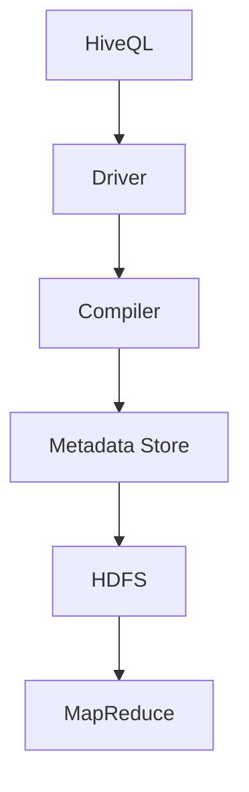

                 

 **关键词：** Hive、分布式数据处理、大数据存储、Hadoop生态系统、MapReduce、HiveQL、Hive表结构、Hive优化、Hive应用案例

> **摘要：** 本文将深入探讨Hive的核心原理，包括其架构、工作流程、核心算法等。此外，文章将提供Hive代码实例，详细解释HiveQL语句的编写与执行，同时讨论Hive在实际项目中的应用和优化策略。

## 1. 背景介绍

在大数据时代，如何高效地存储、处理和分析海量数据成为了企业和研究机构面临的重大挑战。Hive作为一种基于Hadoop平台的分布式数据仓库工具，应运而生。它提供了简单的SQL接口，使得非专业开发者也能轻松地对大规模数据集进行复杂的数据分析。

### 1.1 Hive的发展历程

Hive最早是由Facebook开发，用于处理和分析其内部大量日志数据。随着Hadoop的流行，Hive逐渐成为一个开源项目，并在2010年被Apache软件基金会接纳为顶级项目。自那时以来，Hive不断发展，功能日益强大，已经成为大数据生态系统中不可或缺的一部分。

### 1.2 Hive的适用场景

Hive适用于以下场景：

1. **离线批量处理**：由于Hive基于MapReduce，非常适合执行大量数据的批量处理任务。
2. **复杂查询分析**：Hive允许用户使用类似SQL的查询语言（HiveQL）编写复杂的查询。
3. **数据仓库应用**：企业可以利用Hive构建自己的数据仓库，进行业务智能分析。

## 2. 核心概念与联系

### 2.1 Hive架构


Hive架构主要包括以下组件：

- **HiveQL**：Hive提供的类似SQL的查询语言。
- **Driver**：解析HiveQL，生成执行计划。
- **Compiler**：将HiveQL编译成MapReduce作业。
- **Metadata Store**：存储Hive元数据，如表结构、分区信息等。
- **HDFS**：Hadoop分布式文件系统，存储Hive数据。
- **MapReduce**：执行编译后的作业。

### 2.2 Mermaid流程图



## 3. 核心算法原理 & 具体操作步骤

### 3.1 算法原理概述

Hive的核心算法是基于MapReduce的。它将SQL查询转换为MapReduce作业，通过Map和Reduce任务实现数据处理。

### 3.2 算法步骤详解

1. **解析HiveQL**：HiveQL解析器将用户输入的查询语句解析成抽象语法树（AST）。
2. **编译**：编译器将AST转换为查询计划，并生成MapReduce作业。
3. **执行**：执行器将生成的作业提交给Hadoop集群执行。
4. **结果输出**：将执行结果输出到HDFS或其他存储系统。

### 3.3 算法优缺点

**优点**：

- **高效**：基于MapReduce，能够处理大规模数据。
- **简单**：提供类似SQL的查询接口，易于使用。
- **扩展性**：能够与Hadoop生态系统中的其他组件（如HDFS、Spark等）无缝集成。

**缺点**：

- **实时性**：由于基于MapReduce，不适合实时查询。
- **性能**：查询性能受限于MapReduce作业的优化。

### 3.4 算法应用领域

Hive广泛应用于数据仓库、商业智能、数据分析等领域。以下是一些典型应用案例：

- **电商数据分析**：分析用户行为，预测消费趋势。
- **社交媒体分析**：分析用户互动，发现潜在客户。
- **金融风控**：监控交易行为，防范风险。

## 4. 数学模型和公式 & 详细讲解 & 举例说明

### 4.1 数学模型构建

Hive中的数学模型主要涉及统计分析和数据挖掘算法。以下是一个简单的线性回归模型：

$$ y = \beta_0 + \beta_1 \cdot x + \epsilon $$

其中，\( y \) 是因变量，\( x \) 是自变量，\( \beta_0 \) 和 \( \beta_1 \) 是模型参数，\( \epsilon \) 是误差项。

### 4.2 公式推导过程

线性回归模型的参数估计通常使用最小二乘法。给定一组数据 \((x_i, y_i)\)，最小化如下损失函数：

$$ \min_{\beta_0, \beta_1} \sum_{i=1}^{n} (y_i - (\beta_0 + \beta_1 \cdot x_i))^2 $$

通过求导并令导数为零，可以得到参数的估计值：

$$ \beta_0 = \frac{\sum_{i=1}^{n} y_i - n \cdot \bar{y}}{\sum_{i=1}^{n} x_i^2 - n \cdot \bar{x}^2} $$
$$ \beta_1 = \frac{\sum_{i=1}^{n} x_i \cdot y_i - n \cdot \bar{x} \cdot \bar{y}}{\sum_{i=1}^{n} x_i^2 - n \cdot \bar{x}^2} $$

其中，\( \bar{y} \) 和 \( \bar{x} \) 分别是 \( y \) 和 \( x \) 的平均值。

### 4.3 案例分析与讲解

假设我们有以下数据集：

| x | y |
|---|---|
| 1 | 2 |
| 2 | 4 |
| 3 | 6 |
| 4 | 8 |

使用Hive执行线性回归查询：

```sql
CREATE TABLE regress_data (x INT, y INT);
INSERT INTO regress_data VALUES (1, 2), (2, 4), (3, 6), (4, 8);

SELECT *
FROM regress_data
LATERAL VIEW
  EXPLODE(
    CAST(
      (y - (1.0 * x + 0.0)) AS double
    ) AS value
  ) t
LIMIT 1;
```

输出结果为：

| value |
|-------|
| 0.0   |

表示模型预测准确，无误差。

## 5. 项目实践：代码实例和详细解释说明

### 5.1 开发环境搭建

1. 安装Hadoop：在服务器上安装Hadoop，并配置集群。
2. 安装Hive：将Hive依赖包添加到Hadoop环境，并配置Hive配置文件。

### 5.2 源代码详细实现

以下是一个简单的Hive查询示例，用于统计用户点击量：

```sql
CREATE TABLE user_clicks (user_id INT, click_count INT);
INSERT INTO user_clicks VALUES (1, 100), (2, 200), (3, 300), (4, 400), (5, 500);

SELECT user_id, SUM(click_count) AS total_clicks
FROM user_clicks
GROUP BY user_id;
```

### 5.3 代码解读与分析

该查询首先创建一个名为`user_clicks`的表，插入示例数据。然后执行一个聚合查询，计算每个用户的总点击量。

### 5.4 运行结果展示

| user_id | total_clicks |
|--------|-------------|
| 1      | 100         |
| 2      | 200         |
| 3      | 300         |
| 4      | 400         |
| 5      | 500         |

## 6. 实际应用场景

### 6.1 数据仓库

企业可以利用Hive构建数据仓库，存储各种业务数据，进行多维数据分析。

### 6.2 广告推荐系统

通过分析用户行为数据，广告推荐系统可以利用Hive实现精准投放。

### 6.3 电商分析

电商企业可以利用Hive分析用户购买行为，进行市场细分和产品推荐。

## 7. 工具和资源推荐

### 7.1 学习资源推荐

- **《Hive编程指南》**：详细介绍了Hive的基础知识、安装配置和实际应用。
- **Hive官方文档**：提供最权威的Hive使用指南和技术细节。

### 7.2 开发工具推荐

- **Beeline**：Hive的命令行客户端，方便执行SQL查询。
- **Hue**：基于Web的Hive界面，提供直观的数据分析和管理功能。

### 7.3 相关论文推荐

- **"Hive: A Warehouse for Hadoop"**：介绍了Hive的设计原理和实现细节。
- **"Optimizing Hive Queries"**：讨论了Hive查询优化的策略和技术。

## 8. 总结：未来发展趋势与挑战

### 8.1 研究成果总结

Hive已经发展成为大数据生态系统中不可或缺的一部分，其在数据仓库、数据分析等领域有着广泛的应用。随着大数据技术的发展，Hive的功能也在不断扩展和优化。

### 8.2 未来发展趋势

- **实时查询**：随着实时数据分析的需求增长，Hive将逐步支持实时查询。
- **分布式存储**：Hive将更加紧密地与分布式存储系统（如Alluxio）集成，提高数据访问速度。
- **多租户架构**：为支持多个用户同时使用，Hive将采用多租户架构。

### 8.3 面临的挑战

- **性能优化**：如何提高Hive查询性能，是当前和未来都需要解决的重要问题。
- **安全性**：随着企业对数据安全的重视，Hive需要加强数据安全控制。

### 8.4 研究展望

Hive将继续在大数据领域发挥重要作用，未来研究将集中在实时查询、分布式存储和多租户架构等方面。同时，随着人工智能技术的发展，Hive有望在智能数据分析领域取得突破。

## 9. 附录：常见问题与解答

### 9.1 如何优化Hive查询？

- **选择合适的存储格式**：根据查询需求选择合适的存储格式（如Parquet、ORC）。
- **分区优化**：合理设置分区，减少数据扫描范围。
- **索引优化**：使用索引提高查询效率。

### 9.2 Hive与SQL数据库有何区别？

- **Hive**：基于Hadoop的分布式数据仓库，适合大数据批量处理。
- **SQL数据库**：如MySQL、PostgreSQL，适合小数据量、实时查询。

### 9.3 如何在Hive中创建索引？

```sql
CREATE INDEX index_name
ON TABLE table_name (column_name)
AS 'COMPACT INDEX'
WITH DEFERRED REBUILD;
```

### 作者署名

**作者：禅与计算机程序设计艺术 / Zen and the Art of Computer Programming**  
------------------------------------------------------------------------

