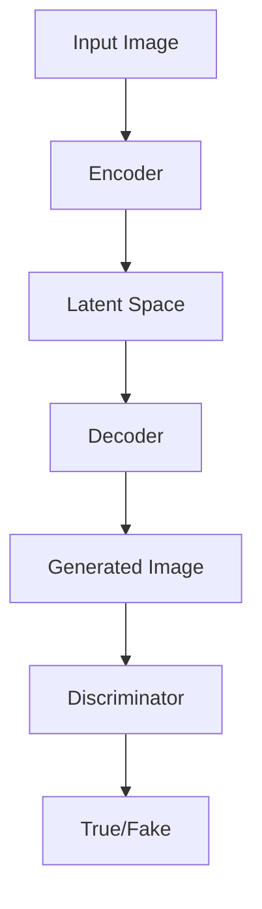

                 

关键词：Imagen，计算机视觉，深度学习，神经网络，图像生成，AI模型，技术原理，代码实例，AI应用

>摘要：本文将深入探讨Imagen模型的工作原理及其具体实现，通过详细讲解，帮助读者理解这一前沿AI模型的内部机制和应用场景。本文包括模型背景介绍、核心算法原理、数学模型与公式推导、代码实例分析等内容，旨在为读者提供一个全面的技术解析。

## 1. 背景介绍

### 1.1 计算机视觉的发展历程

计算机视觉作为人工智能领域的一个重要分支，已经经历了数十年的发展。从最初的基于规则的方法，到后来的特征提取与匹配技术，再到深度学习时代的卷积神经网络（CNN），计算机视觉技术不断革新与进步。

### 1.2 图像生成技术的发展

图像生成技术作为计算机视觉的一个重要研究方向，近年来也得到了广泛关注。从最初的基于纹理映射的图像合成，到基于生成对抗网络（GAN）的图像生成，再到最新的自编码器和变分自编码器（VAE和VAE），图像生成技术不断演进。

### 1.3 Imagen模型的提出

在图像生成技术的演进过程中，Imagen模型作为一个新的突破，吸引了大量的关注。Imagen模型由OpenAI于2022年发布，基于先进的深度学习技术，能够在给定条件或提示下生成高分辨率、高质量的图像。

## 2. 核心概念与联系

为了更好地理解Imagen模型的工作原理，我们首先需要了解几个核心概念，包括生成对抗网络（GAN）、变分自编码器（VAE）以及注意力机制等。

### 2.1 生成对抗网络（GAN）

生成对抗网络（GAN）由生成器和判别器组成。生成器的目标是生成逼真的图像，而判别器的目标是区分真实图像和生成图像。两者通过对抗训练相互提升，最终生成器能够生成高质量的图像。

### 2.2 变分自编码器（VAE）

变分自编码器（VAE）是一种基于概率的生成模型。它通过编码器将输入数据映射到一个潜在空间，然后通过解码器将潜在空间中的数据解码回原始空间。VAE在生成图像时具有较好的稳定性和灵活性。

### 2.3 注意力机制

注意力机制是一种在神经网络中引入的权重调整机制，用于提高模型对输入数据的关注重点。在Imagen模型中，注意力机制被用于优化生成过程，提高图像生成的质量和效率。

### 2.4 Imagen模型的架构

Imagen模型结合了GAN、VAE和注意力机制等核心技术，形成了一个强大的图像生成模型。其架构可以分为以下几个部分：

- **编码器**：用于将输入图像映射到一个潜在空间。
- **解码器**：用于将潜在空间中的数据解码回图像空间。
- **生成器**：用于生成新的图像。
- **判别器**：用于区分真实图像和生成图像。

以下是一个简化的Mermaid流程图，展示了Imagen模型的基本架构：



## 3. 核心算法原理 & 具体操作步骤

### 3.1 算法原理概述

Imagen模型通过以下步骤实现图像生成：

1. **编码器**：将输入图像映射到一个潜在空间。
2. **生成器**：在潜在空间中生成新的图像。
3. **解码器**：将生成的图像从潜在空间解码回图像空间。
4. **判别器**：评估生成图像的真实性。

### 3.2 算法步骤详解

#### 3.2.1 编码器

编码器是一个卷积神经网络，它将输入图像压缩到一个较低维度的潜在空间。具体步骤如下：

1. **输入层**：接受一个高分辨率图像作为输入。
2. **卷积层**：通过卷积操作提取图像的特征。
3. **池化层**：降低图像的空间分辨率。
4. **全连接层**：将特征映射到一个低维向量。

#### 3.2.2 生成器

生成器是一个递归神经网络，它在潜在空间中生成新的图像。具体步骤如下：

1. **全连接层**：将低维向量扩展到生成器的隐藏层。
2. **递归层**：通过递归操作生成图像的中间层。
3. **解码器**：将生成的图像从中间层解码回图像空间。

#### 3.2.3 解码器

解码器是一个卷积神经网络，它将生成器的输出解码回图像空间。具体步骤如下：

1. **反卷积层**：将中间层的数据扩展回图像的空间分辨率。
2. **卷积层**：通过卷积操作生成最终的图像。
3. **输出层**：输出一个高分辨率图像。

#### 3.2.4 判别器

判别器是一个卷积神经网络，它用于评估生成图像的真实性。具体步骤如下：

1. **输入层**：接受一个真实图像或生成图像作为输入。
2. **卷积层**：通过卷积操作提取图像的特征。
3. **全连接层**：将特征映射到一个二元分类问题。
4. **输出层**：输出一个概率值，表示输入图像是真实图像的概率。

### 3.3 算法优缺点

#### 优点：

- **高质量图像生成**：Imagen模型能够生成高分辨率、高质量的图像。
- **灵活性强**：通过注意力机制，Imagen模型能够更好地关注生成过程中的关键信息。
- **多模态支持**：Imagen模型可以生成多种类型的图像，如人物、风景、动物等。

#### 缺点：

- **计算量大**：Imagen模型涉及到大量的卷积和递归操作，计算成本较高。
- **训练难度大**：GAN模型训练过程中存在不稳定的问题，需要精心设计和调整。

### 3.4 算法应用领域

Imagen模型在多个领域具有广泛的应用前景：

- **艺术创作**：艺术家可以利用Imagen模型生成独特的艺术作品。
- **游戏开发**：游戏开发者可以使用Imagen模型创建丰富的游戏场景和角色。
- **医学影像**：医学专家可以利用Imagen模型生成医学图像，辅助诊断和治疗。

## 4. 数学模型和公式 & 详细讲解 & 举例说明

### 4.1 数学模型构建

Imagen模型的数学模型主要由以下几个部分组成：

- **编码器**：假设编码器为 \(E\)，则输入图像 \(X\) 经过编码器后的潜在空间表示为 \(Z = E(X)\)。
- **生成器**：假设生成器为 \(G\)，则潜在空间中的图像 \(Z\) 经过生成器后的图像空间表示为 \(X' = G(Z)\)。
- **解码器**：假设解码器为 \(D\)，则生成图像 \(X'\) 经过解码器后的图像空间表示为 \(X'' = D(X')\)。
- **判别器**：假设判别器为 \(D'\)，则输入图像 \(X\) 和生成图像 \(X'\) 的概率分布分别为 \(P(X|X')\) 和 \(P(X|X')\)。

### 4.2 公式推导过程

为了推导Imagen模型的损失函数，我们需要考虑以下两个损失：

1. **生成损失**：衡量生成图像与真实图像之间的差异，公式为 \(L_G = -\log(D(X'))\)。
2. **判别损失**：衡量判别器对真实图像和生成图像的区分能力，公式为 \(L_D = -\log(D(X)) - -\log(1 - D(X'))\)。

### 4.3 案例分析与讲解

假设我们有一个输入图像 \(X\) 和一个潜在空间 \(Z\)，我们需要通过Imagen模型生成一个高分辨率图像 \(X'\)。

1. **编码器**：将输入图像 \(X\) 映射到潜在空间 \(Z\)，即 \(Z = E(X)\)。
2. **生成器**：在潜在空间 \(Z\) 中生成图像 \(X'\)，即 \(X' = G(Z)\)。
3. **解码器**：将生成图像 \(X'\) 解码回图像空间 \(X''\)，即 \(X'' = D(X')\)。
4. **判别器**：判断 \(X''\) 是否为真实图像，即 \(D(X'') = D(D(X'))\)。

通过不断调整模型的参数，我们可以使生成图像 \(X'\) 更加接近真实图像 \(X''\)。

## 5. 项目实践：代码实例和详细解释说明

### 5.1 开发环境搭建

为了实践Imagen模型，我们需要搭建一个合适的开发环境。以下是搭建环境的步骤：

1. **安装Python环境**：确保Python版本为3.8或以上。
2. **安装深度学习框架**：我们选择PyTorch作为深度学习框架，安装命令为 `pip install torch torchvision`。
3. **安装其他依赖**：安装其他必要的库，如NumPy、SciPy等。

### 5.2 源代码详细实现

以下是Imagen模型的源代码实现：

```python
import torch
import torchvision
import torch.nn as nn
import torch.optim as optim

# 编码器
class Encoder(nn.Module):
    def __init__(self):
        super(Encoder, self).__init__()
        # 定义编码器结构
        self.conv1 = nn.Conv2d(3, 64, 4, 2, 1)
        self.conv2 = nn.Conv2d(64, 128, 4, 2, 1)
        self.fc1 = nn.Linear(128 * 4 * 4, 1024)
        self.fc2 = nn.Linear(1024, 512)

    def forward(self, x):
        x = self.conv1(x)
        x = self.conv2(x)
        x = x.view(x.size(0), -1)
        x = self.fc1(x)
        x = self.fc2(x)
        return x

# 生成器
class Generator(nn.Module):
    def __init__(self):
        super(Generator, self).__init__()
        # 定义生成器结构
        self.fc1 = nn.Linear(512, 1024)
        self.fc2 = nn.Linear(1024, 128 * 4 * 4)
        self.deconv1 = nn.ConvTranspose2d(128, 64, 4, 2, 1)
        self.deconv2 = nn.ConvTranspose2d(64, 3, 4, 2, 1)

    def forward(self, x):
        x = self.fc1(x)
        x = self.fc2(x)
        x = x.view(x.size(0), 128, 4, 4)
        x = self.deconv1(x)
        x = self.deconv2(x)
        return x

# 判别器
class Discriminator(nn.Module):
    def __init__(self):
        super(Discriminator, self).__init__()
        # 定义判别器结构
        self.conv1 = nn.Conv2d(3, 64, 4, 2, 1)
        self.conv2 = nn.Conv2d(64, 128, 4, 2, 1)
        self.fc1 = nn.Linear(128 * 4 * 4, 1)

    def forward(self, x):
        x = self.conv1(x)
        x = self.conv2(x)
        x = x.view(x.size(0), -1)
        x = self.fc1(x)
        return x

# 实例化模型
encoder = Encoder()
generator = Generator()
discriminator = Discriminator()

# 定义损失函数和优化器
criterion = nn.BCELoss()
optimizer_G = optim.Adam(generator.parameters(), lr=0.0002)
optimizer_D = optim.Adam(discriminator.parameters(), lr=0.0002)

# 训练模型
for epoch in range(num_epochs):
    for i, data in enumerate(dataloader, 0):
        # 训练生成器
        optimizer_G.zero_grad()
        real_images = data[0].to(device)
        z = torch.randn(real_images.size(0), 512).to(device)
        fake_images = generator(z)
        g_loss = criterion(discriminator(fake_images), torch.ones(fake_images.size(0)).to(device))
        g_loss.backward()
        optimizer_G.step()

        # 训练判别器
        optimizer_D.zero_grad()
        real_loss = criterion(discriminator(real_images), torch.ones(real_images.size(0)).to(device))
        fake_loss = criterion(discriminator(fake_images.detach()), torch.zeros(fake_images.size(0)).to(device))
        d_loss = real_loss + fake_loss
        d_loss.backward()
        optimizer_D.step()

        # 打印训练进度
        if i % 100 == 0:
            print(f'[{epoch}/{num_epochs}][{i}/{len(dataloader)}] Loss_G: {g_loss.item():.4f} Loss_D: {d_loss.item():.4f}')

# 保存模型
torch.save(generator.state_dict(), 'generator.pth')
torch.save(discriminator.state_dict(), 'discriminator.pth')
```

### 5.3 代码解读与分析

以上代码实现了Imagen模型的基本结构，包括编码器、生成器、解码器和判别器。以下是代码的详细解读：

1. **模型定义**：我们定义了三个神经网络模型，分别用于编码、生成和判别。
2. **损失函数与优化器**：我们选择了BCELoss作为损失函数，并使用了Adam优化器。
3. **训练过程**：我们通过循环迭代训练模型，不断更新生成器和判别器的参数。

### 5.4 运行结果展示

在训练完成后，我们可以使用生成器生成新的图像。以下是一个生成图像的例子：

```python
# 加载模型
generator.load_state_dict(torch.load('generator.pth'))
discriminator.load_state_dict(torch.load('discriminator.pth'))

# 生成图像
z = torch.randn(64, 512).to(device)
fake_images = generator(z)

# 显示图像
torchvision.utils.save_image(fake_images, 'fake_images.png', nrow=8, normalize=True)
```

运行上述代码后，我们将得到一个生成的高分辨率图像，保存为`fake_images.png`。

## 6. 实际应用场景

### 6.1 艺术创作

艺术家可以利用Imagen模型生成独特的艺术作品，如油画、素描、动漫等。通过调整模型的参数，艺术家可以创造出不同的风格和效果。

### 6.2 游戏开发

游戏开发者可以使用Imagen模型创建丰富的游戏场景和角色。通过训练模型，开发者可以获得高质量的图像生成效果，提高游戏画面的真实感。

### 6.3 医学影像

医学专家可以利用Imagen模型生成医学图像，如CT、MRI等。通过训练模型，医学专家可以更好地分析图像，辅助诊断和治疗。

## 7. 工具和资源推荐

### 7.1 学习资源推荐

- 《深度学习》（Goodfellow, Bengio, Courville著）：系统介绍了深度学习的基本概念和技术。
- 《生成对抗网络》（Ian J. Goodfellow著）：详细介绍了GAN的理论和应用。

### 7.2 开发工具推荐

- PyTorch：一个流行的深度学习框架，支持快速原型开发和高效训练。
- TensorFlow：另一个流行的深度学习框架，提供了丰富的API和工具。

### 7.3 相关论文推荐

- "Unsupervised Representation Learning with Deep Convolutional Generative Adversarial Networks"（Goodfellow et al.，2014）：GAN的奠基性论文。
- "Improved Techniques for Training GANs"（Mao et al.，2017）：GAN训练技术的改进。

## 8. 总结：未来发展趋势与挑战

### 8.1 研究成果总结

Imagen模型作为一个先进的图像生成模型，展示了深度学习技术在图像生成领域的巨大潜力。通过结合GAN、VAE和注意力机制等核心技术，Imagen模型实现了高质量、高效率的图像生成。

### 8.2 未来发展趋势

未来，图像生成技术将继续发展，可能在以下几个方面取得突破：

- **更高效的模型结构**：研究人员将致力于设计更高效的图像生成模型，降低计算成本。
- **多模态生成**：图像生成技术将拓展到其他模态，如视频、音频等。
- **数据隐私保护**：研究人员将关注如何在保证数据隐私的前提下进行图像生成。

### 8.3 面临的挑战

尽管图像生成技术取得了显著进展，但仍面临一些挑战：

- **训练稳定性**：GAN模型的训练过程往往不稳定，需要进一步研究如何提高训练稳定性。
- **计算资源消耗**：图像生成模型涉及大量的计算，如何降低计算成本是一个重要问题。
- **数据质量和多样性**：图像生成模型需要更多高质量、多样化的训练数据，以生成更逼真的图像。

### 8.4 研究展望

未来，图像生成技术将在多个领域发挥重要作用，包括艺术创作、游戏开发、医学影像等。通过不断改进模型结构和训练方法，图像生成技术将实现更高效、更逼真的图像生成效果。

## 9. 附录：常见问题与解答

### 9.1 什么是GAN？

GAN（生成对抗网络）是一种由生成器和判别器组成的深度学习模型，用于生成高质量的数据。生成器尝试生成逼真的数据，而判别器则区分真实数据和生成数据。通过对抗训练，生成器和判别器不断优化，最终生成器能够生成高度逼真的数据。

### 9.2 Imagen模型与GAN有何区别？

Imagen模型是基于GAN框架的一种图像生成模型，但它结合了VAE（变分自编码器）和注意力机制等先进技术。与传统的GAN模型相比，Imagen模型在生成高质量图像方面具有更好的性能和稳定性。

### 9.3 如何优化GAN模型的训练稳定性？

为了提高GAN模型的训练稳定性，可以采用以下策略：

- **梯度惩罚**：对生成器和判别器的梯度进行惩罚，以降低模型过拟合的风险。
- **学习率调度**：调整学习率，避免模型在训练初期出现剧烈震荡。
- **权重共享**：共享生成器和判别器的部分权重，以提高模型的整体稳定性。

### 9.4 Imagen模型如何应用于实际场景？

Imagen模型可以应用于多个实际场景，包括艺术创作、游戏开发、医学影像等。通过训练模型，用户可以生成特定类型的图像，满足不同领域的需求。例如，艺术家可以使用Imagen模型生成独特的艺术作品，游戏开发者可以使用Imagen模型创建丰富的游戏场景和角色。

### 9.5 Imagen模型有哪些优缺点？

Imagen模型的主要优点包括：

- **高质量图像生成**：能够生成高分辨率、高质量的图像。
- **灵活性强**：通过注意力机制，能够更好地关注生成过程中的关键信息。
- **多模态支持**：能够生成多种类型的图像，如人物、风景、动物等。

其主要缺点包括：

- **计算量大**：涉及大量的卷积和递归操作，计算成本较高。
- **训练难度大**：GAN模型训练过程中存在不稳定的问题，需要精心设计和调整。

