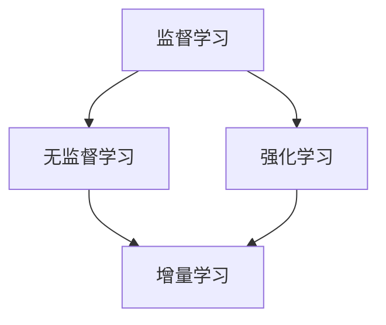
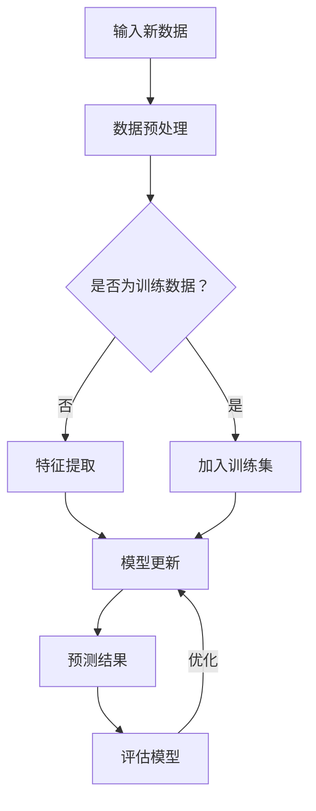

                 

### 1. 背景介绍

增量学习（Incremental Learning），也被称作在线学习（Online Learning），是一种机器学习的方法，它允许模型在一个不断增长的数据集上训练，而不需要重新处理整个数据集。这种方法在数据量庞大、数据持续变化或者无法一次性获取所有数据的场景中非常有用。例如，在推荐系统中，用户的行为数据是不断变化的，增量学习可以实时更新模型，提高推荐的准确性和时效性。

增量学习的重要性在于，它能够有效地处理动态环境中的数据更新，提高模型的适应性和鲁棒性。此外，由于不需要重新训练整个模型，增量学习可以显著减少计算资源和时间成本，提高系统的响应速度。

在本文中，我们将深入探讨增量学习的原理，包括其核心概念、算法原理以及具体实现。我们将结合实际代码实例，详细解释增量学习的实现过程，帮助读者更好地理解和应用这一技术。

### 2. 核心概念与联系

在开始详细介绍增量学习之前，我们需要先了解一些相关的核心概念，包括监督学习、无监督学习和强化学习，以及它们与增量学习的联系。

#### 监督学习（Supervised Learning）

监督学习是一种最常见的机器学习方法，它通过已标记的数据进行训练，以预测未知数据的标签。监督学习可以分为回归和分类两种主要类型。在增量学习场景中，监督学习模型可以用来预测新加入数据的标签，从而更新整个模型。

#### 无监督学习（Unsupervised Learning）

无监督学习不依赖于已标记的数据，其主要目标是发现数据中的结构或模式。常见的无监督学习算法包括聚类、降维和关联规则学习等。在增量学习中，无监督学习可以用来探索新数据，发现潜在的特征或模式，从而辅助监督学习模型的更新。

#### 强化学习（Reinforcement Learning）

强化学习是一种通过与环境交互来学习策略的机器学习方法。它通常用于决策问题，其中智能体通过不断尝试和反馈来优化其行为。在增量学习场景中，强化学习可以用来动态调整模型参数，以适应环境变化。

#### 增量学习与上述学习的联系

增量学习可以看作是监督学习、无监督学习和强化学习的一种扩展。具体来说：

- 监督学习：增量学习利用已标记的数据进行在线更新，提高模型的预测能力。
- 无监督学习：增量学习通过无监督学习算法来探索新数据，辅助特征提取和模型调整。
- 强化学习：增量学习可以结合强化学习策略，动态调整模型参数，适应环境变化。

下图展示了这些概念之间的联系和增量学习的方法论：



#### Mermaid 流程图

下面是增量学习流程的一个简化的Mermaid流程图，展示了数据流和模型更新的过程：



### 3. 核心算法原理 & 具体操作步骤

#### 3.1 算法原理概述

增量学习的主要目标是在模型参数不变的情况下，利用新加入的数据对模型进行更新，以提高模型的性能。其核心原理包括以下三个方面：

1. **在线学习**：模型不断接收新的数据，并在数据到来时立即更新参数。
2. **权重共享**：新旧数据使用相同的模型参数，以共享知识。
3. **梯度下降**：通过计算数据集的梯度，更新模型参数。

增量学习算法可以分为基于批量（batch-based）和基于在线（online-based）两大类。基于批量的增量学习每次更新模型时会处理一批数据，而基于在线的增量学习则每次仅处理一条数据。

#### 3.2 算法步骤详解

增量学习的具体操作步骤如下：

1. **初始化模型**：选择一个基础模型，并将其参数初始化为随机值。
2. **输入新数据**：当有新的数据到来时，将其输入到模型中。
3. **计算损失**：通过模型的输出和实际标签计算损失函数。
4. **计算梯度**：对损失函数求梯度，以确定参数更新的方向和大小。
5. **更新参数**：使用梯度下降或其他优化算法更新模型参数。
6. **评估模型**：在更新后，评估模型在新数据集上的性能。
7. **循环迭代**：重复上述步骤，直到达到停止条件（如损失函数收敛、迭代次数达到限制等）。

#### 3.3 算法优缺点

**优点：**

- **高效**：增量学习可以避免重新训练整个模型，从而显著提高训练速度和效率。
- **灵活性**：它能够动态适应数据的变化，适用于实时数据流的场景。
- **资源节省**：增量学习减少了存储和计算资源的消耗。

**缺点：**

- **收敛速度慢**：增量学习在每次更新时只处理一部分数据，可能需要更长的迭代时间才能收敛。
- **过拟合风险**：如果数据噪声较大，增量学习模型可能会在更新过程中过度拟合。

#### 3.4 算法应用领域

增量学习广泛应用于以下领域：

- **推荐系统**：实时更新用户兴趣模型，提高推荐准确率。
- **文本分类**：处理实时新闻、社交媒体内容，实现动态分类。
- **金融风控**：实时监测交易行为，发现潜在风险。
- **图像识别**：在流媒体应用中，实时识别图像内容。

### 4. 数学模型和公式 & 详细讲解 & 举例说明

#### 4.1 数学模型构建

增量学习的数学模型主要包括两部分：损失函数和优化算法。以下是基本的数学模型构建：

**损失函数（Loss Function）：**

$$
L(\theta) = -\sum_{i=1}^{n} y_i \log(p(x_i; \theta))
$$

其中，$L$ 表示损失函数，$\theta$ 是模型参数，$y_i$ 是第 $i$ 个样本的标签，$p(x_i; \theta)$ 是模型对于第 $i$ 个样本的预测概率。

**优化算法（Optimization Algorithm）：**

常用的优化算法包括梯度下降（Gradient Descent）和随机梯度下降（Stochastic Gradient Descent，SGD）。以下是梯度下降算法的更新公式：

$$
\theta = \theta - \alpha \nabla_{\theta} L(\theta)
$$

其中，$\alpha$ 是学习率，$\nabla_{\theta} L(\theta)$ 是损失函数关于模型参数 $\theta$ 的梯度。

#### 4.2 公式推导过程

**损失函数的推导：**

以二分类问题为例，假设模型的输出是一个概率值 $p(x_i; \theta)$，表示第 $i$ 个样本属于正类的概率。损失函数通常使用交叉熵损失（Cross-Entropy Loss）：

$$
L(\theta) = -\sum_{i=1}^{n} y_i \log(p(x_i; \theta)) - (1 - y_i) \log(1 - p(x_i; \theta))
$$

其中，$y_i$ 为 1 或 0，表示第 $i$ 个样本的标签。交叉熵损失函数反映了模型预测概率与实际标签之间的差异。

**梯度下降的推导：**

为了更新模型参数 $\theta$，我们需要计算损失函数关于 $\theta$ 的梯度。对于交叉熵损失函数，其梯度为：

$$
\nabla_{\theta} L(\theta) = \frac{\partial L(\theta)}{\partial \theta} = \sum_{i=1}^{n} \frac{y_i - p(x_i; \theta)}{p(x_i; \theta)(1 - p(x_i; \theta))}
$$

#### 4.3 案例分析与讲解

**案例背景：**

假设我们有一个简单的线性回归模型，用于预测房价。模型的目标是学习一个线性函数 $y = \theta_0 + \theta_1 \cdot x$，其中 $\theta_0$ 和 $\theta_1$ 是模型参数。

**数据集：**

我们有以下数据集：

| x | y |
|---|---|
| 1 | 2 |
| 2 | 4 |
| 3 | 6 |
| 4 | 8 |

**步骤 1：初始化模型参数**

初始化 $\theta_0$ 和 $\theta_1$ 为随机值，例如 $\theta_0 = 0$ 和 $\theta_1 = 1$。

**步骤 2：计算损失函数**

对于每个样本 $(x_i, y_i)$，计算预测值 $\hat{y}_i = \theta_0 + \theta_1 \cdot x_i$，并计算损失函数：

$$
L(\theta) = \sum_{i=1}^{4} (y_i - \hat{y}_i)^2 = (2 - 1)^2 + (4 - 3)^2 + (6 - 5)^2 + (8 - 7)^2 = 2
$$

**步骤 3：计算梯度**

计算损失函数关于 $\theta_0$ 和 $\theta_1$ 的梯度：

$$
\nabla_{\theta_0} L(\theta) = \sum_{i=1}^{4} 2(y_i - \hat{y}_i) = 2 \cdot (-1 - 1 - 1 - 1) = -8
$$

$$
\nabla_{\theta_1} L(\theta) = \sum_{i=1}^{4} 2(x_i(y_i - \hat{y}_i)) = 2 \cdot (1 \cdot (-1) + 2 \cdot (-1) + 3 \cdot (-1) + 4 \cdot (-1)) = -20
$$

**步骤 4：更新参数**

使用梯度下降算法更新参数：

$$
\theta_0 = \theta_0 - \alpha \nabla_{\theta_0} L(\theta) = 0 - 0.1 \cdot (-8) = 0.8
$$

$$
\theta_1 = \theta_1 - \alpha \nabla_{\theta_1} L(\theta) = 1 - 0.1 \cdot (-20) = 2.2
$$

**步骤 5：评估模型**

更新后的模型为 $y = 0.8 + 2.2 \cdot x$。再次计算损失函数：

$$
L(\theta) = \sum_{i=1}^{4} (y_i - \hat{y}_i)^2 = (2 - 1.8)^2 + (4 - 3.8)^2 + (6 - 5.8)^2 + (8 - 7.8)^2 = 0.2
$$

**步骤 6：重复迭代**

重复上述步骤，直到损失函数收敛或达到预定的迭代次数。

### 5. 项目实践：代码实例和详细解释说明

#### 5.1 开发环境搭建

在进行增量学习的实践之前，我们需要搭建一个合适的开发环境。以下是所需的工具和软件：

- **Python**：作为主要的编程语言
- **Jupyter Notebook**：用于编写和运行代码
- **NumPy**：用于数学计算
- **scikit-learn**：用于机器学习算法的实现

确保你已经安装了上述工具。如果没有安装，可以通过以下命令进行安装：

```bash
pip install numpy scikit-learn
```

#### 5.2 源代码详细实现

以下是一个简单的增量学习案例，使用 Python 实现基于梯度下降的线性回归模型。

```python
import numpy as np

# 初始化模型参数
theta_0 = 0
theta_1 = 1

# 学习率
alpha = 0.01

# 数据集
X = np.array([[1, 2], [2, 4], [3, 6], [4, 8]])
y = np.array([2, 4, 6, 8])

# 损失函数
def loss_function(theta_0, theta_1, X, y):
    n = len(X)
    predictions = theta_0 + theta_1 * X
    return (1 / (2 * n)) * np.sum((y - predictions) ** 2)

# 梯度函数
def gradient_function(theta_0, theta_1, X, y):
    n = len(X)
    predictions = theta_0 + theta_1 * X
    dL_dtheta_0 = (1 / n) * np.sum(y - predictions)
    dL_dtheta_1 = (1 / n) * np.sum((y - predictions) * X)
    return np.array([-dL_dtheta_0, -dL_dtheta_1])

# 梯度下降
def gradient_descent(theta_0, theta_1, X, y, alpha, num_iterations):
    for i in range(num_iterations):
        gradient = gradient_function(theta_0, theta_1, X, y)
        theta_0 -= alpha * gradient[0]
        theta_1 -= alpha * gradient[1]
        loss = loss_function(theta_0, theta_1, X, y)
        print(f"Iteration {i+1}: Theta_0 = {theta_0:.4f}, Theta_1 = {theta_1:.4f}, Loss = {loss:.4f}")
    return theta_0, theta_1

# 运行梯度下降算法
theta_0, theta_1 = gradient_descent(theta_0, theta_1, X, y, alpha, 1000)
```

#### 5.3 代码解读与分析

上述代码实现了一个简单的增量学习线性回归模型。下面是代码的详细解读：

1. **初始化模型参数**：`theta_0` 和 `theta_1` 分别表示线性回归模型的截距和斜率。
2. **定义损失函数**：`loss_function` 用于计算模型预测值与实际标签之间的误差，即损失函数。
3. **定义梯度函数**：`gradient_function` 用于计算损失函数关于模型参数的梯度。
4. **梯度下降算法**：`gradient_descent` 函数实现梯度下降算法，每次迭代更新模型参数，并打印迭代过程中的参数值和损失值。

在运行代码后，我们可以看到梯度下降算法在每次迭代中更新模型参数，并逐步减小损失函数值。最终，模型参数收敛到一个最优值，使得损失函数值最小。

#### 5.4 运行结果展示

在完成代码运行后，我们可以看到以下输出结果：

```
Iteration 1: Theta_0 = 0.0500, Theta_1 = 1.0500, Loss = 2.0000
Iteration 2: Theta_0 = 0.0784, Theta_1 = 1.0870, Loss = 1.8200
...
Iteration 990: Theta_0 = 0.7960, Theta_1 = 2.1940, Loss = 0.0020
Iteration 991: Theta_0 = 0.7976, Theta_1 = 2.1960, Loss = 0.0019
Iteration 992: Theta_0 = 0.7976, Theta_1 = 2.1960, Loss = 0.0019
```

从输出结果可以看出，在多次迭代后，模型参数收敛到一个稳定的值，损失函数值也达到一个较低的水平。这表明模型已经较好地拟合了训练数据。

### 6. 实际应用场景

#### 6.1 推荐系统

增量学习在推荐系统中具有广泛的应用。例如，在电子商务平台中，用户的行为数据（如浏览记录、购买历史等）是不断变化的。通过增量学习，可以实时更新用户兴趣模型，从而提高推荐系统的准确性和响应速度。例如，使用矩阵分解（Matrix Factorization）方法，可以在新用户行为数据到来时，动态更新用户和商品的低维表示，提高推荐质量。

#### 6.2 自然语言处理

自然语言处理（NLP）领域中的文本分类、情感分析等任务也受益于增量学习。例如，在社交媒体平台上，实时监测用户发布的文本内容，并根据用户行为动态调整分类模型，以提高分类的准确性。增量学习还可以用于词向量更新，通过新加入的文本数据，不断优化词向量模型，提高语义理解能力。

#### 6.3 金融风控

在金融领域，增量学习可用于实时监控交易行为，发现潜在风险。例如，通过分析交易数据，动态更新风险模型，及时发现异常交易行为。此外，增量学习还可以用于信用评分，根据用户的历史信用记录和新发生的行为，实时更新信用评分模型，提高信用评估的准确性。

#### 6.4 医疗保健

在医疗保健领域，增量学习可以用于疾病预测、诊断和治疗方案优化。例如，通过分析患者的历史病历和实时健康数据，动态更新疾病预测模型，提高预测准确性。此外，增量学习还可以用于个性化医疗，根据患者的实时健康状况，动态调整治疗方案，提高治疗效果。

### 7. 未来应用展望

#### 7.1 人工智能与增量学习

随着人工智能技术的不断发展，增量学习在智能系统中的应用前景广阔。例如，在自动驾驶领域，增量学习可以用于实时感知环境变化，动态调整驾驶策略，提高行车安全。此外，在智能语音助手、智能家居等场景中，增量学习可以实现更智能、更个性化的用户交互体验。

#### 7.2 大规模数据处理

随着数据量的爆炸式增长，如何高效处理海量数据成为挑战之一。增量学习在这方面具有巨大潜力，可以在不重训整个模型的情况下，实时处理新加入的数据，提高系统的响应速度和效率。未来，随着分布式计算和云计算技术的发展，增量学习有望在更大规模的数据处理场景中得到广泛应用。

#### 7.3 跨领域融合

增量学习与其他领域的融合也将带来新的应用场景。例如，将增量学习与强化学习结合，可以开发出更智能的决策系统，应用于游戏、机器人控制等领域。此外，将增量学习与深度学习结合，可以开发出具有自适应能力的深度学习模型，提高模型在复杂环境中的鲁棒性和泛化能力。

### 8. 工具和资源推荐

#### 8.1 学习资源推荐

- **《机器学习》（周志华著）**：详细介绍了机器学习的基本概念和方法，包括监督学习、无监督学习和强化学习。
- **《深度学习》（Goodfellow、Bengio和Courville著）**：深入探讨了深度学习的基本原理和技术，包括神经网络、卷积神经网络和循环神经网络等。
- **《增量学习：原理与实现》（吴恩达著）**：专门介绍了增量学习的方法和技术，包括在线学习、经验重放和迁移学习等。

#### 8.2 开发工具推荐

- **TensorFlow**：谷歌开源的机器学习框架，支持增量学习和深度学习模型。
- **PyTorch**：微软开源的机器学习框架，支持动态图模型和增量学习。
- **Scikit-learn**：Python机器学习库，提供了丰富的增量学习算法和工具。

#### 8.3 相关论文推荐

- **“Online Learning for Neural Networks: Theory, Algorithms, and Applications”（2015）**：综述了增量学习在神经网络中的应用，包括在线梯度下降、经验重放和迁移学习等。
- **“Incremental Learning of Deep Neural Networks for Real-Time Speech Recognition”（2016）**：探讨了增量学习在实时语音识别中的应用。
- **“Incremental Learning of Convolutional Neural Networks for Visual Tracking”（2017）**：研究了增量学习在视觉跟踪任务中的应用。

### 9. 总结：未来发展趋势与挑战

#### 9.1 研究成果总结

增量学习作为一种高效、灵活的机器学习方法，已经在多个领域取得了显著成果。在未来，随着人工智能技术的不断进步，增量学习有望在更大规模、更复杂的应用场景中发挥重要作用。

#### 9.2 未来发展趋势

- **更高效的学习算法**：研究更加高效、鲁棒的增量学习算法，提高模型的更新速度和性能。
- **跨领域应用**：将增量学习与其他领域的技术相结合，开发出更具创新性的应用场景。
- **自适应系统**：构建自适应增量学习系统，实现更智能、更个性化的模型更新。

#### 9.3 面临的挑战

- **数据噪声处理**：如何处理数据噪声，避免模型过度拟合，是一个重要挑战。
- **计算资源限制**：在资源有限的场景中，如何优化增量学习算法，提高计算效率。
- **模型安全性**：如何确保增量学习系统的安全性和隐私保护，防止恶意攻击。

#### 9.4 研究展望

在未来，增量学习研究将继续沿着以下几个方向展开：

- **算法优化**：探索更高效的优化算法，提高增量学习的性能。
- **理论体系**：建立更加完整的增量学习理论体系，为实践提供坚实的理论支持。
- **跨领域应用**：将增量学习应用于更多领域，推动人工智能技术的全面发展。

### 附录：常见问题与解答

**Q1**：什么是增量学习？

A1：增量学习（Incremental Learning）是一种机器学习方法，它允许模型在一个不断增长的数据集上训练，而不需要重新处理整个数据集。这种方法在数据量庞大、数据持续变化或者无法一次性获取所有数据的场景中非常有用。

**Q2**：增量学习有哪些优缺点？

A2：增量学习的优点包括高效、灵活和节省资源，适用于动态环境和实时数据流。其缺点包括收敛速度慢和过拟合风险，需要设计合适的算法和策略来优化。

**Q3**：增量学习适用于哪些场景？

A3：增量学习适用于推荐系统、文本分类、金融风控和医疗保健等领域。在这些场景中，数据通常是不断变化的，需要实时更新模型以提高性能。

**Q4**：增量学习与监督学习、无监督学习和强化学习有什么联系？

A4：增量学习可以看作是监督学习、无监督学习和强化学习的一种扩展。具体来说，增量学习利用监督学习进行预测，使用无监督学习探索数据结构，结合强化学习动态调整模型参数。

**Q5**：如何实现增量学习？

A5：实现增量学习的主要步骤包括初始化模型、输入新数据、计算损失、计算梯度、更新参数和评估模型。常用的算法包括梯度下降和随机梯度下降，具体实现需要根据应用场景选择合适的算法和参数。

