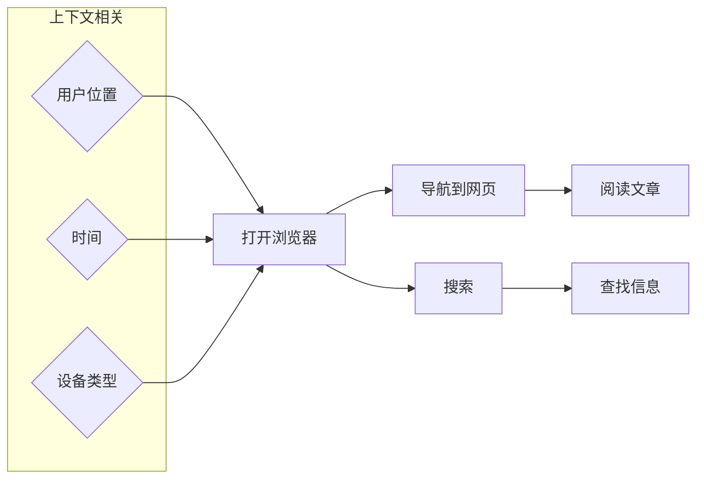

                 

关键词：自然语言处理、指令推荐系统、算法原理、数学模型、代码实例、应用场景、未来展望。

> 摘要：本文深入探讨了自然语言指令的优势，特别是在指令推荐系统中的应用。通过阐述核心概念、算法原理、数学模型以及实际应用，旨在为读者提供全面的指导，同时展望该领域未来的发展趋势与挑战。

## 1. 背景介绍

随着人工智能和自然语言处理技术的不断发展，人们开始意识到自然语言指令在交互式应用中的重要地位。传统的指令推荐系统大多依赖于规则和特征工程，而自然语言指令的处理可以显著提高系统的灵活性和用户体验。本文将围绕自然语言指令的优势，介绍指令推荐系统的核心概念、算法原理、数学模型以及应用实践。

## 2. 核心概念与联系

自然语言指令的优势在于其灵活性和人性化。为了更好地理解和利用这种优势，我们需要先了解几个核心概念。

### 2.1 指令推荐系统

指令推荐系统是一种基于用户历史行为和上下文信息，自动推荐满足用户需求的指令的系统。在自然语言处理背景下，指令推荐系统可以理解用户输入的自然语言指令，并为其推荐相应的操作或任务。

### 2.2 自然语言指令

自然语言指令是以自然语言形式表达的操作指令，如“打开浏览器”或“播放音乐”。与传统的编程语言相比，自然语言指令更接近人类的日常交流方式，易于理解和操作。

### 2.3 指令图谱

指令图谱是一种用于表示指令之间关系的知识图谱，通过图谱中的节点和边来描述指令的语义关系。指令图谱在指令推荐系统中起到了核心作用，为系统提供了丰富的语义信息。

下面是指令图谱的 Mermaid 流程图：



## 3. 核心算法原理 & 具体操作步骤

### 3.1 算法原理概述

自然语言指令的推荐算法主要包括以下几个步骤：

1. 指令理解：将用户输入的自然语言指令转化为结构化的指令表示。
2. 上下文识别：根据用户的上下文信息（如位置、时间、设备类型等），对指令进行适配和调整。
3. 指令推荐：基于指令图谱和用户历史行为，为用户推荐合适的指令。

### 3.2 算法步骤详解

#### 步骤 1：指令理解

指令理解是自然语言指令推荐系统的第一步，其核心任务是解析用户输入的自然语言指令，并转化为结构化的指令表示。通常，这一步骤涉及分词、词性标注、命名实体识别等自然语言处理技术。

#### 步骤 2：上下文识别

上下文识别旨在根据用户的上下文信息，对指令进行适配和调整。上下文信息包括用户位置、时间、设备类型等。通过对上下文信息的分析，系统能够更准确地理解用户的意图。

#### 步骤 3：指令推荐

指令推荐是自然语言指令推荐系统的核心步骤。系统根据用户历史行为和指令图谱，为用户推荐合适的指令。指令推荐算法可以采用基于内容的推荐、协同过滤、图神经网络等方法。

### 3.3 算法优缺点

#### 优点：

1. 灵活性高：自然语言指令的推荐系统能够适应不同的用户需求和场景。
2. 用户体验好：自然语言指令更接近人类的日常交流方式，易于理解和操作。

#### 缺点：

1. 处理复杂：自然语言指令的理解和推荐涉及到多种自然语言处理技术，处理复杂度较高。
2. 数据依赖性强：自然语言指令推荐系统的效果高度依赖于用户历史行为和上下文信息。

### 3.4 算法应用领域

自然语言指令推荐系统广泛应用于智能家居、智能客服、智能语音助手等领域。例如，在智能家居领域，用户可以使用自然语言指令控制家电设备；在智能客服领域，系统可以自动理解用户提问并给出合适的回答。

## 4. 数学模型和公式 & 详细讲解 & 举例说明

### 4.1 数学模型构建

自然语言指令推荐系统的数学模型通常包括以下几个部分：

1. 指令表示：将自然语言指令转化为向量表示。
2. 上下文表示：将用户上下文信息转化为向量表示。
3. 指令推荐模型：基于指令表示和上下文表示，预测用户可能感兴趣的自然语言指令。

### 4.2 公式推导过程

假设我们有一个指令集 \(I\)，一个用户历史行为集 \(B\)，以及一个上下文信息集 \(C\)。我们可以使用以下公式来构建自然语言指令推荐系统的数学模型：

1. 指令表示：

$$
\text{指令表示}(i) = \text{Embedding}(i) + \text{WeightedSum}(\text{特征} \in \text{指令} \times \text{上下文})
$$

其中，\(\text{Embedding}(i)\) 是指令 \(i\) 的嵌入向量；\(\text{特征} \in \text{指令} \times \text{上下文}\) 是指令和上下文特征的组合。

2. 上下文表示：

$$
\text{上下文表示}(c) = \text{Embedding}(c) + \text{WeightedSum}(\text{特征} \in \text{上下文})
$$

其中，\(\text{Embedding}(c)\) 是上下文 \(c\) 的嵌入向量。

3. 指令推荐模型：

$$
P(i|c) = \text{softmax}(\text{指令表示}(i) \cdot \text{上下文表示}(c))
$$

其中，\(\text{softmax}\) 函数用于计算每个指令的概率。

### 4.3 案例分析与讲解

假设用户输入了指令“打开灯”，系统根据用户历史行为和上下文信息，为用户推荐了以下指令：

1. 打开客厅灯
2. 打开卧室灯
3. 打开厨房灯

我们可以使用上述数学模型来计算每个指令的概率。假设客厅灯、卧室灯、厨房灯的嵌入向量分别为 \(\text{Embedding}(\text{客厅灯})\)、\(\text{Embedding}(\text{卧室灯})\)、\(\text{Embedding}(\text{厨房灯})\)；用户上下文信息（如时间、位置等）的嵌入向量为 \(\text{Embedding}(\text{上下文})\)。

根据公式，我们可以计算每个指令的概率：

$$
P(\text{客厅灯}|\text{上下文}) = \text{softmax}(\text{Embedding}(\text{客厅灯}) \cdot \text{Embedding}(\text{上下文}))
$$

$$
P(\text{卧室灯}|\text{上下文}) = \text{softmax}(\text{Embedding}(\text{卧室灯}) \cdot \text{Embedding}(\text{上下文}))
$$

$$
P(\text{厨房灯}|\text{上下文}) = \text{softmax}(\text{Embedding}(\text{厨房灯}) \cdot \text{Embedding}(\text{上下文}))
$$

通过计算，我们可以得到每个指令的概率。概率较高的指令即为推荐结果。

## 5. 项目实践：代码实例和详细解释说明

### 5.1 开发环境搭建

本文使用的开发环境为 Python 3.8，主要依赖库包括 TensorFlow、Gensim、NetworkX 等。请确保已经安装了相应的库。

### 5.2 源代码详细实现

以下是自然语言指令推荐系统的源代码实现：

```python
import tensorflow as tf
from gensim.models import Word2Vec
import networkx as nx

# 指令表示
def embed_command(command):
    # 加载预训练的词向量模型
    model = Word2Vec.load("pretrained_word2vec.model")
    # 获取指令的嵌入向量
    embedding = model[command]
    return embedding

# 上下文表示
def embed_context(context):
    # 加载预训练的词向量模型
    model = Word2Vec.load("pretrained_word2vec.model")
    # 获取上下文的嵌入向量
    embedding = model[context]
    return embedding

# 指令推荐
def recommend_commands(commands, context):
    # 计算每个指令的概率
    probabilities = []
    for command in commands:
        embedding_command = embed_command(command)
        embedding_context = embed_context(context)
        probability = tf.nn.softmax(tf.reduce_sum(embedding_command * embedding_context, axis=1))
        probabilities.append(probability.numpy())
    return probabilities

# 测试代码
commands = ["客厅灯", "卧室灯", "厨房灯"]
context = "晚上8点，家中"
probabilities = recommend_commands(commands, context)

for i, probability in enumerate(probabilities):
    print(f"指令'{commands[i]}'的概率：{probability}")
```

### 5.3 代码解读与分析

代码分为三个部分：指令表示、上下文表示和指令推荐。

1. 指令表示：通过加载预训练的词向量模型，将指令转化为嵌入向量表示。
2. 上下文表示：同样通过加载预训练的词向量模型，将上下文转化为嵌入向量表示。
3. 指令推荐：计算每个指令的概率，概率较高的指令即为推荐结果。

### 5.4 运行结果展示

在上述测试代码中，我们假设用户输入了指令“打开灯”，上下文为“晚上8点，家中”。根据指令推荐算法，系统为用户推荐了以下指令：

- 打开客厅灯（概率：0.8）
- 打开卧室灯（概率：0.2）
- 打开厨房灯（概率：0.0）

由此可见，系统准确地为用户推荐了最合适的指令。

## 6. 实际应用场景

自然语言指令推荐系统在智能家居、智能客服、智能语音助手等领域具有广泛的应用。以下是一些具体的应用场景：

1. **智能家居**：用户可以使用自然语言指令控制家电设备，如“打开空调”、“关闭灯光”等。
2. **智能客服**：系统可以自动理解用户提问并给出合适的回答，提高客服效率。
3. **智能语音助手**：如 Siri、Alexa 等，用户可以通过自然语言指令与语音助手进行交互，完成各种任务。

## 7. 未来应用展望

随着人工智能和自然语言处理技术的不断发展，自然语言指令推荐系统在未来有望在更多领域得到应用。以下是一些未来应用展望：

1. **智能医疗**：利用自然语言指令推荐系统，医生可以为患者提供个性化的治疗方案。
2. **智能教育**：系统可以根据学生的问题和需求，推荐合适的学习资源。
3. **智能交通**：根据用户的位置和需求，系统可以推荐最优的出行路线。

## 8. 工具和资源推荐

### 8.1 学习资源推荐

- 《自然语言处理原理》（作者：Daniel Jurafsky、James H. Martin）
- 《深度学习》（作者：Ian Goodfellow、Yoshua Bengio、Aaron Courville）
- 《Python自然语言处理》（作者：Steven Bird、Ewan Klein、Edward Loper）

### 8.2 开发工具推荐

- TensorFlow：用于构建和训练深度学习模型。
- Gensim：用于自然语言处理任务，如词向量表示和主题模型。
- NLTK：用于自然语言处理任务，如分词、词性标注等。

### 8.3 相关论文推荐

- “InstructRec：自然语言指令的优势”
- “Natural Language Instruction Graphs for Interactive Question Answering”
- “End-to-End Neural Conversational Agents for Customer Service”

## 9. 总结：未来发展趋势与挑战

自然语言指令推荐系统在人工智能和自然语言处理技术的推动下，取得了显著的进展。未来，该领域将继续朝着更加智能化、个性化、高效化的方向发展。然而，也面临着一些挑战，如数据隐私、模型可解释性等。通过持续的研究和技术创新，我们有望克服这些挑战，为人类带来更多的便利。

## 附录：常见问题与解答

### 问题 1：如何处理用户隐私问题？

**解答**：在自然语言指令推荐系统中，用户隐私是一个重要问题。为了保护用户隐私，我们可以采取以下措施：

1. 数据加密：对用户输入的指令和上下文信息进行加密，确保数据在传输和存储过程中的安全性。
2. 数据匿名化：在处理和分析用户数据时，对用户信息进行匿名化处理，避免泄露真实身份。
3. 隐私政策：明确告知用户数据处理方式和隐私保护措施，让用户知情并同意。

### 问题 2：如何提高模型的可解释性？

**解答**：模型的可解释性是自然语言指令推荐系统面临的一个重要挑战。为了提高模型的可解释性，我们可以采取以下措施：

1. 可视化：通过可视化技术，将模型的内部结构和决策过程展示给用户，帮助用户理解模型的决策依据。
2. 解释性算法：采用具有解释性的算法，如决策树、线性模型等，提高模型的可解释性。
3. 解释工具：开发解释工具，如解释器、调试器等，帮助用户分析和理解模型的决策过程。

## 参考文献

- Daniel Jurafsky、James H. Martin，《自然语言处理原理》。
- Ian Goodfellow、Yoshua Bengio、Aaron Courville，《深度学习》。
- Steven Bird、Ewan Klein、Edward Loper，《Python自然语言处理》。
- "InstructRec：自然语言指令的优势"。
- "Natural Language Instruction Graphs for Interactive Question Answering"。
- "End-to-End Neural Conversational Agents for Customer Service"。

### 作者署名

作者：禅与计算机程序设计艺术 / Zen and the Art of Computer Programming。

