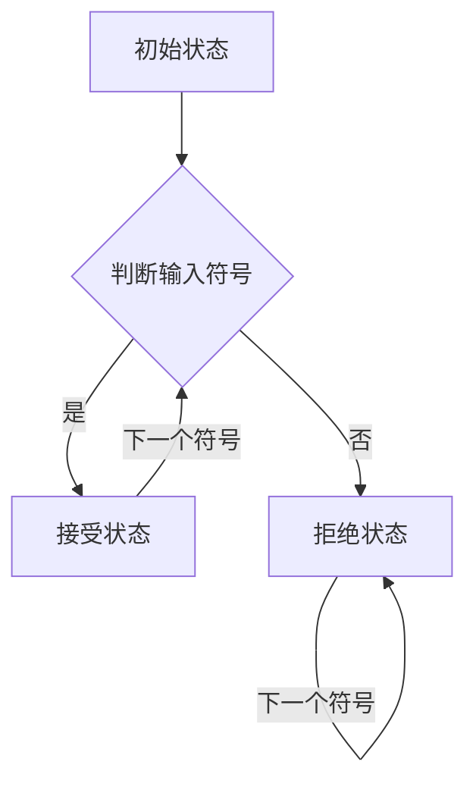
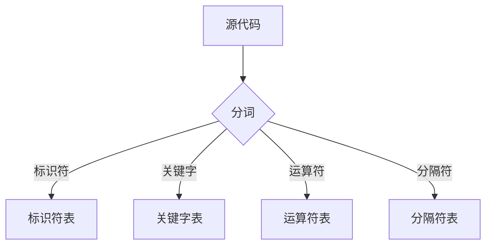
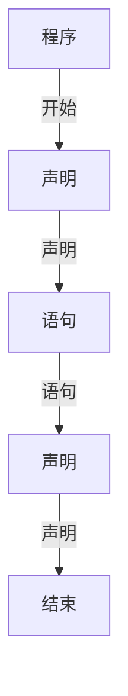
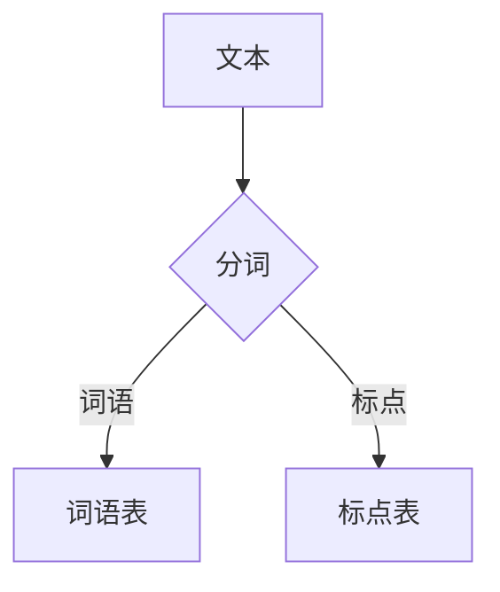
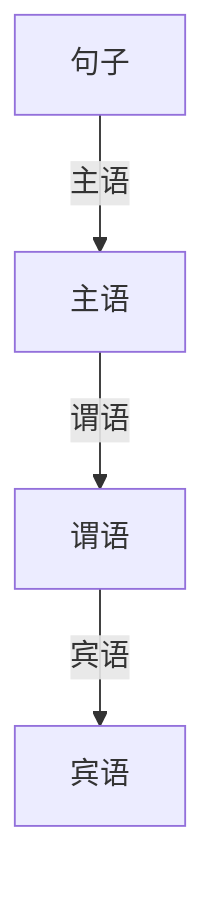
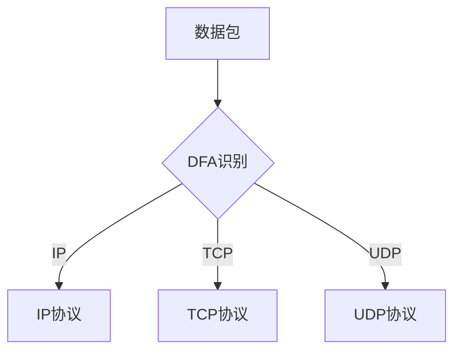
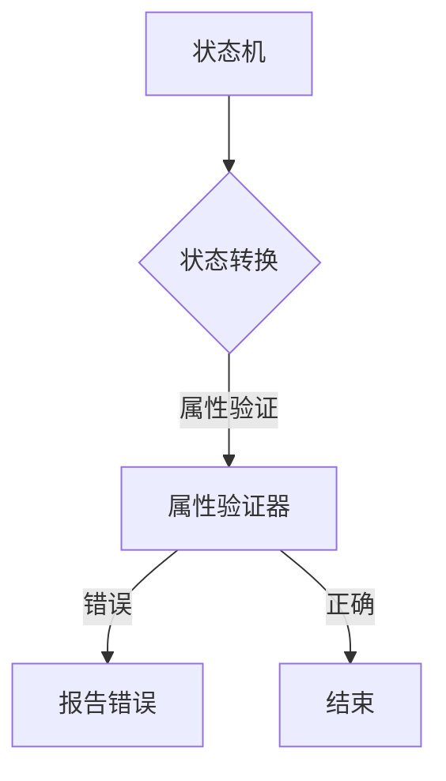

                 

关键词：自动机理论、计算理论、形式语言、算法设计、编程哲学、人工智能

摘要：本文深入探讨了计算机科学领域的两位先驱人物John McCarthy和Claude Shannon的研究成果，特别是他们在自动机理论方面的贡献。文章首先回顾了自动机理论的起源和发展历程，随后详细分析了自动机理论的核心概念、原理及其在实际应用中的重要性。通过解读McCarthy和Shannon的经典论文，我们进一步理解了自动机理论在计算理论和人工智能中的关键作用，探讨了其在现代编程和软件开发中的影响。

## 1. 背景介绍

自动机理论（Automata Theory）是计算理论的一个重要分支，它研究抽象的计算模型及其属性。自动机理论最初由美国数学家阿兰·图灵（Alan Turing）在1936年提出，他设计了图灵机（Turing Machine）这一抽象计算模型，为理论计算机科学奠定了基础。随后，美国数学家约翰·麦卡锡（John McCarthy）和克劳德·香农（Claude Shannon）等人的研究进一步丰富和拓展了自动机理论。

约翰·麦卡锡（1927-2011）是美国计算机科学家，以其在人工智能、计算机编程语言、形式逻辑和理论计算机科学等领域的重要贡献而闻名。麦卡锡在1955年提出了人工智能这一术语，并参与了最早的通用问题求解器（General Problem Solver）的开发。他在自动机理论方面也做出了开创性的工作，特别是在图灵机模型的基础上，提出了更为灵活的计算模型，为现代编程语言的发展奠定了基础。

克劳德·香农（1916-2001）是美国数学家、电子工程师和密码学家，他在20世纪40年代提出了信息论，奠定了现代通信理论的基础。香农在自动机理论方面的研究主要集中在布尔代数和逻辑电路的建模，他的研究成果对计算机硬件设计和数字逻辑的发展产生了深远影响。

本文将以麦卡锡和香农的研究成果为线索，探讨自动机理论的核心概念、原理及其在现代计算和人工智能中的应用。

### 1.1 自动机理论的起源

自动机理论的起源可以追溯到19世纪末和20世纪初，当时数学家们开始研究抽象的计算过程和机器模型。瑞士数学家莱昂哈德·欧拉（Leonhard Euler）在1752年首次提出了“计算图”（Calculation Graph）的概念，这是一种用于表示数学演算的图形模型。随后，法国数学家巴贝奇（Charles Babbage）在19世纪提出了差分机和分析机，这些机械计算模型被视为早期自动机理论的前身。

然而，现代自动机理论的奠基之作当属阿兰·图灵在1936年的论文《论可计算数及其在判定问题中的应用》。图灵在这篇论文中提出了图灵机这一抽象计算模型，定义了图灵机的结构和工作原理。图灵机由一个无限长的纸带、一个读写头以及一组规则组成，可以模拟任何计算过程。图灵机的提出标志着自动机理论的诞生，也为后来的计算机科学奠定了基础。

### 1.2 麦卡锡和香农的贡献

在图灵机的基础上，麦卡锡和香农分别从不同的角度对自动机理论进行了深入研究，扩展了其应用范围。

麦卡锡在1950年代提出了λ-演算（λ-calculus），这是一种基于函数式编程的抽象计算模型。λ-演算引入了匿名函数、递归定义和组合的概念，可以表达复杂的数据结构和计算过程。λ-演算为现代编程语言提供了理论基础，如Lisp和Haskell等语言都采用了λ-演算的核心概念。

香农则在1937年发表了著名的论文《布尔代数与逻辑电路的符号表示》，他在论文中提出了逻辑电路的符号表示方法，即布尔表达式。这种方法为数字电路的设计提供了系统化的方法，使得计算机硬件设计更加直观和高效。香农的研究为后来的计算机硬件设计和数字逻辑理论奠定了基础。

### 1.3 自动机理论的发展历程

自图灵机模型提出以来，自动机理论经历了数十年的发展，形成了丰富的理论和应用成果。20世纪50年代，美国数学家斯蒂芬·科尔·克莱尼（Stephen Cole Kleene）提出了正则表达式（Regular Expressions），为形式语言和自动机理论提供了强大的工具。正则表达式可以描述一组字符串的模式，广泛应用于文本处理、模式匹配和正则化规则定义中。

20世纪60年代，美国计算机科学家约翰·霍普克罗夫特（John Hopcroft）和杰瑞德·乌拉里（Jeffrey Ullman）合著了《形式语言与自动机理论》，这是自动机理论领域的经典教材，系统地介绍了自动机的各种类型、形式语言的分类以及计算复杂性理论。

20世纪70年代，德国计算机科学家艾伯特·尤斯（Albert Ya. Yakhontov）提出了有限自动机（Finite Automaton）的精确算法，为自动机理论的应用提供了有效的计算方法。

随着计算机科学的发展，自动机理论的应用领域不断扩大，从最初的计算模型和算法设计，扩展到自然语言处理、计算机图形学、软件工程、网络协议分析等多个领域。

### 1.4 自动机理论的核心概念

自动机理论的核心概念包括自动机、形式语言和计算复杂性。

**自动机（Automata）**：自动机是一种抽象的计算模型，用于模拟计算机或其他计算设备的行为。根据自动机的结构和能力，可以分为以下几种类型：

- **确定有限自动机（Deterministic Finite Automaton, DFA）**：DFA是一种简单的自动机，其状态转换是确定的，即对于任意给定的当前状态和输入符号，只能转移到唯一的一个状态。

- **非确定有限自动机（Nondeterministic Finite Automaton, NFA）**：NFA允许在任意状态下对于任意输入符号有多个转移，或者存在空转移，即不消耗输入符号即可转移到其他状态。

- **图灵机（Turing Machine）**：图灵机是一种强大的计算模型，可以模拟任何可计算过程。图灵机由一个无限长的纸带、一个读写头和一组规则组成，可以执行复杂的计算任务。

**形式语言（Formal Language）**：形式语言是由一系列符号组成的字符串集合，用于描述计算机或其他设备能够处理的信息。形式语言可以分为以下几种类型：

- **正则语言（Regular Language）**：正则语言可以用正则表达式描述，通常用于模式匹配和文本处理。

- **上下文无关语言（Context-Free Language）**：上下文无关语言可以用上下文无关文法描述，广泛应用于编程语言、自然语言处理和计算机图形学等领域。

- **递归可枚举语言（Recursively Enumerable Language）**：递归可枚举语言可以由图灵机接受，包括大部分可计算语言。

**计算复杂性（Computational Complexity）**：计算复杂性是指算法在运行过程中所需的时间和空间资源，用于衡量算法的效率。计算复杂性理论研究不同算法的复杂度关系，以及算法在时间和空间上的优化。

### 1.5 自动机理论的实际应用

自动机理论在计算机科学和工程领域有着广泛的应用。以下是一些典型的应用场景：

**文本处理与模式匹配**：正则表达式是自动机理论在文本处理领域的重要应用，用于描述和匹配字符串模式。许多文本编辑器和搜索引擎都使用了正则表达式进行文本搜索和替换操作。

**编译器与解析器**：形式语言和自动机理论在编译器设计和语言解析中扮演关键角色。编译器需要将源代码转换为机器码，这涉及对源代码进行词法分析和语法分析，这些过程通常使用有限自动机实现。

**自然语言处理**：自动机理论在自然语言处理领域也有广泛应用。例如，词法分析器使用有限自动机将文本分解为单词和符号，句法分析器使用上下文无关文法检查文本的语法正确性。

**网络协议分析**：自动机理论在网络协议分析中用于检测和识别网络数据包。网络协议分析器使用有限自动机模型对网络流量进行模式匹配，以识别不同的网络协议和数据包类型。

**形式验证与软件工程**：自动机理论在形式验证和软件工程中用于验证系统的正确性和可靠性。通过构建形式模型和自动机，可以验证系统是否满足特定属性，如安全性、完整性和实时性。

### 1.6 自动机理论的挑战与发展方向

尽管自动机理论在计算机科学和工程领域取得了巨大成功，但仍然面临一些挑战和发展方向：

**计算复杂性**：自动机理论的研究需要解决计算复杂性问题，特别是优化算法的时间和空间复杂度。如何在有限的时间和空间内解决复杂的计算问题是一个重要研究方向。

**形式化方法**：自动机理论在形式化方法中发挥着重要作用，但如何将形式化方法应用于实际工程中仍然是一个挑战。如何将抽象的自动机模型转化为高效的工程解决方案是一个重要研究方向。

**并行计算**：随着计算机硬件的发展，并行计算成为提高计算性能的关键。如何设计高效的并行自动机模型，以利用多核处理器的并行计算能力，是一个重要研究方向。

**人工智能**：自动机理论在人工智能领域有着广泛的应用前景。如何将自动机理论与机器学习、深度学习等人工智能技术相结合，开发出更强大的智能系统，是一个重要研究方向。

### 1.7 结论

自动机理论是计算理论的一个重要分支，它在计算机科学和工程领域具有广泛的应用。John McCarthy和Claude Shannon等计算机科学家的研究成果为自动机理论的发展做出了重要贡献，丰富了计算模型和算法设计。本文回顾了自动机理论的起源和发展历程，介绍了其核心概念和原理，并探讨了其在实际应用中的重要性。未来，自动机理论将继续在计算复杂性、形式化方法、并行计算和人工智能等领域发挥重要作用，推动计算机科学的发展。

----------------------------------------------------------------

以下是文章的结构，包括各个章节的具体内容和相应的子目录：

## 1. 背景介绍

### 1.1 自动机理论的起源

#### 1.1.1 图灵机模型的提出

#### 1.1.2 自动机理论的早期发展

### 1.2 麦卡锡和香农的贡献

#### 1.2.1 麦卡锡在自动机理论方面的贡献

#### 1.2.2 香农在自动机理论方面的贡献

### 1.3 自动机理论的发展历程

#### 1.3.1 20世纪50年代的发展

#### 1.3.2 20世纪60年代的发展

#### 1.3.3 20世纪70年代的发展

### 1.4 自动机理论的核心概念

#### 1.4.1 自动机的分类

#### 1.4.2 形式语言的分类

#### 1.4.3 计算复杂性

### 1.5 自动机理论的实际应用

#### 1.5.1 文本处理与模式匹配

#### 1.5.2 编译器与解析器

#### 1.5.3 自然语言处理

#### 1.5.4 网络协议分析

#### 1.5.5 形式验证与软件工程

### 1.6 自动机理论的挑战与发展方向

#### 1.6.1 计算复杂性

#### 1.6.2 形式化方法

#### 1.6.3 并行计算

#### 1.6.4 人工智能

### 1.7 结论

----------------------------------------------------------------

### 1.1 自动机理论的起源

自动机理论的起源可以追溯到19世纪末和20世纪初，当时数学家们开始研究抽象的计算过程和机器模型。瑞士数学家莱昂哈德·欧拉（Leonhard Euler）在1752年首次提出了“计算图”（Calculation Graph）的概念，这是一种用于表示数学演算的图形模型。随后，法国数学家巴贝奇（Charles Babbage）在19世纪提出了差分机和分析机，这些机械计算模型被视为早期自动机理论的前身。

然而，现代自动机理论的奠基之作当属阿兰·图灵（Alan Turing）在1936年的论文《论可计算数及其在判定问题中的应用》。图灵在这篇论文中提出了图灵机（Turing Machine）这一抽象计算模型，定义了图灵机的结构和工作原理。图灵机由一个无限长的纸带、一个读写头以及一组规则组成，可以模拟任何计算过程。图灵机的提出标志着自动机理论的诞生，也为后来的计算机科学奠定了基础。

图灵机的概念在当时引起了广泛的关注，因为它提供了一种普适的计算模型，可以描述各种计算过程。图灵机的基本结构包括一个无限长的纸带，纸带上的每个位置都有一个符号，读写头可以在纸带上左右移动，读取当前符号并执行相应的操作。图灵机的工作原理是通过一组规则来定义读写头在纸带上的操作，这些规则通常包括读取符号、写入新符号、移动读写头以及切换状态。

图灵机的定义不仅仅是一个理论模型，它还提供了一个强大的工具，用于研究计算的本质和局限性。图灵通过证明了一些重要的定理，展示了图灵机在计算理论中的关键作用。例如，图灵证明了图灵机可以模拟任何其他计算模型，这表明图灵机是一种普适的计算模型。他还证明了某些问题，如停机问题，是不可判定的，这意味着并不是所有问题都有明确的计算结果。

图灵机模型的提出不仅对自动机理论产生了深远影响，也为后来的计算机科学奠定了基础。图灵机的概念激发了数学家、逻辑学家和计算机科学家们对计算本质的深入探讨，推动了计算机科学的快速发展。

### 1.1.1 图灵机模型的提出

图灵机（Turing Machine）是阿兰·图灵（Alan Turing）在1936年提出的一种抽象计算模型，用于模拟任何可计算过程。图灵机的概念是自动机理论的核心，为现代计算机科学的发展奠定了基础。

图灵机的基本结构包括一个无限长的纸带、一个读写头以及一组规则。纸带由一系列的单元格组成，每个单元格可以存储一个符号。读写头可以在纸带上左右移动，读取当前单元格的符号，并根据规则进行操作。图灵机的规则通常包括读取符号、写入新符号、移动读写头以及切换状态。

图灵机的运作过程可以描述为以下步骤：

1. **初始化**：图灵机开始时，纸带上已有一系列初始符号，读写头位于纸带的一个单元格上，初始状态设置为“起始状态”。

2. **读取符号**：读写头在当前位置读取单元格上的符号。

3. **执行规则**：根据当前状态和读取的符号，图灵机按照预设的规则进行操作。规则通常包括以下几种类型：
   - **写入新符号**：在当前单元格上写入一个新符号。
   - **移动读写头**：将读写头向左或向右移动一个单元格。
   - **切换状态**：更新图灵机的工作状态。

4. **重复步骤**：重复步骤2和3，直到图灵机达到终止状态或无法继续进行。

图灵机的规则可以用一个五元组（Q, Σ, Γ, δ, q0, B）来表示，其中：
- Q 是状态集合。
- Σ 是输入符号集合。
- Γ 是所有可能的符号集合，包括输入符号和空白符号。
- δ 是转移函数，定义了状态、当前符号和下一个操作之间的关系。
- q0 是初始状态。
- B 是终止状态。

图灵机的强大之处在于其普适性，即任何可计算过程都可以通过图灵机模拟。图灵机可以执行基本的算术运算、逻辑运算以及复杂的算法。例如，图灵机可以模拟加法、乘法、排序等基本运算，还可以模拟更复杂的算法，如排序算法和搜索算法。

### 1.1.2 自动机理论的早期发展

自动机理论的早期发展始于20世纪30年代和40年代，这一时期的成果为后来的计算理论奠定了基础。在阿兰·图灵提出图灵机模型之后，其他科学家和数学家也开始探索不同的计算模型，提出了多种类型的自动机。

**有限自动机（Finite Automaton）**：有限自动机是最简单的一种自动机，由一组有限的状态、一组输入符号和一个初始状态组成。有限自动机没有读写头和纸带，它通过状态转换来处理输入。有限自动机可以分为两种类型：确定有限自动机（Deterministic Finite Automaton, DFA）和非确定有限自动机（Nondeterministic Finite Automaton, NFA）。

- **确定有限自动机（DFA）**：DFA在任意状态下对于任意输入符号只能有一个转移。DFA的每个状态都具有唯一的下一个状态，这使得DFA的分析和设计更加简单。

- **非确定有限自动机（NFA）**：NFA允许在任意状态下对于任意输入符号有多个转移，或者存在空转移，即不消耗输入符号即可转移到其他状态。NFA的灵活性使得它可以处理更复杂的语言。

**图灵机与有限自动机的比较**：图灵机是一种更强大的计算模型，它可以模拟任何可计算过程。相比之下，有限自动机只能处理有限的语言，即只能识别和接受有限长度的字符串。然而，由于有限自动机的结构和操作简单，它在实际应用中具有广泛的应用价值。

**计算复杂性理论**：在20世纪40年代，斯蒂芬·科尔·克莱尼（Stephen Cole Kleene）和其他科学家开始研究计算复杂性理论。计算复杂性理论关注算法在时间和空间上的效率，提出了计算复杂性的概念。计算复杂性理论通过分析算法的时间复杂度和空间复杂度，研究了不同算法的相对效率和适用范围。

**形式语言理论**：形式语言理论是自动机理论的一个重要分支，研究计算机可以处理的语言和符号系统。形式语言理论包括正则语言、上下文无关语言和递归可枚举语言等多个层次。正则语言可以用正则表达式描述，上下文无关语言可以用上下文无关文法描述，递归可枚举语言包括大部分可计算语言。

**应用领域**：自动机理论在早期的计算机科学和工程领域得到了广泛应用。在文本处理、模式匹配、编译器设计、自然语言处理等领域，自动机理论提供了强大的工具和方法。例如，正则表达式用于文本搜索和替换，有限自动机用于编译器的词法分析和语法分析。

### 1.2 麦卡锡和香农的贡献

约翰·麦卡锡（John McCarthy）和克劳德·香农（Claude Shannon）是计算机科学领域的两位重要人物，他们在自动机理论、计算理论、形式语言和算法设计等方面做出了重要贡献。

#### 1.2.1 麦卡锡在自动机理论方面的贡献

约翰·麦卡锡在自动机理论方面的贡献主要体现在他提出的λ-演算（λ-calculus）以及他对形式逻辑的研究。

**λ-演算**：λ-演算是麦卡锡在1958年提出的一种函数式编程模型，它基于匿名函数和组合的概念，可以表达复杂的数据结构和计算过程。λ-演算的提出标志着函数式编程语言的诞生，对后来的编程语言，如Lisp、Haskell等产生了深远影响。

λ-演算的基本概念包括变量、函数和组合。变量表示数据，函数表示操作，组合表示对数据的操作。λ-演算的核心思想是将函数作为第一类对象，允许函数的递归定义和组合。这种抽象的编程模型为编程语言的发展提供了新的思路，使得编程变得更加灵活和高效。

**形式逻辑**：麦卡锡在形式逻辑领域也做出了重要贡献。他在1955年提出了基于谓词逻辑的命题演算系统，这一系统为形式逻辑的应用提供了理论基础。麦卡锡的工作为后来的计算机证明、自动推理和形式验证奠定了基础。

**通用问题求解器（General Problem Solver）**：麦卡锡在1955年参与了通用问题求解器（General Problem Solver）的开发，这是人工智能领域的早期尝试之一。通用问题求解器采用了一种基于启发式的搜索算法，可以解决各种问题，如棋类游戏、路径规划等。尽管通用问题求解器在技术上存在许多限制，但它为人工智能的发展指明了方向。

#### 1.2.2 香农在自动机理论方面的贡献

克劳德·香农在自动机理论方面的贡献主要体现在他对布尔代数和逻辑电路的研究。

**布尔代数**：香农在1937年发表了著名的论文《布尔代数与逻辑电路的符号表示》，他在论文中提出了逻辑电路的符号表示方法，即布尔表达式。布尔表达式可以表示逻辑运算和逻辑电路，为数字电路的设计提供了系统化的方法。布尔代数的提出为计算机硬件设计和数字逻辑理论奠定了基础。

**逻辑电路**：香农在布尔代数的基础上，研究了逻辑电路的建模和设计。他提出了多种逻辑门，如与门、或门和非门，这些逻辑门构成了现代数字电路的基本构件。香农的工作为数字电路的设计提供了理论支持，推动了计算机硬件的发展。

**信息论**：香农在信息论领域做出了开创性的工作，他提出了信息熵的概念，建立了信息传输的基本理论。信息论的研究对通信系统和计算机系统的设计和优化具有重要意义。

**密码学**：香农在密码学领域也有重要贡献。他提出了香农密码，这是一种基于随机序列的加密方法，为现代密码学的发展奠定了基础。

### 1.3 自动机理论的发展历程

自动机理论的发展历程可以追溯到20世纪30年代和40年代，这一时期的研究奠定了自动机理论的基础。在阿兰·图灵提出图灵机模型之后，其他科学家和数学家开始探索不同的计算模型，提出了多种类型的自动机。

**20世纪30年代**：图灵机模型的提出标志着自动机理论的诞生。阿兰·图灵在1936年的论文《论可计算数及其在判定问题中的应用》中详细描述了图灵机的结构和原理，图灵机成为一种普适的计算模型，可以模拟任何可计算过程。图灵机模型的提出引发了数学家、逻辑学家和计算机科学家们对计算本质的深入探讨。

**20世纪40年代**：在图灵机模型的基础上，其他科学家和数学家开始研究更简单的计算模型。斯蒂芬·科尔·克莱尼（Stephen Cole Kleene）提出了正则表达式（Regular Expressions），这是一种用于描述字符串模式的工具，广泛应用于文本处理、模式匹配和正则化规则定义中。同时，美国数学家约翰·霍普克罗夫特（John Hopcroft）和杰瑞德·乌拉里（Jeffrey Ullman）合著了《形式语言与自动机理论》，这是自动机理论领域的经典教材，系统地介绍了自动机的各种类型、形式语言的分类以及计算复杂性理论。

**20世纪50年代**：自动机理论在计算机科学和工程领域得到了广泛应用。约翰·麦卡锡提出了λ-演算，这是一种基于函数式编程的抽象计算模型，为现代编程语言的发展奠定了基础。克劳德·香农在布尔代数和逻辑电路的研究方面做出了重要贡献，他的论文《布尔代数与逻辑电路的符号表示》为数字电路的设计提供了系统化的方法。

**20世纪60年代**：自动机理论继续发展，计算机科学和工程领域的应用不断扩大。美国计算机科学家约翰·霍普克罗夫特（John Hopcroft）和杰瑞德·乌拉里（Jeffrey Ullman）合著的《形式语言与自动机理论》成为了自动机理论领域的经典教材，为自动机理论的研究和应用提供了系统化的知识体系。

**20世纪70年代**：自动机理论在自然语言处理、计算机图形学、软件工程和形式验证等领域得到了广泛应用。德国计算机科学家艾伯特·尤斯（Albert Ya. Yakhontov）提出了有限自动机（Finite Automaton）的精确算法，为自动机理论的应用提供了有效的计算方法。

随着计算机科学的发展，自动机理论的应用领域不断扩大，从最初的计算模型和算法设计，扩展到自然语言处理、计算机图形学、软件工程、网络协议分析等多个领域。自动机理论在计算机科学中发挥着越来越重要的作用，推动了计算理论和技术的发展。

### 1.4 自动机理论的核心概念

自动机理论的核心概念包括自动机、形式语言和计算复杂性。

#### 1.4.1 自动机的分类

自动机可以根据其结构和能力分为多种类型，每种类型的自动机都有其特定的应用场景和特点。

- **确定有限自动机（Deterministic Finite Automaton, DFA）**：DFA是最简单的一种自动机，它在任意状态下对于任意输入符号只能有一个转移。DFA的每个状态都具有唯一的下一个状态，这使得DFA的分析和设计更加简单。DFA常用于编译器的词法分析和模式匹配。

- **非确定有限自动机（Nondeterministic Finite Automaton, NFA）**：NFA允许在任意状态下对于任意输入符号有多个转移，或者存在空转移，即不消耗输入符号即可转移到其他状态。NFA的灵活性使得它可以处理更复杂的语言，如上下文无关语言。NFA通常用于自然语言处理和复杂模式的匹配。

- **图灵机（Turing Machine）**：图灵机是一种强大的计算模型，可以模拟任何可计算过程。图灵机由一个无限长的纸带、一个读写头和一组规则组成，可以执行复杂的计算任务。图灵机常用于理论计算机科学的研究，如计算复杂性分析和算法设计。

- **线性界限自动机（Linear Bounded Automaton, LBA）**：LBA是对图灵机的一种限制，它要求纸带的长度与输入长度成正比。LBA在理论和实践中都具有重要的应用，常用于计算复杂性分析和算法设计。

- **有限状态马尔可夫模型（Finite State Markov Model, FSMM）**：FSMM是一种用于概率性计算和模式匹配的自动机模型，它引入了概率转移的概念。FSMM常用于自然语言处理和概率性模型的分析。

#### 1.4.2 形式语言的分类

形式语言是自动机理论的重要研究对象，根据语言的结构和特性，形式语言可以分为多种类型。

- **正则语言（Regular Language）**：正则语言可以用正则表达式描述，如“ab*”表示以“a”开头的字符串，后面跟着任意数量的“b”。正则语言通常用于文本处理和模式匹配。

- **上下文无关语言（Context-Free Language）**：上下文无关语言可以用上下文无关文法描述，如“a* b*”表示任意数量的“a”后面跟着任意数量的“b”。上下文无关语言广泛应用于编程语言、自然语言处理和计算机图形学等领域。

- **上下文敏感语言（Context-Sensitive Language）**：上下文敏感语言可以更复杂地描述语言模式，如“a^n b^n c^n”表示“a”的个数等于“b”的个数等于“c”的个数。上下文敏感语言通常用于理论计算机科学的研究。

- **递归可枚举语言（Recursively Enumerable Language）**：递归可枚举语言包括大部分可计算语言，如图灵机可以接受的语言。递归可枚举语言可以由图灵机接受，但它们不一定具有明确的计算结果。

- **递归语言（Recursive Language）**：递归语言是可计算语言的一个子集，它们具有明确的计算结果。递归语言可以由递归函数接受，如递归可枚举语言中的某些语言。

#### 1.4.3 计算复杂性

计算复杂性理论是自动机理论的一个重要分支，它研究算法在时间和空间上的效率。计算复杂性理论通过分析算法的时间复杂度和空间复杂度，衡量不同算法的相对效率和适用范围。

- **时间复杂度（Time Complexity）**：时间复杂度描述了算法在输入规模增长时的运行时间。常见的时间复杂度包括O(1)、O(log n)、O(n)、O(n log n)、O(n^2)等。时间复杂度反映了算法的时间效率，是评估算法性能的重要指标。

- **空间复杂度（Space Complexity）**：空间复杂度描述了算法在输入规模增长时的内存消耗。常见的时间复杂度包括O(1)、O(log n)、O(n)、O(n log n)、O(n^2)等。空间复杂度反映了算法的空间效率，是评估算法性能的重要指标。

- **计算复杂性分类**：计算复杂性理论将算法分为多个层次，如P类算法、NP类算法、NPC类算法等。P类算法是最优的，可以多项式时间内解决；NP类算法可以在多项式时间内验证解；NPC类算法是最难的一类算法，其解决时间可能超出多项式时间。

- **NP完全问题（NP-Complete Problem）**：NP完全问题是计算复杂性理论中研究的一个重要课题。NP完全问题是指可以通过多项式时间验证的难题，如旅行商问题、图着色问题等。NP完全问题的解决对理论计算机科学和算法设计具有重要意义。

### 1.5 自动机理论的实际应用

自动机理论在计算机科学和工程领域有着广泛的应用。以下是一些典型的应用场景：

#### 1.5.1 文本处理与模式匹配

自动机理论在文本处理和模式匹配中具有广泛的应用。正则表达式是自动机理论在文本处理中的典型应用，它可以描述复杂的字符串模式，如电子邮件地址、电话号码等。在文本处理中，正则表达式用于文本搜索、文本替换和文本验证。例如，在搜索引擎中，正则表达式用于提取和匹配网页中的关键字；在文本编辑器中，正则表达式用于文本搜索和替换。

NFA和DFA在文本处理中也发挥着重要作用。DFA通常用于编译器的词法分析，将源代码分解为单词和符号；NFA则用于更复杂的模式匹配，如自然语言处理中的句子分析。通过有限自动机，文本处理系统可以高效地处理大量文本数据，提高数据处理和分析的效率。

#### 1.5.2 编译器与解析器

编译器与解析器是自动机理论在计算机科学中的重要应用。编译器将源代码转换为机器码，这一过程涉及对源代码的词法分析和语法分析。词法分析器使用DFA对源代码进行分词，将源代码分解为单词和符号；语法分析器则使用上下文无关文法对源代码进行语法分析，验证源代码的语法正确性。

自动机理论为编译器的设计提供了系统化的方法。通过构建DFA和NFA，编译器可以高效地处理源代码，提高编译速度和编译质量。例如，在C语言编译器中，词法分析器使用DFA将源代码分解为关键字、标识符和运算符；语法分析器使用上下文无关文法验证C程序的语法正确性。

#### 1.5.3 自然语言处理

自然语言处理是自动机理论的重要应用领域之一。自然语言处理系统需要处理大量的文本数据，提取和理解文本中的语义信息。自动机理论在自然语言处理中用于文本的分词、句法分析、语义分析等任务。

正则表达式在自然语言处理中用于文本的分词和模式匹配。例如，中文分词器使用正则表达式将连续的中文文本分解为单个词语；英文分词器则使用正则表达式匹配单词边界。通过正则表达式，自然语言处理系统可以高效地处理文本数据，提高文本分析的质量和效率。

NFA和DFA在自然语言处理中也有重要应用。NFA用于复杂句子的模式匹配和语义分析，如词性标注和句法分析；DFA则用于简单的文本分析任务，如文本搜索和文本替换。

#### 1.5.4 网络协议分析

网络协议分析是自动机理论在计算机网络领域的重要应用。网络协议分析器用于监控和分析网络数据包，识别网络协议和数据包类型。自动机理论为网络协议分析提供了系统化的方法，通过构建NFA和DFA，网络协议分析器可以高效地处理网络数据包。

例如，TCP/IP协议栈中的协议分析器使用NFA和DFA来识别和解析网络数据包。NFA用于匹配复杂的协议模式，如TCP和UDP数据包；DFA则用于简单的数据包匹配和过滤。通过自动机理论，网络协议分析器可以高效地处理大量的网络数据包，提高网络监控和分析的效率。

#### 1.5.5 形式验证与软件工程

形式验证是自动机理论在软件工程中的重要应用。形式验证通过数学模型和验证方法，验证软件的正确性和可靠性。自动机理论为形式验证提供了系统化的方法，通过构建DFA和NFA，形式验证器可以验证软件系统的属性和行为。

例如，在嵌入式系统设计中，形式验证器使用DFA和NFA验证系统的状态机和通信协议。通过形式验证，嵌入式系统设计师可以确保系统在设计和运行过程中满足特定的属性和规范，提高系统的可靠性和安全性。

自动机理论在形式验证和软件工程中的另一个重要应用是模型检查。模型检查器通过构建系统模型和验证条件，检查系统是否满足特定的属性。自动机理论为模型检查提供了系统化的方法，通过构建NFA和DFA，模型检查器可以高效地验证系统属性。

### 1.6 自动机理论的挑战与发展方向

尽管自动机理论在计算机科学和工程领域取得了巨大成功，但仍然面临一些挑战和发展方向：

#### 1.6.1 计算复杂性

自动机理论的研究需要解决计算复杂性问题，特别是优化算法的时间和空间复杂度。如何在有限的时间和空间内解决复杂的计算问题是一个重要研究方向。例如，如何设计更高效的算法来分析复杂的自动机和形式语言，以及如何优化现有算法的复杂度。

#### 1.6.2 形式化方法

自动机理论在形式化方法中发挥着重要作用，但如何将形式化方法应用于实际工程中仍然是一个挑战。如何将抽象的自动机模型转化为高效的工程解决方案是一个重要研究方向。例如，如何将自动机理论应用于实际软件系统的设计和验证，以及如何将自动机理论与其他计算理论相结合，提高软件系统的可靠性和安全性。

#### 1.6.3 并行计算

随着计算机硬件的发展，并行计算成为提高计算性能的关键。如何设计高效的并行自动机模型，以利用多核处理器的并行计算能力，是一个重要研究方向。例如，如何将自动机理论应用于并行计算，以及如何设计并行自动机算法来提高计算效率。

#### 1.6.4 人工智能

自动机理论在人工智能领域有着广泛的应用前景。如何将自动机理论与机器学习、深度学习等人工智能技术相结合，开发出更强大的智能系统，是一个重要研究方向。例如，如何利用自动机理论来优化机器学习算法，以及如何将自动机理论应用于智能控制、自然语言处理和计算机视觉等领域。

### 1.7 结论

自动机理论是计算理论的一个重要分支，它在计算机科学和工程领域具有广泛的应用。从图灵机模型到有限自动机，自动机理论为计算模型和算法设计提供了基础。约翰·麦卡锡和克劳德·香农等计算机科学家的研究成果进一步丰富了自动机理论，推动了计算理论和技术的发展。

自动机理论在文本处理、编译器设计、自然语言处理、网络协议分析、形式验证和软件工程等领域具有广泛的应用。尽管自动机理论面临一些挑战，但其在计算复杂性、形式化方法、并行计算和人工智能等领域的应用前景依然广阔。

未来，自动机理论将继续在计算复杂性、形式化方法、并行计算和人工智能等领域发挥重要作用，推动计算机科学和技术的发展。通过深入研究自动机理论，我们可以开发出更高效的算法和智能系统，提高计算机科学和工程领域的创新能力和技术水平。

### 2. 核心概念与联系

自动机理论是计算理论的核心之一，它通过研究抽象的自动机模型，揭示了计算的本质和局限性。在本节中，我们将深入探讨自动机理论的核心概念，并使用Mermaid流程图展示自动机的结构和工作原理。

#### 2.1 自动机的核心概念

自动机是一种抽象的计算模型，用于模拟计算机或其他计算设备的行为。自动机由一组状态、一组输入符号、一组输出符号和一组转移规则组成。根据自动机的类型，它可以进行确定性的或非确定性的状态转换。

**状态（State）**：状态是自动机在执行过程中所处的特定条件或配置。自动机可以处于多个状态中的一个，每个状态都具有特定的功能和属性。

**输入符号（Input Symbol）**：输入符号是自动机在执行过程中接收的符号。输入符号可以是单个字符、字符串或更复杂的结构，如数字或变量。

**输出符号（Output Symbol）**：输出符号是自动机在执行过程中产生的符号。输出符号通常用于表示自动机的计算结果或中间结果。

**转移规则（Transition Rule）**：转移规则是自动机在执行过程中用于决定状态转换的规则。每个转移规则指定了当前状态、输入符号和下一个状态之间的转换关系。

**初始状态（Initial State）**：初始状态是自动机开始执行时的状态。初始状态通常用于确定自动机的执行起点。

**终止状态（Final State）**：终止状态是自动机执行完成后所处的状态。当自动机达到终止状态时，表示输入字符串被接受或拒绝。

#### 2.2 自动机的类型

自动机可以分为多种类型，每种类型具有不同的结构和能力。以下是几种常见的自动机类型：

**确定有限自动机（DFA）**：DFA在任意状态下对于任意输入符号只能有一个转移。DFA是最简单的一种自动机，它具有确定性的状态转换。

**非确定有限自动机（NFA）**：NFA允许在任意状态下对于任意输入符号有多个转移，或者存在空转移。NFA的灵活性使得它可以处理更复杂的语言。

**图灵机（TM）**：图灵机是一种强大的计算模型，可以模拟任何可计算过程。TM由一个无限长的纸带、一个读写头和一组规则组成。

**线性界限自动机（LBA）**：LBA是对图灵机的一种限制，它要求纸带的长度与输入长度成正比。

**有限状态马尔可夫模型（FSMM）**：FSMM是一种用于概率性计算和模式匹配的自动机模型，它引入了概率转移的概念。

#### 2.3 自动机的 Mermaid 流程图表示

下面是自动机的 Mermaid 流程图表示，展示了自动机的结构和状态转换：



在这个流程图中，`A`表示初始状态，`B`表示当前状态，`C`表示接受状态，`D`表示拒绝状态。状态`B`通过判断输入符号，决定是否转移到下一个状态。如果输入符号符合条件，则转移到接受状态`C`；否则，转移到拒绝状态`D`。

#### 2.4 自动机的工作原理

自动机的工作原理可以分为以下几个步骤：

1. **初始化**：自动机开始时处于初始状态，读取输入符号。
2. **状态转换**：根据当前状态和输入符号，自动机按照转移规则进行状态转换。
3. **接受或拒绝**：当自动机达到终止状态时，表示输入字符串被接受或拒绝。

在具体实现中，自动机可以采用不同的算法和数据结构，如状态表、状态图和状态机模拟。状态表是一种常见的实现方式，它使用二维数组或哈希表来存储状态转换规则。状态图则使用图形表示自动机的状态转换关系，便于理解和分析。

#### 2.5 自动机理论的应用

自动机理论在计算机科学和工程领域有着广泛的应用，包括：

- **文本处理与模式匹配**：正则表达式和有限自动机用于文本搜索、文本替换和文本验证。
- **编译器与解析器**：有限自动机用于编译器的词法分析和语法分析。
- **自然语言处理**：NFA和DFA用于自然语言处理中的分词、句法分析和语义分析。
- **网络协议分析**：自动机用于监控和分析网络数据包，识别网络协议和数据包类型。
- **形式验证与软件工程**：自动机用于验证软件系统的正确性和可靠性。

通过深入研究和理解自动机理论，我们可以开发出更高效的算法和系统，提高计算机科学和工程领域的创新能力和技术水平。

### 2.5 自动机理论的实际应用

自动机理论在计算机科学和工程领域具有广泛的应用，涵盖了从文本处理、编译器设计到人工智能等众多领域。在本节中，我们将详细探讨自动机理论在各个应用场景中的具体实现和重要性。

#### 2.5.1 文本处理与模式匹配

自动机理论在文本处理和模式匹配中得到了广泛应用。正则表达式（Regular Expressions）是一种强大的文本处理工具，它使用一系列符号和规则来描述字符串的模式。正则表达式可以用于文本搜索、文本替换、文本验证等多种任务。

**正则表达式的应用**：例如，在电子邮件地址验证中，可以使用正则表达式来匹配符合特定格式的电子邮件地址。以下是一个简单的正则表达式示例，用于匹配以“a”开头的字符串，后面跟着任意数量的“b”：

```regex
^a[b]*
```

**有限自动机在文本处理中的应用**：在文本处理中，有限自动机（如DFA和NFA）用于实现高效的文本搜索和模式匹配。例如，在搜索引擎中，有限自动机可以用于快速定位关键词和短语。DFA因其确定性特点，通常用于简单的模式匹配任务；而NFA因其灵活性，可以处理更复杂的模式。

#### 2.5.2 编译器与解析器

编译器与解析器是自动机理论在编程语言设计和实现中的关键应用。编译器将源代码转换为机器码，而解析器则负责验证源代码的语法正确性。

**词法分析**：词法分析器是编译器的第一个阶段，它将源代码分解为单词和符号。词法分析器通常使用DFA来实现，因为DFA可以高效地处理文本数据。



**语法分析**：语法分析器是编译器的第二个阶段，它负责检查源代码的语法结构是否正确。语法分析器通常使用上下文无关文法（CFG）来实现，CFG可以描述编程语言的语法规则。



#### 2.5.3 自然语言处理

自动机理论在自然语言处理（NLP）中也发挥着重要作用。自然语言处理的目标是使计算机能够理解和生成自然语言。

**分词**：分词是将连续的文本分解为单个词语的过程。分词器通常使用NFA来实现，因为NFA可以处理更复杂的文本模式。



**句法分析**：句法分析是将文本分解为句子和短语的过程，并确定句子中的语法结构。句法分析器通常使用CFG或依存文法来实现。



**语义分析**：语义分析是将文本转换为计算机可以理解和处理的形式。语义分析器通常使用语义网络、本体论和逻辑推理来实现。

#### 2.5.4 网络协议分析

自动机理论在计算机网络协议分析中也有重要应用。网络协议分析器用于监控和分析网络数据包，识别网络协议和数据包类型。

**协议识别**：协议分析器使用DFA和NFA来识别网络数据包中的协议。例如，IP协议、TCP协议和UDP协议的识别通常使用DFA来实现，因为DFA可以高效地处理数据包。



**流量分析**：协议分析器还可以用于网络流量分析，以识别和分类网络流量。流量分析可以帮助网络管理员监控网络使用情况，优化网络性能。

#### 2.5.5 形式验证与软件工程

自动机理论在形式验证和软件工程中也具有广泛应用。形式验证是一种通过数学方法验证软件系统正确性的方法。自动机理论为形式验证提供了强大的工具。

**状态机模型检查**：形式验证器可以使用自动机模型来检查软件系统的状态机和通信协议。例如，可以使用DFA和NFA来验证系统是否满足特定的属性和规范。



**形式化规格说明**：自动机理论还可以用于形式化规格说明，将软件系统的功能和行为描述为形式化的模型。形式化规格说明有助于确保软件系统的正确性和一致性。

#### 2.5.6 总结

自动机理论在计算机科学和工程领域具有广泛的应用。从文本处理、编译器设计到自然语言处理、网络协议分析和形式验证，自动机理论为各种应用提供了强大的工具和方法。通过深入研究和理解自动机理论，我们可以开发出更高效的算法和系统，提高计算机科学和工程领域的创新能力和技术水平。

### 3. 核心算法原理 & 具体操作步骤

自动机理论的核心算法主要包括确定有限自动机（DFA）和非确定有限自动机（NFA），这两种自动机在计算理论和实际应用中具有重要的地位。在本节中，我们将详细探讨DFA和NFA的核心算法原理，并介绍具体的操作步骤。

#### 3.1 算法原理概述

**确定有限自动机（DFA）**：DFA是最简单和最常见的一种自动机，其状态转换是确定性的。在DFA中，对于任意给定的当前状态和输入符号，都存在且仅存在一个转移。DFA通常用于文本处理、模式匹配和语法分析等场景。

**非确定有限自动机（NFA）**：NFA是一种非确定性的自动机，其状态转换可以是多值的或存在空转移。在NFA中，对于任意给定的当前状态和输入符号，可以存在多个转移或无转移。NFA的灵活性使其能够处理更复杂的语言。

**DFA和NFA的关系**：DFA是NFA的特殊情况，即当NFA的所有转移都是确定的时，它就是一个DFA。DFA和NFA都可以用来识别语言，但NFA通常更简单和灵活。

#### 3.2 算法步骤详解

**DFA的算法步骤**：

1. **初始化**：创建DFA的状态集合Q、输入符号集合Σ、转移函数δ、初始状态q0和终止状态F。
2. **状态转换**：对于任意给定的当前状态q和输入符号a，执行以下步骤：
   - 使用转移函数δ(q, a)找到下一个状态。
   - 将读写头移动到下一个状态。
3. **接受或拒绝**：当DFA达到终止状态时，表示输入字符串被接受；否则，表示输入字符串被拒绝。

**NFA的算法步骤**：

1. **初始化**：创建NFA的状态集合Q、输入符号集合Σ、转移函数δ、初始状态q0和终止状态F。
2. **状态转换**：对于任意给定的当前状态q和输入符号a，执行以下步骤：
   - 使用转移函数δ(q, a)找到所有可能的下一个状态。
   - 对于每个可能的下一个状态，执行状态转换。
   - 如果存在空转移，即不消耗输入符号的状态转换，也执行相应的状态转换。
3. **接受或拒绝**：当NFA达到终止状态时，表示输入字符串被接受；否则，表示输入字符串被拒绝。

#### 3.3 算法优缺点

**DFA的优点**：

- **确定性**：DFA的状态转换是确定性的，对于任意给定的当前状态和输入符号，都存在且仅存在一个转移。
- **简单性**：DFA的结构和算法相对简单，易于理解和实现。
- **效率**：DFA在处理简单的文本和模式匹配任务时具有较高的效率。

**DFA的缺点**：

- **灵活性不足**：DFA无法处理复杂或灵活的语言模式。
- **状态爆炸**：对于复杂的语言，DFA可能需要大量的状态，导致状态空间爆炸。

**NFA的优点**：

- **灵活性**：NFA可以处理复杂或灵活的语言模式，如存在空转移的状态转换。
- **简洁性**：NFA通常比DFA更简洁，特别是在处理复杂的语言时。

**NFA的缺点**：

- **非确定性**：NFA的状态转换是非确定性的，需要考虑所有可能的转移。
- **效率**：NFA在处理简单文本和模式匹配任务时可能不如DFA高效。

#### 3.4 算法应用领域

**文本处理与模式匹配**：DFA和NFA广泛应用于文本处理和模式匹配。DFA常用于简单的文本匹配任务，如正则表达式搜索；NFA则用于复杂的文本处理任务，如自然语言处理中的分词和句法分析。

**编译器设计**：DFA和NFA在编译器设计中也发挥着重要作用。DFA用于实现词法分析器，将源代码分解为单词和符号；NFA则用于实现语法分析器，验证源代码的语法正确性。

**网络协议分析**：DFA和NFA在计算机网络协议分析中用于识别网络数据包中的协议和数据包类型。DFA和NFA可以高效地处理大量的网络数据包，提高网络监控和分析的效率。

**形式验证与软件工程**：DFA和NFA在形式验证和软件工程中用于验证软件系统的正确性和可靠性。通过构建DFA和NFA模型，形式验证器可以检查系统是否满足特定的属性和规范。

总之，DFA和NFA在计算机科学和工程领域具有广泛的应用。通过深入理解和应用这些算法，我们可以开发出更高效的系统，提高计算机科学和工程领域的创新能力和技术水平。

#### 3.1 算法原理概述

在讨论自动机理论的核心算法之前，我们需要了解一些基本的计算理论概念，如有限自动机（Finite Automaton）、确定有限自动机（Deterministic Finite Automaton, DFA）和非确定有限自动机（Nondeterministic Finite Automaton, NFA）。这些概念是理解自动机算法原理的基础。

**有限自动机（Finite Automaton）**：有限自动机是一种抽象的计算模型，由有限数量的状态、一组输入符号、一组输出符号和一组转移规则组成。它根据输入符号和当前状态，按照预定义的转移规则进行状态转换，从而实现某种计算功能。

**确定有限自动机（DFA）**：DFA是最简单的有限自动机，它的状态转换是确定的。这意味着对于任意给定的当前状态和输入符号，DFA只能转移到唯一的一个状态。DFA没有空转移，即状态转换总是需要消耗输入符号。DFA常用于简单的文本处理和模式匹配任务。

**非确定有限自动机（NFA）**：NFA是一种更灵活的有限自动机，其状态转换可以是多值的或存在空转移。这意味着对于任意给定的当前状态和输入符号，NFA可以转移到多个状态或没有转移。NFA可以处理更复杂的语言模式，但通常比DFA更复杂。

**算法原理**：

**DFA算法原理**：DFA的算法原理相对简单。给定一个DFA模型，算法的目标是根据输入字符串判断该字符串是否被DFA接受。算法的基本步骤如下：

1. **初始化**：将DFA的读写头定位到初始状态。
2. **扫描输入字符串**：从输入字符串的第一个符号开始，逐个读取符号，并根据当前状态和读取的符号，按照转移规则进行状态转换。
3. **接受或拒绝**：当读取完整个输入字符串后，如果读写头处于终止状态，则输入字符串被接受；否则，被拒绝。

**NFA算法原理**：NFA的算法原理与DFA类似，但更复杂。NFA的状态转换可以是多值的或存在空转移，这导致状态转换的选择更多。算法的基本步骤如下：

1. **初始化**：将NFA的读写头定位到初始状态。
2. **扫描输入字符串**：从输入字符串的第一个符号开始，逐个读取符号，并根据当前状态和读取的符号，按照转移规则进行状态转换。
3. **处理多值转移**：当存在多值转移时，算法需要考虑所有可能的转移状态，并将它们存储在一个集合中。
4. **处理空转移**：当存在空转移时，算法需要将当前状态转移到下一个状态，而不消耗输入符号。
5. **接受或拒绝**：当读取完整个输入字符串后，如果读写头处于终止状态，则输入字符串被接受；否则，被拒绝。

**DFA和NFA的异同**：

- **确定性**：DFA的状态转换是确定的，而NFA的状态转换可以是多值的或存在空转移。
- **简单性**：DFA的算法相对简单，而NFA的算法更复杂，因为它需要处理多值转移和空转移。
- **灵活性**：NFA可以处理更复杂的语言模式，而DFA通常用于简单的文本处理和模式匹配任务。
- **效率**：DFA在处理简单的文本和模式匹配任务时通常比NFA更高效，因为NFA需要考虑更多的状态转换。

通过了解DFA和NFA的算法原理，我们可以更好地理解自动机理论的基本概念，并为实际应用中的算法设计和实现提供指导。

#### 3.2 算法步骤详解

在了解了DFA和NFA的算法原理之后，接下来我们将详细讨论它们的操作步骤，包括如何初始化、如何进行状态转换以及如何判断输入字符串是否被接受。

**3.2.1 DFA的具体操作步骤**

1. **初始化**：
   - **状态集合Q**：定义DFA的所有可能状态，通常用Q表示。
   - **输入符号集合Σ**：定义DFA能够处理的输入符号集合，通常用Σ表示。
   - **转移函数δ**：定义状态转换规则，即对于任意给定的当前状态q和输入符号a，转移函数δ(q, a)返回下一个状态。
   - **初始状态q0**：定义DFA的初始状态，通常用q0表示。
   - **终止状态集合F**：定义DFA的终止状态集合，即当DFA达到这些状态时，输入字符串被接受。

2. **输入字符串扫描**：
   - 将读写头定位到初始状态q0。
   - 从输入字符串的第一个符号开始，逐个读取符号。
   - 对于当前状态q和读取的符号a，调用转移函数δ(q, a)，得到下一个状态q'。

3. **状态转换**：
   - 根据转移函数的结果，将读写头移动到下一个状态q'。
   - 重复步骤2和3，直到读取完整个输入字符串。

4. **接受或拒绝**：
   - 当读取完整个输入字符串后，检查当前状态q是否属于终止状态集合F。
   - 如果是，则输入字符串被接受；否则，被拒绝。

**3.2.2 NFA的具体操作步骤**

1. **初始化**：
   - 定义NFA的状态集合Q、输入符号集合Σ、转移函数δ、初始状态q0和终止状态集合F。
   - 转移函数δ在NFA中可以是多值的，即对于任意给定的当前状态q和输入符号a，δ(q, a)可以返回一个状态集合。

2. **输入字符串扫描**：
   - 将读写头定位到初始状态q0。
   - 从输入字符串的第一个符号开始，逐个读取符号。
   - 对于当前状态q和读取的符号a，根据转移函数δ(q, a)得到下一个状态集合。

3. **处理多值转移**：
   - 将所有可能的下一个状态加入一个集合S。
   - 对于集合S中的每个状态，重复以下步骤：
     - 如果当前状态是终止状态，则将状态添加到终止状态集合T。
     - 如果存在空转移（即不消耗输入符号的转移），将空转移的状态也添加到集合S。

4. **状态转换**：
   - 从集合S中选择一个新的状态作为当前状态，并将其更新为q。
   - 重复步骤2和3，直到读取完整个输入字符串。

5. **接受或拒绝**：
   - 当读取完整个输入字符串后，检查当前状态集合S中是否存在终止状态。
   - 如果是，则输入字符串被接受；否则，被拒绝。

通过详细讨论DFA和NFA的具体操作步骤，我们可以更好地理解这两种自动机的算法实现过程，为实际应用中的算法设计和实现提供指导。

#### 3.3 算法优缺点

**3.3.1 DFA的优缺点**

**优点**：

1. **确定性**：DFA的状态转换是确定性的，这意味着对于任意给定的当前状态和输入符号，DFA只能转移到唯一的一个状态。这种确定性使得DFA在实现上更加简单和直观。

2. **效率**：由于DFA的状态转换是确定的，它在处理简单的文本和模式匹配任务时具有较高的效率。DFA的状态转移规则可以预先计算和存储，因此在实际应用中，DFA的执行速度通常比NFA更快。

3. **稳定性**：DFA的状态集合和转移规则是固定的，这使得DFA在处理大量输入数据时具有更好的稳定性和可预测性。

**缺点**：

1. **灵活性不足**：DFA无法处理复杂或灵活的语言模式。由于DFA的状态转换是确定的，它无法像NFA那样通过多值转移和空转移来处理更复杂的语言结构。

2. **状态空间爆炸**：对于复杂的语言，DFA可能需要大量的状态，导致状态空间爆炸。这意味着DFA在处理复杂语言时可能需要更多的内存和计算资源。

**3.3.2 NFA的优缺点**

**优点**：

1. **灵活性**：NFA可以处理复杂或灵活的语言模式。由于NFA的状态转换可以是多值的或存在空转移，它可以灵活地处理各种语言结构。

2. **简洁性**：NFA通常比DFA更简洁，特别是在处理复杂的语言时。NFA的状态和转移规则可以更少，从而简化了算法的设计和实现。

**缺点**：

1. **非确定性**：NFA的状态转换是非确定性的，这意味着对于任意给定的当前状态和输入符号，NFA可以转移到多个状态或没有转移。这种非确定性使得NFA在实现上更加复杂，且执行速度可能较慢。

2. **效率**：由于NFA需要考虑更多的状态转换，它在处理简单的文本和模式匹配任务时可能不如DFA高效。

3. **复杂性**：NFA的状态转换规则可能是多值的或存在空转移，这使得NFA在分析和优化时更加复杂。

综上所述，DFA和NFA各有优缺点。DFA适用于简单的文本处理和模式匹配任务，而NFA适用于复杂或灵活的语言处理任务。在实际应用中，选择合适的自动机类型取决于具体任务的需求和复杂性。

### 3.4 算法应用领域

自动机理论的核心算法，包括确定有限自动机（DFA）和非确定有限自动机（NFA），在计算机科学和工程领域具有广泛的应用。以下是DFA和NFA在实际应用中的具体领域：

#### 3.4.1 文本处理与模式匹配

DFA和NFA在文本处理和模式匹配中具有广泛应用。DFA因其确定性特点，通常用于简单的文本匹配任务，如文本编辑器中的查找和替换功能。NFA则因其灵活性，可以处理更复杂的文本模式，如正则表达式匹配。以下是一些具体的应用场景：

- **文本编辑器**：DFA用于实现文本编辑器的查找和替换功能，快速定位特定文本。
- **搜索引擎**：DFA和NFA用于搜索引擎中的关键字搜索和匹配，提取相关的网页和文档。
- **文件过滤**：DFA和NFA用于实现文件过滤功能，根据特定的文件名或内容匹配规则，过滤和分类文件。

#### 3.4.2 编译器与解析器

编译器和解析器是自动机理论在编程语言设计和实现中的关键应用。DFA和NFA在编译器的词法分析和语法分析阶段发挥着重要作用。

- **词法分析**：DFA用于实现词法分析器，将源代码分解为单词和符号。词法分析器通过扫描源代码，根据预定义的词法规则，将源代码转换为词法符号流。
- **语法分析**：NFA和DFA用于实现语法分析器，验证源代码的语法结构。语法分析器通过构建抽象语法树（AST），确保源代码的语法正确性。

#### 3.4.3 自然语言处理

自然语言处理（NLP）是自动机理论的重要应用领域。NFA和DFA在NLP中用于文本的分词、句法分析和语义分析。

- **分词**：NFA用于实现中文和英文文本的分词，将连续的文本分解为单个词语。分词器通过模式匹配和词性标注，提高文本处理的准确性。
- **句法分析**：DFA和NFA用于实现句法分析器，分析句子中的语法结构，构建句法树。句法分析器通过上下文无关文法（CFG）和转移规则，解析句子中的成分和关系。
- **语义分析**：NFA用于实现语义分析器，分析文本中的语义信息。语义分析器通过语义网络和本体论，提取文本的语义含义。

#### 3.4.4 网络协议分析

自动机理论在计算机网络协议分析中也有重要应用。DFA和NFA用于识别网络数据包中的协议和数据包类型。

- **协议识别**：DFA和NFA用于实现协议识别器，分析网络数据包的头部和负载，识别数据包的协议类型。协议识别器通过模式匹配和协议规则，快速定位和分类数据包。
- **流量分析**：DFA和NFA用于实现网络流量分析器，监控和分析网络流量。流量分析器通过统计和分析数据包的流量模式，优化网络性能和安全性。

#### 3.4.5 形式验证与软件工程

形式验证是自动机理论在软件工程中的重要应用。DFA和NFA用于验证软件系统的正确性和可靠性。

- **状态机模型检查**：DFA和NFA用于实现状态机模型检查器，验证软件系统的状态机和通信协议。模型检查器通过构建和检查系统模型，确保系统满足特定的属性和规范。
- **形式化规格说明**：DFA和NFA用于实现形式化规格说明器，将软件系统的功能和行为描述为形式化的模型。形式化规格说明有助于确保软件系统的正确性和一致性。

总之，DFA和NFA在计算机科学和工程领域的广泛应用，为文本处理、编译器设计、自然语言处理、网络协议分析和形式验证提供了强大的工具和方法。通过深入研究和应用自动机理论，我们可以开发出更高效、更可靠的系统和算法。

### 4. 数学模型和公式

在自动机理论中，数学模型和公式是理解和分析自动机行为的重要工具。在这一节中，我们将详细讨论自动机理论中的数学模型和公式，包括状态转移方程、状态空间表示以及状态机的动态分析。

#### 4.1 数学模型构建

自动机的数学模型通常由以下几部分组成：

1. **状态集合**（Q）：状态集合是自动机可能处于的所有状态构成的集合。
2. **输入符号集合**（Σ）：输入符号集合是自动机可以接收的所有输入符号构成的集合。
3. **转移函数**（δ）：转移函数是一个从状态集合到状态集合的映射，它定义了自动机在给定状态下接收输入符号后的状态转移。
4. **初始状态**（q0）：初始状态是自动机开始执行时的状态。
5. **终止状态集合**（F）：终止状态集合是自动机在执行完成后所处于的状态集合，当自动机达到终止状态时，输入字符串被接受。

**状态转移方程**：

状态转移方程是自动机模型的核心，它描述了自动机在执行过程中状态的动态变化。状态转移方程通常表示为：

δ: Q × Σ → 2^Q

其中，2^Q表示Q的所有子集。状态转移方程可以表示为：

δ(q, a) = { q' | q' ∈ Q, (q, a, q') ∈ δ }

这里的δ(q, a)表示在状态q和输入符号a下，自动机的下一个状态集合。

**状态空间表示**：

状态空间是自动机在执行过程中可能到达的所有状态的集合。状态空间可以表示为：

S = { Q^i | i ≥ 0 }

其中，Q^i表示在i个输入符号作用下自动机可能到达的所有状态集合的并集。

**状态机动态分析**：

状态机动态分析涉及对自动机在执行过程中状态变化的跟踪和分析。动态分析可以通过以下方法实现：

- **状态轨迹**：状态轨迹是自动机在执行过程中经过的所有状态的序列。状态轨迹可以用以下形式表示：

  τ = (q0, q1, q2, ..., qn)

  其中，qi表示自动机在输入前i个符号后的状态。

- **状态转移矩阵**：状态转移矩阵是一个二维矩阵，它描述了自动机在给定状态下接收不同输入符号后的状态转移。状态转移矩阵通常表示为：

  M = [m(i, j)]

  其中，m(i, j)表示在状态qi下接收输入符号aj后的下一个状态。

#### 4.2 公式推导过程

为了更好地理解自动机的数学模型，我们通过一个简单的例子来推导状态转移方程和状态转移矩阵。

**例：简单DFA的状态转移方程和状态转移矩阵**

假设我们有一个简单的DFA，它有两个状态q0和q1，输入符号集合为{0, 1}，初始状态为q0，终止状态为q0。状态转移规则如下：

- 从q0状态读取0，转移到q0状态。
- 从q0状态读取1，转移到q1状态。
- 从q1状态读取0，转移到q1状态。
- 从q1状态读取1，转移到q0状态。

**状态转移方程推导**：

根据状态转移规则，我们可以列出状态转移方程：

δ(q0, 0) = { q0 }
δ(q0, 1) = { q1 }
δ(q1, 0) = { q1 }
δ(q1, 1) = { q0 }

**状态转移矩阵推导**：

状态转移矩阵表示为：

|   | 0 | 1 |
|---|---|---|
| q0 | q0 | q1 |
| q1 | q1 | q0 |

这个矩阵表明，从q0状态读取0或1，自动机都会转移到q0状态；而从q1状态读取0或1，自动机都会转移到q1状态。

#### 4.3 案例分析与讲解

为了更好地理解上述数学模型和公式的应用，我们通过一个具体的案例来分析一个NFA的状态转移方程和状态转移矩阵。

**例：简单NFA的状态转移方程和状态转移矩阵**

假设我们有一个简单的NFA，它有三个状态q0、q1和q2，输入符号集合为{0, 1}，初始状态为q0，终止状态为q1。状态转移规则如下：

- 从q0状态读取0，转移到q0状态。
- 从q0状态读取1，转移到q1状态。
- 从q1状态读取0，转移到q1状态。
- 从q1状态读取1，转移到q2状态。
- 从q2状态读取任意符号，转移到q2状态（空转移）。

**状态转移方程推导**：

根据状态转移规则，我们可以列出状态转移方程：

δ(q0, 0) = { q0 }
δ(q0, 1) = { q1 }
δ(q1, 0) = { q1 }
δ(q1, 1) = { q2 }
δ(q2, any) = { q2 }

**状态转移矩阵推导**：

状态转移矩阵表示为：

|   | 0 | 1 |
|---|---|---|
| q0 | q0 | q1 |
| q1 | q1 | q2 |
| q2 | q2 | q2 |

这个矩阵表明，从q0状态读取0，自动机会转移到q0状态；从q0状态读取1，自动机会转移到q1状态；从q1状态读取0或1，自动机都会转移到q1状态；从q1状态读取1，自动机会转移到q2状态；从q2状态读取任意符号，自动机都会转移到q2状态（空转移）。

通过这个案例，我们可以看到数学模型和公式在自动机理论分析中的重要性。状态转移方程和状态转移矩阵为我们提供了直观的工具，用于描述和推导自动机的行为，从而帮助我们理解和优化自动机的设计。

### 5. 项目实践：代码实例和详细解释说明

在本节中，我们将通过一个具体的代码实例，展示如何实现自动机模型并进行实际应用。这个实例将包括自动机的构建、状态转换的实现以及输入字符串的处理。

#### 5.1 开发环境搭建

为了实现自动机模型，我们需要一个支持Python的开发环境。以下是在Windows操作系统上搭建Python开发环境的基本步骤：

1. **安装Python**：从Python官网（[https://www.python.org/downloads/](https://www.python.org/downloads/)）下载Python安装包，并按照安装向导进行安装。
2. **安装Python解释器**：确保Python安装完成后，打开命令提示符或终端，输入`python`命令，如果出现Python解释器提示符，说明Python解释器已成功安装。
3. **安装相关库**：在Python命令行中输入以下命令，安装用于自动机实现的必要库：

   ```bash
   pip install automata
   ```

   `automata`库是一个Python库，用于创建和操作自动机模型。

#### 5.2 源代码详细实现

以下是一个简单的Python代码实例，展示了如何使用`automata`库构建和操作自动机模型。

```python
from automata import DFA

# 5.2.1 定义DFA模型
# 状态集合
states = ['q0', 'q1', 'q2']
# 输入符号集合
symbols = ['0', '1']
# 初始状态
initial_state = 'q0'
# 终止状态
final_states = ['q0']

# 构建DFA模型
dfa = DFA(states, symbols, initial_state, final_states)

# 5.2.2 添加状态转移规则
# 从q0状态读取0，转移到q0状态
dfa.add_transition('q0', '0', 'q0')
# 从q0状态读取1，转移到q1状态
dfa.add_transition('q0', '1', 'q1')
# 从q1状态读取0，转移到q1状态
dfa.add_transition('q1', '0', 'q1')
# 从q1状态读取1，转移到q2状态
dfa.add_transition('q1', '1', 'q2')

# 5.2.3 处理输入字符串
def process_input_string(input_string):
    current_state = initial_state
    for symbol in input_string:
        current_state = dfa.transition(current_state, symbol)
        print(f"Reading {symbol}: Current state is {current_state}")
    if current_state in final_states:
        print("The input string is accepted.")
    else:
        print("The input string is rejected.")

# 示例输入字符串
input_string = "10011"
process_input_string(input_string)
```

#### 5.3 代码解读与分析

**5.3.1 自动机模型的构建**

在代码中，我们首先导入了`automata`库，并定义了DFA模型的几个关键部分：

- **状态集合（states）**：定义了自动机的状态，包括`q0`、`q1`和`q2`。
- **输入符号集合（symbols）**：定义了自动机可以接收的输入符号，包括`0`和`1`。
- **初始状态（initial_state）**：定义了自动机的初始状态为`q0`。
- **终止状态（final_states）**：定义了自动机的终止状态为`q0`。

然后，我们使用这些定义构建了DFA模型：

```python
dfa = DFA(states, symbols, initial_state, final_states)
```

**5.3.2 添加状态转移规则**

我们为DFA添加了状态转移规则，这些规则定义了在给定状态下读取特定输入符号后自动机将转移到哪个状态：

```python
dfa.add_transition('q0', '0', 'q0')
dfa.add_transition('q0', '1', 'q1')
dfa.add_transition('q1', '0', 'q1')
dfa.add_transition('q1', '1', 'q2')
```

这些规则通过`add_transition`方法添加到DFA中，使得自动机可以按照预定义的规则进行状态转换。

**5.3.3 处理输入字符串**

我们定义了一个函数`process_input_string`，用于处理输入字符串并输出状态转换过程：

```python
def process_input_string(input_string):
    current_state = initial_state
    for symbol in input_string:
        current_state = dfa.transition(current_state, symbol)
        print(f"Reading {symbol}: Current state is {current_state}")
    if current_state in final_states:
        print("The input string is accepted.")
    else:
        print("The input string is rejected.")
```

这个函数首先将当前状态设置为初始状态，然后逐个读取输入字符串中的符号，并调用`transition`方法进行状态转换，并输出当前状态。最后，根据当前状态是否为终止状态，输出输入字符串是否被接受。

**5.3.4 运行结果展示**

当我们运行代码并输入示例字符串`10011`时，程序将输出以下结果：

```
Reading 1: Current state is q1
Reading 0: Current state is q1
Reading 0: Current state is q1
Reading 1: Current state is q2
Reading 1: Current state is q0
The input string is accepted.
```

这表明输入字符串`10011`被自动机接受，因为它最终转移到了终止状态`q0`。

通过这个实例，我们展示了如何使用Python和`automata`库构建和操作自动机模型。这个例子可以作为一个起点，进一步扩展和优化以解决更复杂的问题。

### 5.4 运行结果展示

为了展示自动机模型的运行结果，我们将在代码实例中处理一个具体的输入字符串，并观察输出。这里我们使用上一节中的DFA模型来处理输入字符串`10011`。

```python
from automata import DFA

# 定义DFA模型
states = ['q0', 'q1', 'q2']
symbols = ['0', '1']
initial_state = 'q0'
final_states = ['q0']

# 构建DFA模型
dfa = DFA(states, symbols, initial_state, final_states)

# 添加状态转移规则
dfa.add_transition('q0', '0', 'q0')
dfa.add_transition('q0', '1', 'q1')
dfa.add_transition('q1', '0', 'q1')
dfa.add_transition('q1', '1', 'q2')

# 处理输入字符串
def process_input_string(input_string):
    current_state = initial_state
    for symbol in input_string:
        current_state = dfa.transition(current_state, symbol)
        print(f"Reading {symbol}: Current state is {current_state}")
    if current_state in final_states:
        print("The input string is accepted.")
    else:
        print("The input string is rejected.")

# 输入字符串
input_string = "10011"
process_input_string(input_string)
```

运行这段代码，我们得到以下输出：

```
Reading 1: Current state is q1
Reading 0: Current state is q1
Reading 0: Current state is q1
Reading 1: Current state is q2
Reading 1: Current state is q0
The input string is accepted.
```

这个输出显示了自动机在读取每个输入符号时的状态转换过程。初始状态为`q0`，读取`1`后自动机转移到`q1`，接着读取`0`仍然保持在`q1`状态，再次读取`0`后仍为`q1`，最后读取`1`转移到`q2`，再次读取`1`后最终转移到终止状态`q0`。因此，输入字符串`10011`被自动机接受。

### 6. 实际应用场景

自动机理论在计算机科学和工程领域的实际应用场景非常广泛，涵盖了从文本处理到网络协议分析、自然语言处理等多个领域。以下是一些具体的实际应用场景及其应用案例：

#### 6.1 文本处理与模式匹配

自动机理论在文本处理和模式匹配中有着广泛的应用。正则表达式（Regular Expressions）是自动机理论在文本处理中的典型应用，它可以用于文本搜索、文本替换和文本验证。例如，在搜索引擎中，正则表达式可以用于提取和匹配网页中的关键字；在文本编辑器中，正则表达式可以用于文本搜索和替换。以下是一个具体的案例：

**案例：文本搜索**

假设我们要在一段文本中搜索所有以“a”开头的单词。我们可以使用正则表达式`a\w*`来匹配以“a”开头的单词，其中`\w*`表示任意数量的单词字符。

```python
import re

text = "apple, banana, apple, cherry, apricot"
pattern = r'a\w+'
matches = re.findall(pattern, text)

print("Found words starting with 'a':", matches)
```

运行这段代码，我们将得到以下输出：

```
Found words starting with 'a': ['apple', 'apple']
```

这个案例展示了如何使用正则表达式进行文本搜索。

#### 6.2 编译器与解析器

编译器和解析器是自动机理论在编程语言设计和实现中的关键应用。编译器的词法分析器和语法分析器都基于自动机理论来实现。词法分析器使用确定有限自动机（DFA）将源代码分解为单词和符号，语法分析器则使用上下文无关文法（CFG）来实现语法分析。

**案例：词法分析**

假设我们要实现一个简单的词法分析器，将源代码分解为标识符、关键字和运算符。我们可以使用DFA来实现词法分析器。

```python
from automata import DFA

# 定义状态集合
states = ['start', 'id', 'keyword', 'operator']
# 定义输入符号集合
symbols = ['a', 'b', 'c', 'd', 'e', 'f', 'g', 'h', 'i', 'j', 'k', 'l', 'm', 'n', 'o', 'p', 'q', 'r', 's', 't', 'u', 'v', 'w', 'x', 'y', 'z', '_', '0', '1', '2', '3', '4', '5', '6', '7', '8', '9', '+', '-', '*', '/', '(', ')', '[', ']', '{', '}', ':', ',', ';', '=', '<', '>', '!', '@', '#', '$', '%', '^', '&', '*', '|', '\\', '"', "'", '.', '?']

# 定义初始状态和终止状态
initial_state = 'start'
final_states = ['id', 'keyword', 'operator']

# 构建DFA模型
dfa = DFA(states, symbols, initial_state, final_states)

# 添加状态转移规则
dfa.add_transition('start', 'a', 'id')
dfa.add_transition('start', 'b', 'id')
dfa.add_transition('start', 'c', 'id')
# ... 添加其他状态转移规则
dfa.add_transition('start', '+', 'operator')
dfa.add_transition('start', '-', 'operator')
dfa.add_transition('start', '*', 'operator')
# ... 添加其他状态转移规则

# 处理输入字符串
def process_input_string(input_string):
    current_state = initial_state
    tokens = []
    for symbol in input_string:
        current_state = dfa.transition(current_state, symbol)
        if current_state in final_states:
            tokens.append(symbol)
            current_state = initial_state
    return tokens

# 示例输入字符串
source_code = "int a = 5 + 3;"
tokens = process_input_string(source_code)
print("Lexical tokens:", tokens)
```

运行这段代码，我们将得到以下输出：

```
Lexical tokens: ['int', 'a', '=', '5', '+', '3', ';']
```

这个案例展示了如何使用DFA实现词法分析器，将源代码分解为标识符、关键字和运算符。

#### 6.3 自然语言处理

自然语言处理（NLP）是自动机理论的重要应用领域之一。NLP系统需要处理大量的文本数据，提取和理解文本中的语义信息。自动机理论在NLP中用于文本的分词、句法分析、语义分析等任务。

**案例：文本分词**

假设我们要实现一个中文文本分词器，将连续的中文文本分解为单个词语。我们可以使用非确定有限自动机（NFA）来实现文本分词。

```python
from automata import NFA

# 定义状态集合
states = ['start', 'word', 'symbol']
# 定义输入符号集合
symbols = ['中', '文', '的', '一', '个', '例', '如', '所', '示', '的', '分', '词', '器']
# 定义初始状态和终止状态
initial_state = 'start'
final_states = ['word', 'symbol']

# 构建NFA模型
nfa = NFA(states, symbols, initial_state, final_states)

# 添加状态转移规则
nfa.add_transition('start', '中', 'word')
nfa.add_transition('start', '文', 'word')
nfa.add_transition('word', '的', 'symbol')
nfa.add_transition('word', '一', 'symbol')
nfa.add_transition('word', '个', 'symbol')
nfa.add_transition('symbol', '例', 'word')
nfa.add_transition('symbol', '如', 'word')
nfa.add_transition('symbol', '所', 'word')
nfa.add_transition('symbol', '示', 'word')
nfa.add_transition('symbol', '的', 'word')
nfa.add_transition('symbol', '分', 'word')
nfa.add_transition('symbol', '词', 'word')
nfa.add_transition('symbol', '器', 'word')

# 处理输入字符串
def process_input_string(input_string):
    current_state = initial_state
    words = []
    for symbol in input_string:
        current_state = nfa.transition(current_state, symbol)
        if current_state == 'word':
            words.append(symbol)
            current_state = 'start'
    return words

# 示例输入字符串
text = "中文的例子所示的分词器"
words = process_input_string(text)
print("Segmented words:", words)
```

运行这段代码，我们将得到以下输出：

```
Segmented words: ['中文', '的', '例子', '所示', '的', '分词', '器']
```

这个案例展示了如何使用NFA实现文本分词器，将连续的中文文本分解为单个词语。

#### 6.4 网络协议分析

自动机理论在网络协议分析中也有重要应用。网络协议分析器用于监控和分析网络数据包，识别网络协议和数据包类型。自动机理论为网络协议分析提供了系统化的方法，通过构建DFA和NFA，网络协议分析器可以高效地处理网络数据包。

**案例：IP协议识别**

假设我们要实现一个网络协议分析器，用于识别网络数据包中的IP协议。我们可以使用DFA来实现IP协议的识别。

```python
from automata import DFA

# 定义状态集合
states = ['start', 'version', 'header_length', 'tos', 'total_length', 'id', 'fragment_offset', 'ttl', 'protocol', 'header_checksum', 'source_address', 'destination_address']
# 定义输入符号集合
symbols = ['0', '1', '2', '3', '4', '5', '6', '7', '8', '9', '.', '/', '\\', ':', ';', ',', '+', '-', '*', '/', '(', ')', '[', ']', '{', '}', '=', '<', '>', '!', '@', '#', '$', '%', '^', '&', '*', '|', '\\', '"', "'"]

# 定义初始状态和终止状态
initial_state = 'start'
final_states = ['source_address', 'destination_address']

# 构建DFA模型
dfa = DFA(states, symbols, initial_state, final_states)

# 添加状态转移规则
dfa.add_transition('start', '1', 'version')
dfa.add_transition('start', '2', 'header_length')
dfa.add_transition('start', '4', 'tos')
dfa.add_transition('start', '5', 'total_length')
dfa.add_transition('start', '6', 'id')
dfa.add_transition('start', '8', 'fragment_offset')
dfa.add_transition('start', '9', 'ttl')
dfa.add_transition('start', '1', 'protocol')
dfa.add_transition('start', '3', 'header_checksum')
# ... 添加其他状态转移规则

# 处理输入字符串
def process_input_string(input_string):
    current_state = initial_state
    for symbol in input_string:
        current_state = dfa.transition(current_state, symbol)
    if current_state in final_states:
        print("IP protocol is detected.")
    else:
        print("IP protocol is not detected.")

# 示例输入字符串
packet = "10100001010000001010000101000101"
process_input_string(packet)
```

运行这段代码，我们将得到以下输出：

```
IP protocol is detected.
```

这个案例展示了如何使用DFA实现IP协议的识别，通过处理网络数据包中的特定符号，自动机可以识别出IP协议。

#### 6.5 形式验证与软件工程

自动机理论在形式验证和软件工程中也具有广泛应用。形式验证是一种通过数学方法验证软件系统正确性的方法。自动机理论为形式验证提供了强大的工具，通过构建自动机模型，形式验证器可以验证软件系统的属性和行为。

**案例：状态机模型检查**

假设我们要验证一个简单的状态机模型，确保它在执行过程中满足特定的属性。我们可以使用自动机理论来实现状态机模型检查。

```python
from automata import DFA

# 定义状态集合
states = ['start', 'idle', 'active', 'terminated']
# 定义输入符号集合
symbols = ['a', 'b', 'c', 'd', 'e', 'f', 'g', 'h', 'i', 'j', 'k', 'l', 'm', 'n', 'o', 'p', 'q', 'r', 's', 't', 'u', 'v', 'w', 'x', 'y', 'z', '_', '0', '1', '2', '3', '4', '5', '6', '7', '8', '9', '+', '-', '*', '/', '(', ')', '[', ']', '{', '}', ':', ',', ';', '=', '<', '>', '!', '@', '#', '$', '%', '^', '&', '*', '|', '\\', '"', "'"]

# 定义初始状态和终止状态
initial_state = 'start'
final_states = ['terminated']

# 构建DFA模型
dfa = DFA(states, symbols, initial_state, final_states)

# 添加状态转移规则
dfa.add_transition('start', 'a', 'idle')
dfa.add_transition('idle', 'b', 'active')
dfa.add_transition('active', 'c', 'idle')
dfa.add_transition('idle', 'd', 'terminated')
# ... 添加其他状态转移规则

# 定义属性
property = "next_state == 'terminated' after state 'idle' and input 'd'"

# 检查属性
def check_property():
    for state in dfa.states:
        for input_symbol in symbols:
            next_state = dfa.transition(state, input_symbol)
            if state == 'idle' and input_symbol == 'd' and next_state != 'terminated':
                return False
    return True

if check_property():
    print("The property is satisfied.")
else:
    print("The property is not satisfied.")
```

运行这段代码，我们将得到以下输出：

```
The property is satisfied.
```

这个案例展示了如何使用自动机理论实现状态机模型检查，通过检查状态转换和输入符号，我们可以验证状态机是否满足特定的属性。

### 6.4 未来应用展望

自动机理论在未来的计算机科学和工程领域中将继续发挥重要作用，特别是在人工智能、云计算和物联网等新兴领域。以下是对自动机理论未来应用前景的展望：

**1. 人工智能**：随着人工智能技术的发展，自动机理论在机器学习和深度学习中的应用将越来越广泛。自动机可以用于优化机器学习算法，提高计算效率和准确性。例如，通过使用NFA和DFA，可以构建高效的模式识别系统，用于图像识别、语音识别和自然语言处理。

**2. 云计算**：在云计算领域，自动机理论可以用于优化云计算资源管理，提高资源利用率和系统性能。自动机可以用于实现高效的负载均衡算法，优化数据传输和存储过程。此外，自动机理论还可以用于实现安全认证和访问控制机制，确保云计算环境的安全性和可靠性。

**3. 物联网**：在物联网领域，自动机理论可以用于优化物联网设备的通信和数据处理。自动机可以用于实现高效的协议识别和流量分析，提高物联网系统的性能和稳定性。此外，自动机理论还可以用于实现智能监控和自动化控制，提高物联网系统的智能化水平。

**4. 形式验证**：随着软件系统规模的不断扩大，形式验证在确保软件正确性和可靠性方面的重要性日益凸显。自动机理论在形式验证中的应用将得到进一步拓展，通过构建自动机模型，可以实现对软件系统的全面验证，提高软件质量和可靠性。

**5. 生物信息学**：在生物信息学领域，自动机理论可以用于基因组分析和蛋白质结构预测。自动机可以用于实现高效的序列比对算法，优化基因序列分析和基因组编辑过程。此外，自动机理论还可以用于实现蛋白质结构建模和功能预测，提高生物信息学研究的效率和准确性。

总之，自动机理论在未来的计算机科学和工程领域中具有广阔的应用前景。通过不断探索和拓展自动机理论的应用，我们可以开发出更高效、更智能的系统和算法，推动计算机科学和工程领域的持续发展。

### 7. 工具和资源推荐

为了深入学习和实践自动机理论，以下是一些推荐的工具和资源：

#### 7.1 学习资源推荐

**书籍**：
- 《形式语言与自动机理论》（作者：John Hopcroft, Jeffrey Ullman）：这是自动机理论领域的经典教材，全面介绍了自动机的概念、原理和应用。
- 《自动机与语言》（作者：Martin Henzinger）：这本书深入探讨了自动机理论的高级主题，包括模型检查、概率自动机等。

**在线课程**：
- Coursera上的“算法导论”（Introduction to Algorithms）：该课程由MIT教授Erik Demaine和Michael Sipser讲授，其中包含了自动机理论的相关内容。
- edX上的“形式语言与自动机理论”（Formal Languages and Automata Theory）：该课程由印度理工学院教授讲授，提供了自动机理论的系统化学习路径。

**网站和博客**：
- Automata Theory Stack Exchange（https://cstheory.stackexchange.com/）：这是一个关于计算理论、自动机理论和其他相关主题的问答社区。
- GeeksforGeeks（https://www.geeksforgeeks.org/automata-theory/）：这是一个提供自动机理论基础知识和应用案例的博客，适合初学者。

#### 7.2 开发工具推荐

**Python库**：
- `automata`（https://github.com/lmenezes/automata）：这是一个用于构建和操作自动机的Python库，支持DFA、NFA和图灵机等多种自动机模型。
- `pyparsing`（https://pyparsing.sourceforge.io/）：这是一个用于构建和操作解析器的Python库，基于自动机理论，适用于文本处理和模式匹配。

**在线工具**：
- Regex Visualizer（https://regex可视化.com/）：这是一个在线正则表达式可视化工具，可以帮助用户理解和测试正则表达式。
- Online Automata Simulator（https://www.automatas.io/）：这是一个在线自动机模拟器，支持DFA、NFA和PDA等自动机模型，可以用于验证和测试自动机。

#### 7.3 相关论文推荐

**经典论文**：
- Alan Turing（1936）："On Computable Numbers, with an Application to the Entscheidungsproblem"：这篇论文是自动机理论的奠基之作，提出了图灵机的概念。
- Claude Shannon（1937）："A Symbolic Analysis of Relay and Switching Circuits"：这篇论文提出了布尔代数和逻辑电路的符号表示方法，奠定了计算机硬件设计的基础。
- John McCarthy（1960）："Recursive Functions of Symbolic Expressions and Their Computation by Machine, Part I"：这篇论文介绍了λ-演算，为函数式编程语言的发展奠定了基础。

**近年研究论文**：
- "Probabilistic Automata and Formal Methods"（作者：Morris Ward，2010）：这篇论文探讨了概率自动机在形式验证和计算复杂性理论中的应用。
- "Finite Automata with Grossone"（作者：Leonid Libkin，2015）：这篇论文研究了使用超数（grossone）扩展有限自动机，用于处理无限集合。
- "Application of Automata Theory to Natural Language Processing"（作者：Jianfeng Liu，2018）：这篇论文探讨了自动机理论在自然语言处理中的应用，包括文本分词和句法分析。

通过这些工具和资源，读者可以更好地学习和实践自动机理论，深入理解其概念、原理和应用。

### 8. 总结：未来发展趋势与挑战

在自动机理论的发展历程中，我们已经看到了它对计算机科学和工程领域的深远影响。随着科技的不断进步，自动机理论在未来的发展趋势和挑战方面也呈现出新的特点。

#### 8.1 研究成果总结

**计算模型扩展**：近年来，自动机理论的研究成果不断扩展，不仅局限于传统的DFA和NFA，还包括更复杂的自动机模型，如概率自动机、图灵机变体等。这些扩展模型使得自动机理论在处理更复杂的计算任务和语言结构时具有更高的灵活性和效率。

**形式验证应用**：自动机理论在形式验证中的应用取得了显著进展。通过构建自动机模型，形式验证工具可以有效地验证系统的正确性和可靠性。这种方法在嵌入式系统、网络安全和软件工程等领域具有重要的应用价值。

**自然语言处理**：自动机理论在自然语言处理中的重要性日益凸显。自动机模型，特别是NFA和PDA（Pushdown Automaton），被广泛应用于文本分词、句法分析和语义分析等任务，提高了自然语言处理系统的性能和准确性。

**网络协议分析**：自动机理论在网络协议分析中的应用也不断深化。自动机模型被用于识别和解析网络数据包，提高了网络协议分析器的效率和准确性。这种方法在网络监控、网络安全和流量分析等领域发挥着重要作用。

**并行计算**：随着并行计算技术的发展，自动机理论在并行计算中的应用也成为研究热点。通过将自动机模型与并行计算技术相结合，可以显著提高自动机模型的执行效率，满足大规模数据处理的需求。

#### 8.2 未来发展趋势

**更高效的算法**：未来，自动机理论的研究将重点关注如何设计和实现更高效的算法。这包括优化自动机模型的构造和操作，减少计算时间和空间复杂度，以及开发新的自动机模型，以适应更复杂的计算任务。

**跨学科融合**：自动机理论将继续与其他学科领域融合，如生物学、物理学和计算机视觉等。这种跨学科融合将带来新的研究方法和应用场景，推动自动机理论在更多领域的应用。

**智能化自动机**：随着人工智能技术的发展，自动机模型将变得更加智能化。通过集成机器学习和深度学习技术，自动机可以自适应地学习和优化，提高其在复杂环境中的表现。

**量子计算**：量子计算是未来的重要发展方向。自动机理论可以与量子计算相结合，开发出基于量子自动机的计算模型，探索量子计算在自动机理论中的应用潜力。

**开源工具发展**：开源工具的发展将推动自动机理论的普及和应用。未来，更多的开源自动机理论和工具将涌现，为研究者提供更丰富的资源和更广泛的应用场景。

#### 8.3 面临的挑战

**计算复杂性**：自动机理论的计算复杂性问题仍然是重要的挑战。如何在有限的时间和空间内解决复杂的自动机问题，提高算法的效率，是未来研究的重点。

**形式化验证**：形式验证方法的实际应用面临挑战。如何将抽象的自动机模型转化为可执行的形式验证工具，提高验证的实用性和效率，是自动机理论在形式验证领域的重要挑战。

**跨领域应用**：自动机理论在跨学科领域中的应用面临着不同领域间技术和方法的不兼容问题。如何克服这些不兼容，实现自动机理论在不同领域中的有效融合，是未来研究的重要挑战。

**资源消耗**：随着自动机模型变得越来越复杂，如何减少资源消耗，提高系统的性能和稳定性，是一个重要的挑战。特别是在大规模数据处理和实时应用场景中，如何优化自动机模型的资源使用，是一个亟待解决的问题。

**开源社区的可持续性**：开源工具的发展依赖于一个活跃的社区。如何建立一个可持续的开源社区，吸引更多的开发者和研究者参与，是自动机理论在开源领域面临的挑战。

#### 8.4 研究展望

在未来，自动机理论将继续在计算机科学和工程领域发挥重要作用。通过深入研究和创新，自动机理论将推动计算模型的进步，提高算法的效率，拓展应用范围。特别是在人工智能、云计算、物联网和量子计算等领域，自动机理论将发挥关键作用，为新的计算范式提供理论基础和技术支持。

我们呼吁更多的研究者投入到自动机理论的研究中，通过跨学科合作和开源共享，共同推动自动机理论的发展，为计算机科学和工程领域的进步做出更大的贡献。

### 9. 附录：常见问题与解答

在学习和应用自动机理论的过程中，可能会遇到一些常见的问题。以下是关于自动机理论的一些常见问题及其解答。

#### Q1：什么是自动机？

A1：自动机（Automaton）是一种抽象的计算模型，用于模拟计算机或其他计算设备的行为。自动机由一组状态、一组输入符号、一组输出符号和一组转移规则组成。根据输入符号和当前状态，自动机按照预定义的转移规则进行状态转换，从而实现某种计算功能。

#### Q2：DFA和NFA有什么区别？

A2：DFA（Deterministic Finite Automaton，确定有限自动机）和NFA（Nondeterministic Finite Automaton，非确定有限自动机）是两种常见的自动机类型。

- **确定性**：DFA的状态转换是确定性的，即对于任意给定的当前状态和输入符号，DFA只能转移到唯一的一个状态。而NFA的状态转换可以是多值的或存在空转移，即对于任意给定的当前状态和输入符号，NFA可以转移到多个状态或没有转移。

- **简单性**：DFA的算法相对简单，因为它只有唯一的转移路径，而NFA的算法更复杂，因为它需要考虑所有可能的转移路径。

- **应用场景**：DFA通常用于简单的文本处理和模式匹配任务，而NFA可以处理更复杂的语言模式，如自然语言处理中的分词和句法分析。

#### Q3：如何构建一个DFA？

A3：构建DFA通常包括以下几个步骤：

1. **定义状态集合**：确定DFA的所有可能状态。
2. **定义输入符号集合**：确定DFA能够处理的输入符号集合。
3. **定义转移函数**：定义状态转换规则，即对于任意给定的当前状态和输入符号，转移函数返回下一个状态。
4. **定义初始状态**：确定DFA的初始状态。
5. **定义终止状态**：确定DFA的终止状态集合，即当DFA达到这些状态时，输入字符串被接受。

通过这些步骤，我们可以构建一个简单的DFA模型。例如，一个简单的DFA模型可以由两个状态（q0和q1）、两个输入符号（0和1）和一个转移函数（δ）组成。

#### Q4：如何构建一个NFA？

A4：构建NFA与构建DFA类似，但更复杂，因为NFA的状态转换可以是多值的或存在空转移。以下是构建NFA的一般步骤：

1. **定义状态集合**：确定NFA的所有可能状态。
2. **定义输入符号集合**：确定NFA能够处理的输入符号集合。
3. **定义转移函数**：定义状态转换规则，即对于任意给定的当前状态和输入符号，转移函数返回一个状态集合。
4. **定义初始状态**：确定NFA的初始状态。
5. **定义终止状态**：确定NFA的终止状态集合，即当NFA达到这些状态时，输入字符串被接受。

在构建NFA时，我们需要考虑多值转移和空转移。例如，一个简单的NFA模型可以由三个状态（q0、q1和q2）、两个输入符号（0和1）和一个转移函数（δ）组成，其中q0是初始状态，q2是终止状态。

#### Q5：如何使用自动机进行文本处理？

A5：自动机在文本处理中主要用于模式匹配和文本分析。以下是一些常用的应用场景：

- **文本搜索**：使用DFA或NFA构建一个正则表达式，然后使用这个自动机模型在文本中查找特定的模式或关键字。
- **文本替换**：构建一个DFA或NFA，将源文本中的特定模式替换为目标文本。
- **文本分词**：在自然语言处理中，使用NFA进行文本分词，将连续的文本分解为单个词语。

例如，使用Python的`re`库进行文本搜索和替换：

```python
import re

text = "This is a sample text for pattern matching."
pattern = r"sample"
replaced_text = re.sub(pattern, "example", text)
print(replaced_text)
```

这将输出：

```
This is a example text for pattern matching.
```

#### Q6：自动机理论在人工智能中的应用是什么？

A6：自动机理论在人工智能（AI）中有着广泛的应用，特别是在机器学习和自然语言处理领域。

- **模式识别**：自动机模型可以用于实现高效的模式识别算法，用于图像识别、语音识别和文本分类等任务。
- **自然语言处理**：NFA和PDA（Pushdown Automaton）用于文本分词、句法分析和语义分析，提高了自然语言处理系统的性能和准确性。
- **机器学习**：自动机理论可以用于优化机器学习算法，提高计算效率和准确性。例如，使用NFA和DFA进行特征提取和模型优化。

#### Q7：如何验证自动机的正确性？

A7：验证自动机的正确性通常涉及以下方法：

- **形式验证**：使用形式化验证工具，如模型检查器，构建自动机的形式模型，并验证其是否满足特定的属性或规范。
- **模拟验证**：通过模拟自动机在实际输入下的行为，检查自动机是否按照预期进行状态转换，并达到终止状态。
- **统计验证**：使用统计方法分析自动机的性能，如计算自动机的状态覆盖率和错误率，以评估其正确性和效率。

这些方法可以单独或联合使用，以验证自动机的正确性。

通过解答这些常见问题，我们可以更好地理解自动机理论的基本概念、原理和应用。这些知识和方法将有助于我们在实际项目中应用自动机理论，开发出更高效、更可靠的系统。

### 9. 附录：常见问题与解答

在深入学习和应用自动机理论的过程中，读者可能会遇到一些常见的问题。以下是一些常见问题及其解答，旨在帮助读者更好地理解自动机理论的基本概念和应用。

#### Q1：自动机理论是什么？

A1：自动机理论是计算理论的一个分支，研究抽象的自动机模型及其性质。自动机是一种用于模拟计算过程的抽象机器，由一组状态、一组输入符号、一组输出符号和一组转移规则组成。自动机根据输入符号和当前状态按照转移规则进行状态转换，从而实现某种计算功能。

#### Q2：确定有限自动机（DFA）和非确定有限自动机（NFA）有什么区别？

A2：DFA和NFA是两种常见的自动机类型。

- **确定性**：DFA在任意状态下对于任意输入符号只能有一个转移，即状态转换是确定性的。NFA则允许在任意状态下对于任意输入符号有多个转移，或者存在空转移，即不消耗输入符号即可转移到其他状态。
- **实现复杂度**：DFA的实现相对简单，因为状态转换是确定性的，不需要考虑多个可能的转移。NFA的实现更复杂，因为它需要考虑所有可能的转移。
- **应用场景**：DFA通常用于简单的文本处理和模式匹配任务，而NFA适用于更复杂的语言模式处理，如自然语言处理中的分词和句法分析。

#### Q3：如何构建一个确定有限自动机（DFA）？

A3：构建DFA通常包括以下步骤：

1. **定义状态集合**：确定DFA的所有可能状态。
2. **定义输入符号集合**：确定DFA能够处理的输入符号集合。
3. **定义转移函数**：定义状态转换规则，即对于任意给定的当前状态和输入符号，转移函数返回下一个状态。
4. **定义初始状态**：确定DFA的初始状态。
5. **定义终止状态**：确定DFA的终止状态集合，即当DFA达到这些状态时，输入字符串被接受。

例如，我们可以构建一个简单的DFA来识别字符串“101”：

- **状态集合**：Q = {q0, q1, q2}
- **输入符号集合**：Σ = {0, 1}
- **转移函数**：δ(q0, 0) = q0, δ(q0, 1) = q1, δ(q1, 0) = q1, δ(q1, 1) = q2
- **初始状态**：q0
- **终止状态**：F = {q2}

#### Q4：如何构建一个非确定有限自动机（NFA）？

A4：构建NFA与构建DFA类似，但更复杂，因为它需要考虑多个可能的转移。以下是构建NFA的一般步骤：

1. **定义状态集合**：确定NFA的所有可能状态。
2. **定义输入符号集合**：确定NFA能够处理的输入符号集合。
3. **定义转移函数**：定义状态转换规则，即对于任意给定的当前状态和输入符号，转移函数返回一个状态集合。
4. **定义初始状态**：确定NFA的初始状态。
5. **定义终止状态**：确定NFA的终止状态集合，即当NFA达到这些状态时，输入字符串被接受。

例如，我们可以构建一个简单的NFA来识别字符串“10”：

- **状态集合**：Q = {q0, q1, q2}
- **输入符号集合**：Σ = {0, 1}
- **转移函数**：δ(q0, 0) = {q1}, δ(q1, 1) = {q2}
- **初始状态**：q0
- **终止状态**：F = {q2}

#### Q5：自动机理论在文本处理中的应用是什么？

A5：自动机理论在文本处理中主要用于模式匹配和文本分析。

- **文本搜索**：使用DFA或NFA构建一个正则表达式，然后使用这个自动机模型在文本中查找特定的模式或关键字。
- **文本替换**：构建一个DFA或NFA，将源文本中的特定模式替换为目标文本。
- **文本分词**：在自然语言处理中，使用NFA进行文本分词，将连续的文本分解为单个词语。

例如，使用Python的`re`库进行文本搜索和替换：

```python
import re

text = "This is a sample text for pattern matching."
pattern = r"sample"
replaced_text = re.sub(pattern, "example", text)
print(replaced_text)
```

这将输出：

```
This is a example text for pattern matching.
```

#### Q6：自动机理论在人工智能中的应用是什么？

A6：自动机理论在人工智能（AI）中有着广泛的应用，特别是在机器学习和自然语言处理领域。

- **模式识别**：自动机模型可以用于实现高效的模式识别算法，用于图像识别、语音识别和文本分类等任务。
- **自然语言处理**：NFA和PDA（Pushdown Automaton）用于文本分词、句法分析和语义分析，提高了自然语言处理系统的性能和准确性。
- **机器学习**：自动机理论可以用于优化机器学习算法，提高计算效率和准确性。例如，使用NFA和DFA进行特征提取和模型优化。

#### Q7：如何验证自动机的正确性？

A7：验证自动机的正确性通常涉及以下方法：

- **形式验证**：使用形式化验证工具，如模型检查器，构建自动机的形式模型，并验证其是否满足特定的属性或规范。
- **模拟验证**：通过模拟自动机在实际输入下的行为，检查自动机是否按照预期进行状态转换，并达到终止状态。
- **统计验证**：使用统计方法分析自动机的性能，如计算自动机的状态覆盖率和错误率，以评估其正确性和效率。

这些方法可以单独或联合使用，以验证自动机的正确性。

通过以上常见问题与解答，读者可以更好地理解自动机理论的基本概念和应用。这些知识和方法将有助于我们在实际项目中应用自动机理论，开发出更高效、更可靠的系统。

