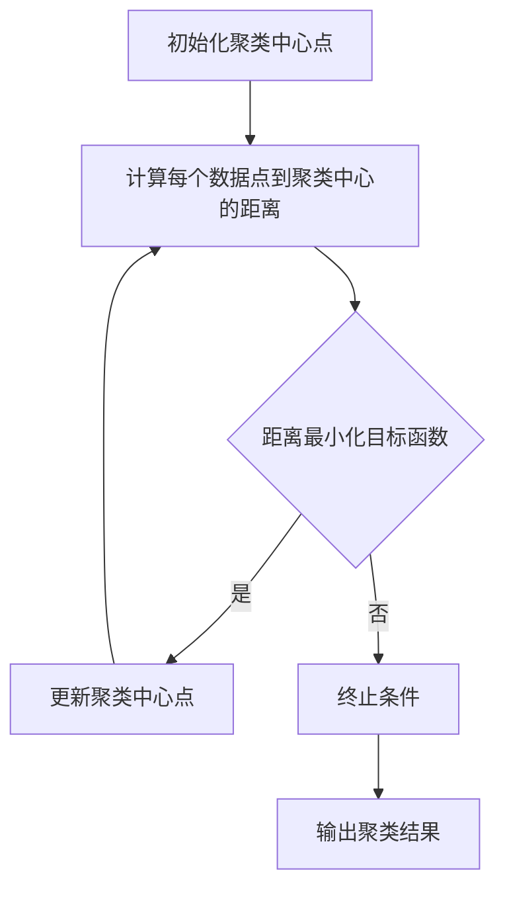

                 

关键词：K-Means 聚类，机器学习，数据挖掘，聚类算法，数据科学，优化方法，算法实现，应用场景

> 摘要：K-Means 聚类是一种经典的机器学习算法，它通过将数据点分配到K个簇中，以实现无监督学习。本文将深入探讨K-Means聚类算法的原理、实现和应用，并提供详细的数学模型和公式推导，以及实际项目实践案例。

## 1. 背景介绍

### 1.1 K-Means 聚类的发展历史

K-Means 聚类算法起源于1967年，由MacQueen提出。作为一种基于距离的迭代聚类算法，K-Means 在数据挖掘、机器学习等领域中得到了广泛应用。与其他聚类算法相比，K-Means 算法简单易实现，但同时也存在一些局限性。随着计算机技术和人工智能的不断发展，K-Means 算法逐渐演变为多种变体和改进算法，如K-Means++、K-Medians、K-Modes等。

### 1.2 K-Means 聚类在数据科学中的重要性

在数据科学领域，聚类分析是一种重要的数据分析方法。通过聚类，我们可以将数据点划分为不同的簇，从而发现数据中的潜在模式和结构。K-Means 聚类算法由于其简洁性和高效性，在数据预处理、图像处理、社交网络分析等多个领域都得到了广泛应用。

## 2. 核心概念与联系

### 2.1 数据点与簇

在K-Means 聚类中，数据集是由一系列数据点组成的。每个数据点可以表示为一个多维向量。聚类的主要目标是找到K个簇，使得每个数据点属于且仅属于一个簇。

### 2.2 目标函数

K-Means 聚类的核心目标是最小化簇内距离之和，即目标函数为：

\[ J = \sum_{i=1}^{K} \sum_{x \in S_i} ||x - \mu_i||^2 \]

其中，\( S_i \) 表示第 \( i \) 个簇，\( \mu_i \) 是簇 \( S_i \) 的中心点，\( ||x - \mu_i||^2 \) 表示数据点 \( x \) 到簇中心 \( \mu_i \) 的欧氏距离平方。

### 2.3 Mermaid 流程图

以下是一个描述K-Means 聚类流程的 Mermaid 流程图：



## 3. 核心算法原理 & 具体操作步骤

### 3.1 算法原理概述

K-Means 聚类算法的核心思想是通过迭代的方式，逐步优化聚类结果。算法主要包括以下步骤：

1. 初始化K个聚类中心点。
2. 计算每个数据点到K个聚类中心的距离，并将其分配到最近的簇。
3. 根据新的簇分配结果，重新计算每个簇的中心点。
4. 重复步骤2和步骤3，直到聚类中心不再发生变化或者达到预设的迭代次数。

### 3.2 算法步骤详解

#### 3.2.1 初始化聚类中心点

初始化聚类中心点的方式有很多种，最常见的方法是随机选择K个数据点作为初始聚类中心点。另一种方法是基于K-Means++算法，它通过优化初始聚类中心点的选择，来提高聚类质量。

#### 3.2.2 计算每个数据点到聚类中心的距离

计算数据点到聚类中心的距离通常使用欧氏距离。对于多维向量空间中的两个数据点 \( x \) 和 \( \mu_i \)，它们的欧氏距离定义为：

\[ ||x - \mu_i|| = \sqrt{\sum_{j=1}^{n} (x_j - \mu_{ij})^2} \]

其中，\( n \) 是数据点的维度，\( x_j \) 和 \( \mu_{ij} \) 分别是数据点和聚类中心点的第 \( j \) 个维度上的值。

#### 3.2.3 更新聚类中心点

根据新的簇分配结果，重新计算每个簇的中心点。簇中心点的计算方法为：

\[ \mu_i = \frac{1}{|S_i|} \sum_{x \in S_i} x \]

其中，\( |S_i| \) 是簇 \( S_i \) 中的数据点数量。

#### 3.2.4 迭代终止条件

K-Means 聚类算法通常有以下两种迭代终止条件：

1. 聚类中心点不变：当连续多次迭代后，聚类中心点不再发生变化，说明聚类结果已经收敛。
2. 达到预设的迭代次数：当迭代次数达到预设的最大值时，算法终止。

### 3.3 算法优缺点

#### 优点

1. 算法简单，易于实现。
2. 运算速度快，适合处理大规模数据。
3. 对于初始聚类中心点的选择有一定的鲁棒性。

#### 缺点

1. 对噪声和异常值敏感。
2. 可能会陷入局部最优解。
3. 无法预测簇的数量。

### 3.4 算法应用领域

K-Means 聚类算法在多个领域都有广泛应用，主要包括：

1. 数据挖掘：用于发现数据中的潜在模式和结构。
2. 图像处理：用于图像分割和特征提取。
3. 社交网络分析：用于用户群体划分和推荐系统。
4. 市场营销：用于客户细分和市场定位。

## 4. 数学模型和公式 & 详细讲解 & 举例说明

### 4.1 数学模型构建

K-Means 聚类算法的数学模型主要包括两个部分：目标函数和优化方法。

#### 目标函数

目标函数定义为：

\[ J = \sum_{i=1}^{K} \sum_{x \in S_i} ||x - \mu_i||^2 \]

其中，\( \mu_i \) 是簇 \( S_i \) 的中心点。

#### 优化方法

优化目标函数的方法是迭代优化。在每次迭代中，首先计算每个数据点到聚类中心的距离，然后更新聚类中心点，直到目标函数收敛。

### 4.2 公式推导过程

#### 初始聚类中心点选择

假设数据集为 \( X = \{x_1, x_2, ..., x_n\} \)，我们需要从数据集中随机选择K个初始聚类中心点 \( \mu_1, \mu_2, ..., \mu_K \)。

#### 数据点到聚类中心的距离计算

对于数据点 \( x_i \) 和聚类中心点 \( \mu_j \)，它们的欧氏距离为：

\[ d(x_i, \mu_j) = ||x_i - \mu_j|| = \sqrt{\sum_{k=1}^{m} (x_{ik} - \mu_{jk})^2} \]

其中，\( m \) 是数据点的维度。

#### 聚类中心点更新

在每次迭代中，我们需要更新聚类中心点。新的聚类中心点 \( \mu_i^{new} \) 的计算公式为：

\[ \mu_i^{new} = \frac{1}{|S_i|} \sum_{x \in S_i} x \]

其中，\( |S_i| \) 是簇 \( S_i \) 中的数据点数量。

### 4.3 案例分析与讲解

假设我们有一个包含5个数据点的二维数据集 \( X = \{(1, 1), (2, 2), (3, 3), (4, 4), (5, 5)\} \)，我们需要使用K-Means 聚类算法将其分为2个簇。

#### 初始聚类中心点选择

我们随机选择 \( \mu_1 = (1, 1) \) 和 \( \mu_2 = (5, 5) \) 作为初始聚类中心点。

#### 第一次迭代

计算每个数据点到聚类中心的距离：

\[ d(x_1, \mu_1) = \sqrt{(1-1)^2 + (1-1)^2} = 0 \]
\[ d(x_1, \mu_2) = \sqrt{(1-5)^2 + (1-5)^2} = \sqrt{16 + 16} = \sqrt{32} \]
\[ d(x_2, \mu_1) = \sqrt{(2-1)^2 + (2-1)^2} = \sqrt{2} \]
\[ d(x_2, \mu_2) = \sqrt{(2-5)^2 + (2-5)^2} = \sqrt{32} \]
\[ ... \]

将数据点分配到最近的簇：

\[ x_1, x_2, x_3 \in S_1 \]
\[ x_4, x_5 \in S_2 \]

计算新的聚类中心点：

\[ \mu_1^{new} = \frac{1}{3} (1+2+3) = 2 \]
\[ \mu_2^{new} = \frac{1}{2} (4+5) = 4.5 \]

#### 第二次迭代

计算每个数据点到新的聚类中心的距离：

\[ d(x_1, \mu_1^{new}) = \sqrt{(1-2)^2 + (1-2)^2} = \sqrt{2} \]
\[ d(x_1, \mu_2^{new}) = \sqrt{(1-4.5)^2 + (1-4.5)^2} = \sqrt{13.5} \]
\[ d(x_2, \mu_1^{new}) = \sqrt{(2-2)^2 + (2-2)^2} = 0 \]
\[ d(x_2, \mu_2^{new}) = \sqrt{(2-4.5)^2 + (2-4.5)^2} = \sqrt{13.5} \]
\[ ... \]

将数据点分配到最近的簇：

\[ x_1, x_2 \in S_1 \]
\[ x_3, x_4, x_5 \in S_2 \]

计算新的聚类中心点：

\[ \mu_1^{new} = \frac{1}{2} (1+2) = 1.5 \]
\[ \mu_2^{new} = \frac{1}{3} (3+4+5) = 4 \]

#### 第三次迭代

计算每个数据点到新的聚类中心的距离：

\[ d(x_1, \mu_1^{new}) = \sqrt{(1-1.5)^2 + (1-1.5)^2} = 0.5 \]
\[ d(x_1, \mu_2^{new}) = \sqrt{(1-4)^2 + (1-4)^2} = 4.47 \]
\[ d(x_2, \mu_1^{new}) = \sqrt{(2-1.5)^2 + (2-1.5)^2} = 0.5 \]
\[ d(x_2, \mu_2^{new}) = \sqrt{(2-4)^2 + (2-4)^2} = 4.47 \]
\[ ... \]

将数据点分配到最近的簇：

\[ x_1, x_2 \in S_1 \]
\[ x_3, x_4, x_5 \in S_2 \]

计算新的聚类中心点：

\[ \mu_1^{new} = \frac{1}{2} (1+2) = 1.5 \]
\[ \mu_2^{new} = \frac{1}{3} (3+4+5) = 4 \]

由于聚类中心点没有发生变化，说明聚类结果已经收敛。

最终，我们将数据点划分为两个簇：

\[ S_1 = \{(1, 1), (2, 2)\} \]
\[ S_2 = \{(3, 3), (4, 4), (5, 5)\} \]

## 5. 项目实践：代码实例和详细解释说明

### 5.1 开发环境搭建

在本项目实践中，我们将使用Python编程语言来实现K-Means 聚类算法。首先，确保您的计算机上已安装Python 3.x版本。然后，安装以下库：

```bash
pip install numpy matplotlib
```

### 5.2 源代码详细实现

以下是一个简单的K-Means 聚类算法的实现：

```python
import numpy as np
import matplotlib.pyplot as plt

def kmeans(X, K, max_iter):
    # 初始化聚类中心点
    centroids = X[np.random.choice(X.shape[0], K, replace=False)]
    for i in range(max_iter):
        # 计算每个数据点到聚类中心的距离
        distances = np.linalg.norm(X[:, np.newaxis] - centroids, axis=2)
        # 将数据点分配到最近的簇
        labels = np.argmin(distances, axis=1)
        # 计算新的聚类中心点
        centroids = np.array([X[labels == k].mean(axis=0) for k in range(K)])
        # 检查聚类中心点是否发生变化
        if np.all(centroids == centroids[:1]):
            break
    return centroids, labels

# 示例数据
X = np.array([[1, 1], [2, 2], [3, 3], [4, 4], [5, 5]])

# 聚类参数
K = 2
max_iter = 100

# 执行K-Means聚类
centroids, labels = kmeans(X, K, max_iter)

# 可视化聚类结果
plt.scatter(X[:, 0], X[:, 1], c=labels, cmap='viridis')
plt.scatter(centroids[:, 0], centroids[:, 1], s=300, c='red', marker='x')
plt.xlabel('X1')
plt.ylabel('X2')
plt.show()
```

### 5.3 代码解读与分析

1. **初始化聚类中心点**：使用随机选择的方法从数据集中选择K个初始聚类中心点。
2. **计算每个数据点到聚类中心的距离**：使用欧氏距离计算每个数据点到聚类中心的距离。
3. **将数据点分配到最近的簇**：根据距离计算结果，将数据点分配到最近的簇。
4. **计算新的聚类中心点**：根据新的簇分配结果，计算每个簇的中心点。
5. **迭代优化**：重复执行步骤2到步骤4，直到聚类中心点不再发生变化或者达到预设的迭代次数。
6. **可视化聚类结果**：使用matplotlib库将聚类结果可视化为散点图，便于分析聚类效果。

### 5.4 运行结果展示

运行以上代码后，我们将得到一个包含两个簇的二维数据集的可视化结果。簇内的数据点用不同的颜色表示，簇中心点用红色十字表示。

## 6. 实际应用场景

### 6.1 数据挖掘

K-Means 聚类算法在数据挖掘领域有广泛应用。例如，在客户细分中，我们可以使用K-Means 聚类将客户划分为不同的群体，从而制定有针对性的市场营销策略。

### 6.2 图像处理

K-Means 聚类算法在图像处理领域也有重要应用。例如，在图像分割中，我们可以使用K-Means 聚类将图像划分为不同的区域，从而实现图像分割。

### 6.3 社交网络分析

在社交网络分析中，K-Means 聚类算法可以用于用户群体划分。通过将用户划分为不同的群体，我们可以更好地理解用户行为和偏好，从而为推荐系统提供支持。

### 6.4 未来应用展望

随着人工智能和大数据技术的不断发展，K-Means 聚类算法在未来的应用场景将更加广泛。例如，在医疗领域，K-Means 聚类算法可以用于疾病诊断和患者分类；在金融领域，K-Means 聚类算法可以用于风险管理和客户细分。

## 7. 工具和资源推荐

### 7.1 学习资源推荐

1. 《机器学习》（周志华 著）：详细介绍了K-Means 聚类算法的理论和实践。
2. 《数据挖掘：概念与技术》（Jiawei Han 著）：提供了丰富的数据挖掘算法和应用案例。

### 7.2 开发工具推荐

1. Jupyter Notebook：用于编写和运行Python代码，便于实验和调试。
2. Matplotlib：用于数据可视化，便于分析聚类结果。

### 7.3 相关论文推荐

1. MacQueen, J. B. (1967). Some methods for classification and analysis of multivariate observations. In Proceedings of 5th Berkeley symposium on mathematical statistics and probability (pp. 281-297).
2. Arthur, D., & Vassilvitskii, S. (2007). k-means++: The advantages of careful seeding. In Proceedings of the eighteenth annual ACM-SIAM symposium on discrete algorithms (pp. 1027-1035).

## 8. 总结：未来发展趋势与挑战

### 8.1 研究成果总结

K-Means 聚类算法作为一种经典的机器学习算法，在数据挖掘、图像处理、社交网络分析等多个领域都取得了显著的研究成果和应用。未来，K-Means 聚类算法的研究将更加注重算法的优化和扩展。

### 8.2 未来发展趋势

1. 算法优化：针对K-Means 聚类算法的局限性，研究者将致力于优化算法的收敛速度和聚类质量。
2. 算法扩展：将K-Means 聚类算法与其他机器学习算法相结合，开发更强大的聚类方法。
3. 大规模数据处理：研究如何高效地处理大规模数据集，提高算法的实用性。

### 8.3 面临的挑战

1. 局部最优解：K-Means 聚类算法容易陷入局部最优解，如何避免局部最优解是一个重要挑战。
2. 簇数量选择：如何选择合适的簇数量，以获得最佳聚类效果，也是一个难题。
3. 异常值和噪声：如何处理异常值和噪声，提高算法的鲁棒性，是当前研究的热点。

### 8.4 研究展望

随着人工智能和大数据技术的不断发展，K-Means 聚类算法在未来将有更广泛的应用前景。针对当前存在的问题，研究者将不断提出新的算法和优化方法，以实现更高效的聚类分析。

## 9. 附录：常见问题与解答

### 9.1 如何选择合适的簇数量K？

选择合适的簇数量K是一个关键问题。通常有以下几种方法：

1. 手动选择：根据业务需求和数据集的特点，手动选择合适的簇数量。
2.肘部法则（Elbow Method）：计算不同簇数量下的目标函数值，选择目标函数值下降速度减缓的点作为簇数量。
3. Silhouette Score：计算每个数据点与其所在簇和其他簇的距离，选择Silhouette Score最高的簇数量。

### 9.2 如何处理异常值和噪声？

1. 数据清洗：在聚类前，对数据进行清洗，去除异常值和噪声。
2. 加权距离：对异常值和噪声数据进行加权处理，降低其对聚类结果的影响。
3. 鲁棒性算法：使用鲁棒性更强的聚类算法，如K-Medians 聚类，提高算法对异常值和噪声的容忍度。

作者：禅与计算机程序设计艺术 / Zen and the Art of Computer Programming
------------------------------------------------------------------------

