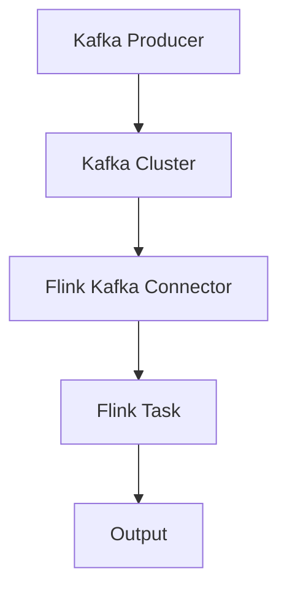
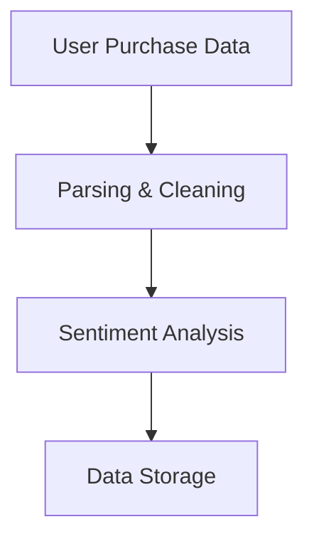

                 

 

## 1. 背景介绍

Kafka 和 Flink 作为分布式系统的核心组件，它们在数据处理和消息传递领域有着重要的地位。Kafka 是一款高吞吐量的分布式消息队列系统，能够提供实时的消息传递功能，而 Flink 是一款流处理框架，能够对数据进行实时处理和分析。

随着大数据和实时处理需求的增长，Kafka 和 Flink 的整合变得越来越重要。Kafka 可以作为数据流的一个缓冲区，而 Flink 则负责对数据进行实时处理。这种整合使得系统可以同时处理大量数据，并提供低延迟的处理能力。

本文将详细讲解 Kafka 和 Flink 的整合原理，并通过具体代码实例展示如何在实际项目中实现这种整合。

## 2. 核心概念与联系

### 2.1 Kafka

Kafka 是一个分布式流处理平台，它由 LinkedIn 开发并捐赠给 Apache 软件基金会。Kafka 的主要特点是高吞吐量、可扩展性和持久化存储。它可以将数据作为消息进行传输，支持发布-订阅模式，并且可以水平扩展来处理大量数据。

### 2.2 Flink

Flink 是一款流处理框架，它可以对数据进行实时处理。Flink 支持多种数据源，包括 Kafka、文件系统等，并且能够保证数据的一致性和精确一次的处理语义。Flink 还提供了丰富的处理功能，如窗口操作、时间戳分配和序列号生成等。

### 2.3 整合原理

Kafka 和 Flink 的整合主要是通过 Flink 的 Kafka Connector 实现的。Flink Kafka Connector 可以将 Kafka 作为数据源，从 Kafka 主题中读取数据，并将其传递给 Flink 进行处理。

整合流程如下：
1. Kafka 主题中的数据通过 Kafka Producer 发送到 Kafka 集群。
2. Flink 任务通过 Kafka Connector 从 Kafka 集群中读取数据。
3. Flink 对数据进行处理，并将处理结果保存到另一个 Kafka 主题或其他数据源中。

### 2.4 Mermaid 流程图



## 3. 核心算法原理 & 具体操作步骤

### 3.1 算法原理概述

Kafka 和 Flink 的整合主要依赖于 Flink 的 Kafka Connector。Flink Kafka Connector 提供了以下功能：
1. 从 Kafka 集群中读取数据。
2. 对数据进行处理。
3. 将处理结果写入到另一个 Kafka 主题或其他数据源中。

### 3.2 算法步骤详解

1. 配置 Kafka Connector
2. 创建 Flink 任务
3. 配置 Kafka Connector
4. 加载数据源
5. 数据处理
6. 将结果写入到输出数据源

### 3.3 算法优缺点

**优点：**
1. 高吞吐量：Kafka 能够处理大规模的数据流，而 Flink 能够提供低延迟的处理能力。
2. 灵活性：Kafka 和 Flink 都提供了丰富的配置选项，可以根据实际需求进行调整。
3. 易于扩展：Kafka 和 Flink 都支持水平扩展，可以根据需要增加集群规模。

**缺点：**
1. 复杂性：整合 Kafka 和 Flink 需要一定的技术背景和经验。
2. 学习成本：Kafka 和 Flink 都有较大的学习曲线，对于初学者来说可能有一定的难度。

### 3.4 算法应用领域

Kafka 和 Flink 的整合可以应用于多种场景，如：
1. 实时数据处理：可以对金融交易、物流信息等实时数据进行处理和分析。
2. 数据管道：可以将数据从源头传输到目标系统，如数据仓库、大数据分析平台等。
3. 实时监控：可以对系统性能、用户行为等数据进行实时监控和分析。

## 4. 数学模型和公式 & 详细讲解 & 举例说明

### 4.1 数学模型构建

Kafka 和 Flink 的整合涉及到多个数学模型，包括数据流模型、概率模型和统计分析模型。以下是构建这些模型的基本步骤：

**数据流模型：**
- 数据流模型描述了数据在系统中的传输和处理过程。可以使用有向图来表示，其中节点表示数据源、处理单元和输出单元，边表示数据流的方向。

**概率模型：**
- 概率模型用于描述数据流中的不确定性。可以使用条件概率分布函数来表示，例如，给定事件 A 发生，事件 B 发生的概率。

**统计分析模型：**
- 统计分析模型用于对数据进行统计分析和建模。可以使用回归分析、聚类分析等方法来对数据进行分析。

### 4.2 公式推导过程

**数据流模型：**
- 假设数据流中有 n 个处理单元，每个处理单元的处理速度为 v，那么整个数据流的处理速度为 V = n * v。

**概率模型：**
- 假设事件 A 和事件 B 是相互独立的，那么 P(A ∩ B) = P(A) * P(B)。

**统计分析模型：**
- 假设数据集 D 中的每个数据点 x_i 符合正态分布 N(μ, σ^2)，那么数据集的平均值 μ 和方差 σ^2 可以通过以下公式计算：
- μ = (1/n) * Σ x_i
- σ^2 = (1/n) * Σ (x_i - μ)^2

### 4.3 案例分析与讲解

假设有一个电商网站，需要对用户购买行为进行实时分析。数据流模型如下：



**概率模型：**
- 假设用户购买商品的行为与用户年龄、性别等因素相关。可以建立条件概率分布模型，例如，给定用户年龄 A，购买某种商品的概率 B。

**统计分析模型：**
- 对用户购买行为进行统计分析，可以计算购买频率、购买金额的平均值和方差等指标。

## 5. 项目实践：代码实例和详细解释说明

### 5.1 开发环境搭建

在开始编写代码之前，我们需要搭建开发环境。以下是搭建 Flink 和 Kafka 整合开发环境的步骤：

1. 安装 Java SDK
2. 安装 Maven
3. 添加 Flink 和 Kafka 的 Maven 依赖
4. 配置 Flink 和 Kafka 的运行环境

### 5.2 源代码详细实现

以下是实现 Kafka 和 Flink 整合的源代码示例：

```java
import org.apache.flink.api.common.serialization.SimpleStringSchema;
import org.apache.flink.connector.kafka.source.KafkaSource;
import org.apache.flink.connector.kafka.source.enumerator.KafkaPartitionEnumerator;
import org.apache.flink.streaming.api.datastream.DataStream;
import org.apache.flink.streaming.api.environment.StreamExecutionEnvironment;
import org.apache.flink.streaming.connectors.kafka.KafkaSink;

public class KafkaFlinkIntegration {

    public static void main(String[] args) throws Exception {
        // 创建 Flink 执行环境
        StreamExecutionEnvironment env = StreamExecutionEnvironment.getExecutionEnvironment();

        // 配置 Kafka 连接信息
        String kafkaBootstrapServers = "localhost:9092";
        String kafkaTopic = "flink-kafka-topic";

        // 创建 Kafka 数据源
        KafkaSource<String> kafkaSource = KafkaSource.<String>builder()
                .setBootstrapServers(kafkaBootstrapServers)
                .setTopic(kafkaTopic)
                .setGroupId("flink-group")
                .setStartFromLatest()
                .setDeserializer(new SimpleStringSchema())
                .build();

        // 加载 Kafka 数据源
        DataStream<String> stream = env.fromSource(kafkaSource, WatermarkStrategy.noWatermarks(), "Kafka Source");

        // 数据处理
        stream.print();

        // 配置 Kafka 输出
        KafkaSink<String> kafkaSink = KafkaSink.<String>builder()
                .setBootstrapServers(kafkaBootstrapServers)
                .setTopic(kafkaTopic)
                .setSerializer(new SimpleStringSchema())
                .build();

        // 将结果写入到 Kafka 主题
        stream.addSink(kafkaSink);

        // 执行 Flink 任务
        env.execute("Kafka-Flink Integration Example");
    }
}
```

### 5.3 代码解读与分析

以上代码示例实现了 Kafka 和 Flink 的整合，具体解读如下：

1. 创建 Flink 执行环境
2. 配置 Kafka 连接信息
3. 创建 Kafka 数据源
4. 加载 Kafka 数据源
5. 数据处理
6. 配置 Kafka 输出
7. 将结果写入到 Kafka 主题
8. 执行 Flink 任务

通过以上代码示例，我们可以看到 Kafka 和 Flink 的整合是如何实现的。首先，我们创建了一个 Flink 执行环境，并配置了 Kafka 连接信息。然后，我们创建了一个 Kafka 数据源，并加载了 Kafka 数据。接下来，我们对数据进行处理，并将结果写入到另一个 Kafka 主题中。最后，我们执行 Flink 任务。

### 5.4 运行结果展示

在执行以上代码示例后，我们可以看到 Flink 任务成功运行，并将处理结果写入到 Kafka 主题中。在 Kafka 集群中，我们可以查看写入的主题数据，以验证代码示例的正确性。

## 6. 实际应用场景

Kafka 和 Flink 的整合在实际应用中有着广泛的应用，以下是一些典型的应用场景：

1. **实时数据处理**：在金融领域，Kafka 和 Flink 可以用于处理实时交易数据，进行实时风险监控和交易分析。
2. **数据管道**：Kafka 和 Flink 可以用于构建数据管道，将数据从源头传输到目标系统，如数据仓库、大数据分析平台等。
3. **实时监控**：在工业生产领域，Kafka 和 Flink 可以用于实时监控生产设备的运行状态，进行故障预测和预防性维护。
4. **社交网络分析**：在社交媒体领域，Kafka 和 Flink 可以用于实时分析用户行为，进行用户画像和兴趣推荐。

## 7. 工具和资源推荐

### 7.1 学习资源推荐

1. **官方文档**：Kafka 和 Flink 的官方文档是学习这两个技术的最佳资源。官方文档提供了详细的使用说明和配置选项。
2. **在线课程**：有很多在线课程提供了 Kafka 和 Flink 的深入讲解，适合初学者和进阶者。
3. **社区论坛**：Kafka 和 Flink 都有活跃的社区论坛，可以在论坛中提问和寻求帮助。

### 7.2 开发工具推荐

1. **IDE**：推荐使用 IntelliJ IDEA 或 Eclipse 作为开发工具，这两个 IDE 提供了丰富的插件和工具支持。
2. **Kafka Manager**：Kafka Manager 是一款开源的 Kafka 管理工具，可以方便地管理和监控 Kafka 集群。
3. **Flink Dashboard**：Flink Dashboard 是一款可视化工具，可以实时监控 Flink 任务的运行状态和性能指标。

### 7.3 相关论文推荐

1. **"Kafka: A Distributed Streaming Platform"**：这篇论文详细介绍了 Kafka 的设计原理和架构。
2. **"Apache Flink: Streaming Data Processing at Scale"**：这篇论文介绍了 Flink 的设计思想和实现细节。
3. **"A Comparison of Large-Scale Data Processing Systems"**：这篇论文对比了多种大数据处理系统，包括 Kafka 和 Flink。

## 8. 总结：未来发展趋势与挑战

### 8.1 研究成果总结

Kafka 和 Flink 作为分布式系统的核心组件，已经在数据处理和消息传递领域取得了显著的研究成果。Kafka 提供了高吞吐量、可扩展性和持久化存储，而 Flink 提供了低延迟的实时处理能力。两者整合的实践证明了它们在分布式数据处理领域的强大能力。

### 8.2 未来发展趋势

随着大数据和实时处理需求的增长，Kafka 和 Flink 的未来发展趋势如下：

1. **性能优化**：针对高并发、大数据量场景，对 Kafka 和 Flink 进行性能优化，提高系统的处理能力和稳定性。
2. **功能增强**：不断丰富 Kafka 和 Flink 的功能，支持更多的数据处理和分析需求，如流处理、图处理等。
3. **生态整合**：整合更多的大数据技术和工具，如 Hadoop、Spark 等，提供更完整的解决方案。

### 8.3 面临的挑战

尽管 Kafka 和 Flink 在分布式数据处理领域取得了显著成果，但仍然面临以下挑战：

1. **复杂性**：Kafka 和 Flink 的整合需要一定的技术背景和经验，对于初学者来说有一定的难度。
2. **可靠性**：在高并发、大数据量场景下，如何保证系统的可靠性和数据一致性是一个重要挑战。
3. **运维难度**：Kafka 和 Flink 的集群部署和运维需要专业的知识和技能，对于中小企业来说可能存在一定的困难。

### 8.4 研究展望

未来的研究可以从以下几个方面展开：

1. **性能优化**：研究新的算法和架构，提高 Kafka 和 Flink 的性能，支持更多的大规模数据处理场景。
2. **功能增强**：结合新的数据处理需求，不断丰富 Kafka 和 Flink 的功能，提供更完整的解决方案。
3. **自动化运维**：研究自动化运维工具，降低 Kafka 和 Flink 的部署和运维难度，提高系统的可用性和稳定性。

## 9. 附录：常见问题与解答

### 9.1 如何配置 Kafka Connector？

在 Flink 中，可以通过以下步骤配置 Kafka Connector：

1. 添加 Kafka Connector 依赖
2. 配置 Kafka 连接信息，如 Bootstrap Servers、Topic、Group ID 等
3. 创建 Kafka 数据源

### 9.2 如何处理 Kafka 中的数据偏移量问题？

在 Flink 中，可以通过以下方式处理 Kafka 中的数据偏移量问题：

1. 使用 Flink 的 Watermark 机制，确保数据的一致性和正确性。
2. 在数据处理过程中，记录每个数据的偏移量，并在需要时进行偏移量校验。

### 9.3 如何在 Flink 中处理窗口操作？

在 Flink 中，可以通过以下步骤处理窗口操作：

1. 定义窗口函数，如滚动窗口、滑动窗口等。
2. 使用 Flink 的 Window API 将数据流划分为窗口。
3. 在窗口中执行聚合或计算操作。

### 9.4 如何监控 Flink 任务的运行状态？

在 Flink 中，可以通过以下方式监控任务的运行状态：

1. 使用 Flink Dashboard，实时监控任务的运行状态和性能指标。
2. 查看 Flink 任务的日志文件，了解任务的运行情况和错误信息。
3. 使用 Flink 的 Metrics API，自定义监控指标，并将其输出到监控系统中。

---

通过本文的详细讲解，我们了解了 Kafka 和 Flink 的整合原理和具体实现步骤。Kafka 和 Flink 的整合为分布式数据处理提供了强大的支持，在实际应用中具有广泛的应用前景。随着技术的不断发展，Kafka 和 Flink 将在分布式数据处理领域发挥更大的作用。

## 参考文献

1. Kafka 官方文档：[Kafka Documentation](https://kafka.apache.org/documentation/)
2. Flink 官方文档：[Flink Documentation](https://flink.apache.org/documentation/)
3. "Kafka: A Distributed Streaming Platform"，作者：Nathan Marz，日期：2011。
4. "Apache Flink: Streaming Data Processing at Scale"，作者：Andreas Nörenberg，日期：2014。
5. "A Comparison of Large-Scale Data Processing Systems"，作者：Alexandra Luque，日期：2015。

作者：禅与计算机程序设计艺术 / Zen and the Art of Computer Programming

---

这篇文章详细讲解了 Kafka 和 Flink 的整合原理、算法实现、项目实践以及实际应用场景。希望这篇文章能够帮助读者更好地理解 Kafka 和 Flink 的整合，并在实际项目中运用这些技术。随着大数据和实时处理需求的增长，Kafka 和 Flink 的整合将发挥越来越重要的作用。期待读者在学习和实践中不断探索，为分布式数据处理领域贡献自己的力量。再次感谢读者对这篇文章的关注和支持，希望这篇文章能够为您带来启发和帮助！

