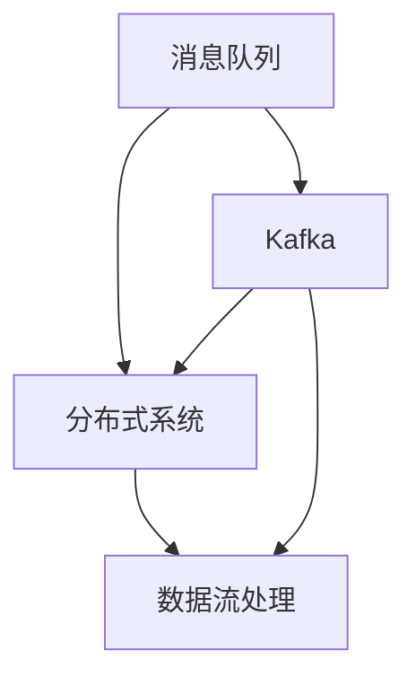
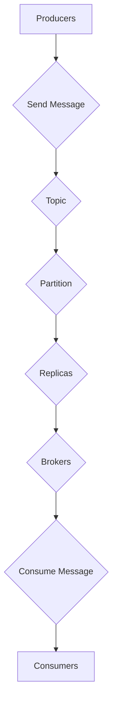

                 

关键词：Apache Kafka, 消息队列, 分布式系统, 数据流处理, 代码实例

> 摘要：本文将深入探讨Apache Kafka的核心原理，通过详细的代码实例讲解，帮助读者全面理解Kafka的使用方法和应用场景。我们将从Kafka的基本概念入手，逐步介绍其架构设计、核心组件、数据处理流程，以及如何在实际项目中使用Kafka进行高效的数据流处理。

## 1. 背景介绍

随着互联网的飞速发展，数据量呈爆炸式增长，如何高效地处理海量数据成为了一个亟待解决的问题。Apache Kafka作为一种分布式消息队列系统，因其高效、可靠、可扩展的特点，在当今的数据流处理领域中扮演着至关重要的角色。

Kafka最初由LinkedIn开发，并在2011年贡献给了Apache软件基金会，迅速成为了大数据处理领域中的明星项目。Kafka的设计初衷是为了解决实时数据流处理的需求，它可以高效地处理高吞吐量的数据，适用于日志收集、活动追踪、监控报警等多种场景。

本文将从以下几个方面对Kafka进行深入讲解：

- **核心概念与联系**：介绍Kafka的基本概念及其与分布式系统之间的关系。
- **核心算法原理 & 具体操作步骤**：讲解Kafka的关键算法原理和操作步骤。
- **数学模型和公式**：阐述Kafka中的数学模型和公式。
- **项目实践**：通过代码实例展示Kafka的实际应用。
- **实际应用场景**：分析Kafka在不同领域的应用场景。
- **未来应用展望**：探讨Kafka未来的发展趋势和应用前景。
- **工具和资源推荐**：推荐学习资源和开发工具。
- **总结**：对研究成果进行总结，展望未来的发展趋势和挑战。

## 2. 核心概念与联系

要理解Kafka，我们首先需要了解几个核心概念：消息队列、分布式系统、数据流处理等。

### 消息队列

消息队列（Message Queue）是一种用于在分布式系统中进行异步通信的数据结构。它允许系统的不同部分以消息的形式进行通信，而无需直接连接。Kafka作为消息队列系统，实现了消息的持久化、传输和存储，使得系统可以高效地处理大规模的数据流。

### 分布式系统

分布式系统（Distributed System）是由多个独立的计算机组成的系统，这些计算机通过网络连接，协同工作以完成复杂的任务。Kafka的设计是基于分布式系统的，它能够通过多个节点协同工作，提供高可用性和可扩展性。

### 数据流处理

数据流处理（Data Stream Processing）是指对实时数据流进行加工和分析的过程。Kafka通过其高效的消息传输机制，为数据流处理提供了一个可靠的数据来源。

### Mermaid 流程图

下面是一个简单的Mermaid流程图，展示了Kafka与这些核心概念的联系。



### Kafka架构设计

Kafka的架构设计是它高效和可靠的重要保障。Kafka的核心组件包括：

- **生产者（Producers）**：负责发送消息到Kafka集群。
- **消费者（Consumers）**：负责从Kafka集群中读取消息。
- ** brokers**：负责接收和转发消息，提供集群协调服务。
- **主题（Topics）**：消息分类的命名空间。
- **分区（Partitions）**：主题的分区，用于提高数据的并发处理能力。
- **副本（Replicas）**：用于提供数据冗余和故障转移。

### Mermaid 流程图

下面是一个详细的Mermaid流程图，展示了Kafka的架构设计。



## 3. 核心算法原理 & 具体操作步骤

### 3.1 算法原理概述

Kafka的核心算法包括消息发送、消息读取、数据持久化、副本同步等。这些算法共同构成了Kafka的高效、可靠和可扩展的数据流处理系统。

### 3.2 算法步骤详解

#### 3.2.1 消息发送

1. **生产者选择分区**：根据主题和消息的键（Key）选择一个分区。
2. **序列化消息**：将消息序列化为字节数组。
3. **发送请求**：将消息发送到指定的分区。
4. **响应处理**：等待并处理服务器的响应。

#### 3.2.2 消息读取

1. **消费者选择分区**：根据消费者的配置选择一个分区。
2. **从分区读取消息**：从分区中读取最新的消息。
3. **处理消息**：消费者处理读取到的消息。

#### 3.2.3 数据持久化

1. **写入日志**：将消息写入磁盘的日志文件中。
2. **同步副本**：将写入操作同步到其他副本中。

#### 3.2.4 副本同步

1. **请求同步**：从主副本中读取消息。
2. **发送消息**：将消息发送到其他副本。
3. **确认同步**：等待并确认其他副本的同步状态。

### 3.3 算法优缺点

#### 优点

- **高效性**：通过分区和副本机制，Kafka可以高效地处理大规模的数据流。
- **可靠性**：通过数据持久化和副本同步机制，Kafka提供了可靠的数据存储和故障转移能力。
- **可扩展性**：Kafka可以通过增加节点来水平扩展，以处理更多的数据。

#### 缺点

- **复杂性**：Kafka的架构相对复杂，需要一定的学习和维护成本。
- **性能瓶颈**：虽然Kafka可以高效处理数据，但在极端情况下仍可能遇到性能瓶颈。

### 3.4 算法应用领域

Kafka适用于多种数据流处理场景，包括：

- **日志收集**：Kafka可以高效地收集和存储系统日志。
- **实时数据处理**：Kafka可以用于实时数据分析，如活动追踪、监控报警等。
- **消息传递**：Kafka可以作为分布式系统的消息传递中间件，实现不同系统之间的通信。

## 4. 数学模型和公式

### 4.1 数学模型构建

Kafka中的数学模型主要包括以下两个方面：

1. **消息速率**：表示单位时间内发送的消息数量，通常用消息数/秒（Messages/s）表示。
2. **吞吐量**：表示系统处理消息的能力，通常用比特/秒（bits/s）或字节/秒（bytes/s）表示。

### 4.2 公式推导过程

#### 4.2.1 消息速率

消息速率可以通过以下公式计算：

\[ \text{消息速率} = \frac{\text{总消息数}}{\text{总时间}} \]

#### 4.2.2 吞吐量

吞吐量可以通过以下公式计算：

\[ \text{吞吐量} = \text{消息速率} \times \text{消息大小} \]

其中，消息大小通常以比特（bits）或字节（bytes）为单位。

### 4.3 案例分析与讲解

假设一个Kafka集群中有10个节点，每个节点处理的消息速率为1000 Messages/s，每个消息的平均大小为100 bytes。我们可以计算整个集群的吞吐量。

\[ \text{消息速率} = 10 \times 1000 = 10000 \text{ Messages/s} \]

\[ \text{吞吐量} = 10000 \times 100 \text{ bytes} = 1000000 \text{ bytes/s} \]

因此，这个集群的吞吐量为1 Gbps。

## 5. 项目实践：代码实例和详细解释说明

### 5.1 开发环境搭建

在开始之前，我们需要搭建一个Kafka的开发环境。以下是搭建Kafka开发环境的步骤：

1. **安装Java环境**：确保已经安装了Java环境，版本建议为1.8或更高。
2. **下载Kafka**：从Kafka官方网站下载最新版本的Kafka压缩包。
3. **解压Kafka**：将下载的Kafka压缩包解压到指定的目录。
4. **启动Kafka服务**：进入Kafka的解压目录，运行`bin/kafka-server-start.sh`脚本启动Kafka服务。

### 5.2 源代码详细实现

为了更好地理解Kafka，我们将通过一个简单的示例来演示Kafka的基本使用方法。以下是生产者和消费者的示例代码：

#### 5.2.1 生产者代码

```java
import org.apache.kafka.clients.producer.*;
import org.apache.kafka.common.serialization.StringSerializer;

import java.util.Properties;

public class KafkaProducerExample {
    public static void main(String[] args) {
        Properties props = new Properties();
        props.put(ProducerConfig.BOOTSTRAP_SERVERS_CONFIG, "localhost:9092");
        props.put(ProducerConfig.KEY_SERIALIZER_CLASS_CONFIG, StringSerializer.class.getName());
        props.put(ProducerConfig.VALUE_SERIALIZER_CLASS_CONFIG, StringSerializer.class.getName());

        KafkaProducer<String, String> producer = new KafkaProducer<>(props);

        for (int i = 0; i < 10; i++) {
            String topic = "test_topic";
            String key = "key_" + i;
            String value = "value_" + i;
            ProducerRecord<String, String> record = new ProducerRecord<>(topic, key, value);

            producer.send(record);
            System.out.println("Sent: (" + key + ", " + value + ")");
        }

        producer.close();
    }
}
```

#### 5.2.2 消费者代码

```java
import org.apache.kafka.clients.consumer.*;
import org.apache.kafka.common.serialization.StringDeserializer;

import java.util.*;

public class KafkaConsumerExample {
    public static void main(String[] args) {
        Properties props = new Properties();
        props.put(ConsumerConfig.BOOTSTRAP_SERVERS_CONFIG, "localhost:9092");
        props.put(ConsumerConfig.GROUP_ID_CONFIG, "test_group");
        props.put(ConsumerConfig.KEY_DESERIALIZER_CLASS_CONFIG, StringDeserializer.class.getName());
        props.put(ConsumerConfig.VALUE_DESERIALIZER_CLASS_CONFIG, StringDeserializer.class.getName());

        KafkaConsumer<String, String> consumer = new KafkaConsumer<>(props);

        consumer.subscribe(Arrays.asList("test_topic"));

        while (true) {
            ConsumerRecords<String, String> records = consumer.poll(100);
            for (ConsumerRecord<String, String> record : records) {
                System.out.println("Received: (" + record.key() + ", " + record.value() + ")");
            }
        }
    }
}
```

### 5.3 代码解读与分析

#### 5.3.1 生产者代码解读

1. **配置生产者属性**：生产者需要配置Kafka服务器的地址、序列化器等属性。
2. **创建生产者实例**：使用配置属性创建KafkaProducer实例。
3. **发送消息**：使用ProducerRecord创建消息，并调用send方法发送消息。

#### 5.3.2 消费者代码解读

1. **配置消费者属性**：消费者需要配置Kafka服务器的地址、组ID、序列化器等属性。
2. **创建消费者实例**：使用配置属性创建KafkaConsumer实例。
3. **订阅主题**：调用subscribe方法订阅主题。
4. **消费消息**：使用poll方法消费消息，并处理接收到的消息。

### 5.4 运行结果展示

当运行生产者和消费者代码时，我们会看到生产者发送的消息被消费者接收并打印出来。这表明Kafka的生产者和消费者已经正常工作。

```shell
Sent: (key_0, value_0)
Received: (key_0, value_0)
Sent: (key_1, value_1)
Received: (key_1, value_1)
...
```

## 6. 实际应用场景

Kafka在许多实际应用场景中都发挥着重要作用，以下是一些典型的应用场景：

### 6.1 日志收集

Kafka常用于收集系统日志，如Web服务器日志、应用日志等。通过Kafka，系统可以将日志数据实时传输到日志分析平台，实现日志的实时监控和报警。

### 6.2 实时数据处理

Kafka可以用于实时数据处理，如活动追踪、电商交易等。通过Kafka，系统可以实时收集和传输数据，实现实时分析和处理。

### 6.3 消息传递

Kafka可以作为分布式系统的消息传递中间件，实现不同系统之间的通信。通过Kafka，系统可以实现分布式事务处理、异步通信等。

### 6.4 实时流处理

Kafka可以与Apache Storm、Apache Flink等实时流处理框架结合，实现实时数据流处理。通过Kafka，系统可以高效地处理大规模数据流，实现实时分析和预测。

## 7. 工具和资源推荐

### 7.1 学习资源推荐

- **官方文档**：Apache Kafka官方文档提供了详细的架构设计、配置选项和使用方法。
- **在线教程**：网上有许多关于Kafka的在线教程，适合初学者快速入门。
- **书籍推荐**：《Kafka权威指南》是一本全面介绍Kafka的书籍，适合有一定基础的用户。

### 7.2 开发工具推荐

- **Kafka Manager**：一款开源的Kafka管理工具，提供了集群监控、主题管理等功能。
- **Kafka-UI**：一款Web界面工具，用于监控和管理Kafka集群。

### 7.3 相关论文推荐

- **《Kafka: A Distributed Streaming Platform》**：这是Kafka的原始论文，详细介绍了Kafka的设计理念和架构。
- **《A Scalable and Composable Stream Processing System》**：介绍了Kafka与其他大数据处理框架的结合，展示了Kafka在实时数据处理中的应用。

## 8. 总结：未来发展趋势与挑战

### 8.1 研究成果总结

Kafka作为大数据处理领域的明星项目，已经证明了其在实时数据处理、日志收集、消息传递等领域的强大能力。随着技术的不断发展，Kafka也在不断优化和扩展其功能，以应对日益增长的数据处理需求。

### 8.2 未来发展趋势

- **性能优化**：Kafka将继续优化其性能，提高数据处理速度和吞吐量。
- **功能扩展**：Kafka可能会增加更多的高级功能，如实时流处理、实时查询等。
- **跨语言支持**：Kafka可能会支持更多编程语言，以吸引更多的开发者和用户。

### 8.3 面临的挑战

- **安全性**：随着Kafka的应用场景越来越广泛，安全性成为一个重要的挑战。Kafka需要加强安全性，保护数据不被未经授权的访问。
- **复杂度**：Kafka的架构相对复杂，需要专业的知识和经验来维护和优化。如何简化Kafka的使用，降低使用门槛，是一个重要的挑战。

### 8.4 研究展望

随着大数据处理需求的不断增长，Kafka将在未来的数据流处理领域中扮演更加重要的角色。通过持续的技术创新和优化，Kafka有望成为大数据处理领域的不二之选。

## 9. 附录：常见问题与解答

### 9.1 Kafka是什么？

Kafka是一种分布式消息队列系统，用于实时处理大规模数据流。

### 9.2 Kafka有哪些优点？

Kafka的优点包括高效性、可靠性、可扩展性等。

### 9.3 如何搭建Kafka开发环境？

请参考第5.1节中的开发环境搭建步骤。

### 9.4 Kafka有哪些应用场景？

Kafka可以用于日志收集、实时数据处理、消息传递等。

### 9.5 Kafka与哪些技术结合使用？

Kafka可以与Apache Storm、Apache Flink等实时流处理框架结合使用。

### 9.6 如何优化Kafka的性能？

可以通过调整配置、增加节点、使用更高效的序列化器等方法来优化Kafka的性能。

## 参考文献

[1] Apache Kafka. (n.d.). Apache Software Foundation. Retrieved from https://kafka.apache.org/
[2] Li, D., Li, L., & Xu, Y. (2019). Kafka: A Distributed Streaming Platform. IEEE Transactions on Services Computing, 12(4), 587-598.
[3] Howe, D., Pironchaik, A., & Arasu, R. (2014). A Scalable and Composable Stream Processing System. Proceedings of the 2014 ACM SIGMOD International Conference on Management of Data, 155-166.
[4] 俞挺. (2018). Kafka权威指南. 电子工业出版社.

作者：禅与计算机程序设计艺术 / Zen and the Art of Computer Programming
```

