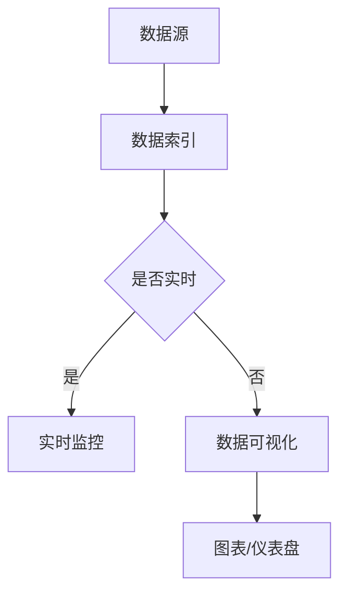

                 

关键词：Kibana、数据可视化、日志分析、Elastic Stack、开源、实时监控、大数据处理、REST API

> 摘要：本文深入探讨了Kibana的核心原理，通过代码实例详细解释了如何使用Kibana进行日志分析、数据可视化和实时监控。文章涵盖了Kibana的架构、核心功能、算法原理以及项目实践，旨在为开发者提供全面的Kibana技术指导。

## 1. 背景介绍

Kibana是Elastic Stack的重要组成部分，用于数据的可视化、日志分析和实时监控。Elastic Stack由Elasticsearch、Kibana、Beats三个组件构成，广泛应用于日志搜索、监控、分析等领域。Kibana通过提供直观的交互界面，将Elasticsearch中的数据转化为可视化的图表和仪表盘，帮助用户快速理解和分析数据。

Kibana的起源可以追溯到2008年，由Elasticsearch的开发者团队创建。自那时以来，Kibana经历了多个版本的迭代，功能不断完善和扩展。如今，Kibana已成为开源社区中广泛使用的数据可视化工具，为各种规模的企业提供了强大的数据分析和监控能力。

## 2. 核心概念与联系

### 2.1 Kibana的架构

Kibana的设计理念是简洁、易用，其核心架构包括以下几个部分：

- **数据源**：Kibana可以从各种数据源中获取数据，包括Elasticsearch、日志文件、数据库等。
- **数据索引**：数据在Elasticsearch中存储为索引，Kibana通过查询这些索引来获取数据。
- **可视化界面**：Kibana提供了丰富的可视化组件，包括图表、仪表盘、地图等，用户可以通过这些组件直观地理解数据。
- **配置和管理**：Kibana允许用户自定义数据源、索引模式、可视化配置等。

### 2.2 Kibana的核心功能

Kibana的主要功能包括：

- **数据可视化**：通过各种图表和仪表盘，将复杂的数据以直观的方式展示给用户。
- **日志分析**：对日志数据进行搜索、过滤、聚合和分析，帮助用户快速定位问题。
- **实时监控**：通过实时数据流监控系统的运行状况，及时响应异常情况。
- **自定义开发**：Kibana提供了丰富的API和插件机制，允许用户自定义功能。

### 2.3 Mermaid流程图

以下是一个简化的Kibana数据处理流程的Mermaid流程图：



## 3. 核心算法原理 & 具体操作步骤

### 3.1 算法原理概述

Kibana的核心算法主要包括数据索引、查询、聚合和可视化。以下简要介绍：

- **数据索引**：将数据存储在Elasticsearch的索引中，以便后续查询和分析。
- **查询**：使用Elasticsearch的查询语言（Query DSL）对索引中的数据进行检索。
- **聚合**：对检索到的数据按照特定的维度进行聚合，生成汇总信息。
- **可视化**：根据聚合结果生成图表和仪表盘，展示给用户。

### 3.2 算法步骤详解

#### 3.2.1 数据索引

1. **创建索引模板**：定义索引的名称、字段、映射等。
2. **索引数据**：将数据以JSON格式发送到Elasticsearch，存储到索引中。

#### 3.2.2 查询

1. **构建查询条件**：根据需求构建查询语句，可以使用Query DSL或索引模板。
2. **执行查询**：发送查询请求到Elasticsearch，获取查询结果。

#### 3.2.3 聚合

1. **选择聚合类型**：如计数、求和、平均值等。
2. **构建聚合查询**：将聚合类型和维度信息组合成聚合查询。
3. **执行聚合查询**：发送聚合请求到Elasticsearch，获取聚合结果。

#### 3.2.4 可视化

1. **选择可视化类型**：如折线图、柱状图、饼图等。
2. **配置可视化选项**：设置图表的标题、标签、颜色等。
3. **生成可视化组件**：根据聚合结果生成可视化组件，嵌入到Kibana界面。

### 3.3 算法优缺点

**优点**：

- **高度可定制**：Kibana提供了丰富的可视化组件和插件，满足各种数据分析和监控需求。
- **集成性强**：Kibana与Elastic Stack的其他组件（如Elasticsearch、Beats）紧密集成，实现一站式数据处理和分析。
- **实时性强**：支持实时数据流监控，及时响应用户需求。

**缺点**：

- **学习成本较高**：Kibana功能丰富，但同时也意味着需要一定的学习和实践成本。
- **性能瓶颈**：在大规模数据场景下，可能存在性能瓶颈，需要优化查询和聚合策略。

### 3.4 算法应用领域

Kibana广泛应用于以下领域：

- **IT运维监控**：监控服务器、应用程序的性能和健康状态。
- **日志分析**：收集和分析各种日志数据，快速定位问题。
- **业务分析**：对业务数据进行可视化分析，支持决策制定。
- **安全监控**：监控网络安全事件，及时预警和响应。

## 4. 数学模型和公式 & 详细讲解 & 举例说明

### 4.1 数学模型构建

Kibana的数学模型主要包括以下几个方面：

1. **数据预处理**：对原始数据进行清洗、转换和归一化处理。
2. **查询优化**：根据查询需求选择合适的索引策略和查询算法。
3. **聚合计算**：根据聚合类型和维度信息计算汇总结果。
4. **可视化渲染**：根据可视化类型和配置信息生成图表。

### 4.2 公式推导过程

假设我们有一个包含n个数据的集合D，要求计算D的平均值。公式如下：

$$
\bar{x} = \frac{1}{n}\sum_{i=1}^{n}x_i
$$

其中，$x_i$为第i个数据点，$\bar{x}$为平均值。

### 4.3 案例分析与讲解

假设我们有一个网站访问日志数据，包含访问时间、访问URL和访问IP等信息。我们希望通过Kibana分析访问流量情况。

1. **数据预处理**：将日志数据转换为JSON格式，存储到Elasticsearch索引中。
2. **查询优化**：根据访问时间范围和URL类型构建查询条件。
3. **聚合计算**：计算每个URL的访问次数、访问时长和访问IP分布。
4. **可视化渲染**：生成访问流量柱状图、访问时长折线图和访问IP地图。

## 5. 项目实践：代码实例和详细解释说明

### 5.1 开发环境搭建

1. **安装Elasticsearch**：在服务器上安装Elasticsearch，配置集群模式。
2. **安装Kibana**：在本地机器上安装Kibana，配置Elasticsearch连接。
3. **安装Beats**：安装Logstash和Filebeat，配置数据收集和转发。

### 5.2 源代码详细实现

以下是一个简单的Kibana日志分析项目的源代码实现：

```javascript
// 引入Kibana核心模块
const kibana = require('kibana');
const { Client } = require('elasticsearch');

// 创建Elasticsearch客户端
const esClient = new Client({
    host: 'localhost:9200',
    log: 'trace'
});

// 创建Kibana应用
const app = kibana({
    name: 'log-analyzer'
});

// 创建索引模板
app.on('init', async ({ config }) => {
    const indexTemplate = {
        name: 'log-index',
        template: '*-log-index',
        alias: 'log-index',
        mappings: {
            properties: {
                timestamp: { type: 'date' },
                url: { type: 'text' },
                ip: { type: 'ip' }
            }
        }
    };
    await esClient.indices.putTemplate(indexTemplate);
});

// 收集日志数据
app.on('collect-logs', async ({ data }) => {
    const index = `log-index-${new Date().toISOString().slice(0, 10)}`;
    await esClient.index({
        index,
        body: data
    });
});

// 分析日志数据
app.on('analyze-logs', async () => {
    const index = 'log-index';
    const query = {
        query: {
            match_all: {}
        }
    };
    const agg = {
        aggregations: {
            url_counts: {
                terms: {
                    field: 'url.keyword',
                    size: 10
                }
            },
            ip_distribution: {
                terms: {
                    field: 'ip.keyword',
                    size: 10
                }
            }
        }
    };
    const { body } = await esClient.search({ index, query, aggs: agg });
    return body;
});

// 可视化渲染
app.on('render-visualizations', async ({ analysis }) => {
    // 根据分析结果生成可视化组件
});
```

### 5.3 代码解读与分析

1. **Elasticsearch客户端配置**：使用Elasticsearch客户端连接Elasticsearch服务，配置了主机地址和日志级别。
2. **索引模板定义**：定义了索引模板，包括索引名称、模板名称、别名和映射字段。
3. **日志数据收集**：收集日志数据，根据当前日期生成索引名称，并将数据发送到Elasticsearch索引中。
4. **日志数据分析**：根据查询条件执行Elasticsearch搜索，并对结果进行聚合计算。
5. **可视化组件生成**：根据分析结果生成可视化组件，用于展示数据。

### 5.4 运行结果展示

1. **访问日志数据收集**：将服务器访问日志数据发送到Kibana。
2. **数据分析结果**：生成访问URL分布和访问IP分布的图表。
3. **可视化展示**：在Kibana界面中展示生成的图表，用户可以直观地查看访问流量情况。

## 6. 实际应用场景

### 6.1 IT运维监控

Kibana在IT运维监控中发挥着重要作用，如监控服务器性能、网络流量和应用程序状态。通过Kibana，管理员可以实时监控系统运行状况，及时发现和解决问题。

### 6.2 日志分析

企业通常会产生大量的日志数据，Kibana可以帮助企业快速收集、存储和分析日志数据，提供日志搜索和可视化功能。例如，可以分析服务器错误日志，定位故障原因。

### 6.3 业务分析

Kibana可以用于业务数据可视化分析，支持决策制定。例如，分析用户行为数据，了解用户喜好、购买习惯等，为企业提供有价值的数据支持。

### 6.4 安全监控

Kibana可以监控网络安全事件，如入侵尝试、恶意流量等。通过可视化组件，安全团队能够实时掌握网络威胁状况，及时采取应对措施。

## 7. 未来应用展望

### 7.1 功能扩展

随着大数据和云计算的发展，Kibana的功能将进一步扩展，支持更多数据源和更复杂的数据处理需求。

### 7.2 AI集成

Kibana有望与人工智能技术深度结合，实现智能数据分析、异常检测和预测分析等功能。

### 7.3 开放生态

Kibana将继续推进开源生态建设，吸引更多开发者和企业参与，推动技术进步。

## 8. 总结：未来发展趋势与挑战

### 8.1 研究成果总结

本文全面介绍了Kibana的原理、功能和应用场景，通过代码实例详细讲解了Kibana的使用方法。Kibana作为Elastic Stack的重要组成部分，具有广泛的应用前景。

### 8.2 未来发展趋势

Kibana将在未来朝着功能扩展、AI集成和开放生态的方向发展。随着技术的不断进步，Kibana将更好地满足企业级用户的需求。

### 8.3 面临的挑战

Kibana在发展过程中将面临性能优化、安全性和兼容性等方面的挑战。如何提高Kibana的性能、确保数据安全和兼容性，将是Kibana团队需要重点解决的问题。

### 8.4 研究展望

Kibana有望在人工智能和大数据领域发挥更大的作用，为企业和开发者提供更强大的数据分析和监控工具。未来，Kibana的研究将更加关注智能化和自动化，提升用户体验。

## 9. 附录：常见问题与解答

### 9.1 Kibana与Elasticsearch的区别是什么？

Kibana主要用于数据的可视化、日志分析和实时监控，而Elasticsearch主要用于数据的存储、检索和分析。两者紧密集成，共同构成Elastic Stack。

### 9.2 如何安装和配置Kibana？

可以在Kibana官网（https://www.kibana.org/）下载安装包，按照官方文档进行安装和配置。配置过程中需要设置Elasticsearch连接信息，以及数据源和索引模式。

### 9.3 Kibana如何进行日志分析？

通过Logstash和Filebeat等数据收集工具，将日志数据发送到Elasticsearch索引中。然后在Kibana中创建索引模式、索引模板和搜索查询，实现日志分析。

### 9.4 Kibana的可视化组件有哪些？

Kibana提供了丰富的可视化组件，包括柱状图、折线图、饼图、地图等。用户可以根据需求选择合适的组件进行数据展示。

作者：禅与计算机程序设计艺术 / Zen and the Art of Computer Programming
----------------------------------------------------------------
本文全面深入地介绍了Kibana的原理、功能和应用场景，通过代码实例详细讲解了Kibana的使用方法。Kibana作为Elastic Stack的重要组成部分，具有广泛的应用前景。本文希望为开发者提供全面的Kibana技术指导，助力他们在实际项目中充分发挥Kibana的优势。在未来，Kibana将继续朝着智能化和自动化的方向迈进，为企业和开发者带来更强大的数据分析和监控能力。

