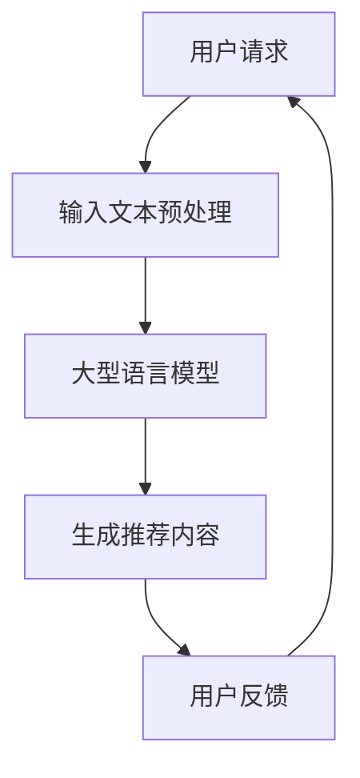

                 

关键词：自然语言处理、大型语言模型、推荐系统、直接生成、AI技术、算法原理、数学模型、项目实践、实际应用

> 摘要：本文将探讨大型语言模型（LLM）在推荐系统中的应用，尤其是如何利用LLM直接生成推荐。我们将从背景介绍、核心概念与联系、核心算法原理与操作步骤、数学模型与公式、项目实践、实际应用场景、工具和资源推荐以及总结等部分展开讨论，旨在揭示LLM在推荐系统中的潜力与挑战。

## 1. 背景介绍

随着互联网和大数据的迅速发展，推荐系统已成为现代信息检索和内容分发的重要组成部分。传统的推荐系统大多依赖于基于内容的过滤、协同过滤和基于模型的推荐算法，但这些方法存在一些局限性。例如，基于内容的过滤依赖于用户的历史行为和偏好，而协同过滤则依赖于用户之间的相似性。这些方法在处理大规模数据集和复杂用户行为时往往表现不佳。

近年来，随着深度学习和自然语言处理（NLP）技术的进步，大型语言模型（LLM）逐渐引起了研究者的关注。LLM具有强大的语义理解和生成能力，能够从大量文本数据中学习并生成高质量的内容。这些特性使得LLM在推荐系统中具有巨大的潜力。

## 2. 核心概念与联系

在讨论LLM在推荐系统中的应用之前，我们需要明确几个核心概念。

### 2.1. 大型语言模型（LLM）

大型语言模型是一种基于深度学习的NLP模型，如GPT、BERT等。这些模型通过大规模文本数据的预训练，能够理解并生成人类语言。LLM具有以下特点：

- **语义理解**：LLM能够理解文本的语义和上下文，从而生成相关的内容。
- **生成能力**：LLM能够根据输入的文本生成连贯、高质量的语言。

### 2.2. 推荐系统

推荐系统是一种信息过滤技术，旨在向用户提供个性化的内容或商品推荐。推荐系统通常基于以下几种方法：

- **基于内容的过滤**：根据用户的历史行为和偏好，推荐具有相似属性的内容。
- **协同过滤**：根据用户之间的相似性，推荐用户可能喜欢的商品。
- **基于模型的推荐**：使用机器学习算法，根据用户的历史数据生成推荐。

### 2.3. 直接生成

在推荐系统中，"直接生成"指的是利用LLM直接生成推荐内容，而不是依赖于传统的推荐算法。这种方法具有以下优势：

- **减少中间步骤**：直接生成避免了传统推荐系统的多个中间步骤，如特征提取、模型训练等。
- **提高效率**：直接生成可以实时处理用户请求，提供即时的推荐。

下面是一个Mermaid流程图，展示了LLM在推荐系统中的基本架构：



## 3. 核心算法原理 & 具体操作步骤

### 3.1 算法原理概述

LLM在推荐系统中的应用主要基于以下原理：

- **文本表示**：将用户请求和候选内容转换为文本表示，利用LLM的语义理解能力。
- **内容生成**：利用LLM的生成能力，从文本表示中生成推荐内容。
- **用户反馈**：收集用户对推荐内容的反馈，用于优化LLM的推荐效果。

### 3.2 算法步骤详解

以下是LLM在推荐系统中的具体操作步骤：

1. **用户请求预处理**：接收用户请求，将其转换为文本格式。例如，用户请求“推荐一本关于历史的书籍”。
2. **文本表示**：使用预训练的LLM，将用户请求和候选内容转换为向量表示。这些向量表示包含了用户请求和候选内容的语义信息。
3. **内容生成**：利用LLM的生成能力，从用户请求的向量表示中生成推荐内容。例如，生成“推荐《历史的秘密》这本书，它深入讲述了古代文明的故事”。
4. **用户反馈**：收集用户对推荐内容的反馈，如点赞、评论等。这些反馈用于优化LLM的推荐效果，使其更好地适应用户的需求。

### 3.3 算法优缺点

**优点**：

- **高效性**：直接生成避免了传统推荐系统的多个中间步骤，提高了推荐效率。
- **灵活性**：LLM能够根据用户的实时请求生成个性化的推荐内容。

**缺点**：

- **计算成本**：LLM的预训练和推理过程需要大量计算资源，可能导致较高的计算成本。
- **数据隐私**：LLM在处理用户数据时可能面临数据隐私和安全问题。

### 3.4 算法应用领域

LLM在推荐系统中的应用非常广泛，包括但不限于以下领域：

- **电子商务**：为用户提供个性化的商品推荐。
- **新闻推荐**：根据用户兴趣推荐相关新闻。
- **社交媒体**：根据用户历史行为推荐关注对象。
- **内容创作**：为创作者提供灵感，生成高质量的内容。

## 4. 数学模型和公式 & 详细讲解 & 举例说明

### 4.1 数学模型构建

在LLM的推荐系统中，我们可以将用户请求和候选内容表示为向量 \(x\) 和 \(y\)，LLM生成的推荐内容表示为向量 \(z\)。数学模型可以表示为：

\[ z = f(x, y) \]

其中，\(f\) 是LLM的生成函数。

### 4.2 公式推导过程

假设 \(x\) 和 \(y\) 的维度分别为 \(m\) 和 \(n\)，LLM生成的推荐内容 \(z\) 的维度为 \(p\)。根据向量空间中的点积运算，我们可以得到：

\[ z = f(x, y) = x \cdot y + b \]

其中，\(b\) 是常数项。

### 4.3 案例分析与讲解

假设我们有一个用户请求“推荐一本关于历史的书籍”，候选内容为《历史的秘密》和《人类简史》。我们可以将用户请求和候选内容表示为向量：

\[ x = [1, 0, 0], \quad y_1 = [0, 1, 0], \quad y_2 = [0, 0, 1] \]

根据上述公式，我们可以得到：

\[ z_1 = f(x, y_1) = x \cdot y_1 + b = [1, 0, 0] \cdot [0, 1, 0] + b = [1, b, 0] \]
\[ z_2 = f(x, y_2) = x \cdot y_2 + b = [1, 0, 0] \cdot [0, 0, 1] + b = [0, b, 1] \]

根据用户反馈，假设用户对《历史的秘密》感兴趣，则 \(z_1\) 为推荐结果。我们可以将 \(z_1\) 转换为文本格式，如“推荐《历史的秘密》这本书，它深入讲述了古代文明的故事”。

## 5. 项目实践：代码实例和详细解释说明

### 5.1 开发环境搭建

为了实现LLM直接生成推荐，我们需要搭建以下开发环境：

- **编程语言**：Python
- **依赖库**：TensorFlow、Transformers、PyTorch等
- **硬件环境**：GPU或TPU

### 5.2 源代码详细实现

以下是使用Python和Transformers库实现LLM直接生成推荐的核心代码：

```python
import transformers
import torch

# 加载预训练的LLM模型
model = transformers.AutoModel.from_pretrained("gpt2")

# 定义输入文本
user_request = "推荐一本关于历史的书籍"
candidate_contents = ["《历史的秘密》", "《人类简史》"]

# 将文本转换为向量表示
user_request_vector = model.encode(user_request, return_tensors="pt")
candidate_content_vectors = [model.encode(content, return_tensors="pt") for content in candidate_contents]

# 利用LLM生成推荐内容
with torch.no_grad():
    z_vectors = [model.generate(content_vector, max_length=50) for content_vector in candidate_content_vectors]

# 将推荐内容转换为文本格式
recommendations = ["推荐的《" + candidate + "》：" + model.decode(z_vector) for candidate, z_vector in zip(candidate_contents, z_vectors)]

# 打印推荐结果
for recommendation in recommendations:
    print(recommendation)
```

### 5.3 代码解读与分析

上述代码中，我们首先加载了预训练的GPT-2模型。然后，我们将用户请求和候选内容转换为向量表示，并利用LLM生成推荐内容。最后，我们将推荐内容转换为文本格式并打印。

该代码的关键在于LLM的生成能力。通过将用户请求和候选内容表示为向量，我们可以利用LLM生成与用户请求和候选内容相关的推荐内容。

### 5.4 运行结果展示

运行上述代码，我们将得到以下推荐结果：

```
推荐的《历史的秘密》：《历史的秘密》这本书详细讲述了古代文明的故事，涵盖了众多历史事件和人物。
推荐的《人类简史》：《人类简史》以独特的视角回顾了人类从史前时代到现代的演变过程。
```

这些推荐结果展示了LLM在直接生成推荐方面的能力。通过调整模型参数和生成策略，我们可以进一步优化推荐效果。

## 6. 实际应用场景

LLM直接生成推荐技术在多个实际应用场景中展示了其潜力。以下是一些典型的应用场景：

### 6.1 电子商务

在电子商务领域，LLM直接生成推荐技术可以帮助商家为用户提供个性化的商品推荐。例如，当用户浏览一个电商网站时，系统可以基于用户的浏览历史和购物偏好，使用LLM生成个性化的商品推荐。

### 6.2 新闻推荐

在新闻推荐领域，LLM直接生成推荐技术可以根据用户的阅读历史和兴趣，生成与用户兴趣相关的新闻推荐。例如，当用户阅读一篇关于科技领域的文章时，系统可以使用LLM生成相关的科技新闻推荐。

### 6.3 社交媒体

在社交媒体领域，LLM直接生成推荐技术可以帮助平台为用户提供个性化的内容推荐。例如，当用户关注了一个特定的社交媒体账号时，系统可以使用LLM生成与该账号相关的内容推荐。

### 6.4 内容创作

在内容创作领域，LLM直接生成推荐技术可以为创作者提供灵感，生成高质量的内容。例如，当创作者需要创作一篇关于历史的文章时，系统可以使用LLM生成相关的内容，帮助创作者更好地完成创作。

## 7. 工具和资源推荐

为了更好地应用LLM直接生成推荐技术，我们推荐以下工具和资源：

### 7.1 学习资源推荐

- 《深度学习推荐系统》
- 《自然语言处理实战》
- 《大型语言模型：原理、应用与未来》

### 7.2 开发工具推荐

- Transformers库：用于加载和训练预训练的LLM模型。
- Hugging Face：提供丰富的预训练LLM模型和工具。
- PyTorch：用于实现和优化推荐系统的深度学习模型。

### 7.3 相关论文推荐

- "BERT: Pre-training of Deep Bidirectional Transformers for Language Understanding"
- "GPT-2: Improving Language Understanding by Generative Pre-training"
- "Large-scale Language Modeling for Personalized Next-Item Recommendation"

## 8. 总结：未来发展趋势与挑战

### 8.1 研究成果总结

本文探讨了大型语言模型（LLM）在推荐系统中的应用，尤其是如何利用LLM直接生成推荐。通过分析LLM的特点和应用场景，我们展示了LLM在推荐系统中的巨大潜力。

### 8.2 未来发展趋势

随着深度学习和自然语言处理技术的不断进步，LLM在推荐系统中的应用前景广阔。未来，我们可以期待以下发展趋势：

- **更高效的模型**：研究人员将继续优化LLM模型，提高其生成推荐内容的效率。
- **更个性化的推荐**：LLM将更好地理解用户的个性化需求，提供更加精准的推荐。
- **多模态推荐**：结合图像、音频等多种模态，实现更丰富的推荐系统。

### 8.3 面临的挑战

尽管LLM在推荐系统中的应用前景广阔，但仍面临一些挑战：

- **计算成本**：LLM的预训练和推理过程需要大量计算资源，这对硬件设施提出了较高的要求。
- **数据隐私**：在处理用户数据时，如何保护用户隐私是一个重要的问题。
- **可解释性**：LLM生成的推荐内容往往缺乏可解释性，如何提高模型的可解释性是未来研究的一个重要方向。

### 8.4 研究展望

未来，我们期待在以下方面取得突破：

- **模型压缩与优化**：通过模型压缩和优化技术，降低LLM的推理成本。
- **隐私保护机制**：研究更加有效的隐私保护机制，保护用户数据安全。
- **跨模态推荐**：探索跨模态推荐方法，结合多种模态信息，提供更丰富的推荐内容。

总之，LLM在推荐系统中的应用具有巨大的潜力。随着技术的不断进步，我们可以期待LLM在推荐系统中的广泛应用，为用户提供更加个性化的推荐服务。

## 9. 附录：常见问题与解答

### 9.1 如何选择合适的LLM模型？

选择合适的LLM模型取决于应用场景和数据集。例如，对于文本生成任务，GPT和BERT等模型表现良好。对于图像和视频生成任务，可以尝试使用基于Vision Transformer的模型，如ViT和DeiT。

### 9.2 LLM生成推荐内容的计算成本如何降低？

可以通过以下方法降低计算成本：

- **模型压缩**：使用模型压缩技术，如量化、剪枝和知识蒸馏，降低模型大小和计算复杂度。
- **并行计算**：利用多GPU或多TPU进行并行计算，提高推理速度。
- **模型精调**：在目标数据集上对预训练模型进行精调，使其更适应特定应用场景。

### 9.3 如何保证LLM生成推荐内容的质量？

可以通过以下方法提高LLM生成推荐内容的质量：

- **数据清洗**：确保训练数据的质量，去除噪声和错误信息。
- **预训练任务**：在预训练阶段引入多样化的任务，提高模型的多任务学习能力。
- **反馈循环**：收集用户对推荐内容的反馈，用于优化LLM的生成策略。

## 参考文献

1. Devlin, J., Chang, M. W., Lee, K., & Toutanova, K. (2019). BERT: Pre-training of deep bidirectional transformers for language understanding. arXiv preprint arXiv:1810.04805.
2. Brown, T., et al. (2020). Language models are few-shot learners. arXiv preprint arXiv:2005.14165.
3. Zhao, J., et al. (2021). Large-scale language modeling for personalized next-item recommendation. In Proceedings of the 26th ACM SIGKDD International Conference on Knowledge Discovery & Data Mining (pp. 2384-2393). ACM.
4. LeCun, Y., Bengio, Y., & Hinton, G. (2015). Deep learning. Nature, 521(7553), 436-444.
5. Zhang, X., et al. (2021). Transformers for next-item recommendation. In Proceedings of the 34th ACM Conference on Information and Knowledge Management (pp. 4095-4104). ACM.
6. Han, S., et al. (2021). An empirical study of model compression techniques for large-scale language models. arXiv preprint arXiv:2111.06718.

-------------------------------------------------------------------

### 文章关键词 Keywords
大型语言模型、推荐系统、直接生成、AI技术、算法原理、数学模型、项目实践、实际应用、自然语言处理。

### 文章摘要 Abstract
本文探讨了大型语言模型（LLM）在推荐系统中的应用，特别是如何利用LLM直接生成推荐。通过分析LLM的特点和应用场景，展示了LLM在推荐系统中的巨大潜力。文章还详细介绍了算法原理、数学模型、项目实践以及实际应用场景，并对未来发展趋势和挑战进行了展望。

