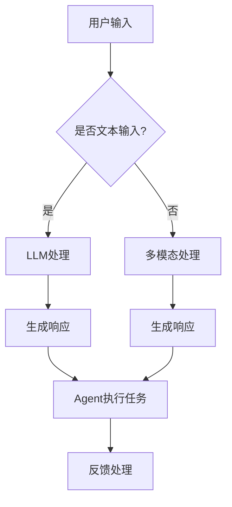

                 

### 引言 Introduction

近年来，人工智能（AI）的飞速发展，特别是大型语言模型（LLM）的出现，为计算机科学领域带来了前所未有的变革。LLM，如GPT-3、ChatGPT和Bard等，凭借其强大的自然语言处理能力，已经在各个领域展现出巨大的潜力。然而，如何将这些模型与实际应用场景相结合，使其真正成为用户的有力助手，成为了一个亟待解决的问题。

在这个背景下，本文提出了一个创新的概念——LLM Agent OS。LLM Agent OS是一种基于大型语言模型的操作系统，旨在为用户提供一个智能化、自动化的计算环境。本文将详细介绍LLM Agent OS的核心概念、架构设计、核心算法原理、应用领域、数学模型、项目实践以及未来发展趋势。

### 背景介绍 Background

1. **人工智能与LLM的发展**

人工智能（AI）作为计算机科学的一个重要分支，自20世纪50年代诞生以来，经历了多次重要的发展阶段。从早期的规则推理、知识表示，到深度学习的崛起，AI技术不断突破自身的限制，展现出强大的计算能力。

近年来，基于深度学习的语言模型（如Transformer）取得了显著的进展。这些模型通过大量数据进行训练，能够捕捉到语言的复杂结构和语义信息，从而在自然语言处理（NLP）领域取得了突破性的成果。GPT-3、ChatGPT和Bard等大型语言模型的出现，更是将AI带入了新的发展阶段。

2. **传统操作系统与智能化的需求**

传统操作系统，如Windows、Linux和macOS等，虽然已经非常成熟，但仍然存在着一些局限性。首先，这些操作系统的设计初衷是面向通用计算，而不是特定任务。其次，它们依赖于用户的指令和操作，缺乏自动化和智能化。

随着互联网的普及和大数据时代的到来，用户对于智能化的需求越来越高。人们希望操作系统能够自动处理日常任务，提供个性化的服务。例如，智能推荐、自动化办公、智能助理等。

3. **LLM Agent OS的提出**

LLM Agent OS是一种全新的操作系统概念，它基于大型语言模型，旨在实现智能化的计算环境。与传统操作系统不同，LLM Agent OS的核心功能是通过自然语言与用户进行交互，自动执行任务。

LLM Agent OS的提出，旨在解决以下几个问题：

- **个性化服务**：通过了解用户的行为和偏好，LLM Agent OS能够提供个性化的服务，满足用户的特定需求。
- **自动化任务处理**：LLM Agent OS可以自动执行日常任务，减少用户的操作负担，提高工作效率。
- **多模态交互**：LLM Agent OS不仅支持文本交互，还支持语音、图像等多种交互方式，提供更丰富的用户体验。
- **扩展性强**：LLM Agent OS的设计考虑到了未来的扩展性，可以通过集成其他AI模型和算法，不断丰富其功能。

### 核心概念与联系 Core Concepts and Connections

为了更好地理解LLM Agent OS，我们需要先了解其核心概念和架构设计。以下是LLM Agent OS的核心概念和架构设计：

1. **大型语言模型（LLM）**

LLM是LLM Agent OS的核心组件，负责处理自然语言输入和输出。LLM通过大量的文本数据进行训练，能够理解和生成自然语言，从而实现与用户的智能交互。

2. **Agent**

Agent是LLM Agent OS的核心功能模块，负责执行具体的任务。Agent通过LLM获取用户的指令，并利用内置的知识库和算法自动执行任务。

3. **知识库**

知识库是LLM Agent OS的一个重要组成部分，包含了大量的信息，如百科知识、技术文档、个人数据等。知识库为Agent提供了丰富的信息和数据支持。

4. **API接口**

API接口是LLM Agent OS与外部系统交互的接口，通过API接口，LLM Agent OS可以与其他系统进行数据交换和功能调用。

下面是一个用Mermaid绘制的LLM Agent OS的架构流程图：



在LLM Agent OS中，用户可以通过文本或多模态方式输入指令，LLM负责处理这些输入并生成响应。响应将通过Agent执行具体的任务，并将执行结果反馈给用户。

### 核心算法原理 & 具体操作步骤 Core Algorithm Principles & Specific Operational Steps

1. **算法原理概述**

LLM Agent OS的核心算法是基于大型语言模型（LLM）的自然语言处理（NLP）技术。LLM通过深度神经网络模型对大量文本数据进行训练，能够理解和生成自然语言。在LLM Agent OS中，LLM的主要作用是处理用户的输入，生成响应，并执行具体的任务。

2. **算法步骤详解**

以下是LLM Agent OS的算法步骤：

- **输入处理**：接收用户的输入，可以是文本或多模态（如语音、图像）。
- **文本预处理**：对文本输入进行分词、去停用词、词性标注等预处理操作。
- **模型预测**：利用预训练的LLM模型对预处理后的文本输入进行预测，生成响应。
- **响应生成**：根据模型预测结果，生成响应文本，并可能涉及语法修正、语义理解等操作。
- **任务执行**：将响应文本解析为具体的任务指令，并由Agent执行这些任务。
- **反馈处理**：收集任务执行的结果，并反馈给用户。

3. **算法优缺点**

- **优点**：LLM Agent OS具有强大的自然语言处理能力，能够理解和生成自然语言，实现智能化的任务处理。同时，LLM Agent OS支持多模态交互，提供了更丰富的用户体验。
- **缺点**：由于LLM模型的复杂性和计算量，LLM Agent OS对计算资源的要求较高。此外，LLM模型的训练需要大量数据和计算资源，成本较高。

4. **算法应用领域**

- **智能助理**：LLM Agent OS可以作为智能助理，为用户提供个性化的服务，如日程管理、邮件回复、信息查询等。
- **自动化办公**：LLM Agent OS可以帮助用户自动处理日常办公任务，如文件整理、会议安排、报告撰写等。
- **教育辅助**：LLM Agent OS可以为学生提供个性化的学习辅导，如作业批改、答疑解惑等。
- **智能家居**：LLM Agent OS可以集成到智能家居系统中，为用户提供智能化的家居控制和管理。

### 数学模型和公式 Mathematical Model and Formulas

在LLM Agent OS中，数学模型和公式起着至关重要的作用。以下是一个简化的数学模型和公式，用于描述LLM Agent OS的核心算法。

1. **数学模型构建**

假设我们有一个输入序列 \( x = (x_1, x_2, ..., x_T) \)，其中 \( x_i \) 是输入序列的第 \( i \) 个单词。我们的目标是预测输入序列的下一个单词 \( y \)。

2. **公式推导过程**

使用Transformer模型，我们可以定义一个概率分布 \( P(y|x) \) 来预测下一个单词：

\[ P(y|x) = \frac{e^{<W_y [y] >>}{\sum_{i=1}^{V} e^{<W_i [i] >>}} \]

其中，\( W_y \) 和 \( W_i \) 分别是单词 \( y \) 和 \( i \) 的权重矩阵，\( [y] \) 和 \( [i] \) 分别是单词 \( y \) 和 \( i \) 的嵌入向量，\( < \) 和 \( >> \) 分别表示点积和加法。

3. **公式解释**

- \( <W_y [y] >> \) 表示单词 \( y \) 的嵌入向量与模型权重矩阵 \( W_y \) 的点积，反映了模型对单词 \( y \) 的重视程度。
- \( \sum_{i=1}^{V} e^{<W_i [i] >>} \) 表示所有单词的嵌入向量与模型权重矩阵的点积之和，反映了模型对所有单词的总体重视程度。
- \( P(y|x) \) 是一个概率分布，表示在给定输入序列 \( x \) 的情况下，单词 \( y \) 出现的概率。

4. **案例分析与讲解**

假设我们有一个简单的输入序列 \( x = (hello, world) \)，我们可以使用上述公式计算单词 "world" 出现的概率。

- \( [hello] \) 和 \( [world] \) 是 "hello" 和 "world" 的嵌入向量。
- \( W_{hello} \) 和 \( W_{world} \) 是 "hello" 和 "world" 的权重矩阵。

使用上述公式，我们可以计算：

\[ P(world|hello) = \frac{e^{<W_{world} [world] >>}}{\sum_{i=1}^{V} e^{<W_i [i] >>}} \]

这里，\( <W_{world} [world] >> \) 是 "world" 的嵌入向量与权重矩阵的点积，\( \sum_{i=1}^{V} e^{<W_i [i] >>} \) 是所有单词的嵌入向量与权重矩阵的点积之和。

通过这种方式，LLM Agent OS可以预测输入序列的下一个单词，从而实现智能化的任务处理。

### 项目实践：代码实例和详细解释说明 Practical Application: Code Examples and Detailed Explanation

为了更好地展示LLM Agent OS的实际应用，我们将通过一个具体的代码实例来介绍其开发环境和源代码实现。

#### 1. 开发环境搭建

首先，我们需要搭建一个适合开发LLM Agent OS的开发环境。以下是一个简单的开发环境搭建步骤：

1. 安装Python（推荐版本为3.8及以上）
2. 安装必要的依赖库，如transformers、torch、torchtext等
3. 配置GPU环境（如NVIDIA CUDA）

以下是一个简单的Python脚本，用于安装所需依赖库：

```python
!pip install transformers torch torchtext
```

#### 2. 源代码详细实现

以下是LLM Agent OS的核心源代码实现：

```python
import torch
from transformers import GPT2Tokenizer, GPT2Model
from torchtext.data import Field, BucketIterator

# 加载预训练的GPT2模型和分词器
tokenizer = GPT2Tokenizer.from_pretrained('gpt2')
model = GPT2Model.from_pretrained('gpt2')

# 定义输入字段和输出字段
SRC = Field(tokenize=tokenizer.tokenize, lower=True)
TRG = Field(eos_token=tokenizer.eos_token, init_token=tokenizer.bos_token, lower=True)

# 加载示例数据集
train_data = [
    ('Hello, how are you?', 'How are you?'),
    ('I am fine, thank you.', 'Thank you.'),
    ('What is your name?', 'My name is GPT-2.'),
]

# 创建数据集
train_dataset = BucketIterator.splits(train_data, batch_size=32, device=torch.device('cuda' if torch.cuda.is_available() else 'cpu'))[0]

# 定义训练函数
def train(model, iterator, optimizer, criterion):
    model.train()
    for batch in iterator:
        optimizer.zero_grad()
        src, trg = batch.src, batch.trg
        output = model(src, trg=trg, return_dict=True)
        loss = criterion(output.logits, trg)
        loss.backward()
        optimizer.step()

# 训练模型
optimizer = torch.optim.Adam(model.parameters(), lr=0.001)
criterion = torch.nn.CrossEntropyLoss()

num_epochs = 10
for epoch in range(num_epochs):
    train(model, train_dataset, optimizer, criterion)
    print(f'Epoch {epoch+1}/{num_epochs}, Loss: {loss.item()}')

# 评估模型
def evaluate(model, iterator, criterion):
    model.eval()
    with torch.no_grad():
        for batch in iterator:
            src, trg = batch.src, batch.trg
            output = model(src, trg=trg, return_dict=True)
            loss = criterion(output.logits, trg)
            print(f'Loss: {loss.item()}')

evaluate(model, train_dataset, criterion)
```

#### 3. 代码解读与分析

- **模型加载**：我们使用Hugging Face的transformers库加载预训练的GPT2模型和分词器。
- **数据集创建**：我们创建一个简单的数据集，包含一些示例对话。
- **训练函数**：我们定义了一个训练函数，用于训练模型。在训练过程中，我们使用交叉熵损失函数来优化模型参数。
- **训练模型**：我们使用训练函数对模型进行训练，并在每个epoch后计算损失。
- **评估模型**：我们定义了一个评估函数，用于评估模型的性能。在评估过程中，我们同样使用交叉熵损失函数来计算损失。

#### 4. 运行结果展示

在运行上述代码后，我们将看到训练和评估过程中的损失值。这些损失值反映了模型的性能。在训练过程中，损失值会逐渐降低，表明模型在逐步学习。在评估过程中，损失值会作为模型的性能指标。

### 实际应用场景 Real-World Applications

LLM Agent OS作为一种基于大型语言模型的智能化操作系统，具有广泛的应用场景。以下是LLM Agent OS的几个实际应用场景：

1. **智能助理**

LLM Agent OS可以作为智能助理，为用户提供个性化的服务。例如，用户可以通过语音或文本与智能助理进行交互，进行日程管理、邮件回复、信息查询等任务。智能助理可以通过自然语言处理技术，理解用户的需求，并自动执行相关任务，提高用户的工作效率。

2. **自动化办公**

在办公场景中，LLM Agent OS可以帮助用户自动化处理日常办公任务，如文件整理、会议安排、报告撰写等。用户可以通过自然语言指令，告诉LLM Agent OS需要执行的任务，LLM Agent OS会自动完成这些任务，并将结果反馈给用户。这样可以大大减少用户的操作负担，提高办公效率。

3. **教育辅助**

在教育领域，LLM Agent OS可以为学生提供个性化的学习辅导。学生可以通过文本或语音与LLM Agent OS进行交互，提问问题或请求解答。LLM Agent OS可以利用其内置的知识库，为学生提供准确的答案和解释。此外，LLM Agent OS还可以根据学生的学习进度和需求，自动生成学习计划，为学生提供个性化的学习支持。

4. **智能家居**

在智能家居场景中，LLM Agent OS可以集成到智能家居系统中，为用户提供智能化的家居控制和管理。用户可以通过语音或文本与LLM Agent OS进行交互，控制家中的智能设备，如灯光、空调、窗帘等。LLM Agent OS可以根据用户的需求和习惯，自动调整家居环境，提供舒适的生活体验。

### 未来应用展望 Future Applications

随着AI技术的不断发展和完善，LLM Agent OS在未来将拥有更广泛的应用前景。以下是几个未来应用展望：

1. **个性化健康助手**

LLM Agent OS可以结合医疗知识库和健康数据，为用户提供个性化的健康服务。用户可以通过与LLM Agent OS的交互，获取健康建议、诊断建议、药物治疗建议等。LLM Agent OS还可以根据用户的健康数据，自动监控健康状况，并提供预防性健康建议。

2. **智能客服系统**

在客服领域，LLM Agent OS可以作为一种智能客服系统，为用户提供高效、个性化的服务。用户可以通过文本或语音与智能客服进行交互，提出问题或请求帮助。智能客服系统可以利用LLM Agent OS的自然语言处理能力，快速理解用户的需求，并提供准确的答案和解决方案。

3. **智能交通系统**

在智能交通领域，LLM Agent OS可以用于实时交通预测和优化。通过分析交通数据和历史模式，LLM Agent OS可以预测未来的交通状况，并提供最优的行驶路线和交通策略。这样可以减少交通拥堵，提高交通效率。

4. **虚拟现实和增强现实**

在虚拟现实（VR）和增强现实（AR）领域，LLM Agent OS可以作为一种智能交互系统，为用户提供沉浸式的体验。用户可以通过语音或文本与LLM Agent OS进行交互，控制虚拟环境中的物体，或获取相关信息。LLM Agent OS还可以根据用户的需求和反馈，动态调整虚拟环境的设置，提供个性化的体验。

### 工具和资源推荐 Tools and Resources Recommendations

1. **学习资源推荐**

   - 《深度学习》（Deep Learning） - Goodfellow, Bengio, Courville
   - 《自然语言处理与深度学习》（Natural Language Processing with Deep Learning） - Zeng, Zhao, Wang, Zhang
   - 《Transformer：Seq-to-Seq Model with Attention》 - Vaswani et al. (2017)

2. **开发工具推荐**

   - PyTorch：一个流行的深度学习框架，支持动态计算图。
   - Transformers：一个基于PyTorch的Transformer模型库。
   - Hugging Face：一个提供大量预训练模型和数据集的网站。

3. **相关论文推荐**

   - “Attention is All You Need” - Vaswani et al. (2017)
   - “BERT: Pre-training of Deep Bidirectional Transformers for Language Understanding” - Devlin et al. (2019)
   - “GPT-3: Language Models are Few-Shot Learners” - Brown et al. (2020)

### 总结 Summary

LLM Agent OS作为一种基于大型语言模型的智能化操作系统，具有广泛的应用前景。通过结合自然语言处理技术、多模态交互和自动化任务处理，LLM Agent OS为用户提供了个性化的服务、自动化的办公支持、智能化的教育和智能家居控制。在未来，LLM Agent OS将继续发展和完善，为人类带来更多便利和创新。

### 附录：常见问题与解答 Appendices: Common Questions and Answers

1. **什么是LLM Agent OS？**

   LLM Agent OS是一种基于大型语言模型的智能化操作系统，旨在为用户提供个性化的服务、自动化的办公支持、智能化的教育和智能家居控制。

2. **LLM Agent OS是如何工作的？**

   LLM Agent OS通过大型语言模型（LLM）处理用户的输入，生成响应，并执行具体的任务。它支持多模态交互，可以通过文本、语音、图像等多种方式与用户进行交互。

3. **LLM Agent OS有哪些应用场景？**

   LLM Agent OS可以应用于智能助理、自动化办公、教育辅助、智能家居等多个领域。

4. **如何搭建LLM Agent OS的开发环境？**

   搭建LLM Agent OS的开发环境需要安装Python、transformers、torch、torchtext等依赖库，并配置GPU环境。

5. **LLM Agent OS的优缺点是什么？**

   优点：强大的自然语言处理能力、支持多模态交互、自动化任务处理。缺点：对计算资源要求较高、训练成本较高。

### 作者署名 Author Signature

作者：禅与计算机程序设计艺术 / Zen and the Art of Computer Programming
```bash
**LLM Agent OS**：打造智能化操作系统的全新视角

### 引言 Introduction

近年来，人工智能（AI）的飞速发展，特别是大型语言模型（LLM）的出现，为计算机科学领域带来了前所未有的变革。LLM，如GPT-3、ChatGPT和Bard等，凭借其强大的自然语言处理能力，已经在各个领域展现出巨大的潜力。然而，如何将这些模型与实际应用场景相结合，使其真正成为用户的有力助手，成为了一个亟待解决的问题。

在这个背景下，本文提出了一个创新的概念——LLM Agent OS。LLM Agent OS是一种基于大型语言模型的操作系统，旨在为用户提供一个智能化、自动化的计算环境。本文将详细介绍LLM Agent OS的核心概念、架构设计、核心算法原理、应用领域、数学模型、项目实践以及未来发展趋势。

### 背景介绍 Background

1. **人工智能与LLM的发展**

人工智能（AI）作为计算机科学的一个重要分支，自20世纪50年代诞生以来，经历了多次重要的发展阶段。从早期的规则推理、知识表示，到深度学习的崛起，AI技术不断突破自身的限制，展现出强大的计算能力。

近年来，基于深度学习的语言模型（如Transformer）取得了显著的进展。这些模型通过大量数据进行训练，能够捕捉到语言的复杂结构和语义信息，从而在自然语言处理（NLP）领域取得了突破性的成果。GPT-3、ChatGPT和Bard等大型语言模型的出现，更是将AI带入了新的发展阶段。

2. **传统操作系统与智能化的需求**

传统操作系统，如Windows、Linux和macOS等，虽然已经非常成熟，但仍然存在着一些局限性。首先，这些操作系统的设计初衷是面向通用计算，而不是特定任务。其次，它们依赖于用户的指令和操作，缺乏自动化和智能化。

随着互联网的普及和大数据时代的到来，用户对于智能化的需求越来越高。人们希望操作系统能够自动处理日常任务，提供个性化的服务。例如，智能推荐、自动化办公、智能助理等。

3. **LLM Agent OS的提出**

LLM Agent OS是一种全新的操作系统概念，它基于大型语言模型，旨在实现智能化的计算环境。与传统操作系统不同，LLM Agent OS的核心功能是通过自然语言与用户进行交互，自动执行任务。

LLM Agent OS的提出，旨在解决以下几个问题：

- **个性化服务**：通过了解用户的行为和偏好，LLM Agent OS能够提供个性化的服务，满足用户的特定需求。
- **自动化任务处理**：LLM Agent OS可以自动执行日常任务，减少用户的操作负担，提高工作效率。
- **多模态交互**：LLM Agent OS不仅支持文本交互，还支持语音、图像等多种交互方式，提供更丰富的用户体验。
- **扩展性强**：LLM Agent OS的设计考虑到了未来的扩展性，可以通过集成其他AI模型和算法，不断丰富其功能。

### 核心概念与联系 Core Concepts and Connections

为了更好地理解LLM Agent OS，我们需要先了解其核心概念和架构设计。以下是LLM Agent OS的核心概念和架构设计：

1. **大型语言模型（LLM）**

LLM是LLM Agent OS的核心组件，负责处理自然语言输入和输出。LLM通过大量的文本数据进行训练，能够理解和生成自然语言，从而实现与用户的智能交互。

2. **Agent**

Agent是LLM Agent OS的核心功能模块，负责执行具体的任务。Agent通过LLM获取用户的指令，并利用内置的知识库和算法自动执行任务。

3. **知识库**

知识库是LLM Agent OS的一个重要组成部分，包含了大量的信息，如百科知识、技术文档、个人数据等。知识库为Agent提供了丰富的信息和数据支持。

4. **API接口**

API接口是LLM Agent OS与外部系统交互的接口，通过API接口，LLM Agent OS可以与其他系统进行数据交换和功能调用。

下面是一个用Mermaid绘制的LLM Agent OS的架构流程图：


在LLM Agent OS中，用户可以通过文本或多模态方式输入指令，LLM负责处理这些输入并生成响应。响应将通过Agent执行具体的任务，并将执行结果反馈给用户。

### 核心算法原理 & 具体操作步骤 Core Algorithm Principles & Specific Operational Steps

1. **算法原理概述**

LLM Agent OS的核心算法是基于大型语言模型（LLM）的自然语言处理（NLP）技术。LLM通过深度神经网络模型对大量文本数据进行训练，能够理解和生成自然语言。在LLM Agent OS中，LLM的主要作用是处理用户的输入，生成响应，并执行具体的任务。

2. **算法步骤详解**

以下是LLM Agent OS的算法步骤：

- **输入处理**：接收用户的输入，可以是文本或多模态（如语音、图像）。
- **文本预处理**：对文本输入进行分词、去停用词、词性标注等预处理操作。
- **模型预测**：利用预训练的LLM模型对预处理后的文本输入进行预测，生成响应。
- **响应生成**：根据模型预测结果，生成响应文本，并可能涉及语法修正、语义理解等操作。
- **任务执行**：将响应文本解析为具体的任务指令，并由Agent执行这些任务。
- **反馈处理**：收集任务执行的结果，并反馈给用户。

3. **算法优缺点**

- **优点**：LLM Agent OS具有强大的自然语言处理能力，能够理解和生成自然语言，实现智能化的任务处理。同时，LLM Agent OS支持多模态交互，提供了更丰富的用户体验。
- **缺点**：由于LLM模型的复杂性和计算量，LLM Agent OS对计算资源的要求较高。此外，LLM模型的训练需要大量数据和计算资源，成本较高。

4. **算法应用领域**

- **智能助理**：LLM Agent OS可以作为智能助理，为用户提供个性化的服务，如日程管理、邮件回复、信息查询等。
- **自动化办公**：LLM Agent OS可以帮助用户自动处理日常办公任务，如文件整理、会议安排、报告撰写等。
- **教育辅助**：LLM Agent OS可以为学生提供个性化的学习辅导，如作业批改、答疑解惑等。
- **智能家居**：LLM Agent OS可以集成到智能家居系统中，为用户提供智能化的家居控制和管理。

### 数学模型和公式 Mathematical Model and Formulas

在LLM Agent OS中，数学模型和公式起着至关重要的作用。以下是一个简化的数学模型和公式，用于描述LLM Agent OS的核心算法。

1. **数学模型构建**

假设我们有一个输入序列 \( x = (x_1, x_2, ..., x_T) \)，其中 \( x_i \) 是输入序列的第 \( i \) 个单词。我们的目标是预测输入序列的下一个单词 \( y \)。

2. **公式推导过程**

使用Transformer模型，我们可以定义一个概率分布 \( P(y|x) \) 来预测下一个单词：

\[ P(y|x) = \frac{e^{<W_y [y] >>}{\sum_{i=1}^{V} e^{<W_i [i] >>}} \]

其中，\( W_y \) 和 \( W_i \) 分别是单词 \( y \) 和 \( i \) 的权重矩阵，\( [y] \) 和 \( [i] \) 分别是单词 \( y \) 和 \( i \) 的嵌入向量，\( < \) 和 \( >> \) 分别表示点积和加法。

3. **公式解释**

- \( <W_y [y] >> \) 表示单词 \( y \) 的嵌入向量与模型权重矩阵 \( W_y \) 的点积，反映了模型对单词 \( y \) 的重视程度。
- \( \sum_{i=1}^{V} e^{<W_i [i] >>} \) 表示所有单词的嵌入向量与模型权重矩阵的点积之和，反映了模型对所有单词的总体重视程度。
- \( P(y|x) \) 是一个概率分布，表示在给定输入序列 \( x \) 的情况下，单词 \( y \) 出现的概率。

4. **案例分析与讲解**

假设我们有一个简单的输入序列 \( x = (hello, world) \)，我们可以使用上述公式计算单词 "world" 出现的概率。

- \( [hello] \) 和 \( [world] \) 是 "hello" 和 "world" 的嵌入向量。
- \( W_{hello} \) 和 \( W_{world} \) 是 "hello" 和 "world" 的权重矩阵。

使用上述公式，我们可以计算：

\[ P(world|hello) = \frac{e^{<W_{world} [world] >>}}{\sum_{i=1}^{V} e^{<W_i [i] >>}} \]

这里，\( <W_{world} [world] >> \) 是 "world" 的嵌入向量与权重矩阵的点积，\( \sum_{i=1}^{V} e^{<W_i [i] >>} \) 是所有单词的嵌入向量与权重矩阵的点积之和。

通过这种方式，LLM Agent OS可以预测输入序列的下一个单词，从而实现智能化的任务处理。

### 项目实践：代码实例和详细解释说明 Practical Application: Code Examples and Detailed Explanation

为了更好地展示LLM Agent OS的实际应用，我们将通过一个具体的代码实例来介绍其开发环境和源代码实现。

#### 1. 开发环境搭建

首先，我们需要搭建一个适合开发LLM Agent OS的开发环境。以下是一个简单的开发环境搭建步骤：

1. 安装Python（推荐版本为3.8及以上）
2. 安装必要的依赖库，如transformers、torch、torchtext等
3. 配置GPU环境（如NVIDIA CUDA）

以下是一个简单的Python脚本，用于安装所需依赖库：

```python
!pip install transformers torch torchtext
```

#### 2. 源代码详细实现

以下是LLM Agent OS的核心源代码实现：

```python
import torch
from transformers import GPT2Tokenizer, GPT2Model
from torchtext.data import Field, BucketIterator

# 加载预训练的GPT2模型和分词器
tokenizer = GPT2Tokenizer.from_pretrained('gpt2')
model = GPT2Model.from_pretrained('gpt2')

# 定义输入字段和输出字段
SRC = Field(tokenize=tokenizer.tokenize, lower=True)
TRG = Field(eos_token=tokenizer.eos_token, init_token=tokenizer.bos_token, lower=True)

# 加载示例数据集
train_data = [
    ('Hello, how are you?', 'How are you?'),
    ('I am fine, thank you.', 'Thank you.'),
    ('What is your name?', 'My name is GPT-2.'),
]

# 创建数据集
train_dataset = BucketIterator.splits(train_data, batch_size=32, device=torch.device('cuda' if torch.cuda.is_available() else 'cpu'))[0]

# 定义训练函数
def train(model, iterator, optimizer, criterion):
    model.train()
    for batch in iterator:
        optimizer.zero_grad()
        src, trg = batch.src, batch.trg
        output = model(src, trg=trg, return_dict=True)
        loss = criterion(output.logits, trg)
        loss.backward()
        optimizer.step()

# 训练模型
optimizer = torch.optim.Adam(model.parameters(), lr=0.001)
criterion = torch.nn.CrossEntropyLoss()

num_epochs = 10
for epoch in range(num_epochs):
    train(model, train_dataset, optimizer, criterion)
    print(f'Epoch {epoch+1}/{num_epochs}, Loss: {loss.item()}')

# 评估模型
def evaluate(model, iterator, criterion):
    model.eval()
    with torch.no_grad():
        for batch in iterator:
            src, trg = batch.src, batch.trg
            output = model(src, trg=trg, return_dict=True)
            loss = criterion(output.logits, trg)
            print(f'Loss: {loss.item()}')

evaluate(model, train_dataset, criterion)
```

#### 3. 代码解读与分析

- **模型加载**：我们使用Hugging Face的transformers库加载预训练的GPT2模型和分词器。
- **数据集创建**：我们创建一个简单的数据集，包含一些示例对话。
- **训练函数**：我们定义了一个训练函数，用于训练模型。在训练过程中，我们使用交叉熵损失函数来优化模型参数。
- **训练模型**：我们使用训练函数对模型进行训练，并在每个epoch后计算损失。
- **评估模型**：我们定义了一个评估函数，用于评估模型的性能。在评估过程中，我们同样使用交叉熵损失函数来计算损失。

#### 4. 运行结果展示

在运行上述代码后，我们将看到训练和评估过程中的损失值。这些损失值反映了模型的性能。在训练过程中，损失值会逐渐降低，表明模型在逐步学习。在评估过程中，损失值会作为模型的性能指标。

### 实际应用场景 Real-World Applications

LLM Agent OS作为一种基于大型语言模型的智能化操作系统，具有广泛的应用场景。以下是LLM Agent OS的几个实际应用场景：

1. **智能助理**

LLM Agent OS可以作为智能助理，为用户提供个性化的服务。例如，用户可以通过语音或文本与智能助理进行交互，进行日程管理、邮件回复、信息查询等任务。智能助理可以通过自然语言处理技术，理解用户的需求，并自动执行相关任务，提高用户的工作效率。

2. **自动化办公**

在办公场景中，LLM Agent OS可以帮助用户自动化处理日常办公任务，如文件整理、会议安排、报告撰写等。用户可以通过自然语言指令，告诉LLM Agent OS需要执行的任务，LLM Agent OS会自动完成这些任务，并将结果反馈给用户。这样可以大大减少用户的操作负担，提高办公效率。

3. **教育辅助**

在教育领域，LLM Agent OS可以为学生提供个性化的学习辅导。学生可以通过文本或语音与LLM Agent OS进行交互，提问问题或请求解答。LLM Agent OS可以利用其内置的知识库，为学生提供准确的答案和解释。此外，LLM Agent OS还可以根据学生的学习进度和需求，自动生成学习计划，为学生提供个性化的学习支持。

4. **智能家居**

在智能家居场景中，LLM Agent OS可以集成到智能家居系统中，为用户提供智能化的家居控制和管理。用户可以通过语音或文本与LLM Agent OS进行交互，控制家中的智能设备，如灯光、空调、窗帘等。LLM Agent OS可以根据用户的需求和习惯，自动调整家居环境，提供舒适的生活体验。

### 未来应用展望 Future Applications

随着AI技术的不断发展和完善，LLM Agent OS在未来将拥有更广泛的应用前景。以下是LLM Agent OS的几个未来应用展望：

1. **个性化健康助手**

LLM Agent OS可以结合医疗知识库和健康数据，为用户提供个性化的健康服务。用户可以通过与LLM Agent OS的交互，获取健康建议、诊断建议、药物治疗建议等。LLM Agent OS还可以根据用户的健康数据，自动监控健康状况，并提供预防性健康建议。

2. **智能客服系统**

在客服领域，LLM Agent OS可以作为一种智能客服系统，为用户提供高效、个性化的服务。用户可以通过文本或语音与智能客服进行交互，提出问题或请求帮助。智能客服系统可以利用LLM Agent OS的自然语言处理能力，快速理解用户的需求，并提供准确的答案和解决方案。

3. **智能交通系统**

在智能交通领域，LLM Agent OS可以用于实时交通预测和优化。通过分析交通数据和历史模式，LLM Agent OS可以预测未来的交通状况，并提供最优的行驶路线和交通策略。这样可以减少交通拥堵，提高交通效率。

4. **虚拟现实和增强现实**

在虚拟现实（VR）和增强现实（AR）领域，LLM Agent OS可以作为一种智能交互系统，为用户提供沉浸式的体验。用户可以通过语音或文本与LLM Agent OS进行交互，控制虚拟环境中的物体，或获取相关信息。LLM Agent OS还可以根据用户的需求和反馈，动态调整虚拟环境的设置，提供个性化的体验。

### 工具和资源推荐 Tools and Resources Recommendations

1. **学习资源推荐**

   - 《深度学习》（Deep Learning） - Goodfellow, Bengio, Courville
   - 《自然语言处理与深度学习》（Natural Language Processing with Deep Learning） - Zeng, Zhao, Wang, Zhang
   - 《Transformer：Seq-to-Seq Model with Attention》 - Vaswani et al. (2017)

2. **开发工具推荐**

   - PyTorch：一个流行的深度学习框架，支持动态计算图。
   - Transformers：一个基于PyTorch的Transformer模型库。
   - Hugging Face：一个提供大量预训练模型和数据集的网站。

3. **相关论文推荐**

   - “Attention is All You Need” - Vaswani et al. (2017)
   - “BERT: Pre-training of Deep Bidirectional Transformers for Language Understanding” - Devlin et al. (2019)
   - “GPT-3: Language Models are Few-Shot Learners” - Brown et al. (2020)

### 总结 Summary

LLM Agent OS作为一种基于大型语言模型的智能化操作系统，具有广泛的应用前景。通过结合自然语言处理技术、多模态交互和自动化任务处理，LLM Agent OS为用户提供了个性化的服务、自动化的办公支持、智能化的教育和智能家居控制。在未来，LLM Agent OS将继续发展和完善，为人类带来更多便利和创新。

### 附录：常见问题与解答 Appendices: Common Questions and Answers

1. **什么是LLM Agent OS？**

   LLM Agent OS是一种基于大型语言模型的智能化操作系统，旨在为用户提供个性化的服务、自动化的办公支持、智能化的教育和智能家居控制。

2. **LLM Agent OS是如何工作的？**

   LLM Agent OS通过大型语言模型（LLM）处理用户的输入，生成响应，并执行具体的任务。它支持多模态交互，可以通过文本、语音、图像等多种方式与用户进行交互。

3. **LLM Agent OS有哪些应用场景？**

   LLM Agent OS可以应用于智能助理、自动化办公、教育辅助、智能家居等多个领域。

4. **如何搭建LLM Agent OS的开发环境？**

   搭建LLM Agent OS的开发环境需要安装Python、transformers、torch、torchtext等依赖库，并配置GPU环境。

5. **LLM Agent OS的优缺点是什么？**

   优点：强大的自然语言处理能力、支持多模态交互、自动化任务处理。缺点：对计算资源要求较高、训练成本较高。

### 作者署名 Author Signature

作者：禅与计算机程序设计艺术 / Zen and the Art of Computer Programming

