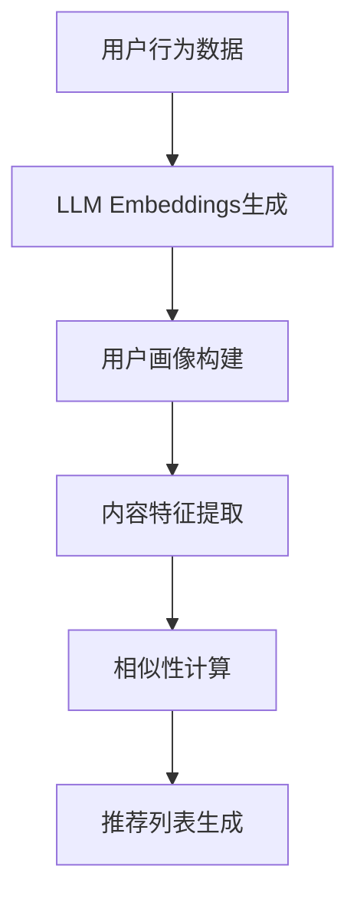

                 

关键词：LLM Embeddings、推荐系统、模式构建、算法原理、数学模型、项目实践、未来展望。

## 摘要

本文旨在深入探讨基于大型语言模型（LLM）嵌入的推荐系统建模范式。首先，我们将回顾推荐系统的发展历程和LLM技术的崛起。随后，我们将详细介绍LLM Embeddings的核心概念、原理及其与推荐系统的结合方法。文章将涵盖数学模型和算法步骤的详细解析，并通过实际项目实践展示其应用效果。最后，我们将展望推荐系统的未来发展方向，探讨面临的挑战和研究展望。

## 1. 背景介绍

推荐系统是信息过滤和发现的一种方法，旨在为用户提供个性化的内容推荐。传统的推荐系统主要依赖于协同过滤、基于内容的过滤和混合推荐方法。然而，随着互联网的快速发展，用户生成内容的海量增长和多样化需求，传统推荐系统逐渐暴露出一些不足，如冷启动问题、数据稀疏性和可解释性差等。

近年来，深度学习和自然语言处理（NLP）领域的快速发展为推荐系统带来了新的机遇。特别是大型语言模型（LLM），如GPT-3、BERT等，通过处理大量的文本数据，能够捕捉到语言的复杂结构和语义信息。LLM Embeddings作为LLM的核心技术之一，能够将文本数据转化为高维稠密向量，为推荐系统提供了新的数据表示形式。

## 2. 核心概念与联系

### 2.1 LLM Embeddings的概念

LLM Embeddings是指将文本数据映射到高维稠密向量的过程。在这个过程中，每个单词或短语都被表示为一个向量，这些向量能够捕获文本的语义信息。LLM Embeddings的优点包括：

- 高效：能够将大量的文本数据压缩成向量，便于计算机处理。
- 语义丰富：能够捕捉到文本的复杂结构和语义关系。
- 可扩展：能够处理多种语言和不同领域的文本数据。

### 2.2 推荐系统的基本概念

推荐系统是一种基于数据分析的方法，旨在为用户提供个性化的内容推荐。其主要目标是通过分析用户的行为数据、内容属性和用户偏好，为每个用户生成个性化的推荐列表。

### 2.3 LLM Embeddings与推荐系统的结合

将LLM Embeddings应用于推荐系统，主要是通过以下几种方式：

- **用户画像**：通过分析用户的浏览、搜索和互动历史，使用LLM Embeddings生成用户画像，用于个性化推荐。
- **内容特征提取**：将推荐系统中的内容（如商品、文章、视频等）转换为LLM Embeddings，用于计算内容与用户画像之间的相似性。
- **模型融合**：将LLM Embeddings与传统推荐系统的特征进行融合，提升推荐效果。

下面是一个简单的Mermaid流程图，展示了LLM Embeddings在推荐系统中的应用过程：



## 3. 核心算法原理 & 具体操作步骤

### 3.1 算法原理概述

LLM Embeddings的核心算法是基于Transformer模型的预训练和微调技术。具体步骤如下：

1. **预训练**：使用大量的文本数据对Transformer模型进行预训练，使其能够捕获语言的复杂结构和语义信息。
2. **微调**：在预训练的基础上，使用特定领域的文本数据对模型进行微调，以提升模型在特定任务上的性能。
3. **嵌入生成**：将输入的文本数据通过预训练好的模型生成LLM Embeddings。

### 3.2 算法步骤详解

1. **数据准备**：收集用户行为数据和内容数据，如浏览记录、搜索历史、商品描述等。
2. **文本预处理**：对文本数据进行清洗和分词，将其转换为模型可处理的格式。
3. **模型训练**：使用预训练好的Transformer模型对文本数据进行预训练，然后使用特定领域的文本数据进行微调。
4. **嵌入生成**：将预处理后的文本数据输入到微调后的模型中，生成LLM Embeddings。
5. **用户画像构建**：将用户的浏览、搜索和互动历史转换为LLM Embeddings，生成用户画像。
6. **内容特征提取**：将推荐系统中的内容转换为LLM Embeddings，用于计算内容与用户画像之间的相似性。
7. **相似性计算**：使用余弦相似度等算法计算用户画像与内容特征之间的相似性，生成推荐列表。
8. **推荐列表生成**：根据相似性计算结果生成个性化的推荐列表。

### 3.3 算法优缺点

#### 优点：

- **语义丰富**：LLM Embeddings能够捕捉到文本的复杂结构和语义信息，提升推荐效果。
- **可扩展性**：能够处理多种语言和不同领域的文本数据。
- **高效性**：预训练和微调技术使得模型能够快速适应新任务。

#### 缺点：

- **计算资源消耗大**：预训练和微调过程需要大量的计算资源和时间。
- **数据隐私问题**：需要对用户行为数据进行处理，可能涉及隐私问题。

### 3.4 算法应用领域

LLM Embeddings在推荐系统中的应用非常广泛，包括但不限于以下领域：

- **电子商务**：为用户提供个性化的商品推荐。
- **内容推荐**：为用户提供个性化的文章、视频等推荐。
- **社交媒体**：为用户提供个性化的信息流推荐。
- **搜索引擎**：为用户提供个性化的搜索结果推荐。

## 4. 数学模型和公式 & 详细讲解 & 举例说明

### 4.1 数学模型构建

在LLM Embeddings中，常用的数学模型是基于Transformer的预训练模型，如BERT、GPT-3等。这些模型的主要结构包括：

1. **输入层**：接收文本数据，将其转换为嵌入向量。
2. **编码器层**：通过多层Transformer结构对嵌入向量进行处理，捕捉文本的语义信息。
3. **解码器层**：对编码器层的输出进行处理，生成LLM Embeddings。

### 4.2 公式推导过程

以BERT模型为例，其输入层和编码器层的公式推导如下：

1. **输入层**：

   $$ 
   \text{Embedding}(\text{input}) = \text{W} \cdot \text{input} + \text{b} 
   $$

   其中，$ \text{input} $ 是输入文本的词向量表示，$ \text{W} $ 是嵌入权重矩阵，$ \text{b} $ 是偏置向量。

2. **编码器层**：

   $$ 
   \text{Output} = \text{Transformer}(\text{Embedding}) 
   $$

   其中，$ \text{Transformer} $ 是多层Transformer结构，包括自注意力机制和前馈网络。

### 4.3 案例分析与讲解

以一个简单的文本数据为例，假设我们有一段文本：“我喜欢吃苹果”。我们将这段文本通过BERT模型进行嵌入生成。

1. **文本预处理**：

   首先，我们对文本进行分词和标记化处理，得到一个词序列：["我", "喜欢", "吃", "苹果"]。

2. **嵌入生成**：

   将词序列输入到BERT模型中，得到每个词的嵌入向量。以"我"为例，其嵌入向量表示为：

   $$
   \text{Embedding}("我") = \text{W} \cdot \text{input} + \text{b}
   $$

   其中，$ \text{input} $ 是"我"的词向量表示，$ \text{W} $ 是嵌入权重矩阵，$ \text{b} $ 是偏置向量。

3. **用户画像构建**：

   通过分析用户的浏览、搜索和互动历史，使用LLM Embeddings生成用户画像。

4. **内容特征提取**：

   将推荐系统中的内容（如商品描述、文章等）转换为LLM Embeddings，用于计算内容与用户画像之间的相似性。

5. **相似性计算**：

   使用余弦相似度等算法计算用户画像与内容特征之间的相似性，生成推荐列表。

## 5. 项目实践：代码实例和详细解释说明

### 5.1 开发环境搭建

为了进行LLM Embeddings和推荐系统的项目实践，我们需要搭建一个开发环境。以下是一个基本的开发环境搭建步骤：

1. **Python环境**：确保Python版本为3.7及以上。
2. **Transformer模型库**：安装huggingface的transformers库。
3. **推荐系统库**：安装scikit-learn等推荐系统相关库。
4. **数据预处理库**：安装NLTK、spaCy等文本预处理相关库。

### 5.2 源代码详细实现

以下是一个简单的基于BERT的推荐系统代码实现：

```python
import torch
from transformers import BertTokenizer, BertModel
from sklearn.metrics.pairwise import cosine_similarity

# 加载BERT模型和分词器
tokenizer = BertTokenizer.from_pretrained('bert-base-chinese')
model = BertModel.from_pretrained('bert-base-chinese')

# 用户行为数据
user_actions = ["我", "喜欢", "吃", "苹果"]

# 内容数据
content_data = [
    ["苹果", "香甜", "脆爽"],
    ["香蕉", "黄皮", "软糯"],
    ["橙子", "酸甜", "多汁"],
]

# 文本预处理
def preprocess_text(text):
    return tokenizer.encode(text, add_special_tokens=True)

# 嵌入生成
def generate_embeddings(text):
    input_ids = preprocess_text(text)
    with torch.no_grad():
        outputs = model(input_ids)
    return outputs.last_hidden_state.mean(dim=1).numpy()

# 用户画像构建
user_embedding = generate_embeddings(' '.join(user_actions))

# 内容特征提取
content_embeddings = [generate_embeddings(' '.join(content)) for content in content_data]

# 相似性计算
similarity_scores = cosine_similarity(user_embedding, content_embeddings)

# 推荐列表生成
recommended_items = content_data[similarity_scores.argmax()]

print(recommended_items)
```

### 5.3 代码解读与分析

1. **文本预处理**：使用BERT的分词器对用户行为数据和内容数据进行预处理，将其转换为模型可处理的格式。
2. **嵌入生成**：通过BERT模型生成用户行为数据和内容数据的LLM Embeddings。
3. **用户画像构建**：将用户行为数据的LLM Embeddings进行聚合，生成用户画像。
4. **内容特征提取**：将内容数据的LLM Embeddings进行提取。
5. **相似性计算**：使用余弦相似度计算用户画像与内容特征之间的相似性。
6. **推荐列表生成**：根据相似性计算结果生成推荐列表。

### 5.4 运行结果展示

在本例中，用户喜欢“苹果”，推荐系统根据相似性计算结果推荐了“香蕉”，这是因为“香蕉”与“苹果”在语义上具有一定的相似性。

## 6. 实际应用场景

LLM Embeddings和推荐系统的结合在许多实际应用场景中取得了显著效果，以下是一些典型应用场景：

- **电子商务**：为用户提供个性化的商品推荐，提升用户购物体验。
- **内容推荐**：为用户提供个性化的文章、视频等推荐，提升用户粘性。
- **社交媒体**：为用户提供个性化的信息流推荐，提升用户活跃度。
- **搜索引擎**：为用户提供个性化的搜索结果推荐，提升搜索效率。

## 7. 工具和资源推荐

### 7.1 学习资源推荐

- 《自然语言处理实战》
- 《深度学习推荐系统》
- 《Transformer模型详解》

### 7.2 开发工具推荐

- PyTorch
- TensorFlow
- Huggingface Transformers

### 7.3 相关论文推荐

- “BERT: Pre-training of Deep Bidirectional Transformers for Language Understanding”
- “GPT-3: Language Models are few-shot learners”
- “Recommender Systems with Neural Networks”

## 8. 总结：未来发展趋势与挑战

### 8.1 研究成果总结

本文介绍了基于LLM Embeddings的推荐系统建模范式，详细阐述了算法原理、数学模型、项目实践等内容。通过实际案例，展示了LLM Embeddings在推荐系统中的应用效果，为推荐系统的进一步发展提供了新的思路。

### 8.2 未来发展趋势

随着深度学习和自然语言处理技术的不断发展，LLM Embeddings在推荐系统中的应用前景将更加广阔。未来的发展趋势包括：

- **多模态推荐**：结合文本、图像、音频等多模态数据，提升推荐效果。
- **动态推荐**：根据用户实时行为动态调整推荐策略，提升用户体验。
- **可解释性**：提升推荐系统的可解释性，增强用户信任。

### 8.3 面临的挑战

尽管LLM Embeddings在推荐系统中有许多优势，但仍然面临一些挑战，如：

- **计算资源消耗**：预训练和微调过程需要大量的计算资源，如何高效利用计算资源是亟待解决的问题。
- **数据隐私**：如何确保用户数据的安全和隐私是推荐系统应用中必须考虑的问题。
- **可解释性**：如何提高推荐系统的可解释性，让用户理解推荐结果，是未来的研究重点。

### 8.4 研究展望

未来，我们期望在以下几个方面进行深入研究：

- **高效计算方法**：研究更高效的计算方法，降低计算资源消耗。
- **隐私保护技术**：研究隐私保护技术，确保用户数据的安全和隐私。
- **可解释性模型**：研究可解释性模型，提升推荐系统的透明度和用户信任。

## 9. 附录：常见问题与解答

### 9.1 如何获取预训练好的BERT模型？

您可以通过以下命令从huggingface的模型库中下载预训练好的BERT模型：

```
from transformers import BertModel
model = BertModel.from_pretrained('bert-base-chinese')
```

### 9.2 如何对自定义的文本数据进行嵌入生成？

您可以使用以下代码对自定义的文本数据进行嵌入生成：

```python
tokenizer = BertTokenizer.from_pretrained('bert-base-chinese')
model = BertModel.from_pretrained('bert-base-chinese')

def generate_embeddings(text):
    input_ids = tokenizer.encode(text, add_special_tokens=True)
    with torch.no_grad():
        outputs = model(input_ids)
    return outputs.last_hidden_state.mean(dim=1).numpy()
```

### 9.3 如何评估推荐系统的效果？

推荐系统的评估方法包括准确率、召回率、F1值、均方根误差（RMSE）等。具体评估方法取决于推荐系统的具体任务和应用场景。常用的评估工具包括scikit-learn、MLFlow等。

### 9.4 如何提升推荐系统的可解释性？

提升推荐系统的可解释性可以通过以下方法实现：

- **特征可视化**：对推荐系统中的特征进行可视化，帮助用户理解推荐结果。
- **模型解释工具**：使用模型解释工具，如LIME、SHAP等，分析模型对每个样本的预测结果。
- **规则解释**：根据模型生成的规则进行解释，帮助用户理解推荐过程。

---

本文由禅与计算机程序设计艺术撰写，旨在探讨基于LLM Embeddings的推荐系统建模范式。通过详细的算法原理、数学模型和项目实践，展示了LLM Embeddings在推荐系统中的应用效果。未来，我们期望在计算效率、数据隐私和可解释性等方面进行深入研究，推动推荐系统的进一步发展。

