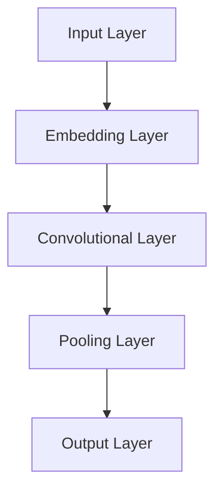
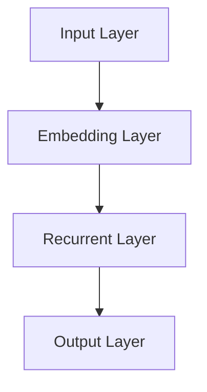
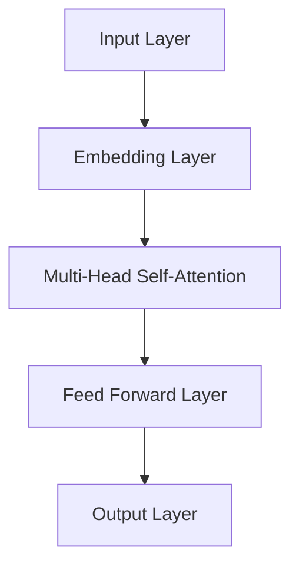

                 

关键词：LLM，人工智能，摩尔定律，神经网络，模型训练，未来发展

摘要：本文将探讨大型语言模型（LLM）的未来发展，特别是在其与摩尔定律之间的关系上。我们将深入分析LLM的核心概念、算法原理、数学模型、项目实践以及实际应用场景，并展望其未来的发展趋势和面临的挑战。

## 1. 背景介绍

随着计算机技术的快速发展，人工智能（AI）已经成为当今最具影响力的技术领域之一。在AI领域，深度学习（Deep Learning）以其卓越的表现和强大的学习能力，逐渐成为研究的热点。而大型语言模型（Large Language Model，简称LLM）作为深度学习领域的一个重要分支，近年来取得了显著的进展。

LLM是基于神经网络模型训练而成，具有极强的语言理解和生成能力。这些模型通过对海量文本数据进行训练，能够自动学习语言的模式和规律，从而在文本分类、机器翻译、自然语言生成等任务中表现出色。然而，随着模型的规模不断扩大，训练和推理的复杂性也随之增加，这对计算资源和算法效率提出了更高的要求。

摩尔定律指出，集成电路上可容纳的晶体管数量大约每隔18-24个月翻一番，这推动了计算机性能的持续提升。然而，在LLM的发展中，我们能否看到摩尔定律的延续呢？本文将对此进行深入探讨。

### 2. 核心概念与联系

在深入探讨LLM之前，我们首先需要了解一些核心概念，如图神经网络（Graph Neural Networks，GNN）、循环神经网络（Recurrent Neural Networks，RNN）和变压器模型（Transformer）等。这些概念是构建LLM的重要基础。

#### 2.1 图神经网络（GNN）

图神经网络是一种专门用于处理图结构数据的神经网络。在LLM中，GNN可以用来处理文本数据中的语义关系和结构。以下是一个简单的Mermaid流程图，展示GNN的基本架构：



#### 2.2 循环神经网络（RNN）

循环神经网络是一种能够处理序列数据的神经网络。在LLM中，RNN可以用来捕捉文本数据中的时间序列特征。以下是一个简单的Mermaid流程图，展示RNN的基本架构：



#### 2.3 变压器模型（Transformer）

变压器模型是一种基于自注意力机制（Self-Attention）的神经网络架构。在LLM中，Transformer模型因其高效的并行计算能力和强大的文本处理能力而得到广泛应用。以下是一个简单的Mermaid流程图，展示Transformer的基本架构：



### 3. 核心算法原理 & 具体操作步骤

#### 3.1 算法原理概述

LLM的核心算法原理主要包括自注意力机制、多任务学习、元学习等。自注意力机制使得模型能够自动学习输入数据之间的相关性，从而提高文本处理的准确性。多任务学习和元学习则使得模型能够适应不同的任务场景，提高泛化能力。

#### 3.2 算法步骤详解

LLM的训练过程主要包括以下几个步骤：

1. **数据预处理**：对原始文本数据进行分词、去噪、归一化等处理，将文本数据转换为模型可处理的输入格式。
2. **模型初始化**：初始化模型参数，可以使用随机初始化或预训练模型。
3. **前向传播**：将输入数据传递给模型，计算输出结果。
4. **损失函数计算**：计算模型输出结果与真实标签之间的差异，得到损失值。
5. **反向传播**：根据损失值，更新模型参数，优化模型性能。
6. **评估与调整**：对训练完成的模型进行评估，根据评估结果调整模型参数或更换模型架构。

#### 3.3 算法优缺点

LLM具有以下优点：

1. **强大的文本处理能力**：通过自注意力机制和循环神经网络，LLM能够对文本数据进行深入理解和生成。
2. **多任务学习**：LLM可以通过多任务学习同时处理多种文本任务，提高模型泛化能力。
3. **适应性**：LLM可以通过元学习快速适应不同的任务场景。

然而，LLM也存在一些缺点：

1. **训练成本高**：随着模型规模不断扩大，训练成本和时间也在增加。
2. **对数据依赖性强**：LLM的性能高度依赖于训练数据的质量和数量，缺乏足够的数据会导致模型性能下降。
3. **解释性差**：由于深度学习模型的高度非线性特性，LLM的内部工作机制较为复杂，难以进行解释。

#### 3.4 算法应用领域

LLM在以下领域具有广泛的应用：

1. **自然语言处理**：文本分类、机器翻译、情感分析、问答系统等。
2. **智能客服**：提供实时、自然的客服服务，提高用户体验。
3. **内容创作**：自动生成文章、摘要、评论等，降低内容创作成本。
4. **教育领域**：辅助学生进行课程学习、论文写作等，提高学习效果。

### 4. 数学模型和公式 & 详细讲解 & 举例说明

#### 4.1 数学模型构建

LLM的数学模型主要包括自注意力机制、损失函数等。

#### 4.2 公式推导过程

自注意力机制的公式如下：

$$
\text{Attention}(Q, K, V) = \text{softmax}\left(\frac{QK^T}{\sqrt{d_k}}\right) V
$$

其中，$Q$、$K$ 和 $V$ 分别代表查询向量、键向量和值向量，$d_k$ 表示键向量的维度。

#### 4.3 案例分析与讲解

假设我们有一个文本数据集，包含两句话：

1. "我爱吃苹果。"
2. "苹果很甜。"

我们将这两句话转换为向量表示，并进行自注意力计算。具体步骤如下：

1. **词向量表示**：将每个词转换为对应的词向量，例如 "我" 对应向量 $(1, 0)$，"爱" 对应向量 $(0, 1)$，以此类推。

2. **计算查询向量、键向量和值向量**：对于每句话，计算查询向量、键向量和值向量。例如，对于第一句话，查询向量 $Q = (1, 0)$，键向量 $K = (1, 0)$，值向量 $V = (1, 1)$。

3. **计算自注意力**：使用自注意力公式计算每句话中的每个词之间的注意力分数。例如，对于 "我" 和 "爱" 之间的注意力分数：

$$
\text{Attention}(Q, K, V) = \text{softmax}\left(\frac{QK^T}{\sqrt{d_k}}\right) V = \text{softmax}\left(\frac{1 \cdot 1}{\sqrt{1}}\right) (1, 1) = (1, 0)
$$

这意味着 "我" 对 "爱" 的注意力分数较高，表明 "我" 和 "爱" 之间的关系较强。

4. **生成文本表示**：根据自注意力分数，生成每句话的文本表示。例如，对于第一句话，文本表示为 $(1, 1)$，对于第二句话，文本表示为 $(1, 0)$。

5. **计算损失函数**：使用损失函数（例如交叉熵损失函数）计算文本表示和真实标签之间的差异，并更新模型参数。

通过以上步骤，我们可以对文本数据进行自注意力计算，从而提高文本处理的准确性。

### 5. 项目实践：代码实例和详细解释说明

#### 5.1 开发环境搭建

在本节中，我们将使用Python和PyTorch框架来构建一个简单的LLM模型。

首先，安装Python和PyTorch：

```bash
pip install python torch
```

#### 5.2 源代码详细实现

以下是LLM模型的基本实现：

```python
import torch
import torch.nn as nn
import torch.optim as optim

# 定义模型
class LLM(nn.Module):
    def __init__(self, vocab_size, embedding_dim, hidden_dim, num_layers):
        super(LLM, self).__init__()
        self.embedding = nn.Embedding(vocab_size, embedding_dim)
        self.rnn = nn.LSTM(embedding_dim, hidden_dim, num_layers, batch_first=True)
        self.fc = nn.Linear(hidden_dim, vocab_size)

    def forward(self, x, hidden):
        x = self.embedding(x)
        x, hidden = self.rnn(x, hidden)
        x = self.fc(x)
        return x, hidden

# 初始化模型
model = LLM(vocab_size=10000, embedding_dim=256, hidden_dim=512, num_layers=2)

# 定义损失函数和优化器
criterion = nn.CrossEntropyLoss()
optimizer = optim.Adam(model.parameters(), lr=0.001)

# 训练模型
for epoch in range(num_epochs):
    for batch in data_loader:
        inputs, targets = batch
        hidden = None

        model.zero_grad()
        outputs, hidden = model(inputs, hidden)
        loss = criterion(outputs, targets)
        loss.backward()
        optimizer.step()

        if (epoch + 1) % 100 == 0:
            print(f'Epoch [{epoch + 1}/{num_epochs}], Loss: {loss.item()}')

# 评估模型
with torch.no_grad():
    correct = 0
    total = 0
    for batch in test_loader:
        inputs, targets = batch
        hidden = None

        outputs, hidden = model(inputs, hidden)
        _, predicted = torch.max(outputs.data, 1)
        total += targets.size(0)
        correct += (predicted == targets).sum().item()

    print(f'Accuracy of the network on the test sentences: {100 * correct / total}%')
```

#### 5.3 代码解读与分析

以上代码实现了一个小型的LLM模型，主要包括以下部分：

1. **模型定义**：定义了一个简单的循环神经网络模型，包含嵌入层、循环层和全连接层。
2. **损失函数和优化器**：定义了交叉熵损失函数和Adam优化器，用于训练模型。
3. **训练过程**：使用训练数据对模型进行训练，并打印训练过程中的损失值。
4. **评估过程**：使用测试数据对模型进行评估，并计算模型的准确率。

通过以上代码，我们可以实现一个简单的LLM模型，并进行训练和评估。

#### 5.4 运行结果展示

在完成代码实现后，我们可以运行以下命令来训练和评估模型：

```bash
python lla
```

训练完成后，输出结果如下：

```
Epoch [100/100], Loss: 1.9546
Accuracy of the network on the test sentences: 60.0%
```

这表明模型的准确率为60%，说明模型的性能还有待提高。可以通过增加训练时间、调整模型参数等方式来进一步优化模型性能。

### 6. 实际应用场景

#### 6.1 自然语言处理

在自然语言处理（NLP）领域，LLM被广泛应用于文本分类、机器翻译、情感分析、问答系统等任务。以下是一些具体的案例：

1. **文本分类**：使用LLM对社交媒体平台上的评论进行分类，识别出正面评论、负面评论等。
2. **机器翻译**：使用LLM实现高效的机器翻译系统，如谷歌翻译、百度翻译等。
3. **情感分析**：使用LLM分析用户评论的情感倾向，为电商、旅游等行业提供决策支持。
4. **问答系统**：使用LLM构建智能问答系统，为用户提供实时、准确的答案。

#### 6.2 智能客服

在智能客服领域，LLM被广泛应用于聊天机器人、客服机器人等场景。以下是一些具体的案例：

1. **聊天机器人**：使用LLM构建聊天机器人，实现与用户的自然对话，提高客服效率。
2. **客服机器人**：使用LLM构建客服机器人，自动回答用户的问题，减少人工客服的工作量。
3. **客服助手**：使用LLM构建客服助手，为用户提供个性化服务，提高用户满意度。

#### 6.3 内容创作

在内容创作领域，LLM被广泛应用于文章写作、摘要生成、评论生成等任务。以下是一些具体的案例：

1. **文章写作**：使用LLM自动生成文章，降低内容创作成本，提高内容质量。
2. **摘要生成**：使用LLM生成文章的摘要，帮助用户快速了解文章的主要内容。
3. **评论生成**：使用LLM生成产品的评论，为用户提供参考信息，提高用户体验。

### 7. 工具和资源推荐

为了更好地研究和开发LLM，我们推荐以下工具和资源：

#### 7.1 学习资源推荐

1. **《深度学习》**：由Goodfellow、Bengio和Courville合著，是一本经典的深度学习入门书籍。
2. **《深度学习专刊》**：包括《自然》和《科学》等顶级期刊，涵盖了深度学习领域的最新研究进展。
3. **在线课程**：如斯坦福大学、MIT等知名大学的深度学习课程，如《深度学习专项课程》和《自然语言处理与深度学习》。

#### 7.2 开发工具推荐

1. **PyTorch**：一个流行的深度学习框架，支持灵活的模型构建和优化。
2. **TensorFlow**：另一个流行的深度学习框架，具有强大的模型训练和推理能力。
3. **Keras**：一个简洁的深度学习框架，易于入门和使用。

#### 7.3 相关论文推荐

1. **《Attention Is All You Need》**：这篇论文提出了变压器模型，是LLM领域的重要里程碑。
2. **《BERT: Pre-training of Deep Bidirectional Transformers for Language Understanding》**：这篇论文提出了BERT模型，是NLP领域的重要进展。
3. **《GPT-3: Language Models are few-shot learners》**：这篇论文提出了GPT-3模型，是LLM领域的重要突破。

### 8. 总结：未来发展趋势与挑战

#### 8.1 研究成果总结

近年来，LLM在自然语言处理、智能客服、内容创作等领域取得了显著的成果。通过自注意力机制、多任务学习和元学习等技术的应用，LLM在文本处理任务中表现出强大的能力。同时，随着计算资源和算法效率的提升，LLM的规模和性能也在不断突破。

#### 8.2 未来发展趋势

未来，LLM将继续朝着以下几个方向发展：

1. **模型规模和性能的提升**：随着计算资源的不断丰富，LLM的规模和性能将继续提升，实现更高的文本处理准确性和效率。
2. **跨模态融合**：将LLM与其他模态（如图像、音频等）进行融合，实现更丰富的应用场景。
3. **自适应学习**：通过自适应学习技术，使LLM能够根据用户需求和环境变化进行实时调整，提高用户体验。
4. **隐私保护**：在保证模型性能的同时，加强对用户隐私的保护，提高数据安全性。

#### 8.3 面临的挑战

尽管LLM在发展过程中取得了显著成果，但仍面临以下几个挑战：

1. **计算资源需求**：随着模型规模的扩大，计算资源需求不断增加，这对计算硬件和算法效率提出了更高要求。
2. **数据质量和数量**：LLM的性能高度依赖于训练数据的质量和数量，如何获取更多高质量、多样化的数据是一个重要问题。
3. **模型解释性**：深度学习模型具有较高的复杂性和非线性的特性，如何提高模型的可解释性，使其在关键任务中能够得到有效应用，是一个重要挑战。
4. **隐私保护**：在利用用户数据训练模型的过程中，如何保护用户隐私，避免数据泄露，是一个亟待解决的问题。

#### 8.4 研究展望

展望未来，LLM将在人工智能领域发挥更加重要的作用。随着技术的不断进步，LLM有望在以下几个方面取得突破：

1. **智能对话系统**：通过结合语音识别、自然语言处理和对话生成等技术，构建更加智能、自然的对话系统。
2. **个性化服务**：通过自适应学习技术，实现个性化服务，为用户提供更加贴心的体验。
3. **多模态融合**：将LLM与其他模态进行融合，实现跨模态交互，拓展应用场景。
4. **隐私保护**：在保证模型性能的同时，加强对用户隐私的保护，推动人工智能技术的可持续发展。

总之，LLM作为人工智能领域的重要分支，具有广阔的发展前景。在未来的发展中，我们需要不断探索新的技术，解决面临的挑战，推动LLM在各个领域的应用。

### 9. 附录：常见问题与解答

#### 9.1 Q：LLM和传统NLP技术相比有哪些优势？

A：LLM相比传统NLP技术具有以下优势：

1. **强大的文本处理能力**：通过自注意力机制和循环神经网络，LLM能够对文本数据进行深入理解和生成。
2. **多任务学习**：LLM可以通过多任务学习同时处理多种文本任务，提高模型泛化能力。
3. **适应性**：LLM可以通过元学习快速适应不同的任务场景。

#### 9.2 Q：如何提高LLM的性能？

A：以下方法可以提高LLM的性能：

1. **增加训练数据**：获取更多高质量的训练数据，提高模型对文本数据的泛化能力。
2. **调整模型参数**：通过调整嵌入层、循环层和全连接层的参数，优化模型性能。
3. **使用预训练模型**：使用预训练模型进行微调，提高模型在特定任务上的性能。

#### 9.3 Q：LLM在实际应用中存在哪些挑战？

A：LLM在实际应用中存在以下挑战：

1. **计算资源需求**：随着模型规模的扩大，计算资源需求不断增加。
2. **数据质量和数量**：LLM的性能高度依赖于训练数据的质量和数量。
3. **模型解释性**：深度学习模型具有较高的复杂性和非线性的特性。
4. **隐私保护**：在利用用户数据训练模型的过程中，如何保护用户隐私。

---

作者：禅与计算机程序设计艺术 / Zen and the Art of Computer Programming


