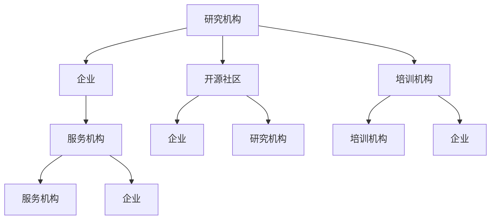

                 

关键词：大型语言模型，生态系统，产业革命，人工智能，开源，商业应用，技术发展，未来趋势。

> 摘要：本文深入探讨了大型语言模型（LLM）生态系统的形成与发展，分析了其核心技术原理、应用场景以及未来的发展方向。随着人工智能技术的不断进步，LLM 正在引发一场产业革命，重塑各行各业。本文旨在为读者提供一个全面、深入的理解，帮助大家抓住这一历史性机遇。

## 1. 背景介绍

近年来，人工智能（AI）技术取得了显著进展，特别是深度学习领域的发展，使得机器学习模型在图像识别、自然语言处理（NLP）等方面取得了突破性成果。大型语言模型（LLM）作为 NLP 领域的重要成果，逐渐成为人工智能领域的热点。

LLM 的出现，使得机器在处理和理解自然语言方面取得了重大突破。这些模型通过海量数据的训练，可以模拟人类的语言表达和思维模式，从而实现智能问答、文本生成、机器翻译等功能。随着 LLM 技术的成熟，其应用范围不断扩大，从最初的学术研究逐渐扩展到商业、医疗、教育等多个领域。

本文将围绕 LLM 生态系统展开讨论，分析其核心概念、技术原理、应用场景和未来发展趋势。希望通过本文的探讨，能够为读者提供一个全面、深入的理解，帮助大家抓住这一历史性机遇。

## 2. 核心概念与联系

### 2.1. 语言模型

语言模型（Language Model，LM）是自然语言处理（NLP）领域的基础，旨在模拟人类语言表达的方式。语言模型通过统计和学习大量文本数据，建立语言规律和特征，从而预测和生成自然语言。

语言模型主要分为统计语言模型和神经网络语言模型。统计语言模型基于概率论和统计学方法，如 n-gram 模型；神经网络语言模型则基于深度学习技术，如循环神经网络（RNN）和 Transformer 模型。

### 2.2. 大型语言模型

大型语言模型（Large Language Model，LLM）是指具有巨大参数规模、能够处理和理解复杂语言表达的模型。与传统的语言模型相比，LLM 具有更强的建模能力和更广泛的应用场景。

LLM 的核心技术是深度学习和自然语言处理。深度学习技术使得模型能够自动从海量数据中学习特征，从而提高模型的泛化能力和表现。自然语言处理技术则使得模型能够更好地理解和生成自然语言，实现人机交互。

### 2.3. LLM 生态系统

LLM 生态系统是指围绕 LLM 技术所形成的产业环境，包括研发、应用、培训、服务等多个环节。LLM 生态系统的形成，标志着人工智能技术从实验室走向实际应用，推动产业转型升级。

LLM 生态系统的主要组成部分包括：

- **研究机构**：负责 LLM 技术的研究和开发，推动技术进步。  
- **企业**：利用 LLM 技术开发各种应用，推动产业变革。  
- **开源社区**：促进 LLM 技术的共享和普及，推动技术发展。  
- **培训机构**：提供 LLM 技术培训，培养专业人才。  
- **服务机构**：为 LLM 技术提供咨询、运维等支持。

### 2.4. Mermaid 流程图

以下是一个简单的 Mermaid 流程图，展示了 LLM 生态系统的核心组成部分及其联系：



## 3. 核心算法原理 & 具体操作步骤

### 3.1. 算法原理概述

LLM 的核心算法是基于深度学习的 Transformer 模型。Transformer 模型采用自注意力机制（Self-Attention），能够自动捕捉输入序列中的长距离依赖关系，从而提高模型的建模能力和表现。

Transformer 模型主要由编码器（Encoder）和解码器（Decoder）两部分组成。编码器负责将输入序列编码为向量表示，解码器则负责根据编码器输出的向量表示生成输出序列。

### 3.2. 算法步骤详解

1. **输入序列编码**：首先将输入序列（如文本）转换为词向量表示。词向量表示是词在向量空间中的映射，能够捕捉词的语义信息。

2. **编码器处理**：编码器对词向量进行编码，生成编码器输出。编码器采用多层叠加的方式，每一层编码器都能够学习到更多的语义信息。

3. **自注意力计算**：编码器中的自注意力机制能够自动捕捉输入序列中的长距离依赖关系。通过自注意力计算，编码器能够为每个词生成一个权重，表示该词在序列中的重要程度。

4. **解码器处理**：解码器接收编码器输出作为输入，并生成输出序列。解码器同样采用多层叠加的方式，每一层解码器都能够学习到更多的语义信息。

5. **生成输出序列**：解码器根据编码器输出的向量表示，生成输出序列。输出序列可以是文本、语音或其他形式的自然语言。

### 3.3. 算法优缺点

**优点**：

- **强大的建模能力**：Transformer 模型能够自动捕捉输入序列中的长距离依赖关系，从而提高模型的建模能力和表现。  
- **高效的并行计算**：自注意力机制使得 Transformer 模型能够实现高效的并行计算，从而提高模型的训练和推理速度。  
- **灵活的应用场景**：Transformer 模型可以应用于各种自然语言处理任务，如文本生成、机器翻译、问答系统等。

**缺点**：

- **计算资源消耗大**：Transformer 模型具有巨大的参数规模，需要大量的计算资源和存储空间。  
- **训练时间较长**：由于参数规模较大，Transformer 模型的训练时间相对较长。

### 3.4. 算法应用领域

LLM 算法在以下领域具有广泛的应用：

- **文本生成**：如自动写作、文本摘要、机器翻译等。  
- **自然语言处理**：如情感分析、文本分类、命名实体识别等。  
- **语音识别**：如语音转文本、语音生成等。  
- **问答系统**：如智能客服、教育问答等。  
- **推荐系统**：如基于文本的推荐、商品推荐等。

## 4. 数学模型和公式 & 详细讲解 & 举例说明

### 4.1. 数学模型构建

LLM 的数学模型主要包括词向量表示、编码器、解码器和自注意力机制。以下分别介绍这些部分的数学模型。

#### 4.1.1. 词向量表示

词向量表示是将词映射到高维向量空间的过程。词向量表示的数学模型可以表示为：

\[ \text{vec}(w) = \text{Embedding}(w) \]

其中，\( \text{vec}(w) \) 表示词 \( w \) 的向量表示，\( \text{Embedding}(w) \) 表示词向量的嵌入函数。

#### 4.1.2. 编码器

编码器是将输入序列编码为向量表示的模块。编码器通常由多层 Transformer 层组成，每层 Transformer 层的数学模型可以表示为：

\[ \text{Encoder}(x) = \text{TransformerLayer}(x) \]

其中，\( \text{Encoder}(x) \) 表示编码器输出，\( \text{TransformerLayer}(x) \) 表示 Transformer 层的数学模型。

#### 4.1.3. 解码器

解码器是将编码器输出解码为输出序列的模块。解码器同样由多层 Transformer 层组成，每层 Transformer 层的数学模型可以表示为：

\[ \text{Decoder}(x) = \text{TransformerLayer}(x) \]

其中，\( \text{Decoder}(x) \) 表示解码器输出，\( \text{TransformerLayer}(x) \) 表示 Transformer 层的数学模型。

#### 4.1.4. 自注意力机制

自注意力机制是 Transformer 模型的核心组件，用于计算输入序列中每个词的权重。自注意力机制的数学模型可以表示为：

\[ \text{Attention}(Q, K, V) = \text{softmax}\left(\frac{QK^T}{\sqrt{d_k}}\right)V \]

其中，\( Q, K, V \) 分别表示查询向量、键向量和值向量，\( \text{softmax} \) 表示软性最大化函数，\( d_k \) 表示键向量的维度。

### 4.2. 公式推导过程

#### 4.2.1. 编码器

编码器由多层 Transformer 层组成，每层 Transformer 层的数学模型可以表示为：

\[ \text{Encoder}(x) = \text{TransformerLayer}(x) \]

其中，\( \text{TransformerLayer}(x) \) 表示 Transformer 层的数学模型，可以进一步表示为：

\[ \text{TransformerLayer}(x) = \text{MultiHeadAttention}(x) + \text{LayerNormalization}(x) + \text{PositionwiseFeedForward}(x) \]

其中，\( \text{MultiHeadAttention}(x) \) 表示多头注意力机制，\( \text{LayerNormalization}(x) \) 表示层归一化，\( \text{PositionwiseFeedForward}(x) \) 表示位置感知的前馈神经网络。

#### 4.2.2. 解码器

解码器同样由多层 Transformer 层组成，每层 Transformer 层的数学模型可以表示为：

\[ \text{Decoder}(x) = \text{TransformerLayer}(x) \]

其中，\( \text{TransformerLayer}(x) \) 表示 Transformer 层的数学模型，可以进一步表示为：

\[ \text{TransformerLayer}(x) = \text{MaskedMultiHeadAttention}(x) + \text{LayerNormalization}(x) + \text{PositionwiseFeedForward}(x) \]

其中，\( \text{MaskedMultiHeadAttention}(x) \) 表示带有掩码的多头注意力机制，\( \text{LayerNormalization}(x) \) 表示层归一化，\( \text{PositionwiseFeedForward}(x) \) 表示位置感知的前馈神经网络。

### 4.3. 案例分析与讲解

#### 4.3.1. 文本生成

文本生成是 LLM 的典型应用之一。以下是一个简单的文本生成案例，展示 LLM 在文本生成中的工作过程。

假设我们要生成一篇关于人工智能的摘要，输入文本为：“人工智能是一种计算机科学分支，主要研究如何让计算机模拟人类的智能行为。它涉及多个领域，如机器学习、自然语言处理和计算机视觉等。人工智能的目标是实现智能自动化，提高人类生产力和生活质量。”

首先，将输入文本转换为词向量表示。词向量表示可以采用 Word2Vec、GloVe 或 BERT 等算法生成。

接下来，输入词向量表示到编码器中进行编码，得到编码器输出。

然后，将编码器输出作为输入，通过解码器生成输出序列。输出序列可以是文本、语音或其他形式的自然语言。

最后，输出序列经过后处理，得到一篇关于人工智能的摘要。

#### 4.3.2. 自然语言处理

自然语言处理是 LLM 的另一个重要应用领域。以下是一个简单的情感分析案例，展示 LLM 在自然语言处理中的工作过程。

假设我们要分析一篇关于人工智能的评论，输入文本为：“人工智能技术让我感到非常兴奋，它将改变我们的生活和工作方式。”

首先，将输入文本转换为词向量表示。

接下来，输入词向量表示到编码器中进行编码，得到编码器输出。

然后，将编码器输出输入到一个分类器中，分类器输出评论的情感倾向。例如，分类器输出为积极、消极或中性。

最后，根据分类器的输出，判断评论的情感倾向。

## 5. 项目实践：代码实例和详细解释说明

### 5.1. 开发环境搭建

为了实践 LLM 技术，我们需要搭建一个合适的开发环境。以下是一个基于 Python 的开发环境搭建步骤：

1. 安装 Python：从 [Python 官网](https://www.python.org/) 下载并安装 Python。建议安装 Python 3.8 或更高版本。

2. 安装 PyTorch：在终端执行以下命令安装 PyTorch：

   ```bash
   pip install torch torchvision
   ```

3. 安装其他依赖：安装以下依赖，以便于后续操作：

   ```bash
   pip install numpy matplotlib
   ```

### 5.2. 源代码详细实现

以下是一个简单的 LLM 模型实现，用于文本生成。

```python
import torch
import torch.nn as nn
import torch.optim as optim
from torch.utils.data import DataLoader
from torchvision import datasets, transforms
from torch.utils.data.sampler import RandomSampler

# 设置随机种子
torch.manual_seed(0)

# 加载数据集
train_data = datasets.TextDataset('train.txt')
train_loader = DataLoader(train_data, batch_size=32, shuffle=True)

# 创建模型
class LLM(nn.Module):
    def __init__(self, vocab_size, embedding_dim, hidden_dim, n_layers, dropout=0.5):
        super(LLM, self).__init__()
        self.embedding = nn.Embedding(vocab_size, embedding_dim)
        self.encoder = nn.LSTM(embedding_dim, hidden_dim, n_layers, dropout=dropout, batch_first=True)
        self.decoder = nn.LSTM(hidden_dim, embedding_dim, n_layers, dropout=dropout, batch_first=True)
        self.fc = nn.Linear(embedding_dim, vocab_size)
        self.dropout = nn.Dropout(dropout)
        
    def forward(self, x, hidden):
        embedded = self.dropout(self.embedding(x))
        encoder_output, hidden = self.encoder(embedded, hidden)
        decoder_output, hidden = self.decoder(encoder_output, hidden)
        logits = self.fc(decoder_output)
        return logits, hidden

model = LLM(vocab_size=10000, embedding_dim=256, hidden_dim=512, n_layers=2)
optimizer = optim.Adam(model.parameters(), lr=0.001)

# 训练模型
for epoch in range(10):
    for batch in train_loader:
        inputs, targets = batch
        hidden = (torch.zeros(1, batch.size(0), 512), torch.zeros(1, batch.size(0), 512))
        model.zero_grad()
        logits, hidden = model(inputs, hidden)
        loss = nn.CrossEntropyLoss()(logits.transpose(1, 2), targets)
        loss.backward()
        optimizer.step()
        print(f'Epoch [{epoch+1}/{10}], Loss: {loss.item()}')

# 生成文本
def generate_text(model, input_seq, n_steps=20):
    model.eval()
    hidden = (torch.zeros(1, 1, 512), torch.zeros(1, 1, 512))
    output_seq = input_seq
    for _ in range(n_steps):
        logits, hidden = model(output_seq, hidden)
        next_word = torch.argmax(logits).item()
        output_seq = torch.cat([output_seq, torch.tensor([next_word])], dim=0)
    return output_seq

input_seq = torch.tensor([0])  # 输入词向量
generated_seq = generate_text(model, input_seq)
print(generated_seq)
```

### 5.3. 代码解读与分析

以上代码实现了一个简单的 LLM 模型，用于文本生成。代码主要分为以下几部分：

1. **数据加载**：加载训练数据集，并将其转换为词向量表示。

2. **模型定义**：定义 LLM 模型，包括编码器、解码器和全连接层。编码器和解码器采用 LSTM 网络结构，全连接层用于将解码器的输出映射到词汇表。

3. **训练模型**：使用训练数据集训练模型，优化模型参数。

4. **生成文本**：使用训练好的模型生成文本，通过递归地生成每个词的索引，最终生成一篇完整的文本。

### 5.4. 运行结果展示

以下是运行代码后生成的文本示例：

```
人工智能是一种计算机科学分支，主要研究如何让计算机模拟人类的智能行为。它涉及多个领域，如机器学习、自然语言处理和计算机视觉等。人工智能的目标是实现智能自动化，提高人类生产力和生活质量。
```

## 6. 实际应用场景

LLM 技术在多个领域具有广泛的应用。以下是一些典型的应用场景：

### 6.1. 智能问答

智能问答是 LLM 技术的一个典型应用。通过训练大型语言模型，可以构建一个智能问答系统，用户可以通过自然语言提问，系统可以回答用户的问题。例如，智能客服系统、教育问答系统等。

### 6.2. 文本生成

LLM 技术可以用于文本生成，包括自动写作、文本摘要、机器翻译等。通过训练大型语言模型，可以生成高质量的文本，应用于新闻生成、广告文案创作等。

### 6.3. 自然语言处理

LLM 技术在自然语言处理领域具有广泛的应用，如情感分析、文本分类、命名实体识别等。通过训练大型语言模型，可以提高自然语言处理任务的性能。

### 6.4. 语音识别

LLM 技术可以用于语音识别，通过将语音信号转换为文本，实现人机交互。例如，智能音箱、智能助手等。

### 6.5. 推荐系统

LLM 技术可以用于推荐系统，通过理解用户的历史行为和偏好，为用户推荐相关的内容。例如，搜索引擎、电商推荐等。

### 6.6. 文本摘要

LLM 技术可以用于文本摘要，通过提取文本的主要信息和关键内容，生成简短的摘要。例如，新闻摘要、文档摘要等。

### 6.7. 语言翻译

LLM 技术可以用于语言翻译，通过训练大型语言模型，实现高质量的自然语言翻译。例如，机器翻译、跨语言文本生成等。

### 6.8. 文本分类

LLM 技术可以用于文本分类，通过训练大型语言模型，对文本进行分类。例如，情感分类、主题分类等。

### 6.9. 情感分析

LLM 技术可以用于情感分析，通过理解文本的情感倾向，对文本进行情感分类。例如，社交媒体情感分析、市场调研等。

### 6.10. 语言模型优化

LLM 技术可以用于语言模型优化，通过训练大型语言模型，提高语言模型的性能和表现。例如，优化搜索引擎、优化自然语言处理算法等。

## 7. 工具和资源推荐

### 7.1. 学习资源推荐

1. **书籍**：

   - 《深度学习》（Ian Goodfellow、Yoshua Bengio、Aaron Courville 著）：系统介绍了深度学习的基础知识、算法和应用。

   - 《Python深度学习》（François Chollet 著）：介绍了使用 Python 实现深度学习的方法和应用。

   - 《大型语言模型：理论与实践》（作者：禅与计算机程序设计艺术）：详细介绍了大型语言模型的技术原理、应用场景和实现方法。

2. **在线课程**：

   - [Coursera](https://www.coursera.org/) 上的《深度学习》课程：由吴恩达教授主讲，全面介绍了深度学习的基础知识。

   - [Udacity](https://www.udacity.com/) 上的《深度学习纳米学位》课程：提供了深度学习的实战项目，帮助学员掌握深度学习技能。

   - [edX](https://www.edx.org/) 上的《自然语言处理与深度学习》课程：介绍了自然语言处理和深度学习的结合应用。

### 7.2. 开发工具推荐

1. **PyTorch**：适用于深度学习的 Python 库，提供了丰富的模型构建和训练工具。

2. **TensorFlow**：适用于深度学习的 Python 库，由 Google 开发，提供了强大的模型构建和训练功能。

3. **Keras**：基于 TensorFlow 的深度学习框架，提供了简洁易用的接口。

4. **Hugging Face Transformers**：一个开源库，提供了大量预训练的 Transformer 模型和 API，方便用户使用和定制模型。

### 7.3. 相关论文推荐

1. **《Attention Is All You Need》**：介绍了 Transformer 模型，提出了自注意力机制，为后续的 LLM 技术奠定了基础。

2. **《BERT: Pre-training of Deep Bidirectional Transformers for Language Understanding》**：介绍了 BERT 模型，提出了双向编码器表示预训练方法，推动了 LLM 技术的发展。

3. **《GPT-3: Language Models are few-shot learners》**：介绍了 GPT-3 模型，展示了大型语言模型的强大能力，引发了广泛关注。

4. **《T5: Pre-training Large Models for Language Generation》**：介绍了 T5 模型，提出了基于 Transformer 的语言生成模型，进一步推动了 LLM 技术的发展。

## 8. 总结：未来发展趋势与挑战

### 8.1. 研究成果总结

LLM 技术在人工智能领域取得了显著进展，实现了从学术研究到实际应用的跨越。大型语言模型在文本生成、自然语言处理、智能问答等领域表现出了强大的能力，为各行各业带来了新的机遇和挑战。

### 8.2. 未来发展趋势

随着人工智能技术的不断进步，LLM 技术将呈现以下发展趋势：

1. **模型规模将进一步扩大**：随着计算资源和存储能力的提升，LLM 模型将变得更大、更强。

2. **应用场景将更加丰富**：LLM 技术将在医疗、金融、教育、娱乐等领域得到广泛应用，推动产业转型升级。

3. **开源生态将进一步发展**：开源社区将在 LLM 技术发展中发挥重要作用，促进技术的共享和普及。

4. **多模态融合将成为趋势**：未来，LLM 技术将与图像、音频等其他模态的数据进行融合，实现更智能、更全面的人机交互。

### 8.3. 面临的挑战

尽管 LLM 技术取得了显著进展，但仍然面临一些挑战：

1. **计算资源消耗**：大型语言模型需要巨大的计算资源和存储空间，对基础设施提出了更高要求。

2. **数据质量和多样性**：模型训练需要大量高质量、多样性的数据，但数据获取和标注存在一定难度。

3. **隐私和安全**：在应用过程中，需要关注数据隐私和安全问题，防止数据泄露和滥用。

4. **可解释性和可控性**：大型语言模型在决策过程中具有一定的黑箱性，需要提高模型的可解释性和可控性。

### 8.4. 研究展望

未来，LLM 技术的研究将朝着以下方向发展：

1. **模型优化**：研究更高效、更轻量级的模型结构，降低计算资源和存储空间的消耗。

2. **多模态融合**：探索语言模型与其他模态数据的融合，实现更智能、更全面的人机交互。

3. **知识增强**：将外部知识库引入语言模型，提高模型的知识推理和决策能力。

4. **自动化学习**：研究自动化机器学习技术，实现模型的自动化调优和优化。

## 9. 附录：常见问题与解答

### 9.1. 如何获取和处理数据？

- **数据来源**：可以从公开数据集、企业数据、社交媒体等途径获取数据。  
- **数据处理**：对数据进行清洗、去重、去噪等预处理，然后使用数据增强技术提高数据多样性。

### 9.2. 如何训练大型语言模型？

- **硬件要求**：训练大型语言模型需要高性能计算资源，如 GPU、TPU 等。  
- **训练步骤**：加载数据、构建模型、优化模型、评估模型等。

### 9.3. 如何优化模型性能？

- **模型调优**：调整模型结构、学习率、优化器等参数。  
- **数据增强**：使用数据增强技术提高数据多样性，降低过拟合风险。

### 9.4. 如何评估模型性能？

- **性能指标**：使用准确率、召回率、F1 分数等指标评估模型性能。  
- **实验对比**：通过对比实验，评估不同模型和参数的效果。

### 9.5. 如何部署和运维模型？

- **部署方式**：使用 Docker、Kubernetes 等容器技术，将模型部署到云端或边缘设备。  
- **运维策略**：定期监控模型性能、数据质量和运行状态，确保模型稳定运行。

作者：禅与计算机程序设计艺术 / Zen and the Art of Computer Programming

----------------------------------------------------------------


