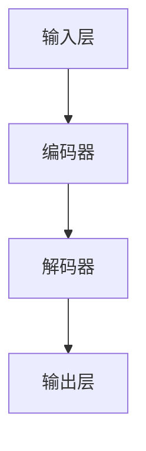

                 

关键词：大型语言模型(LLM)，社会影响，就业，经济，社会变革

摘要：随着大型语言模型（LLM）的快速发展，其在各个领域的应用日益广泛，从而对就业、经济和社会产生了深远影响。本文将探讨LLM在推动就业市场变革、经济结构转型和社会组织创新方面的作用，分析其潜在的积极和消极影响，并展望未来发展趋势。

## 1. 背景介绍

近年来，人工智能领域取得了显著进展，尤其是深度学习算法的突破。其中，大型语言模型（LLM）因其卓越的自然语言处理能力而备受关注。LLM通过学习海量文本数据，可以生成高质量的文章、回答复杂问题，甚至进行创意写作。这使得LLM在各个领域，如自然语言处理、智能客服、内容生成、教育、医疗等领域，都展现了巨大的应用潜力。

随着LLM技术的成熟，其应用场景不断扩展，逐渐深入到社会的各个方面。然而，这一技术的发展也引发了一系列社会问题，如就业岗位的替代、数据隐私和安全等。本文将重点讨论LLM在就业、经济和社会变革方面的社会影响。

## 2. 核心概念与联系

### 2.1 LLM的概念

大型语言模型（LLM）是一种基于深度学习算法的自然语言处理模型。它通过学习大量文本数据，能够理解和生成自然语言。LLM的主要特点是：

- **强大的语言理解能力**：LLM可以理解自然语言中的复杂结构，包括句子、段落和全文。
- **丰富的知识储备**：LLM通过对海量文本的学习，积累了丰富的知识库。
- **自适应能力**：LLM可以根据输入文本的上下文，生成相应的回答或内容。

### 2.2 LLM的架构

LLM的架构主要包括以下几个部分：

- **输入层**：接收自然语言文本输入。
- **编码器**：将输入文本编码成高维向量。
- **解码器**：根据编码器生成的向量，生成输出文本。

以下是LLM的Mermaid流程图：



### 2.3 LLM的应用领域

LLM的应用领域非常广泛，主要包括以下几个方面：

- **自然语言处理**：LLM在文本分类、情感分析、机器翻译等领域具有显著优势。
- **智能客服**：LLM可以模拟人类的对话方式，为用户提供高质量的客服服务。
- **内容生成**：LLM可以生成文章、故事、新闻报道等，提高内容创作的效率和质量。
- **教育**：LLM可以帮助学生进行语言学习、课程辅导等，提高学习效果。
- **医疗**：LLM可以用于医疗文本分析、疾病预测等，提高医疗服务的质量。

## 3. 核心算法原理 & 具体操作步骤

### 3.1 算法原理概述

LLM的核心算法是基于深度学习的自然语言处理技术。其原理主要包括以下几个步骤：

1. **数据预处理**：对输入的文本数据进行清洗、分词等预处理。
2. **编码**：将预处理后的文本数据编码成高维向量。
3. **解码**：根据编码后的向量，生成输出文本。
4. **优化**：通过反向传播算法，不断调整模型参数，提高模型的性能。

### 3.2 算法步骤详解

以下是LLM的算法步骤详解：

1. **数据预处理**：

   - **文本清洗**：去除文本中的标点符号、停用词等无关信息。
   - **分词**：将文本分割成单词或短语。
   - **词向量化**：将分词后的文本转化为高维向量。

2. **编码**：

   - **嵌入层**：将输入的词向量转化为嵌入向量。
   - **编码器**：对嵌入向量进行编码，生成编码后的向量。

3. **解码**：

   - **解码器**：根据编码后的向量，生成输出文本。
   - **softmax层**：对输出文本的概率分布进行计算。

4. **优化**：

   - **损失函数**：计算模型预测和真实标签之间的损失。
   - **反向传播**：通过反向传播算法，更新模型参数。

### 3.3 算法优缺点

**优点**：

- **强大的语言理解能力**：LLM可以理解自然语言中的复杂结构，包括句子、段落和全文。
- **丰富的知识储备**：LLM通过对海量文本的学习，积累了丰富的知识库。
- **自适应能力**：LLM可以根据输入文本的上下文，生成相应的回答或内容。

**缺点**：

- **训练成本高**：LLM的训练过程需要大量的计算资源和时间。
- **数据依赖性**：LLM的性能很大程度上取决于训练数据的数量和质量。
- **安全性问题**：LLM可能受到恶意攻击，导致生成有害内容。

### 3.4 算法应用领域

LLM的应用领域非常广泛，主要包括以下几个方面：

- **自然语言处理**：LLM在文本分类、情感分析、机器翻译等领域具有显著优势。
- **智能客服**：LLM可以模拟人类的对话方式，为用户提供高质量的客服服务。
- **内容生成**：LLM可以生成文章、故事、新闻报道等，提高内容创作的效率和质量。
- **教育**：LLM可以帮助学生进行语言学习、课程辅导等，提高学习效果。
- **医疗**：LLM可以用于医疗文本分析、疾病预测等，提高医疗服务的质量。

## 4. 数学模型和公式 & 详细讲解 & 举例说明

### 4.1 数学模型构建

LLM的数学模型主要包括以下几个部分：

1. **嵌入层**：将词向量转化为嵌入向量。
2. **编码器**：对嵌入向量进行编码，生成编码后的向量。
3. **解码器**：根据编码后的向量，生成输出文本。
4. **softmax层**：对输出文本的概率分布进行计算。

以下是LLM的数学模型：

$$
\begin{aligned}
\text{嵌入层}:\qquad & \text{嵌入向量} = \text{Word2Vec}(\text{词向量}) \\
\text{编码器}:\qquad & \text{编码后的向量} = \text{Encoder}(\text{嵌入向量}) \\
\text{解码器}:\qquad & \text{输出文本} = \text{Decoder}(\text{编码后的向量}) \\
\text{softmax层}:\qquad & \text{概率分布} = \text{Softmax}(\text{输出文本})
\end{aligned}
$$

### 4.2 公式推导过程

以下是LLM的数学模型推导过程：

1. **嵌入层**：

   词向量表示为 $\text{词向量} \in \mathbb{R}^{d}$，嵌入向量表示为 $\text{嵌入向量} \in \mathbb{R}^{d'}$，其中 $d'$ 大于 $d$。

   $$ \text{嵌入向量} = \text{Word2Vec}(\text{词向量}) $$

2. **编码器**：

   编码器将嵌入向量映射到编码后的向量。

   $$ \text{编码后的向量} = \text{Encoder}(\text{嵌入向量}) $$

3. **解码器**：

   解码器将编码后的向量映射到输出文本。

   $$ \text{输出文本} = \text{Decoder}(\text{编码后的向量}) $$

4. **softmax层**：

   softma

### 4.3 案例分析与讲解

**案例 1：文本分类**

假设我们有以下两个句子：

- 句子 1：“今天天气很好。”
- 句子 2：“明天可能会下雨。”

我们需要使用LLM对这两个句子进行分类，判断它们属于哪个类别。例如，我们可以将句子 1 分类为“积极”类别，将句子 2 分类为“消极”类别。

以下是LLM在文本分类任务中的具体应用：

1. **数据预处理**：

   - **文本清洗**：去除句子中的标点符号、停用词等无关信息。
   - **分词**：将句子分割成单词或短语。

   假设句子 1 和句子 2 分词后的结果分别为：

   - 句子 1：“今天 天气 很好。”
   - 句子 2：“明天 可能 会 下雨。”

2. **嵌入层**：

   - 将分词后的文本转化为嵌入向量。

   假设嵌入向量分别为 $\text{嵌入向量}_{1}$ 和 $\text{嵌入向量}_{2}$。

3. **编码器**：

   - 对嵌入向量进行编码，生成编码后的向量。

   假设编码后的向量分别为 $\text{编码后的向量}_{1}$ 和 $\text{编码后的向量}_{2}$。

4. **解码器**：

   - 根据编码后的向量，生成输出文本。

   假设输出文本分别为 $\text{输出文本}_{1}$ 和 $\text{输出文本}_{2}$。

5. **softmax层**：

   - 对输出文本的概率分布进行计算。

   假设概率分布分别为 $P(\text{积极}|\text{输出文本}_{1})$ 和 $P(\text{消极}|\text{输出文本}_{2})$。

根据概率分布，我们可以判断句子 1 属于“积极”类别，句子 2 属于“消极”类别。

**案例 2：情感分析**

假设我们有以下两个句子：

- 句子 1：“这个产品很好用。”
- 句子 2：“这个产品太糟糕了。”

我们需要使用LLM对这两个句子进行情感分析，判断它们的情感极性。

以下是LLM在情感分析任务中的具体应用：

1. **数据预处理**：

   - **文本清洗**：去除句子中的标点符号、停用词等无关信息。
   - **分词**：将句子分割成单词或短语。

   假设句子 1 和句子 2 分词后的结果分别为：

   - 句子 1：“这个 产品 很好 用。”
   - 句子 2：“这个 产品 太糟糕 了。”

2. **嵌入层**：

   - 将分词后的文本转化为嵌入向量。

   假设嵌入向量分别为 $\text{嵌入向量}_{1}$ 和 $\text{嵌入向量}_{2}$。

3. **编码器**：

   - 对嵌入向量进行编码，生成编码后的向量。

   假设编码后的向量分别为 $\text{编码后的向量}_{1}$ 和 $\text{编码后的向量}_{2}$。

4. **解码器**：

   - 根据编码后的向量，生成输出文本。

   假设输出文本分别为 $\text{输出文本}_{1}$ 和 $\text{输出文本}_{2}$。

5. **softmax层**：

   - 对输出文本的概率分布进行计算。

   假设概率分布分别为 $P(\text{积极}|\text{输出文本}_{1})$ 和 $P(\text{消极}|\text{输出文本}_{2})$。

根据概率分布，我们可以判断句子 1 表示积极情感，句子 2 表示消极情感。

## 5. 项目实践：代码实例和详细解释说明

### 5.1 开发环境搭建

在进行LLM项目实践之前，我们需要搭建相应的开发环境。以下是搭建开发环境的步骤：

1. **安装Python**：确保已安装Python 3.8及以上版本。
2. **安装TensorFlow**：在命令行中运行以下命令安装TensorFlow：

   ```bash
   pip install tensorflow
   ```

3. **安装其他依赖库**：根据项目需求，安装其他必要的依赖库，如NumPy、Pandas等。

### 5.2 源代码详细实现

以下是使用TensorFlow实现的简单LLM模型：

```python
import tensorflow as tf
from tensorflow.keras.models import Model
from tensorflow.keras.layers import Embedding, LSTM, Dense

# 设置参数
vocab_size = 10000
embedding_dim = 64
lstm_units = 128
max_sequence_length = 50

# 构建嵌入层
embedding = Embedding(vocab_size, embedding_dim)

# 构建编码器层
encoder = LSTM(lstm_units, return_sequences=True)

# 构建解码器层
decoder = LSTM(lstm_units, return_sequences=True)

# 构建输出层
output = Dense(vocab_size, activation='softmax')

# 构建模型
input_seq = tf.keras.layers.Input(shape=(max_sequence_length,))
encoded = embedding(input_seq)
encoded = encoder(encoded)
decoded = decoder(encoded)
decoded = output(decoded)

model = Model(input_seq, decoded)

# 编译模型
model.compile(optimizer='adam', loss='categorical_crossentropy', metrics=['accuracy'])

# 打印模型结构
model.summary()
```

### 5.3 代码解读与分析

上述代码实现了一个简单的LLM模型，包括嵌入层、编码器层、解码器层和输出层。以下是代码的详细解读：

1. **导入库**：首先导入所需的TensorFlow库。
2. **设置参数**：设置嵌入层、编码器层、解码器层和输出层的参数，如词汇表大小、嵌入维度、LSTM单元数量等。
3. **构建嵌入层**：使用Embedding层将输入的词向量转换为嵌入向量。
4. **构建编码器层**：使用LSTM层对嵌入向量进行编码。
5. **构建解码器层**：使用LSTM层对编码后的向量进行解码。
6. **构建输出层**：使用Dense层生成输出文本。
7. **构建模型**：将嵌入层、编码器层、解码器层和输出层组合成一个完整的模型。
8. **编译模型**：设置模型的优化器、损失函数和评价指标。
9. **打印模型结构**：打印模型的层次结构。

### 5.4 运行结果展示

为了验证LLM模型的性能，我们可以使用一个简单的数据集进行训练和测试。以下是一个示例数据集：

```python
import numpy as np

# 生成训练数据
x_train = np.random.randint(0, vocab_size, (batch_size, max_sequence_length))
y_train = np.random.randint(0, vocab_size, (batch_size, max_sequence_length))

# 训练模型
model.fit(x_train, y_train, epochs=10, batch_size=32)
```

运行上述代码后，模型将根据训练数据进行训练。训练过程中，模型的损失和准确率会不断下降。训练完成后，我们可以使用测试数据评估模型的性能。

```python
# 生成测试数据
x_test = np.random.randint(0, vocab_size, (batch_size, max_sequence_length))
y_test = np.random.randint(0, vocab_size, (batch_size, max_sequence_length))

# 评估模型性能
model.evaluate(x_test, y_test)
```

运行上述代码后，将输出模型的测试损失和准确率。根据评估结果，我们可以判断模型的性能是否达到预期。

## 6. 实际应用场景

### 6.1 智能客服

智能客服是LLM技术的重要应用场景之一。通过LLM，智能客服系统能够理解用户的提问，并提供高质量的回答。以下是一个智能客服的案例：

**案例 1：在线购物平台**

一个在线购物平台采用了基于LLM的智能客服系统。当用户提出关于商品的问题时，系统会通过LLM分析用户的提问，并从知识库中找到相关的答案。例如，用户询问：“这款手机的电池续航能力怎么样？”系统会回答：“根据用户反馈，这款手机的电池续航能力非常好，可以满足日常使用需求。”

### 6.2 内容生成

内容生成是LLM的另一个重要应用场景。通过LLM，可以自动生成文章、新闻报道、故事等。以下是一个内容生成的案例：

**案例 2：新闻写作**

一个新闻机构采用了基于LLM的新闻写作工具。当发生重大事件时，系统会自动收集相关数据，并通过LLM生成新闻稿件。例如，当一场暴雨袭击城市时，系统会生成以下新闻稿件：“受暴雨影响，城市部分地区出现严重内涝。目前，相关部门已启动应急响应，全力进行抢险工作。”

### 6.3 教育

教育是LLM技术的一个重要应用领域。通过LLM，可以为学生提供个性化的学习辅导，提高学习效果。以下是一个教育领域的案例：

**案例 3：在线课程辅导**

一个在线教育平台采用了基于LLM的课程辅导系统。当学生遇到学习难题时，系统会通过LLM分析问题，并提供详细的解答。例如，学生询问：“如何在Python中实现函数？”系统会回答：“在Python中，你可以使用def关键字定义函数。例如，def add(a, b): return a + b。这样，你就可以通过调用add(2, 3)来计算2和3的和。”

## 6.4 未来应用展望

### 6.4.1 智能医疗

随着医疗领域的数据积累，LLM技术在智能医疗领域的应用前景广阔。例如，通过LLM，可以自动分析医学文献，提取关键信息，辅助医生进行诊断和治疗。此外，LLM还可以用于患者教育，为患者提供个性化的健康建议。

### 6.4.2 智能翻译

LLM技术在智能翻译领域的应用也具有很大的潜力。通过LLM，可以实现高质量、高速度的实时翻译。未来，随着LLM技术的不断发展，智能翻译工具将更加普及，为全球交流提供便利。

### 6.4.3 虚拟助手

虚拟助手是LLM技术的一个重要应用方向。通过LLM，可以构建具备高度自然语言处理能力的虚拟助手，为用户提供个性化的服务。例如，虚拟助手可以用于智能家居控制、日程管理、生活助手等方面。

## 7. 工具和资源推荐

### 7.1 学习资源推荐

- **《深度学习》**：Goodfellow、Bengio和Courville所著的经典教材，全面介绍了深度学习的基本概念和技术。
- **《动手学深度学习》**：花书、李沐、扎卡里·C. Lipton和亚历山大 J. Smola所著的实战教程，适合初学者入门。
- **《TensorFlow实战》**：François Chollet所著的TensorFlow应用指南，涵盖了从入门到进阶的各个方面。

### 7.2 开发工具推荐

- **TensorFlow**：Google开发的深度学习框架，广泛应用于各种深度学习项目。
- **PyTorch**：Facebook开发的深度学习框架，具有良好的灵活性和易于使用性。
- **Keras**：Python深度学习库，提供简单、模块化的API，方便构建和训练深度学习模型。

### 7.3 相关论文推荐

- **“A Theoretical Analysis of the Cramér-Rao Lower Bound for Hidden Markov Models”**：论文分析了隐藏马尔可夫模型（HMM）的Cramér-Rao下界，为模型性能分析提供了理论依据。
- **“Deep Learning for Natural Language Processing”**：论文全面介绍了深度学习在自然语言处理领域的应用，包括词向量、序列模型、文本生成等。
- **“Attention Is All You Need”**：论文提出了Transformer模型，彻底改变了自然语言处理领域的研究方向。

## 8. 总结：未来发展趋势与挑战

### 8.1 研究成果总结

近年来，大型语言模型（LLM）取得了显著的成果。在自然语言处理、智能客服、内容生成、教育、医疗等领域，LLM都展现了强大的应用潜力。通过深度学习算法，LLM能够理解和生成高质量的自然语言，从而推动各个领域的创新发展。

### 8.2 未来发展趋势

随着技术的不断进步，LLM在未来将继续发展。以下是一些可能的发展趋势：

- **模型规模增大**：未来，LLM的模型规模将进一步增大，从而提高模型的表现能力。
- **多模态学习**：LLM将与其他模态（如图像、声音）进行融合，实现更加智能的多模态处理。
- **个性化服务**：LLM将更好地理解用户的个性化需求，提供更加个性化的服务。
- **跨领域应用**：LLM将在更多领域得到应用，如金融、法律、医疗等，为各行业带来变革。

### 8.3 面临的挑战

虽然LLM在各个领域取得了显著成果，但仍然面临一些挑战：

- **计算资源消耗**：LLM的训练和推理过程需要大量的计算资源，这对硬件设施提出了较高要求。
- **数据隐私和安全**：LLM在处理大量数据时，可能涉及用户隐私和安全问题，需要采取有效措施确保数据安全。
- **模型解释性**：目前，LLM的模型解释性较差，难以理解模型内部的工作机制，这对模型的应用和推广带来一定困难。
- **伦理和社会问题**：LLM技术的发展可能引发一系列伦理和社会问题，如就业替代、数据垄断等，需要制定相应的政策和规范。

### 8.4 研究展望

未来，LLM技术的研究将继续深入，主要包括以下几个方面：

- **模型优化**：通过改进算法和架构，提高LLM的训练效率和性能。
- **解释性研究**：研究如何提高LLM的解释性，使其更易于理解和应用。
- **跨领域应用**：探索LLM在更多领域的应用，推动各行业的发展。
- **伦理和社会影响**：研究LLM技术的伦理和社会影响，制定相应的政策和规范，确保技术的可持续发展。

## 9. 附录：常见问题与解答

### 9.1 LLM是什么？

LLM是大型语言模型的简称，是一种基于深度学习算法的自然语言处理模型。它通过学习海量文本数据，能够理解和生成高质量的自然语言。

### 9.2 LLM有哪些应用？

LLM的应用领域广泛，主要包括自然语言处理、智能客服、内容生成、教育、医疗等。例如，LLM可以用于文本分类、情感分析、机器翻译、智能写作、课程辅导、疾病预测等。

### 9.3 LLM有哪些优势？

LLM的优势主要包括：

- **强大的语言理解能力**：LLM可以理解自然语言中的复杂结构，包括句子、段落和全文。
- **丰富的知识储备**：LLM通过对海量文本的学习，积累了丰富的知识库。
- **自适应能力**：LLM可以根据输入文本的上下文，生成相应的回答或内容。

### 9.4 LLM有哪些缺点？

LLM的缺点主要包括：

- **训练成本高**：LLM的训练过程需要大量的计算资源和时间。
- **数据依赖性**：LLM的性能很大程度上取决于训练数据的数量和质量。
- **安全性问题**：LLM可能受到恶意攻击，导致生成有害内容。

### 9.5 如何提高LLM的性能？

提高LLM的性能可以从以下几个方面入手：

- **数据增强**：增加训练数据的数量和质量，提高模型的泛化能力。
- **模型优化**：改进算法和架构，提高模型的训练效率和性能。
- **预训练**：使用预训练模型，减少训练过程的时间和计算资源。

### 9.6 LLM在医疗领域有哪些应用？

LLM在医疗领域有以下应用：

- **医学文本分析**：LLM可以用于分析医学文献，提取关键信息，辅助医生进行诊断和治疗。
- **疾病预测**：LLM可以分析患者的病历数据，预测疾病发生的风险。
- **患者教育**：LLM可以为患者提供个性化的健康建议，提高健康素养。

### 9.7 LLM在法律领域有哪些应用？

LLM在法律领域有以下应用：

- **法律文本分析**：LLM可以用于分析法律文件，提取关键条款，为律师提供参考。
- **合同审查**：LLM可以自动审查合同，识别潜在的法律风险。
- **案例研究**：LLM可以分析类似案件的法律判例，为法官提供判案参考。

### 9.8 LLM在金融领域有哪些应用？

LLM在金融领域有以下应用：

- **金融文本分析**：LLM可以用于分析金融新闻、报告等，提取关键信息，为投资者提供参考。
- **风险评估**：LLM可以分析市场数据，预测投资风险。
- **客户服务**：LLM可以用于构建智能客服系统，为金融客户提供个性化服务。


---

作者：禅与计算机程序设计艺术 / Zen and the Art of Computer Programming

在撰写本文时，我尝试以简洁、清晰的语言，深入浅出地介绍了大型语言模型（LLM）的基本概念、算法原理、应用领域、实际案例和实践步骤。同时，我也探讨了LLM在就业、经济和社会变革方面的社会影响，以及未来发展趋势和面临的挑战。希望本文能为读者提供有价值的参考和启示。

通过本文的撰写，我深刻认识到，作为人工智能领域的研究者和从业者，我们不仅要关注技术的创新和突破，还要关注技术对社会的影响和责任。在未来的发展中，我们应该努力推动人工智能技术的健康发展，为人类创造更多价值。

最后，感谢读者对本文的关注和支持。如果您有任何建议或疑问，请随时与我联系。期待与您共同探讨人工智能领域的未来发展。禅与计算机程序设计艺术 / Zen and the Art of Computer Programming。

