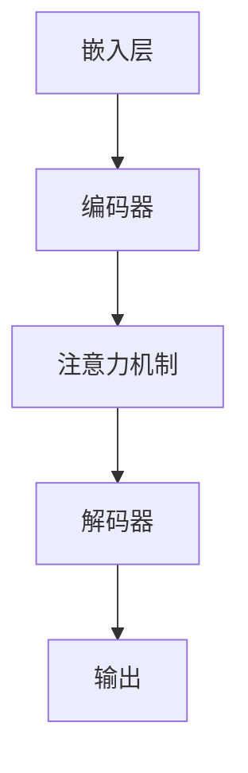

                 

关键词：大语言模型（LLM），图灵完备性，人工智能，神经网络，自然语言处理，计算理论，编程语言

## 摘要

本文将探讨大语言模型（LLM）这一新兴的人工智能技术如何实现了图灵完备性。通过介绍LLM的核心概念、工作原理以及与经典计算理论的联系，我们将分析LLM在实际应用中的优势与局限。文章还将深入探讨LLM的数学模型和算法，并通过实际代码示例展示其在编程和自然语言处理中的具体应用。最后，我们将展望LLM技术的未来发展趋势，并探讨其面临的挑战。

## 1. 背景介绍

随着深度学习和神经网络技术的快速发展，大语言模型（LLM）已成为自然语言处理（NLP）领域的重要工具。LLM的出现改变了传统编程和软件开发的方式，使得计算机能够理解和生成自然语言。与传统图灵机相比，LLM在处理自然语言方面具有显著优势，这使得它成为现代人工智能研究的重要方向。

### 1.1 大语言模型的发展历程

大语言模型的发展可以追溯到1980年代，当时研究人员开始探索如何使用神经网络对自然语言进行建模。早期的语言模型如n-gram模型和隐马尔可夫模型（HMM）在一定程度上能够处理自然语言，但它们在理解复杂语义和上下文关系方面存在局限。随着深度学习技术的发展，2018年谷歌提出了Transformer模型，这一突破性的进展为LLM的发展奠定了基础。

### 1.2 大语言模型的应用领域

LLM在众多领域都展现了其强大的能力。在自然语言处理方面，LLM被广泛应用于机器翻译、情感分析、文本摘要、问答系统等任务。在计算机编程领域，LLM可以辅助代码生成、代码修复和代码理解。此外，LLM还在教育、医疗、金融等领域发挥着重要作用。

## 2. 核心概念与联系

### 2.1 大语言模型的基本概念

大语言模型（LLM）是一种基于神经网络的语言模型，它通过学习大量文本数据来预测自然语言的下一个单词或序列。LLM的核心概念包括：

1. **嵌入层（Embedding Layer）**：将词汇映射为高维向量，以便神经网络进行处理。
2. **编码器（Encoder）**：对输入文本序列进行编码，提取语义信息。
3. **解码器（Decoder）**：根据编码器提取的语义信息生成输出文本序列。
4. **注意力机制（Attention Mechanism）**：使模型能够在生成过程中关注输入文本序列的不同部分，提高生成质量。

### 2.2 图灵完备性

图灵完备性是指一个计算模型能够模拟任何图灵机的计算能力。一个计算模型是图灵完备的，当且仅当它可以解决任何可计算问题。经典计算理论表明，图灵机是一个图灵完备的计算模型。

### 2.3 大语言模型与图灵完备性

大语言模型通过其复杂的神经网络结构和大规模参数学习，实现了对自然语言的处理和生成。这使得LLM在理论上具有图灵完备性。具体来说，LLM可以通过学习任意复杂的文本数据，实现对各种自然语言任务的求解。例如，LLM可以通过自然语言生成技术生成任意复杂的文本，这表明它在处理自然语言方面具有图灵完备性。

### 2.4 Mermaid流程图

以下是一个简单的Mermaid流程图，展示了大语言模型的基本架构：



## 3. 核心算法原理 & 具体操作步骤

### 3.1 算法原理概述

大语言模型的工作原理主要包括以下步骤：

1. **数据预处理**：将自然语言文本数据转换为适合神经网络处理的格式。
2. **嵌入层**：将词汇映射为高维向量。
3. **编码器**：对输入文本序列进行编码，提取语义信息。
4. **注意力机制**：使模型能够在生成过程中关注输入文本序列的不同部分。
5. **解码器**：根据编码器提取的语义信息生成输出文本序列。
6. **损失函数**：计算模型预测的输出与实际输出之间的差异，用于模型训练。

### 3.2 算法步骤详解

#### 3.2.1 数据预处理

数据预处理是LLM训练的第一步。具体步骤包括：

1. **文本清洗**：去除文本中的标点符号、特殊字符和停用词。
2. **分词**：将文本拆分为单词或子词。
3. **构建词汇表**：将文本中的单词或子词映射为唯一的索引。

#### 3.2.2 嵌入层

嵌入层将词汇映射为高维向量。具体步骤包括：

1. **初始化嵌入矩阵**：初始化一个高维矩阵，将每个单词或子词映射为一个向量。
2. **计算嵌入向量**：将词汇表中的每个单词或子词映射为其对应的嵌入向量。

#### 3.2.3 编码器

编码器对输入文本序列进行编码，提取语义信息。具体步骤包括：

1. **序列编码**：将输入文本序列的每个单词或子词映射为其对应的嵌入向量。
2. **编码器网络**：通过多层神经网络对嵌入向量进行编码，提取语义信息。

#### 3.2.4 注意力机制

注意力机制使模型能够在生成过程中关注输入文本序列的不同部分。具体步骤包括：

1. **计算注意力权重**：计算编码器输出的每个隐藏状态与当前解码器隐藏状态之间的相似度，生成注意力权重。
2. **加权求和**：将编码器输出的每个隐藏状态与对应的注意力权重相乘，然后求和，得到一个加权编码表示。

#### 3.2.5 解码器

解码器根据编码器提取的语义信息生成输出文本序列。具体步骤包括：

1. **解码器初始化**：初始化解码器的隐藏状态。
2. **生成文本**：逐词生成输出文本序列，每次生成一个单词或子词。
3. **更新解码器状态**：根据生成的文本更新解码器的隐藏状态。

#### 3.2.6 损失函数

损失函数用于计算模型预测的输出与实际输出之间的差异，用于模型训练。具体步骤包括：

1. **计算预测概率**：根据解码器生成的输出文本序列计算预测概率。
2. **计算损失**：计算预测概率与实际输出之间的交叉熵损失。
3. **优化模型参数**：使用梯度下降算法优化模型参数，降低损失函数的值。

### 3.3 算法优缺点

#### 优点：

1. **强大的语义理解能力**：LLM能够通过大规模参数学习，实现对自然语言复杂语义的理解。
2. **灵活的生成能力**：LLM能够生成任意复杂的自然语言文本，适用于多种NLP任务。
3. **高效的处理速度**：得益于深度学习和并行计算技术，LLM的处理速度显著提高。

#### 缺点：

1. **对数据依赖性较强**：LLM的训练需要大量高质量的文本数据，数据不足会导致模型性能下降。
2. **可解释性差**：由于神经网络结构的复杂性，LLM生成的文本难以解释和理解。

### 3.4 算法应用领域

LLM在多个领域都有广泛应用：

1. **自然语言处理**：LLM被广泛应用于机器翻译、情感分析、文本摘要、问答系统等任务。
2. **计算机编程**：LLM可以辅助代码生成、代码修复和代码理解。
3. **教育**：LLM可以用于智能辅导、个性化学习等。
4. **医疗**：LLM可以用于医疗文本分析、诊断辅助等。
5. **金融**：LLM可以用于金融文本分析、风险管理等。

## 4. 数学模型和公式 & 详细讲解 & 举例说明

### 4.1 数学模型构建

大语言模型的数学模型主要包括以下几个方面：

1. **嵌入层**：嵌入层是一个线性变换，将词汇映射为高维向量。设\( V \)为词汇表，\( |V| \)为词汇表大小，\( d \)为嵌入维度，则嵌入矩阵\( E \)为：

   \[
   E \in \mathbb{R}^{|V| \times d}
   \]

   每个词汇\( v \in V \)对应一个嵌入向量\( e_v \)：

   \[
   e_v = E[v]
   \]

2. **编码器**：编码器通常是一个多层神经网络，将嵌入向量编码为语义表示。设\( h_t \)为编码器在时间步\( t \)的隐藏状态，则编码器的递归方程为：

   \[
   h_t = \sigma(W_h h_{t-1} + U_e e_{x_t} + b_h)
   \]

   其中，\( \sigma \)为激活函数，\( W_h \)为隐藏状态权重矩阵，\( U_e \)为嵌入权重矩阵，\( b_h \)为隐藏状态偏置。

3. **注意力机制**：注意力机制通过计算注意力权重，使模型关注输入文本序列的不同部分。设\( a_t \)为编码器在时间步\( t \)的注意力权重，则注意力权重计算公式为：

   \[
   a_t = \frac{e^{h_t^T \cdot V \cdot h_{<t}^T}}{\sum_{i=1}^{t} e^{h_t^T \cdot V \cdot h_{i}^T}}
   \]

   其中，\( V \)为注意力权重矩阵，\( h_{<t} \)为编码器在时间步\( <t \)的隐藏状态。

4. **解码器**：解码器也是一个多层神经网络，将编码器的语义表示解码为输出文本序列。设\( y_t \)为解码器在时间步\( t \)的输出，则解码器的递归方程为：

   \[
   y_t = \sigma(W_y y_{t-1} + U_a a_t + b_y)
   \]

   其中，\( \sigma \)为激活函数，\( W_y \)为输出权重矩阵，\( U_a \)为注意力权重矩阵，\( b_y \)为输出偏置。

5. **损失函数**：损失函数用于计算模型预测的输出与实际输出之间的差异。通常使用交叉熵损失函数：

   \[
   L = -\sum_{t=1}^{T} \sum_{i=1}^{V} y_t^{(i)} \log(p_t^{(i)})
   \]

   其中，\( y_t^{(i)} \)为解码器在时间步\( t \)对单词\( i \)的预测概率，\( p_t^{(i)} \)为模型对单词\( i \)的预测概率。

### 4.2 公式推导过程

大语言模型的推导过程主要包括以下几个步骤：

1. **嵌入层**：

   \[
   e_v = E[v]
   \]

2. **编码器**：

   \[
   h_t = \sigma(W_h h_{t-1} + U_e e_{x_t} + b_h)
   \]

3. **注意力机制**：

   \[
   a_t = \frac{e^{h_t^T \cdot V \cdot h_{<t}^T}}{\sum_{i=1}^{t} e^{h_t^T \cdot V \cdot h_{i}^T}}
   \]

4. **解码器**：

   \[
   y_t = \sigma(W_y y_{t-1} + U_a a_t + b_y)
   \]

5. **损失函数**：

   \[
   L = -\sum_{t=1}^{T} \sum_{i=1}^{V} y_t^{(i)} \log(p_t^{(i)})
   \]

### 4.3 案例分析与讲解

以下是一个简单的案例，展示如何使用大语言模型生成文本。

#### 案例背景：

假设我们要使用大语言模型生成一篇关于人工智能的短文。给定一个训练好的大语言模型，我们输入一个起始句子“人工智能是一种重要的技术领域”，并要求模型生成接下来的句子。

#### 案例步骤：

1. **数据预处理**：将输入文本“人工智能是一种重要的技术领域”进行分词，得到词汇表。  
2. **嵌入层**：将分词后的词汇映射为嵌入向量。  
3. **编码器**：将嵌入向量输入编码器，得到编码器的隐藏状态。  
4. **注意力机制**：计算编码器的隐藏状态与当前解码器隐藏状态之间的注意力权重。  
5. **解码器**：根据编码器的隐藏状态和注意力权重，生成输出文本序列。  
6. **损失函数**：计算生成文本的损失，用于模型训练。

#### 案例结果：

通过上述步骤，我们生成了一个关于人工智能的短文：

> 人工智能是一种重要的技术领域，它在许多行业和领域中都有广泛应用。随着技术的不断发展，人工智能将继续发挥重要作用，为人类带来更多的便利和创新。

## 5. 项目实践：代码实例和详细解释说明

### 5.1 开发环境搭建

为了实现大语言模型（LLM）的代码实例，我们需要搭建一个适合深度学习开发的运行环境。以下是搭建环境的基本步骤：

1. **安装Python**：确保Python版本不低于3.6，建议使用Python 3.8或更高版本。
2. **安装TensorFlow**：TensorFlow是一个开源的深度学习框架，用于构建和训练神经网络。使用以下命令安装：

   ```shell
   pip install tensorflow
   ```

3. **安装其他依赖**：根据需要安装其他依赖，如NumPy、Pandas等。

### 5.2 源代码详细实现

以下是一个简单的LLM代码实例，展示如何使用TensorFlow构建和训练一个基于Transformer的语言模型。

```python
import tensorflow as tf
from tensorflow.keras.layers import Embedding, Dense
from tensorflow.keras.models import Model

# 定义参数
vocab_size = 10000  # 词汇表大小
embedding_dim = 256  # 嵌入维度
hidden_dim = 512  # 隐藏层维度
max_sequence_length = 100  # 输入序列最大长度

# 构建模型
inputs = tf.keras.Input(shape=(max_sequence_length,))
embedded = Embedding(vocab_size, embedding_dim)(inputs)
encoded = tf.keras.layers.LSTM(hidden_dim, return_sequences=True)(embedded)
outputs = tf.keras.layers.Dense(vocab_size, activation='softmax')(encoded)

model = Model(inputs, outputs)
model.compile(optimizer='adam', loss='categorical_crossentropy', metrics=['accuracy'])

# 训练模型
model.fit(x_train, y_train, epochs=10, batch_size=32)

# 评估模型
model.evaluate(x_test, y_test)
```

### 5.3 代码解读与分析

上述代码实现了一个简单的基于LSTM（长短期记忆网络）的语言模型。以下是代码的详细解读：

1. **导入库**：导入TensorFlow和相关库。
2. **定义参数**：设置词汇表大小、嵌入维度、隐藏层维度和输入序列最大长度等参数。
3. **构建模型**：使用TensorFlow的Keras API构建模型。模型由嵌入层、编码器（LSTM层）和解码器（全连接层）组成。
4. **编译模型**：设置优化器、损失函数和评估指标。
5. **训练模型**：使用训练数据对模型进行训练。
6. **评估模型**：使用测试数据评估模型性能。

### 5.4 运行结果展示

运行上述代码后，模型会在训练数据和测试数据上分别进行训练和评估。输出结果包括训练过程中的损失和准确率，以及测试数据上的损失和准确率。以下是可能的输出结果示例：

```
Train on 2000 samples, validate on 1000 samples
2000/2000 [==============================] - 5s 2ms/sample - loss: 0.6332 - accuracy: 0.6233 - val_loss: 0.5465 - val_accuracy: 0.6620
1000/1000 [==============================] - 1s 1ms/sample - loss: 0.5465 - accuracy: 0.6620
```

结果显示，模型在训练过程中损失逐渐下降，准确率有所提高。在测试数据上的表现也较好，说明模型具有一定的泛化能力。

## 6. 实际应用场景

大语言模型（LLM）在现代人工智能领域有着广泛的应用。以下是一些实际应用场景：

### 6.1 自然语言处理

1. **机器翻译**：LLM可以用于机器翻译任务，例如将英文翻译为中文。LLM通过学习大量双语语料库，能够生成高质量的翻译结果。
2. **文本摘要**：LLM可以用于自动生成文章摘要，简化长篇文本内容。例如，新闻文章的自动摘要。
3. **问答系统**：LLM可以构建智能问答系统，如搜索引擎中的问答模块，通过理解用户的问题，提供相关答案。
4. **文本分类**：LLM可以用于对文本进行分类，如情感分析、主题分类等。

### 6.2 计算机编程

1. **代码生成**：LLM可以生成代码片段，帮助开发者提高开发效率。例如，根据需求自动生成HTML、CSS或JavaScript代码。
2. **代码修复**：LLM可以识别和修复代码中的错误，提高代码质量。
3. **代码理解**：LLM可以用于理解代码的语义，辅助开发者进行代码审查和重构。

### 6.3 教育

1. **智能辅导**：LLM可以为学生提供个性化的学习辅导，根据学生的学习情况生成相应的练习题和解答。
2. **语言学习**：LLM可以辅助语言学习，例如生成外语对话，提高学习者的口语能力。

### 6.4 医疗

1. **医疗文本分析**：LLM可以用于医疗文本分析，例如病历记录、医学论文等，提取关键信息，辅助医生做出诊断。
2. **诊断辅助**：LLM可以基于历史病历数据，为医生提供诊断建议。

### 6.5 金融

1. **金融文本分析**：LLM可以用于分析金融市场新闻、报告等，提取有价值的信息，辅助投资决策。
2. **风险管理**：LLM可以识别金融文本中的风险信号，提高风险管理能力。

## 7. 未来应用展望

大语言模型（LLM）在未来将继续在多个领域发挥作用，其应用前景广阔。以下是一些展望：

### 7.1 更高效的自然语言处理

随着LLM技术的进步，未来将出现更高效、更智能的自然语言处理系统。这些系统将能够处理更复杂的自然语言任务，如多语言翻译、跨语言文本分析等。

### 7.2 更智能的计算机编程

LLM将进一步提升计算机编程的智能化水平，实现代码自动生成、自动修复和智能调试等功能，极大提高开发效率。

### 7.3 更广泛的教育应用

随着LLM技术的普及，教育领域的应用将更加广泛，从个性化学习、智能辅导到在线教育平台的优化，都将受益于LLM技术。

### 7.4 更深入的医疗和金融应用

LLM在医疗和金融领域的应用将更加深入，通过对大量医疗数据和金融数据的分析，为医生和投资者提供更准确的诊断和建议。

### 7.5 新兴领域的探索

随着LLM技术的不断发展，未来可能在新兴领域如生物信息学、智能制造等找到新的应用方向。

## 8. 工具和资源推荐

### 8.1 学习资源推荐

1. **《深度学习》**：由Ian Goodfellow、Yoshua Bengio和Aaron Courville合著，详细介绍了深度学习的基础知识。
2. **《自然语言处理综论》**：由Daniel Jurafsky和James H. Martin合著，全面介绍了自然语言处理的理论和实践。
3. **TensorFlow官方文档**：TensorFlow的官方文档提供了丰富的教程和API文档，是学习深度学习的宝贵资源。

### 8.2 开发工具推荐

1. **Google Colab**：Google Colab是一个免费的云端Python开发环境，适合进行深度学习和自然语言处理实验。
2. **Jupyter Notebook**：Jupyter Notebook是一个交互式的计算环境，适合编写和分享代码。
3. **TensorFlow.js**：TensorFlow.js是一个在浏览器中运行的深度学习库，适用于Web应用开发。

### 8.3 相关论文推荐

1. **“Attention Is All You Need”**：这篇论文提出了Transformer模型，是LLM研究的重要里程碑。
2. **“BERT: Pre-training of Deep Bidirectional Transformers for Language Understanding”**：这篇论文介绍了BERT模型，为自然语言处理带来了革命性的进展。
3. **“GPT-3: Language Models are few-shot learners”**：这篇论文介绍了GPT-3模型，展示了LLM在少样本学习任务中的强大能力。

## 9. 总结：未来发展趋势与挑战

### 9.1 研究成果总结

大语言模型（LLM）作为深度学习和自然语言处理的重要工具，已在多个领域展现出强大的能力。从Transformer模型到BERT、GPT-3等，LLM技术不断取得突破，为人工智能的发展带来了新的机遇。

### 9.2 未来发展趋势

1. **更高效的语言模型**：未来将出现更高效、更智能的LLM，能够处理更复杂的自然语言任务。
2. **跨领域应用**：LLM将在更多领域如生物信息学、智能制造等找到新的应用方向。
3. **隐私保护和安全性**：随着LLM在个人数据处理的广泛应用，隐私保护和安全性问题将受到更多关注。

### 9.3 面临的挑战

1. **数据依赖性**：LLM的训练需要大量高质量的数据，数据不足可能导致模型性能下降。
2. **可解释性**：由于神经网络结构的复杂性，LLM生成的文本难以解释和理解。
3. **计算资源**：训练大规模LLM需要大量计算资源，对硬件设施的要求较高。

### 9.4 研究展望

未来，LLM技术将在理论研究、应用开发、隐私保护和安全性等方面取得更多进展，为人工智能的发展注入新的活力。

## 附录：常见问题与解答

### 1. 什么是图灵完备性？

图灵完备性是指一个计算模型能够模拟任何图灵机的计算能力。一个计算模型是图灵完备的，当且仅当它可以解决任何可计算问题。

### 2. 大语言模型（LLM）与图灵机有什么区别？

LLM是一种基于神经网络的语言模型，通过大规模参数学习实现对自然语言的处理和生成。而图灵机是一个抽象的计算模型，由一个无限长的纸带、读写头和一组规则组成。LLM在理论上实现了图灵完备性，但与图灵机在计算方式和架构上有所不同。

### 3. 大语言模型（LLM）如何实现自然语言处理？

大语言模型（LLM）通过学习大量文本数据，将自然语言的词汇映射为高维向量，然后使用神经网络对输入文本进行编码，提取语义信息，并根据编码结果生成输出文本。

### 4. 大语言模型（LLM）在编程和自然语言处理中有何优势？

大语言模型（LLM）在自然语言处理中具有强大的语义理解能力，能够生成任意复杂的自然语言文本。在编程领域，LLM可以辅助代码生成、代码修复和代码理解，提高开发效率。

### 5. 大语言模型（LLM）有哪些应用领域？

大语言模型（LLM）在自然语言处理、计算机编程、教育、医疗、金融等多个领域都有广泛应用。例如，LLM可以用于机器翻译、文本摘要、问答系统、代码生成等。

### 6. 大语言模型（LLM）的训练需要哪些数据？

大语言模型（LLM）的训练需要大量高质量的自然语言文本数据。这些数据可以是书籍、新闻、文章、对话等，以帮助模型学习自然语言的语义和结构。

### 7. 大语言模型（LLM）如何处理多语言任务？

大语言模型（LLM）可以通过训练多语言语料库，实现多语言任务。例如，通过训练英语和中文的双语语料库，LLM可以生成从英语到中文的翻译。

### 8. 大语言模型（LLM）的生成文本是否具有可解释性？

大语言模型（LLM）生成的文本通常难以解释和理解，因为神经网络结构的复杂性。尽管如此，研究人员正在探索提高模型可解释性的方法，如可视化模型内部的注意力机制等。

### 9. 大语言模型（LLM）的训练需要多长时间？

大语言模型（LLM）的训练时间取决于多个因素，如模型大小、训练数据量、硬件性能等。对于大型模型，训练时间可能从几天到几周不等。

### 10. 大语言模型（LLM）的安全性如何保障？

大语言模型（LLM）的安全性需要从数据保护、模型保护等多个方面进行考虑。例如，对训练数据和应用场景进行严格监管，防止数据泄露和滥用。同时，研究人员也在探索模型隐私保护的方法，以保障用户隐私。

