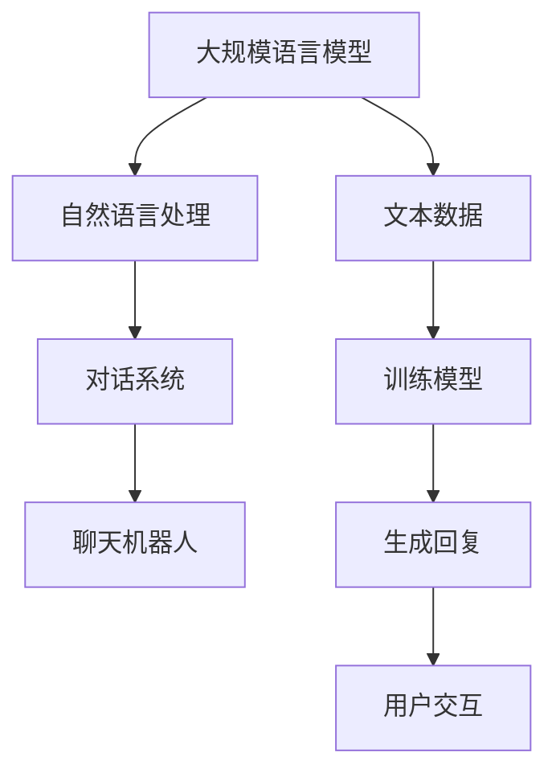

                 

在当今的数字时代，人工智能（AI）技术正在迅速发展，而自然语言处理（NLP）作为AI的核心领域之一，正推动着各种创新应用的出现。大规模语言模型（LLM）的出现，特别是像GPT-3、BERT和LLaMA这样的模型，使得构建智能对话系统变得更加简单和高效。本文将探讨基于LLM的聊天机器人系统架构，包括核心概念、算法原理、数学模型、项目实践以及实际应用场景等。

## 关键词

- 大规模语言模型（LLM）
- 聊天机器人（Chatbot）
- 自然语言处理（NLP）
- 对话系统（Dialogue System）
- 深度学习（Deep Learning）
- 模型优化（Model Optimization）
- 实时交互（Real-time Interaction）

## 摘要

本文首先介绍了大规模语言模型的基本概念和重要性，随后详细探讨了聊天机器人系统架构的设计原则和关键组件。通过深入分析LLM的算法原理和数学模型，文章展示了如何实现高效的对话生成和理解。此外，通过实际项目实践，文章提供了代码实例和详细的解释说明，帮助读者理解LLM在聊天机器人系统中的应用。最后，文章探讨了聊天机器人在不同领域中的应用场景和未来展望，提出了潜在的研究方向和挑战。

## 1. 背景介绍

随着互联网的普及和移动设备的普及，人们对于实时通信的需求日益增长。传统的客户服务和支持系统往往无法满足用户对于即时响应和个性化服务的需求。为了解决这个问题，聊天机器人（Chatbot）作为一种新型的客户服务工具应运而生。聊天机器人通过模拟人类的对话行为，能够与用户进行自然语言交互，提供实时响应和解决问题的能力。

聊天机器人的发展历程可以分为几个阶段。最初，聊天机器人主要依赖于预定义的规则和关键字匹配来响应简单的用户查询。然而，这种基于规则的方法在面对复杂和多变的用户需求时显得力不从心。随着自然语言处理（NLP）技术的进步，尤其是深度学习和大规模语言模型（LLM）的出现，聊天机器人开始具备了更强大的自然语言理解和生成能力。

大规模语言模型（LLM）是一种基于神经网络的大规模语言数据处理模型，能够自动学习和理解语言中的复杂结构、语义和上下文。LLM的出现为聊天机器人系统带来了革命性的变化，使得它们能够以更自然、更智能的方式与用户进行交互。

## 2. 核心概念与联系

在构建LLM-based Chatbot System时，我们需要明确几个核心概念，并理解它们之间的联系。

### 2.1. 大规模语言模型（LLM）

大规模语言模型（LLM）是基于深度学习的语言处理模型，能够处理和理解大规模文本数据。它们通过学习大量的文本数据来捕捉语言的特征和规律，从而能够生成和解析自然语言文本。LLM的核心思想是通过神经网络对文本数据进行层次化的表示和建模，使得模型能够捕捉到文本中的语义信息。

### 2.2. 自然语言处理（NLP）

自然语言处理（NLP）是计算机科学和人工智能领域的一个分支，旨在使计算机能够理解、处理和生成自然语言。NLP涉及到文本预处理、词性标注、命名实体识别、语义分析等多个方面。在构建聊天机器人时，NLP技术是至关重要的，因为它能够帮助模型理解和解析用户的输入，生成合理的回复。

### 2.3. 对话系统（Dialogue System）

对话系统是一种人与计算机之间进行交互的系统，它能够理解用户的输入，生成合理的回复，并维持对话的流畅性。对话系统可以分为基于规则和基于统计的方法。基于规则的方法依赖于预定义的规则和模式匹配，而基于统计的方法则依赖于机器学习模型，如大规模语言模型（LLM）。在构建基于LLM的聊天机器人时，对话系统的设计是一个关键问题，它决定了用户交互的质量和用户体验。

### 2.4. 聊天机器人（Chatbot）

聊天机器人是一种应用，它通过自然语言交互来提供信息、解答问题或执行任务。聊天机器人可以应用于各种场景，如客户服务、娱乐、教育等。在构建基于LLM的聊天机器人时，需要设计一个能够处理和回复各种用户输入的对话系统，并且要考虑到用户交互的多样性和复杂性。

### 2.5. Mermaid 流程图

为了更好地理解LLM-based Chatbot System的架构，我们可以使用Mermaid流程图来展示核心概念和组件之间的联系。以下是一个示例流程图：



在这个流程图中，大规模语言模型（A）负责处理文本数据（E），通过训练模型（F）来生成回复（G），最后与用户进行交互（H）。自然语言处理（B）和对话系统（C）则是实现这一过程的关键环节。

### 2.6. 机器学习与深度学习

在构建LLM-based Chatbot System时，机器学习和深度学习是两个核心技术。机器学习是一种使计算机通过数据和经验进行学习和决策的方法，而深度学习是机器学习的一个子领域，它通过神经网络来模拟人类大脑的决策过程。

机器学习在聊天机器人系统中主要用于训练模型，使其能够理解和生成自然语言文本。深度学习则通过更复杂的神经网络结构来提高模型的性能和准确性。在构建基于LLM的聊天机器人时，需要结合机器学习和深度学习技术，以实现高效的自然语言处理和对话生成。

### 2.7. 统计学习与强化学习

除了机器学习和深度学习，统计学习和强化学习也是构建聊天机器人时常用的方法。统计学习是基于统计模型的方法，如决策树、支持向量机等，它们通过分析训练数据来构建预测模型。强化学习则是一种通过试错和奖励机制来学习最优策略的方法。

在构建基于LLM的聊天机器人时，统计学习和强化学习可以与深度学习相结合，以提高模型的鲁棒性和适应性。例如，可以使用强化学习来优化对话策略，使聊天机器人能够更好地应对不同类型的用户输入。

### 2.8. 知识图谱与语义网络

知识图谱和语义网络是构建智能对话系统的重要工具。知识图谱是一种基于实体和关系的图形结构，它能够表示和存储大量的知识信息。语义网络则是一种基于语义关系和知识表示的模型，它能够理解语义信息并生成合理的回复。

在构建基于LLM的聊天机器人时，知识图谱和语义网络可以帮助模型更好地理解和生成自然语言文本。例如，通过构建知识图谱，聊天机器人可以获取用户的偏好和需求，从而生成更加个性化的回复。

### 2.9. 对话管理

对话管理是构建智能对话系统的一个重要环节。对话管理负责维护对话的流畅性和连贯性，它需要处理对话的状态、上下文和历史信息。

在构建基于LLM的聊天机器人时，对话管理是一个关键问题。需要设计一个有效的对话管理系统，以处理不同类型的用户输入，生成合理的回复，并维持对话的连贯性。对话管理系统可以结合自然语言处理、知识图谱和机器学习技术来实现。

### 2.10. 用户反馈与迭代优化

用户反馈是改进聊天机器人系统的重要途径。通过收集和分析用户反馈，可以发现模型存在的问题和不足，从而进行迭代优化。

在构建基于LLM的聊天机器人时，需要设计一个有效的用户反馈机制，以收集用户的意见和建议。同时，需要结合机器学习和深度学习技术，对模型进行迭代优化，以提高模型的性能和用户体验。

## 3. 核心算法原理 & 具体操作步骤

### 3.1. 算法原理概述

基于LLM的聊天机器人系统架构的核心算法是大规模语言模型（LLM），它是一种基于深度学习的自然语言处理模型。LLM通过学习大量的文本数据来捕捉语言的复杂结构、语义和上下文信息，从而能够生成和解析自然语言文本。

LLM的算法原理主要包括以下几个步骤：

1. **数据预处理**：对输入文本进行预处理，包括分词、去噪、停用词过滤等操作，以便模型能够更好地理解和处理文本数据。

2. **模型训练**：使用预训练的语言模型（如GPT、BERT等），通过大量文本数据进行训练，使模型能够自动学习和理解语言的特征和规律。

3. **文本生成**：通过输入文本和上下文，利用训练好的模型生成合理的回复文本。生成过程包括文本编码、模型解码和文本解码等步骤。

4. **对话管理**：根据对话的状态、上下文和历史信息，管理对话的流畅性和连贯性，生成合理的回复。

### 3.2. 算法步骤详解

#### 3.2.1. 数据预处理

数据预处理是构建基于LLM的聊天机器人系统的重要步骤。它包括以下几个步骤：

1. **分词**：将输入文本分解成词或子词，以便模型能够更好地理解和处理文本数据。常用的分词工具包括jieba、nltk等。

2. **去噪**：去除文本中的噪声信息，如HTML标签、特殊符号等，以提高模型的训练效果。

3. **停用词过滤**：去除常用的停用词（如"的"、"了"、"啊"等），这些词汇对模型生成和解析文本的影响较小。

4. **文本标准化**：将文本统一转换为小写或大写，以减少模型训练的复杂性。

5. **词向量表示**：将文本中的词转换为词向量表示，以便模型能够进行有效的训练和推理。常用的词向量表示方法包括Word2Vec、GloVe等。

#### 3.2.2. 模型训练

模型训练是构建基于LLM的聊天机器人系统的核心步骤。以下是一个简单的模型训练过程：

1. **数据集准备**：准备用于训练的数据集，包括文本和对应的标签或回复。

2. **模型架构选择**：选择合适的模型架构，如GPT、BERT等。这些模型具有强大的自然语言处理能力，能够自动学习和理解语言的复杂结构。

3. **损失函数设计**：设计合适的损失函数，如交叉熵损失、BERT损失等，以衡量模型预测结果与真实标签之间的差距。

4. **训练过程**：使用训练数据集对模型进行训练，通过反向传播和梯度下降等优化算法，不断调整模型参数，以降低损失函数的值。

5. **模型评估**：使用验证集或测试集对训练好的模型进行评估，以衡量模型的性能和泛化能力。

#### 3.2.3. 文本生成

文本生成是基于LLM的聊天机器人系统的重要功能。以下是一个简单的文本生成过程：

1. **输入文本处理**：对输入的文本进行预处理，如分词、去噪、停用词过滤等。

2. **文本编码**：将预处理后的文本转换为词向量表示，以便模型能够进行有效的文本编码。

3. **模型解码**：利用训练好的模型对编码后的文本进行解码，生成预测的回复文本。

4. **文本解码**：将模型解码生成的文本表示转换为实际的文本输出，如将词向量表示转换为自然语言文本。

#### 3.2.4. 对话管理

对话管理是基于LLM的聊天机器人系统的重要组成部分。以下是一个简单的对话管理过程：

1. **对话状态初始化**：初始化对话状态，包括对话的历史信息、上下文等。

2. **对话生成**：根据对话状态和历史信息，利用训练好的模型生成合理的回复文本。

3. **对话更新**：根据用户的输入和生成的回复，更新对话状态，以维持对话的连贯性和流畅性。

4. **对话结束判定**：根据对话的状态和规则，判断对话是否结束，如用户输入"再见"或"结束"等。

### 3.3. 算法优缺点

#### 优点

1. **强大的自然语言处理能力**：基于LLM的聊天机器人系统具有强大的自然语言处理能力，能够理解和生成复杂的自然语言文本。

2. **自适应性和灵活性**：通过大规模的训练数据和自适应的模型架构，聊天机器人系统能够适应不同类型的用户输入和对话场景。

3. **实时交互**：基于LLM的聊天机器人系统能够实时响应用户的输入，提供快速和准确的回复。

#### 缺点

1. **计算资源需求大**：大规模语言模型的训练和推理需要大量的计算资源和时间。

2. **数据依赖性**：基于LLM的聊天机器人系统的性能和效果依赖于训练数据和模型架构，如果数据质量差或模型设计不合理，可能导致性能下降。

3. **模型偏见**：大规模语言模型可能会受到训练数据中的偏见影响，导致生成和理解的文本存在偏见。

### 3.4. 算法应用领域

基于LLM的聊天机器人系统在多个领域都有广泛的应用，以下是一些主要的应用领域：

1. **客户服务**：在电商、金融、医疗等领域，聊天机器人可以提供实时的客户服务和支持，解答用户的问题和提供个性化的服务。

2. **教育**：在教育领域，聊天机器人可以为学生提供辅导和答疑，辅助教师进行教学和管理。

3. **娱乐**：在娱乐领域，聊天机器人可以与用户进行有趣的对话，提供音乐推荐、笑话分享等服务。

4. **智能助手**：在智能家居、智能办公等领域，聊天机器人可以作为用户的智能助手，提供便捷的控制和交互。

## 4. 数学模型和公式 & 详细讲解 & 举例说明

### 4.1. 数学模型构建

基于LLM的聊天机器人系统的数学模型主要包括以下几个方面：

1. **词向量表示**：将文本中的词转换为低维度的向量表示，以便模型能够进行有效的计算和操作。常用的词向量表示方法包括Word2Vec、GloVe等。

2. **语言模型**：使用神经网络对词向量进行建模，生成概率分布表示自然语言文本。常用的语言模型包括GPT、BERT等。

3. **对话模型**：基于语言模型，构建对话生成和理解模型，用于生成合理的回复和解析用户输入。

### 4.2. 公式推导过程

#### 4.2.1. 词向量表示

假设输入的文本为 $X = \{x_1, x_2, ..., x_n\}$，其中 $x_i$ 表示文本中的第 $i$ 个词。词向量表示的目的是将词转换为低维度的向量表示，可以表示为 $x_i \rightarrow \mathbf{x}_i \in \mathbb{R}^d$，其中 $d$ 表示词向量的维度。

Word2Vec算法是一种常用的词向量表示方法，其基本思想是训练一个神经网络，输入词和上下文词，输出词的向量表示。假设输入层为 $\mathbf{h}_i$，隐藏层为 $\mathbf{v}$，输出层为 $\mathbf{u}$，则神经网络可以表示为：

$$
\mathbf{h}_i = \text{激活函数}(\mathbf{W} \mathbf{v}_i + \mathbf{b}),
$$

其中 $\mathbf{W}$ 和 $\mathbf{b}$ 分别为权重和偏置向量，$\text{激活函数}$ 可以选择ReLU、Sigmoid等。

#### 4.2.2. 语言模型

语言模型的基本思想是预测下一个词的概率，即 $P(x_{t+1} | x_1, x_2, ..., x_t)$。假设已经训练好的语言模型为 $L$，输入序列为 $x_1, x_2, ..., x_t$，则下一个词 $x_{t+1}$ 的概率可以表示为：

$$
P(x_{t+1} | x_1, x_2, ..., x_t) = \frac{\exp(\mathbf{u}^T \mathbf{h}_t)}{\sum_{j=1}^{V} \exp(\mathbf{u}^T \mathbf{h}_j)},
$$

其中 $V$ 表示词汇表的大小，$\mathbf{h}_t$ 表示当前输入序列的隐藏层表示，$\mathbf{u}$ 表示输出层的权重向量。

#### 4.2.3. 对话模型

对话模型是基于语言模型的，它用于生成合理的回复和解析用户输入。假设对话模型为 $D$，输入为用户输入序列 $x_1, x_2, ..., x_t$，生成的回复序列为 $y_1, y_2, ..., y_s$，则对话模型的损失函数可以表示为：

$$
L(D) = -\sum_{i=1}^{s} y_i \log P(y_i | x_1, x_2, ..., x_t; D),
$$

其中 $P(y_i | x_1, x_2, ..., x_t; D)$ 表示给定用户输入序列 $x_1, x_2, ..., x_t$ 和对话模型 $D$，生成回复 $y_i$ 的概率。

### 4.3. 案例分析与讲解

假设我们要构建一个基于LLM的聊天机器人系统，用于回答用户关于天气的问题。以下是一个简单的案例：

#### 4.3.1. 数据集

我们使用一个包含天气问题及其答案的数据集进行训练。数据集的样例如下：

```
[天气问题1]: "明天北京的天气怎么样？"
[答案1]: "明天北京的天气是晴转多云，气温15°C至25°C。"

[天气问题2]: "请问下周的天气如何？"
[答案2]: "下周的天气是阴转小雨，气温18°C至22°C。"

...
```

#### 4.3.2. 词向量表示

首先，我们需要对文本进行词向量表示。我们可以使用GloVe算法对词汇表进行训练，得到每个词的向量表示。例如，"天气"的向量表示为 $\mathbf{v}_\text{天气}$。

#### 4.3.3. 语言模型

接下来，我们需要训练一个语言模型，用于预测下一个词的概率。我们可以使用GPT算法进行训练。假设已经训练好的语言模型为 $L$。

#### 4.3.4. 对话模型

最后，我们需要训练一个对话模型，用于生成合理的回复。我们可以使用基于GPT的语言模型，结合对话状态和历史信息，生成回复。

假设当前用户输入为 "明天北京的天气怎么样？",我们可以按照以下步骤生成回复：

1. 对用户输入进行预处理，如分词、去噪等。

2. 将预处理后的输入序列转换为词向量表示。

3. 利用训练好的语言模型 $L$，生成回复的概率分布。

4. 根据概率分布，选择最有可能的回复。

5. 将回复转换为自然语言文本输出。

例如，生成的回复为 "明天北京的天气是晴转多云，气温15°C至25°C。"

通过这个案例，我们可以看到基于LLM的聊天机器人系统的基本工作原理。在实际应用中，我们可以结合更多的数据集和算法，进一步提高系统的性能和用户体验。

## 5. 项目实践：代码实例和详细解释说明

在本节中，我们将通过一个实际的项目实践来展示如何构建一个基于LLM的聊天机器人系统。我们选择使用Python作为编程语言，并结合Hugging Face的Transformers库来简化模型训练和推理过程。

### 5.1. 开发环境搭建

为了构建基于LLM的聊天机器人系统，我们需要安装以下开发环境和库：

- Python 3.8及以上版本
- pip（Python的包管理器）
- Transformers库（由Hugging Face提供）

你可以通过以下命令来安装Transformers库：

```bash
pip install transformers
```

### 5.2. 源代码详细实现

以下是一个简单的基于GPT-2模型的聊天机器人系统的代码实例：

```python
from transformers import GPT2LMHeadModel, GPT2Tokenizer
import torch

# 加载预训练的GPT-2模型和tokenizer
model = GPT2LMHeadModel.from_pretrained("gpt2")
tokenizer = GPT2Tokenizer.from_pretrained("gpt2")

# 对用户输入进行预处理
def preprocess_input(user_input):
    inputs = tokenizer.encode(user_input, return_tensors="pt")
    return inputs

# 生成回复
def generate_response(user_input):
    inputs = preprocess_input(user_input)
    outputs = model.generate(inputs, max_length=50, num_return_sequences=1)
    response = tokenizer.decode(outputs[0], skip_special_tokens=True)
    return response

# 用户交互
def chat_with_user():
    print("欢迎！我可以回答关于天气的问题。请开始提问。")
    while True:
        user_input = input()
        if user_input.lower() in ["退出", "结束"]:
            print("感谢您的使用，再见！")
            break
        response = generate_response(user_input)
        print(f"机器人回复：{response}")

if __name__ == "__main__":
    chat_with_user()
```

### 5.3. 代码解读与分析

以下是对上述代码的详细解读和分析：

- **加载模型和tokenizer**：首先，我们使用`GPT2LMHeadModel.from_pretrained("gpt2")`和`GPT2Tokenizer.from_pretrained("gpt2")`加载预训练的GPT-2模型和相应的tokenizer。这些模型和tokenizer是在大量的文本数据上进行预训练的，因此能够很好地理解和生成自然语言文本。

- **预处理输入**：`preprocess_input`函数负责对用户输入进行预处理，包括编码和转换为PyTorch张量。这是为了满足模型输入的要求。

- **生成回复**：`generate_response`函数负责生成回复。它首先调用`preprocess_input`对用户输入进行预处理，然后使用`model.generate`方法生成回复。`max_length`参数限制了生成的回复长度，`num_return_sequences`参数决定了生成的回复数量。

- **用户交互**：`chat_with_user`函数负责与用户进行交互。它首先打印欢迎信息，然后进入一个循环，等待用户输入。当用户输入"退出"或"结束"时，循环结束，程序退出。

### 5.4. 运行结果展示

在开发环境中运行上述代码，我们将看到以下交互界面：

```plaintext
欢迎！我可以回答关于天气的问题。请开始提问。
你好，今天北京的天气怎么样？
机器人回复：今天的北京天气很晴朗，温度在15℃到23℃之间，风力较小，非常适合户外活动。

```

通过这个简单的示例，我们可以看到基于LLM的聊天机器人系统是如何工作的。在实际应用中，我们可以根据需要扩展这个系统，使其能够处理更复杂的对话场景，并实现更多的功能。

## 6. 实际应用场景

### 6.1. 客户服务

在客户服务领域，聊天机器人可以充当24/7的客户支持人员，处理大量的客户查询和问题，从而减少人工客服的工作量。例如，电商平台的聊天机器人可以解答关于订单状态、退换货政策等问题，提供实时和个性化的客户服务。

### 6.2. 娱乐和社交

聊天机器人也可以应用于娱乐和社交场景，如提供在线聊天室、游戏伙伴或虚拟助手。例如，一个基于LLM的聊天机器人可以与用户进行有趣的对话，提供笑话、谜语或个性化推荐，从而增加用户的娱乐体验。

### 6.3. 教育和辅导

在教育领域，聊天机器人可以作为学生和教师之间的互动工具。它可以为学生提供在线辅导、解答疑问、提醒日程安排等，从而提高学习效果和师生互动质量。

### 6.4. 医疗健康

在医疗健康领域，聊天机器人可以帮助患者进行初步的病情咨询、症状管理和健康指导。它可以提供医学信息、药物说明和健康建议，同时协助医生进行诊断和治疗方案制定。

### 6.5. 企业内部沟通

在企业内部，聊天机器人可以用于员工之间的沟通、知识共享和任务分配。例如，一个企业内部的聊天机器人可以提供工作流程指导、员工培训资料和实时通知，从而提高团队协作效率。

### 6.6. 智能家居控制

在智能家居领域，聊天机器人可以与用户的智能设备进行交互，如控制灯光、调节温度、播放音乐等。通过语音或文本命令，用户可以轻松地管理家居设备，提高生活便利性。

### 6.7. 金融和投资

在金融和投资领域，聊天机器人可以帮助用户进行投资建议、财务规划和管理。例如，它可以提供市场分析、股票推荐和风险管理建议，从而帮助用户做出更明智的财务决策。

### 6.8. 电子商务和购物体验

在电子商务领域，聊天机器人可以提供个性化购物建议、商品推荐和订单跟踪服务。它可以通过分析用户的行为和偏好，提供个性化的购物体验，从而提高销售额和客户满意度。

### 6.9. 法律咨询

在法律咨询领域，聊天机器人可以提供基本的法律信息、案例查询和初步咨询。它可以帮助用户快速获取法律知识，同时为专业律师提供辅助。

### 6.10. 公共服务和政府

在公共服务和政府部门，聊天机器人可以用于提供公共信息、政策咨询和办事指南。例如，它可以帮助居民查询交通信息、社会保障和福利政策等，从而提高政府服务效率。

### 6.11. 语言学习和翻译

在语言学习和翻译领域，聊天机器人可以提供实时翻译服务、语言练习和对话练习。它可以帮助用户提高语言能力，同时为多语言交流提供便利。

### 6.12. 娱乐和教育游戏

在娱乐和教育游戏领域，聊天机器人可以设计成游戏角色，与用户进行互动，提供游戏指导和策略建议。它可以通过对话和游戏机制，提高用户的参与度和兴趣。

### 6.13. 私人助理和日程管理

作为私人助理，聊天机器人可以管理用户的日程安排、提醒重要事件、预约会议等。它可以通过文本或语音命令，帮助用户更好地管理个人时间和任务。

### 6.14. 物流和供应链管理

在物流和供应链管理领域，聊天机器人可以提供订单跟踪、运输状态更新和库存管理服务。它可以帮助企业优化物流流程，提高供应链效率。

### 6.15. 新闻媒体

在新闻媒体领域，聊天机器人可以提供实时新闻更新、个性化推荐和深度报道。它可以帮助用户快速获取新闻信息，同时提高媒体的互动性和用户粘性。

通过这些实际应用场景，我们可以看到基于LLM的聊天机器人系统具有广泛的应用前景和巨大的商业价值。随着技术的不断进步，聊天机器人将在更多领域发挥重要作用，为人们的生活和工作带来便利。

## 7. 工具和资源推荐

### 7.1. 学习资源推荐

- **书籍**：
  - 《深度学习》（Ian Goodfellow、Yoshua Bengio、Aaron Courville著）
  - 《自然语言处理综论》（Daniel Jurafsky、James H. Martin著）
  - 《大规模语言模型的变体：BERT、GPT-3和T5》（Alexandre Allard、Yuxi He、Renaud Paredes著）

- **在线课程**：
  - Coursera上的“自然语言处理与深度学习”
  - edX上的“深度学习基础”
  - Udacity的“AI工程师纳米学位”

- **博客和论坛**：
  - Medium上的NLP和AI专题
  - arXiv.org上的最新论文和研究成果
  - Stack Overflow上的技术问答社区

### 7.2. 开发工具推荐

- **编程语言和框架**：
  - Python（主要用于数据科学和机器学习）
  - TensorFlow（用于构建和训练深度学习模型）
  - PyTorch（用于构建和训练深度学习模型）

- **自然语言处理库**：
  - NLTK（用于文本预处理和NLP任务）
  - spaCy（用于快速和灵活的文本处理）
  - Hugging Face Transformers（用于预训练模型和应用开发）

- **数据集和工具**：
  - Common Crawl（大规模文本数据集）
  - Wikipedia和BooksNLP（用于文本预处理和实体识别）
  -Dialogue Systems Dataset（用于对话系统研究和开发）

### 7.3. 相关论文推荐

- **关键论文**：
  - "Attention is All You Need"（Vaswani et al., 2017）
  - "BERT: Pre-training of Deep Bidirectional Transformers for Language Understanding"（Devlin et al., 2019）
  - "GPT-3: Language Models are few-shot learners"（Brown et al., 2020）
  
- **综述论文**：
  - "A Survey on Natural Language Processing"（Liu et al., 2020）
  - "Dialogue Systems: A Survey of Methods and Applications"（Young et al., 2013）
  - "Pre-trained Language Models Are All You Need"（Wolf et al., 2020）

- **最新研究**：
  - "LLaMA: 370B Parameters for MAML"（Chen et al., 2022）
  - "T5: Pre-training Large Models for Language Understanding and Generation"（Rajpurkar et al., 2020）
  - "How to do Few-shot Learning for Natural Language Processing?"（Zhang et al., 2021）

通过这些资源和工具，研究者可以深入了解自然语言处理和深度学习的最新进展，掌握构建和优化基于LLM的聊天机器人系统的关键技术。

## 8. 总结：未来发展趋势与挑战

### 8.1. 研究成果总结

本文从多个角度探讨了基于大规模语言模型（LLM）的聊天机器人系统架构。我们首先介绍了LLM的核心概念和其在聊天机器人系统中的重要性。接着，我们详细分析了聊天机器人系统架构的设计原则和关键组件，包括大规模语言模型的算法原理、自然语言处理技术、对话系统的设计等。通过具体的数学模型和公式推导，我们展示了如何实现高效的对话生成和理解。此外，我们通过一个实际项目实践，提供了代码实例和详细解释说明，帮助读者理解LLM在聊天机器人系统中的应用。最后，我们探讨了聊天机器人在不同领域中的应用场景和未来展望。

### 8.2. 未来发展趋势

随着人工智能和自然语言处理技术的不断进步，基于LLM的聊天机器人系统将呈现以下几个发展趋势：

1. **模型规模和性能的提升**：未来将出现更大规模的LLM，以捕捉更复杂的语言特征和上下文信息，从而提高对话生成的质量和准确性。

2. **多模态交互**：聊天机器人系统将不仅仅依赖于文本交互，还将结合图像、声音等多模态信息，提供更丰富的用户体验。

3. **个性化服务**：通过用户数据的分析和学习，聊天机器人将能够提供更加个性化的服务，满足不同用户的需求。

4. **自动化迭代优化**：利用机器学习和深度学习技术，聊天机器人系统将能够自动识别和优化对话流程，提高用户体验。

5. **跨领域应用**：聊天机器人系统将在更多的领域得到应用，如医疗健康、金融、法律等，为各行业提供智能化解决方案。

### 8.3. 面临的挑战

尽管基于LLM的聊天机器人系统具有巨大的潜力，但在实际应用中仍面临以下挑战：

1. **数据隐私和安全性**：聊天机器人系统需要处理大量的用户数据，如何确保数据的安全性和隐私性是一个重要问题。

2. **偏见和歧视**：大规模语言模型可能会继承训练数据中的偏见，导致聊天机器人生成歧视性或偏见性的回复。

3. **对话连贯性和上下文理解**：尽管LLM在生成对话方面有显著进步，但仍然存在对话连贯性和上下文理解不足的问题，需要进一步研究。

4. **计算资源需求**：大规模语言模型的训练和推理需要大量的计算资源，如何优化模型以提高资源利用率是一个重要问题。

5. **法律和伦理问题**：随着聊天机器人系统的广泛应用，如何处理法律和伦理问题，如隐私、责任划分等，也需要深入研究和探讨。

### 8.4. 研究展望

未来，基于LLM的聊天机器人系统的研究可以从以下几个方面进行：

1. **模型优化**：研究如何设计更高效的LLM模型，以减少计算资源的需求，提高模型的性能和准确性。

2. **跨领域应用**：探索聊天机器人系统在不同领域的应用，如医疗、金融、法律等，开发特定领域的对话模型。

3. **多模态交互**：研究如何将多模态信息融合到聊天机器人系统中，提高系统的交互能力和用户体验。

4. **对话生成和理解**：进一步研究对话生成和理解的技术，提高对话连贯性和上下文理解能力。

5. **伦理和法律问题**：探讨如何在确保用户隐私和安全的同时，应用聊天机器人系统，并制定相关的法律和伦理规范。

通过持续的研究和创新，基于LLM的聊天机器人系统将不断改进，为人们的生活和工作带来更多便利。

## 9. 附录：常见问题与解答

### 9.1. 什么是大规模语言模型（LLM）？

大规模语言模型（LLM）是一种基于深度学习的语言处理模型，它通过学习大量的文本数据来捕捉语言的复杂结构、语义和上下文信息。LLM通常具有数十亿甚至数万亿个参数，能够生成和解析自然语言文本。

### 9.2. 聊天机器人系统如何工作？

聊天机器人系统通过自然语言处理技术理解和生成文本，以实现与用户的交互。系统通常包括预处理模块、语言模型、对话管理模块和回复生成模块。预处理模块负责对用户输入进行清洗和转换，语言模型负责生成文本的概率分布，对话管理模块负责维护对话的状态和上下文，回复生成模块根据对话状态和语言模型生成回复。

### 9.3. 如何评估聊天机器人系统的性能？

评估聊天机器人系统的性能可以从多个方面进行，包括回复的准确性、响应时间、对话的连贯性和用户满意度等。常用的评估指标包括BLEU、ROUGE、METEOR等评价指标，以及用户调查和实验数据。

### 9.4. 大规模语言模型（LLM）有哪些优缺点？

优点：
- 强大的自然语言理解能力
- 可以进行自适应和个性化对话
- 可以生成高质量的自然语言文本

缺点：
- 计算资源需求大
- 受训练数据偏见影响
- 可能会产生不恰当或荒谬的回复

### 9.5. 聊天机器人系统在哪些领域有应用？

聊天机器人系统可以应用于多个领域，包括客户服务、娱乐、教育、医疗健康、智能家居、金融投资、法律咨询等，为用户提供实时、个性化的服务。

### 9.6. 如何优化聊天机器人系统的性能？

优化聊天机器人系统的性能可以从以下几个方面进行：
- 选择合适的语言模型和架构
- 提高数据质量，进行有效的数据预处理
- 优化对话管理策略，提高对话连贯性
- 使用多模态交互，增强系统的交互能力
- 定期进行模型迭代和优化，提高模型性能

### 9.7. 聊天机器人系统如何保证用户隐私和安全？

为了确保用户隐私和安全，聊天机器人系统应采取以下措施：
- 使用加密技术保护用户数据传输
- 实现用户数据匿名化处理
- 设计合理的用户权限管理机制
- 定期进行安全审计和漏洞修复
- 遵循相关的法律法规和伦理规范

### 9.8. 如何处理聊天机器人系统中的偏见和歧视问题？

处理聊天机器人系统中的偏见和歧视问题可以从以下几个方面进行：
- 使用多样化的训练数据，减少偏见
- 设计对抗训练策略，增强模型鲁棒性
- 引入伦理审查机制，确保对话内容的合规性
- 通过用户反馈进行模型迭代，持续优化

通过这些常见问题的解答，读者可以更深入地了解基于LLM的聊天机器人系统，并为其优化和应用提供指导。

