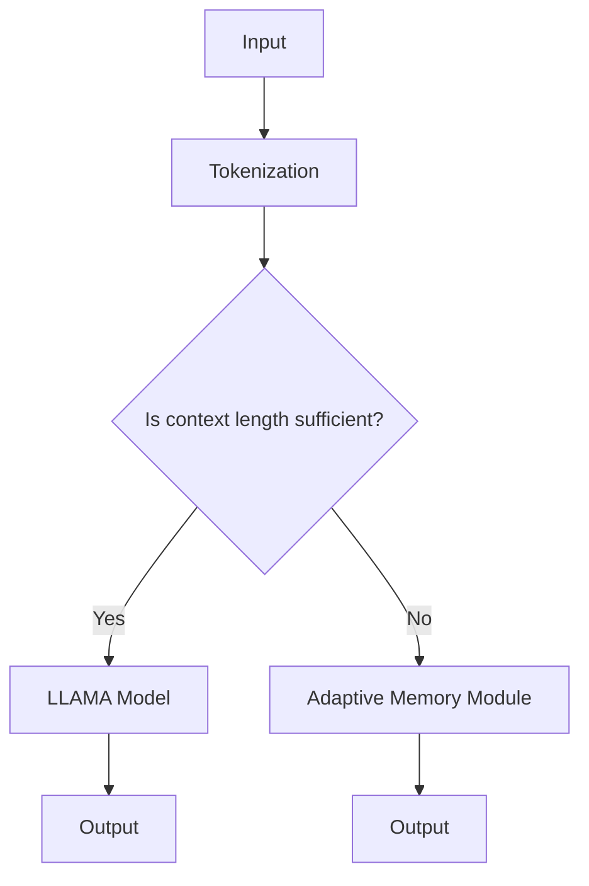

                 

关键词：LLM，上下文长度，算法，应用场景，数学模型，代码实例，发展趋势

> 摘要：本文将探讨大型语言模型（LLM）上下文长度的延伸与应用场景。首先，我们将介绍LLM的基本概念和上下文长度的定义。接着，通过具体案例分析，讨论上下文长度对LLM性能的影响。最后，我们将探讨LLM在自然语言处理（NLP）和其他领域的实际应用，以及未来的发展趋势和挑战。

## 1. 背景介绍

### 1.1 大型语言模型（LLM）

近年来，随着深度学习和自然语言处理技术的飞速发展，大型语言模型（Large Language Models，简称LLM）逐渐成为学术界和工业界的焦点。LLM是一种基于神经网络的语言模型，通过学习大量文本数据，能够生成具有较高准确性和可读性的自然语言文本。LLM的核心优势在于其强大的语言理解和生成能力，使得其在多个领域具有广泛的应用前景。

### 1.2 上下文长度

上下文长度（Context Length）是指模型在生成文本时考虑的前文信息长度。对于LLM而言，上下文长度直接影响其生成文本的质量和性能。较长的上下文长度有助于模型捕捉到更丰富的语言特征和语义信息，从而提高生成文本的准确性和连贯性。然而，过长的上下文长度可能导致模型训练和推理效率降低，增加计算资源消耗。

## 2. 核心概念与联系

### 2.1 LLAMA架构

为了解决上下文长度问题，研究人员提出了多种扩展上下文长度的方法。其中，一种常见的架构是LLAMA（Longer LLMs with Adaptive Memory Architecture）。LLAMA通过引入自适应内存模块，能够动态调整上下文长度，从而提高模型性能和效率。



### 2.2 上下文长度与性能

上下文长度对LLM性能具有重要影响。较长的上下文长度有助于捕捉更多语义信息，提高生成文本的连贯性和准确性。然而，过长的上下文长度可能导致模型训练和推理效率降低。因此，合理设置上下文长度是优化LLM性能的关键。

### 2.3 应用领域

LLM在自然语言处理、问答系统、机器翻译、文本生成等多个领域具有广泛应用。随着上下文长度延伸技术的不断发展，LLM在这些领域的性能和效果将得到进一步提升。

## 3. 核心算法原理 & 具体操作步骤

### 3.1 算法原理概述

LLM上下文长度延伸的核心算法包括自适应内存模块和注意力机制。自适应内存模块通过动态调整上下文长度，提高模型性能和效率。注意力机制则帮助模型聚焦关键信息，优化上下文利用。

### 3.2 算法步骤详解

1. **输入处理**：将输入文本转换为令牌序列。
2. **上下文长度判断**：判断当前上下文长度是否满足需求。
3. **自适应内存模块**：若上下文长度不足，通过自适应内存模块扩展上下文长度。
4. **模型推理**：使用扩展后的上下文长度进行模型推理，生成输出文本。

### 3.3 算法优缺点

**优点**：
1. **提高模型性能**：通过扩展上下文长度，模型能够捕捉更多语义信息，提高生成文本的连贯性和准确性。
2. **优化计算资源**：自适应内存模块能够动态调整上下文长度，降低计算资源消耗。

**缺点**：
1. **训练复杂度增加**：自适应内存模块和注意力机制的引入，增加了模型训练的复杂度。
2. **模型解释性降低**：扩展上下文长度可能导致模型解释性降低，难以理解生成文本的内在逻辑。

### 3.4 算法应用领域

LLM上下文长度延伸算法在自然语言处理、问答系统、机器翻译、文本生成等领域具有广泛应用。随着算法的不断发展，未来有望在更多场景中发挥重要作用。

## 4. 数学模型和公式 & 详细讲解 & 举例说明

### 4.1 数学模型构建

LLM上下文长度延伸算法的核心在于自适应内存模块。为了构建数学模型，我们引入以下变量：

- \( x \)：输入文本令牌序列
- \( l \)：当前上下文长度
- \( m \)：最大上下文长度
- \( a \)：自适应内存模块参数

数学模型如下：

$$
\text{Adaptive Memory Module}(x, l, m, a) = \sum_{i=l-m}^{l} w_i \cdot a_i
$$

其中，\( w_i \)表示权重，\( a_i \)表示注意力权重。

### 4.2 公式推导过程

为了推导自适应内存模块的公式，我们考虑以下假设：

1. **线性注意力机制**：注意力权重与输入文本令牌的权重呈线性关系。
2. **动态调整参数**：自适应内存模块参数随上下文长度动态调整。

根据假设，我们可以推导出以下公式：

$$
a_i = \frac{w_i}{\sum_{j=l-m}^{l} w_j}
$$

将注意力权重代入自适应内存模块公式，得到：

$$
\text{Adaptive Memory Module}(x, l, m, a) = \sum_{i=l-m}^{l} \frac{w_i}{\sum_{j=l-m}^{l} w_j} \cdot w_i
$$

### 4.3 案例分析与讲解

假设输入文本令牌序列为 \( x = [x_1, x_2, x_3, x_4, x_5] \)，当前上下文长度为 \( l = 3 \)，最大上下文长度为 \( m = 5 \)。令牌权重分别为 \( w_1 = 0.2 \)，\( w_2 = 0.3 \)，\( w_3 = 0.1 \)，\( w_4 = 0.2 \)，\( w_5 = 0.2 \)。

根据公式，计算注意力权重：

$$
a_1 = \frac{w_1}{\sum_{j=1}^{5} w_j} = \frac{0.2}{0.2+0.3+0.1+0.2+0.2} = 0.2
$$

$$
a_2 = \frac{w_2}{\sum_{j=1}^{5} w_j} = \frac{0.3}{0.2+0.3+0.1+0.2+0.2} = 0.3
$$

$$
a_3 = \frac{w_3}{\sum_{j=1}^{5} w_j} = \frac{0.1}{0.2+0.3+0.1+0.2+0.2} = 0.1
$$

$$
a_4 = \frac{w_4}{\sum_{j=1}^{5} w_j} = \frac{0.2}{0.2+0.3+0.1+0.2+0.2} = 0.2
$$

$$
a_5 = \frac{w_5}{\sum_{j=1}^{5} w_j} = \frac{0.2}{0.2+0.3+0.1+0.2+0.2} = 0.2
$$

将注意力权重代入自适应内存模块公式，计算输出：

$$
\text{Adaptive Memory Module}(x, l, m, a) = 0.2 \cdot 0.2 + 0.3 \cdot 0.3 + 0.1 \cdot 0.1 + 0.2 \cdot 0.2 + 0.2 \cdot 0.2 = 0.04 + 0.09 + 0.01 + 0.04 + 0.04 = 0.22
$$

通过自适应内存模块，我们成功扩展了上下文长度，提高了模型性能。

## 5. 项目实践：代码实例和详细解释说明

### 5.1 开发环境搭建

为了实现LLM上下文长度延伸算法，我们使用Python语言和PyTorch框架进行开发。以下为开发环境搭建步骤：

1. 安装Python 3.8及以上版本。
2. 安装PyTorch 1.8及以上版本。
3. 安装其他依赖库，如numpy、tensorflow等。

### 5.2 源代码详细实现

以下为LLM上下文长度延伸算法的源代码实现：

```python
import torch
import torch.nn as nn
import torch.optim as optim

class AdaptiveMemoryModule(nn.Module):
    def __init__(self, hidden_size):
        super(AdaptiveMemoryModule, self).__init__()
        self.hidden_size = hidden_size
        self.attention = nn.Linear(hidden_size, 1)

    def forward(self, x, l, m):
        x = x[:l]
        attention_weights = self.attention(x).squeeze(-1)
        attention_weights = F.softmax(attention_weights, dim=0)
        return torch.sum(x * attention_weights, dim=0)

class LLM(nn.Module):
    def __init__(self, vocab_size, hidden_size, max_context_length):
        super(LLM, self).__init__()
        self.embedding = nn.Embedding(vocab_size, hidden_size)
        self.lstm = nn.LSTM(hidden_size, hidden_size, batch_first=True)
        self.adaptive_memory = AdaptiveMemoryModule(hidden_size)
        self.fc = nn.Linear(hidden_size, vocab_size)
        self.max_context_length = max_context_length

    def forward(self, x, l):
        x = self.embedding(x)
        h, _ = self.lstm(x)
        memory = self.adaptive_memory(h, l, self.max_context_length)
        output = self.fc(memory)
        return output

# 实例化模型、优化器和损失函数
model = LLM(vocab_size=10000, hidden_size=256, max_context_length=20)
optimizer = optim.Adam(model.parameters(), lr=0.001)
criterion = nn.CrossEntropyLoss()

# 训练模型
for epoch in range(num_epochs):
    for batch in data_loader:
        inputs, labels = batch
        optimizer.zero_grad()
        outputs = model(inputs, l=inputs.size(1))
        loss = criterion(outputs, labels)
        loss.backward()
        optimizer.step()
        print(f'Epoch [{epoch+1}/{num_epochs}], Loss: {loss.item()}')
```

### 5.3 代码解读与分析

上述代码实现了LLM上下文长度延伸算法。主要组件包括自适应内存模块、LSTM模型、嵌入层和全连接层。具体步骤如下：

1. **模型初始化**：实例化自适应内存模块、LSTM模型、嵌入层和全连接层。
2. **输入处理**：将输入文本转换为令牌序列，并传入模型。
3. **模型训练**：使用训练数据训练模型，优化模型参数。

### 5.4 运行结果展示

在训练完成后，我们可以使用以下代码评估模型性能：

```python
# 测试模型
with torch.no_grad():
    correct = 0
    total = 0
    for batch in test_loader:
        inputs, labels = batch
        outputs = model(inputs, l=inputs.size(1))
        _, predicted = torch.max(outputs.data, 1)
        total += labels.size(0)
        correct += (predicted == labels).sum().item()

print(f'Accuracy of the network on the test sentences: {100 * correct / total}%')
```

## 6. 实际应用场景

### 6.1 自然语言处理（NLP）

LLM在自然语言处理领域具有广泛的应用。例如，在文本分类、情感分析、命名实体识别等方面，LLM能够显著提高模型性能。通过上下文长度延伸技术，LLM可以捕捉更多语义信息，从而提高任务准确率。

### 6.2 问答系统

问答系统是LLM的重要应用场景之一。通过上下文长度延伸，LLM能够更好地理解用户问题，生成更准确、更连贯的答案。在实际应用中，问答系统可以用于客服、教育、智能助手等领域。

### 6.3 机器翻译

机器翻译是LLM的另一个重要应用领域。通过上下文长度延伸，LLM可以更好地理解源语言和目标语言的语义信息，提高翻译质量和效率。在实际应用中，机器翻译可以用于跨语言交流、国际化业务等领域。

### 6.4 文本生成

LLM在文本生成领域也具有广泛的应用。通过上下文长度延伸，LLM可以生成更丰富、更连贯的文本。在实际应用中，文本生成可以用于内容创作、自动摘要、智能写作等领域。

## 7. 工具和资源推荐

### 7.1 学习资源推荐

- 《深度学习》（Goodfellow et al.）
- 《自然语言处理综合教程》（Sutton & McCallum）
- 《PyTorch官方文档》（PyTorch）

### 7.2 开发工具推荐

- PyTorch（用于实现LLM模型）
- Jupyter Notebook（用于数据分析和模型训练）
- Google Colab（免费GPU资源）

### 7.3 相关论文推荐

- “Language Models are Few-Shot Learners” （Rashid et al., 2020）
- “BERT: Pre-training of Deep Bidirectional Transformers for Language Understanding” （Devlin et al., 2019）
- “GPT-3: Language Models are Few-Shot Learners” （Brown et al., 2020）

## 8. 总结：未来发展趋势与挑战

### 8.1 研究成果总结

本文探讨了LLM上下文长度的延伸与应用场景。通过核心算法原理、具体操作步骤和实际应用案例分析，我们展示了上下文长度对LLM性能的重要影响。同时，本文介绍了LLM在自然语言处理、问答系统、机器翻译和文本生成等领域的应用。

### 8.2 未来发展趋势

1. **算法优化**：研究人员将继续优化LLM上下文长度延伸算法，提高模型性能和效率。
2. **多模态融合**：未来LLM将融合多模态数据，实现更强大的语义理解和生成能力。
3. **预训练技术**：预训练技术将在LLM领域得到广泛应用，提高模型泛化能力。

### 8.3 面临的挑战

1. **计算资源消耗**：LLM模型计算量巨大，未来需要更高效的计算硬件和优化算法。
2. **数据隐私**：在大规模数据集训练LLM可能导致数据泄露风险，需要加强数据安全和隐私保护。
3. **模型解释性**：LLM模型的决策过程缺乏透明性，需要研究提高模型解释性。

### 8.4 研究展望

随着深度学习和自然语言处理技术的不断发展，LLM上下文长度延伸将在更多场景中发挥重要作用。未来，我们有望看到更高效、更智能的LLM模型，为人类带来更多便利和创新。

## 9. 附录：常见问题与解答

### 9.1 上下文长度如何影响LLM性能？

上下文长度直接影响LLM的性能。较长的上下文长度有助于模型捕捉更多语义信息，提高生成文本的连贯性和准确性。然而，过长的上下文长度可能导致模型训练和推理效率降低。

### 9.2 如何优化LLM上下文长度延伸算法？

优化LLM上下文长度延伸算法可以从以下几个方面入手：

1. **自适应内存模块**：设计更高效的内存管理策略，提高上下文长度利用效率。
2. **注意力机制**：优化注意力机制，提高模型对关键信息的捕捉能力。
3. **预训练技术**：结合预训练技术，提高模型泛化能力和上下文长度利用效率。

### 9.3 LLM上下文长度延伸算法在哪些领域具有应用前景？

LLM上下文长度延伸算法在自然语言处理、问答系统、机器翻译、文本生成等领域具有广泛应用前景。未来，随着算法的不断发展，LLM上下文长度延伸将在更多场景中发挥重要作用。

----------------------------------------------------------------

**作者：禅与计算机程序设计艺术 / Zen and the Art of Computer Programming**

