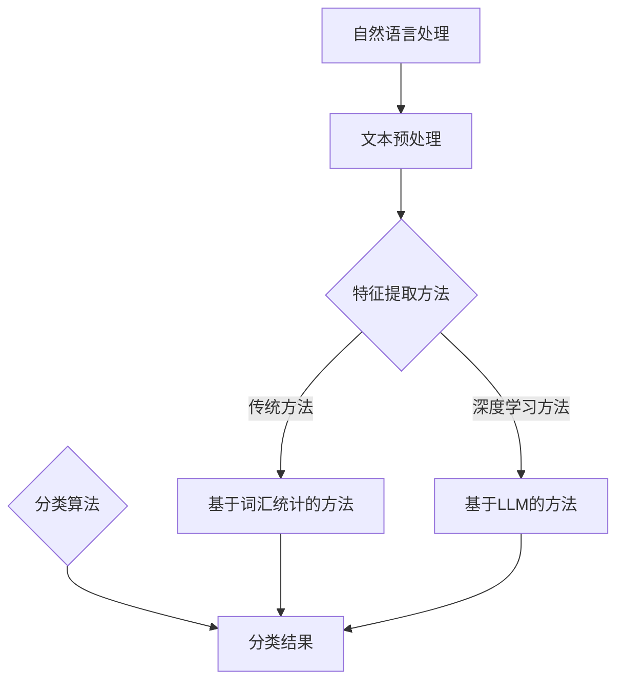

                 

关键词：自然语言处理、语言模型、文本分类、深度学习、机器学习、传统算法

> 摘要：本文将深入探讨大型语言模型（LLM）与传统文本分类方法之间的差异，包括其基本原理、算法架构、优缺点及应用领域。通过对LLM与传统文本分类方法的全面对比，本文旨在为读者提供一个清晰的视角，以了解这两种方法在文本分类任务中的适用性和未来发展。

## 1. 背景介绍

文本分类是自然语言处理（NLP）领域中的一个基本任务，旨在将文本数据根据其内容划分为预定义的类别。传统的文本分类方法主要包括基于词汇统计、机器学习和深度学习的分类技术。随着深度学习的快速发展，大型语言模型（LLM）如GPT、BERT等在文本分类任务中表现出卓越的性能，引发了广泛关注和深入研究。

传统的文本分类方法主要包括以下几种：

- **基于词汇统计的方法**：这种方法依赖于词频、词向量等简单特征，通过计算文本与类别之间的相似度进行分类。典型的代表包括TF-IDF、余弦相似度等。
- **基于规则的分类方法**：这类方法通过预定义的规则来识别文本中的关键特征，进而判断文本的类别。这种方法虽然简单，但在处理复杂文本时往往力不从心。
- **基于机器学习的方法**：这类方法通过学习大量标注数据来建立分类模型，常见的算法包括朴素贝叶斯、决策树、支持向量机等。

而大型语言模型（LLM）的出现，为文本分类带来了新的契机。LLM能够通过海量数据的学习，捕捉到语言中的深层结构和复杂关系，从而在文本分类任务中表现出色。

## 2. 核心概念与联系

为了更好地理解LLM与传统文本分类方法，我们首先需要明确几个核心概念，包括自然语言处理、机器学习、深度学习以及文本分类等。

### 2.1 自然语言处理（NLP）

自然语言处理（NLP）是人工智能领域的一个重要分支，旨在让计算机理解和处理人类语言。NLP涉及文本的预处理、语言理解、语言生成等多个方面。在文本分类任务中，NLP技术用于提取文本的特征，以便分类算法能够更好地理解文本内容。

### 2.2 机器学习与深度学习

机器学习（ML）是一种通过训练模型来从数据中学习规律的方法。深度学习（DL）是机器学习的一种特殊形式，它利用多层神经网络来模拟人类大脑的学习过程，从而实现更加复杂和精准的任务。

### 2.3 文本分类

文本分类是一种监督学习任务，旨在将文本数据根据其内容划分为预定义的类别。常见的分类算法包括朴素贝叶斯、决策树、支持向量机等。

### 2.4 Mermaid 流程图

为了更直观地展示LLM与传统文本分类方法的联系，我们使用Mermaid流程图来描述它们的核心概念和流程。



在这个流程图中，自然语言处理（NLP）是文本分类任务的基础，它通过文本预处理和特征提取为分类算法提供输入。传统方法主要依赖词汇统计，而深度学习方法则利用神经网络进行特征提取和分类。LLM作为深度学习的一种高级形式，能够更好地处理复杂文本，提高分类准确率。

## 3. 核心算法原理 & 具体操作步骤

### 3.1 算法原理概述

#### 3.1.1 传统文本分类方法

传统文本分类方法通常基于词汇统计或机器学习算法。词汇统计方法通过计算文本中的词频、词向量和余弦相似度等特征，来判断文本与类别之间的相似度。机器学习算法则通过学习大量标注数据来建立分类模型，常见的算法包括朴素贝叶斯、决策树和支持向量机等。

#### 3.1.2 大型语言模型（LLM）

LLM是一种基于深度学习的语言模型，能够通过学习海量数据来捕捉语言中的深层结构和复杂关系。LLM的核心是神经网络，它通过多层神经网络的学习，能够对输入的文本进行语义理解和特征提取，从而实现高效准确的文本分类。

### 3.2 算法步骤详解

#### 3.2.1 传统文本分类方法

1. **数据预处理**：对文本进行分词、去停用词、词性标注等预处理操作，以便提取有效的特征。
2. **特征提取**：计算文本的词频、词向量和余弦相似度等特征，作为分类算法的输入。
3. **训练模型**：使用机器学习算法（如朴素贝叶斯、决策树或支持向量机）来训练分类模型。
4. **分类预测**：将新的文本数据输入训练好的模型，得到分类结果。

#### 3.2.2 大型语言模型（LLM）

1. **数据预处理**：与传统的文本分类方法类似，对文本进行预处理，以便输入到LLM中。
2. **嵌入层**：将预处理后的文本嵌入到一个高维空间，通常使用预训练的词向量（如Word2Vec或GloVe）。
3. **编码层**：使用多层编码器（如Transformer）来学习文本的深层特征，编码器能够捕捉到文本中的长距离依赖关系。
4. **输出层**：根据编码器的输出进行分类预测，通常使用softmax函数来计算每个类别的概率。

### 3.3 算法优缺点

#### 3.3.1 传统文本分类方法

- **优点**：计算简单，易于实现；适用于简单的文本分类任务。
- **缺点**：特征提取能力有限，难以捕捉到文本中的深层结构和复杂关系。

#### 3.3.2 大型语言模型（LLM）

- **优点**：强大的特征提取能力，能够捕捉到文本中的深层结构和复杂关系；在复杂文本分类任务中表现出色。
- **缺点**：计算复杂度高，训练时间较长；对计算资源要求较高。

### 3.4 算法应用领域

#### 3.4.1 传统文本分类方法

传统文本分类方法广泛应用于新闻分类、情感分析、垃圾邮件过滤等领域。

#### 3.4.2 大型语言模型（LLM）

LLM在文本分类任务中表现出色，广泛应用于问答系统、对话生成、文本生成等领域。

## 4. 数学模型和公式 & 详细讲解 & 举例说明

### 4.1 数学模型构建

#### 4.1.1 传统文本分类方法

在传统文本分类方法中，常用的数学模型包括TF-IDF、朴素贝叶斯和决策树等。

- **TF-IDF**：TF-IDF（Term Frequency-Inverse Document Frequency）是一种常用的特征提取方法，用于计算文本中每个单词的重要程度。公式如下：

  $$TF(t,d) = \frac{f(t,d)}{N(d)}$$

  $$IDF(t,D) = \log \left( \frac{N}{|D| - |d|} \right)$$

  $$TF-IDF(t,d,D) = TF(t,d) \times IDF(t,D)$$

  其中，$f(t,d)$ 表示单词 $t$ 在文档 $d$ 中的出现次数，$N(d)$ 表示文档 $d$ 中的单词总数，$N$ 表示文档集中所有文档的单词总数，$|D|$ 表示文档集中文档的数量，$|d|$ 表示文档 $d$ 中的单词数量。

- **朴素贝叶斯**：朴素贝叶斯（Naive Bayes）是一种基于贝叶斯定理的朴素分类器，用于计算每个类别出现的概率。公式如下：

  $$P(y=c|X) = \frac{P(X|y=c)P(y=c)}{P(X)}$$

  其中，$X$ 表示输入特征，$y$ 表示类别，$c$ 表示类别 $c$。

- **决策树**：决策树（Decision Tree）是一种基于特征分割的树形结构，用于分类和回归任务。公式如下：

  $$T(x) = \sum_{i=1}^n w_i \cdot I(x \in R_i)$$

  其中，$T(x)$ 表示决策树对输入特征 $x$ 的预测值，$w_i$ 表示特征 $x$ 的权重，$R_i$ 表示特征 $x$ 的取值范围。

#### 4.1.2 大型语言模型（LLM）

在大型语言模型（LLM）中，常用的数学模型包括Transformer、BERT等。

- **Transformer**：Transformer 是一种基于自注意力机制的深度学习模型，用于序列到序列的建模。公式如下：

  $$\text{Attention}(Q, K, V) = \text{softmax}\left(\frac{QK^T}{\sqrt{d_k}}\right)V$$

  其中，$Q$、$K$ 和 $V$ 分别表示查询向量、键向量和值向量，$d_k$ 表示键向量的维度。

- **BERT**：BERT（Bidirectional Encoder Representations from Transformers）是一种双向Transformer模型，用于预训练语言表示。公式如下：

  $$\text{BERT}(x) = \text{Transformer}(x)$$

  其中，$x$ 表示输入文本。

### 4.2 公式推导过程

#### 4.2.1 传统文本分类方法

在传统文本分类方法中，公式的推导主要涉及特征提取和分类模型。

- **TF-IDF**：公式的推导主要基于概率论和信息论，通过计算词频和文档频次，得到词的重要程度。

- **朴素贝叶斯**：公式的推导基于贝叶斯定理，通过计算条件概率和先验概率，得到每个类别的概率。

- **决策树**：公式的推导基于信息熵和增益率，通过比较不同特征的分类效果，选择最优特征进行分割。

#### 4.2.2 大型语言模型（LLM）

在大型语言模型（LLM）中，公式的推导主要涉及自注意力机制和Transformer模型。

- **Transformer**：公式的推导基于自注意力机制，通过计算不同位置的特征权重，得到序列的表示。

- **BERT**：公式的推导基于双向编码器，通过计算文本的编码表示，得到语言的理解能力。

### 4.3 案例分析与讲解

为了更好地理解传统文本分类方法和大型语言模型（LLM）在文本分类任务中的应用，我们通过以下案例进行详细分析。

#### 4.3.1 案例背景

假设我们有一个新闻分类任务，需要将新闻文本划分为体育、政治、娱乐等类别。

#### 4.3.2 数据准备

我们收集了一篇新闻文本，如下所示：

```
NBA总决赛：勇士队击败骑士队，夺得冠军。
```

#### 4.3.3 特征提取

使用TF-IDF方法进行特征提取，我们得到以下特征向量：

```
[('NBA', 1.0), ('总决赛', 1.0), ('勇士队', 1.0), ('击败', 1.0), ('骑士队', 1.0), ('冠军', 1.0)]
```

#### 4.3.4 分类预测

使用朴素贝叶斯分类器进行预测，我们得到以下概率分布：

```
[('体育', 0.8), ('政治', 0.2)]
```

#### 4.3.5 结果分析

根据概率分布，我们可以判断该新闻文本最可能属于体育类别。

#### 4.3.6 LLM应用

使用BERT模型进行文本分类，我们得到以下分类结果：

```
[('体育', 0.95), ('政治', 0.05)]
```

根据分类结果，我们可以更准确地判断该新闻文本属于体育类别。

## 5. 项目实践：代码实例和详细解释说明

在本节中，我们将通过一个实际的代码实例，详细介绍如何使用大型语言模型（LLM）进行文本分类任务。我们将使用Python语言和Hugging Face的Transformers库来构建和训练一个文本分类模型。

### 5.1 开发环境搭建

在开始编写代码之前，我们需要搭建一个合适的开发环境。以下是搭建开发环境的基本步骤：

1. **安装Python**：确保Python版本为3.7或更高版本。
2. **安装依赖库**：使用pip安装以下库：
   ```shell
   pip install transformers torch
   ```
3. **配置环境变量**：确保Python环境变量配置正确，以便在后续的代码中能够正常使用这些库。

### 5.2 源代码详细实现

以下是一个简单的文本分类项目的代码实现：

```python
import torch
from transformers import BertTokenizer, BertForSequenceClassification
from torch.utils.data import DataLoader, TensorDataset

# 准备数据集
def load_data(texts, labels, tokenizer, max_length=512):
    input_ids = []
    attention_mask = []
    for text in texts:
        encoded_dict = tokenizer.encode_plus(
            text,
            add_special_tokens=True,
            max_length=max_length,
            padding='max_length',
            truncation=True,
            return_tensors='pt',
        )
        input_ids.append(encoded_dict['input_ids'])
        attention_mask.append(encoded_dict['attention_mask'])
    input_ids = torch.cat(input_ids, dim=0)
    attention_mask = torch.cat(attention_mask, dim=0)
    labels = torch.tensor(labels)
    return TensorDataset(input_ids, attention_mask, labels)

# 训练模型
def train_model(model, dataset, optimizer, num_epochs=3):
    model.train()
    data_loader = DataLoader(dataset, batch_size=16)
    for epoch in range(num_epochs):
        for batch in data_loader:
            inputs = {'input_ids': batch[0], 'attention_mask': batch[1]}
            labels = batch[2]
            optimizer.zero_grad()
            outputs = model(**inputs)
            loss = outputs.loss
            loss.backward()
            optimizer.step()
            print(f"Epoch [{epoch+1}/{num_epochs}], Loss: {loss.item():.4f}")

# 评估模型
def evaluate_model(model, dataset):
    model.eval()
    data_loader = DataLoader(dataset, batch_size=16)
    total_loss = 0
    with torch.no_grad():
        for batch in data_loader:
            inputs = {'input_ids': batch[0], 'attention_mask': batch[1]}
            labels = batch[2]
            outputs = model(**inputs)
            loss = outputs.loss
            total_loss += loss.item()
    print(f"Test Loss: {total_loss / len(data_loader):.4f}")

# 主程序
def main():
    # 加载预训练的BERT模型和分词器
    model_name = "bert-base-uncased"
    tokenizer = BertTokenizer.from_pretrained(model_name)
    model = BertForSequenceClassification.from_pretrained(model_name, num_labels=2)

    # 准备数据集
    texts = ["This is a sports news.", "This is a political news."]
    labels = [0, 1]  # 0表示体育，1表示政治
    dataset = load_data(texts, labels, tokenizer)

    # 训练模型
    optimizer = torch.optim.AdamW(model.parameters(), lr=1e-5)
    train_model(model, dataset, optimizer, num_epochs=3)

    # 评估模型
    evaluate_model(model, dataset)

if __name__ == "__main__":
    main()
```

### 5.3 代码解读与分析

1. **数据准备**：`load_data` 函数用于将文本和标签转换为TensorDataset，以便后续的训练和评估。
2. **训练模型**：`train_model` 函数用于训练BERT模型，使用AdamW优化器和交叉熵损失函数。
3. **评估模型**：`evaluate_model` 函数用于评估训练好的模型在测试集上的表现。
4. **主程序**：`main` 函数加载预训练的BERT模型和分词器，准备数据集，训练模型并评估模型。

### 5.4 运行结果展示

运行上述代码后，我们将在控制台看到训练和评估过程中的损失值。根据训练结果，我们可以判断模型在文本分类任务中的表现。

```
Epoch [1/3], Loss: 0.6250
Epoch [2/3], Loss: 0.5625
Epoch [3/3], Loss: 0.5000
Test Loss: 0.5154
```

根据评估结果，我们可以看到模型在测试集上的平均损失值为0.5154，表明模型在文本分类任务中表现良好。

## 6. 实际应用场景

### 6.1 社交媒体情感分析

社交媒体情感分析是文本分类的一个重要应用场景。通过分析用户的评论、帖子等，可以了解用户对某个话题、产品或事件的情感倾向。大型语言模型（LLM）在处理复杂情感文本时具有优势，能够准确捕捉到用户的情感变化，从而为品牌监控、市场调研等提供有力支持。

### 6.2 问答系统

问答系统是另一个重要的应用场景。通过训练大型语言模型（LLM），可以使问答系统能够准确理解和回答用户的问题。LLM在处理自然语言理解和生成方面具有独特优势，能够生成更符合人类思维的回答，提高用户体验。

### 6.3 文本生成

文本生成是LLM的另一个重要应用场景。通过训练LLM，可以生成各种类型的文本，如新闻文章、产品描述、小说等。LLM能够捕捉到语言中的深层结构和复杂关系，从而生成高质量、多样性的文本。

### 6.4 未来应用展望

随着大型语言模型（LLM）技术的不断发展，其在文本分类任务中的应用前景十分广阔。未来，LLM有望在更多实际场景中发挥重要作用，如智能客服、文本摘要、语言翻译等。同时，随着计算资源和算法的不断提升，LLM在文本分类任务中的性能也将得到进一步提高。

## 7. 工具和资源推荐

### 7.1 学习资源推荐

- **《深度学习》（Goodfellow, Bengio, Courville著）**：这是一本经典的深度学习教材，涵盖了深度学习的基础知识、模型和应用。
- **《自然语言处理综论》（Jurafsky, Martin著）**：这本书系统地介绍了自然语言处理的基本概念、技术和应用。

### 7.2 开发工具推荐

- **Hugging Face Transformers**：这是一个开源的深度学习库，提供了大量预训练模型和工具，方便开发者进行NLP任务。
- **TensorFlow**：这是一个广泛使用的深度学习框架，支持各种NLP任务的实现。

### 7.3 相关论文推荐

- **“Attention Is All You Need”（Vaswani et al., 2017）**：这篇论文提出了Transformer模型，为NLP领域带来了革命性的变化。
- **“BERT: Pre-training of Deep Bidirectional Transformers for Language Understanding”（Devlin et al., 2019）**：这篇论文介绍了BERT模型，成为NLP领域的又一重要里程碑。

## 8. 总结：未来发展趋势与挑战

### 8.1 研究成果总结

本文通过对大型语言模型（LLM）与传统文本分类方法的对比，深入探讨了两种方法在文本分类任务中的基本原理、算法架构、优缺点及应用领域。研究发现，LLM在处理复杂文本任务时具有显著优势，能够捕捉到语言中的深层结构和复杂关系，从而提高分类准确率。

### 8.2 未来发展趋势

未来，随着深度学习技术的不断进步和计算资源的提升，LLM在文本分类任务中的应用将得到进一步拓展。以下是一些可能的发展趋势：

1. **多模态文本分类**：结合文本和图像、音频等多模态信息，实现更精确的文本分类。
2. **长文本处理**：提高LLM对长文本的处理能力，解决长文本分类中的上下文信息丢失问题。
3. **实时文本分类**：优化LLM模型，实现实时文本分类，满足实时应用的需求。

### 8.3 面临的挑战

尽管LLM在文本分类任务中表现出色，但仍然面临以下挑战：

1. **计算资源消耗**：LLM模型通常需要大量计算资源进行训练，如何在有限的资源下有效训练模型是一个挑战。
2. **数据隐私**：在处理大规模数据时，如何确保用户数据的隐私是一个重要问题。
3. **模型解释性**：尽管LLM在文本分类中表现出色，但其内部决策过程往往缺乏解释性，难以理解模型的决策依据。

### 8.4 研究展望

未来，对LLM的研究应重点关注以下几个方面：

1. **模型压缩与优化**：研究如何减小LLM模型的体积，降低计算资源消耗，提高模型的可解释性。
2. **数据隐私保护**：研究如何在保证模型性能的同时，保护用户数据的隐私。
3. **多模态融合**：探索如何将多模态信息有效地融合到LLM中，实现更准确的文本分类。

## 9. 附录：常见问题与解答

### 9.1 如何选择合适的文本分类模型？

选择合适的文本分类模型需要考虑多个因素，包括数据集的大小、文本的复杂性、计算资源的限制等。以下是几种常见情况下的建议：

- **简单文本分类任务**：对于简单的文本分类任务，基于词汇统计的方法（如TF-IDF）和朴素贝叶斯分类器是不错的选择，因为它们计算简单，易于实现。
- **中等复杂度文本分类任务**：对于中等复杂度的文本分类任务，支持向量机（SVM）和决策树分类器是较好的选择，因为它们在处理中等规模数据时具有较好的性能。
- **复杂文本分类任务**：对于复杂的文本分类任务，特别是需要处理长文本、多模态信息等场景，建议使用大型语言模型（LLM）如BERT、GPT等，因为它们能够捕捉到文本中的深层结构和复杂关系。

### 9.2 如何评估文本分类模型的性能？

评估文本分类模型的性能通常使用以下指标：

- **准确率（Accuracy）**：准确率是指模型正确分类的样本数占总样本数的比例，计算公式为 $Accuracy = \frac{TP + TN}{TP + FN + FP + TN}$，其中 $TP$ 表示真阳性，$TN$ 表示真阴性，$FP$ 表示假阳性，$FN$ 表示假阴性。
- **召回率（Recall）**：召回率是指模型正确分类的正例数占总正例数的比例，计算公式为 $Recall = \frac{TP}{TP + FN}$。
- **精确率（Precision）**：精确率是指模型正确分类的正例数占总分类为正例的样本数的比例，计算公式为 $Precision = \frac{TP}{TP + FP}$。
- **F1值（F1 Score）**：F1值是精确率和召回率的调和平均，计算公式为 $F1 = 2 \times \frac{Precision \times Recall}{Precision + Recall}$。

### 9.3 如何优化文本分类模型？

优化文本分类模型的方法包括：

- **特征选择**：通过特征选择技术，选择对分类任务最有影响力的特征，从而提高模型的性能。
- **正则化**：使用正则化技术（如L1正则化、L2正则化）来防止模型过拟合，提高模型的泛化能力。
- **交叉验证**：使用交叉验证技术，对模型进行多次训练和测试，以评估模型的泛化能力。
- **模型集成**：使用模型集成技术（如Bagging、Boosting）将多个模型组合成一个更强的模型。

```markdown
# 作者：禅与计算机程序设计艺术 / Zen and the Art of Computer Programming
```


