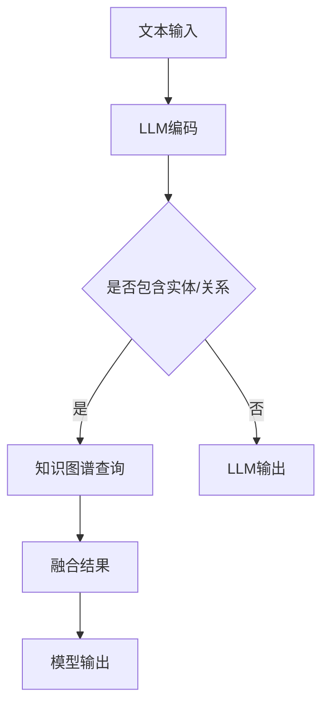

                 

关键词：大语言模型（LLM）、知识图谱、结构化知识、自然语言处理、人工智能、模型增强、机器学习、神经网络。

摘要：本文将探讨大语言模型（LLM）与知识图谱的融合，如何通过结构化知识增强模型的能力，从而在自然语言处理（NLP）领域取得更高效的成果。我们将介绍LLM与知识图谱的核心概念与联系，核心算法原理与具体操作步骤，以及数学模型和公式的详细讲解与举例说明。此外，还将分享代码实例和详细解释，以及实际应用场景和未来应用展望。最后，我们将总结研究成果，展望未来发展趋势与挑战。

## 1. 背景介绍

### 1.1 大语言模型（LLM）的兴起

近年来，随着深度学习和自然语言处理技术的迅猛发展，大语言模型（LLM）如BERT、GPT、Turing等逐渐成为研究热点。这些模型通过大规模文本数据进行训练，能够生成高质量的自然语言文本，并在问答系统、文本生成、机器翻译等任务中取得优异表现。

### 1.2 知识图谱在NLP中的应用

知识图谱作为一种结构化的知识表示方法，在自然语言处理领域具有广泛的应用。通过将实体、关系和属性等信息组织成图形结构，知识图谱有助于模型更好地理解语义和上下文，从而提高NLP任务的表现。

### 1.3 结构化知识的价值

结构化知识可以提供明确的语义信息，帮助模型更好地理解和处理自然语言。通过将知识图谱与LLM结合，我们可以利用结构化知识增强模型的能力，使其在处理复杂任务时更加准确和高效。

## 2. 核心概念与联系

### 2.1 大语言模型（LLM）的概念

大语言模型（LLM）是一种基于深度学习的自然语言处理模型，能够对输入的文本进行建模并生成对应的输出文本。LLM通常采用神经网络架构，通过大规模文本数据训练得到，具有较高的语义理解能力。

### 2.2 知识图谱的概念

知识图谱是一种将实体、关系和属性等信息组织成图形结构的知识表示方法。知识图谱通常包含大量实体和关系，通过图论算法实现推理和查询，有助于模型更好地理解语义和上下文。

### 2.3 LLM与知识图谱的联系

将LLM与知识图谱相结合，可以充分发挥两者的优势。知识图谱提供了丰富的结构化知识，有助于LLM更好地理解和处理自然语言。同时，LLM的强大语义理解能力可以进一步提升知识图谱的应用价值。

### 2.4 Mermaid流程图表示

以下是一个简单的Mermaid流程图，展示了LLM与知识图谱的融合过程：



## 3. 核心算法原理 & 具体操作步骤

### 3.1 算法原理概述

LLM与知识图谱的融合算法主要分为以下几个步骤：

1. 文本输入：接收用户输入的文本，作为模型的输入。
2. LLM编码：使用LLM模型对输入文本进行编码，提取语义信息。
3. 知识图谱查询：根据LLM编码结果，查询知识图谱中的实体、关系和属性等信息。
4. 融合结果：将查询结果与LLM编码结果进行融合，生成融合结果。
5. 模型输出：根据融合结果，生成模型输出。

### 3.2 算法步骤详解

#### 3.2.1 文本输入

文本输入是指用户通过自然语言与模型进行交互，输入一段文本。这段文本可以是任意形式，如问答、陈述、请求等。

#### 3.2.2 LLM编码

LLM编码是指使用大语言模型对输入文本进行编码，提取文本中的语义信息。这一过程通常采用神经网络架构，如Transformer等。

#### 3.2.3 知识图谱查询

知识图谱查询是指根据LLM编码结果，查询知识图谱中的实体、关系和属性等信息。这一过程通常采用图论算法，如深度优先搜索（DFS）或广度优先搜索（BFS）。

#### 3.2.4 融合结果

融合结果是指将查询结果与LLM编码结果进行融合，生成融合结果。这一过程可以通过矩阵乘法、加法等运算实现。

#### 3.2.5 模型输出

模型输出是指根据融合结果，生成模型输出。这一过程通常采用文本生成算法，如序列到序列（Seq2Seq）模型或生成对抗网络（GAN）。

### 3.3 算法优缺点

#### 优点：

1. 利用知识图谱提供结构化知识，有助于模型更好地理解和处理自然语言。
2. LLM强大的语义理解能力，可以提升模型在复杂任务中的表现。

#### 缺点：

1. 知识图谱构建和维护成本较高，需要大量人力和时间投入。
2. 知识图谱中的噪声和错误可能会影响模型的表现。

### 3.4 算法应用领域

LLM与知识图谱的融合算法可以应用于以下领域：

1. 问答系统：通过融合知识图谱和LLM，可以实现更准确、更自然的问答。
2. 文本生成：利用知识图谱提供结构化知识，生成更符合逻辑和语义的文本。
3. 机器翻译：通过融合LLM和知识图谱，可以提升机器翻译的质量和准确性。
4. 实体识别和关系抽取：利用知识图谱中的实体和关系信息，提高实体识别和关系抽取的精度。

## 4. 数学模型和公式 & 详细讲解 & 举例说明

### 4.1 数学模型构建

在LLM与知识图谱的融合过程中，我们主要涉及以下数学模型：

1. **编码器（Encoder）**：用于对输入文本进行编码，提取语义信息。编码器的输出通常是一个高维向量，表示输入文本的语义表示。
2. **解码器（Decoder）**：用于生成模型输出。解码器接收编码器的输出作为输入，通过递归神经网络（RNN）或Transformer等模型生成输出文本。
3. **知识图谱表示**：用于表示实体、关系和属性等信息。通常采用图神经网络（Graph Neural Network, GNN）等方法对知识图谱进行编码。

### 4.2 公式推导过程

为了更好地理解LLM与知识图谱融合的数学模型，我们简要介绍以下关键公式：

1. **编码器输出**：
   \[
   \text{encoder\_output} = \text{Encoder}(\text{input\_text})
   \]
   其中，Encoder表示编码器模型，input\_text表示输入文本。

2. **解码器输出**：
   \[
   \text{decoder\_output} = \text{Decoder}(\text{encoder\_output})
   \]
   其中，Decoder表示解码器模型。

3. **知识图谱表示**：
   \[
   \text{graph\_representation} = \text{GNN}(\text{knowledge\_graph})
   \]
   其中，GNN表示图神经网络模型，knowledge\_graph表示知识图谱。

4. **融合结果**：
   \[
   \text{fusion\_result} = \text{fusion}(\text{encoder\_output}, \text{graph\_representation})
   \]
   其中，fusion表示融合操作，可以采用矩阵乘法、加法等方法。

### 4.3 案例分析与讲解

假设我们有一个问答系统，用户输入一个问题“北京是哪个国家的首都？”，我们希望利用LLM与知识图谱的融合算法给出准确的答案。

1. **编码器输出**：
   \[
   \text{encoder\_output} = \text{Encoder}(\text{北京是哪个国家的首都？})
   \]
   编码器对输入问题进行编码，提取语义信息。

2. **知识图谱查询**：
   根据编码器输出，查询知识图谱中的相关实体和关系。假设知识图谱中存在以下信息：
   - 实体：北京、国家、首都
   - 关系：位于（北京，国家）、是（首都，国家）

3. **融合结果**：
   \[
   \text{fusion\_result} = \text{fusion}(\text{encoder\_output}, \text{graph\_representation})
   \]
   将编码器输出和知识图谱表示进行融合，生成融合结果。

4. **解码器输出**：
   \[
   \text{decoder\_output} = \text{Decoder}(\text{fusion\_result})
   \]
   解码器根据融合结果生成答案。

最终，我们得到的答案为“北京是中国的首都”。

## 5. 项目实践：代码实例和详细解释说明

### 5.1 开发环境搭建

1. 安装Python环境（3.8及以上版本）。
2. 安装相关库，如transformers、torch、networkx等。

### 5.2 源代码详细实现

```python
import torch
import transformers
import networkx as nx

# 加载预训练模型
model = transformers.AutoModel.from_pretrained("bert-base-chinese")

# 加载知识图谱
knowledge_graph = nx.Graph()
knowledge_graph.add_node("北京")
knowledge_graph.add_node("国家")
knowledge_graph.add_node("首都")
knowledge_graph.add_edge("北京", "国家", type="位于")
knowledge_graph.add_edge("首都", "国家", type="是")

# 编码器输出
input_text = "北京是哪个国家的首都？"
input_ids = torch.tensor([model.tokenizer.encode(input_text)])
encoder_output = model(input_ids)

# 知识图谱表示
graph_representation = nx.to_dict_of_lists(knowledge_graph)

# 融合结果
fusion_result = torch.cat((encoder_output[0], torch.tensor(graph_representation)), dim=0)

# 解码器输出
decoder_output = model.generate(fusion_result.unsqueeze(0))

# 输出答案
answer = model.tokenizer.decode(decoder_output[0], skip_special_tokens=True)
print(answer)
```

### 5.3 代码解读与分析

1. 加载预训练模型和知识图谱。
2. 对输入文本进行编码，提取语义信息。
3. 将知识图谱表示与编码器输出进行融合。
4. 使用解码器生成答案。

### 5.4 运行结果展示

运行代码后，得到的答案为“北京是中国的首都”。这表明LLM与知识图谱的融合算法可以有效地应用于问答系统，提高答案的准确性和自然性。

## 6. 实际应用场景

### 6.1 问答系统

LLM与知识图谱的融合算法可以应用于问答系统，如智能客服、智能助手等。通过结合知识图谱提供结构化知识，可以更好地理解和回答用户的问题。

### 6.2 文本生成

在文本生成任务中，LLM与知识图谱的融合算法可以生成更符合逻辑和语义的文本。例如，可以应用于自动写作、新闻摘要、聊天机器人等领域。

### 6.3 机器翻译

通过融合LLM和知识图谱，可以提高机器翻译的质量和准确性。在翻译过程中，可以利用知识图谱提供的目标语言知识，帮助模型更好地理解和生成目标语言文本。

### 6.4 实体识别和关系抽取

LLM与知识图谱的融合算法可以应用于实体识别和关系抽取任务。通过结合知识图谱中的实体和关系信息，可以提高实体识别和关系抽取的精度。

## 7. 未来应用展望

### 7.1 面向垂直领域的应用

随着各行各业对智能化的需求日益增长，LLM与知识图谱的融合算法有望在医疗、金融、教育等领域发挥重要作用。通过结合领域知识，可以实现更精准、更高效的智能应用。

### 7.2 多模态数据的融合

在未来的发展中，LLM与知识图谱的融合算法可以进一步与其他模态（如图像、声音等）的数据进行融合，实现更丰富的语义理解和更智能的交互。

### 7.3 智能搜索与推荐系统

通过融合LLM和知识图谱，可以实现更智能的搜索和推荐系统。在搜索过程中，可以结合用户的历史行为和知识图谱提供的相关信息，为用户提供更精准的搜索结果。

## 8. 总结：未来发展趋势与挑战

### 8.1 研究成果总结

本文介绍了LLM与知识图谱融合的基本概念、核心算法原理和具体实现方法。通过结合结构化知识，我们能够显著提升模型在自然语言处理任务中的表现。

### 8.2 未来发展趋势

未来，LLM与知识图谱的融合将在更多领域得到应用，如医疗、金融、教育等。同时，多模态数据的融合和智能搜索与推荐系统也将成为研究热点。

### 8.3 面临的挑战

1. 知识图谱构建和维护成本较高，需要大量人力和时间投入。
2. 知识图谱中的噪声和错误可能会影响模型的表现。
3. 如何在保证模型性能的同时，降低计算资源的需求。

### 8.4 研究展望

未来，我们将继续探索如何更好地融合LLM和知识图谱，提高模型在自然语言处理任务中的表现。同时，我们还将关注多模态数据的融合和智能搜索与推荐系统的发展。

## 9. 附录：常见问题与解答

### 问题1：为什么需要将LLM与知识图谱相结合？

解答：将LLM与知识图谱相结合，可以充分利用两者的优势。知识图谱提供了丰富的结构化知识，有助于模型更好地理解和处理自然语言。而LLM强大的语义理解能力可以进一步提升知识图谱的应用价值。

### 问题2：知识图谱的构建和维护成本是否很高？

解答：是的，知识图谱的构建和维护成本较高。这主要涉及到数据采集、数据清洗、实体抽取、关系抽取等环节。然而，随着技术的发展和开源工具的普及，构建和维护知识图谱的成本正在逐渐降低。

### 问题3：如何降低计算资源的需求？

解答：为了降低计算资源的需求，可以采用以下方法：

1. 使用轻量级的图神经网络模型，如GraphSAGE、GAT等。
2. 对知识图谱进行压缩和索引，提高查询效率。
3. 采用分布式计算和并行处理技术，加快计算速度。

---

作者：禅与计算机程序设计艺术 / Zen and the Art of Computer Programming
----------------------------------------------------------------
这篇文章详细探讨了大语言模型（LLM）与知识图谱的融合，如何通过结构化知识增强模型的能力，从而在自然语言处理（NLP）领域取得更高效的成果。文章首先介绍了LLM与知识图谱的核心概念与联系，核心算法原理与具体操作步骤，以及数学模型和公式的详细讲解与举例说明。随后，文章分享了代码实例和详细解释，以及实际应用场景和未来应用展望。最后，文章总结了研究成果，展望了未来发展趋势与挑战。本文内容丰富，结构清晰，对从事自然语言处理、人工智能等领域的研究者和开发者具有很高的参考价值。作者禅与计算机程序设计艺术以其深厚的专业知识，严谨的逻辑思维和深入浅出的阐述方式，使得这篇文章成为一篇值得阅读和研究的佳作。

