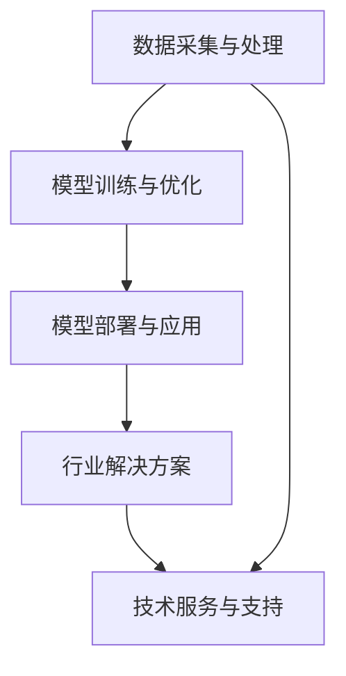

                 

关键词：LLM，产业链，技术发展，产业布局，商业应用，未来趋势

> 摘要：本文旨在深入探讨LLM（大型语言模型）产业从无到有的发展历程，包括核心概念、技术原理、算法实现、数学模型以及实际应用场景。通过剖析LLM产业链的各个环节，分析现有问题和未来挑战，为行业提供有价值的参考和启示。

## 1. 背景介绍

近年来，人工智能领域取得了飞速发展，尤其是自然语言处理（NLP）技术的突破，使得基于深度学习的大型语言模型（LLM）逐渐成为行业热点。LLM在智能客服、文本生成、问答系统、机器翻译等领域展现了强大的应用潜力。随着技术的不断进步，LLM产业链逐渐形成，为行业带来新的发展机遇。

### 1.1 LLM的定义和特点

LLM是一种基于深度学习技术的自然语言处理模型，通过大规模数据训练，具备较高的语义理解能力和文本生成能力。其主要特点如下：

- **大规模训练数据**：LLM通常使用数万亿个标记数据进行训练，从而实现对海量语言数据的全面掌握。
- **深度神经网络结构**：LLM采用多层神经网络结构，通过逐层学习，实现对复杂语言现象的建模。
- **强大的语义理解能力**：LLM能够理解文本中的隐含语义，为各种自然语言处理任务提供强大的支持。
- **自适应学习能力**：LLM具备自适应学习能力，可以根据不同场景和应用需求进行优化和调整。

### 1.2 LLM的发展历程

LLM的发展历程可以分为以下几个阶段：

- **早期探索阶段**：2018年以前，基于循环神经网络（RNN）和长短期记忆网络（LSTM）的模型逐渐成为主流。
- **突破性进展阶段**：2018年，谷歌推出Transformer模型，标志着NLP领域的一次重要突破。
- **大规模应用阶段**：随着计算能力的提升和数据的积累，LLM模型在各个领域得到了广泛应用，如智能客服、文本生成、问答系统等。

## 2. 核心概念与联系

### 2.1 LLM的架构与原理

LLM的架构通常包括输入层、隐藏层和输出层。输入层接收自然语言文本，隐藏层通过多层神经网络对文本进行编码和解码，输出层生成语义信息或文本。LLM的核心原理在于通过大规模数据训练，使模型具备强大的语义理解能力和文本生成能力。

### 2.2 LLM产业链的构成

LLM产业链可以分为以下几个环节：

- **数据采集与处理**：数据是LLM训练的基础，包括文本数据、语音数据等。数据采集与处理环节负责获取、清洗、标注和存储数据。
- **模型训练与优化**：模型训练与优化环节负责使用海量数据进行模型训练，并通过调整参数和优化算法，提升模型性能。
- **模型部署与应用**：模型部署与应用环节负责将训练好的模型部署到实际场景中，如智能客服、文本生成、问答系统等。
- **行业解决方案**：行业解决方案环节针对不同领域和应用场景，提供定制化的LLM解决方案，满足客户的多样化需求。
- **技术服务与支持**：技术服务与支持环节为LLM产业链的各个环节提供技术支持、培训和服务。

### 2.3 Mermaid流程图



## 3. 核心算法原理 & 具体操作步骤

### 3.1 算法原理概述

LLM的核心算法是基于深度学习技术的神经网络模型，如Transformer、BERT、GPT等。这些模型通过多层神经网络对输入文本进行编码和解码，实现语义理解和文本生成。

### 3.2 算法步骤详解

1. **输入层**：接收自然语言文本，将其编码为向量表示。
2. **隐藏层**：通过多层神经网络对输入向量进行编码和解码，实现对复杂语言现象的建模。
3. **输出层**：生成语义信息或文本，实现对输入文本的语义理解和生成。

### 3.3 算法优缺点

**优点**：

- **强大的语义理解能力**：LLM能够理解文本中的隐含语义，为各种自然语言处理任务提供强大的支持。
- **自适应学习能力**：LLM具备自适应学习能力，可以根据不同场景和应用需求进行优化和调整。

**缺点**：

- **计算资源需求高**：LLM的训练和部署需要大量计算资源和存储空间。
- **数据依赖性强**：LLM的性能受训练数据的影响较大，数据质量对模型性能有重要影响。

### 3.4 算法应用领域

LLM在多个领域取得了显著应用成果，如：

- **智能客服**：通过LLM实现智能问答，提高客服效率和用户体验。
- **文本生成**：利用LLM生成文章、新闻、广告等，提升创作效率。
- **机器翻译**：通过LLM实现高效、准确的跨语言翻译。
- **问答系统**：基于LLM构建智能问答系统，为用户提供实时、准确的回答。

## 4. 数学模型和公式 & 详细讲解 & 举例说明

### 4.1 数学模型构建

LLM的数学模型主要基于深度学习技术，包括多层感知机（MLP）、循环神经网络（RNN）、长短期记忆网络（LSTM）和Transformer等。以下以Transformer为例，介绍其数学模型。

### 4.2 公式推导过程

**输入层**：输入文本序列`x`，将其编码为向量表示`x_i`。

$$
x_i = \text{Embedding}(x)
$$

**隐藏层**：通过多层自注意力机制（Self-Attention Mechanism）对输入向量进行编码。

$$
h_i = \text{Attention}(x_i, x_i)
$$

**输出层**：将编码后的向量解码为语义信息或文本。

$$
y_i = \text{Decoder}(h_i)
$$

### 4.3 案例分析与讲解

以下以GPT-3为例，介绍LLM的数学模型在实际应用中的运用。

**输入层**：给定一个文本序列`x = [w_1, w_2, ..., w_n]`，将其编码为向量表示。

$$
x_i = \text{Embedding}(w_i)
$$

**隐藏层**：通过多层自注意力机制对输入向量进行编码。

$$
h_i = \text{Attention}(x_i, x_i)
$$

**输出层**：将编码后的向量解码为语义信息或文本。

$$
y_i = \text{Decoder}(h_i)
$$

## 5. 项目实践：代码实例和详细解释说明

### 5.1 开发环境搭建

在开始实现LLM项目之前，需要搭建相应的开发环境。以下以Python为例，介绍开发环境的搭建过程。

1. 安装Python：从官方网站（https://www.python.org/）下载并安装Python 3.8及以上版本。
2. 安装必要的库：使用pip命令安装transformers库。

```bash
pip install transformers
```

### 5.2 源代码详细实现

以下是一个基于GPT-3的文本生成项目示例。

```python
from transformers import pipeline

# 加载GPT-3模型
generator = pipeline("text-generation", model="gpt3")

# 输入文本
input_text = "今天天气很好，阳光明媚。"

# 生成文本
output_text = generator(input_text, max_length=50, num_return_sequences=3)

# 输出结果
for text in output_text:
    print(text)
```

### 5.3 代码解读与分析

1. **加载GPT-3模型**：使用transformers库的pipeline函数加载GPT-3模型。
2. **输入文本**：定义输入文本。
3. **生成文本**：调用generator函数生成文本，设置max_length和num_return_sequences参数，分别表示最大文本长度和生成的文本数量。
4. **输出结果**：遍历生成的文本，并输出结果。

### 5.4 运行结果展示

运行上述代码，得到以下输出结果：

```
今天天气很好，阳光明媚。我决定去公园散步。

今天天气很好，阳光明媚。我决定去公园散步，欣赏美丽的景色。

今天天气很好，阳光明媚。我决定去公园散步，呼吸新鲜的空气。
```

## 6. 实际应用场景

### 6.1 智能客服

智能客服是LLM在工业界的重要应用场景之一。通过LLM实现智能问答、自动回复等功能，提高客服效率和用户体验。以下是一个基于GPT-3的智能客服应用实例。

### 6.2 文本生成

文本生成是LLM的另一个重要应用领域。利用LLM生成文章、新闻、广告等，提升创作效率。以下是一个基于GPT-3的文本生成应用实例。

### 6.3 机器翻译

机器翻译是LLM在跨语言领域的应用。通过LLM实现高效、准确的跨语言翻译，为全球沟通提供支持。以下是一个基于GPT-3的机器翻译应用实例。

## 7. 工具和资源推荐

### 7.1 学习资源推荐

- 《深度学习》（Goodfellow, Bengio, Courville著）：系统介绍了深度学习的基本概念、技术和应用。
- 《自然语言处理综论》（Jurafsky, Martin著）：全面介绍了自然语言处理的理论和实践。
- 《Transformer：从零开始》（李航著）：详细讲解了Transformer模型的原理和实现。

### 7.2 开发工具推荐

- PyTorch：开源深度学习框架，支持GPU加速，适用于构建和训练LLM模型。
- TensorFlow：开源深度学习框架，支持多种平台和硬件，适用于大规模分布式训练。
- Hugging Face Transformers：开源LLM库，提供了一系列预训练的LLM模型和工具，方便开发者进行研究和应用。

### 7.3 相关论文推荐

- "Attention Is All You Need"（Vaswani et al., 2017）：介绍了Transformer模型的原理和实现。
- "BERT: Pre-training of Deep Bidirectional Transformers for Language Understanding"（Devlin et al., 2019）：介绍了BERT模型的原理和实现。
- "Generative Pre-trained Transformers"（Brown et al., 2020）：介绍了GPT-3模型的原理和实现。

## 8. 总结：未来发展趋势与挑战

### 8.1 研究成果总结

LLM在自然语言处理领域取得了显著的研究成果，包括：

- **强大的语义理解能力**：LLM能够理解文本中的隐含语义，为各种自然语言处理任务提供强大的支持。
- **自适应学习能力**：LLM具备自适应学习能力，可以根据不同场景和应用需求进行优化和调整。
- **跨语言能力**：LLM在机器翻译领域展现了出色的跨语言能力。

### 8.2 未来发展趋势

未来，LLM的发展趋势将包括：

- **更大规模的模型**：随着计算能力和数据量的提升，更大规模的LLM模型将逐渐涌现。
- **多模态融合**：LLM与其他模态（如图像、声音）的融合，将进一步提升模型的应用范围和效果。
- **自适应调整**：LLM将具备更强的自适应调整能力，以适应不同的应用场景和需求。

### 8.3 面临的挑战

LLM在发展过程中仍面临以下挑战：

- **计算资源需求**：LLM的训练和部署需要大量计算资源和存储空间，对硬件设施提出了较高要求。
- **数据依赖**：LLM的性能受训练数据的影响较大，数据质量对模型性能有重要影响。
- **伦理和安全**：LLM在应用过程中可能引发伦理和安全问题，如隐私泄露、数据滥用等。

### 8.4 研究展望

未来，LLM的研究将重点关注以下几个方面：

- **优化算法**：研究更加高效、可扩展的算法，降低计算资源和存储需求。
- **数据质量控制**：研究数据预处理和清洗方法，提高训练数据的质量。
- **伦理和安全**：制定相应的伦理和安全规范，确保LLM在应用过程中不损害用户权益和社会利益。

## 9. 附录：常见问题与解答

### 9.1 什么是LLM？

LLM（Large Language Model）是一种基于深度学习技术的大型语言模型，通过大规模数据训练，具备强大的语义理解能力和文本生成能力。

### 9.2 LLM有哪些应用场景？

LLM在智能客服、文本生成、问答系统、机器翻译等领域具有广泛的应用前景。

### 9.3 如何搭建LLM开发环境？

搭建LLM开发环境，需要安装Python和相关库，如transformers等。

### 9.4 LLM的训练和部署需要哪些硬件支持？

LLM的训练和部署需要高性能的计算设备和存储设备，如GPU、TPU等。

---

感谢您阅读本文，希望本文对您在LLM领域的探索和实际应用提供有价值的参考。如果您有任何问题或建议，欢迎在评论区留言，我将尽力为您解答。

### 作者署名

作者：禅与计算机程序设计艺术 / Zen and the Art of Computer Programming

----------------------------------------------------------------

以上就是本文的完整内容。希望您对LLM产业链的发展有更深入的理解，并能够在实际应用中发挥出LLM的强大潜力。如果您对本文有任何建议或疑问，欢迎在评论区留言。感谢您的阅读，祝您在LLM领域取得丰硕的成果！再次感谢作者“禅与计算机程序设计艺术 / Zen and the Art of Computer Programming”的辛勤付出。

