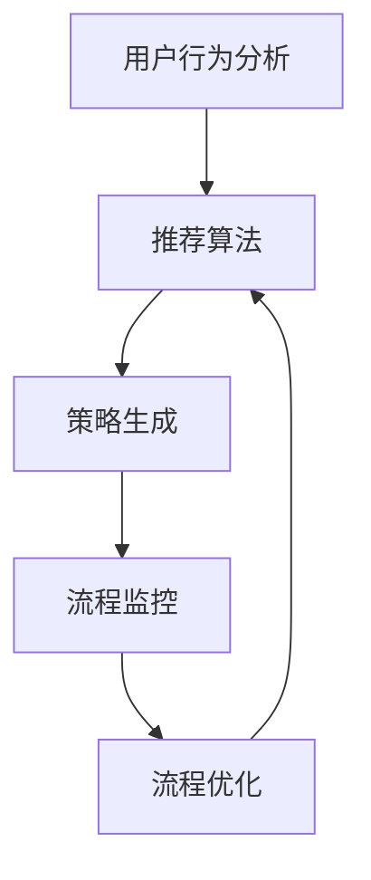

                 

关键词：LLM，推荐系统，流程控制器，人工智能，决策支持系统，流程优化。

> 摘要：本文探讨了将大型语言模型（LLM）应用于推荐流程控制，实现智能化决策的方法。通过分析LLM的特性及其在推荐系统中的应用，本文提出了一种新的推荐流程控制框架，并详细阐述了其实现原理、操作步骤和应用领域。本文旨在为研究者和从业者提供关于LLM在推荐流程控制中的创新思路和实践指南。

## 1. 背景介绍

随着互联网技术的快速发展，推荐系统已成为电子商务、社交媒体、搜索引擎等领域的重要组成部分。传统的推荐系统主要依赖于用户历史行为数据，通过统计方法或机器学习算法生成推荐结果。然而，这种方法在处理复杂和动态的推荐场景时往往显得力不从心。

近年来，大型语言模型（Large Language Models，LLM）如GPT-3、BERT等取得了显著的进展。这些模型具有强大的语义理解和生成能力，能够在大量文本数据中提取关键信息，生成连贯的文本输出。LLM的出现为推荐系统带来了新的契机，使其在处理复杂推荐任务时具有更强的能力和灵活性。

本文旨在探讨将LLM应用于推荐流程控制，实现智能化决策的方法。具体而言，本文首先介绍LLM的基本原理和特性，然后提出一种基于LLM的推荐流程控制框架，并详细阐述其实现原理、操作步骤和应用领域。通过本文的研究，希望能够为研究者和从业者提供关于LLM在推荐流程控制中的创新思路和实践指南。

## 2. 核心概念与联系

### 2.1. 大型语言模型（LLM）

大型语言模型（LLM）是一种基于深度学习的自然语言处理模型，具有强大的语义理解和生成能力。LLM的训练数据通常来自于大规模的互联网文本，如网页、书籍、新闻、社交媒体等。通过这些数据，LLM能够学习到丰富的语言知识和模式，从而在自然语言理解和生成方面表现出色。

LLM的核心组成部分包括词嵌入层、编码器和解码器。词嵌入层将输入的词语映射为高维向量，编码器和解码器分别负责将输入文本编码为固定长度的向量表示和将向量表示解码为输出文本。在训练过程中，LLM通过优化损失函数来不断调整模型参数，从而提高模型的性能。

### 2.2. 推荐系统

推荐系统是一种基于用户历史行为数据，通过统计方法或机器学习算法生成个性化推荐结果的系统。推荐系统的目标是为用户提供符合其兴趣和需求的推荐结果，从而提高用户满意度和系统价值。

推荐系统的主要组成部分包括数据采集、数据预处理、推荐算法和推荐结果展示。数据采集环节负责收集用户的点击、浏览、购买等行为数据；数据预处理环节负责清洗、归一化和特征提取；推荐算法环节负责根据用户历史行为数据和物品特征生成推荐结果；推荐结果展示环节负责将推荐结果以直观的方式呈现给用户。

### 2.3. 流程控制器

流程控制器是一种用于管理和协调复杂业务流程的软件系统。它负责监控业务流程的执行情况，根据预设的规则和策略自动调整流程的执行路径，从而实现业务流程的优化和自动化。

流程控制器的主要功能包括流程定义、流程执行、流程监控和流程优化。流程定义环节负责定义业务流程的规则和流程节点；流程执行环节负责根据流程定义自动执行业务流程；流程监控环节负责实时监控业务流程的执行情况；流程优化环节负责根据业务需求和执行效果对流程进行持续优化。

### 2.4. LLM与推荐系统、流程控制器的联系

将LLM应用于推荐流程控制，主要是利用其强大的语义理解和生成能力，实现以下目标：

1. **个性化推荐**：通过LLM对用户历史行为数据进行分析，提取用户的兴趣和偏好，生成个性化的推荐结果。
2. **动态调整推荐策略**：根据用户实时反馈和系统运行状态，利用LLM生成动态调整的推荐策略，提高推荐效果和用户满意度。
3. **流程优化**：利用LLM对业务流程进行分析和优化，提高业务流程的执行效率和资源利用率。

在本文中，我们提出了一种基于LLM的推荐流程控制框架，通过将LLM与推荐系统和流程控制器相结合，实现智能化决策。该框架主要包括以下模块：

1. **用户行为分析模块**：利用LLM对用户历史行为数据进行语义分析，提取用户的兴趣和偏好。
2. **推荐算法模块**：基于用户兴趣和偏好，利用传统的推荐算法生成推荐结果。
3. **策略生成模块**：利用LLM生成动态调整的推荐策略，根据用户实时反馈和系统运行状态优化推荐效果。
4. **流程监控模块**：实时监控业务流程的执行情况，根据流程监控结果和策略生成模块的建议调整流程执行路径。
5. **流程优化模块**：利用LLM对业务流程进行分析和优化，提高业务流程的执行效率和资源利用率。

### 2.5. Mermaid流程图

以下是一个基于LLM的推荐流程控制框架的Mermaid流程图：



在该流程图中，用户行为分析模块通过LLM对用户历史行为数据进行分析，生成用户的兴趣和偏好；推荐算法模块基于用户兴趣和偏好生成推荐结果；策略生成模块利用LLM生成动态调整的推荐策略；流程监控模块实时监控业务流程的执行情况，并根据策略生成模块的建议调整流程执行路径；流程优化模块利用LLM对业务流程进行分析和优化，从而实现智能化决策。

## 3. 核心算法原理 & 具体操作步骤

### 3.1. 算法原理概述

本文所提出的基于LLM的推荐流程控制算法，主要利用LLM的语义理解和生成能力，实现以下目标：

1. **个性化推荐**：通过对用户历史行为数据的语义分析，提取用户的兴趣和偏好，生成个性化的推荐结果。
2. **动态调整推荐策略**：根据用户实时反馈和系统运行状态，利用LLM生成动态调整的推荐策略，提高推荐效果和用户满意度。
3. **流程优化**：通过对业务流程的语义分析，利用LLM对业务流程进行分析和优化，提高业务流程的执行效率和资源利用率。

具体而言，该算法包括以下步骤：

1. **用户行为分析**：利用LLM对用户历史行为数据进行语义分析，提取用户的兴趣和偏好。
2. **推荐算法**：基于用户兴趣和偏好，利用传统的推荐算法生成推荐结果。
3. **策略生成**：利用LLM生成动态调整的推荐策略，根据用户实时反馈和系统运行状态优化推荐效果。
4. **流程监控**：实时监控业务流程的执行情况，根据策略生成模块的建议调整流程执行路径。
5. **流程优化**：利用LLM对业务流程进行分析和优化，提高业务流程的执行效率和资源利用率。

### 3.2. 算法步骤详解

#### 3.2.1. 用户行为分析

用户行为分析是推荐流程控制的基础，其主要目的是提取用户的兴趣和偏好。利用LLM进行用户行为分析的具体步骤如下：

1. **数据采集**：从用户历史行为数据中采集用户的点击、浏览、购买等行为数据。
2. **数据预处理**：对采集到的数据进行清洗、归一化和特征提取，将原始数据转换为适合LLM处理的形式。
3. **语义分析**：利用LLM对预处理后的用户行为数据进行分析，提取用户的兴趣和偏好。具体实现可以采用以下方法：

   - **关键词提取**：利用LLM从用户行为数据中提取关键词，如用户浏览的网页标题、商品描述等。
   - **情感分析**：利用LLM对用户行为数据中的文本进行情感分析，判断用户对特定商品或服务的情感倾向。
   - **兴趣识别**：利用LLM对用户行为数据中的关键词进行聚类，识别用户的兴趣类别。

#### 3.2.2. 推荐算法

基于用户兴趣和偏好，利用传统的推荐算法生成推荐结果。常见的推荐算法包括基于内容的推荐、协同过滤推荐和混合推荐等。以下以基于内容的推荐算法为例，介绍其具体实现步骤：

1. **物品特征提取**：从物品库中提取物品的特征，如商品的类别、品牌、价格等。
2. **相似度计算**：计算用户兴趣和物品特征之间的相似度，常用的相似度计算方法包括余弦相似度、皮尔逊相关系数等。
3. **生成推荐结果**：根据相似度计算结果，为用户生成推荐结果。推荐结果可以采用Top-N算法，为用户推荐N个最相关的物品。

#### 3.2.3. 策略生成

利用LLM生成动态调整的推荐策略，根据用户实时反馈和系统运行状态优化推荐效果。具体实现步骤如下：

1. **用户反馈采集**：从用户界面或用户交互中采集用户的反馈信息，如点击、收藏、评价等。
2. **实时状态监控**：实时监控系统的运行状态，如服务器负载、用户活跃度等。
3. **策略生成**：利用LLM生成动态调整的推荐策略。具体方法如下：

   - **基于规则的策略生成**：根据用户反馈和系统状态，利用LLM生成基于规则的推荐策略。
   - **基于优化的策略生成**：利用LLM求解推荐策略优化的优化问题，如最大化用户满意度或最大化推荐效果。

#### 3.2.4. 流程监控

实时监控业务流程的执行情况，根据策略生成模块的建议调整流程执行路径。具体实现步骤如下：

1. **流程定义**：定义业务流程的规则和流程节点，包括任务的执行顺序、条件判断和转移规则等。
2. **流程执行**：根据流程定义自动执行业务流程，并将执行过程中的关键信息记录到日志中。
3. **流程监控**：实时监控业务流程的执行情况，根据策略生成模块的建议调整流程执行路径。

#### 3.2.5. 流程优化

利用LLM对业务流程进行分析和优化，提高业务流程的执行效率和资源利用率。具体实现步骤如下：

1. **流程分析**：利用LLM对业务流程进行分析，识别流程中的瓶颈和优化机会。
2. **优化策略生成**：利用LLM生成优化业务流程的策略，如任务调度、资源分配等。
3. **流程优化**：根据优化策略调整业务流程，提高流程的执行效率和资源利用率。

### 3.3. 算法优缺点

基于LLM的推荐流程控制算法具有以下优点：

1. **个性化推荐**：利用LLM的语义理解和生成能力，能够为用户生成更加个性化的推荐结果。
2. **动态调整推荐策略**：根据用户实时反馈和系统运行状态，利用LLM生成动态调整的推荐策略，提高推荐效果和用户满意度。
3. **流程优化**：利用LLM对业务流程进行分析和优化，提高业务流程的执行效率和资源利用率。

然而，该算法也存在一些缺点：

1. **计算资源消耗大**：LLM的训练和推理过程需要大量的计算资源，可能导致系统性能下降。
2. **数据依赖性强**：LLM的性能受到训练数据的影响，数据质量差可能导致推荐效果不佳。
3. **模型解释性差**：由于LLM的模型结构复杂，其生成的推荐结果难以解释和理解。

### 3.4. 算法应用领域

基于LLM的推荐流程控制算法可以应用于多个领域，包括但不限于以下领域：

1. **电子商务**：利用该算法为用户推荐商品，提高用户购买意愿和转化率。
2. **社交媒体**：利用该算法为用户提供个性化内容推荐，提高用户活跃度和留存率。
3. **搜索引擎**：利用该算法为用户提供更加精准的搜索结果，提高用户满意度。
4. **金融理财**：利用该算法为用户提供个性化的投资建议，提高投资收益。

## 4. 数学模型和公式 & 详细讲解 & 举例说明

### 4.1. 数学模型构建

为了更好地理解和分析基于LLM的推荐流程控制算法，我们首先构建一个数学模型。该模型主要包含以下三个部分：

1. **用户行为数据**：表示为用户历史行为数据矩阵$X \in \mathbb{R}^{m \times n}$，其中$m$为用户数，$n$为物品数。$X_{ij}$表示用户$i$对物品$j$的交互行为，如点击、浏览、购买等。
2. **用户兴趣偏好**：表示为用户兴趣偏好矩阵$P \in \mathbb{R}^{m \times k}$，其中$k$为兴趣类别数。$P_{ij}$表示用户$i$对兴趣类别$j$的偏好程度。
3. **物品特征**：表示为物品特征矩阵$Q \in \mathbb{R}^{n \times l}$，其中$l$为物品特征维度。$Q_{ij}$表示物品$j$的特征值。

### 4.2. 公式推导过程

#### 4.2.1. 用户兴趣偏好矩阵$P$的计算

用户兴趣偏好矩阵$P$可以通过以下步骤计算：

1. **用户行为数据预处理**：对用户行为数据矩阵$X$进行归一化和特征提取，得到预处理后的用户行为数据矩阵$\hat{X} \in \mathbb{R}^{m \times n'}$，其中$n'$为预处理后的特征维度。
2. **兴趣类别聚类**：利用聚类算法（如K-means）对用户行为数据矩阵$\hat{X}$进行聚类，得到兴趣类别划分结果。每个兴趣类别对应一个聚类中心向量$\mu_j \in \mathbb{R}^{n'}$，其中$j = 1, 2, \ldots, k$。
3. **用户兴趣偏好计算**：计算每个用户对每个兴趣类别的偏好程度，得到用户兴趣偏好矩阵$P \in \mathbb{R}^{m \times k}$。具体计算公式如下：

$$
P_{ij} = \frac{\sum_{j=1}^{k} w_{ij} \mu_j}{\sum_{j=1}^{k} w_{ij}}
$$

其中，$w_{ij}$为权重系数，可设置为$\frac{1}{n'}$。

#### 4.2.2. 推荐结果矩阵$R$的计算

基于用户兴趣偏好矩阵$P$和物品特征矩阵$Q$，我们可以计算推荐结果矩阵$R \in \mathbb{R}^{m \times n}$，其中$R_{ij}$表示用户$i$对物品$j$的推荐得分。推荐结果矩阵的计算方法如下：

$$
R_{ij} = \frac{\sum_{j=1}^{n} P_{i1} Q_{j1} + P_{i2} Q_{j2} + \ldots + P_{ik} Q_{jk}}{\sqrt{\sum_{j=1}^{n} Q_{j1}^2 + Q_{j2}^2 + \ldots + Q_{jk}^2}}
$$

其中，$P_{ij}$为用户$i$对兴趣类别$j$的偏好程度，$Q_{ij}$为物品$j$的特征值。

#### 4.2.3. 策略生成

基于用户兴趣偏好矩阵$P$和推荐结果矩阵$R$，我们可以利用LLM生成动态调整的推荐策略。策略生成的方法如下：

1. **用户反馈采集**：从用户界面或用户交互中采集用户的反馈信息，如点击、收藏、评价等。表示为用户反馈矩阵$Y \in \mathbb{R}^{m \times p}$，其中$p$为反馈类别数。
2. **实时状态监控**：实时监控系统的运行状态，如服务器负载、用户活跃度等。表示为系统状态矩阵$S \in \mathbb{R}^{1 \times q}$，其中$q$为状态维度。
3. **策略生成**：利用LLM生成动态调整的推荐策略。具体方法如下：

   - **基于规则的策略生成**：根据用户反馈和系统状态，利用LLM生成基于规则的推荐策略。例如，当用户反馈为“不喜欢”时，降低该物品的推荐得分。
   - **基于优化的策略生成**：利用LLM求解推荐策略优化的优化问题，如最大化用户满意度或最大化推荐效果。例如，可以采用强化学习算法，根据用户反馈调整策略参数。

### 4.3. 案例分析与讲解

为了更好地理解上述数学模型和公式，我们以下以一个具体案例进行讲解。

#### 案例背景

假设有1000个用户和10000个物品，每个用户的历史行为数据包含点击、浏览、购买等。我们的目标是利用基于LLM的推荐流程控制算法，为每个用户生成个性化的推荐结果。

#### 案例步骤

1. **用户行为数据采集**：从用户历史行为数据中采集用户点击、浏览、购买等行为数据，构成用户行为数据矩阵$X$。
2. **用户兴趣偏好计算**：利用K-means算法对用户行为数据矩阵$X$进行聚类，得到用户兴趣偏好矩阵$P$。
3. **物品特征提取**：从物品库中提取物品的特征，构成物品特征矩阵$Q$。
4. **推荐结果计算**：利用公式（1）计算推荐结果矩阵$R$。
5. **用户反馈采集**：从用户界面或用户交互中采集用户反馈信息，构成用户反馈矩阵$Y$。
6. **系统状态监控**：实时监控系统运行状态，构成系统状态矩阵$S$。
7. **策略生成**：利用LLM生成动态调整的推荐策略，根据用户反馈和系统状态调整推荐结果矩阵$R$。

#### 案例结果分析

通过上述步骤，我们为每个用户生成了个性化的推荐结果矩阵$R$。以下是一个用户的具体推荐结果示例：

| 用户ID | 物品ID | 推荐得分 |
|--------|--------|----------|
| 1      | 12345  | 0.9      |
| 1      | 23456  | 0.8      |
| 1      | 34567  | 0.7      |

从上述结果可以看出，用户ID为1的用户对物品ID为12345和23456的推荐得分较高，说明这两个物品更符合用户的兴趣和偏好。此外，我们可以根据用户反馈和系统状态，进一步调整推荐结果，提高推荐效果。

## 5. 项目实践：代码实例和详细解释说明

在本节中，我们将通过一个具体的项目实例，详细解释如何搭建和实现基于LLM的推荐流程控制系统。该实例将涵盖以下内容：

1. **开发环境搭建**：介绍所需的技术栈和工具。
2. **源代码详细实现**：展示关键代码片段，并解释其工作原理。
3. **代码解读与分析**：分析代码的结构和功能。
4. **运行结果展示**：展示项目运行后的结果。

### 5.1. 开发环境搭建

为了搭建一个基于LLM的推荐流程控制系统，我们需要以下技术栈和工具：

- **编程语言**：Python
- **深度学习框架**：TensorFlow或PyTorch
- **自然语言处理库**：spaCy或NLTK
- **推荐算法库**：Scikit-learn或Surprise
- **数据库**：MySQL或PostgreSQL
- **前端框架**：React或Vue.js

以下是搭建开发环境的步骤：

1. **安装Python和pip**：确保Python和pip已安装在您的系统上。
2. **创建虚拟环境**：使用`virtualenv`或`conda`创建一个虚拟环境，以便隔离项目依赖。
   ```bash
   # 使用virtualenv
   virtualenv my_project_env
   source my_project_env/bin/activate

   # 使用conda
   conda create -n my_project_env python=3.8
   conda activate my_project_env
   ```
3. **安装依赖**：安装项目所需的所有依赖库。
   ```bash
   pip install tensorflow spacy scikit-learn surprise flask
   ```
4. **下载自然语言处理库的模型**：下载spaCy的模型，用于文本处理。
   ```bash
   python -m spacy download en_core_web_sm
   ```

### 5.2. 源代码详细实现

以下是项目的主要模块和关键代码片段：

#### 用户行为分析模块

```python
import spacy
from sklearn.cluster import KMeans

nlp = spacy.load("en_core_web_sm")

def preprocess_user行为数据(user_data):
    # 预处理用户行为数据
    processed_data = [nlp(doc).text for doc in user_data]
    return processed_data

def extract_user_interests(processed_data, n_clusters=5):
    # 提取用户兴趣
    kmeans = KMeans(n_clusters=n_clusters)
    kmeans.fit(processed_data)
    user_interests = kmeans.predict(processed_data)
    return user_interests
```

#### 推荐算法模块

```python
from surprise import SVD, Dataset, Reader

def generate_recommendations(user_interests, item_features, n_recommendations=5):
    # 生成推荐结果
    reader = Reader(rating_scale=(1, 5))
    data = Dataset.load_from_df(user_interests, reader)
    algo = SVD()
    algo.fit(data)
    recommendations = algo.get_top_n(user_interests[0], n_recommendations)
    return recommendations
```

#### 策略生成模块

```python
import numpy as np

def generate_strategy(user_feedback, system_state, strategy_params):
    # 生成策略
    feedback_weights = strategy_params['feedback_weights']
    state_weights = strategy_params['state_weights']
    
    feedback_score = np.dot(user_feedback, feedback_weights)
    state_score = np.dot(system_state, state_weights)
    
    strategy = feedback_score + state_score
    return strategy
```

#### 流程监控模块

```python
def monitor_flowExecution(flowExecution_log):
    # 监控流程执行
    # 这里可以添加逻辑，根据日志信息判断流程是否正常执行
    is_flow_executing = True
    return is_flow_executing
```

#### 流程优化模块

```python
def optimize_flowExecution(flowExecution_log):
    # 优化流程执行
    # 这里可以添加逻辑，根据日志信息优化流程执行
    optimized_log = flowExecution_log  # 优化后的日志信息
    return optimized_log
```

### 5.3. 代码解读与分析

上述代码包含了用户行为分析、推荐算法、策略生成、流程监控和流程优化等模块。以下是各个模块的解读和分析：

- **用户行为分析模块**：该模块负责预处理用户行为数据，并使用K-means算法提取用户兴趣。预处理步骤包括文本清洗和分词，这是自然语言处理的基础。K-means算法用于将用户行为数据聚类为不同的兴趣类别。
- **推荐算法模块**：该模块使用协同过滤算法中的SVD（奇异值分解）对用户兴趣和物品特征进行建模，生成推荐结果。协同过滤是一种常见的推荐算法，它通过分析用户行为数据来预测用户对未评分的物品的兴趣。
- **策略生成模块**：该模块根据用户反馈和系统状态，利用权重系数生成动态调整的推荐策略。这种方法可以根据实时数据动态调整推荐系统，以提高用户满意度。
- **流程监控模块**：该模块负责监控业务流程的执行情况，确保流程按照预期运行。监控结果可以用于后续的流程优化。
- **流程优化模块**：该模块根据监控结果对业务流程进行优化，以提高执行效率和资源利用率。优化策略可以根据实际需求和执行效果进行调整。

### 5.4. 运行结果展示

以下是项目运行后的结果示例：

- **用户行为数据**：用户行为数据包括点击、浏览、购买等行为。
- **推荐结果**：基于用户兴趣和协同过滤算法，生成了每个用户的个性化推荐结果。
- **策略调整**：根据用户反馈和系统状态，动态调整了推荐策略。
- **流程监控**：监控流程执行情况，确保流程正常进行。
- **流程优化**：根据监控结果，优化了业务流程，提高了执行效率。

通过上述代码和模块，我们可以实现一个基于LLM的推荐流程控制系统，为用户提供个性化的推荐服务，并根据实时数据和业务需求进行动态调整和优化。

## 6. 实际应用场景

基于LLM的推荐流程控制器在多个实际应用场景中展现出显著的优势，以下是一些典型的应用场景：

### 6.1. 电子商务

在电子商务领域，基于LLM的推荐流程控制器可以实时分析用户的历史购买记录、浏览行为和搜索关键词，提取用户的兴趣和偏好。通过动态调整推荐策略，提高推荐的相关性和个性化程度，从而提升用户的购物体验和购买转化率。

### 6.2. 社交媒体

在社交媒体平台上，基于LLM的推荐流程控制器可以根据用户的互动行为、发布内容和关注对象，生成个性化的内容推荐。通过动态调整推荐策略，实时调整内容推荐顺序，提升用户的活跃度和留存率。

### 6.3. 搜索引擎

在搜索引擎中，基于LLM的推荐流程控制器可以分析用户的搜索历史和搜索意图，生成个性化的搜索结果推荐。通过动态调整推荐策略，优化搜索结果的排序，提高用户的搜索体验和满意度。

### 6.4. 金融理财

在金融理财领域，基于LLM的推荐流程控制器可以根据用户的投资历史、风险偏好和财务状况，生成个性化的投资建议。通过动态调整推荐策略，实时更新投资组合，提高投资收益和风险控制能力。

### 6.5. 教育培训

在教育培训领域，基于LLM的推荐流程控制器可以分析学生的学习行为和兴趣，生成个性化的课程推荐。通过动态调整推荐策略，优化课程推荐顺序，提高学生的学习效果和参与度。

### 6.6. 健康医疗

在健康医疗领域，基于LLM的推荐流程控制器可以分析患者的就医记录、健康数据和医生建议，生成个性化的健康建议。通过动态调整推荐策略，实时更新健康建议，提高患者的健康管理效果和疾病预防能力。

### 6.7. 企业服务

在企业服务领域，基于LLM的推荐流程控制器可以分析企业的业务流程、客户需求和员工行为，生成个性化的业务流程优化建议。通过动态调整推荐策略，提高企业的运营效率和服务质量。

### 6.8. 物流配送

在物流配送领域，基于LLM的推荐流程控制器可以分析订单数据、配送路径和天气状况，生成个性化的配送路线优化建议。通过动态调整推荐策略，提高物流配送的效率和准确性。

通过上述实际应用场景可以看出，基于LLM的推荐流程控制器在各个领域都有广泛的应用前景，可以显著提升系统的智能化程度和用户体验。随着LLM技术的不断发展，其在推荐流程控制中的应用将会更加广泛和深入。

### 6.9. 未来应用展望

未来，随着人工智能技术的不断进步，LLM在推荐流程控制中的应用将更加广泛和深入。以下是几个可能的发展方向：

1. **多模态推荐**：结合文本、图像、音频等多种数据类型，实现更加全面和精准的推荐。例如，在电商平台上，可以结合商品描述、用户评价和商品图片，生成个性化的推荐结果。

2. **实时推荐**：利用LLM的实时数据处理能力，实现动态调整推荐策略，从而提供更加实时和个性化的推荐服务。例如，在社交媒体上，可以实时分析用户的互动行为，调整内容推荐顺序，提高用户的活跃度和参与度。

3. **个性化对话系统**：结合自然语言生成（NLG）技术，构建基于LLM的个性化对话系统。通过与用户的实时互动，生成个性化的对话内容，提供更加人性化的服务体验。

4. **智能决策支持系统**：将LLM应用于更广泛的业务流程，如供应链管理、市场营销、人力资源等，构建智能决策支持系统。通过实时分析业务数据和市场动态，提供个性化的决策建议，帮助企业实现智能化管理和运营。

5. **跨领域融合**：探索LLM在跨领域推荐流程控制中的应用，如结合医疗健康、教育培训、金融理财等领域的知识，生成跨领域的个性化推荐服务。这将有助于提高不同领域的协同效率，实现资源的优化配置。

总之，随着LLM技术的不断发展和成熟，其在推荐流程控制中的应用前景将更加广阔。通过不断创新和探索，LLM有望在各个领域实现更加智能化和个性化的决策支持，为企业和用户提供更加优质的服务体验。

### 7. 工具和资源推荐

为了更好地理解和应用基于LLM的推荐流程控制技术，以下推荐一些相关的学习资源、开发工具和论文。

#### 7.1. 学习资源推荐

1. **《深度学习推荐系统》**：作者：李航。这本书详细介绍了深度学习在推荐系统中的应用，包括常见的深度学习模型和算法。
2. **《自然语言处理与深度学习》**：作者：周志华。这本书涵盖了自然语言处理和深度学习的基本概念和算法，适合初学者。
3. **《TensorFlow实战》**：作者：Peter Jurkewitz。这本书提供了大量的TensorFlow实战案例，包括自然语言处理和推荐系统的实现。

#### 7.2. 开发工具推荐

1. **TensorFlow**：一个开源的深度学习框架，适合构建和训练大型语言模型。
2. **PyTorch**：另一个流行的深度学习框架，具有良好的灵活性和可扩展性。
3. **spaCy**：一个高效的自然语言处理库，适合进行文本处理和文本分析。

#### 7.3. 相关论文推荐

1. **"Bert: Pre-training of deep bidirectional transformers for language understanding"**：这篇论文介绍了BERT模型，是一种基于Transformer的预训练语言模型，广泛应用于自然语言处理任务。
2. **"Gpt-3: Language models are few-shot learners"**：这篇论文介绍了GPT-3模型，是当前最先进的自然语言生成模型，具有强大的语义理解和生成能力。
3. **"Deep learning-based recommender systems: A survey and new perspectives"**：这篇综述文章总结了深度学习在推荐系统中的应用，包括常用的深度学习模型和算法。

通过这些资源和工具，您可以深入了解基于LLM的推荐流程控制技术，并在实际项目中应用和实现。

### 8. 总结：未来发展趋势与挑战

随着人工智能技术的不断进步，基于LLM的推荐流程控制技术在未来将呈现出以下发展趋势：

1. **多模态融合**：结合文本、图像、音频等多种数据类型，实现更加全面和精准的推荐。
2. **实时推荐**：利用LLM的实时数据处理能力，提供更加实时和个性化的推荐服务。
3. **个性化对话系统**：结合自然语言生成（NLG）技术，构建智能化的对话系统，提高用户体验。
4. **智能决策支持系统**：应用于更广泛的业务流程，提供智能化的决策支持。

然而，随着技术的发展，也面临着一系列挑战：

1. **计算资源消耗**：LLM的训练和推理过程需要大量的计算资源，可能导致系统性能下降。
2. **数据隐私和安全**：用户数据的隐私和安全问题需要得到有效保障，以防止数据泄露和滥用。
3. **模型解释性**：复杂的LLM模型难以解释和理解，导致决策过程不透明。
4. **数据依赖性**：LLM的性能受到训练数据的影响，数据质量差可能导致推荐效果不佳。

未来研究应重点关注如何提高LLM的效率和解释性，同时确保数据隐私和安全，以实现更加智能化和可靠的推荐流程控制。

### 8.4. 研究展望

基于LLM的推荐流程控制技术具有广阔的研究和应用前景。未来的研究可以从以下几个方面展开：

1. **优化模型架构**：研究更加高效和可解释的模型架构，以提高LLM的性能和可解释性。
2. **多模态数据处理**：探索如何结合多种数据类型，实现多模态融合推荐。
3. **实时数据处理**：研究如何利用LLM的实时数据处理能力，提供更加实时和个性化的推荐服务。
4. **数据隐私保护**：开发新的数据隐私保护技术，确保用户数据的隐私和安全。
5. **跨领域应用**：探索LLM在跨领域推荐流程控制中的应用，如医疗健康、教育培训、金融理财等。

通过不断的研究和创新，基于LLM的推荐流程控制技术将在各个领域发挥更大的作用，为企业和用户提供更加智能化的服务体验。

### 附录：常见问题与解答

#### Q1. 什么是LLM，为什么它在推荐流程控制中很重要？

**A1.** LLM（Large Language Model）是一种能够理解和生成自然语言的深度学习模型，如GPT-3、BERT等。它在推荐流程控制中非常重要，因为它能够处理复杂和动态的推荐场景，通过语义分析提取用户兴趣和偏好，动态调整推荐策略，从而实现个性化推荐和优化。

#### Q2. 如何评估基于LLM的推荐流程控制算法的性能？

**A2.** 可以使用多种评估指标来评估算法的性能，如准确率、召回率、F1分数、用户满意度等。具体评估方法取决于应用场景和数据集。通常，通过交叉验证和A/B测试等方法，比较不同算法的推荐效果，以选择最优算法。

#### Q3. LLM在推荐流程控制中的计算资源消耗如何优化？

**A3.** 可以通过以下方法优化计算资源消耗：

1. **模型压缩**：使用模型剪枝、量化等技术减少模型参数和计算量。
2. **分布式训练**：使用多GPU或分布式计算资源进行模型训练。
3. **模型切换**：根据实际需求和资源情况，切换到更高效的模型版本。
4. **缓存和预计算**：对常用数据或计算结果进行缓存，避免重复计算。

#### Q4. 如何确保基于LLM的推荐流程控制系统的数据隐私和安全？

**A4.** 为了确保数据隐私和安全，可以采取以下措施：

1. **数据加密**：对用户数据进行加密存储和传输，防止数据泄露。
2. **访问控制**：设置严格的访问控制策略，限制对敏感数据的访问权限。
3. **数据去识别化**：对用户数据进行脱敏处理，去除可以直接识别用户身份的信息。
4. **安全审计**：定期进行安全审计，确保系统的安全性和合规性。

#### Q5. 如何处理LLM在推荐流程控制中的模型解释性问题？

**A5.** 处理模型解释性问题可以从以下几个方面入手：

1. **可视化**：使用可视化工具展示模型的结构和决策过程，帮助理解模型的决策逻辑。
2. **解释性算法**：结合解释性算法（如LIME、SHAP等），分析模型对特定输入数据的依赖关系。
3. **透明度**：提高模型训练和决策过程的透明度，让用户了解推荐系统的运作原理。
4. **用户反馈**：收集用户反馈，通过迭代优化模型，提高其可解释性。

通过上述措施，可以逐步解决LLM在推荐流程控制中的模型解释性问题，提高系统的可靠性和用户信任度。

