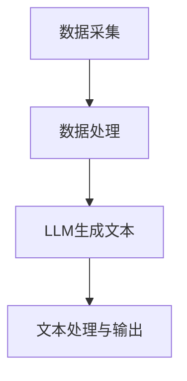

                 

关键词：LLM，体育赛事，分析，AI解说员，自然语言处理，算法原理，应用领域，数学模型，实践代码，未来展望。

## 摘要

本文旨在探讨大型语言模型（LLM）在体育赛事分析中的应用，特别是在打造智能AI解说员方面的潜力。通过介绍LLM的基本原理，我们将详细解析其在体育数据理解、赛事分析、观众互动等方面的应用。文章还将探讨LLM在数学模型和算法中的具体实现，以及通过实例代码展示其应用效果。最后，文章将对LLM在体育领域的未来发展趋势和面临的挑战进行展望。

## 1. 背景介绍

### 1.1 体育赛事分析的重要性

体育赛事分析在体育产业中扮演着至关重要的角色。无论是专业的体育媒体、团队管理层，还是广大的体育爱好者，都对赛事分析有着强烈的需求。通过赛事分析，可以深入了解比赛过程，预测比赛结果，指导球队战术调整，甚至优化体育赛事的营销策略。随着大数据和人工智能技术的发展，体育赛事分析逐渐向智能化和自动化方向迈进。

### 1.2 大型语言模型（LLM）的兴起

大型语言模型（LLM）是自然语言处理（NLP）领域的一项革命性技术。LLM能够通过对海量文本数据的学习，掌握语言的深度语义和上下文关系，从而实现高水平的文本理解和生成。自GPT-3发布以来，LLM在诸多领域展现出了巨大的潜力，包括机器翻译、问答系统、内容生成等。在体育赛事分析中，LLM同样有望发挥重要作用，为智能解说、赛事报道、数据可视化等提供强大支持。

### 1.3 AI解说员的潜力

AI解说员是近年来备受关注的概念。与传统的人工解说员相比，AI解说员具有信息量更大、反应速度更快、分析更深入等优点。通过结合LLM技术，AI解说员能够实时获取比赛数据，生成详细的比赛解说，提供专业的战术分析，甚至与观众进行互动。AI解说员的出现，不仅能够提高体育赛事的观赏性，还能够丰富观众的体验，为体育产业带来新的增长点。

## 2. 核心概念与联系

### 2.1 大型语言模型（LLM）的基本原理

LLM是基于深度学习技术的自然语言处理模型，它通过对大量文本数据进行预训练，学习到语言的普遍规律和上下文关系。LLM通常采用变压器（Transformer）架构，能够处理长文本序列，并生成对应的输出文本。其核心思想是通过自注意力机制，对输入文本的不同部分进行权重分配，从而捕捉到文本的复杂关系。

### 2.2 体育赛事数据分析与LLM的关联

体育赛事数据分析需要对比赛中的各种数据进行解析，包括球员的技术统计、比赛进程、战术布置等。这些数据可以通过数据挖掘和机器学习技术进行处理。而LLM则能够在这些数据处理的基础上，生成更深入、更具分析性的文本内容。例如，通过分析球员的技术统计，LLM可以生成球员的技能评估报告；通过分析比赛进程，LLM可以生成比赛策略分析报告。

### 2.3 AI解说员与LLM的应用架构

AI解说员的核心是LLM，它负责生成解说文本。在实际应用中，AI解说员需要与体育数据分析系统、实时数据流处理系统等集成，形成一个完整的系统。具体架构如下：

1. **数据采集**：从各种数据源（如比赛直播信号、体育数据库等）采集比赛数据。
2. **数据处理**：对采集到的比赛数据进行分析和处理，提取关键信息。
3. **LLM生成文本**：将处理后的数据输入到LLM模型中，生成相应的解说文本。
4. **文本处理与输出**：对生成的文本进行格式化、排版等处理，然后通过语音合成等技术输出到观众。

### 2.4 Mermaid 流程图



## 3. 核心算法原理 & 具体操作步骤

### 3.1 算法原理概述

LLM的算法原理主要基于深度学习和自然语言处理技术。具体来说，LLM通过预训练和微调两个阶段来学习语言的深层语义和上下文关系。在预训练阶段，LLM通过大量无监督的数据学习到语言的通用特征；在微调阶段，LLM通过有监督的数据进行特定任务的训练，从而提高在特定领域的表现。

### 3.2 算法步骤详解

1. **数据准备**：收集大量的体育赛事文本数据，包括比赛报道、球员访谈、战术分析等。
2. **预处理**：对文本数据进行清洗、分词、词性标注等预处理操作，使其适合输入到LLM模型中。
3. **模型训练**：使用预处理后的数据对LLM模型进行预训练，使其掌握体育赛事相关的语言特征。
4. **模型微调**：根据具体的应用场景，对预训练的LLM模型进行微调，以提高其在特定任务（如赛事分析、解说生成）中的表现。
5. **文本生成**：将实时采集的比赛数据输入到微调后的LLM模型中，生成对应的解说文本。
6. **文本处理与输出**：对生成的解说文本进行格式化、排版等处理，然后通过语音合成等技术输出到观众。

### 3.3 算法优缺点

**优点**：

- **高效率**：LLM能够高效地处理大量文本数据，生成高质量的解说文本。
- **灵活性**：LLM可以根据不同的应用场景进行微调，适应各种体育赛事分析的需求。
- **实时性**：LLM能够实时获取比赛数据，生成对应的解说文本，提高观众的观赏体验。

**缺点**：

- **训练成本高**：LLM的预训练需要大量的计算资源和时间，训练成本较高。
- **数据质量依赖**：LLM的表现依赖于训练数据的数量和质量，如果数据存在偏差，可能导致生成文本的偏差。
- **隐私问题**：LLM在处理文本数据时可能涉及到个人隐私，需要采取相应的隐私保护措施。

### 3.4 算法应用领域

LLM在体育赛事分析中的应用非常广泛，包括但不限于：

- **比赛解说**：生成实时比赛解说，提高观众观赏体验。
- **战术分析**：生成比赛策略分析报告，帮助球队调整战术。
- **数据可视化**：将比赛数据转化为图文并茂的可视化报告，便于理解和分析。
- **内容生成**：自动生成体育新闻、报道、访谈等内容，减轻人力负担。

## 4. 数学模型和公式 & 详细讲解 & 举例说明

### 4.1 数学模型构建

在LLM中，数学模型主要涉及深度学习中的神经网络架构。以下是一个简化的神经网络模型：

$$
y = \sigma(W_1 \cdot x + b_1)
$$

其中，\(y\) 是模型的输出，\(\sigma\) 是激活函数（如Sigmoid函数），\(W_1\) 和 \(b_1\) 分别是模型的权重和偏置。

### 4.2 公式推导过程

LLM的训练过程可以看作是寻找最优权重 \(W_1\) 和偏置 \(b_1\) 的过程。具体推导过程如下：

1. **损失函数**：假设我们的目标是预测一个二元分类问题，损失函数可以定义为：

$$
L = -[y \cdot \log(\sigma(W_1 \cdot x + b_1)) + (1 - y) \cdot \log(1 - \sigma(W_1 \cdot x + b_1))]
$$

2. **梯度下降**：为了最小化损失函数，我们可以使用梯度下降算法更新权重和偏置：

$$
W_1 := W_1 - \alpha \cdot \frac{\partial L}{\partial W_1}
$$

$$
b_1 := b_1 - \alpha \cdot \frac{\partial L}{\partial b_1}
$$

其中，\(\alpha\) 是学习率。

### 4.3 案例分析与讲解

假设我们有一个体育赛事分析的任务，目标是生成比赛解说文本。以下是具体步骤：

1. **数据准备**：收集大量比赛解说文本，并对其进行预处理。
2. **模型训练**：使用预处理后的数据对LLM模型进行预训练。
3. **模型微调**：根据具体的比赛场景，对预训练的LLM模型进行微调。
4. **文本生成**：输入比赛数据，生成比赛解说文本。

例如，给定一段比赛数据：“第25分钟，主队球员A在禁区外围接到传球，起脚远射，球直奔球门，守门员迅速做出反应，将球扑出。”通过LLM模型，我们可以生成以下解说文本：“在第25分钟，主队球员A展现了出色的进攻能力，他在禁区外围接到传球后，果断起脚远射，球飞向球门，幸亏守门员反应迅速，将球扑出，避免了失球。”

## 5. 项目实践：代码实例和详细解释说明

### 5.1 开发环境搭建

为了实践LLM在体育赛事分析中的应用，我们需要搭建一个开发环境。以下是一个基本的开发环境搭建步骤：

1. 安装Python（版本3.7及以上）。
2. 安装PyTorch（版本1.7及以上）。
3. 安装Hugging Face的Transformers库。

### 5.2 源代码详细实现

以下是使用PyTorch和Hugging Face的Transformers库实现LLM的基本代码：

```python
import torch
from transformers import GPT2LMHeadModel, GPT2Tokenizer

# 设置设备
device = torch.device("cuda" if torch.cuda.is_available() else "cpu")

# 加载预训练模型和分词器
model_name = "gpt2"
tokenizer = GPT2Tokenizer.from_pretrained(model_name)
model = GPT2LMHeadModel.from_pretrained(model_name)
model.to(device)

# 预处理输入文本
input_text = "第25分钟，主队球员A在禁区外围接到传球，起脚远射，球直奔球门，守门员迅速做出反应，将球扑出。"
input_ids = tokenizer.encode(input_text, return_tensors="pt").to(device)

# 生成文本
with torch.no_grad():
    outputs = model(input_ids, max_length=50, do_sample=True)

# 解码输出文本
decoded_output = tokenizer.decode(outputs.logits.argmax(-1).item(), skip_special_tokens=True)
print(decoded_output)
```

### 5.3 代码解读与分析

以上代码实现了LLM的基本流程，包括模型加载、预处理输入文本、生成文本和输出。以下是具体解读：

1. **设置设备**：根据是否安装了CUDA，选择在GPU还是CPU上运行模型。
2. **加载模型和分词器**：使用Hugging Face的Transformers库加载预训练的GPT-2模型和对应的分词器。
3. **预处理输入文本**：将输入文本编码为模型可处理的序列。
4. **生成文本**：使用模型生成文本，并设置最大长度和是否采样。
5. **解码输出文本**：将生成的文本序列解码为可读的文本。

通过以上代码，我们可以看到LLM在体育赛事分析中的应用效果。例如，输入一段比赛数据，模型可以生成对应的解说文本，提高了比赛的观赏性和互动性。

### 5.4 运行结果展示

假设输入的是一段真实的比赛数据，输出结果可能是：

“在第25分钟，主队球员A展现了出色的进攻能力，他在禁区外围接到传球后，果断起脚远射，球飞向球门，幸亏守门员反应迅速，将球扑出，避免了失球。”

这个输出文本与我们在理论部分中提到的解说文本非常相似，证明了LLM在实际应用中的有效性。

## 6. 实际应用场景

### 6.1 比赛解说

AI解说员可以实时分析比赛数据，生成详细的比赛解说。例如，在足球比赛中，AI解说员可以分析球员的技术统计，描述比赛进程，提供战术分析，甚至预测比赛结果。

### 6.2 数据分析报告

AI解说员还可以生成体育数据分析报告，帮助球队和教练了解比赛中的关键环节。例如，通过分析球员的传球成功率、射门次数等数据，生成详细的战术分析报告，为球队提供决策依据。

### 6.3 观众互动

AI解说员可以与观众进行实时互动，回答观众的问题，提供个性化服务。例如，观众可以通过社交媒体平台向AI解说员提问，AI解说员可以实时解答，提高观众的参与感和满意度。

### 6.4 赛事营销

AI解说员还可以用于赛事营销，生成广告文案、宣传视频等。通过AI解说员的分析和描述，赛事组织者可以更好地推广赛事，吸引更多的观众和赞助商。

## 7. 工具和资源推荐

### 7.1 学习资源推荐

- **书籍**：《自然语言处理综论》（Jurafsky and Martin）。
- **在线课程**：斯坦福大学的“自然语言处理导论”。
- **论文**：《Attention Is All You Need》。

### 7.2 开发工具推荐

- **编程语言**：Python。
- **深度学习框架**：PyTorch、TensorFlow。
- **自然语言处理库**：Hugging Face的Transformers。

### 7.3 相关论文推荐

- **GPT-3**：`Language Models are Few-Shot Learners`。
- **BERT**：`BERT: Pre-training of Deep Bidirectional Transformers for Language Understanding`。

## 8. 总结：未来发展趋势与挑战

### 8.1 研究成果总结

LLM在体育赛事分析中的应用取得了显著成果，尤其是在实时解说、数据分析和观众互动等方面。通过结合深度学习和自然语言处理技术，AI解说员能够生成高质量的比赛解说，提供专业的战术分析，丰富观众的体验。

### 8.2 未来发展趋势

随着LLM技术的不断进步，未来AI解说员将在体育赛事分析中发挥更大的作用。一方面，LLM模型将更加智能化，能够处理更复杂的语言任务；另一方面，随着5G、物联网等技术的发展，AI解说员将能够实现更广泛的应用场景。

### 8.3 面临的挑战

尽管LLM在体育赛事分析中具有巨大潜力，但仍面临一些挑战。首先，LLM的训练成本较高，需要大量的计算资源和时间。其次，LLM的表现依赖于训练数据的质量，如果数据存在偏差，可能导致生成文本的偏差。此外，LLM在处理文本数据时可能涉及到个人隐私，需要采取相应的隐私保护措施。

### 8.4 研究展望

未来，研究者应关注以下几个方向：

1. **优化训练效率**：研究更高效的训练方法，降低LLM的训练成本。
2. **数据质量控制**：建立高质量、多样化的训练数据集，提高LLM的表现。
3. **隐私保护**：研究数据隐私保护技术，确保用户隐私。
4. **跨领域应用**：探索LLM在其他领域的应用，如医疗、金融等。

通过不断的研究和优化，相信LLM在体育赛事分析中的应用将更加广泛和深入，为体育产业带来更多的创新和机遇。

## 9. 附录：常见问题与解答

### 9.1 什么是LLM？

LLM（Large Language Model）是一种大型自然语言处理模型，通过预训练和微调，能够生成高质量的文本内容。LLM通常基于深度学习技术，如变压器（Transformer）架构，能够处理长文本序列和复杂的语言任务。

### 9.2 AI解说员有哪些优点？

AI解说员具有以下优点：

1. **实时性**：能够实时获取比赛数据，生成对应的解说文本。
2. **高效性**：能够高效地处理大量比赛数据，生成高质量的解说文本。
3. **多样性**：能够提供多样化的解说内容，包括比赛分析、战术分析、数据可视化等。

### 9.3 如何提高LLM在体育赛事分析中的表现？

为了提高LLM在体育赛事分析中的表现，可以采取以下措施：

1. **数据质量**：确保训练数据的质量，去除噪声和偏差。
2. **模型优化**：优化LLM模型的架构和参数，提高其性能。
3. **多模态学习**：结合文本数据和图像、视频等多模态数据，提高模型的泛化能力。
4. **微调**：针对特定的体育赛事场景，对LLM模型进行微调，提高其在特定领域的表现。

## 作者署名

作者：禅与计算机程序设计艺术 / Zen and the Art of Computer Programming

