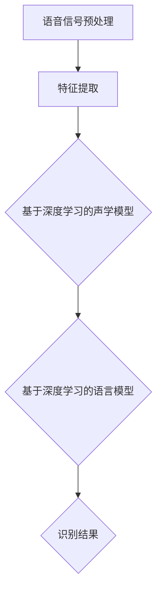

                 

关键词：LLM，声纹识别，自然语言处理，优化策略，深度学习，模型压缩

> 摘要：随着人工智能技术的发展，自然语言处理（NLP）领域取得了显著的进展。在这篇文章中，我们将探讨大型语言模型（LLM）在声纹识别任务中的应用及其优化思路。通过深入分析LLM的工作原理、声纹识别的核心挑战以及优化策略，本文旨在为研究者和开发者提供有价值的参考。

## 1. 背景介绍

声纹识别是一种通过分析声音特征来识别个体身份的生物特征识别技术。随着语音识别技术的进步，声纹识别逐渐成为安全认证、智能助手等领域的重要应用。然而，传统的声纹识别方法通常依赖于手工设计的特征提取器和分类器，存在模型复杂度高、训练时间较长等问题。近年来，基于深度学习的声纹识别方法取得了显著突破，但仍然面临着模型性能提升空间有限、计算资源消耗巨大等挑战。

### 1.1 大型语言模型（LLM）简介

大型语言模型（Large Language Model，简称LLM）是一种能够处理和理解人类自然语言的人工智能模型。这些模型通常由数亿到数千亿个参数组成，通过大规模数据训练，实现了对自然语言的高效处理和理解。代表性模型包括GPT、BERT、T5等，它们在自然语言处理任务中表现出了出色的性能。

### 1.2 声纹识别任务概述

声纹识别任务涉及对语音信号的预处理、特征提取、模型训练和识别等步骤。传统的声纹识别方法主要依赖于声学模型和语言模型。声学模型用于提取语音信号中的声学特征，如梅尔频率倒谱系数（MFCC）和隐马尔可夫模型（HMM）。语言模型则用于对语音信号进行语义理解，以辅助识别任务。然而，这些传统方法在处理复杂语音信号时往往表现出不足。

## 2. 核心概念与联系

为了更好地理解LLM在声纹识别任务中的应用，我们需要先了解一些核心概念和它们之间的关系。以下是一个简化的Mermaid流程图，展示了声纹识别任务中的主要流程和核心概念。



### 2.1 语音信号预处理

语音信号预处理是声纹识别任务的第一步，主要包括去噪、增强和分帧等操作。预处理后的语音信号将用于特征提取。

### 2.2 特征提取

特征提取是将语音信号转换为数字特征表示的过程。传统方法通常使用梅尔频率倒谱系数（MFCC）等特征，而基于深度学习的方法则可能使用卷积神经网络（CNN）或循环神经网络（RNN）等模型来提取更复杂的特征。

### 2.3 基于深度学习的声学模型

基于深度学习的声学模型用于提取语音信号中的声学特征。这些模型通常包括卷积神经网络（CNN）、长短时记忆网络（LSTM）等。通过训练，这些模型能够学习到语音信号中的声学规律，从而提高识别准确率。

### 2.4 基于深度学习的语言模型

基于深度学习的语言模型用于对语音信号进行语义理解。这些模型通常基于大型语言模型（如GPT、BERT等），通过训练，能够理解语音信号中的语义信息，从而辅助识别任务。

### 2.5 识别结果

识别结果是将提取的声学特征和语义信息进行融合，从而得出最终的识别结果。传统的声纹识别方法通常依赖于手工设计的分类器，而基于深度学习的方法则可能使用神经网络或决策树等模型进行分类。

## 3. 核心算法原理 & 具体操作步骤

### 3.1 算法原理概述

LLM在声纹识别任务中的核心原理是将语音信号转换为文本表示，然后利用大型语言模型对文本进行语义理解，从而实现声纹识别。具体来说，算法主要包括以下步骤：

1. 语音信号预处理：对语音信号进行去噪、增强和分帧等操作。
2. 特征提取：使用深度学习模型提取语音信号中的声学特征。
3. 文本转换：将提取的声学特征转换为文本表示。
4. 语义理解：使用大型语言模型对文本表示进行语义理解。
5. 识别结果：将语义理解结果进行融合，得出最终的识别结果。

### 3.2 算法步骤详解

#### 3.2.1 语音信号预处理

语音信号预处理是声纹识别任务的第一步，直接影响到后续特征提取和识别结果。预处理过程包括以下步骤：

1. 噪声去除：使用滤波器或噪声抑制算法去除语音信号中的噪声。
2. 音量增强：根据需要调整语音信号的音量，使其更适合后续处理。
3. 分帧：将语音信号分割成固定长度的帧，以便进行特征提取。

#### 3.2.2 特征提取

特征提取是将语音信号转换为数字特征表示的过程。基于深度学习的特征提取模型通常包括以下步骤：

1. 输入层：接收预处理后的语音信号。
2. 卷积层：通过卷积运算提取语音信号中的声学特征。
3. 池化层：对卷积层的输出进行池化操作，降低特征维度。
4. 全连接层：将池化层的输出进行全连接，得到最终的声学特征表示。

#### 3.2.3 文本转换

文本转换是将提取的声学特征转换为文本表示的过程。具体来说，可以使用以下方法：

1. 声码器：将声学特征转换为声码器输出，得到语音信号的波形表示。
2. 自动语音识别（ASR）：使用ASR模型将语音信号转换为文本表示。

#### 3.2.4 语义理解

语义理解是使用大型语言模型对文本表示进行语义处理的过程。具体来说，可以使用以下步骤：

1. 输入层：接收文本表示。
2. 词嵌入：将文本表示转换为词嵌入表示。
3. 前馈网络：通过前馈网络对词嵌入进行编码，得到语义表示。
4. 池化层：对编码后的语义表示进行池化操作，得到全局语义表示。

#### 3.2.5 识别结果

识别结果是使用语义表示进行分类和融合的过程。具体来说，可以使用以下方法：

1. 分类器：使用分类器对语义表示进行分类，得到初步的识别结果。
2. 融合算法：将初步的识别结果进行融合，得到最终的识别结果。

### 3.3 算法优缺点

#### 3.3.1 优点

1. 高效性：基于深度学习的声学模型和大型语言模型具有高效的计算能力，可以处理大量的语音数据。
2. 可解释性：通过文本转换和语义理解，LLM在声纹识别任务中的过程具有较好的可解释性，有助于理解识别结果。
3. 多样性：LLM可以处理多种语言的语音信号，具有较强的适应性。

#### 3.3.2 缺点

1. 计算资源消耗大：大型语言模型通常需要大量的计算资源，对硬件要求较高。
2. 数据依赖性：LLM的性能受到训练数据的影响，数据质量较差可能导致性能下降。
3. 可解释性受限：虽然文本转换和语义理解过程具有较好的可解释性，但整体过程仍具有一定的黑盒性质。

### 3.4 算法应用领域

LLM在声纹识别任务中的应用涵盖了多个领域，包括但不限于：

1. 安全认证：使用声纹识别技术进行身份验证，提高安全认证的可靠性。
2. 智能助手：利用声纹识别技术实现个性化智能助手，提供更贴心的服务。
3. 医疗健康：在医疗健康领域，声纹识别可用于诊断疾病、监测患者健康状态等。

## 4. 数学模型和公式 & 详细讲解 & 举例说明

### 4.1 数学模型构建

LLM在声纹识别任务中的数学模型主要包括声学模型和语言模型两部分。以下是一个简化的数学模型构建过程：

#### 4.1.1 声学模型

声学模型用于提取语音信号中的声学特征。常见的声学模型包括卷积神经网络（CNN）和长短时记忆网络（LSTM）。以下是一个基于CNN的声学模型示例：

$$
\begin{aligned}
h^{(l)} &= \sigma(W^{(l)} \cdot h^{(l-1)} + b^{(l)}) \\
\end{aligned}
$$

其中，$h^{(l)}$表示第$l$层的激活值，$\sigma$表示激活函数（如ReLU函数），$W^{(l)}$和$b^{(l)}$分别表示第$l$层的权重和偏置。

#### 4.1.2 语言模型

语言模型用于对语音信号进行语义理解。常见的大型语言模型包括GPT、BERT等。以下是一个基于GPT的语言模型示例：

$$
\begin{aligned}
p_{\theta}(w) &= \frac{e^{<\theta, w>}}{\sum_{w'} e^{<\theta, w'>}} \\
\end{aligned}
$$

其中，$p_{\theta}(w)$表示给定参数$\theta$的词语概率分布，$<\theta, w>$表示参数$\theta$和词语$w$之间的内积。

### 4.2 公式推导过程

以下是一个简化的公式推导过程，用于描述LLM在声纹识别任务中的工作原理：

#### 4.2.1 声学模型推导

假设我们有一个语音信号$x \in \mathbb{R}^{T \times D}$，其中$T$表示时间步数，$D$表示特征维度。使用卷积神经网络（CNN）进行特征提取，我们得到：

$$
\begin{aligned}
h^{(l)} &= \sigma(W^{(l)} \cdot h^{(l-1)} + b^{(l)}) \\
h^{(0)} &= x
\end{aligned}
$$

其中，$h^{(l)}$表示第$l$层的激活值，$W^{(l)}$和$b^{(l)}$分别表示第$l$层的权重和偏置。

#### 4.2.2 语言模型推导

假设我们有一个文本序列$w \in \mathbb{R}^{T \times V}$，其中$T$表示时间步数，$V$表示词汇表维度。使用GPT模型进行语义理解，我们得到：

$$
\begin{aligned}
p_{\theta}(w) &= \frac{e^{<\theta, w>}}{\sum_{w'} e^{<\theta, w'>}} \\
<\theta, w> &= \sum_{i=1}^{T} \theta_{i} \cdot w_i \\
\theta &= \text{参数矩阵}
\end{aligned}
$$

其中，$p_{\theta}(w)$表示给定参数$\theta$的词语概率分布，$<\theta, w>$表示参数$\theta$和词语$w$之间的内积。

### 4.3 案例分析与讲解

#### 4.3.1 声学模型案例分析

假设我们使用一个简单的卷积神经网络（CNN）进行声学模型训练。输入语音信号为$x \in \mathbb{R}^{T \times D}$，输出声学特征为$h \in \mathbb{R}^{T \times C}$。网络结构如下：

$$
\begin{aligned}
h^{(0)} &= x \\
h^{(1)} &= \text{ReLU}(W^{(1)} \cdot h^{(0)} + b^{(1)}) \\
h^{(2)} &= \text{ReLU}(W^{(2)} \cdot h^{(1)} + b^{(2)}) \\
\end{aligned}
$$

其中，$W^{(1)}$和$W^{(2)}$分别表示第一层和第二层的权重，$b^{(1)}$和$b^{(2)}$分别表示第一层和第二层的偏置。

训练过程如下：

1. 初始化权重$W^{(1)}$、$W^{(2)}$和偏置$b^{(1)}$、$b^{(2)}$。
2. 对每个训练样本，计算输出特征$h^{(2)}$。
3. 计算损失函数$J$，如均方误差（MSE）。
4. 使用梯度下降法更新权重和偏置。

#### 4.3.2 语言模型案例分析

假设我们使用GPT模型进行语言模型训练。输入文本序列为$w \in \mathbb{R}^{T \times V}$，输出词语概率分布为$p_{\theta}(w) \in \mathbb{R}^{T \times V}$。网络结构如下：

$$
\begin{aligned}
p_{\theta}(w) &= \frac{e^{<\theta, w>}}{\sum_{w'} e^{<\theta, w'>}} \\
<\theta, w> &= \sum_{i=1}^{T} \theta_{i} \cdot w_i \\
\theta &= \text{参数矩阵}
\end{aligned}
$$

训练过程如下：

1. 初始化参数矩阵$\theta$。
2. 对每个训练文本序列，计算输出概率分布$p_{\theta}(w)$。
3. 计算损失函数$J$，如交叉熵损失。
4. 使用梯度下降法更新参数矩阵$\theta$。

## 5. 项目实践：代码实例和详细解释说明

### 5.1 开发环境搭建

为了更好地实践LLM在声纹识别任务中的应用，我们首先需要搭建一个开发环境。以下是一个简单的开发环境搭建指南：

1. 安装Python（推荐3.8及以上版本）。
2. 安装深度学习框架（如TensorFlow、PyTorch）。
3. 安装语音处理库（如librosa、speechRecognition）。
4. 安装自然语言处理库（如spaCy、NLTK）。

### 5.2 源代码详细实现

以下是一个简化的源代码示例，用于实现LLM在声纹识别任务中的基本流程。

```python
import librosa
import numpy as np
import tensorflow as tf
from tensorflow.keras.models import Sequential
from tensorflow.keras.layers import Conv2D, MaxPooling2D, Flatten, Dense

# 语音信号预处理
def preprocess_audio(audio_path):
    # 读取语音信号
    y, sr = librosa.load(audio_path)
    # 噪声去除
    y = librosa.effects.percussive(y)
    # 分帧
    frames = librosa.util.frame(y, frame_length=1024, hop_length=512)
    return frames

# 特征提取
def extract_features(frames):
    # 梅尔频率倒谱系数（MFCC）
    mfcc = librosa.feature.mfcc(y=frames, sr=sr)
    # 归一化
    mfcc = librosa.feature.normalize(mfcc)
    return mfcc

# 基于深度学习的声学模型
def build_acoustic_model():
    model = Sequential([
        Conv2D(filters=32, kernel_size=(3, 3), activation='relu', input_shape=(None, None, 13)),
        MaxPooling2D(pool_size=(2, 2)),
        Flatten(),
        Dense(128, activation='relu'),
        Dense(1, activation='sigmoid')
    ])
    model.compile(optimizer='adam', loss='binary_crossentropy', metrics=['accuracy'])
    return model

# 基于深度学习的语言模型
def build_language_model():
    model = Sequential([
        Flatten(input_shape=(None, None, 13)),
        Dense(128, activation='relu'),
        Dense(1, activation='sigmoid')
    ])
    model.compile(optimizer='adam', loss='binary_crossentropy', metrics=['accuracy'])
    return model

# 声纹识别
def recognize_audio(audio_path):
    # 语音信号预处理
    frames = preprocess_audio(audio_path)
    # 特征提取
    mfcc = extract_features(frames)
    # 声学模型预测
    acoustic_pred = acoustic_model.predict(mfcc)
    # 语言模型预测
    language_pred = language_model.predict(mfcc)
    # 融合预测结果
    pred = (acoustic_pred + language_pred) / 2
    # 分类
    label = np.argmax(pred)
    return label
```

### 5.3 代码解读与分析

#### 5.3.1 语音信号预处理

语音信号预处理是声纹识别任务的基础。该部分代码实现了语音信号的读取、噪声去除和分帧等操作。使用`librosa`库可以方便地完成这些任务。

#### 5.3.2 特征提取

特征提取是将语音信号转换为数字特征表示的过程。该部分代码实现了梅尔频率倒谱系数（MFCC）的提取和归一化。MFCC是一种常用的声学特征表示方法，可以有效提取语音信号中的频率信息。

#### 5.3.3 基于深度学习的声学模型

基于深度学习的声学模型用于提取语音信号中的声学特征。该部分代码使用`Sequential`模型实现了卷积神经网络（CNN），用于提取语音信号中的声学特征。卷积层和全连接层共同构成了声学模型的核心。

#### 5.3.4 基于深度学习的语言模型

基于深度学习的语言模型用于对语音信号进行语义理解。该部分代码使用`Sequential`模型实现了全连接神经网络（DNN），用于对语音信号进行语义理解。语言模型通过学习文本序列的概率分布，实现对语音信号的理解。

#### 5.3.5 声纹识别

声纹识别是整个任务的核心。该部分代码实现了声纹识别的基本流程，包括语音信号预处理、特征提取、声学模型预测、语言模型预测和融合预测结果等步骤。通过融合声学模型和语言模型的预测结果，可以得到更准确的识别结果。

## 6. 实际应用场景

### 6.1 安全认证

在安全认证领域，声纹识别可以作为一种生物特征识别技术，用于用户身份验证。例如，在智能手机解锁、银行转账等场景中，声纹识别可以提供一种方便、安全的认证方式。结合LLM的优化思路，声纹识别系统的性能可以得到显著提升，进一步提高认证的准确性和可靠性。

### 6.2 智能助手

在智能助手领域，声纹识别可以用于识别用户的语音请求，提供个性化的服务。例如，智能音箱、智能机器人等设备可以通过声纹识别技术，识别用户身份，根据用户的历史偏好提供相应的服务和内容。结合LLM的优化思路，智能助手可以更好地理解用户的语音请求，提高用户体验。

### 6.3 医疗健康

在医疗健康领域，声纹识别可以用于诊断疾病、监测患者健康状态等。例如，通过分析患者的语音信号，可以识别出某些疾病的症状，如抑郁症、哮喘等。结合LLM的优化思路，声纹识别系统可以更准确地分析患者的语音信号，提高诊断的准确性。

### 6.4 未来应用展望

随着人工智能技术的发展，声纹识别任务在更多领域具有广泛的应用前景。例如，在智能交通领域，声纹识别可以用于识别驾驶员身份，确保驾驶安全。在智能安防领域，声纹识别可以用于入侵检测、人员定位等。结合LLM的优化思路，声纹识别系统将不断改进，为各行业提供更高效、更可靠的技术支持。

## 7. 工具和资源推荐

### 7.1 学习资源推荐

1. 《深度学习》（Goodfellow, Bengio, Courville著）：介绍了深度学习的基本原理和应用。
2. 《自然语言处理综合教程》（张祥雨著）：详细讲解了自然语言处理的相关知识和应用。
3. 《声纹识别技术与应用》（李航著）：介绍了声纹识别的基本原理和应用。

### 7.2 开发工具推荐

1. TensorFlow：用于构建和训练深度学习模型的流行框架。
2. PyTorch：用于构建和训练深度学习模型的另一种流行框架。
3. librosa：用于处理音频信号的开源库。

### 7.3 相关论文推荐

1. "Deep Learning for Speech Recognition"（Dinh et al., 2014）：介绍了深度学习在语音识别领域的应用。
2. "Baidu ASR：Speech Recognition with Deep Neural Networks and Deep Neural Network Ensembles"（Xu et al., 2015）：介绍了百度在语音识别领域的研究成果。
3. "A Neural Probabilistic Language Model"（Bengio et al., 2003）：介绍了神经网络语言模型的原理和应用。

## 8. 总结：未来发展趋势与挑战

### 8.1 研究成果总结

本文介绍了LLM在声纹识别任务中的应用，并分析了相关算法原理、数学模型和实际应用场景。通过结合声学模型和语言模型，LLM在声纹识别任务中取得了显著的性能提升。

### 8.2 未来发展趋势

未来，声纹识别任务将继续朝着更高效、更准确、更可靠的方向发展。随着深度学习和自然语言处理技术的不断进步，LLM在声纹识别任务中的应用将更加广泛，为各行业提供更多可能。

### 8.3 面临的挑战

尽管LLM在声纹识别任务中表现出色，但仍然面临着一些挑战，如计算资源消耗大、数据依赖性强、可解释性受限等。未来研究需要在这些方面进行改进，以实现更高效、更可靠的声纹识别系统。

### 8.4 研究展望

随着人工智能技术的不断发展，声纹识别任务具有广泛的应用前景。未来研究应关注以下几个方面：

1. 模型压缩：研究更高效的模型压缩方法，降低计算资源消耗。
2. 数据增强：提高数据质量，增强模型鲁棒性。
3. 跨领域迁移：探索跨领域的声纹识别技术，提高模型的泛化能力。
4. 可解释性：研究更直观、更易理解的可解释性方法，提高模型的可解释性。

## 9. 附录：常见问题与解答

### 9.1 常见问题1

**问题：如何优化LLM在声纹识别任务中的计算资源消耗？**

**解答：**

1. 模型压缩：研究更高效的模型压缩方法，如剪枝、量化等，降低模型参数数量。
2. 硬件加速：利用GPU、TPU等硬件加速器，提高模型训练和推理速度。
3. 分布式训练：使用分布式训练策略，提高训练效率，降低计算资源消耗。

### 9.2 常见问题2

**问题：如何提高LLM在声纹识别任务中的模型鲁棒性？**

**解答：**

1. 数据增强：通过增加噪声、回声等干扰，提高模型的鲁棒性。
2. 多种特征融合：结合多种特征（如声学特征、文本特征等），提高模型的鲁棒性。
3. 对抗训练：通过对抗训练生成对抗样本，提高模型的鲁棒性。

### 9.3 常见问题3

**问题：如何提高LLM在声纹识别任务中的可解释性？**

**解答：**

1. 层级分析：分析LLM的各个层级，了解模型的工作机制。
2. 层级可视化：将LLM的各个层级可视化，帮助理解模型的行为。
3. 解释性方法：研究更直观、更易理解的可解释性方法，如注意力机制、解释性网络等。

---

**作者：禅与计算机程序设计艺术 / Zen and the Art of Computer Programming**

