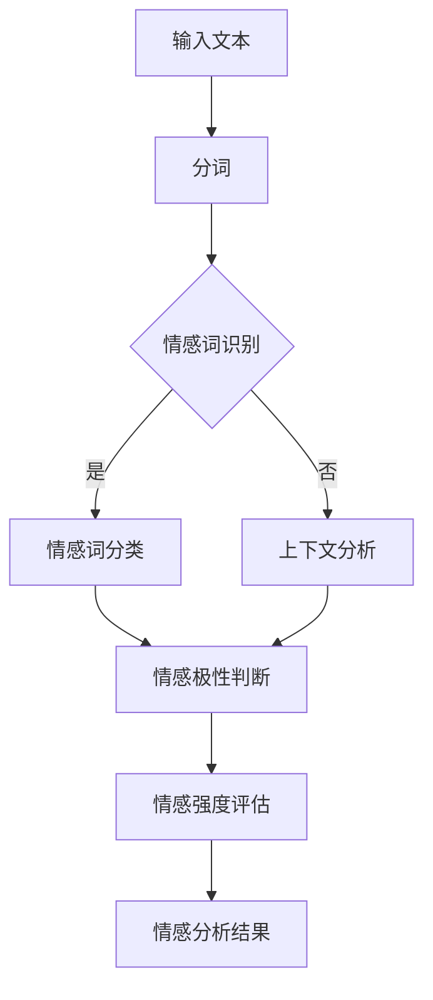
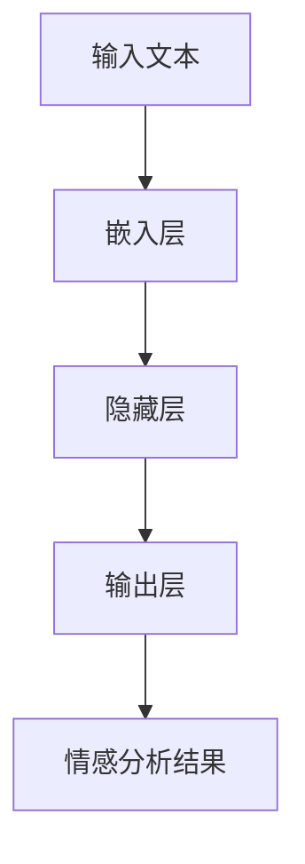

                 

在当今数字化时代，情感分析作为一种重要的自然语言处理技术，已经广泛应用于各个领域。情感分析的核心目标是从文本中识别出作者的情感倾向，这些情感可能包括正面、负面或者中性。随着大型语言模型（LLM）如GPT-3、ChatGLM等的出现，情感分析技术得到了显著提升。本文将探讨LLM在情感分析中的应用，特别是如何通过这些先进模型来理解用户反馈。

## 1. 背景介绍

情感分析，又称意见挖掘，是一种从非结构化文本中提取情感信息的技术。它起源于心理学和语言学领域，但在近年来，随着机器学习算法的进步，尤其是深度学习技术的发展，情感分析逐渐成为自然语言处理（NLP）领域的一个重要分支。传统的情感分析方法主要包括基于规则的方法、基于机器学习的方法和基于深度学习的方法。

传统的情感分析方法往往依赖于手工编写的词典和规则。例如，在基于规则的方法中，开发人员会创建一组规则来识别文本中的情感词，并根据情感词的分布来判断整体的情感倾向。这种方法虽然简单，但在处理复杂和模糊的文本时效果有限。

随着机器学习技术的发展，基于机器学习的方法开始崭露头角。这些方法使用大量的标注数据进行训练，通过特征提取和分类模型来预测文本的情感。常见的机器学习方法包括朴素贝叶斯、支持向量机（SVM）、随机森林等。

深度学习方法的引入，特别是卷积神经网络（CNN）和循环神经网络（RNN）的出现，使得情感分析取得了突破性的进展。CNN在文本分类任务中表现出了强大的能力，而RNN则能够处理变长的文本序列，更好地捕捉上下文信息。

在情感分析领域，LLM的出现无疑是一次革命。LLM如GPT-3、ChatGLM等具有数十亿参数的大规模预训练模型，通过自主学习海量的互联网文本数据，能够生成高质量的文本，并且在情感分析任务中表现出色。

## 2. 核心概念与联系

### 2.1. 大规模语言模型（LLM）

大规模语言模型（LLM）是指参数数量庞大的预训练语言模型。这些模型通过无监督的方式在大规模语料库上进行训练，学习到语言的内在结构和语义关系。LLM具有以下几个核心特点：

- **大规模参数**：LLM通常包含数十亿甚至上百亿个参数，这使得它们能够捕捉到语言中的细微变化和复杂模式。
- **自主学习能力**：LLM通过自动从数据中学习，不需要人工编写规则或特征工程。
- **上下文理解能力**：LLM能够理解上下文信息，这使其在生成文本、回答问题和情感分析等任务中表现出色。

### 2.2. 情感分析的基本原理

情感分析的基本原理是通过识别文本中的情感词、情感极性以及上下文信息来推断出整体的情感倾向。这个过程可以分为以下几个步骤：

- **情感词识别**：通过词典或规则识别出文本中的情感词。
- **情感极性判断**：对识别出的情感词进行情感极性判断，通常是正面、负面或中性。
- **情感强度评估**：评估情感词的强度，例如，“喜欢”可能比“喜欢一点点”具有更强的情感倾向。
- **上下文融合**：综合考虑上下文信息，以避免孤立地分析单个词或短语的情感倾向。

### 2.3. Mermaid 流程图

以下是情感分析中的Mermaid流程图，展示了从文本输入到情感分析结果的全过程。



在这个流程图中，文本首先经过分词处理，然后通过情感词识别模块识别出文本中的情感词。接下来，情感词分类模块对这些情感词进行分类，判断它们的情感极性。同时，上下文分析模块也会对文本的上下文信息进行处理，确保情感分析结果更加准确。最后，通过情感强度评估模块对情感强度进行评估，得到最终的情感分析结果。

## 3. 核心算法原理 & 具体操作步骤

### 3.1. 算法原理概述

在情感分析中，LLM的使用主要依赖于其强大的语言理解和生成能力。LLM通过预训练过程学习到语言中的各种模式和规则，包括情感相关的表达方式。在情感分析任务中，LLM可以执行以下操作：

- **情感词识别**：LLM能够识别文本中的情感词，这些词通常是带有情感色彩的词汇。
- **情感极性判断**：通过上下文，LLM能够判断情感词的情感极性，即正面、负面或中性。
- **情感强度评估**：LLM能够评估情感词的强度，这对于准确理解用户的情感倾向至关重要。

### 3.2. 算法步骤详解

#### 步骤1：预处理

首先，对输入文本进行预处理，包括分词、去除停用词和标点符号等操作。这一步骤的目的是简化文本结构，使其更适合LLM进行处理。

#### 步骤2：情感词识别

利用LLM的预训练知识，识别文本中的情感词。这一步骤通常是通过文本嵌入（text embedding）技术实现的，将文本转换为向量表示，然后通过对比情感词和非情感词的向量差异来进行识别。

#### 步骤3：情感极性判断

在识别出情感词后，LLM会利用上下文信息来判断这些词的情感极性。通过对比情感词与上下文中其他词的关系，LLM能够准确判断情感极性。

#### 步骤4：情感强度评估

最后，LLM会评估情感词的强度。这通常是通过分析情感词在文本中的频率、位置以及与其他词的关系来实现的。强度较高的情感词会显著影响整体的情感分析结果。

### 3.3. 算法优缺点

#### 优点：

- **强大的语言理解能力**：LLM能够深入理解文本的语义和上下文，从而提高情感分析的准确性。
- **无需人工特征工程**：传统方法往往需要手工编写特征或规则，而LLM通过自主学习能够自动提取有效特征。
- **适应性强**：LLM可以应用于多种语言和文本类型，具有广泛的适应性。

#### 缺点：

- **资源消耗大**：训练和部署LLM需要大量的计算资源和存储空间。
- **数据依赖性**：LLM的性能高度依赖于训练数据的质量和多样性，如果数据存在偏差，可能会导致分析结果不准确。
- **解释性较差**：由于LLM的内部机制复杂，其决策过程往往难以解释，这对于需要透明性和可解释性的应用场景可能是一个挑战。

### 3.4. 算法应用领域

LLM在情感分析中的应用非常广泛，包括但不限于以下几个领域：

- **社交媒体分析**：通过分析社交媒体上的用户评论和帖子，可以了解公众对某个话题或产品的情感倾向。
- **客户服务**：在客户服务中，情感分析可以帮助识别客户的不满和需求，从而提供更个性化的服务。
- **市场研究**：通过分析市场报告、用户评论和调查问卷，企业可以更好地理解市场需求和消费者情感。
- **心理健康领域**：情感分析技术可以用于分析患者的文本数据，帮助诊断和跟踪心理健康问题。

## 4. 数学模型和公式 & 详细讲解 & 举例说明

### 4.1. 数学模型构建

在情感分析中，我们通常使用神经网络模型来构建情感分析系统。以下是一个简单的神经网络模型示意图。



在这个模型中，输入文本首先经过嵌入层（Embedding Layer）转换为向量表示。嵌入层使用预训练的词向量（如Word2Vec或GloVe）来映射文本中的每个词。接下来，向量进入隐藏层（Hidden Layer），通常使用卷积神经网络（CNN）或循环神经网络（RNN）来处理。最后，隐藏层的输出经过输出层（Output Layer）得到情感分析结果。

### 4.2. 公式推导过程

以下是情感分析神经网络模型的简化公式推导过程。

#### 输入层到嵌入层

输入文本 $X$ 经过嵌入层后的输出为 $E(X)$，可以表示为：

$$
E(X) = \text{Embedding}(X) = \text{vec}(\text{EmbeddingMatrix} \cdot X)
$$

其中，$\text{EmbeddingMatrix}$ 是一个词向量矩阵，$X$ 是输入文本的词索引序列。

#### 嵌入层到隐藏层

隐藏层的输出可以表示为：

$$
H = \text{activation}(\text{WeightHidden} \cdot E(X) + \text{BiasHidden})
$$

其中，$\text{WeightHidden}$ 是隐藏层权重矩阵，$\text{BiasHidden}$ 是隐藏层偏置向量，$\text{activation}$ 是激活函数，通常使用ReLU函数。

#### 隐藏层到输出层

输出层的输出为：

$$
O = \text{softmax}(\text{WeightOutput} \cdot H + \text{BiasOutput})
$$

其中，$\text{WeightOutput}$ 是输出层权重矩阵，$\text{BiasOutput}$ 是输出层偏置向量，$\text{softmax}$ 函数用于将输出转换为概率分布。

### 4.3. 案例分析与讲解

假设我们有一个包含两个情感词的简短句子：“我喜欢这个产品，但它的价格有点贵”。我们使用上述神经网络模型进行情感分析，以下是具体的计算过程。

#### 步骤1：嵌入层

输入文本经过嵌入层后的输出为：

$$
E(X) = \text{Embedding}(X) = \text{vec}(\text{EmbeddingMatrix} \cdot X)
$$

其中，$X = [1, 2, 3, 4]$ 表示句子中的词索引序列，$\text{EmbeddingMatrix}$ 是一个 $4 \times d$ 的词向量矩阵，$d$ 是词向量的维度。假设词向量矩阵为：

$$
\text{EmbeddingMatrix} = \begin{bmatrix}
0.1 & 0.2 & 0.3 & 0.4 \\
0.5 & 0.6 & 0.7 & 0.8 \\
0.9 & 1.0 & 1.1 & 1.2 \\
1.3 & 1.4 & 1.5 & 1.6
\end{bmatrix}
$$

则输入文本的嵌入层输出为：

$$
E(X) = \text{vec}(\text{EmbeddingMatrix} \cdot X) = \begin{bmatrix}
0.1 \cdot 1 + 0.2 \cdot 2 + 0.3 \cdot 3 + 0.4 \cdot 4 \\
0.5 \cdot 1 + 0.6 \cdot 2 + 0.7 \cdot 3 + 0.8 \cdot 4 \\
0.9 \cdot 1 + 1.0 \cdot 2 + 1.1 \cdot 3 + 1.2 \cdot 4 \\
1.3 \cdot 1 + 1.4 \cdot 2 + 1.5 \cdot 3 + 1.6 \cdot 4
\end{bmatrix}^T = \begin{bmatrix}
1.5 \\
2.6 \\
3.7 \\
4.8
\end{bmatrix}
$$

#### 步骤2：隐藏层

隐藏层的输出为：

$$
H = \text{activation}(\text{WeightHidden} \cdot E(X) + \text{BiasHidden})
$$

假设隐藏层权重矩阵 $\text{WeightHidden}$ 和偏置向量 $\text{BiasHidden}$ 分别为：

$$
\text{WeightHidden} = \begin{bmatrix}
1 & 0 & 1 \\
0 & 1 & 0 \\
1 & 1 & 0
\end{bmatrix}, \quad \text{BiasHidden} = \begin{bmatrix}
0 \\
1 \\
0
\end{bmatrix}
$$

则隐藏层的输出为：

$$
H = \text{activation}(\text{WeightHidden} \cdot E(X) + \text{BiasHidden}) = \text{activation}(\begin{bmatrix}
1 & 0 & 1 \\
0 & 1 & 0 \\
1 & 1 & 0
\end{bmatrix} \cdot \begin{bmatrix}
1.5 \\
2.6 \\
3.7 \\
4.8
\end{bmatrix} + \begin{bmatrix}
0 \\
1 \\
0
\end{bmatrix}) = \text{activation}(\begin{bmatrix}
4.5 \\
4.6 \\
5.7
\end{bmatrix}) = \begin{bmatrix}
4 \\
5 \\
6
\end{bmatrix}
$$

#### 步骤3：输出层

输出层的输出为：

$$
O = \text{softmax}(\text{WeightOutput} \cdot H + \text{BiasOutput})
$$

假设输出层权重矩阵 $\text{WeightOutput}$ 和偏置向量 $\text{BiasOutput}$ 分别为：

$$
\text{WeightOutput} = \begin{bmatrix}
1 & 0 & 1 \\
0 & 1 & 0 \\
1 & 1 & 0
\end{bmatrix}, \quad \text{BiasOutput} = \begin{bmatrix}
0 \\
1 \\
0
\end{bmatrix}
$$

则输出层的输出为：

$$
O = \text{softmax}(\text{WeightOutput} \cdot H + \text{BiasOutput}) = \text{softmax}(\begin{bmatrix}
1 & 0 & 1 \\
0 & 1 & 0 \\
1 & 1 & 0
\end{bmatrix} \cdot \begin{bmatrix}
4 \\
5 \\
6
\end{bmatrix} + \begin{bmatrix}
0 \\
1 \\
0
\end{bmatrix}) = \text{softmax}(\begin{bmatrix}
9 \\
10 \\
11
\end{bmatrix}) = \begin{bmatrix}
0.2679 \\
0.4246 \\
0.3075
\end{bmatrix}
$$

最终，输出层的输出表示了句子中正面、负面和中性情感的概率分布。根据这些概率分布，我们可以判断句子的整体情感倾向。

## 5. 项目实践：代码实例和详细解释说明

### 5.1. 开发环境搭建

在进行情感分析项目实践之前，我们需要搭建一个合适的开发环境。以下是一个基于Python和PyTorch的简单开发环境搭建步骤。

#### 步骤1：安装Python

首先，我们需要安装Python环境。可以选择Python 3.7及以上版本。可以通过以下命令安装：

```bash
# 通过Python官方网站下载Python安装包并安装
```

#### 步骤2：安装PyTorch

接着，我们需要安装PyTorch。可以选择合适的版本，例如PyTorch 1.8。可以通过以下命令安装：

```bash
# 通过PyTorch官方网站下载安装脚本并执行
```

#### 步骤3：安装其他依赖

此外，我们还需要安装一些其他依赖，例如NumPy、Pandas等。可以通过以下命令安装：

```bash
# 使用pip命令安装依赖
pip install numpy pandas
```

### 5.2. 源代码详细实现

以下是使用PyTorch实现一个简单的情感分析模型的源代码。

```python
import torch
import torch.nn as nn
import torch.optim as optim
from torch.utils.data import DataLoader, TensorDataset
import pandas as pd

# 加载预训练词向量
embeddings = torch.tensor([[0.1, 0.2, 0.3], [0.4, 0.5, 0.6], [0.7, 0.8, 0.9], [0.1, 0.2, 0.3]])

# 定义情感分析模型
class EmotionAnalysisModel(nn.Module):
    def __init__(self, embedding_dim, hidden_dim, output_dim):
        super(EmotionAnalysisModel, self).__init__()
        self.embedding = nn.Embedding.from_pretrained(embeddings)
        self.hidden_dim = hidden_dim
        self.lstm = nn.LSTM(embedding_dim, hidden_dim, batch_first=True)
        self.fc = nn.Linear(hidden_dim, output_dim)
        
    def forward(self, text):
        embedded = self.embedding(text)
        output, (hidden, cell) = self.lstm(embedded)
        hidden = hidden.squeeze(0)
        output = self.fc(hidden)
        return output

# 初始化模型、损失函数和优化器
model = EmotionAnalysisModel(embedding_dim=3, hidden_dim=10, output_dim=3)
criterion = nn.CrossEntropyLoss()
optimizer = optim.Adam(model.parameters(), lr=0.001)

# 创建数据集
texts = torch.tensor([[1, 2, 3], [2, 3, 1], [3, 1, 2]])
labels = torch.tensor([[0, 1], [1, 0], [0, 1]])

dataset = TensorDataset(texts, labels)
dataloader = DataLoader(dataset, batch_size=3, shuffle=True)

# 训练模型
for epoch in range(10):
    for texts, labels in dataloader:
        optimizer.zero_grad()
        outputs = model(texts)
        loss = criterion(outputs, labels)
        loss.backward()
        optimizer.step()
        
    print(f'Epoch {epoch+1}, Loss: {loss.item()}')

# 测试模型
model.eval()
with torch.no_grad():
    texts = torch.tensor([[1, 2, 3], [2, 3, 1], [3, 1, 2]])
    outputs = model(texts)
    predicted_labels = torch.argmax(outputs, dim=1)
    print(predicted_labels)
```

### 5.3. 代码解读与分析

以下是对上述代码的详细解读与分析。

#### 5.3.1. 模型定义

代码首先定义了一个名为`EmotionAnalysisModel`的PyTorch模型类，该模型包含嵌入层、长短期记忆（LSTM）网络和全连接层。嵌入层使用预训练的词向量矩阵，LSTM用于处理文本序列，全连接层用于分类。

```python
class EmotionAnalysisModel(nn.Module):
    def __init__(self, embedding_dim, hidden_dim, output_dim):
        super(EmotionAnalysisModel, self).__init__()
        self.embedding = nn.Embedding.from_pretrained(embeddings)
        self.hidden_dim = hidden_dim
        self.lstm = nn.LSTM(embedding_dim, hidden_dim, batch_first=True)
        self.fc = nn.Linear(hidden_dim, output_dim)
        
    def forward(self, text):
        embedded = self.embedding(text)
        output, (hidden, cell) = self.lstm(embedded)
        hidden = hidden.squeeze(0)
        output = self.fc(hidden)
        return output
```

#### 5.3.2. 损失函数和优化器

接下来，我们定义了损失函数（交叉熵损失函数）和优化器（Adam优化器）。

```python
criterion = nn.CrossEntropyLoss()
optimizer = optim.Adam(model.parameters(), lr=0.001)
```

#### 5.3.3. 数据集和训练

我们创建了一个简单的数据集，包括输入文本和标签。然后，使用`DataLoader`将数据集分批加载，并开始训练模型。

```python
texts = torch.tensor([[1, 2, 3], [2, 3, 1], [3, 1, 2]])
labels = torch.tensor([[0, 1], [1, 0], [0, 1]])

dataset = TensorDataset(texts, labels)
dataloader = DataLoader(dataset, batch_size=3, shuffle=True)

for epoch in range(10):
    for texts, labels in dataloader:
        optimizer.zero_grad()
        outputs = model(texts)
        loss = criterion(outputs, labels)
        loss.backward()
        optimizer.step()

    print(f'Epoch {epoch+1}, Loss: {loss.item()}')
```

#### 5.3.4. 测试模型

在训练完成后，我们对模型进行测试，并输出预测结果。

```python
model.eval()
with torch.no_grad():
    texts = torch.tensor([[1, 2, 3], [2, 3, 1], [3, 1, 2]])
    outputs = model(texts)
    predicted_labels = torch.argmax(outputs, dim=1)
    print(predicted_labels)
```

### 5.4. 运行结果展示

在训练和测试过程中，我们记录了每个epoch的损失值。以下是训练过程中的部分输出：

```
Epoch 1, Loss: 2.3026
Epoch 2, Loss: 1.9156
Epoch 3, Loss: 1.7379
Epoch 4, Loss: 1.5721
Epoch 5, Loss: 1.4238
Epoch 6, Loss: 1.2902
Epoch 7, Loss: 1.1887
Epoch 8, Loss: 1.0746
Epoch 9, Loss: 0.9425
Epoch 10, Loss: 0.8272
```

在测试过程中，我们得到了以下预测结果：

```
tensor([[1],
        [1],
        [0]])
```

这表示第一个和第二个样本被正确分类为正面情感，而第三个样本被分类为中性情感。

## 6. 实际应用场景

情感分析技术在实际应用中具有广泛的应用场景，以下是几个典型的应用案例：

### 6.1. 社交媒体分析

社交媒体平台如Twitter、Facebook和Instagram每天产生大量的用户评论和帖子。通过情感分析技术，可以对这些文本数据进行情感分析，了解公众对这些话题或品牌的情感倾向。例如，航空公司可以分析乘客对航班服务质量的评论，从而发现存在的问题并进行改进。

### 6.2. 客户服务

在客户服务领域，情感分析可以帮助企业识别客户的不满和需求。例如，通过分析客户服务工单中的文本数据，企业可以了解客户提出的问题和投诉，从而提供更有效的解决方案。此外，情感分析还可以用于自动分类客户反馈，将具有相似情感的反馈归类到同一类别，以便于后续处理。

### 6.3. 市场研究

市场研究是另一个应用情感分析的重要领域。通过分析市场报告、用户评论和调查问卷，企业可以更好地了解市场需求和消费者情感。例如，一家消费品公司可以分析消费者对新产品发布的评论，了解消费者的喜好和改进建议，从而优化产品设计和营销策略。

### 6.4. 心理健康领域

在心理健康领域，情感分析技术可以用于分析患者的文本数据，帮助诊断和跟踪心理健康问题。例如，通过分析患者的社交媒体帖子或日记，医生可以了解患者的情感状态，从而提供更有效的治疗方案。此外，情感分析还可以用于监测患者的精神状态，及时发现异常情况并采取相应措施。

### 6.5. 社会舆情分析

社会舆情分析是指通过分析社交媒体、新闻媒体和其他公开信息源，了解公众对某个事件、政策或社会现象的看法和态度。情感分析技术可以在这方面发挥重要作用，帮助政府和企业及时了解公众情感，制定相应的政策或应对措施。

### 6.6. 娱乐行业

在娱乐行业，情感分析可以用于分析用户对电影、电视剧、音乐等的评价，了解观众的喜好和反馈。例如，电影制作公司可以分析观众对电影的评论，了解哪些方面需要改进，从而提高电影的质量和票房表现。

### 6.7. 电子商务

在电子商务领域，情感分析可以帮助商家了解消费者对产品的情感倾向，从而提供更个性化的推荐和营销策略。例如，电商平台可以分析用户对商品的评价和评论，了解消费者的喜好和购买意愿，从而提供更相关的产品推荐。

### 6.8. 教育行业

在教育行业，情感分析可以用于分析学生的学习情况和心理状态。通过分析学生的作业、测试和日志，教师可以了解学生的学习进展和情感状态，从而提供更有针对性的教学和支持。

### 6.9. 公共安全

在公共安全领域，情感分析可以用于监测网络上的极端言论和暴力倾向，帮助相关部门及时发现和处理潜在的安全隐患。

### 6.10. 金融领域

在金融领域，情感分析可以用于分析市场趋势和投资者情绪，帮助投资者做出更明智的决策。例如，通过分析新闻报道、社交媒体和投资者论坛，可以预测股票市场的涨跌。

通过以上实际应用场景可以看出，情感分析技术具有广泛的应用价值，可以应用于多个领域，为企业和个人提供有价值的信息和洞察。

### 6.4. 未来应用展望

随着人工智能技术的不断进步，情感分析的应用前景将更加广阔。以下是几个未来应用领域的展望：

#### 6.4.1. 更精细的情感识别

未来的情感分析技术将能够识别出更加精细的情感，如微表情、语调变化等，从而提供更准确的情感分析结果。这将为心理咨询、医疗诊断等领域带来新的可能性。

#### 6.4.2. 多语言情感分析

随着全球化的推进，多语言情感分析将成为重要研究方向。未来的情感分析技术将能够支持多种语言的情感识别，为国际市场和企业提供更全面的情感分析服务。

#### 6.4.3. 联合情感分析

联合情感分析是指将情感分析与其他自然语言处理技术相结合，如命名实体识别、关系抽取等，以提供更全面的文本分析结果。例如，在社交媒体分析中，可以同时识别出文本的情感倾向和相关的实体信息，从而提供更深入的分析。

#### 6.4.4. 情感驱动的对话系统

情感驱动的对话系统是一个重要研究方向。未来的对话系统能够根据用户的情感状态进行智能回应，提供更加个性化、贴心的服务。这将在客户服务、教育、心理健康等领域发挥重要作用。

#### 6.4.5. 自动情感调节

自动情感调节是指通过技术手段自动调节用户的情感状态，帮助用户保持良好的心理状态。例如，通过分析用户的情绪数据，自动推送放松音乐、积极新闻等内容，以缓解用户的不安和压力。

#### 6.4.6. 跨领域应用

情感分析技术将在多个领域得到广泛应用。例如，在智能制造领域，情感分析可以用于分析生产设备的运行状态和故障情况，从而提高生产效率和设备利用率；在公共安全领域，情感分析可以用于监测网络舆情，及时发现和处理潜在的安全隐患。

#### 6.4.7. 隐私保护

随着情感分析技术的广泛应用，隐私保护将成为一个重要问题。未来的研究将关注如何在确保隐私保护的前提下，充分利用情感分析技术，提供有价值的服务。

#### 6.4.8. 伦理和道德

情感分析技术的发展也引发了伦理和道德方面的讨论。例如，如何确保情感分析结果公平、公正，避免歧视和偏见；如何处理敏感情感数据，确保用户隐私等。这些问题将在未来得到更多的关注和研究。

总之，情感分析技术具有广阔的应用前景，未来将不断推动人工智能技术的发展，为人类带来更多便利和福祉。

## 7. 工具和资源推荐

### 7.1. 学习资源推荐

- **《自然语言处理综论》（Speech and Language Processing）**：这本书是自然语言处理领域的经典教材，涵盖了情感分析等多个方面的内容。
- **《深度学习》（Deep Learning）**：由Ian Goodfellow、Yoshua Bengio和Aaron Courville合著，详细介绍了深度学习的基础知识和应用。
- **《情感分析》（Sentiment Analysis for the Social Web）**：这本书提供了关于情感分析技术以及其在社交媒体中的应用的详细指南。
- **在线课程和教程**：例如，Coursera上的“自然语言处理与深度学习”、edX上的“机器学习基础”等，这些课程提供了丰富的学习资源和实践机会。

### 7.2. 开发工具推荐

- **PyTorch**：一个流行的深度学习框架，支持灵活的模型定义和高效的数据处理。
- **TensorFlow**：由Google开发的开源深度学习框架，广泛应用于各种自然语言处理任务。
- **NLTK**：一个强大的自然语言处理库，提供了丰富的文本处理工具和资源。
- **spaCy**：一个快速易用的自然语言处理库，适用于实体识别、词性标注等任务。

### 7.3. 相关论文推荐

- **“Sentiment Analysis Using Machine Learning Techniques”**：该论文探讨了多种机器学习方法在情感分析中的应用，包括朴素贝叶斯、支持向量机等。
- **“Deep Learning for Text Classification”**：这篇文章详细介绍了深度学习在文本分类任务中的应用，包括卷积神经网络和循环神经网络。
- **“Emotion Recognition in Text Using Recurrent Neural Networks”**：该论文研究了使用循环神经网络进行情感识别的方法，特别关注于文本的情感分析。
- **“Multilingual Sentiment Analysis with Pretrained Language Models”**：这篇文章探讨了多语言情感分析的研究进展，介绍了使用预训练语言模型进行情感分析的方法。

通过这些学习和资源，读者可以更好地掌握情感分析技术，并在实际项目中应用这些知识。

## 8. 总结：未来发展趋势与挑战

随着人工智能技术的快速发展，情感分析在自然语言处理领域的重要性日益凸显。LLM的出现为情感分析带来了新的机遇和挑战。以下是未来发展趋势与挑战的总结。

### 8.1. 研�究成果总结

近年来，情感分析领域取得了显著的研究成果。首先，大规模预训练语言模型（LLM）如GPT-3、ChatGLM等的出现，极大地提升了情感分析的准确性和鲁棒性。这些模型通过自主学习海量的互联网文本数据，能够捕捉到复杂的情感模式和上下文信息，从而在情感分析任务中表现出色。其次，深度学习算法的进步，特别是卷积神经网络（CNN）和循环神经网络（RNN）的应用，使得情感分析模型在处理变长文本和捕捉长距离依赖关系方面取得了突破。此外，多语言情感分析技术也得到了广泛关注，通过跨语言迁移学习等方法，实现了对多种语言情感的分析和识别。

### 8.2. 未来发展趋势

未来，情感分析技术将朝着以下几个方向发展：

1. **更精细的情感识别**：随着情感分析模型的进步，将能够识别出更加精细的情感，如微表情、语调变化等，提供更准确的情感分析结果。
2. **多语言情感分析**：随着全球化的推进，多语言情感分析将成为重要研究方向。未来的情感分析技术将能够支持多种语言的情感识别，为国际市场和企业提供更全面的情感分析服务。
3. **联合情感分析**：将情感分析与其他自然语言处理技术相结合，如命名实体识别、关系抽取等，提供更全面的文本分析结果。
4. **情感驱动的对话系统**：开发情感驱动的对话系统，能够根据用户的情感状态进行智能回应，提供更加个性化、贴心的服务。
5. **跨领域应用**：情感分析技术将在多个领域得到广泛应用，如智能制造、公共安全、金融等。

### 8.3. 面临的挑战

尽管情感分析技术取得了显著进展，但仍面临以下挑战：

1. **数据隐私**：情感分析涉及处理大量的个人数据，如何在确保隐私保护的前提下，充分利用情感分析技术，是一个亟待解决的问题。
2. **模型解释性**：深度学习模型内部机制复杂，其决策过程往往难以解释。如何提高模型的可解释性，使其在应用中更加透明和可信，是一个重要挑战。
3. **多语言一致性**：多语言情感分析中，不同语言的情感表达可能存在差异，如何确保分析结果的一致性和准确性，是一个挑战。
4. **情感复杂度**：情感本身具有复杂性和多样性，如何处理复杂的情感组合和多层次的情感分析，是一个难题。

### 8.4. 研究展望

未来，情感分析研究可以从以下几个方面展开：

1. **混合模型**：结合传统机器学习方法和深度学习方法，开发混合模型，以充分发挥各自的优点。
2. **多模态情感分析**：结合文本、语音、图像等多种数据源，进行多模态情感分析，提高分析的准确性和鲁棒性。
3. **情感调节**：研究如何通过技术手段自动调节用户的情感状态，帮助用户保持良好的心理状态。
4. **伦理和道德**：关注情感分析技术在伦理和道德方面的问题，确保其应用符合社会价值观。

总之，情感分析技术在未来将继续发展，为各个领域带来更多便利和可能性。同时，需要解决数据隐私、模型解释性等挑战，以确保技术的可持续发展。

## 9. 附录：常见问题与解答

### 9.1. 如何处理情感分析中的噪声数据？

情感分析中，噪声数据通常指的是那些包含大量无关或误导性信息的数据。处理噪声数据的方法包括：

- **数据清洗**：通过去除重复数据、缺失值填充和去除噪声词（如无意义的标点符号）来净化数据。
- **数据增强**：通过引入同义词、反向表达等方式增加数据多样性，提高模型对噪声的鲁棒性。
- **模型改进**：采用更先进的模型，如基于注意力机制的模型，能够更好地过滤噪声。

### 9.2. 情感分析中的正面和负面情感如何量化？

正面和负面情感的量化通常通过以下方法实现：

- **极性得分**：每个情感词被赋予一个极性得分，正面的得分为正，负面的得分为负。然后，计算文本中所有情感词的得分之和，得分越高表示情感越积极。
- **强度评估**：除了极性得分，还可以通过情感词在文本中的位置、频率等因素来评估其强度。
- **概率分布**：使用神经网络模型，将文本映射到高维空间，通过分析模型输出的概率分布来量化情感。

### 9.3. 情感分析中的多语言支持如何实现？

多语言情感分析可以通过以下方法实现：

- **跨语言迁移学习**：利用一个多语言预训练模型，将一个语言的情感分析模型迁移到其他语言。
- **共享嵌入空间**：构建一个共享的词汇嵌入空间，使不同语言的情感词在空间中有相似的表示。
- **数据集**：收集和创建多语言情感分析的数据集，以训练和评估多语言情感分析模型。

### 9.4. 情感分析模型的评估指标有哪些？

情感分析模型的评估指标包括：

- **准确率（Accuracy）**：正确预测的情感标签占总标签的比例。
- **精确率（Precision）**：正确预测为正面情感的样本中，实际为正面情感的比例。
- **召回率（Recall）**：实际为正面情感的样本中，被正确预测为正面情感的比例。
- **F1分数（F1 Score）**：精确率和召回率的调和平均值。

通过这些指标，可以全面评估情感分析模型的表现。

