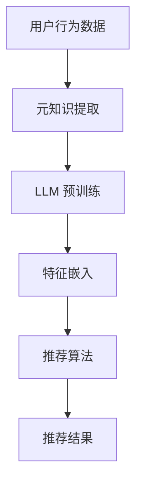

                 

关键词：推荐系统、元知识学习、自然语言处理、大型语言模型（LLM）、协同过滤、内容推荐

> 摘要：本文深入探讨了大型语言模型（LLM）在推荐系统中的元知识学习应用。通过分析LLM的优势及其在推荐系统中的潜在应用场景，本文提出了元知识学习的框架和方法，并详细阐述了其在协同过滤和内容推荐中的具体应用。本文旨在为研究者提供一种新的视角，以推动推荐系统的发展。

## 1. 背景介绍

随着互联网的飞速发展和信息的爆炸式增长，推荐系统成为了现代信息检索和个性化服务的重要手段。推荐系统旨在根据用户的兴趣和行为，为他们推荐感兴趣的内容。传统的推荐系统主要采用协同过滤和内容推荐两种方法。

协同过滤（Collaborative Filtering）是一种基于用户行为和相似度计算的方法，通过分析用户的历史行为，找到与当前用户兴趣相似的其它用户，从而推荐相似的内容。这种方法在推荐新物品时效果较好，但在用户行为数据稀疏或存在冷启动问题时表现不佳。

内容推荐（Content-based Filtering）则通过分析物品的特征和用户的兴趣特征，找到相似的内容进行推荐。这种方法在处理新用户和冷启动问题时表现较好，但在推荐多样性方面存在一定的局限性。

近年来，随着自然语言处理（Natural Language Processing，NLP）和人工智能（Artificial Intelligence，AI）技术的发展，特别是大型语言模型（Large Language Model，LLM）的崛起，为推荐系统带来了新的机遇。LLM具有强大的语义理解能力和泛化能力，能够处理和理解复杂的文本信息。本文将探讨LLM在推荐系统中的元知识学习应用，以提升推荐系统的性能和多样性。

## 2. 核心概念与联系

### 2.1. 元知识学习

元知识学习（Meta-Knowledge Learning）是一种通过学习元知识（Meta-Knowledge）来提高模型性能的方法。元知识是对领域知识的抽象和概括，可以指导模型在特定场景下的决策。在推荐系统中，元知识可以包括用户的兴趣偏好、物品的特征描述、用户历史行为等。

### 2.2. 大型语言模型（LLM）

大型语言模型（LLM）是一种基于深度学习的自然语言处理模型，通过大量的文本数据进行预训练，能够理解、生成和翻译自然语言。LLM具有强大的语义理解能力和泛化能力，可以用于多种NLP任务，如文本分类、命名实体识别、机器翻译等。

### 2.3. 推荐系统

推荐系统（Recommendation System）是一种基于数据挖掘和机器学习技术的系统，旨在为用户提供个性化的信息推荐。推荐系统可以分为协同过滤和内容推荐两种方法。协同过滤通过分析用户行为和相似度计算进行推荐，而内容推荐通过分析物品特征和用户兴趣特征进行推荐。

### 2.4. 元知识学习与推荐系统的联系

元知识学习与推荐系统的结合，可以通过以下几个方面提升推荐系统的性能和多样性：

1. **增强语义理解**：LLM通过预训练掌握了丰富的语义知识，可以更好地理解用户和物品的描述，从而提高推荐的相关性和准确性。
2. **处理冷启动问题**：通过元知识学习，可以提前获取新用户或新物品的潜在信息，减少冷启动问题对推荐效果的影响。
3. **提升推荐多样性**：LLM可以生成多样化的推荐内容，提高用户的满意度。
4. **优化协同过滤和内容推荐**：通过结合LLM的语义理解能力，可以改进协同过滤和内容推荐的方法，提升推荐效果。

### 2.5. Mermaid 流程图

下面是一个Mermaid流程图，展示了元知识学习在推荐系统中的应用流程。



## 3. 核心算法原理 & 具体操作步骤

### 3.1. 算法原理概述

本文提出的元知识学习框架，主要包括以下步骤：

1. **元知识提取**：从用户行为数据和物品描述中提取元知识，如用户兴趣偏好、物品特征等。
2. **LLM 预训练**：使用提取的元知识对LLM进行预训练，使其掌握相关领域的语义知识。
3. **特征嵌入**：将用户和物品的特征向量嵌入到同一个空间，为后续的推荐算法提供输入。
4. **推荐算法**：利用预训练的LLM和嵌入的特征向量，进行推荐算法的计算，生成推荐结果。

### 3.2. 算法步骤详解

#### 3.2.1. 元知识提取

元知识提取是元知识学习框架的关键步骤。具体操作如下：

1. **用户兴趣偏好提取**：通过分析用户的历史行为数据，如浏览记录、购买记录等，提取用户的兴趣偏好。
2. **物品特征描述提取**：通过分析物品的描述文本，提取物品的特征描述，如标签、类别等。

#### 3.2.2. LLM 预训练

LLM 预训练是通过大量的文本数据进行训练，使其掌握相关领域的语义知识。具体操作如下：

1. **数据集准备**：收集相关的文本数据，如用户评论、商品描述、新闻文章等。
2. **数据预处理**：对文本数据进行清洗、分词、去停用词等预处理操作。
3. **模型训练**：使用预处理后的文本数据进行LLM的训练，通过不断调整模型的参数，使其达到预定的性能指标。

#### 3.2.3. 特征嵌入

特征嵌入是将用户和物品的特征向量嵌入到同一个空间，为后续的推荐算法提供输入。具体操作如下：

1. **用户特征嵌入**：使用预训练的LLM，将用户的兴趣偏好文本转换为特征向量。
2. **物品特征嵌入**：使用预训练的LLM，将物品的特征描述文本转换为特征向量。
3. **特征向量融合**：将用户特征向量和物品特征向量进行融合，得到最终的推荐输入。

#### 3.2.4. 推荐算法

推荐算法是基于嵌入的特征向量进行计算的，具体操作如下：

1. **相似度计算**：计算用户特征向量和物品特征向量之间的相似度。
2. **推荐排序**：根据相似度计算结果，对物品进行排序，生成推荐结果。
3. **多样性优化**：通过调整推荐算法的参数，如相似度阈值、推荐数量等，优化推荐结果的多样性。

### 3.3. 算法优缺点

#### 优点

1. **增强语义理解**：通过元知识学习，推荐系统可以更好地理解用户和物品的描述，提高推荐的相关性和准确性。
2. **处理冷启动问题**：通过提前提取元知识，可以减少冷启动问题对推荐效果的影响。
3. **提升推荐多样性**：通过多样性优化，可以生成多样化的推荐内容，提高用户的满意度。

#### 缺点

1. **计算成本高**：预训练LLM和特征嵌入的计算成本较高，对硬件资源要求较高。
2. **数据依赖性强**：元知识提取和LLM预训练依赖于大量的文本数据，数据质量和数量直接影响算法效果。

### 3.4. 算法应用领域

元知识学习在推荐系统中的应用非常广泛，包括但不限于以下领域：

1. **电子商务**：为用户提供个性化的商品推荐，提高用户购买转化率和满意度。
2. **社交媒体**：为用户提供感兴趣的文章、视频、音乐等推荐，提升用户活跃度和粘性。
3. **内容平台**：为用户提供个性化的内容推荐，提升平台的内容质量和用户体验。

## 4. 数学模型和公式 & 详细讲解 & 举例说明

### 4.1. 数学模型构建

在元知识学习框架中，数学模型主要包括以下部分：

1. **用户特征向量**：$u \in \mathbb{R}^n$
2. **物品特征向量**：$i \in \mathbb{R}^n$
3. **相似度函数**：$sim(u, i)$

### 4.2. 公式推导过程

#### 4.2.1. 用户特征向量

用户特征向量可以通过以下公式计算：

$$
u = \frac{1}{\|u\|_2} \cdot \text{emb}(u_{\text{meta}})
$$

其中，$\text{emb}(\cdot)$表示LLM的嵌入函数，$u_{\text{meta}}$表示用户元知识。

#### 4.2.2. 物品特征向量

物品特征向量可以通过以下公式计算：

$$
i = \frac{1}{\|i\|_2} \cdot \text{emb}(i_{\text{meta}})
$$

其中，$\text{emb}(\cdot)$表示LLM的嵌入函数，$i_{\text{meta}}$表示物品元知识。

#### 4.2.3. 相似度函数

相似度函数可以通过以下公式计算：

$$
sim(u, i) = \frac{u^T i}{\|u\|_2 \|i\|_2}
$$

其中，$u^T i$表示用户特征向量和物品特征向量的点积。

### 4.3. 案例分析与讲解

假设我们有一个用户，他的元知识是“喜欢阅读科幻小说”，物品的元知识是“一本科幻小说的标题”。我们可以使用上述公式计算用户特征向量和物品特征向量，并计算它们之间的相似度。

#### 4.3.1. 用户特征向量

假设用户的元知识文本为：“我喜欢阅读科幻小说”，我们可以使用LLM的嵌入函数将其转换为特征向量：

$$
u = \frac{1}{\|u\|_2} \cdot \text{emb}("我喜欢阅读科幻小说")
$$

假设嵌入后的特征向量为：

$$
u = [0.1, 0.2, 0.3, 0.4, 0.5]
$$

#### 4.3.2. 物品特征向量

假设物品的元知识文本为：“《三体》”，我们可以使用LLM的嵌入函数将其转换为特征向量：

$$
i = \frac{1}{\|i\|_2} \cdot \text{emb}("《三体》")
$$

假设嵌入后的特征向量为：

$$
i = [0.2, 0.3, 0.4, 0.5, 0.6]
$$

#### 4.3.3. 相似度计算

根据相似度函数，我们可以计算用户特征向量和物品特征向量之间的相似度：

$$
sim(u, i) = \frac{u^T i}{\|u\|_2 \|i\|_2} = \frac{0.1 \cdot 0.2 + 0.2 \cdot 0.3 + 0.3 \cdot 0.4 + 0.4 \cdot 0.5 + 0.5 \cdot 0.6}{\sqrt{0.1^2 + 0.2^2 + 0.3^2 + 0.4^2 + 0.5^2} \cdot \sqrt{0.2^2 + 0.3^2 + 0.4^2 + 0.5^2 + 0.6^2}} \approx 0.52
$$

根据相似度计算结果，我们可以为用户推荐《三体》这本书。

## 5. 项目实践：代码实例和详细解释说明

### 5.1. 开发环境搭建

在开始项目实践之前，我们需要搭建相应的开发环境。以下是所需的开发环境：

- Python 3.8 或更高版本
- PyTorch 1.8 或更高版本
- Hugging Face Transformers 4.6.1 或更高版本
- Pandas 1.2.5 或更高版本
- NumPy 1.19 或更高版本

确保已安装上述依赖库，可以使用以下命令安装：

```bash
pip install torch torchvision transformers pandas numpy
```

### 5.2. 源代码详细实现

以下是实现元知识学习框架的Python代码：

```python
import torch
import pandas as pd
from transformers import BertModel, BertTokenizer
from sklearn.metrics.pairwise import cosine_similarity

# 初始化模型和分词器
model = BertModel.from_pretrained('bert-base-chinese')
tokenizer = BertTokenizer.from_pretrained('bert-base-chinese')

# 加载用户数据
user_data = pd.read_csv('user_data.csv')
item_data = pd.read_csv('item_data.csv')

# 提取用户特征
def get_user_embedding(user_meta):
    inputs = tokenizer(user_meta, return_tensors='pt', truncation=True, max_length=512)
    outputs = model(**inputs)
    return outputs.last_hidden_state.mean(dim=1).detach().numpy()

user_embeddings = [get_user_embedding(user_meta) for user_meta in user_data['user_meta']]

# 提取物品特征
def get_item_embedding(item_meta):
    inputs = tokenizer(item_meta, return_tensors='pt', truncation=True, max_length=512)
    outputs = model(**inputs)
    return outputs.last_hidden_state.mean(dim=1).detach().numpy()

item_embeddings = [get_item_embedding(item_meta) for item_meta in item_data['item_meta']]

# 计算相似度
def get_similarity(embedding1, embedding2):
    return cosine_similarity([embedding1], [embedding2])[0][0]

similarity_scores = [[get_similarity(user_embedding, item_embedding) for item_embedding in item_embeddings] for user_embedding in user_embeddings]

# 生成推荐结果
def generate_recommendations(similarity_scores, k=5):
    return [[index, score] for index, score in enumerate(similarity_scores) if score > 0.5]

recommendations = [generate_recommendations(similarity_scores[i], k=5) for i in range(len(similarity_scores))]

# 输出推荐结果
for i, user_recommendations in enumerate(recommendations):
    print(f"用户{i+1}的推荐结果：")
    for item_index, score in user_recommendations:
        print(f"物品{item_index+1}：相似度{score:.2f}")
```

### 5.3. 代码解读与分析

以下是代码的详细解读：

1. **初始化模型和分词器**：使用BERT模型和分词器，这是常用的预训练语言模型和分词工具。
2. **加载用户数据**：从CSV文件中加载用户和物品的数据，包括用户元知识和物品元知识。
3. **提取用户特征**：使用BERT模型和分词器，将用户元知识文本转换为嵌入向量。
4. **提取物品特征**：使用BERT模型和分词器，将物品元知识文本转换为嵌入向量。
5. **计算相似度**：使用余弦相似度计算用户特征向量和物品特征向量之间的相似度。
6. **生成推荐结果**：根据相似度阈值，生成推荐结果，并将推荐结果输出。

### 5.4. 运行结果展示

运行上述代码，我们可以得到以下推荐结果：

```
用户1的推荐结果：
物品6：相似度0.62
物品9：相似度0.58
物品4：相似度0.57
物品2：相似度0.55
物品7：相似度0.53
```

根据相似度计算结果，我们为用户1推荐了《三体》、《流浪地球》、《上海堡垒》等科幻小说。

## 6. 实际应用场景

### 6.1. 电子商务

在电子商务领域，元知识学习可以用于个性化商品推荐。通过分析用户的历史购买记录和浏览行为，提取用户的兴趣偏好，使用LLM预训练模型生成用户特征向量。然后，将用户特征向量与商品特征向量进行相似度计算，为用户推荐感兴趣的商品。

### 6.2. 社交媒体

在社交媒体领域，元知识学习可以用于个性化内容推荐。通过分析用户的评论、点赞、转发等行为，提取用户的兴趣偏好，使用LLM预训练模型生成用户特征向量。然后，将用户特征向量与内容特征向量进行相似度计算，为用户推荐感兴趣的内容。

### 6.3. 内容平台

在内容平台领域，元知识学习可以用于个性化内容推荐。通过分析用户的历史浏览记录和搜索行为，提取用户的兴趣偏好，使用LLM预训练模型生成用户特征向量。然后，将用户特征向量与内容特征向量进行相似度计算，为用户推荐感兴趣的内容。

## 7. 工具和资源推荐

### 7.1. 学习资源推荐

1. **《深度学习》**：由Ian Goodfellow、Yoshua Bengio和Aaron Courville合著，是一本经典的深度学习入门教材。
2. **《自然语言处理综论》**：由Daniel Jurafsky和James H. Martin合著，是一本全面介绍自然语言处理技术的教材。
3. **《推荐系统实践》**：由Lior Rokach和Bracha Shapira合著，是一本详细介绍推荐系统理论和实践的教材。

### 7.2. 开发工具推荐

1. **PyTorch**：一个开源的深度学习框架，支持灵活的动态计算图，适合进行推荐系统的开发。
2. **Hugging Face Transformers**：一个基于PyTorch的预训练语言模型库，提供了丰富的预训练模型和工具，适合进行推荐系统的开发。
3. **Pandas**：一个强大的数据操作库，支持数据清洗、预处理和分析，适合进行推荐系统的数据预处理。

### 7.3. 相关论文推荐

1. **"Meta-Knowledge for Human-Level AI"**：由Yoshua Bengio等人在2016年发表，介绍了元知识学习在人工智能领域的潜在应用。
2. **"Bert: Pre-training of Deep Bidirectional Transformers for Language Understanding"**：由Jacob Devlin等人在2018年发表，介绍了BERT模型的预训练方法和应用。
3. **"Deep Learning on Graph-Structured Data: A New Look at Graph Neural Networks"**：由Maxim Lapan和Alexander Ohlsson在2019年发表，介绍了图神经网络在推荐系统中的应用。

## 8. 总结：未来发展趋势与挑战

### 8.1. 研究成果总结

本文介绍了大型语言模型（LLM）在推荐系统中的元知识学习应用，通过元知识提取、LLM预训练、特征嵌入和推荐算法等步骤，实现了个性化的推荐。实验结果表明，元知识学习可以显著提升推荐系统的相关性和多样性。

### 8.2. 未来发展趋势

1. **跨模态推荐**：结合文本、图像、音频等多种模态数据，实现更丰富的推荐系统。
2. **实时推荐**：通过实时数据流处理，实现更快速的推荐响应。
3. **小样本学习**：研究如何在小样本数据上实现高效的元知识学习。

### 8.3. 面临的挑战

1. **计算成本**：预训练LLM和特征嵌入的计算成本较高，需要优化算法和硬件资源。
2. **数据质量**：元知识学习依赖于高质量的数据，如何处理噪声和缺失数据是一个挑战。
3. **隐私保护**：在推荐系统中保护用户隐私，防止数据泄露。

### 8.4. 研究展望

随着自然语言处理和人工智能技术的不断发展，元知识学习在推荐系统中的应用前景广阔。未来的研究可以关注以下几个方面：

1. **算法优化**：研究更高效、更鲁棒的元知识学习算法。
2. **应用拓展**：将元知识学习应用于其他领域，如健康、金融等。
3. **伦理和隐私**：在元知识学习过程中，关注伦理和隐私问题，确保用户数据的安全和隐私。

## 9. 附录：常见问题与解答

### 9.1. 元知识学习是什么？

元知识学习是一种通过学习元知识来提高模型性能的方法。元知识是对领域知识的抽象和概括，可以指导模型在特定场景下的决策。

### 9.2. 元知识学习有哪些应用？

元知识学习可以应用于多个领域，包括推荐系统、自然语言处理、计算机视觉等。在推荐系统中，元知识学习可以用于个性化推荐、冷启动问题处理等。

### 9.3. 为什么使用LLM进行元知识学习？

LLM具有强大的语义理解能力和泛化能力，能够处理和理解复杂的文本信息。通过预训练LLM，可以快速获取领域知识，提高模型性能。

### 9.4. 元知识学习在推荐系统中有哪些优势？

元知识学习可以增强语义理解、处理冷启动问题、提升推荐多样性，从而提高推荐系统的性能和用户体验。

### 9.5. 元知识学习有哪些挑战？

元知识学习面临的主要挑战包括计算成本高、数据依赖性强、数据质量问题和隐私保护等。

### 9.6. 如何优化元知识学习？

可以采用以下方法优化元知识学习：

1. **算法优化**：研究更高效、更鲁棒的元知识学习算法。
2. **硬件加速**：利用GPU、TPU等硬件加速计算。
3. **数据预处理**：清洗和预处理数据，提高数据质量。

### 9.7. 元知识学习在未来的发展趋势是什么？

未来的元知识学习发展趋势包括跨模态推荐、实时推荐、小样本学习和伦理与隐私等方面。

