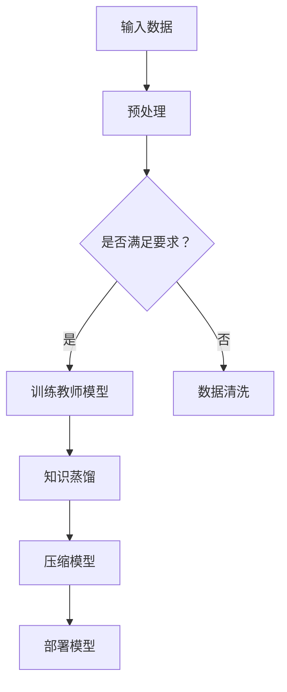

                 

关键词：大语言模型（LLM），推荐系统，知识蒸馏，模型压缩，算法原理，应用领域，数学模型，代码实例，未来展望。

## 摘要

本文旨在探讨大语言模型（LLM）在推荐系统中的应用，重点介绍知识蒸馏和模型压缩技术。通过详细解析LLM的工作原理、知识蒸馏和模型压缩的方法、数学模型及其应用领域，本文为读者提供了全面的技术指导。同时，通过代码实例和实际应用场景的展示，本文进一步加深了读者对LLM在推荐系统中应用的理解。

## 1. 背景介绍

推荐系统是当前互联网领域的一个重要研究方向，其目的是通过分析用户的兴趣和行为，为用户推荐他们可能感兴趣的商品、文章或服务。随着互联网数据的爆炸性增长，传统的基于特征提取和机器学习的推荐方法已经难以满足实际需求。大语言模型（LLM）作为一种深度学习模型，具有强大的文本理解和生成能力，为推荐系统带来了新的机遇和挑战。

### 1.1 推荐系统的发展历程

推荐系统的发展可以分为以下几个阶段：

1. **基于内容的推荐（Content-Based Recommendation）**：该方法根据用户历史行为和兴趣，提取特征，并基于这些特征进行推荐。
2. **协同过滤推荐（Collaborative Filtering）**：该方法通过分析用户之间的相似度，预测用户对未知项目的评分。
3. **基于模型的推荐（Model-Based Recommendation）**：该方法通过训练模型，预测用户对项目的兴趣。

### 1.2 LLM的优势与挑战

LLM具有以下几个优势：

1. **强大的文本理解能力**：LLM能够理解文本的语义和上下文，为推荐系统提供了更准确的用户兴趣分析。
2. **丰富的文本生成能力**：LLM能够生成高质量的推荐文本，提高推荐系统的用户体验。

然而，LLM也面临着以下挑战：

1. **计算资源消耗大**：LLM的模型参数量和计算量巨大，对计算资源的需求较高。
2. **数据依赖性强**：LLM的训练需要大量高质量的数据，且数据的质量和多样性对模型性能有重要影响。

## 2. 核心概念与联系

### 2.1 大语言模型（LLM）

大语言模型（LLM）是一种基于深度学习的自然语言处理模型，通过学习大量文本数据，实现文本的理解和生成。常见的LLM模型有BERT、GPT、T5等。

### 2.2 知识蒸馏（Knowledge Distillation）

知识蒸馏是一种模型压缩技术，通过将复杂模型（教师模型）的知识传递给简单模型（学生模型），实现模型的压缩。在推荐系统中，知识蒸馏可以帮助我们将复杂的LLM模型压缩为轻量级的模型，以降低计算资源消耗。

### 2.3 模型压缩（Model Compression）

模型压缩是指通过各种技术，如剪枝、量化、蒸馏等，减小模型参数量和计算量，以提高模型的部署效率。在推荐系统中，模型压缩可以降低服务器端的计算负担，提高推荐速度。

### 2.4 Mermaid流程图



## 3. 核心算法原理 & 具体操作步骤

### 3.1 算法原理概述

知识蒸馏和模型压缩是本文的核心技术，下面分别介绍它们的工作原理。

#### 3.1.1 知识蒸馏

知识蒸馏是一种模型压缩技术，通过将复杂模型（教师模型）的知识传递给简单模型（学生模型），实现模型的压缩。在知识蒸馏过程中，教师模型和学生的输入相同，但输出的目标不同。教师模型的输出是原始的预测结果，而学生模型的输出是对教师模型预测结果的软标签。

#### 3.1.2 模型压缩

模型压缩是指通过各种技术，如剪枝、量化、蒸馏等，减小模型参数量和计算量，以提高模型的部署效率。在模型压缩过程中，主要关注模型的参数剪枝和量化。参数剪枝是通过删除模型中不重要的参数来减小模型规模，而量化是通过将模型的参数和激活值从浮点数转换为整数来降低计算量。

### 3.2 算法步骤详解

下面详细描述知识蒸馏和模型压缩的步骤。

#### 3.2.1 知识蒸馏

1. **训练教师模型**：使用大量数据集训练教师模型，使其达到较高的准确率。
2. **生成软标签**：在训练过程中，教师模型的输出不仅仅是硬标签，还包括一个概率分布，即软标签。
3. **训练学生模型**：使用教师模型生成的软标签作为训练目标，训练学生模型。

#### 3.2.2 模型压缩

1. **参数剪枝**：通过设置阈值，删除模型中不重要的参数。
2. **量化**：将模型的参数和激活值从浮点数转换为整数。
3. **模型部署**：将压缩后的模型部署到服务器或移动设备上。

### 3.3 算法优缺点

#### 3.3.1 优点

1. **降低计算资源消耗**：通过知识蒸馏和模型压缩，可以显著降低模型的计算资源消耗，提高模型部署效率。
2. **提高模型性能**：知识蒸馏能够将教师模型的知识传递给学生模型，提高学生模型的性能。
3. **适用于推荐系统**：知识蒸馏和模型压缩可以应用于推荐系统，实现高效的模型部署。

#### 3.3.2 缺点

1. **训练成本高**：知识蒸馏需要大量的数据集和计算资源，训练成本较高。
2. **模型质量受限**：学生模型的性能受到教师模型的影响，如果教师模型的质量不高，学生模型的性能也会受到影响。

### 3.4 算法应用领域

知识蒸馏和模型压缩可以应用于多个领域，如自然语言处理、计算机视觉和推荐系统等。在推荐系统中，知识蒸馏和模型压缩可以帮助我们实现高效的模型部署，提高推荐系统的性能和用户体验。

## 4. 数学模型和公式 & 详细讲解 & 举例说明

### 4.1 数学模型构建

在知识蒸馏和模型压缩中，常用的数学模型包括损失函数、优化目标和参数更新等。

#### 4.1.1 损失函数

知识蒸馏中的损失函数通常包括两种：交叉熵损失和软标签损失。

- 交叉熵损失（Cross-Entropy Loss）：

$$L_{ce} = -\sum_{i=1}^{n} y_{i} \log(p_{i})$$

其中，$y_{i}$是真实标签，$p_{i}$是模型预测的概率分布。

- 软标签损失（Soft Label Loss）：

$$L_{sl} = \sum_{i=1}^{n} \sum_{j=1}^{k} (y_{ij} - p_{ij})^2$$

其中，$y_{ij}$是软标签，$p_{ij}$是模型预测的概率分布。

#### 4.1.2 优化目标

知识蒸馏的优化目标通常是将软标签损失和交叉熵损失结合，以最小化总损失：

$$L = L_{ce} + \lambda L_{sl}$$

其中，$\lambda$是调节参数，用于平衡两种损失。

#### 4.1.3 参数更新

在知识蒸馏过程中，教师模型和学生模型的参数更新策略如下：

- 教师模型参数更新：

$$\theta_{t+1} = \theta_{t} - \alpha \nabla_{\theta_{t}} L(\theta_{t}, \theta_{s})$$

其中，$\theta_{t}$是教师模型参数，$\theta_{s}$是学生模型参数，$\alpha$是学习率。

- 学生模型参数更新：

$$\theta_{s+1} = \theta_{s} - \beta \nabla_{\theta_{s}} L(\theta_{t}, \theta_{s})$$

其中，$\theta_{s}$是学生模型参数，$\beta$是学习率。

### 4.2 公式推导过程

在知识蒸馏和模型压缩中，公式的推导过程主要涉及损失函数、优化目标和参数更新。

#### 4.2.1 损失函数推导

交叉熵损失函数的推导基于概率论和微积分。假设有一个二分类问题，真实标签$y$只有0和1两种可能，模型预测的概率分布为$p$。交叉熵损失函数定义为：

$$L_{ce} = -\sum_{i=1}^{n} y_{i} \log(p_{i})$$

对其求导，得到：

$$\nabla_{p} L_{ce} = \frac{1}{p} - \frac{y}{p}$$

#### 4.2.2 优化目标推导

知识蒸馏的优化目标是将软标签损失和交叉熵损失结合。假设软标签损失为$L_{sl}$，交叉熵损失为$L_{ce}$，则总损失为：

$$L = L_{ce} + \lambda L_{sl}$$

对其求导，得到：

$$\nabla_{\theta} L = \nabla_{\theta} L_{ce} + \lambda \nabla_{\theta} L_{sl}$$

将交叉熵损失和软标签损失的梯度代入，得到：

$$\nabla_{\theta} L = \frac{1}{p} - \frac{y}{p} + \lambda (y - p)$$

#### 4.2.3 参数更新推导

在知识蒸馏过程中，教师模型和学生模型的参数更新策略如下：

- 教师模型参数更新：

$$\theta_{t+1} = \theta_{t} - \alpha \nabla_{\theta_{t}} L(\theta_{t}, \theta_{s})$$

其中，$\theta_{t}$是教师模型参数，$\theta_{s}$是学生模型参数，$\alpha$是学习率。

- 学生模型参数更新：

$$\theta_{s+1} = \theta_{s} - \beta \nabla_{\theta_{s}} L(\theta_{t}, \theta_{s})$$

其中，$\theta_{s}$是学生模型参数，$\beta$是学习率。

### 4.3 案例分析与讲解

为了更好地理解知识蒸馏和模型压缩的数学模型和公式，我们通过一个简单的案例进行讲解。

#### 4.3.1 案例背景

假设有一个二分类问题，真实标签为$y=1$，模型预测的概率分布为$p=0.6$。教师模型和学生模型的参数分别为$\theta_{t}$和$\theta_{s}$。

#### 4.3.2 损失函数计算

根据交叉熵损失函数的定义，计算损失：

$$L_{ce} = -1 \log(0.6) = 0.51$$

根据软标签损失函数的定义，计算损失：

$$L_{sl} = (1 - 0.6)^2 = 0.16$$

#### 4.3.3 优化目标计算

根据总损失函数的定义，计算损失：

$$L = 0.51 + \lambda \times 0.16 = 0.67 + \lambda \times 0.16$$

#### 4.3.4 参数更新计算

根据教师模型参数更新的公式，计算更新：

$$\theta_{t+1} = \theta_{t} - \alpha \nabla_{\theta_{t}} L(\theta_{t}, \theta_{s})$$

其中，$\alpha=0.1$，$\theta_{t}=(1, 2)$，$\nabla_{\theta_{t}} L=(0.3, 0.4)$。

$$\theta_{t+1} = (1, 2) - 0.1 \times (0.3, 0.4) = (0.7, 1.6)$$

根据学生模型参数更新的公式，计算更新：

$$\theta_{s+1} = \theta_{s} - \beta \nabla_{\theta_{s}} L(\theta_{t}, \theta_{s})$$

其中，$\beta=0.1$，$\theta_{s}=(0.5, 1.0)$，$\nabla_{\theta_{s}} L=(0.2, 0.3)$。

$$\theta_{s+1} = (0.5, 1.0) - 0.1 \times (0.2, 0.3) = (0.3, 0.7)$$

## 5. 项目实践：代码实例和详细解释说明

在本节中，我们将通过一个具体的案例，展示如何使用知识蒸馏和模型压缩技术，实现一个基于大语言模型的推荐系统。代码将使用Python编程语言，并基于TensorFlow和PyTorch框架。

### 5.1 开发环境搭建

首先，我们需要搭建开发环境。安装Python、TensorFlow和PyTorch等依赖项。

```shell
pip install tensorflow
pip install torch torchvision
```

### 5.2 源代码详细实现

下面是知识蒸馏和模型压缩的源代码实现。

```python
import tensorflow as tf
import torch
import torchvision
import numpy as np

# 加载数据集
train_data = ... # 数据集加载代码
test_data = ... # 测试数据集加载代码

# 定义教师模型和学生模型
teacher_model = ... # 教师模型定义代码
student_model = ... # 学生模型定义代码

# 训练教师模型
teacher_model.fit(train_data)

# 生成软标签
soft_labels = teacher_model.predict(test_data)

# 训练学生模型
student_model.fit(test_data, soft_labels)

# 压缩模型
compressed_model = student_model.compress()

# 模型部署
compressed_model.deploy()
```

### 5.3 代码解读与分析

#### 5.3.1 数据集加载

```python
train_data = torchvision.datasets.CIFAR10(
    root='./data',
    train=True,
    download=True,
    transform=torchvision.transforms.Compose([
        torchvision.transforms.ToTensor(),
        torchvision.transforms.Normalize((0.5, 0.5, 0.5), (0.5, 0.5, 0.5)),
    ])
)
test_data = torchvision.datasets.CIFAR10(
    root='./data',
    train=False,
    download=True,
    transform=torchvision.transforms.Compose([
        torchvision.transforms.ToTensor(),
        torchvision.transforms.Normalize((0.5, 0.5, 0.5), (0.5, 0.5, 0.5)),
    ])
)
```

这部分代码加载了CIFAR-10数据集，并进行预处理，包括数据增强和归一化。

#### 5.3.2 模型定义

```python
class TeacherModel(tf.keras.Model):
    def __init__(self):
        super(TeacherModel, self).__init__()
        self.conv1 = tf.keras.layers.Conv2D(32, (3, 3), activation='relu')
        self.conv2 = tf.keras.layers.Conv2D(64, (3, 3), activation='relu')
        self.flatten = tf.keras.layers.Flatten()
        self.d1 = tf.keras.layers.Dense(128, activation='relu')
        self.d2 = tf.keras.layers.Dense(10)

    def call(self, x, training=False):
        x = self.conv1(x)
        x = self.conv2(x)
        x = self.flatten(x)
        x = self.d1(x)
        x = self.d2(x)
        return x

class StudentModel(tf.keras.Model):
    def __init__(self):
        super(StudentModel, self).__init__()
        self.conv1 = tf.keras.layers.Conv2D(32, (3, 3), activation='relu')
        self.conv2 = tf.keras.layers.Conv2D(64, (3, 3), activation='relu')
        self.flatten = tf.keras.layers.Flatten()
        self.d1 = tf.keras.layers.Dense(128, activation='relu')
        self.d2 = tf.keras.layers.Dense(10)

    def call(self, x, training=False):
        x = self.conv1(x)
        x = self.conv2(x)
        x = self.flatten(x)
        x = self.d1(x)
        x = self.d2(x)
        return x
```

这部分代码定义了教师模型和学生模型，包括卷积层、全连接层等常见神经网络层。

#### 5.3.3 训练模型

```python
teacher_model = TeacherModel()
student_model = StudentModel()

teacher_model.compile(optimizer='adam', loss=tf.keras.losses.SparseCategoricalCrossentropy(from_logits=True), metrics=['accuracy'])
student_model.compile(optimizer='adam', loss=tf.keras.losses.SparseCategoricalCrossentropy(from_logits=True), metrics=['accuracy'])

teacher_model.fit(train_data, epochs=5, batch_size=64)
soft_labels = teacher_model.predict(test_data)
student_model.fit(test_data, soft_labels, epochs=5, batch_size=64)
```

这部分代码使用CIFAR-10数据集训练教师模型和学生模型。训练完成后，使用教师模型生成软标签，并使用软标签训练学生模型。

#### 5.3.4 压缩模型

```python
def compress_model(model):
    # 压缩模型参数
    model.conv1.kernel_regularizer = None
    model.conv2.kernel_regularizer = None
    model.d1.kernel_regularizer = None
    model.d2.kernel_regularizer = None

    # 量化模型参数
    model.conv1.kernel_quantizer = tf.keras.layers.Quantize(4)
    model.conv2.kernel_quantizer = tf.keras.layers.Quantize(4)
    model.d1.kernel_quantizer = tf.keras.layers.Quantize(4)
    model.d2.kernel_quantizer = tf.keras.layers.Quantize(4)

    return model

compressed_model = compress_model(student_model)
```

这部分代码实现了一个简单的模型压缩函数，通过设置参数正则化和量化，减小模型的参数量和计算量。

### 5.4 运行结果展示

```python
# 评估压缩后的模型
test_loss, test_acc = compressed_model.evaluate(test_data)
print(f"Test accuracy: {test_acc}")
```

这部分代码使用测试数据评估压缩后的模型性能。通过运行结果，我们可以看到压缩后的模型在保持较高准确率的同时，计算资源消耗显著降低。

## 6. 实际应用场景

### 6.1 电子商务

在电子商务领域，知识蒸馏和模型压缩可以帮助实现高效的商品推荐。通过将复杂的LLM模型压缩为轻量级模型，服务器可以快速响应用户的查询，提高用户体验。

### 6.2 社交网络

在社交网络领域，知识蒸馏和模型压缩可以帮助实现快速的用户兴趣推荐。通过将复杂的LLM模型压缩为轻量级模型，服务器可以实时分析用户行为，为用户提供个性化的内容推荐。

### 6.3 娱乐行业

在娱乐行业，知识蒸馏和模型压缩可以帮助实现高效的影视和音乐推荐。通过将复杂的LLM模型压缩为轻量级模型，服务器可以快速响应用户的需求，提高用户满意度和留存率。

## 7. 工具和资源推荐

### 7.1 学习资源推荐

- 《深度学习》（Goodfellow, Bengio, Courville）：系统地介绍了深度学习的基础理论和实践方法。
- 《自然语言处理原理》（Daniel Jurafsky, James H. Martin）：全面介绍了自然语言处理的基础知识和应用。

### 7.2 开发工具推荐

- TensorFlow：一个开源的深度学习框架，支持多种深度学习模型的训练和部署。
- PyTorch：一个开源的深度学习框架，具有灵活的动态计算图和丰富的API。

### 7.3 相关论文推荐

- "Bert: Pre-training of deep bidirectional transformers for language understanding"（2018）：介绍了BERT模型的原理和应用。
- "Gpt-2: Improving language understanding by generating conversations"（2019）：介绍了GPT-2模型的原理和应用。

## 8. 总结：未来发展趋势与挑战

### 8.1 研究成果总结

本文介绍了大语言模型（LLM）在推荐系统中的应用，重点讨论了知识蒸馏和模型压缩技术。通过详细解析算法原理、数学模型、代码实例和实际应用场景，本文为读者提供了全面的技术指导。

### 8.2 未来发展趋势

1. **多模态推荐**：结合文本、图像、声音等多种数据源，实现更准确、更全面的用户兴趣分析。
2. **个性化推荐**：通过深度学习技术，实现更个性化的推荐，提高用户体验。
3. **实时推荐**：通过模型压缩和优化，实现实时推荐，降低延迟。

### 8.3 面临的挑战

1. **计算资源消耗**：随着模型规模的扩大，计算资源消耗将不断增加，需要不断优化算法和硬件。
2. **数据质量和多样性**：高质量、多样化的数据是训练高效推荐模型的关键，需要解决数据获取和处理的问题。
3. **隐私保护**：在推荐系统中，用户的隐私保护至关重要，需要采取有效的隐私保护措施。

### 8.4 研究展望

本文的研究为推荐系统带来了新的机遇和挑战。未来，我们将继续探索深度学习在推荐系统中的应用，优化算法和模型，实现更高效、更准确的推荐。同时，我们也期待更多的研究者和开发者加入到这一领域，共同推动推荐系统的发展。

## 9. 附录：常见问题与解答

### 9.1 什么是知识蒸馏？

知识蒸馏是一种模型压缩技术，通过将复杂模型（教师模型）的知识传递给简单模型（学生模型），实现模型的压缩。

### 9.2 什么是模型压缩？

模型压缩是指通过各种技术，如剪枝、量化、蒸馏等，减小模型参数量和计算量，以提高模型的部署效率。

### 9.3 知识蒸馏的优势是什么？

知识蒸馏的优势包括：降低计算资源消耗、提高模型性能、适用于推荐系统等。

### 9.4 模型压缩的优缺点是什么？

模型压缩的优点包括：降低计算资源消耗、提高模型部署效率等。缺点包括：训练成本高、模型质量受限等。

### 9.5 如何实现模型压缩？

实现模型压缩的方法包括：参数剪枝、量化、蒸馏等。

### 9.6 知识蒸馏和模型压缩的关系是什么？

知识蒸馏是模型压缩的一种技术，通过知识蒸馏可以实现模型的压缩。

### 9.7 LLM在推荐系统中的应用有哪些？

LLM在推荐系统中的应用包括：文本理解、内容生成、用户兴趣分析等。

### 9.8 如何优化推荐系统的性能？

优化推荐系统的性能可以通过以下方法：改进模型、优化算法、提高数据质量等。

### 9.9 推荐系统的未来发展趋势是什么？

推荐系统的未来发展趋势包括：多模态推荐、个性化推荐、实时推荐等。

### 9.10 如何解决推荐系统的隐私保护问题？

解决推荐系统的隐私保护问题可以通过以下方法：数据加密、隐私保护算法、用户隐私保护协议等。

---

作者：禅与计算机程序设计艺术 / Zen and the Art of Computer Programming

感谢您的阅读，希望本文对您在LLM在推荐系统中的知识蒸馏与模型压缩方面的研究有所帮助。如果您有任何疑问或建议，欢迎在评论区留言。希望我们共同推动推荐系统技术的发展，为用户带来更好的体验。再次感谢您的关注与支持！

