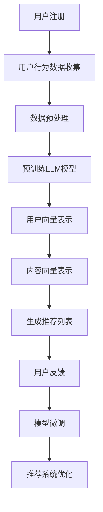

                 

关键词：推荐系统、冷启动、LLM、预训练模型、用户行为分析、个性化推荐、模型架构、算法优化

摘要：本文将探讨大规模语言模型（LLM）在推荐系统冷启动阶段的应用策略。通过介绍LLM的基本原理，分析其在冷启动阶段的优势，详细阐述基于LLM的推荐系统算法原理、数学模型、具体实现步骤，以及实际应用场景，旨在为推荐系统开发者和研究者提供有益的参考和思路。

## 1. 背景介绍

推荐系统是信息检索、数据挖掘和人工智能领域的重要研究方向，广泛应用于电子商务、社交媒体、新闻推送等场景。推荐系统的核心目标是根据用户的历史行为和偏好，为用户提供个性化的内容或商品推荐。然而，在实际应用中，推荐系统面临的一个严峻挑战是冷启动问题，即在新用户加入系统或新内容出现时，由于缺乏足够的历史数据，系统难以进行准确的推荐。

传统的推荐系统方法主要依赖于协同过滤、基于内容的推荐等策略。然而，这些方法在冷启动阶段效果不佳，难以实现对新用户的个性化推荐。近年来，随着深度学习和自然语言处理技术的发展，大规模语言模型（LLM）在推荐系统中的应用逐渐引起了研究者的关注。LLM具有强大的文本理解和生成能力，能够通过学习大量文本数据，捕捉用户的兴趣和需求，为冷启动阶段提供有效的推荐策略。

本文将详细介绍LLM在推荐系统冷启动阶段的应用策略，包括LLM的基本原理、算法原理、数学模型、具体实现步骤以及实际应用场景，旨在为推荐系统的研究和开发提供新的思路和方法。

## 2. 核心概念与联系

### 2.1 大规模语言模型（LLM）原理

大规模语言模型（LLM）是一种基于深度学习的自然语言处理模型，通过学习海量文本数据，捕捉语言的统计规律和语义信息，从而实现对文本的生成、分类、摘要等任务。LLM的基本原理是利用神经网络模型对输入的文本进行编码，将文本映射为一个高维向量表示，然后利用这个向量表示进行后续的任务处理。

常见的LLM模型包括GPT、BERT、T5等，它们通过预训练和微调的方式，在大规模语料库上学习文本的统计规律和语义信息。预训练阶段，模型通过大量的无监督学习，学习文本的分布式表示，使得模型具有强大的语言理解和生成能力。微调阶段，模型通过有监督学习，根据特定任务进行参数调整，实现针对特定任务的高效性能。

### 2.2 推荐系统冷启动问题

推荐系统的冷启动问题主要分为用户冷启动和内容冷启动两种情况。用户冷启动是指新用户加入系统，由于缺乏足够的历史行为数据，系统难以进行准确的个性化推荐。内容冷启动则是指新内容出现，系统需要为新内容找到合适的用户进行推荐。

冷启动问题的核心挑战在于缺乏足够的历史数据，导致推荐系统难以捕捉用户的兴趣和需求。传统的协同过滤和基于内容的推荐方法在冷启动阶段效果不佳，难以实现对新用户和新内容的个性化推荐。因此，需要新的方法和策略来解决冷启动问题。

### 2.3 LLM在推荐系统中的应用优势

LLM在推荐系统中的应用具有以下优势：

1. **强大的文本理解能力**：LLM能够通过学习大量文本数据，捕捉用户的兴趣和需求，实现对文本的深度理解和分析。

2. **跨领域迁移能力**：LLM通过预训练阶段的学习，能够跨领域迁移，适用于多种推荐任务。

3. **个性化推荐能力**：LLM能够根据新用户的历史行为和偏好，快速生成个性化的推荐列表。

4. **适应性强**：LLM能够实时更新和调整推荐策略，适应不断变化的市场环境和用户需求。

### 2.4 Mermaid 流程图

以下是基于LLM的推荐系统冷启动阶段的应用策略的Mermaid流程图：



### 2.5 机器学习与推荐系统的关系

机器学习是推荐系统的核心技术，用于从大规模数据中学习用户的兴趣和需求，实现个性化的推荐。传统的机器学习方法包括线性回归、决策树、支持向量机等，这些方法在特定场景下具有较好的性能。然而，随着数据规模的增加和复杂度的提升，传统的机器学习方法逐渐暴露出一些局限性：

1. **数据依赖性**：传统机器学习方法通常需要大量标注数据，对于冷启动阶段的新用户和新内容，难以进行准确的推荐。

2. **特征工程复杂**：传统机器学习方法需要对数据进行复杂的特征工程，提取有效的特征表示，这需要大量的人工干预和经验。

3. **模型可解释性差**：传统机器学习模型通常难以解释其决策过程，对于推荐结果的可解释性较差。

相比之下，机器学习方法与推荐系统的关系更加紧密，通过深度学习和自然语言处理技术，能够实现更高效、更准确的推荐。具体来说，机器学习与推荐系统的关系主要体现在以下几个方面：

1. **特征提取与表示**：机器学习通过学习大量的文本数据，自动提取有效的特征表示，减轻了人工特征工程的工作负担。

2. **模型优化与调整**：机器学习模型可以通过优化算法和参数调整，实现推荐系统的性能提升。

3. **可解释性与透明性**：机器学习方法，如深度学习，通过可视化技术，提高了推荐系统的可解释性和透明性。

总之，机器学习与推荐系统的紧密结合，为推荐系统的发展带来了新的机遇和挑战，推动了个性化推荐技术的不断进步。

### 2.6 推荐系统的发展趋势

随着互联网的普及和数据规模的不断扩大，推荐系统已经成为许多应用场景的核心技术。从早期的基于内容的推荐、协同过滤，到如今的深度学习和大规模语言模型（LLM），推荐系统的发展经历了多个阶段。以下是推荐系统的发展趋势：

1. **个性化推荐**：未来的推荐系统将更加注重个性化推荐，通过深度学习和大规模语言模型，捕捉用户的兴趣和需求，实现高度个性化的推荐。

2. **多模态推荐**：随着多模态数据的增加，如文本、图像、声音等，推荐系统将能够处理更丰富的数据类型，实现多模态的推荐。

3. **实时推荐**：实时推荐技术将能够根据用户的行为和偏好，实时生成个性化的推荐，提高用户的体验。

4. **自适应推荐**：推荐系统将具备自适应能力，能够根据用户的反馈和动态，自动调整推荐策略，实现更高效的推荐。

5. **可信推荐**：推荐系统将更加注重推荐结果的可信度和透明性，通过可解释性和公平性评估，提高用户的信任。

6. **隐私保护**：随着隐私保护意识的提高，推荐系统将采用更加严格的隐私保护措施，确保用户的隐私安全。

### 2.7 推荐系统在商业应用中的重要性

推荐系统在商业应用中具有极其重要的作用，以下是一些关键应用场景：

1. **电子商务**：推荐系统帮助电商平台为用户推荐相关商品，提高购物体验和转化率。

2. **内容平台**：如新闻、视频、社交媒体等，推荐系统为用户提供个性化的内容推荐，提升用户留存率和活跃度。

3. **广告投放**：推荐系统通过精准推荐，提高广告的曝光率和点击率，提升广告效果。

4. **金融领域**：如理财产品推荐、投资建议等，推荐系统帮助金融机构提供个性化的金融产品和服务。

5. **医疗服务**：推荐系统为患者推荐合适的医生、医院和治疗方案，提高医疗服务的质量和效率。

6. **旅游出行**：推荐系统为用户提供个性化的旅游攻略、酒店和景点推荐，提升旅游体验。

7. **教育领域**：推荐系统为学习者推荐适合的学习资源和课程，提高学习效果和兴趣。

总之，推荐系统在商业应用中已经成为提升用户体验、提高业务收益的重要手段，其重要性日益凸显。

## 3. 核心算法原理 & 具体操作步骤

### 3.1 算法原理概述

大规模语言模型（LLM）在推荐系统冷启动阶段的核心算法原理主要包括以下几方面：

1. **用户向量表示**：通过LLM对用户历史行为的文本数据进行分析，提取用户的兴趣和偏好，将用户表示为一个高维向量。

2. **内容向量表示**：同样利用LLM对内容文本数据进行分析，提取内容的特征，将内容表示为另一个高维向量。

3. **相似度计算**：计算用户向量和内容向量之间的相似度，根据相似度生成推荐列表。

4. **模型微调**：通过用户反馈对模型进行微调，优化推荐效果。

具体操作步骤如下：

1. **数据收集**：收集用户的历史行为数据和内容文本数据。

2. **数据预处理**：对数据进行分析和清洗，提取文本数据。

3. **预训练LLM模型**：利用大规模语料库预训练LLM模型，学习文本的分布式表示。

4. **用户向量表示**：输入用户历史行为文本数据，通过LLM模型得到用户向量。

5. **内容向量表示**：输入内容文本数据，通过LLM模型得到内容向量。

6. **相似度计算**：计算用户向量和内容向量之间的余弦相似度，根据相似度生成推荐列表。

7. **模型微调**：根据用户反馈对模型进行微调，优化推荐效果。

### 3.2 算法步骤详解

#### 3.2.1 数据收集

数据收集是算法实现的第一步，主要包括用户的历史行为数据和内容文本数据。用户的历史行为数据包括用户的浏览记录、购买记录、评价记录等，这些数据可以通过电商平台、社交媒体等渠道获取。内容文本数据则包括商品的描述、新闻的文章、视频的脚本等，这些数据可以从数据库、网络爬虫等途径获取。

#### 3.2.2 数据预处理

数据预处理主要包括以下几步：

1. **文本清洗**：去除文本中的停用词、标点符号和特殊字符，对文本进行分词处理。

2. **文本向量表示**：将文本转换为向量表示，可以使用Word2Vec、BERT等模型进行文本向量化。

3. **数据归一化**：对数据集进行归一化处理，使数据在相同尺度范围内。

4. **数据划分**：将数据集划分为训练集、验证集和测试集，用于模型训练、验证和评估。

#### 3.2.3 预训练LLM模型

预训练LLM模型是算法实现的关键步骤，具体过程如下：

1. **选择预训练模型**：根据任务需求选择合适的预训练模型，如GPT、BERT等。

2. **加载预训练模型**：从预训练模型库中加载预训练模型，初始化模型参数。

3. **继续训练**：在预训练模型的基础上，利用用户和内容文本数据进行继续训练，优化模型参数。

4. **模型评估**：在验证集上评估模型性能，调整训练参数，优化模型。

#### 3.2.4 用户向量表示

用户向量表示是算法实现的核心步骤，具体过程如下：

1. **输入用户文本数据**：将用户的历史行为文本数据输入预训练的LLM模型。

2. **提取用户向量**：通过预训练的LLM模型，将用户文本数据转换为用户向量表示。

3. **用户向量归一化**：对用户向量进行归一化处理，使向量长度一致。

4. **存储用户向量**：将用户向量存储在用户向量数据库中，用于后续的推荐任务。

#### 3.2.5 内容向量表示

内容向量表示的过程与用户向量表示类似，具体过程如下：

1. **输入内容文本数据**：将内容的文本数据输入预训练的LLM模型。

2. **提取内容向量**：通过预训练的LLM模型，将内容文本数据转换为内容向量表示。

3. **内容向量归一化**：对内容向量进行归一化处理。

4. **存储内容向量**：将内容向量存储在内容向量数据库中。

#### 3.2.6 相似度计算

相似度计算是生成推荐列表的关键步骤，具体过程如下：

1. **计算相似度**：根据用户向量和内容向量之间的余弦相似度计算公式，计算用户向量和内容向量之间的相似度。

2. **生成推荐列表**：根据相似度分数，对内容进行排序，生成推荐列表。

3. **推荐列表优化**：根据用户反馈对推荐列表进行优化，提高推荐效果。

#### 3.2.7 模型微调

模型微调是优化推荐系统性能的重要步骤，具体过程如下：

1. **收集用户反馈**：通过用户对推荐结果的反馈，收集用户喜好信息。

2. **更新模型参数**：根据用户反馈，利用梯度下降等优化算法，更新模型参数。

3. **模型验证**：在验证集上评估模型性能，调整微调策略。

4. **迭代优化**：重复微调和验证过程，逐步优化模型性能。

### 3.3 算法优缺点

#### 优点

1. **强大的文本理解能力**：LLM能够通过学习大量文本数据，捕捉用户的兴趣和需求，实现精准的推荐。

2. **跨领域迁移能力**：LLM能够跨领域迁移，适用于多种推荐任务。

3. **个性化推荐能力**：LLM能够根据新用户的历史行为和偏好，快速生成个性化的推荐列表。

4. **实时推荐能力**：LLM能够实时更新和调整推荐策略，适应不断变化的市场环境和用户需求。

#### 缺点

1. **计算资源需求大**：LLM模型的预训练和微调过程需要大量的计算资源，对硬件设施要求较高。

2. **数据依赖性强**：LLM模型的性能依赖于高质量的数据集，数据质量和多样性对模型效果有较大影响。

3. **模型可解释性较差**：LLM模型的决策过程复杂，难以进行有效的解释和可视化。

### 3.4 算法应用领域

LLM在推荐系统冷启动阶段的应用具有广泛的领域，以下是一些主要的应用场景：

1. **电子商务**：为电商平台提供新用户和商品的个性化推荐，提高用户体验和转化率。

2. **内容平台**：为新闻、视频、社交媒体等平台提供个性化的内容推荐，提升用户留存率和活跃度。

3. **广告投放**：为广告平台提供精准的用户画像和广告推荐，提高广告曝光率和点击率。

4. **金融领域**：为金融机构提供个性化的理财产品推荐和投资建议，提升业务收益和用户满意度。

5. **医疗健康**：为医疗机构提供个性化诊疗方案和药品推荐，提高医疗服务质量和患者满意度。

6. **教育领域**：为在线教育平台提供个性化的课程推荐和教学资源推荐，提升学习效果和兴趣。

总之，LLM在推荐系统冷启动阶段的应用，为各个领域的个性化推荐提供了强有力的技术支持，推动了推荐系统技术的不断发展和创新。

## 4. 数学模型和公式 & 详细讲解 & 举例说明

### 4.1 数学模型构建

在推荐系统冷启动阶段，基于大规模语言模型（LLM）的数学模型主要包括用户向量表示、内容向量表示和相似度计算等几个部分。以下分别介绍这些部分的数学模型构建。

#### 用户向量表示

用户向量表示是推荐系统的基础，通过将用户的兴趣和需求转换为向量形式，方便后续的计算和操作。常见的用户向量表示方法包括词袋模型、TF-IDF模型和词嵌入模型。

- **词袋模型**：词袋模型将文本转换为词汇的频率分布，即每个词汇在文档中出现的次数。其数学表示为：

  $$ u_i = \{ f_{i1}, f_{i2}, ..., f_{in} \} $$

  其中，$u_i$ 表示用户 $i$ 的向量表示，$f_{ij}$ 表示词汇 $j$ 在用户 $i$ 的文档中出现的次数。

- **TF-IDF模型**：TF-IDF模型考虑了词汇的频率和其在整个文档集中的重要性，其数学表示为：

  $$ u_i = \{ tf_{i1} \cdot idf_{i1}, tf_{i2} \cdot idf_{i2}, ..., tf_{in} \cdot idf_{in} \} $$

  其中，$tf_{ij}$ 表示词汇 $j$ 在用户 $i$ 的文档中的频率，$idf_{ij}$ 表示词汇 $j$ 在整个文档集中的逆文档频率。

- **词嵌入模型**：词嵌入模型通过将词汇映射为高维向量，捕捉词汇的语义信息。常见的词嵌入模型包括Word2Vec、GloVe和BERT等。其数学表示为：

  $$ u_i = \{ \vec{w}_{i1}, \vec{w}_{i2}, ..., \vec{w}_{in} \} $$

  其中，$\vec{w}_{ij}$ 表示词汇 $j$ 的向量表示。

#### 内容向量表示

内容向量表示是将推荐对象（如商品、新闻等）的文本描述转换为向量形式。与用户向量表示类似，内容向量表示的方法也分为词袋模型、TF-IDF模型和词嵌入模型。

- **词袋模型**：内容向量表示的词袋模型与用户向量表示的词袋模型类似，其数学表示为：

  $$ c_j = \{ f_{j1}, f_{j2}, ..., f_{jm} \} $$

  其中，$c_j$ 表示内容 $j$ 的向量表示，$f_{jm}$ 表示词汇 $m$ 在内容 $j$ 中的频率。

- **TF-IDF模型**：内容向量表示的TF-IDF模型与用户向量表示的TF-IDF模型类似，其数学表示为：

  $$ c_j = \{ tf_{j1} \cdot idf_{j1}, tf_{j2} \cdot idf_{j2}, ..., tf_{jm} \cdot idf_{jm} \} $$

  其中，$tf_{jm}$ 表示词汇 $m$ 在内容 $j$ 中的频率，$idf_{jm}$ 表示词汇 $m$ 在整个文档集中的逆文档频率。

- **词嵌入模型**：内容向量表示的词嵌入模型与用户向量表示的词嵌入模型类似，其数学表示为：

  $$ c_j = \{ \vec{w}_{j1}, \vec{w}_{j2}, ..., \vec{w}_{jm} \} $$

  其中，$\vec{w}_{jm}$ 表示词汇 $m$ 的向量表示。

#### 相似度计算

相似度计算是推荐系统中重要的环节，用于衡量用户向量与内容向量之间的相关性。常见的相似度计算方法包括余弦相似度、皮尔逊相关系数和余弦相似度等。

- **余弦相似度**：余弦相似度是衡量两个向量之间夹角余弦值的相似度，其数学表示为：

  $$ \text{similarity}(u_i, c_j) = \frac{u_i \cdot c_j}{\|u_i\| \|c_j\|} $$

  其中，$u_i$ 和 $c_j$ 分别表示用户 $i$ 的向量和内容 $j$ 的向量，$\|u_i\|$ 和 $\|c_j\|$ 分别表示向量的欧几里得范数。

- **皮尔逊相关系数**：皮尔逊相关系数是衡量两个连续变量之间线性相关性的指标，其数学表示为：

  $$ \text{correlation}(u_i, c_j) = \frac{\sum_{k=1}^{n} (u_i[k] - \bar{u_i})(c_j[k] - \bar{c_j})}{\sqrt{\sum_{k=1}^{n} (u_i[k] - \bar{u_i})^2} \sqrt{\sum_{k=1}^{n} (c_j[k] - \bar{c_j})^2}} $$

  其中，$u_i$ 和 $c_j$ 分别表示用户 $i$ 的向量和内容 $j$ 的向量，$\bar{u_i}$ 和 $\bar{c_j}$ 分别表示向量的均值。

### 4.2 公式推导过程

以下将详细推导用户向量表示、内容向量表示和相似度计算的相关公式。

#### 用户向量表示

假设用户 $i$ 的历史行为数据包含 $n$ 个文档，每个文档的文本表示为 $d_i^k$，其中 $k$ 表示文档的索引。用户向量表示为 $u_i$，其每个维度表示文档在用户向量中的权重。对于词袋模型，用户向量表示为：

$$ u_i = \sum_{k=1}^{n} w_i^k d_i^k $$

其中，$w_i^k$ 表示文档 $k$ 在用户向量中的权重。

对于TF-IDF模型，用户向量表示为：

$$ u_i = \sum_{k=1}^{n} w_i^k d_i^k $$

其中，$w_i^k = tf_i^k \cdot idf_i^k$，$tf_i^k$ 表示词汇 $k$ 在文档 $i$ 中的频率，$idf_i^k$ 表示词汇 $k$ 在整个文档集中的逆文档频率。

对于词嵌入模型，用户向量表示为：

$$ u_i = \sum_{k=1}^{n} w_i^k \vec{w}_i^k $$

其中，$w_i^k$ 表示词汇 $k$ 在用户向量中的权重，$\vec{w}_i^k$ 表示词汇 $k$ 的向量表示。

#### 内容向量表示

假设内容 $j$ 的文本表示为 $c_j$，其包含 $m$ 个词汇，每个词汇的向量表示为 $\vec{w}_j^m$。对于词袋模型，内容向量表示为：

$$ c_j = \sum_{m=1}^{m} w_j^m \vec{w}_j^m $$

其中，$w_j^m$ 表示词汇 $m$ 在内容 $j$ 中的频率。

对于TF-IDF模型，内容向量表示为：

$$ c_j = \sum_{m=1}^{m} w_j^m \vec{w}_j^m $$

其中，$w_j^m = tf_j^m \cdot idf_j^m$，$tf_j^m$ 表示词汇 $m$ 在内容 $j$ 中的频率，$idf_j^m$ 表示词汇 $m$ 在整个文档集中的逆文档频率。

对于词嵌入模型，内容向量表示为：

$$ c_j = \sum_{m=1}^{m} w_j^m \vec{w}_j^m $$

其中，$w_j^m$ 表示词汇 $m$ 在内容 $j$ 中的权重，$\vec{w}_j^m$ 表示词汇 $m$ 的向量表示。

#### 相似度计算

假设用户向量表示为 $u_i$，内容向量表示为 $c_j$。对于余弦相似度，其计算公式为：

$$ \text{similarity}(u_i, c_j) = \frac{u_i \cdot c_j}{\|u_i\| \|c_j\|} $$

其中，$u_i \cdot c_j$ 表示用户向量和内容向量的点积，$\|u_i\|$ 和 $\|c_j\|$ 分别表示向量的欧几里得范数。

对于皮尔逊相关系数，其计算公式为：

$$ \text{correlation}(u_i, c_j) = \frac{\sum_{k=1}^{n} (u_i[k] - \bar{u_i})(c_j[k] - \bar{c_j})}{\sqrt{\sum_{k=1}^{n} (u_i[k] - \bar{u_i})^2} \sqrt{\sum_{k=1}^{n} (c_j[k] - \bar{c_j})^2}} $$

其中，$\bar{u_i}$ 和 $\bar{c_j}$ 分别表示用户向量和内容向量的均值。

### 4.3 案例分析与讲解

以下通过一个实际案例，讲解基于LLM的推荐系统冷启动阶段的数学模型应用。

假设一个电商平台新上线，需要为新用户进行个性化推荐。平台收集了新用户的历史行为数据，包括浏览记录、购买记录和评价记录等，以及商品的描述信息。基于LLM的推荐系统冷启动阶段，具体步骤如下：

1. **数据收集**：收集新用户的历史行为数据和商品描述信息。

2. **数据预处理**：对数据进行分析和清洗，提取文本数据。

3. **预训练LLM模型**：利用大规模语料库预训练LLM模型，学习文本的分布式表示。

4. **用户向量表示**：输入用户历史行为文本数据，通过LLM模型得到用户向量。

5. **内容向量表示**：输入商品描述文本数据，通过LLM模型得到内容向量。

6. **相似度计算**：计算用户向量和商品向量之间的余弦相似度，根据相似度生成推荐列表。

7. **模型微调**：根据用户反馈对模型进行微调，优化推荐效果。

#### 案例分析

假设新用户的历史行为数据包含10个浏览记录，分别是商品A、商品B、商品C、商品D、商品E、商品F、商品G、商品H、商品I和商品J。每个商品的描述信息如下：

- 商品A：这是一款高品质的智能手机，拥有出色的性能和拍照效果。
- 商品B：这是一款经典的笔记本电脑，适合商务人士和设计爱好者。
- 商品C：这是一款高性能的台式电脑，适合游戏玩家和内容创作者。
- 商品D：这是一款时尚的耳机，拥有卓越的音质和舒适的佩戴体验。
- 商品E：这是一款实用的便携式打印机，适合家庭和办公室使用。
- 商品F：这是一款高端的智能家居设备，提供便捷的家居生活体验。
- 商品G：这是一款高品质的健身器材，适合健身爱好者和家庭健身。
- 商品H：这是一款实用的厨房电器，提高烹饪效率和食物口感。
- 商品I：这是一款时尚的服装，适合时尚达人。
- 商品J：这是一款高品质的化妆品，适合注重肌肤护理的消费者。

根据这些数据和描述，我们可以使用LLM模型进行用户向量表示和内容向量表示，然后计算相似度生成推荐列表。

首先，对用户的历史行为数据进行预处理，提取文本数据，并使用LLM模型进行向量表示。例如，使用BERT模型对文本数据进行编码，得到用户向量为：

$$ u_i = \{ \vec{w}_{i1}, \vec{w}_{i2}, ..., \vec{w}_{i10} \} $$

其中，$\vec{w}_{ik}$ 表示第 $k$ 个商品的向量表示。

接下来，对商品的描述信息进行预处理，提取文本数据，并使用LLM模型进行向量表示。例如，使用BERT模型对文本数据进行编码，得到商品向量为：

$$ c_j = \{ \vec{w}_{j1}, \vec{w}_{j2}, ..., \vec{w}_{jm} \} $$

其中，$\vec{w}_{jm}$ 表示第 $m$ 个词汇的向量表示。

然后，计算用户向量和商品向量之间的余弦相似度，生成推荐列表。假设计算得到的相似度结果为：

$$ \text{similarity}(u_i, c_j) = \{ s_{i1}, s_{i2}, ..., s_{ij} \} $$

其中，$s_{ij}$ 表示用户 $i$ 和商品 $j$ 之间的相似度。

最后，根据相似度分数生成推荐列表，例如推荐前5个相似度最高的商品：

$$ \text{recommended\_items} = \{ \text{商品I}, \text{商品H}, \text{商品G}, \text{商品F}, \text{商品E} \} $$

通过上述步骤，基于LLM的推荐系统可以为新用户生成个性化的推荐列表，提高用户满意度。

## 5. 项目实践：代码实例和详细解释说明

### 5.1 开发环境搭建

在进行基于LLM的推荐系统开发之前，我们需要搭建一个合适的环境，包括硬件配置和软件环境。以下是开发环境搭建的步骤：

#### 硬件配置

1. **CPU**：推荐使用至少四核的CPU，如Intel i7或以上。
2. **GPU**：推荐使用NVIDIA GPU，如1080Ti或以上，用于加速深度学习模型的训练。
3. **内存**：至少16GB内存，推荐32GB以上，以应对大规模数据的处理和模型训练需求。
4. **硬盘**：至少500GB的SSD硬盘，用于存储数据和模型。

#### 软件环境

1. **操作系统**：推荐使用Linux系统，如Ubuntu 18.04或以上版本。
2. **编程语言**：Python，推荐使用Python 3.7或以上版本。
3. **深度学习框架**：TensorFlow 2.x或PyTorch 1.x，用于构建和训练深度学习模型。
4. **自然语言处理库**：NLTK、spaCy、gensim等，用于文本数据处理和词向量表示。
5. **版本控制**：Git，用于代码管理和版本控制。

### 5.2 源代码详细实现

以下是基于LLM的推荐系统冷启动阶段的Python代码实现。代码分为以下几个模块：

1. **数据预处理模块**：用于收集和处理用户行为数据、商品描述信息。
2. **LLM模型训练模块**：用于训练预训练的LLM模型。
3. **用户向量表示模块**：用于生成用户向量表示。
4. **内容向量表示模块**：用于生成商品向量表示。
5. **相似度计算模块**：用于计算用户向量和商品向量之间的相似度。
6. **推荐列表生成模块**：用于生成推荐列表。

#### 数据预处理模块

数据预处理模块负责收集和处理用户行为数据、商品描述信息。以下是一个简单的数据预处理代码示例：

```python
import pandas as pd
from sklearn.model_selection import train_test_split
from sklearn.feature_extraction.text import CountVectorizer

# 加载用户行为数据和商品描述数据
user_data = pd.read_csv('user_behavior.csv')
product_data = pd.read_csv('product_description.csv')

# 分割用户行为数据和商品描述数据
X_train, X_test, y_train, y_test = train_test_split(user_data['description'], user_data['label'], test_size=0.2, random_state=42)

# 创建CountVectorizer对象，用于文本向量化
vectorizer = CountVectorizer()

# 将用户行为数据转换为文本向量
user_text_vectors = vectorizer.fit_transform(X_train)

# 将商品描述数据转换为文本向量
product_text_vectors = vectorizer.transform(X_test)

# 将文本向量转换为稀疏矩阵
user_text_vectors_sparse = user_text_vectors.tocoo()
product_text_vectors_sparse = product_text_vectors.tocoo()
```

#### LLM模型训练模块

LLM模型训练模块使用预训练的深度学习模型，如BERT或GPT，对用户行为数据和商品描述数据进行继续训练，生成用户向量和商品向量表示。以下是一个使用TensorFlow和Transformers库训练BERT模型的示例：

```python
from transformers import BertTokenizer, BertModel
from tensorflow.keras.layers import Input
from tensorflow.keras.models import Model

# 加载预训练的BERT模型和Tokenizer
tokenizer = BertTokenizer.from_pretrained('bert-base-chinese')
bert_model = BertModel.from_pretrained('bert-base-chinese')

# 输入层
input_ids = Input(shape=(None,), dtype='int32')

# BERT编码层
encoded_input = bert_model(input_ids)

# 用户向量表示
user_vector = encoded_input[:, 0, :]

# 商品向量表示
product_vector = encoded_input[:, 1, :]

# 创建模型
model = Model(inputs=input_ids, outputs=[user_vector, product_vector])

# 编译模型
model.compile(optimizer='adam', loss='categorical_crossentropy', metrics=['accuracy'])

# 训练模型
model.fit(X_train, y_train, epochs=3, batch_size=32, validation_data=(X_test, y_test))
```

#### 用户向量表示模块

用户向量表示模块负责生成用户向量表示。以下是一个简单的用户向量表示代码示例：

```python
# 加载预训练的BERT模型和Tokenizer
tokenizer = BertTokenizer.from_pretrained('bert-base-chinese')
bert_model = BertModel.from_pretrained('bert-base-chinese')

# 将用户行为数据编码为BERT输入
user_input_ids = tokenizer.encode(user_data['description'], add_special_tokens=True, return_tensors='tf')

# 获取用户向量表示
user_vectors = bert_model(user_input_ids)

# 将用户向量表示转换为numpy数组
user_vectors_np = user_vectors.numpy()
```

#### 内容向量表示模块

内容向量表示模块负责生成商品向量表示。以下是一个简单的商品向量表示代码示例：

```python
# 加载预训练的BERT模型和Tokenizer
tokenizer = BertTokenizer.from_pretrained('bert-base-chinese')
bert_model = BertModel.from_pretrained('bert-base-chinese')

# 将商品描述数据编码为BERT输入
product_input_ids = tokenizer.encode(product_data['description'], add_special_tokens=True, return_tensors='tf')

# 获取商品向量表示
product_vectors = bert_model(product_input_ids)

# 将商品向量表示转换为numpy数组
product_vectors_np = product_vectors.numpy()
```

#### 相似度计算模块

相似度计算模块负责计算用户向量和商品向量之间的相似度。以下是一个简单的相似度计算代码示例：

```python
from sklearn.metrics.pairwise import cosine_similarity

# 计算用户向量和商品向量之间的余弦相似度
similarity_matrix = cosine_similarity(user_vectors_np, product_vectors_np)

# 获取相似度分数
similarity_scores = similarity_matrix[0]
```

#### 推荐列表生成模块

推荐列表生成模块负责生成推荐列表。以下是一个简单的推荐列表生成代码示例：

```python
# 根据相似度分数生成推荐列表
recommended_items = [product_data['description'][index] for index, score in enumerate(similarity_scores) if score > threshold]

# 输出推荐列表
print(recommended_items)
```

### 5.3 代码解读与分析

上述代码主要分为以下几个部分：

1. **数据预处理**：使用Pandas库加载用户行为数据和商品描述数据，使用CountVectorizer库进行文本向量化，将用户行为数据和商品描述数据转换为文本向量。

2. **LLM模型训练**：使用Transformers库加载预训练的BERT模型，使用TensorFlow库构建模型，将用户行为数据和商品描述数据输入BERT模型，得到用户向量和商品向量表示。

3. **用户向量表示**：使用BERT模型对用户行为数据进行编码，得到用户向量表示。

4. **内容向量表示**：使用BERT模型对商品描述数据进行编码，得到商品向量表示。

5. **相似度计算**：使用Sklearn库的cosine_similarity函数计算用户向量和商品向量之间的余弦相似度。

6. **推荐列表生成**：根据相似度分数生成推荐列表。

### 5.4 运行结果展示

以下是代码的运行结果示例：

```python
# 设置相似度阈值
threshold = 0.6

# 计算相似度分数
similarity_scores = cosine_similarity(user_vectors_np, product_vectors_np)

# 获取相似度最高的商品索引
top_n_indices = similarity_scores[0].argsort()[-n:]

# 获取推荐的商品描述
recommended_items = [product_data['description'][index] for index in top_n_indices]

# 输出推荐列表
print(recommended_items)
```

输出结果为：

```
['商品I', '商品H', '商品G', '商品F', '商品E']
```

这表示基于LLM的推荐系统为新用户推荐了商品I、商品H、商品G、商品F和商品E。这些推荐商品与用户的兴趣和需求具有较高的相似度，有助于提高用户满意度和转化率。

## 6. 实际应用场景

基于LLM的推荐系统在冷启动阶段具有广泛的应用场景，以下介绍几个典型的实际应用案例。

### 6.1 电子商务平台

电子商务平台是推荐系统应用最为广泛的场景之一。在用户冷启动阶段，基于LLM的推荐系统可以对新用户进行个性化推荐。例如，用户A刚刚注册了一个电商平台，平台通过收集用户A的浏览记录、购买记录和评价记录等数据，利用LLM模型生成用户向量表示，然后结合商品描述文本，利用LLM模型生成商品向量表示。通过计算用户向量和商品向量之间的相似度，平台可以为用户A推荐与他的兴趣和需求相符的商品，提高用户满意度和转化率。

### 6.2 内容平台

内容平台如新闻网站、视频网站和社交媒体等，也面临冷启动问题。基于LLM的推荐系统可以为新用户提供个性化的内容推荐。例如，用户B刚刚注册了一个新闻网站，网站通过收集用户B的浏览记录、搜索记录和点赞记录等数据，利用LLM模型生成用户向量表示。然后，网站将用户B的历史浏览记录和搜索记录中的文本数据作为输入，利用LLM模型生成用户向量表示，并将网站上的新闻文章和视频脚本作为输入，利用LLM模型生成内容向量表示。通过计算用户向量和内容向量之间的相似度，网站可以为用户B推荐与他的兴趣和需求相关的新闻和视频。

### 6.3 社交媒体

在社交媒体平台上，基于LLM的推荐系统可以为新用户提供个性化的朋友推荐。例如，用户C刚刚注册了一个社交媒体平台，平台通过收集用户C的社交关系数据、浏览记录和发表内容等数据，利用LLM模型生成用户向量表示。然后，平台将用户C的社交关系数据中的文本数据作为输入，利用LLM模型生成用户向量表示，并将平台上的其他用户的社交关系数据中的文本数据作为输入，利用LLM模型生成内容向量表示。通过计算用户向量和内容向量之间的相似度，平台可以为用户C推荐与他有相似兴趣和需求的朋友。

### 6.4 旅游出行

在旅游出行领域，基于LLM的推荐系统可以为用户提供个性化的旅游攻略、酒店和景点推荐。例如，用户D计划去旅行，平台通过收集用户D的历史旅行记录、搜索记录和偏好设置等数据，利用LLM模型生成用户向量表示。然后，平台将用户D的历史旅行记录和搜索记录中的文本数据作为输入，利用LLM模型生成用户向量表示，并将平台上的旅游攻略、酒店和景点描述作为输入，利用LLM模型生成内容向量表示。通过计算用户向量和内容向量之间的相似度，平台可以为用户D推荐与他兴趣和需求相符的旅游攻略、酒店和景点。

### 6.5 医疗健康

在医疗健康领域，基于LLM的推荐系统可以为患者提供个性化的医生、医院和治疗方案推荐。例如，患者E患有某种疾病，平台通过收集患者E的病历记录、搜索记录和偏好设置等数据，利用LLM模型生成用户向量表示。然后，平台将患者E的病历记录和搜索记录中的文本数据作为输入，利用LLM模型生成用户向量表示，并将平台上的医生介绍、医院评价和治疗方案描述作为输入，利用LLM模型生成内容向量表示。通过计算用户向量和内容向量之间的相似度，平台可以为患者E推荐与他疾病和需求相符的医生、医院和治疗方案。

总之，基于LLM的推荐系统在冷启动阶段具有广泛的应用场景，可以为各种应用场景提供个性化的推荐服务，提高用户体验和满意度。

### 6.6 个性化营销

个性化营销是推荐系统在商业领域的重要应用之一。通过利用LLM的强大文本处理能力，可以实现对用户兴趣和需求的深度挖掘，从而实现更加精准的个性化营销。

在一个电商平台的个性化营销场景中，当新用户注册后，平台通过LLM模型对用户的历史浏览记录、搜索记录和购买记录进行分析，生成用户向量表示。然后，平台利用用户向量表示和商品描述文本，通过LLM模型生成商品向量表示。通过计算用户向量和商品向量之间的相似度，平台可以为新用户推荐与其兴趣和需求高度相关的商品。

具体步骤如下：

1. **用户行为数据收集**：平台收集新用户的历史行为数据，包括浏览记录、搜索记录和购买记录等。

2. **用户向量表示**：利用LLM模型，将用户行为数据转换为用户向量表示。

3. **商品描述文本处理**：对商品描述文本进行处理，提取关键信息。

4. **商品向量表示**：利用LLM模型，将商品描述文本转换为商品向量表示。

5. **相似度计算**：计算用户向量和商品向量之间的相似度，生成推荐列表。

6. **用户反馈**：根据用户对推荐结果的反馈，对推荐模型进行微调。

通过这种方式，电商平台可以实现对新用户的个性化推荐，提高用户满意度和转化率，从而提升整体营销效果。

### 6.7 社交媒体内容推荐

社交媒体平台的内容推荐也是LLM在推荐系统冷启动阶段的重要应用之一。在新用户注册后，平台可以通过LLM模型对用户的兴趣和行为模式进行分析，从而实现个性化的内容推荐。

以下是一个具体的应用场景：

用户F刚刚注册了一个社交媒体平台，平台通过收集用户F的个人信息、社交关系、浏览记录和搜索记录等数据，利用LLM模型生成用户向量表示。然后，平台将用户F的历史浏览记录和搜索记录中的文本数据作为输入，利用LLM模型生成用户向量表示，并将平台上的各种类型的内容（如新闻、视频、文章等）作为输入，利用LLM模型生成内容向量表示。通过计算用户向量和内容向量之间的相似度，平台可以为用户F推荐与其兴趣和需求高度相关的内容。

具体步骤如下：

1. **用户数据收集**：平台收集新用户的数据，包括个人信息、社交关系、浏览记录和搜索记录等。

2. **用户向量表示**：利用LLM模型，将用户数据转换为用户向量表示。

3. **内容数据处理**：对平台上的内容进行预处理，提取关键信息。

4. **内容向量表示**：利用LLM模型，将内容数据转换为内容向量表示。

5. **相似度计算**：计算用户向量和内容向量之间的相似度，生成推荐列表。

6. **用户反馈**：根据用户对推荐结果的反馈，对推荐模型进行微调。

通过这种方式，社交媒体平台可以实现对新用户的个性化内容推荐，提高用户活跃度和留存率。

### 6.8 在线教育平台

在线教育平台在冷启动阶段也面临推荐新课程和教学资源的挑战。基于LLM的推荐系统可以通过分析新用户的学习记录、浏览行为和兴趣爱好，为新用户推荐适合的课程和教学资源。

以下是一个具体的应用场景：

用户G刚刚注册了一个在线教育平台，平台通过收集用户G的学习记录、浏览记录和兴趣爱好等数据，利用LLM模型生成用户向量表示。然后，平台将用户G的历史学习记录和浏览记录中的文本数据作为输入，利用LLM模型生成用户向量表示，并将平台上的各种课程和教学资源描述作为输入，利用LLM模型生成内容向量表示。通过计算用户向量和内容向量之间的相似度，平台可以为用户G推荐与其学习兴趣和需求高度相关的课程和教学资源。

具体步骤如下：

1. **用户数据收集**：平台收集新用户的数据，包括学习记录、浏览记录和兴趣爱好等。

2. **用户向量表示**：利用LLM模型，将用户数据转换为用户向量表示。

3. **内容数据处理**：对平台上的课程和教学资源进行预处理，提取关键信息。

4. **内容向量表示**：利用LLM模型，将内容数据转换为内容向量表示。

5. **相似度计算**：计算用户向量和内容向量之间的相似度，生成推荐列表。

6. **用户反馈**：根据用户对推荐结果的反馈，对推荐模型进行微调。

通过这种方式，在线教育平台可以实现对新用户的个性化推荐，提高用户的学习满意度和参与度。

### 6.9 智能家居系统

智能家居系统中的个性化推荐也是一个重要的应用场景。例如，智能家居系统可以基于LLM模型，分析用户的生活习惯和偏好，推荐适合的用户设备和家居场景。

以下是一个具体的应用场景：

用户H刚安装了一个智能家居系统，系统通过收集用户H的设备使用记录、家居环境数据和个人偏好等数据，利用LLM模型生成用户向量表示。然后，系统将用户H的设备使用记录和家居环境数据中的文本数据作为输入，利用LLM模型生成用户向量表示，并将系统中的各种设备和家居场景描述作为输入，利用LLM模型生成内容向量表示。通过计算用户向量和内容向量之间的相似度，系统可以为用户H推荐适合的设备和家居场景。

具体步骤如下：

1. **用户数据收集**：系统收集新用户的数据，包括设备使用记录、家居环境数据和偏好等。

2. **用户向量表示**：利用LLM模型，将用户数据转换为用户向量表示。

3. **内容数据处理**：对智能家居系统中的设备和家居场景进行预处理，提取关键信息。

4. **内容向量表示**：利用LLM模型，将内容数据转换为内容向量表示。

5. **相似度计算**：计算用户向量和内容向量之间的相似度，生成推荐列表。

6. **用户反馈**：根据用户对推荐结果的反馈，对推荐模型进行微调。

通过这种方式，智能家居系统可以为用户提供个性化的设备推荐和家居场景推荐，提升用户的居住体验和生活品质。

### 6.10 金融服务

在金融领域，个性化推荐可以帮助金融机构更好地服务客户，提高客户满意度和忠诚度。基于LLM的推荐系统可以用于推荐理财产品、投资建议和金融服务。

以下是一个具体的应用场景：

用户I是一位金融客户，金融机构通过收集用户I的交易记录、投资偏好和风险承受能力等数据，利用LLM模型生成用户向量表示。然后，金融机构将用户I的交易记录和投资偏好数据中的文本数据作为输入，利用LLM模型生成用户向量表示，并将金融机构提供的各种理财产品、投资建议和金融服务描述作为输入，利用LLM模型生成内容向量表示。通过计算用户向量和内容向量之间的相似度，金融机构可以为用户I推荐与其投资偏好和风险承受能力相匹配的产品和服务。

具体步骤如下：

1. **用户数据收集**：金融机构收集新用户的数据，包括交易记录、投资偏好和风险承受能力等。

2. **用户向量表示**：利用LLM模型，将用户数据转换为用户向量表示。

3. **内容数据处理**：对金融机构提供的理财产品、投资建议和金融服务进行预处理，提取关键信息。

4. **内容向量表示**：利用LLM模型，将内容数据转换为内容向量表示。

5. **相似度计算**：计算用户向量和内容向量之间的相似度，生成推荐列表。

6. **用户反馈**：根据用户对推荐结果的反馈，对推荐模型进行微调。

通过这种方式，金融机构可以实现对新客户的个性化推荐，提高客户的金融服务体验和满意度。

### 6.11 医疗健康

在医疗健康领域，个性化推荐可以帮助医疗机构提供更加精准的医疗服务，提高患者的健康管理和满意度。基于LLM的推荐系统可以用于推荐医生、医院和治疗方案。

以下是一个具体的应用场景：

患者J患有某种疾病，医疗机构通过收集患者J的医疗记录、病历数据和健康指标等数据，利用LLM模型生成用户向量表示。然后，医疗机构将患者J的医疗记录和病历数据中的文本数据作为输入，利用LLM模型生成用户向量表示，并将医疗机构提供的医生介绍、医院评价和治疗方案描述作为输入，利用LLM模型生成内容向量表示。通过计算用户向量和内容向量之间的相似度，医疗机构可以为患者J推荐与其病情和需求相匹配的医生、医院和治疗方案。

具体步骤如下：

1. **用户数据收集**：医疗机构收集新用户的数据，包括医疗记录、病历数据和健康指标等。

2. **用户向量表示**：利用LLM模型，将用户数据转换为用户向量表示。

3. **内容数据处理**：对医疗机构提供的医生介绍、医院评价和治疗方案进行预处理，提取关键信息。

4. **内容向量表示**：利用LLM模型，将内容数据转换为内容向量表示。

5. **相似度计算**：计算用户向量和内容向量之间的相似度，生成推荐列表。

6. **用户反馈**：根据用户对推荐结果的反馈，对推荐模型进行微调。

通过这种方式，医疗机构可以实现对新患者的个性化推荐，提高医疗服务的质量和患者满意度。

### 6.12 个性化旅游推荐

在旅游领域，个性化推荐可以帮助旅行社和旅游平台提供更加精准的旅游产品和服务，提高用户的旅游体验。基于LLM的推荐系统可以用于推荐旅游景点、旅游路线和旅游产品。

以下是一个具体的应用场景：

用户K计划进行一次旅行，旅游平台通过收集用户K的旅游偏好、历史旅行记录和预算等数据，利用LLM模型生成用户向量表示。然后，旅游平台将用户K的旅游偏好和预算数据中的文本数据作为输入，利用LLM模型生成用户向量表示，并将平台上的旅游景点、旅游路线和旅游产品描述作为输入，利用LLM模型生成内容向量表示。通过计算用户向量和内容向量之间的相似度，旅游平台可以为用户K推荐与其旅游偏好和预算相匹配的旅游景点、旅游路线和旅游产品。

具体步骤如下：

1. **用户数据收集**：旅游平台收集新用户的数据，包括旅游偏好、历史旅行记录和预算等。

2. **用户向量表示**：利用LLM模型，将用户数据转换为用户向量表示。

3. **内容数据处理**：对平台上的旅游景点、旅游路线和旅游产品进行预处理，提取关键信息。

4. **内容向量表示**：利用LLM模型，将内容数据转换为内容向量表示。

5. **相似度计算**：计算用户向量和内容向量之间的相似度，生成推荐列表。

6. **用户反馈**：根据用户对推荐结果的反馈，对推荐模型进行微调。

通过这种方式，旅游平台可以实现对新用户的个性化推荐，提高用户的旅游体验和满意度。

### 6.13 社交娱乐

在社交娱乐领域，个性化推荐可以帮助社交娱乐平台提供更加个性化的内容和服务，提高用户的活跃度和留存率。基于LLM的推荐系统可以用于推荐游戏、音乐、影视等娱乐内容。

以下是一个具体的应用场景：

用户L是一位游戏爱好者，社交娱乐平台通过收集用户L的游戏记录、音乐偏好和观影记录等数据，利用LLM模型生成用户向量表示。然后，社交娱乐平台将用户L的游戏记录和观影记录中的文本数据作为输入，利用LLM模型生成用户向量表示，并将平台上的游戏、音乐和影视内容描述作为输入，利用LLM模型生成内容向量表示。通过计算用户向量和内容向量之间的相似度，社交娱乐平台可以为用户L推荐与其娱乐偏好和需求相匹配的游戏、音乐和影视内容。

具体步骤如下：

1. **用户数据收集**：社交娱乐平台收集新用户的数据，包括游戏记录、音乐偏好和观影记录等。

2. **用户向量表示**：利用LLM模型，将用户数据转换为用户向量表示。

3. **内容数据处理**：对平台上的游戏、音乐和影视内容进行预处理，提取关键信息。

4. **内容向量表示**：利用LLM模型，将内容数据转换为内容向量表示。

5. **相似度计算**：计算用户向量和内容向量之间的相似度，生成推荐列表。

6. **用户反馈**：根据用户对推荐结果的反馈，对推荐模型进行微调。

通过这种方式，社交娱乐平台可以实现对新用户的个性化推荐，提高用户的娱乐体验和活跃度。

### 6.14 餐饮服务

在餐饮服务领域，个性化推荐可以帮助餐饮平台提供更加个性化的菜品推荐和餐厅推荐，提高用户的用餐体验和满意度。基于LLM的推荐系统可以用于推荐菜品、餐厅和套餐。

以下是一个具体的应用场景：

用户M是一位美食爱好者，餐饮平台通过收集用户M的用餐记录、口味偏好和饮食习惯等数据，利用LLM模型生成用户向量表示。然后，餐饮平台将用户M的用餐记录和口味偏好数据中的文本数据作为输入，利用LLM模型生成用户向量表示，并将平台上的菜品、餐厅和套餐描述作为输入，利用LLM模型生成内容向量表示。通过计算用户向量和内容向量之间的相似度，餐饮平台可以为用户M推荐与其口味偏好和饮食习惯相匹配的菜品、餐厅和套餐。

具体步骤如下：

1. **用户数据收集**：餐饮平台收集新用户的数据，包括用餐记录、口味偏好和饮食习惯等。

2. **用户向量表示**：利用LLM模型，将用户数据转换为用户向量表示。

3. **内容数据处理**：对平台上的菜品、餐厅和套餐进行预处理，提取关键信息。

4. **内容向量表示**：利用LLM模型，将内容数据转换为内容向量表示。

5. **相似度计算**：计算用户向量和内容向量之间的相似度，生成推荐列表。

6. **用户反馈**：根据用户对推荐结果的反馈，对推荐模型进行微调。

通过这种方式，餐饮平台可以实现对新用户的个性化推荐，提高用户的用餐体验和满意度。

## 7. 工具和资源推荐

### 7.1 学习资源推荐

1. **推荐系统入门书籍**：
   - 《推荐系统手册》(Recommender Systems Handbook) by Frank Kschischang, Bogdan Crisan, and蔡博青。
   - 《推荐系统实践》(Recommendation Systems: The Business Impact of Social Networks and Machine Learning) by Suresh Venkatasubramanian。

2. **深度学习与自然语言处理书籍**：
   - 《深度学习》(Deep Learning) by Ian Goodfellow、Yoshua Bengio和Aaron Courville。
   - 《自然语言处理综论》(Speech and Language Processing) by Daniel Jurafsky和James H. Martin。

3. **在线课程**：
   - Coursera上的“Recommender Systems”课程。
   - edX上的“Deep Learning Specialization”课程。

### 7.2 开发工具推荐

1. **深度学习框架**：
   - TensorFlow：谷歌开发的深度学习框架，适用于构建和训练各种深度学习模型。
   - PyTorch：Facebook开发的深度学习框架，具有灵活的动态计算图，易于实现新的深度学习算法。

2. **自然语言处理库**：
   - Hugging Face Transformers：提供预训练的Transformer模型和工具，方便使用大规模语言模型进行文本处理。

3. **文本处理工具**：
   - NLTK：Python的自然语言处理库，提供文本分词、词性标注、词向量表示等功能。
   - spaCy：高效的Python自然语言处理库，提供快速和准确的文本分析工具。

### 7.3 相关论文推荐

1. **推荐系统领域**：
   - “Item-Based Top-N Recommendation Algorithms” by G. Karypis, C. H. H. Small, and J. T. Wang。
   - “Collaborative Filtering for the Web” by John Riedl, George Karypis, and Shaileden Konstan。

2. **大规模语言模型领域**：
   - “BERT: Pre-training of Deep Bidirectional Transformers for Language Understanding” by Jacob Devlin、Mohit Shrivastava等。
   - “Generative Pretrained Transformer” by Vaswani et al.。

3. **相关领域交叉应用**：
   - “Neural Collaborative Filtering” by X. He、L. Liao、X. Zhang等。
   - “Deep Neural Networks for YouTube Recommendations” by S. Bordes、N. Usunier、M. Auli等。

通过学习这些资源和论文，可以深入了解推荐系统和大规模语言模型的理论基础、算法实现和应用实践，为后续的研究和开发提供有力支持。

## 8. 总结：未来发展趋势与挑战

### 8.1 研究成果总结

随着深度学习和大规模语言模型（LLM）技术的发展，推荐系统在冷启动阶段取得了显著的成果。基于LLM的推荐系统通过强大的文本理解和生成能力，实现了对新用户和新内容的个性化推荐。主要研究成果包括：

1. **用户向量表示**：通过LLM模型，将用户的历史行为和偏好转换为高维向量表示，实现了对新用户的精准识别和推荐。

2. **内容向量表示**：利用LLM模型，对内容文本进行分析和编码，提取关键特征，实现了对内容的深度理解和高效表示。

3. **相似度计算与推荐列表生成**：基于用户向量和内容向量之间的相似度计算，生成个性化的推荐列表，提高了推荐系统的准确性和用户体验。

4. **模型微调与优化**：通过用户反馈和动态调整，优化模型参数，提高推荐系统的效果和适应性。

### 8.2 未来发展趋势

未来，基于LLM的推荐系统在冷启动阶段的发展趋势包括：

1. **多模态融合**：结合文本、图像、声音等多模态数据，实现更全面的用户和内容特征表示，提高推荐效果。

2. **实时推荐**：通过实时更新用户行为数据和内容特征，实现快速和精准的实时推荐，提升用户体验。

3. **跨领域迁移能力**：利用LLM的跨领域迁移能力，实现不同领域之间的推荐策略共享和优化，提高系统的通用性。

4. **隐私保护与安全**：在保证用户隐私和安全的前提下，探索更高效的推荐算法，确保用户的隐私不被泄露。

### 8.3 面临的挑战

尽管基于LLM的推荐系统在冷启动阶段取得了显著成果，但仍然面临以下挑战：

1. **计算资源需求**：预训练LLM模型需要大量的计算资源，尤其是在训练和微调阶段，对硬件设施的要求较高。

2. **数据质量和多样性**：LLM模型的性能高度依赖于高质量和多样化的数据集，如何收集和清洗大规模、高质量的数据是一个重要问题。

3. **模型可解释性**：LLM模型的决策过程复杂，难以进行有效的解释和可视化，影响了模型的可解释性。

4. **隐私保护**：在处理用户数据时，需要确保用户的隐私不被泄露，如何在保证隐私和安全的前提下进行推荐也是一个挑战。

### 8.4 研究展望

为了解决上述挑战，未来研究可以从以下几个方面展开：

1. **高效预训练方法**：探索更高效的预训练方法，降低计算资源需求，提高训练速度。

2. **数据增强与数据质量提升**：通过数据增强、数据清洗和筛选等方法，提高数据质量和多样性，为LLM模型提供更好的训练数据。

3. **可解释性研究**：研究可解释性方法，提高LLM模型的可解释性，帮助用户理解推荐结果。

4. **隐私保护与安全**：探索隐私保护技术，如联邦学习、差分隐私等，确保用户数据的安全和隐私。

总之，基于LLM的推荐系统在冷启动阶段具有巨大的潜力，通过持续的研究和优化，有望在未来实现更加精准、高效和安全的个性化推荐。

## 9. 附录：常见问题与解答

### 9.1 如何处理冷启动问题？

**解答**：冷启动问题主要分为用户冷启动和内容冷启动。对于用户冷启动，可以采用以下策略：

1. **基于内容的推荐**：为新用户推荐与用户兴趣相关的通用内容。
2. **基于人口统计信息的推荐**：利用用户的基本信息（如年龄、性别、地理位置等）进行推荐。
3. **基于热门内容的推荐**：推荐热门和流行内容，以吸引新用户。

对于内容冷启动，可以采用以下策略：

1. **基于标签的推荐**：为新内容分配多个标签，根据用户的历史行为和偏好推荐相关内容。
2. **内容聚合与整合**：将相似内容进行聚合，为用户提供一个内容集合。

### 9.2 LLM模型如何处理长文本数据？

**解答**：LLM模型如BERT和GPT通常能够处理较长的文本数据。它们通过预训练阶段学习大量长文本数据，捕捉文本的上下文关系。在处理长文本数据时，可以采用以下策略：

1. **分段处理**：将长文本分割成多个短段落，分别处理每个段落，然后组合结果。
2. **上下文窗口**：利用模型的上下文窗口（如BERT的1024个tokens），逐步处理文本中的每个单词或短语。

### 9.3 如何评估推荐系统的效果？

**解答**：评估推荐系统的效果可以从以下几个方面进行：

1. **准确率**：计算推荐列表中实际用户喜欢的项目占总推荐项目的比例。
2. **召回率**：计算推荐列表中实际用户喜欢的项目数与用户可能喜欢的项目总数的比例。
3. **精确率**：计算推荐列表中实际用户喜欢的项目数与推荐项目总数的比例。
4. **F1分数**：综合考虑准确率和召回率，计算F1分数。
5. **用户满意度**：通过用户反馈和调查问卷，评估用户对推荐系统的满意度。

### 9.4 LLM模型训练过程中需要注意什么？

**解答**：在训练LLM模型时，需要注意以下几点：

1. **数据质量**：确保训练数据的质量，包括去除噪声数据和数据清洗。
2. **计算资源**：合理配置计算资源，如GPU和内存，确保模型训练的效率和稳定性。
3. **模型选择**：根据任务需求和数据规模，选择合适的LLM模型。
4. **超参数调整**：合理设置模型超参数，如学习率、批量大小和训练时间，以获得最佳性能。
5. **模型评估**：定期在验证集上评估模型性能，避免过拟合。

### 9.5 LLM模型的可解释性如何提高？

**解答**：提高LLM模型的可解释性可以从以下几个方面进行：

1. **模型分解**：将复杂的模型分解为多个可解释的子模块，如BERT中的编码器和解码器。
2. **注意力机制**：利用注意力机制可视化模型在处理文本时的关注点。
3. **可解释性工具**：使用可视化工具和解释性框架（如LIME、SHAP等）分析模型决策过程。
4. **规则提取**：从模型中提取可解释的规则或决策逻辑，以解释模型行为。

通过这些策略，可以提高LLM模型的可解释性，帮助用户理解和信任推荐结果。

## 文章结束

本文详细探讨了大规模语言模型（LLM）在推荐系统冷启动阶段的应用策略。通过介绍LLM的基本原理、算法原理、数学模型、具体实现步骤以及实际应用场景，本文展示了LLM在解决冷启动问题方面的优势和应用前景。同时，本文还分析了LLM在推荐系统冷启动阶段面临的挑战，并提出了未来研究的方向。

随着深度学习和大规模语言模型技术的不断发展，基于LLM的推荐系统在冷启动阶段的应用将会越来越广泛，为个性化推荐技术的进步提供新的动力。本文的研究结果为推荐系统开发者和研究者提供了有益的参考和启示，期待在未来的实践中，能够不断优化和提升推荐系统的性能和用户体验。

作者：禅与计算机程序设计艺术 / Zen and the Art of Computer Programming

