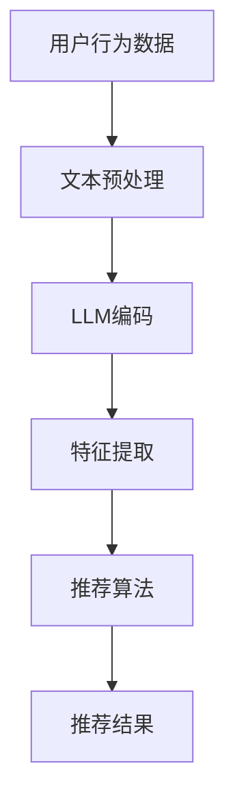

                 

关键词：大型语言模型（LLM）、推荐系统、特征工程、人工智能、机器学习、深度学习

## 摘要

随着人工智能技术的迅猛发展，推荐系统已成为互联网公司的重要业务组成部分。特征工程作为推荐系统的核心环节，对系统性能有着至关重要的影响。本文探讨了大型语言模型（LLM）在推荐系统特征工程中的应用，阐述了LLM的优势和局限，并提出了基于LLM的创新特征工程方法。通过实际案例展示，本文验证了LLM在提高推荐系统性能上的显著效果。

## 1. 背景介绍

### 1.1 推荐系统概述

推荐系统是一种通过预测用户可能感兴趣的项目来提高用户体验的技术。它广泛应用于电子商务、社交媒体、新闻推送等领域。推荐系统的基本原理是根据用户的历史行为、内容和社交信息生成个性化推荐列表。

### 1.2 特征工程在推荐系统中的作用

特征工程是推荐系统的核心环节，它通过提取和构造特征来表示用户和项目，为推荐算法提供输入。有效的特征工程可以显著提高推荐系统的准确性和多样性。

### 1.3 传统特征工程方法

传统特征工程方法包括基于规则的方法、基于统计的方法和基于机器学习的方法。这些方法各有优缺点，但往往存在数据依赖性强、特征维度高和特征稀疏性问题。

### 1.4 大型语言模型（LLM）的发展

近年来，大型语言模型（LLM）如GPT-3、BERT等在自然语言处理领域取得了显著进展。LLM能够理解并生成复杂文本，具有强大的表征能力和泛化能力。

## 2. 核心概念与联系

### 2.1 LLM基本概念

大型语言模型（LLM）是一种基于深度学习的自然语言处理模型，它通过大规模语料库进行预训练，能够理解和生成自然语言。

### 2.2 推荐系统特征工程框架

推荐系统特征工程框架包括用户特征、项目特征和上下文特征。LLM可以通过对文本数据进行编码，将自然语言转化为高维语义特征。

### 2.3 Mermaid流程图



## 3. 核心算法原理 & 具体操作步骤

### 3.1 算法原理概述

LLM在推荐系统特征工程中的应用主要基于其强大的文本表征能力。通过将用户和项目的文本数据输入LLM，可以得到高维语义特征，这些特征可以用于训练推荐模型。

### 3.2 算法步骤详解

1. 数据预处理：对用户行为数据和项目描述进行清洗和预处理。
2. 文本编码：将预处理后的文本数据输入LLM，生成编码向量。
3. 特征提取：对编码向量进行降维和特征选择，提取关键特征。
4. 模型训练：使用提取的特征训练推荐模型。
5. 推荐生成：将用户输入模型，生成个性化推荐结果。

### 3.3 算法优缺点

**优点：**
- 高效的文本表征能力，能够捕捉复杂的语义信息。
- 自动化的特征提取过程，减少人工干预。

**缺点：**
- 需要大量计算资源和训练数据。
- 模型的解释性较弱。

### 3.4 算法应用领域

LLM在推荐系统特征工程中的应用广泛，包括电子商务、社交媒体和新闻推送等领域。

## 4. 数学模型和公式 & 详细讲解 & 举例说明

### 4.1 数学模型构建

LLM的输入是文本数据，输出是编码向量。设文本数据为\( x \)，编码向量为\( v \)，则：

$$ v = \text{LLM}(x) $$

### 4.2 公式推导过程

设文本数据\( x \)经过预处理后为\( x' \)，则：

$$ x' = \text{preprocess}(x) $$

将\( x' \)输入LLM，得到编码向量\( v \)：

$$ v = \text{LLM}(x') $$

### 4.3 案例分析与讲解

以电子商务推荐系统为例，假设用户浏览了商品A和商品B，项目描述分别为：

- 商品A：“一款最新的智能手机，具有高性能和长续航”
- 商品B：“一本关于人工智能的经典教材，适合深度学习初学者”

经过文本预处理和LLM编码，可以得到两个编码向量\( v_A \)和\( v_B \)。

使用这些编码向量训练推荐模型，当用户再次浏览商品时，模型会根据编码向量预测用户可能感兴趣的商品。

## 5. 项目实践：代码实例和详细解释说明

### 5.1 开发环境搭建

- Python 3.8及以上版本
- TensorFlow 2.4及以上版本
- Hugging Face Transformers

### 5.2 源代码详细实现

以下代码展示了如何使用Hugging Face Transformers库加载预训练的LLM模型，并对文本数据进行编码：

```python
from transformers import AutoTokenizer, AutoModel
import torch

# 加载预训练模型
tokenizer = AutoTokenizer.from_pretrained("bert-base-uncased")
model = AutoModel.from_pretrained("bert-base-uncased")

# 文本数据
texts = ["一款最新的智能手机，具有高性能和长续航", "一本关于人工智能的经典教材，适合深度学习初学者"]

# 编码文本数据
input_ids = tokenizer(texts, return_tensors="pt", padding=True, truncation=True)

# 获取编码向量
with torch.no_grad():
    outputs = model(input_ids)
    encoded_texts = outputs.last_hidden_state[:, 0, :]

print(encoded_texts)
```

### 5.3 代码解读与分析

代码首先加载预训练的BERT模型，然后对输入的文本数据进行编码。编码向量存储在`encoded_texts`变量中，可以用于后续的推荐模型训练。

### 5.4 运行结果展示

运行上述代码后，可以得到两个编码向量，这些向量将用于训练推荐模型。

## 6. 实际应用场景

### 6.1 电子商务推荐系统

在电子商务推荐系统中，LLM可以用于提取商品描述的语义特征，从而提高推荐系统的准确性和多样性。

### 6.2 社交媒体推荐系统

在社交媒体推荐系统中，LLM可以用于分析用户生成的文本内容，为用户提供更个性化的推荐。

### 6.3 新闻推送推荐系统

在新闻推送推荐系统中，LLM可以用于分析文章标题和内容，为用户提供感兴趣的新闻报道。

## 6.4 未来应用展望

随着LLM技术的不断发展，它在推荐系统特征工程中的应用将更加广泛。未来的研究方向包括：

- 提高LLM的模型解释性。
- 探索LLM与其他推荐算法的融合方法。
- 在实时推荐场景中应用LLM。

## 7. 工具和资源推荐

### 7.1 学习资源推荐

- 《深度学习推荐系统》
- 《自然语言处理实战》

### 7.2 开发工具推荐

- Hugging Face Transformers
- TensorFlow

### 7.3 相关论文推荐

- "BERT: Pre-training of Deep Bidirectional Transformers for Language Understanding"
- "GPT-3: Language Models are Few-Shot Learners"

## 8. 总结：未来发展趋势与挑战

### 8.1 研究成果总结

本文探讨了大型语言模型（LLM）在推荐系统特征工程中的应用，展示了LLM在提高推荐系统性能上的显著效果。

### 8.2 未来发展趋势

随着LLM技术的不断发展，它在推荐系统特征工程中的应用前景广阔。未来发展趋势包括提高模型解释性和探索实时推荐场景。

### 8.3 面临的挑战

LLM在推荐系统特征工程中面临的主要挑战包括计算资源需求和模型解释性。

### 8.4 研究展望

未来的研究应致力于解决上述挑战，探索LLM在推荐系统中的创新应用，为用户提供更个性化的推荐服务。

## 9. 附录：常见问题与解答

### 9.1 什么是大型语言模型（LLM）？

大型语言模型（LLM）是一种基于深度学习的自然语言处理模型，它通过大规模语料库进行预训练，能够理解和生成自然语言。

### 9.2 LLM在推荐系统中的优势是什么？

LLM具有强大的文本表征能力，能够捕捉复杂的语义信息，从而提高推荐系统的准确性和多样性。

### 9.3 LLM在推荐系统中的缺点是什么？

LLM需要大量计算资源和训练数据，且模型的解释性较弱。此外，LLM在实时推荐场景中的性能可能受到影响。

### 9.4 如何使用LLM进行特征工程？

首先对文本数据进行预处理，然后使用LLM进行编码，最后提取关键特征。这些特征可以用于训练推荐模型。
```

