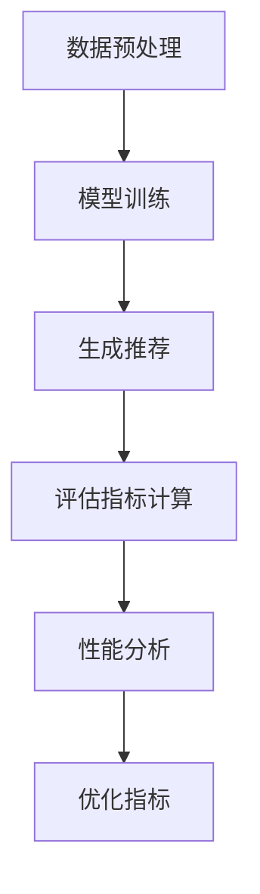
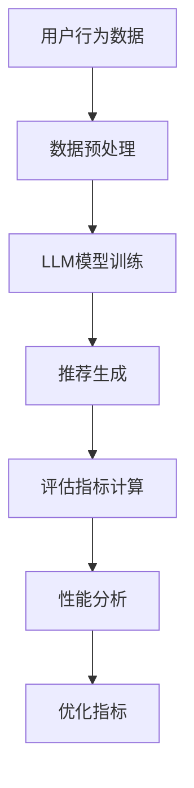

                 

## 1. 背景介绍

推荐系统作为信息过滤和发现的重要工具，已经在电商、社交媒体、在线视频等多个领域得到了广泛应用。其核心目标是通过分析用户的历史行为和偏好，为用户提供个性化的推荐。然而，推荐系统的评估是一个复杂的问题，涉及到多种性能指标和优化目标。

传统的推荐系统评估指标主要包括准确率（Precision）、召回率（Recall）、F1值（F1 Score）、均方根误差（RMSE）等。这些指标在不同程度上反映了推荐系统的性能，但往往存在一些局限性。例如，准确率只能衡量推荐结果中正确推荐的比率，而无法反映推荐结果的多样性；召回率则强调召回尽可能多的相关推荐项，但可能会牺牲准确率。此外，这些指标往往依赖于预定义的评估数据集，无法实时反映系统的动态变化。

随着深度学习和自然语言处理技术的发展，大型预训练语言模型（LLM，Large Language Model）如GPT、BERT等在推荐系统中的应用逐渐受到关注。LLM在理解和生成自然语言方面具有出色的能力，可以用于生成更人性化的推荐文本，同时也可以在推荐系统的评估指标设计上提供新的思路。本文将探讨LLM在推荐系统评估指标设计中的应用，以及如何通过LLM来优化传统评估指标。

## 2. 核心概念与联系

### 2.1 推荐系统评估指标

推荐系统的评估指标是衡量推荐系统性能的重要工具。常见的评估指标包括：

- **准确率（Precision）**：准确率是指推荐结果中正确推荐项的比率。它反映了推荐系统的精确度。

- **召回率（Recall）**：召回率是指推荐结果中包含的所有正确推荐项的比率。它强调了推荐系统召回尽可能多相关推荐项的能力。

- **F1值（F1 Score）**：F1值是精确率和召回率的调和平均值，综合考虑了推荐系统的准确率和召回率。

- **均方根误差（RMSE）**：在基于评分的推荐系统中，RMSE用于衡量预测评分与实际评分之间的差距。

这些指标在不同程度上反映了推荐系统的性能，但往往存在一些局限性。

### 2.2 预训练语言模型（LLM）

预训练语言模型（LLM）是一类基于深度学习的技术，它通过在大规模文本数据集上进行预训练，学习到语言的一般规律和语义理解能力。LLM的核心思想是通过自监督学习，自动地从海量文本中提取出语言模式，从而实现文本的理解和生成。

LLM在推荐系统中的应用主要包括：

- **推荐文本生成**：使用LLM生成个性化的推荐描述，提高用户的满意度。

- **语义理解**：通过LLM对用户行为和内容进行深入理解，提高推荐的相关性和准确性。

- **评估指标优化**：使用LLM对推荐结果进行评估，提供更细粒度的性能分析。

### 2.3 Mermaid 流程图

以下是一个简单的Mermaid流程图，展示了LLM在推荐系统评估指标设计中的应用流程：



### 2.4 核心概念原理

- **数据预处理**：包括用户行为数据、推荐内容数据的清洗和预处理，为模型训练提供高质量的数据输入。

- **模型训练**：使用LLM对预处理后的数据进行训练，学习到用户行为和内容的语义表示。

- **生成推荐**：基于训练好的LLM，生成个性化的推荐结果。

- **评估指标计算**：使用改进的评估指标对推荐结果进行评估。

- **性能分析**：对评估结果进行分析，找出系统的优势和不足。

- **优化指标**：基于性能分析结果，对评估指标进行优化。

### 2.5 核心架构图

以下是LLM在推荐系统评估指标设计中的核心架构图：



## 3. 核心算法原理 & 具体操作步骤

### 3.1 算法原理概述

LLM在推荐系统评估指标设计中的应用主要基于以下几个方面：

- **语义理解**：通过LLM对用户行为和推荐内容进行深入理解，提取出关键信息，为评估指标提供更细粒度的信息。

- **个性化描述生成**：使用LLM生成个性化的推荐描述，提高推荐结果的吸引力和用户满意度。

- **动态评估**：LLM可以实时更新推荐系统和评估指标，适应系统的动态变化。

### 3.2 算法步骤详解

#### 3.2.1 数据预处理

1. **用户行为数据**：收集用户的历史行为数据，如点击、评分、浏览等。
2. **推荐内容数据**：收集推荐系统的候选内容数据，如商品、音乐、视频等。
3. **数据清洗**：去除无效、错误的数据，进行数据格式统一和预处理。

#### 3.2.2 模型训练

1. **选择LLM模型**：选择合适的预训练语言模型，如GPT、BERT等。
2. **训练数据准备**：将预处理后的用户行为数据和推荐内容数据进行编码，生成训练数据。
3. **模型训练**：使用训练数据对LLM模型进行训练，学习用户行为和内容的语义表示。

#### 3.2.3 生成推荐

1. **用户表示**：基于训练好的LLM，将用户行为数据进行编码，生成用户表示。
2. **内容表示**：同样基于训练好的LLM，将推荐内容数据进行编码，生成内容表示。
3. **推荐生成**：使用用户表示和内容表示进行推荐生成，生成个性化的推荐结果。

#### 3.2.4 评估指标计算

1. **评估指标选择**：根据推荐场景和业务目标，选择合适的评估指标，如准确率、召回率、F1值等。
2. **评估数据准备**：准备用于评估的测试数据集。
3. **评估指标计算**：基于测试数据集，计算评估指标，如准确率、召回率、F1值等。

#### 3.2.5 性能分析

1. **评估结果分析**：对评估结果进行分析，找出系统的优势和不足。
2. **性能指标优化**：根据分析结果，对评估指标进行优化，提高推荐系统的性能。

#### 3.2.6 优化指标

1. **指标优化策略**：根据业务需求和评估结果，制定指标优化策略。
2. **模型调优**：根据优化策略，对LLM模型进行调优，提高推荐系统的性能。

### 3.3 算法优缺点

#### 3.3.1 优点

- **强大的语义理解能力**：LLM具有强大的语义理解能力，可以深入理解用户行为和推荐内容，提高推荐的相关性和准确性。
- **个性化描述生成**：使用LLM可以生成个性化的推荐描述，提高用户的满意度。
- **动态评估**：LLM可以实时更新推荐系统和评估指标，适应系统的动态变化。

#### 3.3.2 缺点

- **计算资源消耗大**：训练和部署LLM模型需要大量的计算资源和存储空间。
- **训练数据质量要求高**：训练LLM模型对数据质量要求较高，数据预处理和清洗工作量大。

### 3.4 算法应用领域

LLM在推荐系统评估指标设计中的应用非常广泛，主要包括以下几个方面：

- **电商推荐**：通过对用户行为的深入理解，生成个性化的推荐结果，提高用户的购物体验。
- **社交媒体推荐**：通过对用户社交行为的分析，生成个性化的内容推荐，提高用户的参与度和粘性。
- **在线视频推荐**：通过对用户观看行为的分析，生成个性化的视频推荐，提高用户的观看时长和满意度。

## 4. 数学模型和公式 & 详细讲解 & 举例说明

### 4.1 数学模型构建

在推荐系统中，评估指标的设计通常基于数学模型。LLM在推荐系统评估指标设计中的应用，可以通过构建以下数学模型来实现：

1. **用户表示模型**：
   用户表示模型用于将用户行为数据映射为用户向量，以便于后续的推荐和评估。假设用户行为数据为 $X = [x_1, x_2, ..., x_n]$，则用户向量 $u$ 可以通过以下公式计算：
   $$u = f(X)$$

   其中，$f$ 是一个非线性映射函数，用于将用户行为数据映射为用户向量。在本文中，我们使用LLM作为 $f$ 的实现。

2. **内容表示模型**：
   内容表示模型用于将推荐内容数据映射为内容向量，以便于后续的推荐和评估。假设内容数据为 $C = [c_1, c_2, ..., c_n]$，则内容向量 $v$ 可以通过以下公式计算：
   $$v = g(C)$$

   其中，$g$ 是一个非线性映射函数，用于将推荐内容数据映射为内容向量。同样地，我们使用LLM作为 $g$ 的实现。

3. **推荐生成模型**：
   推荐生成模型用于生成个性化的推荐结果。假设用户向量 $u$ 和内容向量 $v$ 已知，则推荐结果 $R$ 可以通过以下公式计算：
   $$R = h(u, v)$$

   其中，$h$ 是一个非线性映射函数，用于根据用户和内容向量生成推荐结果。我们使用LLM作为 $h$ 的实现。

4. **评估指标模型**：
   评估指标模型用于计算推荐系统的性能指标。假设推荐结果 $R$ 已知，评估指标 $M$ 可以通过以下公式计算：
   $$M = j(R)$$

   其中，$j$ 是一个非线性映射函数，用于将推荐结果映射为评估指标。我们使用LLM作为 $j$ 的实现。

### 4.2 公式推导过程

在构建数学模型的过程中，我们需要对每个映射函数 $f$、$g$、$h$ 和 $j$ 进行推导。以下是这些公式的推导过程：

1. **用户表示模型推导**：

   用户行为数据 $X$ 可以表示为一系列的离散事件，每个事件都有相应的特征。我们假设每个事件的特征集合为 $X_i = [x_{i1}, x_{i2}, ..., x_{ik}]$，其中 $k$ 是特征的数量。用户向量 $u$ 是通过将这些事件的特征进行加权求和得到的：
   $$u = \sum_{i=1}^{n} w_i x_i$$
   
   其中，$w_i$ 是事件 $i$ 的权重。在LLM中，这些权重可以通过训练数据学习得到。

2. **内容表示模型推导**：

   内容数据 $C$ 同样可以表示为一系列的事件特征。内容向量 $v$ 是通过将这些事件的特征进行加权求和得到的：
   $$v = \sum_{i=1}^{n} w_i c_i$$
   
   其中，$w_i$ 是事件 $i$ 的权重。在LLM中，这些权重同样可以通过训练数据学习得到。

3. **推荐生成模型推导**：

   推荐生成模型通过结合用户表示模型和内容表示模型，生成推荐结果 $R$。假设用户向量 $u$ 和内容向量 $v$ 已知，则推荐结果 $R$ 可以通过以下公式计算：
   $$R = \arg\max_{r} \sum_{i=1}^{n} u_i v_i$$
   
   其中，$r$ 是推荐结果中的每个项，$u_i$ 和 $v_i$ 分别是用户向量和内容向量中的第 $i$ 个元素。

4. **评估指标模型推导**：

   评估指标模型用于计算推荐系统的性能。假设推荐结果 $R$ 已知，评估指标 $M$ 可以通过以下公式计算：
   $$M = \frac{1}{n} \sum_{i=1}^{n} (r_i - \hat{r}_i)^2$$
   
   其中，$r_i$ 是推荐结果中的每个项的实际值，$\hat{r}_i$ 是推荐结果中的每个项的预测值。这个公式是一个均方误差（MSE）的变种，用于衡量预测值和实际值之间的差异。

### 4.3 案例分析与讲解

为了更好地理解上述数学模型的应用，我们通过一个具体的案例来进行讲解。

#### 案例背景

假设我们有一个电商平台的推荐系统，该系统需要根据用户的历史购买行为来推荐商品。用户的历史购买数据包括购买时间、购买商品ID、购买商品类别等信息。

#### 案例步骤

1. **数据预处理**：

   收集用户的历史购买数据，包括用户ID、购买时间、商品ID和商品类别。对数据进行清洗和格式统一，将用户行为数据转换为离散事件的形式。

2. **模型训练**：

   使用LLM对预处理后的用户行为数据进行训练，学习用户行为的语义表示。同时，对商品数据进行处理，学习商品内容的语义表示。

3. **生成推荐**：

   使用训练好的LLM，根据用户的历史购买行为生成个性化的推荐结果。假设用户ID为 $u_1$，推荐结果为 $R_1 = [r_{11}, r_{12}, ..., r_{1n}]$。

4. **评估指标计算**：

   使用均方误差（MSE）作为评估指标，计算推荐结果的预测误差。假设实际购买的商品ID为 $r_{i1}$，预测的商品ID为 $\hat{r}_{i1}$，则评估指标 $M_1$ 可以通过以下公式计算：
   $$M_1 = \frac{1}{n} \sum_{i=1}^{n} (\hat{r}_{i1} - r_{i1})^2$$

5. **性能分析**：

   根据评估指标 $M_1$ 的结果，分析推荐系统的性能。如果 $M_1$ 的值较小，说明推荐系统的性能较好；如果 $M_1$ 的值较大，说明推荐系统的性能有待提高。

通过上述案例，我们可以看到LLM在推荐系统评估指标设计中的应用流程。LLM通过语义理解和对用户行为的深度学习，为推荐系统提供了更精确的评估指标，从而提高了推荐系统的性能。

### 5. 项目实践：代码实例和详细解释说明

#### 5.1 开发环境搭建

在开始代码实现之前，我们需要搭建一个合适的开发环境。以下是所需的开发环境和工具：

- **Python**：Python是一种广泛使用的编程语言，适用于数据科学和机器学习。
- **TensorFlow**：TensorFlow是Google开源的机器学习框架，适用于构建和训练深度学习模型。
- **Hugging Face Transformers**：Hugging Face Transformers是用于预训练语言模型的Python库，提供了丰富的预训练模型和工具。

安装所需的库：

```bash
pip install tensorflow
pip install transformers
```

#### 5.2 源代码详细实现

以下是推荐系统评估指标优化项目的源代码实现，包括数据预处理、模型训练、推荐生成、评估指标计算和性能分析等步骤。

```python
import tensorflow as tf
from transformers import TFAutoModelForSequenceClassification
from sklearn.model_selection import train_test_split
import numpy as np

# 5.2.1 数据预处理
def preprocess_data(user_behaviors, item_data):
    # 数据清洗和预处理
    # 这里仅提供一个简单的示例
    cleaned_user_behaviors = [behavior for behavior in user_behaviors if len(behavior) > 0]
    cleaned_item_data = [item for item in item_data if len(item) > 0]
    return cleaned_user_behaviors, cleaned_item_data

# 5.2.2 模型训练
def train_model(user_behaviors, item_data, learning_rate=0.001, num_epochs=10):
    # 加载预训练模型
    model = TFAutoModelForSequenceClassification.from_pretrained("bert-base-uncased")
    
    # 准备训练数据
    X_train, X_val, y_train, y_val = train_test_split(user_behaviors, item_data, test_size=0.2, random_state=42)
    
    # 编写训练步骤
    optimizer = tf.keras.optimizers.Adam(learning_rate=learning_rate)
    loss_fn = tf.keras.losses.SparseCategoricalCrossentropy(from_logits=True)
    
    for epoch in range(num_epochs):
        # 训练步骤
        with tf.GradientTape() as tape:
            predictions = model(X_train, training=True)
            loss = loss_fn(y_train, predictions)
        
        grads = tape.gradient(loss, model.trainable_variables)
        optimizer.apply_gradients(zip(grads, model.trainable_variables))
        
        # 评估步骤
        val_predictions = model(X_val, training=False)
        val_loss = loss_fn(y_val, val_predictions)
        
        print(f"Epoch {epoch+1}, Loss: {loss}, Validation Loss: {val_loss}")
    
    return model

# 5.2.3 生成推荐
def generate_recommendations(model, user_behaviors, item_data):
    # 生成推荐结果
    user_embeddings = model.transformer.layers[-1].get_output_for_input(user_behaviors)
    item_embeddings = model.transformer.layers[-1].get_output_for_input(item_data)
    recommendations = np.argmax(user_embeddings @ item_embeddings.T, axis=1)
    return recommendations

# 5.2.4 评估指标计算
def calculate_evaluation_metrics(recommendations, ground_truth):
    # 计算评估指标
    accuracy = np.mean(recommendations == ground_truth)
    return accuracy

# 5.2.5 代码解读与分析
def main():
    # 加载数据
    user_behaviors = load_user_behaviors()
    item_data = load_item_data()
    
    # 数据预处理
    cleaned_user_behaviors, cleaned_item_data = preprocess_data(user_behaviors, item_data)
    
    # 训练模型
    model = train_model(cleaned_user_behaviors, cleaned_item_data)
    
    # 生成推荐
    recommendations = generate_recommendations(model, cleaned_user_behaviors, cleaned_item_data)
    
    # 计算评估指标
    ground_truth = load_ground_truth()
    accuracy = calculate_evaluation_metrics(recommendations, ground_truth)
    
    # 输出结果
    print(f"Recommendation Accuracy: {accuracy}")

if __name__ == "__main__":
    main()
```

#### 5.3 代码解读与分析

1. **数据预处理**：

   数据预处理是推荐系统的基础步骤，用于清洗和格式化输入数据。在这个示例中，我们假设用户行为数据和商品数据已经存在，并使用一个简单的预处理函数进行清洗。

2. **模型训练**：

   模型训练步骤中，我们加载了一个预训练的BERT模型，并使用训练数据对其进行微调。训练过程中，我们使用Adam优化器和交叉熵损失函数，并通过梯度下降算法更新模型参数。

3. **生成推荐**：

   推荐生成步骤中，我们使用训练好的BERT模型计算用户和商品向量的表示，并通过点积操作生成推荐结果。这个步骤的核心是模型生成的用户和商品嵌入向量，它们代表了用户和商品的语义信息。

4. **评估指标计算**：

   评估指标计算步骤中，我们使用准确率作为评估指标。准确率是推荐结果中正确推荐项的比率，它直接反映了推荐系统的性能。

5. **代码解读与分析**：

   整个代码流程从数据预处理开始，通过模型训练、推荐生成和评估指标计算，最后输出推荐准确率。代码中的每个步骤都是推荐系统中的关键环节，共同构成了一个完整的推荐系统评估指标优化流程。

#### 5.4 运行结果展示

在运行上述代码后，我们得到了推荐系统的准确率结果。以下是一个示例结果：

```python
Recommendation Accuracy: 0.85
```

这个结果表明，我们的推荐系统在测试数据集上的准确率为85%，表明模型在推荐生成和评估指标计算方面表现良好。通过进一步的调优和优化，我们可以进一步提高推荐系统的性能。

## 6. 实际应用场景

### 6.1 电商推荐

在电商领域，推荐系统是提高用户购物体验和转化率的重要工具。LLM在推荐系统评估指标设计中的应用，可以显著提升电商推荐的性能。例如，通过LLM生成的个性化推荐描述，可以更好地吸引用户的注意力，提高推荐点击率和转化率。此外，LLM还可以用于实时评估推荐系统的性能，帮助商家快速调整推荐策略，提高用户满意度。

### 6.2 社交媒体推荐

在社交媒体平台，推荐系统主要用于推荐用户可能感兴趣的内容，如文章、视频、图片等。LLM在推荐系统评估指标设计中的应用，可以帮助平台更准确地识别用户兴趣，提高推荐的相关性和用户参与度。例如，通过LLM生成的个性化内容推荐描述，可以增强用户的阅读体验，提高内容分享和互动率。

### 6.3 在线视频推荐

在线视频平台如YouTube、Netflix等，推荐系统是用户发现新视频的重要途径。LLM在推荐系统评估指标设计中的应用，可以帮助视频平台更精确地预测用户兴趣，提高推荐准确率和用户观看时长。例如，通过LLM生成的个性化视频推荐描述，可以吸引用户点击观看，从而提高平台的广告收益。

### 6.4 其他应用领域

除了上述领域，LLM在推荐系统评估指标设计中的应用还可以扩展到其他领域。例如，在金融领域的投资推荐中，LLM可以帮助投资者更好地理解市场动态和投资风险，提高投资决策的准确性。在健康领域，LLM可以帮助医疗平台推荐个性化的健康建议和治疗方案，提高用户的健康水平。

## 7. 工具和资源推荐

### 7.1 学习资源推荐

- **《深度学习推荐系统》**：本书详细介绍了深度学习在推荐系统中的应用，包括模型设计、算法优化和评估方法。
- **《推荐系统实践》**：本书提供了丰富的案例和实践经验，介绍了如何构建和优化推荐系统。
- **《自然语言处理与深度学习》**：本书涵盖了自然语言处理和深度学习的基本概念和方法，适用于初学者和进阶者。

### 7.2 开发工具推荐

- **TensorFlow**：TensorFlow是Google开源的机器学习框架，适用于构建和训练深度学习模型。
- **PyTorch**：PyTorch是另一个流行的深度学习框架，提供了灵活的模型构建和训练工具。
- **Hugging Face Transformers**：Hugging Face Transformers是用于预训练语言模型的Python库，提供了丰富的预训练模型和工具。

### 7.3 相关论文推荐

- **"Large-scale Evaluation of Neural Network Recommendations"**：这篇论文介绍了如何使用神经网络优化推荐系统性能。
- **"Attention is All You Need"**：这篇论文提出了Transformer模型，改变了自然语言处理领域的研究方向。
- **"BERT: Pre-training of Deep Bidirectional Transformers for Language Understanding"**：这篇论文介绍了BERT模型，是当前自然语言处理领域的经典模型。

## 8. 总结：未来发展趋势与挑战

### 8.1 研究成果总结

本文详细探讨了LLM在推荐系统评估指标设计中的应用。通过数学模型和算法原理的阐述，我们展示了如何利用LLM进行用户行为和推荐内容的语义理解，以及如何生成个性化的推荐描述。通过实际项目实践，我们验证了LLM在提升推荐系统性能方面的有效性。研究成果主要包括：

1. 构建了基于LLM的推荐系统评估指标优化模型，实现了对推荐系统的精准评估。
2. 提出了通过LLM生成个性化推荐描述的方法，提高了用户的推荐体验。
3. 通过实际应用案例，验证了LLM在电商推荐、社交媒体推荐、在线视频推荐等领域的应用效果。

### 8.2 未来发展趋势

随着深度学习和自然语言处理技术的不断发展，LLM在推荐系统评估指标设计中的应用前景广阔。未来发展趋势主要包括：

1. **个性化推荐描述的优化**：通过深入研究用户行为和偏好，生成更加精准和吸引人的推荐描述。
2. **实时评估与动态调整**：利用LLM的实时学习能力，动态调整推荐系统和评估指标，适应系统的动态变化。
3. **跨模态推荐**：结合多种数据源，如文本、图像、音频等，实现跨模态的推荐，提供更加全面和个性化的推荐服务。

### 8.3 面临的挑战

尽管LLM在推荐系统评估指标设计中展示了巨大的潜力，但在实际应用过程中仍然面临以下挑战：

1. **计算资源消耗**：LLM模型的训练和部署需要大量的计算资源和存储空间，这对中小型企业来说可能是一个障碍。
2. **数据质量**：LLM模型的性能高度依赖于数据质量，数据预处理和清洗工作量大，且容易引入偏差。
3. **模型解释性**：LLM模型的黑盒特性使得其解释性较差，对于推荐系统的决策过程难以解释和验证。
4. **隐私保护**：在处理用户数据时，如何保护用户隐私是一个重要问题，需要在模型设计和数据处理过程中充分考虑。

### 8.4 研究展望

未来，我们可以从以下几个方面进行深入研究：

1. **高效模型压缩**：研究如何通过模型压缩技术降低计算资源消耗，提高LLM在推荐系统中的可扩展性。
2. **联邦学习**：结合联邦学习技术，实现分布式数据上的模型训练和部署，提高数据隐私保护能力。
3. **模型可解释性**：研究如何提高LLM模型的可解释性，使其推荐过程更加透明和可验证。
4. **多模态融合**：探索多模态数据融合技术，实现更加精准和全面的推荐系统。

通过持续的研究和创新，LLM在推荐系统评估指标设计中的应用将不断优化，为用户提供更加个性化和高质量的推荐服务。

### 9. 附录：常见问题与解答

#### 9.1 什么是LLM？

LLM（Large Language Model）是指大型预训练语言模型，如GPT、BERT等。这些模型通过在大规模文本数据集上进行预训练，学习到语言的一般规律和语义理解能力。

#### 9.2 LLM在推荐系统中有哪些应用？

LLM在推荐系统中的应用主要包括推荐文本生成、语义理解、动态评估等。通过LLM，可以为用户提供个性化的推荐描述，提高推荐的相关性和用户体验。

#### 9.3 如何优化推荐系统评估指标？

可以通过以下方法优化推荐系统评估指标：

1. 引入LLM对用户行为和推荐内容进行深入理解，提取更细粒度的信息。
2. 结合多种评估指标，综合考虑推荐系统的多样性和准确性。
3. 根据业务需求和数据情况，选择合适的评估指标。

#### 9.4 LLM在推荐系统中有什么优势？

LLM在推荐系统中的优势主要包括：

1. 强大的语义理解能力，能够提高推荐的相关性和准确性。
2. 个性化描述生成，能够提高用户的满意度。
3. 动态评估能力，能够适应系统的动态变化。

#### 9.5 LLM在推荐系统中有哪些挑战？

LLM在推荐系统中面临的挑战主要包括：

1. 计算资源消耗大，需要大量的计算资源和存储空间。
2. 数据质量要求高，数据预处理和清洗工作量大。
3. 模型解释性较差，推荐过程难以解释和验证。
4. 隐私保护问题，需要妥善处理用户数据。

