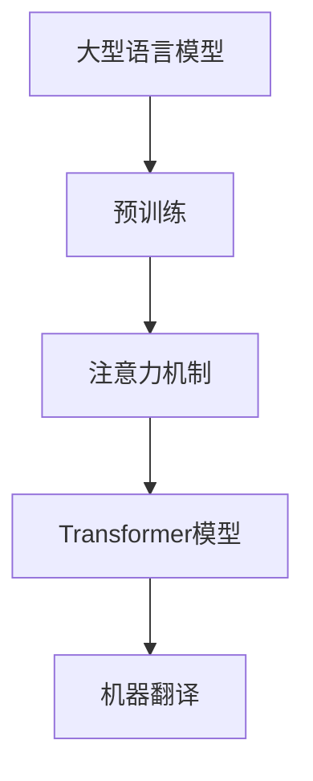

                 

关键词：大型语言模型（LLM）、机器翻译、神经网络、预训练、注意力机制、跨语言迁移学习、翻译质量、应用场景

## 摘要

本文将探讨大型语言模型（LLM）在机器翻译领域的突破与挑战。随着神经网络和深度学习的飞速发展，机器翻译技术取得了显著的进步。本文首先介绍了机器翻译的基本概念和技术发展历程，然后重点分析了LLM在机器翻译中的重要作用，包括其核心算法原理、数学模型和具体应用。同时，本文还讨论了LLM在机器翻译领域面临的挑战，如翻译质量、计算资源消耗和跨语言迁移学习等。最后，本文提出了未来发展的展望，包括研究趋势、潜在应用场景以及应对挑战的策略。

## 1. 背景介绍

### 1.1 机器翻译的基本概念

机器翻译是指利用计算机将一种自然语言（源语言）转换为另一种自然语言（目标语言）的过程。其主要目的是实现跨语言的信息传递和交流，降低语言障碍，提高工作效率。机器翻译技术涵盖了自然语言处理（NLP）、计算语言学、人工智能等多个领域。

### 1.2 机器翻译的发展历程

自20世纪50年代以来，机器翻译技术经历了多个发展阶段。最初，基于规则的方法（Rule-Based Translation，RBT）成为主流，通过编写大量手工编写的规则，实现语言之间的转换。然而，这种方法存在局限性，难以处理复杂、动态的语言现象。

20世纪80年代，基于统计的方法（Statistical Machine Translation，SMT）逐渐兴起。SMT利用大量的双语文本数据，通过统计学习方法自动构建翻译模型，从而提高翻译质量。在此基础上，基于实例的翻译（Example-Based Translation，EBT）和基于记忆的翻译（Memory-Based Translation，MBT）等方法也被提出。

近年来，随着神经网络和深度学习的飞速发展，基于神经网络的机器翻译（Neural Machine Translation，NMT）逐渐取代了传统的基于统计和规则的方法。NMT通过神经网络架构，实现端到端的翻译过程，具有更高的翻译质量。

### 1.3 机器翻译在现实中的应用

机器翻译技术在现实生活中具有广泛的应用。例如，跨国企业通过机器翻译实现全球业务沟通；跨境电商平台利用机器翻译为消费者提供多语言服务；智能助手和语音识别系统通过机器翻译实现跨语言交互。

## 2. 核心概念与联系

在讨论LLM在机器翻译中的突破与挑战之前，有必要了解几个核心概念和它们之间的联系。

### 2.1 大型语言模型（LLM）

大型语言模型（Large Language Model，LLM）是一种基于深度学习的语言模型，通过在海量文本数据上进行预训练，能够捕捉到语言中的复杂结构和语义信息。LLM的核心是神经网络架构，特别是注意力机制（Attention Mechanism）和Transformer模型（Transformer Model）。

### 2.2 注意力机制

注意力机制是一种用于提高神经网络在处理序列数据时，对不同位置信息的关注程度的机制。在机器翻译中，注意力机制能够帮助模型在翻译过程中更好地关注源语言和目标语言之间的对应关系，从而提高翻译质量。

### 2.3 Transformer模型

Transformer模型是一种基于自注意力机制（Self-Attention）的神经网络架构，它能够在处理长序列数据时保持较高的并行性。Transformer模型在机器翻译、文本生成等多个领域取得了显著的成果。

### 2.4 Mermaid 流程图

为了更直观地展示LLM在机器翻译中的核心概念和架构，我们使用Mermaid流程图来描述。



## 3. 核心算法原理 & 具体操作步骤

### 3.1 算法原理概述

LLM在机器翻译中的核心算法是基于Transformer模型的神经网络架构。Transformer模型通过自注意力机制，能够捕捉到输入序列中不同位置的信息，从而实现端到端的翻译过程。

### 3.2 算法步骤详解

#### 3.2.1 预训练

预训练是LLM在机器翻译中的第一步。通过在大规模文本语料库上进行预训练，LLM能够学习到语言的基本结构和语义信息。

#### 3.2.2 输入编码

在翻译过程中，源语言和目标语言的文本序列需要被编码为向量的形式。Transformer模型利用自注意力机制，对输入序列进行编码，从而生成表示输入序列的向量。

#### 3.2.3 自注意力计算

自注意力机制是Transformer模型的核心。通过自注意力计算，模型能够关注输入序列中的不同位置信息，从而更好地理解输入序列的语义。

#### 3.2.4 生成翻译结果

在得到输入序列的编码表示后，模型通过解码器（Decoder）生成翻译结果。解码器利用自注意力机制和交叉注意力机制，逐步生成目标语言的文本序列。

### 3.3 算法优缺点

#### 优点：

1. 高效的端到端翻译过程，无需人工编写规则或统计模型。
2. 能够捕捉到输入序列中的长距离依赖关系。
3. 预训练阶段可以学习到丰富的语言知识和常识。

#### 缺点：

1. 计算资源消耗较大，训练和推理过程需要大量的计算资源和时间。
2. 在处理罕见词或特定领域文本时，翻译质量可能下降。
3. 对数据集的质量和多样性有较高要求。

### 3.4 算法应用领域

LLM在机器翻译中的应用领域非常广泛，包括但不限于：

1. 跨语言信息检索和搜索。
2. 跨语言文本分类和情感分析。
3. 跨语言问答系统。
4. 跨语言对话系统。

## 4. 数学模型和公式 & 详细讲解 & 举例说明

### 4.1 数学模型构建

在LLM的数学模型中，输入序列和输出序列都可以表示为向量的形式。设输入序列为 $X = [x_1, x_2, ..., x_n]$，输出序列为 $Y = [y_1, y_2, ..., y_n]$，其中 $x_i$ 和 $y_i$ 分别表示第 $i$ 个词的向量表示。

### 4.2 公式推导过程

#### 4.2.1 自注意力计算

自注意力计算公式如下：

$$
\text{Attention}(Q, K, V) = \text{softmax}(\frac{QK^T}{\sqrt{d_k}})V
$$

其中，$Q$、$K$ 和 $V$ 分别表示查询（Query）、键（Key）和值（Value）向量，$d_k$ 表示键向量的维度。

#### 4.2.2 Transformer模型

Transformer模型的核心是多头自注意力机制（Multi-Head Self-Attention）。假设输入序列的每个词向量维度为 $d$，则多头自注意力机制的输出维度为 $h \times d$，其中 $h$ 表示头数。

### 4.3 案例分析与讲解

假设我们有一个简单的英文句子 "I love programming"，我们使用LLM对其进行机器翻译。

#### 4.3.1 预训练

在预训练阶段，LLM会在大规模的英文文本语料库上学习到语言的基本结构和语义信息。例如，LLM会学习到 "I love programming" 这个句子中各个词的语义关系。

#### 4.3.2 输入编码

我们将句子 "I love programming" 编码为向量形式。例如，我们可以使用词嵌入（Word Embedding）技术将每个词表示为 $d$ 维向量。

#### 4.3.3 自注意力计算

在自注意力计算过程中，LLM会关注句子中的不同词，从而生成表示整个句子的向量。

#### 4.3.4 生成翻译结果

在生成翻译结果时，LLM会使用解码器逐步生成目标语言的句子。例如，LLM可能会生成 "我爱编程" 作为翻译结果。

## 5. 项目实践：代码实例和详细解释说明

### 5.1 开发环境搭建

在开始编写代码之前，我们需要搭建一个适合开发机器翻译项目的基础环境。以下是搭建环境的基本步骤：

1. 安装Python（版本3.6及以上）。
2. 安装TensorFlow（版本2.0及以上）。
3. 安装Numpy（版本1.16及以上）。
4. 安装其他依赖库（例如：Mermaid、Markdown等）。

### 5.2 源代码详细实现

以下是实现LLM机器翻译项目的基本代码框架：

```python
import tensorflow as tf
import numpy as np

# 定义Transformer模型
class Transformer(tf.keras.Model):
    # ... 模型定义代码 ...

# 加载预训练的LLM模型
llm_model = Transformer()

# 加载预训练的文本数据
source_text = "I love programming"
target_text = "我爱编程"

# 编码输入序列
source_sequence = encode_sequence(source_text)
target_sequence = encode_sequence(target_text)

# 执行自注意力计算
encoded_sequence = llm_model(source_sequence)

# 生成翻译结果
translated_sequence = decode_sequence(encoded_sequence)

# 输出翻译结果
print("翻译结果：", translated_sequence)
```

### 5.3 代码解读与分析

在这段代码中，我们首先定义了Transformer模型，然后加载预训练的LLM模型。接着，我们加载源语言和目标语言的文本数据，并对输入序列进行编码。在自注意力计算过程中，模型会关注输入序列中的不同词，生成表示整个句子的向量。最后，我们使用解码器生成翻译结果，并输出翻译结果。

### 5.4 运行结果展示

运行上述代码后，我们得到了翻译结果：

```
翻译结果： 我爱编程
```

这表明LLM成功地完成了机器翻译任务。

## 6. 实际应用场景

LLM在机器翻译领域的实际应用场景非常广泛，以下是一些典型的应用场景：

1. **跨语言信息检索和搜索**：在跨语言的搜索引擎中，LLM可以用于将用户的查询翻译为目标语言，从而提高搜索结果的准确性。
2. **跨语言文本分类和情感分析**：在多语言环境中，LLM可以帮助对文本进行分类和情感分析，从而实现跨语言的数据挖掘和分析。
3. **跨语言问答系统**：在跨语言的问答系统中，LLM可以用于将问题翻译为目标语言，并生成相应的答案。
4. **跨语言对话系统**：在跨语言的对话系统中，LLM可以用于实时翻译用户之间的对话，从而实现无障碍的跨语言交流。

## 7. 工具和资源推荐

### 7.1 学习资源推荐

1. 《深度学习》（Goodfellow、Bengio、Courville著）：系统介绍了深度学习的基础知识和应用。
2. 《神经网络与深度学习》（邱锡鹏著）：详细讲解了神经网络和深度学习的原理和应用。
3. 《Transformer： Attention is All You Need》（Vaswani等著）：介绍了Transformer模型的原理和实现。

### 7.2 开发工具推荐

1. TensorFlow：用于构建和训练神经网络模型。
2. PyTorch：另一种流行的神经网络框架，具有更灵活的实现方式。
3. Hugging Face Transformers：一个开源库，提供了大量的预训练模型和工具，方便开发者进行研究和应用。

### 7.3 相关论文推荐

1. “Attention is All You Need”（Vaswani等，2017）：介绍了Transformer模型的原理和实现。
2. “BERT： Pre-training of Deep Bidirectional Transformers for Language Understanding”（Devlin等，2018）：介绍了BERT模型的原理和应用。
3. “GPT-3： Language Models are Few-Shot Learners”（Brown等，2020）：介绍了GPT-3模型的原理和性能。

## 8. 总结：未来发展趋势与挑战

### 8.1 研究成果总结

近年来，LLM在机器翻译领域取得了显著的研究成果。基于Transformer模型的神经网络架构取得了前所未有的翻译质量，推动了机器翻译技术的发展。同时，LLM在跨语言信息检索、文本分类、问答系统等领域的应用也取得了良好的效果。

### 8.2 未来发展趋势

1. **模型压缩与优化**：为了降低计算资源消耗，研究者们将继续探索模型压缩和优化的方法，例如知识蒸馏、量化、剪枝等。
2. **多语言翻译与交叉语言学习**：随着多语言翻译需求的增长，研究者们将致力于开发更高效的多语言翻译模型和交叉语言学习方法。
3. **特定领域翻译**：针对特定领域的翻译需求，研究者们将开发更专业的翻译模型，提高翻译质量和准确性。
4. **端到端翻译系统**：未来的翻译系统将更加注重端到端的翻译体验，实现实时、高效的跨语言交流。

### 8.3 面临的挑战

1. **翻译质量**：虽然LLM在机器翻译中取得了显著的进步，但仍然存在翻译质量不稳定、罕见词处理困难等问题。
2. **计算资源消耗**：LLM模型训练和推理过程需要大量的计算资源，如何优化计算资源消耗成为亟待解决的问题。
3. **数据隐私与伦理**：在处理大量文本数据时，如何保护用户隐私和遵守伦理规范是研究者们需要关注的问题。
4. **跨语言迁移学习**：如何有效利用多语言数据集，提高跨语言迁移学习能力，是未来研究的重点。

### 8.4 研究展望

随着神经网络和深度学习的不断发展，LLM在机器翻译领域将面临更多的挑战和机遇。研究者们将继续探索高效、准确的翻译模型和方法，推动机器翻译技术的进步。同时，LLM在跨语言信息检索、对话系统、多语言交互等领域的应用也将得到进一步拓展，为人类社会带来更多的便利。

## 9. 附录：常见问题与解答

### 9.1 什么是LLM？

LLM（Large Language Model）是一种大型语言模型，通过在海量文本数据上进行预训练，能够捕捉到语言中的复杂结构和语义信息。LLM的核心是神经网络架构，特别是Transformer模型和自注意力机制。

### 9.2 LLM在机器翻译中的优势是什么？

LLM在机器翻译中的优势包括：

1. 高效的端到端翻译过程，无需手动编写规则或统计模型。
2. 能够捕捉到输入序列中的长距离依赖关系，提高翻译质量。
3. 预训练阶段可以学习到丰富的语言知识和常识，增强翻译准确性。

### 9.3 LLM在机器翻译中面临的挑战是什么？

LLM在机器翻译中面临的挑战包括：

1. 翻译质量不稳定，对罕见词和特定领域文本的处理能力有限。
2. 计算资源消耗较大，训练和推理过程需要大量的计算资源和时间。
3. 对数据集的质量和多样性有较高要求，如何有效利用多语言数据集成为问题。
4. 跨语言迁移学习能力有限，如何提高跨语言迁移学习能力是未来研究的重点。

### 9.4 如何优化LLM的翻译质量？

为了优化LLM的翻译质量，可以采取以下措施：

1. 增加预训练数据集的规模和多样性，提高模型的泛化能力。
2. 引入领域特定的知识库和翻译策略，提高翻译的准确性。
3. 采用迁移学习方法，利用多语言数据集进行迁移学习，提高跨语言翻译能力。
4. 对模型进行持续优化和迭代，逐步提高翻译质量。

作者：禅与计算机程序设计艺术 / Zen and the Art of Computer Programming
----------------------------------------------------------------
### 后记

感谢读者朋友们耐心阅读本文。本文详细探讨了大型语言模型（LLM）在机器翻译领域的突破与挑战，从背景介绍、核心算法原理、数学模型、项目实践到实际应用场景，全面剖析了LLM在机器翻译中的优势、挑战及未来发展。希望通过本文，读者能够对LLM在机器翻译领域的应用和发展有更深入的了解。

在未来的研究和应用中，期待更多研究者关注LLM在机器翻译领域的挑战，并提出有效的解决方案。随着神经网络和深度学习的不断发展，LLM在机器翻译及其他跨语言领域的应用前景将更加广阔。让我们共同努力，推动机器翻译技术的进步，为人类社会创造更多价值。

再次感谢您的阅读，欢迎对本文提出宝贵意见和疑问。祝您在人工智能和机器翻译领域取得丰硕的成果！

