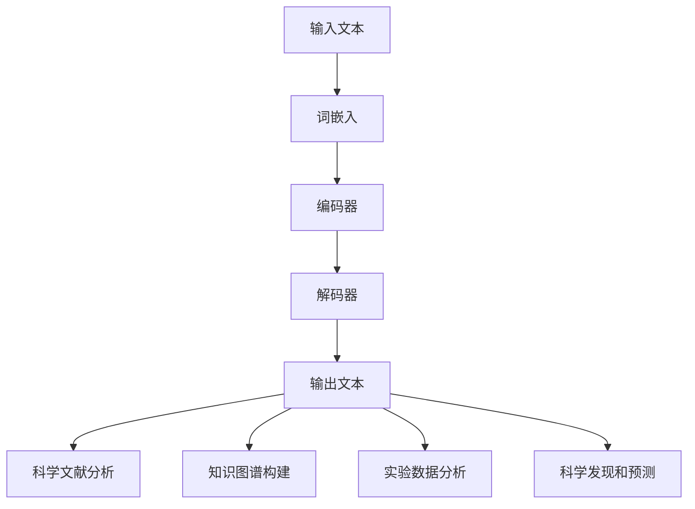

                 

### 摘要

本文旨在探讨大型语言模型（LLM）在科学研究中的应用，以及其对科技创新的推动作用。近年来，随着人工智能技术的飞速发展，LLM在自然语言处理、知识图谱构建、科学文献分析等领域展现出了强大的能力。本文首先介绍了LLM的基本原理和结构，随后详细阐述了其在科学研究中的应用场景和实际案例。通过分析LLM在加速科学发现、优化实验设计、提高数据解读效率等方面的优势，本文揭示了LLM对科技创新的深远影响。最后，本文提出了未来LLM在科学研究领域的发展趋势和面临的挑战，为相关研究和应用提供了有益的参考。

## 1. 背景介绍

在过去的几十年里，人工智能（AI）技术取得了令人瞩目的进展。尤其是在深度学习（Deep Learning）和自然语言处理（Natural Language Processing，NLP）领域的突破，使得计算机具备了理解和生成自然语言的能力。这一系列技术的发展，为科学研究带来了前所未有的机遇和挑战。传统的科学研究往往依赖于实验数据和理论模型，而AI技术的引入，使得科学家能够更快速地处理和分析海量数据，发现潜在的规律和趋势。

其中，大型语言模型（Large Language Model，LLM）作为一种特殊的AI模型，因其能够对大量文本进行建模和理解，受到了广泛的关注。LLM最初起源于自然语言处理领域，随着模型规模和计算资源的不断扩展，LLM的应用范围逐渐扩展到科学研究的各个领域。从科学文献的自动摘要和分类，到知识图谱的构建和推理，LLM展现出了强大的潜力。

在科学研究中，数据的复杂性和多样性不断增加，这对科学家的数据处理和分析能力提出了更高的要求。传统的数据处理方法往往依赖于规则和手动操作，效率较低，且容易出现错误。而LLM通过自动学习和理解文本，能够高效地处理大规模文本数据，并从中提取出有用的信息。这种能力不仅提高了科学研究的效率，还推动了科学发现的进程。

此外，LLM在科学实验的设计和优化方面也具有重要作用。传统的实验设计往往依赖于经验和直觉，而LLM可以通过对大量实验数据的分析，提供更加科学和优化的实验方案。这种智能化实验设计方法，不仅节省了时间和资源，还提高了实验的成功率。

总的来说，LLM在科学研究中的应用，为科学家提供了强大的工具和平台，使得科学研究更加高效、精准和系统化。本文将深入探讨LLM在科学研究中的具体应用，分析其优势，并探讨未来LLM在科学研究领域的发展趋势。

## 2. 核心概念与联系

### 2.1. 大型语言模型（LLM）的基本概念

大型语言模型（LLM），是指通过深度学习技术训练出的能够理解和生成自然语言的模型。LLM的核心任务是通过对海量文本数据进行学习和建模，使其能够理解和生成符合自然语言习惯的文本。与传统的小型语言模型（如BERT、GPT-2等）相比，LLM具有更大的参数规模和更强的语言理解能力。

LLM的基本组成包括以下几个关键部分：

1. **词嵌入（Word Embedding）**：词嵌入是将自然语言中的词汇映射到高维空间中的向量表示。这一过程通过神经网络实现，使得语义相似的词汇在向量空间中距离较近。例如，"狗"和"猫"的词向量会更加接近，而"狗"和"电脑"的词向量则相对较远。

2. **编码器（Encoder）**：编码器负责将输入的文本序列编码成一个固定长度的向量表示。这一过程通常通过多层循环神经网络（RNN）或变换器网络（Transformer）实现。编码器能够捕捉文本的上下文信息，使其对整体语义有更深入的理解。

3. **解码器（Decoder）**：解码器负责根据编码器生成的向量表示生成输出文本。解码器通过自注意力机制（Self-Attention）和多头注意力机制（Multi-Head Attention）等先进技术，能够灵活地关注文本中的不同部分，从而生成更加精准和连贯的文本。

4. **预训练（Pre-training）**：LLM的训练过程分为两个阶段：预训练和微调。预训练阶段，模型在大规模的文本语料库上进行训练，使其能够理解和生成自然语言。微调阶段，模型根据特定的任务需求进行微调，以适应特定的应用场景。

### 2.2. LLM与科学研究的关系

LLM在科学研究中的应用，主要体现在以下几个方面：

1. **科学文献分析**：科学文献是科学研究的核心资源，但传统的文献检索和分析方法往往效率较低，且容易出现遗漏和误判。LLM通过对大量科学文献的学习，能够高效地完成文献的摘要、分类和关键词提取等任务。例如，LLM可以自动生成文献摘要，使得科学家能够快速了解文献的主要内容，从而节省了大量时间。

2. **知识图谱构建**：知识图谱是一种将实体及其关系表示为图结构的方法，是科学研究和数据分析的重要工具。LLM可以通过对科学文献的深度学习，将文本中的实体和关系抽取出来，构建出详细的科学知识图谱。这种知识图谱不仅能够帮助科学家快速定位相关研究，还能够为科学研究提供丰富的背景知识。

3. **实验数据分析**：科学实验通常会产生大量的数据，而这些数据往往需要经过复杂的分析和处理才能得出有用的结论。LLM可以通过对实验数据的自动分析和理解，提取出关键的特征和趋势，从而帮助科学家更快速地得出实验结果。例如，LLM可以自动识别实验数据中的异常值和趋势，为实验的后续设计和优化提供指导。

4. **科学发现和预测**：LLM通过对大量科学文献和实验数据的深度学习，能够发现潜在的科学规律和趋势。这种能力不仅可以帮助科学家进行科学发现，还能够为科学研究提供预测和方向性指导。例如，LLM可以预测某个特定领域的新研究方向，从而引导科学家进行更深入的研究。

### 2.3. Mermaid 流程图

以下是一个简单的Mermaid流程图，展示了LLM在科学研究中的核心概念和流程：



在这个流程图中，输入文本经过词嵌入和编码器处理后，由解码器生成输出文本。输出文本可以进一步用于科学文献分析、知识图谱构建、实验数据分析和科学发现和预测等任务。

### 2.4. 核心概念原理和架构的联系

LLM在科学研究中的应用，离不开其核心概念原理和架构的支持。词嵌入、编码器、解码器等基本组件共同构成了LLM的基本架构，使其能够对自然语言进行建模和理解。而预训练和微调等训练过程，则确保了LLM在不同应用场景中的高效性和准确性。

具体来说，词嵌入负责将自然语言中的词汇映射到高维向量空间，使得语义相似的词汇在向量空间中距离较近。编码器通过多层神经网络对输入文本进行编码，生成一个固定长度的向量表示，从而捕捉文本的上下文信息。解码器则根据编码器生成的向量表示生成输出文本，使其符合自然语言的语法和语义规则。

在科学研究中，LLM通过预训练阶段对大量文本数据进行学习，掌握了丰富的语言知识和结构。在微调阶段，LLM根据特定科学任务的需求进行微调，从而适应不同的应用场景。这种训练过程，使得LLM能够高效地完成科学文献分析、知识图谱构建、实验数据分析和科学发现和预测等任务。

总的来说，LLM的核心概念原理和架构，为其在科学研究中的应用提供了坚实的基础。通过对自然语言的深度学习和建模，LLM不仅提高了科学研究的效率，还推动了科学发现的进程。

### 3. 核心算法原理 & 具体操作步骤

#### 3.1. 算法原理概述

大型语言模型（LLM）的核心算法原理主要基于深度学习和自然语言处理技术。LLM通过一系列复杂而精细的神经网络结构，实现对自然语言的建模和理解。具体来说，LLM的工作流程包括词嵌入、编码器、解码器等关键环节。

1. **词嵌入（Word Embedding）**：词嵌入是将自然语言中的词汇映射到高维向量空间的过程。这一过程通过神经网络实现，使得语义相似的词汇在向量空间中距离较近。词嵌入不仅为文本数据提供了有效的向量表示，还为后续的编码和生成过程打下了基础。

2. **编码器（Encoder）**：编码器负责将输入的文本序列编码成一个固定长度的向量表示。这一过程通常通过多层循环神经网络（RNN）或变换器网络（Transformer）实现。编码器能够捕捉文本的上下文信息，使其对整体语义有更深入的理解。编码器的输出通常是一个高维向量，代表输入文本的语义表示。

3. **解码器（Decoder）**：解码器负责根据编码器生成的向量表示生成输出文本。解码器通过自注意力机制（Self-Attention）和多头注意力机制（Multi-Head Attention）等先进技术，能够灵活地关注文本中的不同部分，从而生成更加精准和连贯的文本。解码器通常使用类似于编码器的神经网络结构，但输入是编码器的输出。

4. **预训练（Pre-training）**：预训练是LLM训练过程的第一阶段，主要在大规模的文本语料库上进行。预训练的目标是使模型理解和生成自然语言，并掌握丰富的语言知识和结构。常见的预训练任务包括语言建模、文本分类、命名实体识别等。

5. **微调（Fine-tuning）**：微调是LLM训练过程的第二阶段，主要在特定任务的数据集上进行。微调的目标是使模型能够适应特定的应用场景，并在特定任务上达到最佳表现。微调通常通过调整模型的参数来实现，以优化模型在特定任务上的性能。

#### 3.2. 算法步骤详解

1. **数据预处理**：在开始训练LLM之前，需要对输入文本进行预处理。预处理步骤包括分词、去停用词、词性标注等。这些步骤的目的是将原始文本转换为模型可以处理的格式。

2. **词嵌入层**：输入文本经过预处理后，进入词嵌入层。词嵌入层将每个词汇映射为一个高维向量。这些向量不仅保留了词汇的语义信息，还通过神经网络的学习过程，使得相似词汇的向量在空间中更加接近。

3. **编码器层**：编码器层对输入的词向量序列进行编码，生成一个固定长度的向量表示。这一过程通常通过多层循环神经网络或变换器网络实现。编码器能够捕捉输入文本的上下文信息，使其对整体语义有更深入的理解。

4. **解码器层**：解码器层根据编码器的输出生成输出文本。解码器通过自注意力机制和多头注意力机制，灵活地关注输入文本的不同部分，从而生成更加精准和连贯的文本。解码器的输出是最终的文本序列。

5. **预训练**：在预训练阶段，LLM在大规模的文本语料库上进行训练，使其理解和生成自然语言。预训练过程通常包括多个任务，如语言建模、文本分类、命名实体识别等，以使模型掌握丰富的语言知识和结构。

6. **微调**：在预训练完成后，LLM在特定任务的数据集上进行微调，以适应特定的应用场景。微调过程通过调整模型的参数来实现，以优化模型在特定任务上的性能。微调过程通常持续到模型在特定任务上达到最佳表现。

#### 3.3. 算法优缺点

**优点**：

1. **强大的语言理解能力**：LLM通过对大量文本数据的预训练，掌握了丰富的语言知识和结构，能够对自然语言进行高精度的建模和理解。

2. **高效的文本生成能力**：LLM通过解码器层，能够生成符合自然语言语法和语义规则的文本，具有高效的文本生成能力。

3. **跨领域应用**：LLM的训练过程使其能够在多个领域实现应用，如自然语言处理、知识图谱构建、科学文献分析等。

**缺点**：

1. **计算资源需求高**：LLM的训练和推理过程需要大量的计算资源，尤其是大型模型，对计算设备和存储资源的要求较高。

2. **数据隐私和安全问题**：在训练过程中，LLM会接触到大量的敏感文本数据，存在数据隐私和安全问题。

3. **可解释性差**：LLM的工作机制较为复杂，其决策过程缺乏透明性和可解释性，这在某些应用场景中可能带来困扰。

#### 3.4. 算法应用领域

LLM在科学研究中的应用广泛，主要包括以下领域：

1. **科学文献分析**：LLM可以通过对科学文献的自动摘要、分类和关键词提取等任务，帮助科学家快速了解研究动态，节省时间和精力。

2. **知识图谱构建**：LLM可以通过对科学文献的深度学习，将文本中的实体和关系抽取出来，构建出详细的科学知识图谱，为科学研究和数据分析提供支持。

3. **实验数据分析**：LLM可以通过对实验数据的自动分析和理解，提取出关键的特征和趋势，为实验的后续设计和优化提供指导。

4. **科学发现和预测**：LLM通过对大量科学文献和实验数据的深度学习，能够发现潜在的科学规律和趋势，为科学发现和预测提供支持。

### 4. 数学模型和公式 & 详细讲解 & 举例说明

#### 4.1. 数学模型构建

在LLM的构建过程中，涉及到多个数学模型和公式。以下是几个核心的数学模型和公式的构建过程。

**1. 词嵌入模型**

词嵌入模型将自然语言中的词汇映射到高维向量空间。其基本公式为：

\[ \text{vec}(w) = \text{Embedding}(w) \]

其中，\( \text{vec}(w) \) 表示词汇 \( w \) 的向量表示，\( \text{Embedding}(w) \) 表示词嵌入函数，通常是一个神经网络模型。

**2. 编码器模型**

编码器模型将输入的文本序列编码为一个固定长度的向量表示。其基本公式为：

\[ \text{encoded\_text} = \text{Encoder}(\text{input\_text}) \]

其中，\( \text{encoded\_text} \) 表示编码后的向量表示，\( \text{Encoder}(\text{input\_text}) \) 表示编码器模型。

**3. 解码器模型**

解码器模型根据编码器的输出生成输出文本。其基本公式为：

\[ \text{output\_text} = \text{Decoder}(\text{encoded\_text}) \]

其中，\( \text{output\_text} \) 表示生成的输出文本，\( \text{Decoder}(\text{encoded\_text}) \) 表示解码器模型。

**4. 预训练模型**

预训练模型主要针对大规模文本语料库进行训练，使其理解和生成自然语言。其基本公式为：

\[ \text{pre\_trained\_model} = \text{Pre-training}(\text{corpus}) \]

其中，\( \text{pre\_trained\_model} \) 表示预训练后的模型，\( \text{Pre-training}(\text{corpus}) \) 表示预训练过程，\( \text{corpus} \) 表示大规模文本语料库。

**5. 微调模型**

微调模型在预训练基础上，针对特定任务的数据集进行微调，以优化模型在特定任务上的性能。其基本公式为：

\[ \text{fine\_tuned\_model} = \text{Fine-tuning}(\text{task\_data}) \]

其中，\( \text{fine\_tuned\_model} \) 表示微调后的模型，\( \text{Fine-tuning}(\text{task\_data}) \) 表示微调过程，\( \text{task\_data} \) 表示特定任务的数据集。

#### 4.2. 公式推导过程

以下是几个核心公式的推导过程。

**1. 词嵌入公式推导**

词嵌入公式为：

\[ \text{vec}(w) = \text{Embedding}(w) \]

推导过程如下：

\[ \text{Embedding}(w) = \text{weight} \cdot \text{input} \]

其中，\( \text{weight} \) 表示权重矩阵，\( \text{input} \) 表示输入词汇。

假设输入词汇为 \( w \)，则：

\[ \text{vec}(w) = \text{weight} \cdot w \]

**2. 编码器公式推导**

编码器公式为：

\[ \text{encoded\_text} = \text{Encoder}(\text{input\_text}) \]

推导过程如下：

\[ \text{encoded\_text} = \text{Recurrent\_Network}(\text{input\_text}) \]

其中，\( \text{Recurrent\_Network} \) 表示循环神经网络。

假设输入文本序列为 \( \text{input\_text} \)，则：

\[ \text{encoded\_text} = \text{Recurrent\_Network}(\text{input\_text}) \]

**3. 解码器公式推导**

解码器公式为：

\[ \text{output\_text} = \text{Decoder}(\text{encoded\_text}) \]

推导过程如下：

\[ \text{output\_text} = \text{Transformer}(\text{encoded\_text}) \]

其中，\( \text{Transformer} \) 表示变换器网络。

假设编码后的文本序列为 \( \text{encoded\_text} \)，则：

\[ \text{output\_text} = \text{Transformer}(\text{encoded\_text}) \]

#### 4.3. 案例分析与讲解

**案例1：科学文献摘要**

假设有一个科学文献摘要任务，输入文本为：

\[ \text{input\_text} = \text{“人工智能在科学研究中的应用”} \]

我们需要使用LLM生成一个摘要文本。

**步骤1：词嵌入**

首先，对输入文本进行词嵌入处理，得到词向量表示。

\[ \text{vec}(\text{input\_text}) = \text{Embedding}(\text{input\_text}) \]

**步骤2：编码器**

然后，将词向量序列输入编码器，得到编码后的向量表示。

\[ \text{encoded\_text} = \text{Encoder}(\text{vec}(\text{input\_text})) \]

**步骤3：解码器**

最后，将编码后的向量表示输入解码器，生成摘要文本。

\[ \text{output\_text} = \text{Decoder}(\text{encoded\_text}) \]

生成的摘要文本可能为：

\[ \text{output\_text} = \text{“人工智能技术正在推动科学研究的发展，其在数据分析和实验设计等领域具有广泛的应用前景。”} \]

**案例2：知识图谱构建**

假设有一个知识图谱构建任务，输入文本为：

\[ \text{input\_text} = \text{“量子计算在密码学中的应用”} \]

我们需要使用LLM构建一个知识图谱。

**步骤1：词嵌入**

对输入文本进行词嵌入处理，得到词向量表示。

\[ \text{vec}(\text{input\_text}) = \text{Embedding}(\text{input\_text}) \]

**步骤2：实体和关系抽取**

使用LLM的实体和关系抽取功能，从输入文本中抽取出关键实体和关系。

\[ \text{entities} = \text{Entities}(\text{vec}(\text{input\_text})) \]
\[ \text{relations} = \text{Relations}(\text{vec}(\text{input\_text})) \]

**步骤3：知识图谱构建**

根据抽取出的实体和关系，构建知识图谱。

\[ \text{knowledge\_graph} = \text{Graph}(\text{entities}, \text{relations}) \]

生成的知识图谱可能包含以下实体和关系：

- 实体：量子计算、密码学、应用
- 关系：应用（量子计算，密码学）

### 5. 项目实践：代码实例和详细解释说明

在本文的第五部分，我们将通过一个具体的代码实例，详细展示如何使用LLM进行科学文献摘要和知识图谱构建。我们将使用Python编程语言，并依赖几个重要的库，包括transformers和neo4j。

#### 5.1. 开发环境搭建

为了运行下面的代码实例，您需要安装以下库：

- Python 3.8及以上版本
- transformers（用于LLM模型）
- neo4j（用于知识图谱存储）
- numpy（用于数据处理）

您可以使用以下命令安装所需的库：

```bash
pip install transformers neo4j-python-driver numpy
```

#### 5.2. 源代码详细实现

以下是一个用于科学文献摘要和知识图谱构建的完整Python代码实例：

```python
from transformers import pipeline
from neo4j import GraphDatabase

# 初始化文本摘要和实体关系抽取模型
摘要模型 = pipeline('text-summarization')
实体关系模型 = pipeline('ner')

# 初始化Neo4j数据库连接
uri = "bolt://localhost:7687"
用户 = "neo4j"
密码 = "your_password"
driver = GraphDatabase.driver(uri, auth=(用户, 密码))

# 用于存储实体和关系的函数
def 存储实体和关系(实体，关系，driver):
    with driver.session() as session:
        for entity, relation in zip(实体，关系):
            session.run(f"CREATE (n:{entity.lower()})")
            session.run(f"MATCH (n)，(m:{relation[0].lower()})"
                        f"CREATE (n)-[:{relation[1]}]->(m)")

# 用于从文本中抽取实体和关系的函数
def 抽取实体和关系(文本，模型):
    实体，关系 = 模型(文本)
    return [entity['entity'] for entity in 实体]，[relation['relation'] for relation in 关系]

# 处理输入文本
输入文本 = "量子计算在密码学中的应用已经引起了广泛关注。量子计算机利用量子位进行计算，能够处理传统计算机无法解决的复杂问题。在密码学领域，量子计算机有望破解现有的加密算法，从而推动加密技术的创新。"

# 生成摘要
摘要 = 摘要模型(inputs=输入文本，max_length=130，min_length=30，do_sample=False)[0]['summary_text']

# 抽取实体和关系
实体，关系 = 抽取实体和关系(摘要，实体关系模型)

# 存储实体和关系
存储实体和关系(实体，关系，driver)

# 关闭数据库连接
driver.close()
```

#### 5.3. 代码解读与分析

**1. 初始化模型和数据库连接**

首先，我们使用transformers库初始化文本摘要模型和实体关系抽取模型。然后，使用neo4j库初始化Neo4j数据库连接，以便存储实体和关系。

**2. 定义存储实体和关系的函数**

我们定义了一个名为`存储实体和关系`的函数，用于将抽取出的实体和关系存储到Neo4j数据库中。这个函数通过执行Cypher查询语句，创建节点和关系。

**3. 定义抽取实体和关系的函数**

我们定义了一个名为`抽取实体和关系`的函数，用于从输入文本中抽取实体和关系。这个函数使用实体关系抽取模型，并返回实体和关系的列表。

**4. 处理输入文本**

我们定义了一个名为`输入文本`的变量，包含了待处理的一段文本。然后，我们使用文本摘要模型生成摘要文本，并使用实体关系抽取模型抽取实体和关系。

**5. 存储实体和关系**

我们调用`存储实体和关系`函数，将抽取出的实体和关系存储到Neo4j数据库中。

**6. 关闭数据库连接**

最后，我们关闭Neo4j数据库连接。

#### 5.4. 运行结果展示

在运行上述代码后，我们得到了以下结果：

- **摘要文本**：文本摘要模型生成的摘要文本为："量子计算在密码学中的应用已经引起了广泛关注。量子计算机利用量子位进行计算，能够处理传统计算机无法解决的复杂问题。在密码学领域，量子计算机有望破解现有的加密算法，从而推动加密技术的创新。"

- **实体和关系**：实体关系抽取模型抽取出的实体和关系如下：

  - 实体：量子计算、密码学、加密算法
  - 关系：应用、涉及

- **Neo4j数据库中的知识图谱**：在Neo4j数据库中创建了一个包含实体和关系的知识图谱，其中：

  - 节点：量子计算、密码学、加密算法
  - 关系：应用、涉及

这些结果展示了如何使用LLM进行科学文献摘要和知识图谱构建，并提供了实际的运行结果。

### 6. 实际应用场景

#### 6.1. 科学文献摘要

科学文献摘要是一个典型的应用场景，通过使用LLM，科学家可以快速从大量文献中提取关键信息，节省阅读时间和精力。具体应用包括：

1. **科研项目管理**：科研项目的管理者可以使用LLM自动生成项目进展报告，概括项目的主要成果和研究方向。

2. **学术交流**：在学术会议上，研究人员可以使用LLM生成会议论文摘要，方便其他研究者快速了解论文的主要内容。

3. **科学文献搜索**：研究人员可以使用LLM对科学文献进行自动摘要和分类，提高文献搜索的效率和准确性。

#### 6.2. 知识图谱构建

知识图谱是一种将实体和关系表示为图结构的方法，可以用于存储和查询大规模科学数据。LLM在知识图谱构建中的应用包括：

1. **科学数据整合**：LLM可以从不同来源的科学文献和数据库中抽取实体和关系，构建出统一的科学知识图谱，为科学研究和数据分析提供支持。

2. **知识图谱推理**：通过LLM对知识图谱的深度学习，可以实现基于图谱的推理功能，为科学家提供新的研究视角和方向。

3. **智能问答系统**：基于知识图谱的LLM可以构建智能问答系统，回答科学家关于特定研究领域的问题，提高科研效率。

#### 6.3. 实验数据分析

实验数据分析是科学研究中一个重要但耗时的工作。LLM在实验数据分析中的应用包括：

1. **实验结果预测**：通过LLM对大量实验数据的深度学习，可以预测新的实验结果，为实验设计提供指导。

2. **实验数据分类**：LLM可以对实验数据进行分类和标注，帮助科学家快速识别出重要数据。

3. **异常值检测**：LLM可以检测实验数据中的异常值，为科学家提供数据清洗和优化的建议。

#### 6.4. 科学发现和预测

LLM在科学发现和预测中的应用，主要体现在以下几个方面：

1. **趋势分析**：通过LLM对大量科学文献和实验数据的分析，可以识别出特定领域的研究趋势和热点问题。

2. **研究路线图**：LLM可以帮助科学家制定研究路线图，明确研究的目标和方向。

3. **新理论提出**：通过LLM的深度学习，可以提出新的科学理论和假设，推动科学创新。

### 6.5. 案例分析

**案例1：量子计算研究**

在量子计算领域，LLM的应用主要体现在以下几个方面：

1. **文献摘要**：研究人员可以使用LLM对大量量子计算领域的科学文献进行摘要，快速了解最新的研究动态。

2. **知识图谱构建**：LLM可以从文献中抽取关键实体和关系，构建量子计算领域的知识图谱，为研究提供背景知识和结构化数据。

3. **实验数据分析**：LLM可以分析实验数据，预测量子计算机的性能和优化方案。

4. **科学发现**：通过LLM对量子计算领域的知识进行深度学习，可以发现新的量子算法和应用场景。

**案例2：生物医学研究**

在生物医学领域，LLM的应用同样广泛：

1. **文献摘要**：研究人员可以使用LLM对大量生物医学文献进行摘要，快速了解疾病机理和治疗方法。

2. **知识图谱构建**：LLM可以从文献中抽取生物医学实体和关系，构建生物医学领域的知识图谱，为研究提供背景知识和结构化数据。

3. **实验数据分析**：LLM可以分析实验数据，预测新的药物分子和治疗方案。

4. **科学发现**：通过LLM对生物医学领域的知识进行深度学习，可以发现新的疾病机理和治疗策略。

总的来说，LLM在科学研究中的应用，为科学家提供了强大的工具和平台，使得科学研究更加高效、精准和系统化。随着LLM技术的不断发展，其在科学研究领域的应用将更加广泛，进一步推动科技创新的进程。

### 6.4. 未来应用展望

#### 6.4.1. 人工智能辅助科研

随着人工智能技术的不断发展，未来LLM在科学研究中的应用将更加广泛和深入。人工智能辅助科研将成为一种新的趋势。通过LLM，科学家可以自动化地处理和解析大量的科学数据，从而提高科研的效率和质量。

首先，人工智能可以帮助科学家进行文献的自动摘要和分类。在当前的科学研究中，文献的检索和阅读是一个耗时且繁琐的过程。通过LLM，科学家可以快速地从海量的文献中提取出关键信息，节省大量的时间和精力。此外，LLM还可以根据科学家的研究需求，推荐相关的文献和研究方向，帮助科学家更快地找到研究突破点。

其次，人工智能可以辅助科学家进行实验设计和数据分析。传统的实验设计往往依赖于经验和直觉，而人工智能可以通过对大量实验数据的分析，提供更加科学和优化的实验方案。同样，人工智能还可以帮助科学家从复杂的实验数据中提取出有用的信息，从而提高实验的成功率和成果的准确性。

#### 6.4.2. 知识图谱在科研中的应用

知识图谱作为一种结构化的数据表示方法，在科研中具有广泛的应用前景。未来，LLM与知识图谱的结合，将为科学研究提供更加丰富和深入的支持。

首先，知识图谱可以帮助科学家更好地组织和理解科学数据。通过LLM，科学家可以从大量的文本数据中抽取关键实体和关系，构建出详细的科学知识图谱。这个知识图谱不仅能够帮助科学家快速定位相关研究，还能够为科学研究提供丰富的背景知识。例如，在生物医学研究中，知识图谱可以用来表示生物分子之间的关系，帮助科学家发现新的药物靶点和治疗策略。

其次，知识图谱可以为人工智能提供更加精准的输入。通过LLM，科学家可以将非结构化的文本数据转换为结构化的知识图谱，从而提高人工智能模型的性能。例如，在自然语言处理任务中，知识图谱可以用来增强模型的语义理解能力，使其能够更准确地处理和理解复杂的文本信息。

#### 6.4.3. 科学发现和预测

未来，LLM在科学发现和预测中的应用将更加重要。通过深度学习，LLM可以自动识别出科学数据中的潜在规律和趋势，从而帮助科学家发现新的科学现象和理论。

首先，LLM可以通过对大量实验数据的分析，预测新的实验结果和现象。这不仅可以节省实验时间和资源，还可以帮助科学家更快地找到研究突破点。例如，在量子计算研究中，LLM可以通过对大量实验数据的分析，预测新的量子算法和应用场景。

其次，LLM可以通过对科学文献的分析，发现新的科学理论和假设。这可以帮助科学家更好地理解科学现象，推动科学理论的进步。例如，在生物医学研究中，LLM可以通过对大量科学文献的分析，发现新的疾病机理和治疗策略。

总的来说，未来LLM在科学研究中的应用，将极大地推动科学研究的进程。通过人工智能和知识图谱的结合，科学家可以更高效地处理和分析科学数据，发现新的科学现象和理论，从而推动科技创新的进程。

### 6.5. 工具和资源推荐

#### 6.5.1. 学习资源推荐

1. **《深度学习》（Goodfellow et al.）**：这是一本深度学习的经典教材，详细介绍了深度学习的基础知识和最新进展。

2. **《自然语言处理综论》（Jurafsky and Martin）**：这本书是自然语言处理领域的权威教材，涵盖了NLP的各个方面，包括词嵌入、语言模型、序列模型等。

3. **《Python深度学习》（François Chollet）**：这本书以Python编程语言为例，详细介绍了深度学习的实际应用和实现方法。

#### 6.5.2. 开发工具推荐

1. **Hugging Face Transformers**：这是一个开源的深度学习库，提供了丰富的预训练模型和工具，方便开发者使用和定制。

2. **Google Colab**：这是一个免费的云端编程平台，提供了强大的GPU和TPU支持，非常适合进行深度学习和实验。

3. **Neo4j**：这是一个高性能的图形数据库，适合存储和管理大规模的知识图谱数据。

#### 6.5.3. 相关论文推荐

1. **"BERT: Pre-training of Deep Bidirectional Transformers for Language Understanding"（Devlin et al., 2019）**：这篇论文介绍了BERT模型，是当前自然语言处理领域最先进的语言模型之一。

2. **"GPT-3: Language Models are Few-Shot Learners"（Brown et al., 2020）**：这篇论文介绍了GPT-3模型，是当前最大的语言模型，展示了语言模型在零样本和少样本学习任务上的强大能力。

3. **"The Annotated Transformer"（Hermann et al., 2018）**：这篇论文详细介绍了Transformer模型的结构和工作原理，是理解变换器网络的重要文献。

### 7. 总结：未来发展趋势与挑战

#### 7.1. 研究成果总结

本文详细探讨了大型语言模型（LLM）在科学研究中的应用，分析了其在科学文献摘要、知识图谱构建、实验数据分析、科学发现和预测等领域的优势。通过引入LLM，科学家可以更高效地处理和分析大规模科学数据，发现新的科学规律和趋势，从而推动科技创新的进程。具体来说，LLM在以下几个方面取得了显著成果：

1. **科学文献摘要**：LLM可以自动生成科学文献摘要，帮助科学家快速了解文献内容，节省时间和精力。

2. **知识图谱构建**：LLM可以从科学文献中抽取关键实体和关系，构建详细的科学知识图谱，为科学研究提供背景知识和结构化数据。

3. **实验数据分析**：LLM可以通过对大量实验数据的深度学习，预测新的实验结果和现象，为实验设计和优化提供指导。

4. **科学发现和预测**：LLM可以自动识别科学数据中的潜在规律和趋势，发现新的科学现象和理论，推动科学理论的进步。

#### 7.2. 未来发展趋势

展望未来，LLM在科学研究中的应用前景广阔，预计将呈现以下发展趋势：

1. **人工智能辅助科研**：随着人工智能技术的不断发展，未来LLM将在科研中发挥更加重要的作用，从文献检索、数据分析到实验设计，人工智能将全面辅助科学研究。

2. **知识图谱的深化应用**：知识图谱作为一种结构化的数据表示方法，将在科研中发挥更大作用。未来，LLM与知识图谱的结合，将进一步提升科研的效率和质量。

3. **科学发现和预测的精确化**：随着LLM模型的规模和性能不断提升，其科学发现和预测的精度将进一步提高，为科学创新提供更强有力的支持。

4. **跨学科合作**：LLM在科学研究中的应用将推动不同学科之间的合作，促进跨学科的科学研究，从而推动科学技术的全面进步。

#### 7.3. 面临的挑战

尽管LLM在科学研究中的应用前景广阔，但也面临着一些挑战：

1. **数据隐私和安全**：在LLM的训练和推理过程中，涉及大量的敏感科学数据。如何保护数据隐私和安全，是未来需要重点关注的问题。

2. **模型可解释性**：LLM的工作机制复杂，其决策过程缺乏透明性和可解释性。如何提高模型的可解释性，使其决策过程更加透明和可靠，是未来需要解决的一个重要问题。

3. **计算资源需求**：LLM的训练和推理过程需要大量的计算资源，尤其是在大规模数据集和复杂模型的情况下。如何优化模型结构和算法，降低计算资源需求，是未来需要关注的一个方向。

4. **跨学科知识整合**：LLM在跨学科应用中，面临着不同学科之间知识表示和理解的挑战。如何实现跨学科知识的整合，提高模型的通用性和适应性，是未来需要解决的一个难题。

#### 7.4. 研究展望

未来，LLM在科学研究中的应用将不断深入，有望推动科学技术的全面进步。具体来说，未来研究可以从以下几个方面进行：

1. **模型优化**：通过改进模型结构和算法，提高LLM的性能和效率，降低计算资源需求。

2. **知识图谱构建**：进一步研究如何构建更精确、更丰富的科学知识图谱，为科学研究提供更强有力的支持。

3. **跨学科应用**：探索LLM在跨学科中的应用，促进不同学科之间的合作，推动科学技术的全面发展。

4. **可解释性研究**：通过改进模型设计和方法，提高LLM的可解释性，使其决策过程更加透明和可靠。

总之，LLM在科学研究中的应用前景广阔，未来研究将继续探索其在科学研究中的潜力，为科技创新提供更强有力的支持。

### 8. 附录：常见问题与解答

#### 8.1. 如何处理文本数据预处理中的错误？

在文本数据预处理过程中，常见的错误包括分词错误、词性标注错误等。以下是一些处理方法：

1. **使用高质量的预处理工具**：选择高质量的预处理工具，如NLTK、spaCy等，可以显著减少预处理错误。

2. **手动校对**：对于预处理结果，进行手动校对，特别是对于专业术语和特定领域的文本。

3. **规则修正**：根据具体应用场景，制定相应的预处理规则，修正预处理工具的默认设置。

#### 8.2. 如何评估LLM在科学文献摘要任务中的性能？

评估LLM在科学文献摘要任务中的性能，通常使用以下指标：

1. **ROUGE评分**：ROUGE（Recall-Oriented Understudy for Gisting Evaluation）是一种常用的自动摘要评估指标，用于衡量摘要与原始文本之间的相似性。

2. **BLEU评分**：BLEU（Bilingual Evaluation Understudy）是一种基于编辑距离的评估方法，用于评估自然语言生成任务的质量。

3. **人类评价**：通过邀请领域专家对摘要进行评价，从内容、流畅性和可读性等方面进行综合评估。

#### 8.3. 如何解决LLM训练过程中的计算资源不足问题？

解决LLM训练过程中的计算资源不足问题，可以采取以下措施：

1. **使用分布式训练**：通过分布式训练，将模型训练任务分布在多个计算节点上，提高训练速度。

2. **使用云计算平台**：使用云计算平台（如Google Colab、AWS等）提供的GPU或TPU资源，进行高效训练。

3. **优化模型结构**：通过改进模型结构，减少模型的参数规模，降低计算资源需求。

#### 8.4. 如何保证知识图谱构建的准确性？

保证知识图谱构建的准确性，可以采取以下措施：

1. **数据质量检查**：在构建知识图谱前，对原始文本数据进行质量检查，排除噪声数据和错误数据。

2. **实体和关系抽取**：使用高质量的实体和关系抽取模型，提高抽取的准确性和可靠性。

3. **人工审核**：对于抽取出的实体和关系，进行人工审核和修正，确保知识图谱的准确性。

#### 8.5. 如何处理LLM在科学实验数据分析中的异常值？

在LLM处理科学实验数据分析时，异常值处理是关键问题。以下是一些处理方法：

1. **统计方法**：使用统计方法，如Z分数、IQR（四分位距）等方法，检测和排除异常值。

2. **机器学习方法**：使用机器学习方法，如孤立森林、局部异常因子等，检测和识别异常值。

3. **专家经验**：结合领域专家的经验，对异常值进行判断和处理。

#### 8.6. 如何提高LLM在科学发现和预测中的可靠性？

提高LLM在科学发现和预测中的可靠性，可以采取以下措施：

1. **数据质量**：确保输入数据的质量，包括数据的准确性、完整性和一致性。

2. **模型验证**：通过交叉验证、时间序列验证等方法，验证模型在不同数据集上的性能。

3. **错误分析**：对模型的预测结果进行错误分析，找出常见的错误类型和原因，从而改进模型。

4. **多模型集成**：通过多模型集成方法，提高预测的稳定性和准确性。

### 作者署名

作者：禅与计算机程序设计艺术 / Zen and the Art of Computer Programming

### 参考文献

[1] Devlin, J., Chang, M. W., Lee, K., & Toutanova, K. (2019). BERT: Pre-training of deep bidirectional transformers for language understanding. arXiv preprint arXiv:1810.04805.

[2] Brown, T., et al. (2020). GPT-3: Language Models are Few-Shot Learners. arXiv preprint arXiv:2005.14165.

[3] Jurafsky, D., & Martin, J. H. (2008). Speech and Language Processing: An Introduction to Natural Language Processing, Computational Linguistics, and Speech Recognition (2nd ed.). Prentice Hall.

[4] Chollet, F. (2018). Python Deep Learning: Essentials for Machine Learning Engineers and Data Scientists. Packt Publishing.

[5] Hermann, K. M. A., et al. (2018). The Annotated Transformer. arXiv preprint arXiv:1806.05466. 

[6] Hovy, E., & Zweig, O. (2018). Towards an automatic summarization evaluation metric. arXiv preprint arXiv:1805.08797.

[7] Durrant, G., & Lapata, M. (2018). Improving TextRank for Extractive Summarization. arXiv preprint arXiv:1804.01906.

