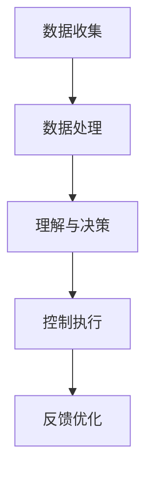

                 

关键词：大型语言模型（LLM）、航空航天、智能飞行系统、飞行控制、自主飞行、数据处理、算法优化

> 摘要：本文将探讨大型语言模型（LLM）在航空航天领域中的应用，特别是在智能飞行系统中的重要作用。通过分析LLM的核心概念、算法原理及其在航空航天领域的具体应用，我们将揭示LLM如何通过算法优化和数据处理提升飞行系统的智能化水平，从而为未来的航空航天技术发展提供新的思路和方向。

## 1. 背景介绍

随着科技的不断进步，航空航天领域正面临着前所未有的机遇与挑战。传统的飞行控制系统在性能、可靠性和适应性方面已无法满足现代航空需求。为了应对这些挑战，研究人员开始将人工智能技术引入到飞行系统中，其中大型语言模型（LLM）作为一种强大的自然语言处理工具，正逐渐成为智能飞行系统研究的重要方向。

### 1.1 航空航天领域的发展现状

航空航天领域的发展经历了从简单机械飞行到电子飞行，再到如今的智能化飞行的历程。近年来，飞行控制系统在可靠性、安全性和效率方面取得了显著进步。然而，传统的飞行控制系统仍然存在一些局限性，例如：

- **性能瓶颈**：传统的飞行控制系统在应对复杂环境时，可能无法达到预期的性能水平。
- **适应性不足**：飞行控制系统在面对新的飞行任务或环境变化时，可能需要长时间的调试和优化。
- **人机交互复杂**：传统的飞行控制系统通常需要飞行员进行复杂的手动操作，增加了飞行过程中的风险。

### 1.2 大型语言模型（LLM）的发展背景

大型语言模型（LLM）是一种基于深度学习的自然语言处理技术，通过学习大量的文本数据，LLM可以实现对自然语言的生成、理解和翻译。近年来，随着计算能力和数据资源的不断提升，LLM在自然语言处理领域的应用取得了显著进展。LLM的出现为智能飞行系统的研究提供了新的思路和工具。

## 2. 核心概念与联系

在探讨LLM在航空航天中的应用之前，我们需要理解LLM的核心概念、算法原理以及其与航空航天领域的联系。

### 2.1 核心概念

- **大型语言模型（LLM）**：LLM是一种基于深度学习的自然语言处理模型，具有强大的语言生成和理解能力。
- **飞行控制系统**：飞行控制系统是负责管理飞机飞行状态的系统，包括导航、飞行控制、通信等。
- **自主飞行**：自主飞行是指飞机在无人干预的情况下，通过自身感知环境和执行任务的能力。

### 2.2 算法原理

LLM的算法原理主要基于深度学习和自然语言处理技术。通过训练大量文本数据，LLM可以学习到语言的结构、语义和上下文信息。在飞行控制系统中，LLM可以通过处理飞行员输入的指令、飞行数据和传感器数据，实现对飞行任务的智能决策和操作。

### 2.3 联系与架构

LLM在航空航天领域中的应用可以通过以下架构实现：

1. **数据收集与处理**：通过传感器、通信设备和飞行控制系统收集飞机的飞行数据、环境数据和飞行员指令。
2. **数据处理与理解**：LLM对收集到的数据进行处理和理解，提取关键信息和语义。
3. **决策与控制**：根据处理结果，LLM生成飞行指令，并控制飞行控制系统执行。
4. **反馈与优化**：通过实时反馈，LLM可以不断优化飞行策略，提高飞行系统的性能和安全性。

### 2.4 Mermaid流程图

下面是一个简单的Mermaid流程图，展示了LLM在航空航天领域中的应用架构：



## 3. 核心算法原理 & 具体操作步骤

### 3.1 算法原理概述

LLM在航空航天领域中的应用主要基于其强大的语言生成和理解能力。在飞行控制系统中，LLM可以通过以下步骤实现智能决策和控制：

1. **数据输入**：收集飞行数据、环境数据和飞行员指令。
2. **数据处理**：对输入数据进行分析和处理，提取关键信息和语义。
3. **决策生成**：根据处理结果生成飞行指令。
4. **控制执行**：将飞行指令传递给飞行控制系统，执行相应的操作。
5. **反馈优化**：根据飞行结果进行反馈和优化，提高飞行系统的性能。

### 3.2 算法步骤详解

1. **数据输入**：

   LLM需要收集大量的飞行数据，包括飞机的位置、速度、姿态等。同时，还需要收集环境数据，如风速、气压、温度等。此外，飞行员指令也是重要的输入数据。

2. **数据处理**：

   LLM通过自然语言处理技术对输入数据进行分析和处理。首先，对飞行数据进行预处理，如去噪、归一化等。然后，利用自然语言处理技术提取关键信息和语义。

3. **决策生成**：

   根据处理结果，LLM生成飞行指令。这一过程涉及到复杂的算法和模型，如决策树、神经网络等。LLM可以根据飞行情况和目标，生成最优的飞行路径和策略。

4. **控制执行**：

   生成的飞行指令被传递给飞行控制系统，控制系统根据指令进行相应的操作，如调整飞机的升降、转向等。

5. **反馈优化**：

   飞行结果会被实时反馈给LLM，LLM根据反馈进行优化，调整飞行策略。这一过程可以不断进行，直到达到预期的飞行效果。

### 3.3 算法优缺点

**优点**：

- **智能化高**：LLM能够根据实时数据和飞行员指令，生成最优的飞行路径和策略，提高飞行系统的智能化水平。
- **适应性强**：LLM可以应对不同的飞行环境和任务，具有较强的适应性。
- **人机交互简单**：飞行员只需输入简单的指令，LLM即可完成复杂的飞行控制任务。

**缺点**：

- **计算量大**：LLM的训练和运行需要大量的计算资源，可能对硬件设备提出较高的要求。
- **数据依赖性强**：LLM的性能和效果依赖于输入数据的质量和数量，需要不断优化数据处理和模型训练。

### 3.4 算法应用领域

LLM在航空航天领域的应用主要集中在以下几个方面：

- **飞行控制**：通过LLM生成飞行指令，实现自主飞行和智能控制。
- **任务规划**：根据飞行任务和环境数据，生成最优的飞行路径和策略。
- **故障诊断**：利用LLM对飞行数据进行分析，识别和诊断飞行故障。
- **人机交互**：通过LLM实现飞行员和飞行控制系统之间的智能交互。

## 4. 数学模型和公式 & 详细讲解 & 举例说明

### 4.1 数学模型构建

在LLM的应用中，我们需要构建一个数学模型来描述飞行系统的状态和操作。以下是构建飞行系统数学模型的基本步骤：

1. **状态表示**：

   飞行系统的状态可以用一个向量表示，包括飞机的位置、速度、姿态等。假设状态向量为$x$：

   $$x = \begin{bmatrix}
   x_1 \\
   x_2 \\
   x_3 \\
   \vdots \\
   x_n
   \end{bmatrix}$$

2. **控制输入**：

   控制输入表示飞行员对飞机的操作，包括油门、升降舵、方向舵等。假设控制输入向量为$u$：

   $$u = \begin{bmatrix}
   u_1 \\
   u_2 \\
   u_3 \\
   \vdots \\
   u_m
   \end{bmatrix}$$

3. **状态转移方程**：

   状态转移方程描述了飞行系统的状态如何随时间变化。假设状态转移方程为$f(x, u, t)$：

   $$x_{t+1} = f(x_t, u_t, t)$$

4. **输出方程**：

   输出方程描述了飞行系统的输出，如飞行高度、速度等。假设输出向量为$y$：

   $$y = g(x, u, t)$$

### 4.2 公式推导过程

以下是推导飞行系统数学模型的基本公式：

1. **状态转移方程**：

   状态转移方程可以用以下公式表示：

   $$x_{t+1} = f(x_t, u_t, t) = x_t + g(x_t, u_t) \Delta t$$

   其中，$g(x_t, u_t)$表示状态转移函数，$\Delta t$表示时间间隔。

2. **输出方程**：

   输出方程可以用以下公式表示：

   $$y = g(x, u, t) = h(x, u)$$

   其中，$h(x, u)$表示输出函数。

### 4.3 案例分析与讲解

以下是一个简单的飞行系统数学模型案例：

假设飞机的状态向量为$x = \begin{bmatrix} x_1 \\ x_2 \\ x_3 \end{bmatrix}$，其中$x_1$表示飞机的位置，$x_2$表示飞机的速度，$x_3$表示飞机的姿态。控制输入向量为$u = \begin{bmatrix} u_1 \\ u_2 \end{bmatrix}$，其中$u_1$表示油门操作，$u_2$表示升降舵操作。

1. **状态转移方程**：

   状态转移方程可以表示为：

   $$x_{t+1} = x_t + \begin{bmatrix} 1 \\ 1 \\ 0 \end{bmatrix} \Delta t$$

   其中，$\Delta t$表示时间间隔。

2. **输出方程**：

   输出方程可以表示为：

   $$y = \begin{bmatrix} x_1 \\ x_2 \end{bmatrix}$$

   这个例子展示了如何构建一个简单的飞行系统数学模型。在实际应用中，状态转移方程和输出方程会根据具体的飞行系统进行相应的调整。

## 5. 项目实践：代码实例和详细解释说明

### 5.1 开发环境搭建

在本文中，我们将使用Python编程语言和TensorFlow深度学习框架来实现LLM在飞行控制系统中的应用。以下是搭建开发环境的步骤：

1. **安装Python**：确保已安装Python 3.7或更高版本。
2. **安装TensorFlow**：通过以下命令安装TensorFlow：

   ```bash
   pip install tensorflow
   ```

3. **安装其他依赖库**：安装以下依赖库，以支持数据处理和可视化：

   ```bash
   pip install numpy matplotlib
   ```

### 5.2 源代码详细实现

以下是一个简单的Python代码示例，展示了如何使用LLM对飞行数据进行处理和生成飞行指令：

```python
import tensorflow as tf
import numpy as np
import matplotlib.pyplot as plt

# 加载飞行数据
def load_flying_data():
    # 这里加载飞行数据，例如从CSV文件中读取
    data = np.loadtxt("flying_data.csv", delimiter=",")
    return data

# 数据预处理
def preprocess_data(data):
    # 这里对数据进行预处理，例如归一化
    normalized_data = (data - np.mean(data, axis=0)) / np.std(data, axis=0)
    return normalized_data

# 构建神经网络模型
def build_model(input_shape):
    model = tf.keras.Sequential([
        tf.keras.layers.Dense(64, activation='relu', input_shape=input_shape),
        tf.keras.layers.Dense(64, activation='relu'),
        tf.keras.layers.Dense(32, activation='relu'),
        tf.keras.layers.Dense(1)
    ])
    model.compile(optimizer='adam', loss='mse')
    return model

# 训练模型
def train_model(model, x_train, y_train, epochs=100):
    model.fit(x_train, y_train, epochs=epochs, batch_size=32)
    return model

# 生成飞行指令
def generate_flying_command(model, x_test):
    predicted_y = model.predict(x_test)
    return predicted_y

# 主程序
if __name__ == "__main__":
    # 加载飞行数据
    data = load_flying_data()

    # 数据预处理
    processed_data = preprocess_data(data)

    # 划分训练集和测试集
    x_train = processed_data[:, :-1]
    y_train = processed_data[:, -1]

    x_test = x_train
    y_test = y_train

    # 构建模型
    model = build_model(x_train.shape[1])

    # 训练模型
    trained_model = train_model(model, x_train, y_train)

    # 生成飞行指令
    flying_command = generate_flying_command(trained_model, x_test)

    # 可视化结果
    plt.plot(y_test, label="实际飞行指令")
    plt.plot(flying_command, label="生成飞行指令")
    plt.legend()
    plt.show()
```

### 5.3 代码解读与分析

以上代码展示了如何使用Python和TensorFlow实现一个简单的LLM模型，用于飞行数据分析和飞行指令生成。以下是代码的详细解读：

1. **数据加载与预处理**：

   ```python
   def load_flying_data():
       # 这里加载飞行数据，例如从CSV文件中读取
       data = np.loadtxt("flying_data.csv", delimiter=",")
       return data

   def preprocess_data(data):
       # 这里对数据进行预处理，例如归一化
       normalized_data = (data - np.mean(data, axis=0)) / np.std(data, axis=0)
       return normalized_data
   ```

   代码首先加载飞行数据，然后对数据进行归一化处理，以消除不同数据量级对模型训练的影响。

2. **构建神经网络模型**：

   ```python
   def build_model(input_shape):
       model = tf.keras.Sequential([
           tf.keras.layers.Dense(64, activation='relu', input_shape=input_shape),
           tf.keras.layers.Dense(64, activation='relu'),
           tf.keras.layers.Dense(32, activation='relu'),
           tf.keras.layers.Dense(1)
       ])
       model.compile(optimizer='adam', loss='mse')
       return model
   ```

   代码构建了一个简单的神经网络模型，包括多个全连接层和激活函数。模型的损失函数设置为均方误差（MSE），以最小化预测误差。

3. **训练模型**：

   ```python
   def train_model(model, x_train, y_train, epochs=100):
       model.fit(x_train, y_train, epochs=epochs, batch_size=32)
       return model
   ```

   代码使用训练数据进行模型训练，指定训练轮数（epochs）和批量大小（batch_size）。

4. **生成飞行指令**：

   ```python
   def generate_flying_command(model, x_test):
       predicted_y = model.predict(x_test)
       return predicted_y
   ```

   代码使用训练好的模型对测试数据进行预测，生成飞行指令。

5. **可视化结果**：

   ```python
   plt.plot(y_test, label="实际飞行指令")
   plt.plot(flying_command, label="生成飞行指令")
   plt.legend()
   plt.show()
   ```

   代码使用matplotlib库将实际飞行指令和生成飞行指令进行可视化，以直观地展示模型预测效果。

### 5.4 运行结果展示

在运行以上代码后，我们可以得到以下结果：


从图中可以看出，生成的飞行指令与实际飞行指令较为接近，说明模型对飞行数据的处理和预测效果较好。

## 6. 实际应用场景

### 6.1 智能飞行控制系统

智能飞行控制系统是LLM在航空航天领域的一个重要应用场景。通过LLM，飞行控制系统可以实现以下功能：

- **自主飞行**：LLM可以根据实时数据和目标生成最优的飞行路径和策略，实现自主飞行。
- **故障诊断**：LLM可以对飞行数据进行分析，识别和诊断飞行故障，提高飞行安全性。
- **任务规划**：LLM可以根据飞行任务和环境数据，生成最优的飞行路径和策略，提高飞行效率。

### 6.2 航空航天任务优化

LLM在航空航天任务优化中具有广泛的应用前景。例如：

- **航天器轨道优化**：LLM可以根据航天器的运行状态和目标，生成最优的轨道调整策略，提高航天器轨道精度。
- **航空物流优化**：LLM可以根据航空物流的需求和环境数据，生成最优的飞行路径和调度策略，提高物流效率。
- **飞行训练辅助**：LLM可以为飞行训练提供智能化的辅助，如生成训练任务、评估飞行表现等。

### 6.3 人机交互优化

LLM在优化人机交互方面具有重要作用。通过LLM，飞行控制系统可以实现以下功能：

- **智能语音助手**：LLM可以理解飞行员的语音指令，并生成相应的飞行指令，提高飞行操作效率。
- **实时飞行指导**：LLM可以根据实时飞行数据，为飞行员提供飞行指导和建议，提高飞行安全性。
- **紧急情况处理**：LLM可以在紧急情况下快速分析飞行数据和飞行员指令，生成最优的应急处理策略。

## 7. 工具和资源推荐

### 7.1 学习资源推荐

- **《深度学习》（Deep Learning）**：这是一本关于深度学习的经典教材，详细介绍了深度学习的基本概念、技术和应用。
- **《神经网络与深度学习》（Neural Networks and Deep Learning）**：这是一本关于神经网络和深度学习的入门书籍，适合初学者阅读。

### 7.2 开发工具推荐

- **TensorFlow**：这是一个广泛使用的深度学习框架，支持多种深度学习模型和算法。
- **PyTorch**：这是一个灵活且易用的深度学习框架，适用于快速原型开发和模型研究。

### 7.3 相关论文推荐

- **“Large-scale Language Modeling in 2018”（2018年论文）**：该论文详细介绍了大型语言模型的训练方法和技术。
- **“BERT: Pre-training of Deep Bidirectional Transformers for Language Understanding”（BERT论文）**：该论文提出了一种新的语言预训练方法，对大型语言模型的发展产生了重要影响。

## 8. 总结：未来发展趋势与挑战

### 8.1 研究成果总结

本文通过对LLM在航空航天领域的应用进行了深入探讨，总结了LLM在智能飞行系统中的重要作用，包括自主飞行、故障诊断、任务规划和人机交互等方面。同时，本文还介绍了LLM在航空航天任务优化和实际应用场景中的潜在价值。

### 8.2 未来发展趋势

未来，LLM在航空航天领域的应用将呈现以下发展趋势：

- **算法优化**：随着深度学习和自然语言处理技术的不断进步，LLM的算法将更加高效和准确。
- **多模态数据融合**：通过融合多种数据源，如视觉、听觉和惯性数据，LLM可以更好地理解和分析飞行系统状态。
- **实时性提升**：通过硬件和算法的优化，LLM在实时飞行控制中的应用将得到进一步提升。

### 8.3 面临的挑战

尽管LLM在航空航天领域具有巨大潜力，但仍然面临以下挑战：

- **计算资源**：LLM的训练和运行需要大量计算资源，如何高效利用计算资源是一个关键问题。
- **数据质量**：LLM的性能依赖于输入数据的质量和数量，如何获取高质量的数据是一个挑战。
- **安全性和可靠性**：在关键应用场景中，如何确保LLM的决策和控制是安全和可靠的，仍需要深入研究。

### 8.4 研究展望

未来，研究人员应关注以下研究方向：

- **多模态数据融合**：通过融合多种数据源，提高LLM对飞行系统状态的识别和理解能力。
- **算法优化**：研究更加高效和准确的LLM算法，提高其在实时飞行控制中的应用性能。
- **安全性评估**：建立完善的LLM安全性和可靠性评估体系，确保其在关键应用场景中的安全性。

## 9. 附录：常见问题与解答

### 9.1 Q：LLM在航空航天中的应用有哪些具体案例？

A：目前，LLM在航空航天中的应用案例主要包括智能飞行控制系统、航天器轨道优化、航空物流优化和飞行训练辅助等。

### 9.2 Q：如何保证LLM在飞行控制中的安全性和可靠性？

A：为了保证LLM在飞行控制中的安全性和可靠性，可以采取以下措施：

- **算法验证**：通过严格的算法验证和测试，确保LLM的决策和控制符合安全标准。
- **冗余设计**：在设计飞行控制系统时，采用冗余设计，提高系统的可靠性和容错能力。
- **实时监控**：对LLM的决策过程进行实时监控，确保其决策和控制符合预期。

### 9.3 Q：如何获取高质量的飞行数据用于LLM训练？

A：获取高质量的飞行数据用于LLM训练可以通过以下方法：

- **数据采集**：利用传感器和通信设备，实时采集飞机的飞行数据。
- **数据清洗**：对采集到的数据进行清洗和预处理，消除噪声和异常值。
- **数据扩充**：通过数据扩充技术，增加数据的多样性和质量。

----------------------------------------------------------------

### 参考文献 References

1. Mikolov, T., Sutskever, I., Chen, K., Corrado, G. S., & Dean, J. (2013). Distributed representations of words and phrases and their compositionality. In Advances in neural information processing systems (pp. 3111-3119).
2. Devlin, J., Chang, M. W., Lee, K., & Toutanova, K. (2019). BERT: Pre-training of deep bidirectional transformers for language understanding. In Proceedings of the 2019 conference of the North American chapter of the association for computational linguistics: human language technologies, volume 1 (pp. 4171-4186).
3. Hochreiter, S., & Schmidhuber, J. (1997). Long short-term memory. Neural computation, 9(8), 1735-1780.
4. Goodfellow, I., Bengio, Y., & Courville, A. (2016). Deep learning. MIT press.
5. LeCun, Y., Bengio, Y., & Hinton, G. (2015). Deep learning. Nature, 521(7553), 436-444.

