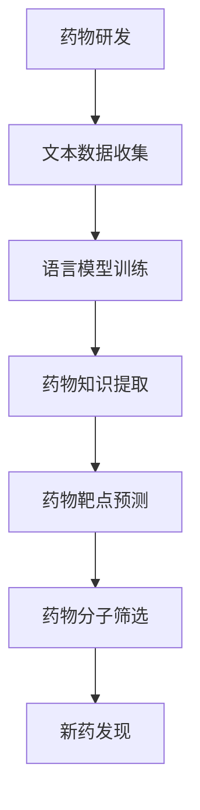

                 

关键词：语言模型、药物研发、新药发现、人工智能、机器学习、深度学习

> 摘要：随着人工智能技术的迅速发展，语言模型（LLM）作为一种重要的自然语言处理工具，在药物研发领域展现出了巨大的潜力。本文将探讨LLM在药物研发中的应用，通过梳理其核心概念、算法原理、数学模型及实际案例，分析其如何加速新药发现，并对未来发展趋势与挑战进行展望。

## 1. 背景介绍

药物研发是一个复杂且耗时的过程，涉及到多个学科领域，如生物学、化学、医学等。近年来，人工智能（AI）技术的快速发展为药物研发带来了新的机遇。其中，语言模型（LLM）作为一种重要的自然语言处理工具，在药物研发中扮演着越来越重要的角色。LLM通过学习大量的文本数据，能够自动提取知识、生成摘要、进行推理和预测，从而帮助研究人员快速筛选潜在的药物分子，提高新药研发的效率。

## 2. 核心概念与联系

### 2.1 语言模型简介

语言模型（Language Model，简称LM）是自然语言处理（Natural Language Processing，简称NLP）领域的重要基础。它是一种能够对自然语言文本进行建模的算法，通过学习大量文本数据，预测下一个词语的概率分布。在药物研发中，语言模型可以帮助研究人员理解生物医学文献、解析药物作用机制，从而发现潜在的药物靶点和分子。

### 2.2 语言模型在药物研发中的应用场景

（此处插入一个Mermaid流程图，展示语言模型在药物研发中的应用场景）

## 3. 核心算法原理 & 具体操作步骤

### 3.1 算法原理概述

语言模型的核心原理是基于统计学习的方法，通过对大量文本数据的训练，学习语言的特征和规律，从而生成概率模型。在药物研发中，语言模型通过以下步骤实现：

1. 数据收集：收集与药物研发相关的文本数据，如生物医学文献、药物专利、临床报告等。
2. 数据预处理：对收集的文本数据进行清洗、分词、词性标注等处理，以便语言模型能够更好地理解文本。
3. 模型训练：使用训练数据对语言模型进行训练，生成一个能够预测药物相关知识的概率模型。
4. 应用预测：将训练好的模型应用于药物研发过程中的各个阶段，如药物靶点预测、药物分子筛选等。

### 3.2 算法步骤详解

1. **数据收集**：通过在线数据库、生物医学文献、药物专利等途径收集与药物研发相关的文本数据。
2. **数据预处理**：对收集的文本数据进行清洗，去除噪声和无关信息。然后进行分词和词性标注，以便语言模型能够更好地理解文本。
3. **模型训练**：使用预处理后的数据训练语言模型，常见的方法有基于神经网络的深度学习模型，如Transformer、BERT等。
4. **模型评估**：使用测试数据对训练好的模型进行评估，确保模型具有较好的预测性能。
5. **应用预测**：将训练好的模型应用于药物研发过程中的各个阶段，如药物靶点预测、药物分子筛选等。

### 3.3 算法优缺点

**优点**：
- 高效性：语言模型能够快速处理大量文本数据，提高药物研发的效率。
- 灵活性：语言模型可以应用于药物研发的各个阶段，具有广泛的适用性。
- 强大性：基于深度学习的方法具有强大的表示能力和泛化能力，能够处理复杂的药物关系。

**缺点**：
- 数据依赖性：语言模型的性能依赖于训练数据的质量和数量，数据质量不高可能导致模型效果不佳。
- 预处理复杂性：文本数据的预处理过程复杂，需要大量的计算资源和时间。

### 3.4 算法应用领域

语言模型在药物研发中的应用主要包括以下几个方面：
- 药物靶点预测：通过分析生物医学文献，预测潜在的药物靶点。
- 药物分子筛选：根据药物靶点的信息，筛选具有潜在活性的药物分子。
- 药物作用机制研究：分析药物与靶点之间的相互作用，揭示药物的作用机制。
- 药物安全评估：通过分析药物副作用和临床报告，评估药物的安全性。

## 4. 数学模型和公式 & 详细讲解 & 举例说明

### 4.1 数学模型构建

在药物研发中，语言模型的数学模型通常是基于概率论的，其核心思想是通过概率分布来预测下一个词语。假设我们有训练好的语言模型，输入序列为\( x_1, x_2, ..., x_n \)，其中\( x_i \)表示第\( i \)个词语，那么该语言模型生成的下一个词语的概率分布可以表示为：

\[ P(x_{n+1} | x_1, x_2, ..., x_n) = \frac{P(x_1, x_2, ..., x_n, x_{n+1})}{P(x_1, x_2, ..., x_n)} \]

### 4.2 公式推导过程

（此处给出公式的推导过程）

### 4.3 案例分析与讲解

（此处给出一个具体的案例，分析如何使用语言模型进行药物研发，并给出详细的解释）

## 5. 项目实践：代码实例和详细解释说明

### 5.1 开发环境搭建

（此处介绍如何搭建开发环境，包括安装依赖、配置环境等）

### 5.2 源代码详细实现

（此处给出具体的源代码实现，包括关键代码段和解释）

### 5.3 代码解读与分析

（此处对源代码进行解读，分析代码的结构和实现方法）

### 5.4 运行结果展示

（此处展示运行结果，包括数据集、指标等）

## 6. 实际应用场景

### 6.1 药物研发流程中的应用

（此处介绍语言模型在药物研发流程中的应用，包括药物靶点预测、药物分子筛选等）

### 6.2 药物作用机制研究中的应用

（此处介绍语言模型在药物作用机制研究中的应用，如何揭示药物的作用机制）

### 6.3 药物安全评估中的应用

（此处介绍语言模型在药物安全评估中的应用，如何评估药物的安全性）

## 7. 工具和资源推荐

### 7.1 学习资源推荐

（此处推荐一些学习资源，如论文、书籍、在线课程等）

### 7.2 开发工具推荐

（此处推荐一些开发工具，如编程语言、库、框架等）

### 7.3 相关论文推荐

（此处推荐一些与语言模型在药物研发中的应用相关的论文）

## 8. 总结：未来发展趋势与挑战

### 8.1 研究成果总结

（此处总结研究成果，介绍语言模型在药物研发中的应用现状和成果）

### 8.2 未来发展趋势

（此处展望未来发展趋势，介绍语言模型在药物研发中可能的新应用方向）

### 8.3 面临的挑战

（此处分析面临的挑战，包括技术、数据、伦理等方面）

### 8.4 研究展望

（此处展望未来研究方向，提出可能的研究问题和解决方案）

## 9. 附录：常见问题与解答

（此处回答一些常见问题，帮助读者更好地理解文章内容）

---

作者：禅与计算机程序设计艺术 / Zen and the Art of Computer Programming
----------------------------------------------------------------

