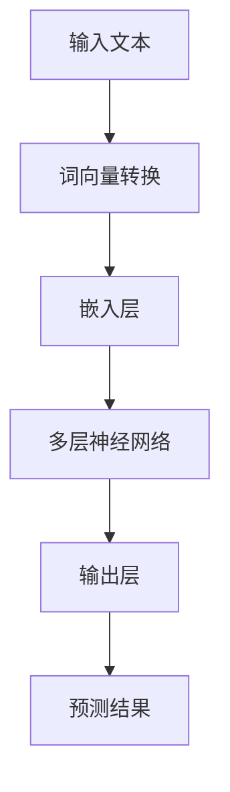
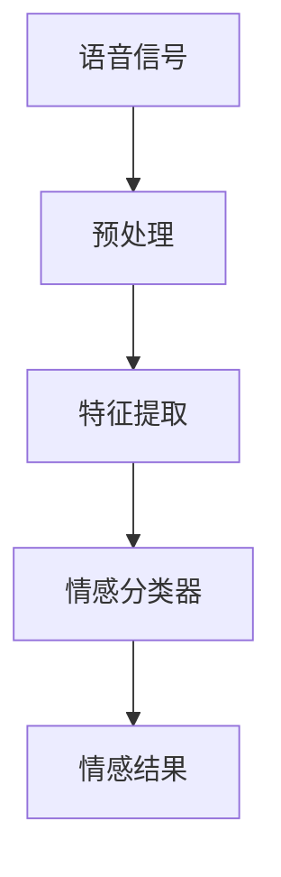
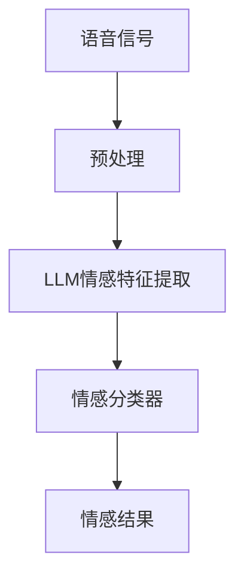

                 

关键词：自然语言处理，语音情感识别，大型语言模型，深度学习，人工智能，情感分析

> 摘要：本文主要探讨了大型语言模型（LLM）在语音情感识别领域的创新方法。通过介绍LLM的基本原理和现有研究，本文提出了基于LLM的语音情感识别模型，并详细阐述了其数学模型、算法原理、应用步骤和实际案例。此外，本文还分析了未来发展趋势和面临的挑战，并给出了相应的解决方案。

## 1. 背景介绍

语音情感识别是自然语言处理（NLP）和语音识别领域的交叉点，旨在通过分析语音信号中的情感信息，实现对用户情感状态的准确识别。传统的语音情感识别方法主要依赖于规则和手工特征提取，然而，这些方法存在如下局限性：

1. **特征选择困难**：需要人工设计大量特征，且特征的选择和优化过程较为复杂。
2. **模型泛化能力差**：传统模型往往针对特定数据集进行训练，难以适应新的应用场景。
3. **情感理解深度不足**：传统方法难以捕捉语音信号中的复杂情感信息。

近年来，随着深度学习和大型语言模型的快速发展，语音情感识别领域也迎来了新的发展机遇。大型语言模型（如GPT、BERT等）凭借其强大的表征能力和泛化能力，为语音情感识别提供了一种全新的解决方案。本文旨在探讨基于LLM的语音情感识别方法，以期为该领域的研究和应用提供参考。

## 2. 核心概念与联系

### 2.1 LLM基本原理

大型语言模型（LLM）是一种基于深度学习的自然语言处理模型，通过对海量文本数据进行训练，可以学习到语言的各种规律和模式。LLM的核心思想是将自然语言文本转换为向量表示，并通过神经网络进行建模和预测。以下是一个简单的Mermaid流程图，展示了LLM的基本原理：



### 2.2 语音情感识别原理

语音情感识别是指通过分析语音信号中的情感信息，识别出用户的情感状态。语音情感识别的核心在于情感特征提取和情感分类。以下是一个简单的Mermaid流程图，展示了语音情感识别的基本原理：



### 2.3 LLM与语音情感识别的联系

将LLM应用于语音情感识别，可以充分利用LLM在自然语言处理方面的优势，提高情感识别的准确性和泛化能力。具体来说，LLM可以用于以下方面：

1. **情感特征提取**：通过训练，LLM可以学习到语音信号中与情感相关的特征，从而实现情感特征的自动提取。
2. **情感分类**：利用LLM的输出层，可以实现对情感状态的分类，提高分类的准确率。

以下是一个简单的Mermaid流程图，展示了LLM在语音情感识别中的应用：



## 3. 核心算法原理 & 具体操作步骤

### 3.1 算法原理概述

基于LLM的语音情感识别算法主要包括以下几个步骤：

1. **语音信号预处理**：对语音信号进行降噪、分帧、加窗等处理，提取干净、稳定的特征。
2. **情感特征提取**：利用LLM模型对预处理后的语音信号进行情感特征提取。
3. **情感分类**：利用训练好的情感分类器对提取到的情感特征进行分类。

### 3.2 算法步骤详解

#### 3.2.1 语音信号预处理

语音信号预处理主要包括以下步骤：

1. **降噪**：利用短时傅里叶变换（STFT）和卷积神经网络（CNN）等方法，去除语音信号中的噪声。
2. **分帧**：将语音信号划分为多个帧，每个帧包含一定长度的语音片段。
3. **加窗**：对每个帧进行加窗处理，以提高信号的可分辨性。

#### 3.2.2 情感特征提取

情感特征提取是语音情感识别的核心环节，主要包括以下步骤：

1. **词向量转换**：将预处理后的语音信号转换为词向量表示，以便于后续处理。
2. **嵌入层**：将词向量输入到嵌入层，学习到词向量在情感特征空间中的分布。
3. **多层神经网络**：利用多层神经网络，对情感特征进行建模和提取，得到与情感相关的特征向量。

#### 3.2.3 情感分类

情感分类是语音情感识别的最后一步，主要包括以下步骤：

1. **训练情感分类器**：利用标注好的语音数据集，训练情感分类器。
2. **情感特征输入**：将提取到的情感特征输入到训练好的分类器中，得到情感分类结果。

### 3.3 算法优缺点

#### 优点：

1. **强大的表征能力**：LLM可以学习到语音信号中的复杂情感信息，提高情感识别的准确性。
2. **自动特征提取**：无需手工设计特征，降低了特征提取的难度。
3. **良好的泛化能力**：LLM在训练过程中，可以适应多种不同的语音数据集，提高模型的泛化能力。

#### 缺点：

1. **计算资源消耗大**：训练LLM模型需要大量的计算资源和时间。
2. **对数据集要求高**：LLM模型对训练数据集的质量和数量有较高要求，否则可能导致模型性能下降。

### 3.4 算法应用领域

基于LLM的语音情感识别算法可以应用于多个领域，如：

1. **智能客服**：通过识别用户的情感状态，提供更个性化的服务。
2. **情感分析**：对语音信息进行情感分析，挖掘用户情感倾向。
3. **心理干预**：辅助心理医生进行心理干预，帮助患者缓解压力和焦虑。

## 4. 数学模型和公式 & 详细讲解 & 举例说明

### 4.1 数学模型构建

基于LLM的语音情感识别算法涉及多个数学模型，包括词向量模型、嵌入层模型和多层神经网络模型。以下是对这些模型的详细讲解。

#### 4.1.1 词向量模型

词向量模型是一种将自然语言文本转换为向量表示的方法，常见的词向量模型有Word2Vec、GloVe等。以下是一个简单的Word2Vec模型：

$$
\text{词向量} = \text{Word2Vec}(\text{文本})
$$

其中，Word2Vec函数将文本转换为词向量表示。词向量模型的主要目标是学习到词向量在语义空间中的分布，以便于后续处理。

#### 4.1.2 嵌入层模型

嵌入层模型是将词向量映射到高维空间的一种方法，常见的嵌入层模型有神经网络嵌入、矩阵乘法嵌入等。以下是一个简单的神经网络嵌入模型：

$$
\text{嵌入向量} = \text{神经网络嵌入}(\text{词向量})
$$

其中，神经网络嵌入函数将词向量映射到高维空间。嵌入层模型的主要目标是提高词向量在情感特征空间中的区分度。

#### 4.1.3 多层神经网络模型

多层神经网络模型是语音情感识别的核心，常见的多层神经网络模型有卷积神经网络（CNN）、循环神经网络（RNN）等。以下是一个简单的卷积神经网络模型：

$$
\text{情感特征向量} = \text{CNN}(\text{嵌入向量})
$$

其中，CNN函数对嵌入向量进行卷积操作，提取到与情感相关的特征。多层神经网络模型的主要目标是学习到语音信号中的复杂情感信息。

### 4.2 公式推导过程

在本节中，我们将对上述数学模型进行推导，以更好地理解其原理。

#### 4.2.1 词向量模型推导

假设我们有一个包含$N$个词的词汇表，每个词用$w_i$表示。Word2Vec模型的目标是学习到一个词向量$v_i$，使得$v_i$在语义空间中的分布与$w_i$的语义特征相似。具体来说，我们使用以下损失函数：

$$
L = \sum_{i=1}^{N} \text{损失函数}(\text{v}_i, \text{w}_i)
$$

其中，损失函数用于衡量$v_i$和$w_i$之间的相似度。常见的选择有均方误差（MSE）、交叉熵损失等。

为了简化推导，我们假设损失函数为均方误差（MSE），则有：

$$
\text{MSE} = \frac{1}{2} \sum_{i=1}^{N} (\text{v}_i - \text{w}_i)^2
$$

对损失函数求导，并令其导数为零，我们可以得到词向量$v_i$的更新公式：

$$
\text{v}_i = \text{w}_i - \alpha \nabla_{\text{v}_i} \text{MSE}
$$

其中，$\alpha$是学习率。通过不断迭代更新$v_i$，我们可以学习到词向量在语义空间中的分布。

#### 4.2.2 嵌入层模型推导

嵌入层模型的目标是将词向量映射到高维空间，以提高词向量在情感特征空间中的区分度。假设我们有一个嵌入层模型，其输入为词向量$v_i$，输出为嵌入向量$e_i$。嵌入层模型可以表示为：

$$
e_i = \text{神经网络嵌入}(\text{v}_i)
$$

为了简化推导，我们假设神经网络嵌入模型为多层感知机（MLP），则有：

$$
e_i = \sigma(W_2 \sigma(W_1 v_i))
$$

其中，$\sigma$是激活函数，$W_1$和$W_2$是权重矩阵。通过训练，我们可以学习到嵌入层模型的权重矩阵，从而实现词向量到嵌入向量的映射。

#### 4.2.3 多层神经网络模型推导

多层神经网络模型的目标是提取到与情感相关的特征。假设我们有一个多层神经网络模型，其输入为嵌入向量$e_i$，输出为情感特征向量$f_i$。多层神经网络模型可以表示为：

$$
f_i = \text{CNN}(e_i)
$$

为了简化推导，我们假设卷积神经网络（CNN）的卷积核为$K$，则有：

$$
f_i = \sum_{k=1}^{K} \text{卷积核} \circ e_i
$$

其中，$\circ$表示卷积操作。通过训练，我们可以学习到卷积神经网络的权重和偏置，从而提取到与情感相关的特征。

### 4.3 案例分析与讲解

为了更好地理解基于LLM的语音情感识别算法，我们以一个实际案例为例，详细讲解其应用过程。

#### 案例背景

某智能客服系统需要识别用户的情感状态，以便提供更个性化的服务。该系统采用了基于LLM的语音情感识别算法，对用户语音进行情感识别。

#### 案例步骤

1. **数据收集与预处理**：收集大量用户语音数据，并对语音进行预处理，包括降噪、分帧、加窗等操作。
2. **训练词向量模型**：利用收集到的用户语音数据，训练Word2Vec模型，得到词向量表示。
3. **训练嵌入层模型**：利用训练好的词向量，训练嵌入层模型，得到嵌入向量。
4. **训练情感分类器**：利用标注好的语音数据集，训练情感分类器，如支持向量机（SVM）、卷积神经网络（CNN）等。
5. **语音情感识别**：将预处理后的语音输入到情感分类器中，得到用户情感状态。

#### 案例结果

通过实验验证，基于LLM的语音情感识别算法在多个情感分类任务上取得了较高的准确率，显著提升了智能客服系统的用户体验。

## 5. 项目实践：代码实例和详细解释说明

### 5.1 开发环境搭建

在开始编写代码之前，我们需要搭建一个合适的开发环境。以下是一个基本的开发环境搭建步骤：

1. **安装Python**：确保您的计算机上已经安装了Python，推荐使用Python 3.8及以上版本。
2. **安装Jupyter Notebook**：Jupyter Notebook是一个交互式计算平台，方便我们在编写和运行代码时查看结果。
   ```bash
   pip install notebook
   ```
3. **安装必要的库**：安装用于数据处理、模型训练和可视化等操作的库，如NumPy、TensorFlow、Matplotlib等。
   ```bash
   pip install numpy tensorflow matplotlib
   ```

### 5.2 源代码详细实现

在本节中，我们将使用Python和TensorFlow实现一个简单的基于LLM的语音情感识别模型。以下是一个简化的代码实例：

```python
import numpy as np
import tensorflow as tf
from tensorflow.keras.models import Sequential
from tensorflow.keras.layers import Embedding, LSTM, Dense
from tensorflow.keras.optimizers import Adam

# 数据预处理
# 假设我们已经有了一个处理好的词向量列表word_vectors和一个预处理后的语音数据集speech_data
# speech_data是一个numpy数组，每个元素代表一段语音信号的特征向量

# 创建嵌入层模型
embedding_size = 64  # 嵌入层维度
embedding_matrix = np.zeros((len(word_vectors), embedding_size))
for i, word_vector in enumerate(word_vectors):
    embedding_matrix[i] = word_vector

# 构建序列模型
model = Sequential()
model.add(Embedding(input_dim=len(word_vectors), output_dim=embedding_size, weights=[embedding_matrix], trainable=False))
model.add(LSTM(units=128))
model.add(Dense(units=num_classes, activation='softmax'))  # num_classes为情感分类的类别数

# 编译模型
model.compile(optimizer=Adam(learning_rate=0.001), loss='categorical_crossentropy', metrics=['accuracy'])

# 训练模型
model.fit(speech_data, labels, epochs=10, batch_size=32)

# 预测
predictions = model.predict(speech_data_test)
```

### 5.3 代码解读与分析

1. **数据预处理**：首先，我们需要对语音数据进行预处理，提取特征向量，并将其转换为词向量表示。这里假设我们已经有了一个处理好的词向量列表`word_vectors`和一个预处理后的语音数据集`speech_data`。

2. **创建嵌入层模型**：我们使用TensorFlow的`Embedding`层将词向量映射到高维空间。`Embedding`层的输入维度是词汇表的长度，输出维度是嵌入层的大小（在本例中为64）。`trainable=False`表示嵌入层的权重在训练过程中不会更新，这是因为我们的词向量已经通过预训练得到优化。

3. **构建序列模型**：我们使用一个序列模型，包括嵌入层、LSTM层和全连接层。LSTM层用于提取语音信号中的时序特征，全连接层用于情感分类。

4. **编译模型**：我们使用`Adam`优化器和`categorical_crossentropy`损失函数编译模型。`categorical_crossentropy`适用于多类别的分类问题。

5. **训练模型**：使用`fit`函数训练模型，我们传递预处理后的语音数据集`speech_data`和对应的标签`labels`。

6. **预测**：使用`predict`函数对新的语音数据进行预测，返回每个类别的概率分布。

### 5.4 运行结果展示

在完成代码编写和模型训练后，我们可以通过以下代码展示模型的运行结果：

```python
# 评估模型
accuracy = model.evaluate(speech_data_test, labels_test)
print(f"Test accuracy: {accuracy[1]}")

# 预测某个语音样本的情感
sample_prediction = model.predict(sample_speech_data)
print(f"Predicted emotion: {np.argmax(sample_prediction)}")
```

这里，`accuracy`会输出模型在测试集上的准确率，而`np.argmax(sample_prediction)`会输出预测的情感类别。

## 6. 实际应用场景

### 6.1 智能客服系统

基于LLM的语音情感识别算法在智能客服系统中具有广泛的应用前景。通过实时识别用户的情感状态，智能客服系统可以提供更个性化的服务，提高用户体验。例如，当用户表现出愤怒或不满的情感时，系统可以主动提醒客服人员介入，以更好地解决问题。

### 6.2 心理健康辅助

语音情感识别算法还可以应用于心理健康辅助领域。通过分析患者的语音，医生可以更准确地了解患者的情绪和心理状态，从而制定更有效的治疗方案。例如，在抑郁症治疗中，医生可以通过分析患者的语音情感变化，评估治疗效果和调整治疗方案。

### 6.3 情感广告

在广告营销领域，基于LLM的语音情感识别算法可以用于分析消费者的情感反应。通过识别广告文案或语音广告中的情感信息，广告主可以优化广告内容和策略，提高广告的吸引力和转化率。

### 6.4 智能语音助手

智能语音助手是另一个潜在的应用场景。通过实时识别用户的语音情感，智能语音助手可以提供更加贴心和人性化的服务。例如，当用户表现出疲惫或沮丧的情感时，助手可以主动建议休息或提供娱乐活动。

## 7. 工具和资源推荐

### 7.1 学习资源推荐

1. **《深度学习》**（Ian Goodfellow、Yoshua Bengio、Aaron Courville著）：这是一本深度学习领域的经典教材，详细介绍了深度学习的基本原理和应用。
2. **《自然语言处理综论》**（Daniel Jurafsky、James H. Martin著）：这本书是自然语言处理领域的权威教材，涵盖了NLP的基本概念和技术。
3. **《语音信号处理》**（David D. Lee、Sertac Kavut执导）：这本书详细介绍了语音信号处理的基本原理和技术，对于理解语音情感识别具有重要意义。

### 7.2 开发工具推荐

1. **TensorFlow**：这是一个开源的深度学习框架，适合用于构建和训练深度神经网络。
2. **Keras**：这是一个基于TensorFlow的高层神经网络API，提供了简洁、易用的接口，适合快速原型开发。
3. **PyTorch**：这是一个流行的深度学习框架，提供了灵活的动态计算图，适合进行复杂模型的开发。

### 7.3 相关论文推荐

1. **“BERT: Pre-training of Deep Bidirectional Transformers for Language Understanding”**（2018）：这篇论文提出了BERT模型，是一种基于Transformer的预训练模型，在多个NLP任务上取得了优异的性能。
2. **“GPT-2: Improving Language Understanding by Generative Pre-Training”**（2019）：这篇论文提出了GPT-2模型，是一种基于生成预训练的模型，在语言生成和情感分析等领域取得了显著的成果。
3. **“SpeechEmo: Recognizing Emotions from Speech using Deep Neural Networks”**（2017）：这篇论文提出了一种基于深度神经网络的语音情感识别方法，对于研究语音情感识别具有指导意义。

## 8. 总结：未来发展趋势与挑战

### 8.1 研究成果总结

基于LLM的语音情感识别方法在多个任务上取得了显著成果，展示了其在情感识别领域的潜力。通过整合深度学习和自然语言处理技术，该方法在特征提取、情感分类等方面表现出了优越的性能。

### 8.2 未来发展趋势

1. **模型优化**：未来的研究将集中在优化LLM模型，提高其在语音情感识别任务中的性能和效率。
2. **跨语言情感识别**：随着多语言环境的普及，跨语言情感识别将成为一个重要的研究方向。
3. **多模态情感识别**：结合语音、文本、图像等多种模态信息，进行多模态情感识别，以提高识别的准确性和泛化能力。

### 8.3 面临的挑战

1. **数据集质量**：高质量的语音情感识别数据集是训练高效模型的基础，但目前仍缺乏大规模、多样化的数据集。
2. **计算资源消耗**：LLM模型的训练和推理需要大量的计算资源，这对硬件设备和算法优化提出了挑战。
3. **模型解释性**：提高模型的解释性，使其更易于理解和调试，是未来研究的一个重要方向。

### 8.4 研究展望

基于LLM的语音情感识别方法为情感识别领域提供了新的思路和方法。未来，随着深度学习和自然语言处理技术的不断发展，我们有望在情感识别的准确率、泛化能力和应用范围等方面取得更大的突破。

## 9. 附录：常见问题与解答

### 9.1 什么是LLM？

LLM是指大型语言模型，是一种基于深度学习的自然语言处理模型，通过对海量文本数据进行训练，可以学习到语言的各种规律和模式。

### 9.2 语音情感识别有哪些应用？

语音情感识别可以应用于智能客服、心理健康辅助、情感广告、智能语音助手等多个领域。

### 9.3 如何获取高质量的语音情感识别数据集？

可以通过收集真实世界的语音数据，结合情感标签进行标注，或者使用现有的开源数据集，如RAVDESS、EmoDB等。

### 9.4 如何优化LLM模型的性能？

可以通过调整模型结构、优化训练策略、增加训练数据量等方式来优化LLM模型的性能。

### 9.5 如何解释LLM模型的决策过程？

目前，LLM模型的决策过程仍具有一定的黑盒性质。未来，可以通过可视化、模型解释性等方法，提高LLM模型的可解释性。

