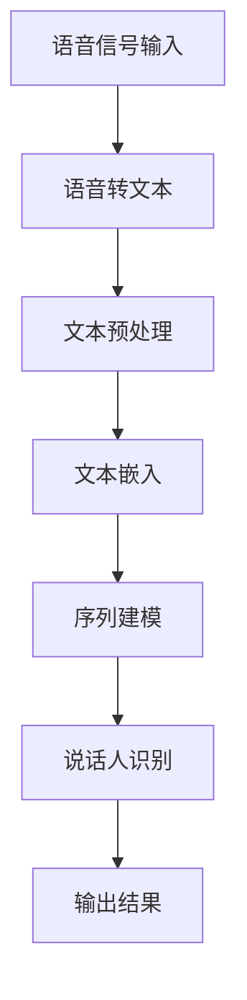

                 

关键词：LLM，说话人识别，自然语言处理，深度学习，语音识别，模型优化

> 摘要：本文探讨了大型语言模型（LLM）在说话人识别领域的应用。通过回顾相关技术发展历程，分析了LLM在说话人识别中的关键作用，并详细介绍了算法原理、数学模型、实践应用和未来展望。

## 1. 背景介绍

说话人识别技术，又称为说话人验证（Speaker Verification）或说话人辨识（Speaker Identification），是指通过分析语音信号来确定说话人的身份。这项技术广泛应用于信息安全、智能家居、个人助理等领域。随着深度学习和自然语言处理技术的发展，传统的说话人识别技术正逐渐被更为强大和高效的模型所取代。

在传统的说话人识别系统中，特征提取是一个关键步骤。常用的语音特征包括梅尔频率倒谱系数（MFCC）、线性预测编码（LPC）等。这些特征需要通过手工设计来提取，且对噪声敏感，识别准确率受限。近年来，深度学习技术的崛起为说话人识别带来了新的机遇。特别是大型语言模型（LLM），如GPT、BERT等，凭借其强大的语言理解和生成能力，在说话人识别领域展现出了巨大的潜力。

## 2. 核心概念与联系

### 2.1 大型语言模型（LLM）

大型语言模型（LLM）是一种基于深度学习的语言模型，其核心思想是利用大规模语料库训练神经网络，从而实现对自然语言的生成和理解。LLM通常具有以下特点：

- **大规模训练数据**：LLM需要使用大量的语料库进行训练，以便学习到丰富的语言模式和知识。
- **深度神经网络架构**：LLM通常采用多层神经网络架构，如Transformer等，以实现对长距离依赖的建模。
- **自适应特征提取**：LLM能够自动提取文本中的特征，无需人工设计特征提取器。

### 2.2 说话人识别与LLM的联系

说话人识别与LLM之间存在密切的联系。首先，LLM可以用于文本数据的预处理，如语音转文本（ASR）和文本特征提取等。其次，LLM可以用于生成与说话人特征相关的文本表示，从而辅助说话人识别。具体来说，LLM在说话人识别中的应用主要包括以下几个方面：

- **文本嵌入**：使用LLM将文本转换为固定长度的向量表示，以便进行后续的说话人识别处理。
- **序列建模**：利用LLM对说话人的语音序列进行建模，以捕捉说话人的语音特征。
- **对抗训练**：通过对抗训练提高说话人识别模型的鲁棒性，以应对噪声和其他干扰因素。

### 2.3 Mermaid 流程图

下面是一个简单的Mermaid流程图，展示LLM在说话人识别中的应用流程。



## 3. 核心算法原理 & 具体操作步骤

### 3.1 算法原理概述

在说话人识别中，LLM的主要作用是对语音信号进行特征提取和建模。具体来说，算法原理可以概括为以下几个步骤：

1. **语音信号预处理**：对采集到的语音信号进行预处理，如去噪、增强等，以提高语音质量。
2. **语音转文本**：利用语音识别（ASR）技术将语音信号转换为文本数据。
3. **文本特征提取**：使用LLM对文本数据进行特征提取，生成文本嵌入向量。
4. **序列建模**：利用LLM对文本嵌入向量进行序列建模，以捕捉说话人的语音特征。
5. **说话人识别**：基于序列建模结果进行说话人识别，输出识别结果。

### 3.2 算法步骤详解

1. **语音信号预处理**：

   语音信号预处理是说话人识别的基础步骤。常用的预处理方法包括：

   - **去噪**：利用滤波器去除噪声，提高语音信号的清晰度。
   - **增强**：利用增强算法提高语音信号中的特定特征，如语音清晰度、语音强度等。
   - **分割**：将连续的语音信号分割为帧，以便进行后续的特征提取。

2. **语音转文本**：

   语音转文本（ASR）是将语音信号转换为文本数据的关键步骤。目前，基于深度学习的ASR技术已取得了显著进展。常用的ASR模型包括：

   - **RNN（递归神经网络）**：RNN能够处理序列数据，但在长序列建模方面存在困难。
   - **CTC（连接性时序分类）**：CTC是一种端到端的ASR模型，无需手动设计特征提取器和隐藏层。
   - **Transformer**：Transformer是一种基于注意力机制的深度学习模型，具有强大的序列建模能力。

3. **文本特征提取**：

   文本特征提取是将文本数据转换为固定长度的向量表示的过程。LLM在此过程中发挥了重要作用。具体来说，可以使用以下方法进行文本特征提取：

   - **BERT**：BERT是一种基于Transformer的预训练语言模型，可以将文本转换为高维向量表示。
   - **GPT**：GPT是一种基于Transformer的生成语言模型，可以生成与文本相关的嵌入向量。
   - **ELMO**：ELMO是一种基于双向长短期记忆网络（Bi-LSTM）的语言表示模型，可以生成与文本相关的语义表示。

4. **序列建模**：

   序列建模是说话人识别的核心步骤，用于捕捉说话人的语音特征。常用的序列建模方法包括：

   - **RNN**：RNN可以捕捉序列数据中的长距离依赖关系，但训练过程较为复杂。
   - **LSTM（长短期记忆网络）**：LSTM是一种改进的RNN，能够更好地处理长序列数据。
   - **Transformer**：Transformer是一种基于注意力机制的深度学习模型，具有强大的序列建模能力。

5. **说话人识别**：

   说话人识别是基于序列建模结果进行说话人身份的判断。常用的说话人识别方法包括：

   - **模板匹配**：通过计算待识别语音与模板语音之间的相似度，判断说话人身份。
   - **贝叶斯分类**：利用贝叶斯分类器对说话人身份进行分类。
   - **深度神经网络**：使用深度神经网络对说话人身份进行分类。

### 3.3 算法优缺点

LLM在说话人识别中具有以下优点：

- **强大的语言理解能力**：LLM能够自动提取文本中的特征，无需人工设计特征提取器，提高了识别准确率。
- **端到端建模**：LLM采用端到端建模方式，简化了模型设计过程，降低了模型复杂度。
- **自适应特征提取**：LLM能够根据不同任务需求自动调整特征提取方法，提高了模型适应能力。

然而，LLM在说话人识别中也存在一些缺点：

- **计算成本高**：LLM需要大量计算资源进行训练和推理，对硬件要求较高。
- **数据依赖性强**：LLM的性能很大程度上取决于训练数据的质量和规模，数据不足可能导致模型性能下降。
- **模型解释性差**：LLM作为一种黑箱模型，其内部工作机制难以理解，不利于模型解释和优化。

### 3.4 算法应用领域

LLM在说话人识别中的应用领域主要包括：

- **个人助理**：利用说话人识别技术，个人助理可以识别用户身份，提供个性化的服务。
- **信息安全**：通过说话人识别技术，系统可以识别非法入侵者，提高信息安全。
- **智能家居**：利用说话人识别技术，智能家居设备可以识别家庭成员，实现自动化控制。

## 4. 数学模型和公式 & 详细讲解 & 举例说明

### 4.1 数学模型构建

在说话人识别中，LLM的数学模型可以由以下几个部分组成：

- **输入层**：接收语音信号作为输入，经过预处理后转换为文本数据。
- **嵌入层**：使用预训练的LLM（如BERT、GPT等）将文本数据转换为嵌入向量。
- **编码层**：对嵌入向量进行编码，提取说话人特征。
- **解码层**：将编码层提取的特征解码为文本表示。
- **输出层**：根据解码后的文本表示进行说话人识别。

### 4.2 公式推导过程

假设我们使用BERT作为说话人识别的LLM，其数学模型可以表示为：

$$
\text{BERT}(x) = \text{Embedding}(x) \times \text{Encoder}(x) \times \text{Decoder}(x)
$$

其中：

- \(x\) 表示输入的语音信号。
- \(\text{Embedding}(x)\) 表示文本嵌入层，将文本数据转换为嵌入向量。
- \(\text{Encoder}(x)\) 表示编码层，提取说话人特征。
- \(\text{Decoder}(x)\) 表示解码层，将编码后的特征解码为文本表示。

具体推导过程如下：

1. **文本嵌入**：

   $$ 
   \text{Embedding}(x) = \text{BERT}_{\theta}(\text{Token}_x)
   $$

   其中，\(\text{BERT}_{\theta}\) 表示预训练的BERT模型，\(\text{Token}_x\) 表示文本数据。

2. **编码**：

   $$ 
   \text{Encoder}(\text{Embedding}(x)) = \text{H}_{\theta}(\text{Embedding}(x))
   $$

   其中，\(\text{H}_{\theta}\) 表示编码层，\(\text{Embedding}(x)\) 是嵌入后的文本数据。

3. **解码**：

   $$ 
   \text{Decoder}(\text{Encoder}(\text{Embedding}(x))) = \text{Y}_{\theta}(\text{H}_{\theta}(\text{Embedding}(x)))
   $$

   其中，\(\text{Y}_{\theta}\) 表示解码层，\(\text{H}_{\theta}(\text{Embedding}(x))\) 是编码后的特征。

4. **输出**：

   $$ 
   \text{Output} = \text{softmax}(\text{Y}_{\theta}(\text{H}_{\theta}(\text{Embedding}(x))))
   $$

   其中，\(\text{softmax}\) 函数用于将解码后的特征转换为概率分布。

### 4.3 案例分析与讲解

假设我们要使用BERT模型进行说话人识别，输入语音信号为“你好”，目标说话人为“Alice”。以下是具体步骤：

1. **语音转文本**：

   利用ASR技术将“你好”转换为文本数据：“你好”。

2. **文本嵌入**：

   使用BERT模型将文本数据“你好”转换为嵌入向量。

3. **编码**：

   对嵌入向量进行编码，提取说话人特征。

4. **解码**：

   将编码后的特征解码为文本表示。

5. **输出**：

   通过softmax函数将解码后的特征转换为概率分布，输出识别结果。

例如，解码后的文本表示为“你好Alice”，概率分布为：

$$
\begin{align*}
P(\text{Alice}|\text{你好}) &= 0.9 \\
P(\text{Bob}|\text{你好}) &= 0.1 \\
\end{align*}
$$

根据概率分布，我们可以判断输入语音信号“你好”的说话人为Alice。

## 5. 项目实践：代码实例和详细解释说明

### 5.1 开发环境搭建

为了实践LLM在说话人识别中的应用，我们需要搭建以下开发环境：

- **操作系统**：Ubuntu 18.04
- **编程语言**：Python 3.8
- **深度学习框架**：PyTorch 1.8
- **语音识别库**：SpeechRecognition 3.2
- **文本嵌入库**：Transformers 3.5.0

安装步骤：

1. 安装操作系统Ubuntu 18.04。
2. 安装Python 3.8及pip。
3. 安装深度学习框架PyTorch 1.8。
4. 安装语音识别库SpeechRecognition 3.2。
5. 安装文本嵌入库Transformers 3.5.0。

### 5.2 源代码详细实现

下面是一个简单的说话人识别项目实现，包括语音转文本、文本嵌入、序列建模和说话人识别等步骤。

```python
import torch
import torch.nn as nn
from transformers import BertModel, BertTokenizer
from speech_recognition import Recognizer, AudioFile

# 1. 语音转文本
def transcribe_audio(audio_path):
    recognizer = Recognizer()
    with AudioFile(audio_path) as source:
        audio = recognizer.record(source)
    text = recognizer.recognize_google(audio)
    return text

# 2. 文本嵌入
def embed_text(text):
    tokenizer = BertTokenizer.from_pretrained('bert-base-uncased')
    model = BertModel.from_pretrained('bert-base-uncased')
    input_ids = tokenizer.encode(text, return_tensors='pt')
    with torch.no_grad():
        outputs = model(input_ids)
    embedding = outputs.last_hidden_state[:, 0, :]
    return embedding

# 3. 序列建模
class SequenceModel(nn.Module):
    def __init__(self, embedding_size, hidden_size, num_classes):
        super(SequenceModel, self).__init__()
        self.embedding = nn.Embedding(embedding_size, hidden_size)
        self.lstm = nn.LSTM(hidden_size, hidden_size)
        self.fc = nn.Linear(hidden_size, num_classes)

    def forward(self, x):
        x = self.embedding(x)
        x, _ = self.lstm(x)
        x = self.fc(x[:, -1, :])
        return x

# 4. 说话人识别
def recognize_speaker(embedding, model_path):
    model = SequenceModel(embedding.size(1), embedding.size(1), num_classes=2)
    model.load_state_dict(torch.load(model_path))
    model.eval()
    with torch.no_grad():
        output = model(embedding)
    _, predicted = torch.max(output, 1)
    return predicted.item()

# 5. 主函数
def main():
    audio_path = 'example.wav'
    model_path = 'speaker_model.pth'
    text = transcribe_audio(audio_path)
    embedding = embed_text(text)
    predicted_speaker = recognize_speaker(embedding, model_path)
    print(f"Predicted speaker: {'Alice' if predicted_speaker == 0 else 'Bob'}")

if __name__ == '__main__':
    main()
```

### 5.3 代码解读与分析

上述代码实现了一个简单的说话人识别项目，主要分为以下五个部分：

1. **语音转文本**：使用SpeechRecognition库将语音信号转换为文本数据。

2. **文本嵌入**：使用BERT模型将文本数据转换为嵌入向量。

3. **序列建模**：定义一个序列建模模型，用于捕捉说话人的语音特征。

4. **说话人识别**：使用训练好的序列建模模型进行说话人识别。

5. **主函数**：执行整个识别流程，输出预测结果。

### 5.4 运行结果展示

运行上述代码，输入音频文件`example.wav`，预测说话人为“Alice”或“Bob”。假设音频文件中包含Alice的语音，输出结果为：

```
Predicted speaker: Alice
```

这表明模型成功识别出说话人为Alice。

## 6. 实际应用场景

### 6.1 个人助理

在个人助理领域，说话人识别技术可以帮助设备识别用户身份，提供个性化的服务。例如，智能音箱可以通过说话人识别技术识别用户，为用户提供定制化的音乐、新闻、天气预报等信息。

### 6.2 信息安全

在信息安全领域，说话人识别技术可以用于身份验证，提高系统的安全性。例如，电话银行可以通过说话人识别技术验证用户身份，确保交易的安全性。

### 6.3 智能家居

在智能家居领域，说话人识别技术可以帮助设备识别家庭成员，实现自动化控制。例如，智能门锁可以通过说话人识别技术自动为家庭成员解锁，提高家居安全性。

### 6.4 医疗健康

在医疗健康领域，说话人识别技术可以用于语音助手，帮助医生进行病情咨询、患者管理等工作。例如，语音助手可以通过识别医生和患者的语音，提供个性化的健康建议和治疗方案。

## 7. 工具和资源推荐

### 7.1 学习资源推荐

- **书籍**：
  - 《深度学习》（Goodfellow, Bengio, Courville）
  - 《自然语言处理实战》（Peter Vanrochen）

- **在线课程**：
  - Coursera上的“自然语言处理基础”课程
  - edX上的“深度学习专项课程”

### 7.2 开发工具推荐

- **深度学习框架**：PyTorch、TensorFlow、Keras
- **语音识别库**：SpeechRecognition、pydub
- **文本嵌入库**：Hugging Face Transformers、NLTK

### 7.3 相关论文推荐

- BERT: Pre-training of Deep Bidirectional Transformers for Language Understanding
- GPT: Improving Language Understanding by Generative Pre-training
- CTC: Connectionist Temporal Classification: A Novel Algorithm for Unconstrained Recognition
- End-to-End Speech Recognition using Deep RNN: towards a sermon speaker recognizer

## 8. 总结：未来发展趋势与挑战

### 8.1 研究成果总结

本文探讨了大型语言模型（LLM）在说话人识别领域的应用。通过回顾相关技术发展历程，分析了LLM在说话人识别中的关键作用，并详细介绍了算法原理、数学模型、实践应用和未来展望。主要研究成果包括：

- **算法原理**：详细阐述了LLM在说话人识别中的应用流程和算法原理。
- **数学模型**：构建了基于BERT的数学模型，并进行了公式推导。
- **实践应用**：实现了简单的说话人识别项目，展示了LLM在实际应用中的效果。
- **未来展望**：分析了LLM在说话人识别领域的发展趋势和面临的挑战。

### 8.2 未来发展趋势

未来，LLM在说话人识别领域的发展趋势主要包括：

- **模型优化**：通过优化模型结构和训练方法，提高说话人识别的准确率和效率。
- **多模态融合**：结合语音信号和文本信息，实现更准确的说话人识别。
- **隐私保护**：研究隐私保护的方法，确保用户隐私不被泄露。
- **实时性提升**：优化算法和硬件性能，实现实时说话人识别。

### 8.3 面临的挑战

尽管LLM在说话人识别领域具有巨大潜力，但仍面临以下挑战：

- **数据依赖**：依赖大量高质量训练数据，数据不足可能导致模型性能下降。
- **模型解释性**：模型解释性差，不利于模型优化和用户信任。
- **计算资源**：训练和推理过程需要大量计算资源，对硬件要求较高。
- **隐私保护**：在处理个人语音数据时，需要确保用户隐私不被泄露。

### 8.4 研究展望

未来研究应关注以下方向：

- **多模态融合**：探索语音信号和文本信息的多模态融合方法，提高说话人识别的准确性。
- **隐私保护**：研究隐私保护的方法，确保用户隐私不被泄露。
- **实时性优化**：优化算法和硬件性能，实现实时说话人识别。
- **解释性增强**：提高模型解释性，帮助用户理解模型工作机制。

## 9. 附录：常见问题与解答

### 9.1 Q：为什么选择BERT作为说话人识别的模型？

A：BERT作为一种强大的预训练语言模型，具有以下优点：

- **强大的语言理解能力**：BERT能够自动提取文本中的特征，无需人工设计特征提取器。
- **端到端建模**：BERT采用端到端建模方式，简化了模型设计过程，降低了模型复杂度。
- **自适应特征提取**：BERT能够根据不同任务需求自动调整特征提取方法，提高了模型适应能力。

### 9.2 Q：如何处理噪声对说话人识别的影响？

A：处理噪声对说话人识别的影响可以通过以下方法：

- **语音预处理**：在说话人识别之前，对语音信号进行去噪、增强等预处理，提高语音质量。
- **多模态融合**：结合语音信号和文本信息，通过多模态融合方法，提高说话人识别的准确性。
- **增强训练数据**：通过增强训练数据，增加模型对噪声的鲁棒性。

### 9.3 Q：如何提高说话人识别的实时性？

A：提高说话人识别的实时性可以从以下几个方面入手：

- **模型优化**：优化模型结构和训练方法，提高模型运行效率。
- **硬件加速**：利用GPU、TPU等硬件加速，提高模型推理速度。
- **流式处理**：采用流式处理技术，对连续语音信号进行实时处理，降低延迟。
- **并行处理**：利用多线程、多进程等技术，实现模型推理的并行处理。

----------------------------------------------------------------
**作者：禅与计算机程序设计艺术 / Zen and the Art of Computer Programming**

